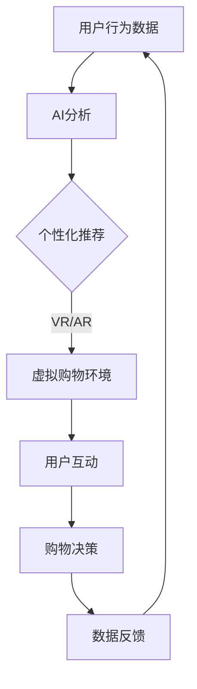

                 

### 沉浸式购物体验：AI打造未来电商新场景

> **关键词：** 沉浸式购物、人工智能、电商、虚拟现实、自然语言处理、个性化推荐、用户体验  
>
> **摘要：** 本文将探讨人工智能如何在未来电商中打造全新的沉浸式购物体验。通过深度学习、自然语言处理、虚拟现实等技术，AI不仅能够优化用户界面和推荐系统，还能实现更加个性化和互动的购物体验。本文将从背景介绍、核心概念与联系、算法原理与数学模型、项目实战、实际应用场景等方面展开讨论，旨在为读者提供一个全面深入的理解。

---

在电商领域，用户对购物体验的要求越来越高，不再满足于简单的商品展示和购买流程。他们期望购物过程能够更加个性化和互动，能够沉浸在真实的购物场景中，享受沉浸式体验。而人工智能（AI）技术的迅猛发展，为电商领域带来了前所未有的机遇。本文将探讨AI如何打造未来电商的沉浸式购物新场景。

---

## 1. 背景介绍

### 1.1 目的和范围

本文旨在分析AI在打造沉浸式购物体验中的应用，探讨其技术原理、实现步骤和实际应用场景。通过本文的阅读，读者将能够：

- 理解沉浸式购物体验的概念和重要性；
- 掌握AI在沉浸式购物中的应用技术和原理；
- 了解沉浸式购物体验的实际应用场景和未来发展趋势。

### 1.2 预期读者

本文面向的读者主要包括：

- 对电商和AI技术有兴趣的初学者；
- 想要了解沉浸式购物体验的开发者；
- 对AI在电商领域应用感兴趣的从业者。

### 1.3 文档结构概述

本文将分为以下几个部分：

- **第1章：背景介绍**：介绍本文的目的、预期读者和文档结构；
- **第2章：核心概念与联系**：阐述沉浸式购物体验和AI技术的基础概念和联系；
- **第3章：核心算法原理 & 具体操作步骤**：讲解沉浸式购物体验的核心算法原理和操作步骤；
- **第4章：数学模型和公式 & 详细讲解 & 举例说明**：介绍沉浸式购物体验中使用的数学模型和公式，并给出详细讲解和实例；
- **第5章：项目实战：代码实际案例和详细解释说明**：通过实际项目案例展示沉浸式购物体验的实现过程和代码解读；
- **第6章：实际应用场景**：探讨沉浸式购物体验在现实中的应用场景；
- **第7章：工具和资源推荐**：推荐学习资源和开发工具；
- **第8章：总结：未来发展趋势与挑战**：总结本文的主要观点，探讨未来的发展趋势和挑战；
- **第9章：附录：常见问题与解答**：解答读者可能遇到的问题；
- **第10章：扩展阅读 & 参考资料**：提供更多的学习资源和参考。

### 1.4 术语表

#### 1.4.1 核心术语定义

- **沉浸式购物体验**：一种通过虚拟现实（VR）或增强现实（AR）技术，使购物过程具有高度沉浸感和互动性的购物方式。
- **人工智能（AI）**：模拟人类智能行为的计算机技术，包括机器学习、深度学习、自然语言处理等。
- **个性化推荐**：根据用户的历史行为和偏好，为其推荐感兴趣的商品或服务。

#### 1.4.2 相关概念解释

- **虚拟现实（VR）**：通过计算机技术模拟出一个三维的虚拟世界，用户可以通过头戴式显示器和跟踪设备进入这个虚拟世界。
- **增强现实（AR）**：在现实世界中叠加虚拟信息，使用户能够看到现实世界中的虚拟对象。
- **自然语言处理（NLP）**：使计算机能够理解和处理人类自然语言的技术。

#### 1.4.3 缩略词列表

- **AI**：人工智能（Artificial Intelligence）
- **VR**：虚拟现实（Virtual Reality）
- **AR**：增强现实（Augmented Reality）
- **NLP**：自然语言处理（Natural Language Processing）

---

接下来，我们将进一步探讨沉浸式购物体验的核心概念和技术原理。

## 2. 核心概念与联系

在探讨如何打造沉浸式购物体验之前，我们需要明确一些核心概念和技术，这些概念和技术之间的联系将为我们提供理论基础。

### 2.1 沉浸式购物体验的概念

沉浸式购物体验是一种通过虚拟现实（VR）或增强现实（AR）技术，为用户提供高度沉浸感和互动性的购物方式。这种体验能够模拟现实世界的购物场景，让用户仿佛置身于一个真实的购物环境中。沉浸式购物体验不仅提升了用户的购物乐趣，还能够增强用户的购物决策能力。

### 2.2 人工智能（AI）的概念

人工智能（AI）是模拟人类智能行为的计算机技术，包括机器学习、深度学习、自然语言处理等多个方面。AI在电商中的应用主要体现在个性化推荐、用户行为分析、智能客服等方面，通过分析用户的行为数据，为用户提供更加个性化的购物体验。

### 2.3 虚拟现实（VR）和增强现实（AR）的概念

虚拟现实（VR）和增强现实（AR）是沉浸式购物体验的重要技术支撑。VR通过头戴式显示器和跟踪设备，将用户完全带入一个三维的虚拟世界，让用户感受到身临其境的购物体验。AR则在现实世界中叠加虚拟信息，使用户能够看到现实世界中的虚拟对象，从而实现更加丰富的购物体验。

### 2.4 AI、VR和AR之间的联系

AI、VR和AR之间的联系在于它们共同为用户提供了一种高度沉浸感和互动性的购物体验。AI通过对用户行为数据的分析，为VR和AR提供了个性化的推荐和互动内容。VR和AR则为AI提供了展示和实现这些个性化内容的技术平台。

### 2.5 核心概念原理和架构的 Mermaid 流程图

以下是沉浸式购物体验的核心概念原理和架构的 Mermaid 流程图：



在这个流程图中，用户行为数据通过AI进行分析，生成个性化的推荐。这些推荐通过VR或AR技术，在虚拟购物环境中展示给用户，用户与虚拟购物环境进行互动，最终做出购物决策。购物决策后的数据反馈再次用于AI的分析，形成一个闭环。

通过这个流程图，我们可以更清晰地理解沉浸式购物体验的实现过程和核心概念之间的联系。

---

在理解了沉浸式购物体验和AI技术的基础概念和联系后，我们将进一步探讨如何实现沉浸式购物体验的核心算法原理和具体操作步骤。

## 3. 核心算法原理 & 具体操作步骤

### 3.1 核心算法原理

沉浸式购物体验的核心算法主要包括以下三个方面：

1. **用户行为分析**：通过分析用户的浏览记录、购买历史、评论等数据，了解用户的购物偏好和行为模式。
2. **个性化推荐**：基于用户行为分析的结果，利用协同过滤、基于内容的推荐等算法，为用户推荐符合其兴趣和需求的商品。
3. **交互式虚拟购物环境**：利用虚拟现实（VR）和增强现实（AR）技术，构建一个高度沉浸式的购物环境，让用户能够与商品进行互动。

### 3.2 具体操作步骤

1. **数据收集与预处理**
   - **收集数据**：通过用户注册、登录、浏览、购买等行为，收集用户的基本信息和行为数据。
   - **数据预处理**：对收集的数据进行清洗、去重、归一化等处理，使其适合后续的分析和建模。

2. **用户行为分析**
   - **行为模式识别**：使用机器学习算法，如决策树、随机森林等，对用户的行为数据进行分析，识别出用户的购物偏好和行为模式。
   - **用户画像构建**：基于行为模式识别的结果，构建用户的画像，包括用户的基本信息、兴趣标签、购物习惯等。

3. **个性化推荐**
   - **推荐算法选择**：根据用户画像和商品信息，选择合适的推荐算法，如协同过滤、基于内容的推荐等。
   - **推荐结果生成**：利用推荐算法，生成个性化的推荐结果，包括推荐的商品、推荐理由等。

4. **交互式虚拟购物环境构建**
   - **场景建模**：利用3D建模软件，构建一个虚拟的购物环境，包括商品展示区、购物通道等。
   - **互动功能实现**：利用虚拟现实（VR）和增强现实（AR）技术，实现用户与商品的互动功能，如试穿、试妆等。

5. **用户互动与购物决策**
   - **互动体验优化**：根据用户的互动反馈，不断优化虚拟购物环境的交互体验。
   - **购物决策支持**：通过个性化推荐和互动体验，支持用户的购物决策。

6. **数据反馈与优化**
   - **用户行为跟踪**：在用户互动过程中，实时跟踪用户的行为数据，包括浏览、试穿、试妆等。
   - **反馈机制建立**：基于用户行为数据，建立反馈机制，对虚拟购物环境进行优化和调整。

### 3.3 伪代码示例

以下是沉浸式购物体验的核心算法原理和具体操作步骤的伪代码示例：

```python
# 数据收集与预处理
data = collect_user_data()
preprocessed_data = preprocess_data(data)

# 用户行为分析
user_behavior_model = build_behavior_model(preprocessed_data)
user_profile = build_user_profile(user_behavior_model)

# 个性化推荐
recommendation_algorithm = select_recommendation_algorithm(user_profile, product_info)
recommendation_result = generate_recommendation(recommendation_algorithm)

# 交互式虚拟购物环境构建
virtual_shopping_env = build_virtual_shopping_env()
virtual_shopping_env.add_interactive_function()

# 用户互动与购物决策
while user_interact(virtual_shopping_env):
    optimize_interactive_experience(virtual_shopping_env)
    support_shopping_decision(recommendation_result)

# 数据反馈与优化
user_behavior_data = track_user_behavior(virtual_shopping_env)
feedback_mechanism = build_feedback_mechanism(user_behavior_data)
optimize_virtual_shopping_env(feedback_mechanism)
```

通过这个伪代码示例，我们可以看到沉浸式购物体验的实现过程是如何通过一系列算法和操作步骤来实现的。

---

在了解了沉浸式购物体验的核心算法原理和具体操作步骤后，接下来我们将介绍如何使用数学模型和公式来描述和优化沉浸式购物体验。

## 4. 数学模型和公式 & 详细讲解 & 举例说明

在沉浸式购物体验中，数学模型和公式扮演着至关重要的角色。它们不仅帮助我们理解和描述复杂现象，还能为优化购物体验提供有力的支持。以下是几个关键的数学模型和公式，以及它们的详细讲解和举例说明。

### 4.1 协同过滤算法

协同过滤算法是推荐系统中最常用的算法之一。它通过分析用户之间的相似性，为用户提供个性化推荐。

#### 4.1.1 相似度计算

相似度计算是协同过滤算法的核心。常用的相似度计算方法包括余弦相似度和皮尔逊相关系数。

- **余弦相似度**：

  $$\text{similarity} = \frac{\text{dot\_product}(x, y)}{\|\text{x}\|\|\text{y}\|}$$

  其中，$x$ 和 $y$ 分别表示用户 $i$ 和用户 $j$ 的向量表示。

- **皮尔逊相关系数**：

  $$\text{similarity} = \frac{\text{cov}(x, y)}{\sqrt{\text{var}(x) \text{var}(y)}}$$

  其中，$x$ 和 $y$ 分别表示用户 $i$ 和用户 $j$ 的评分向量。

#### 4.1.2 推荐公式

基于相似度的推荐公式为：

$$\text{prediction}_{ij} = \sum_{k \in N_j} \text{similarity}_{ik} \times \text{rating}_{kj}$$

其中，$N_j$ 表示与用户 $j$ 最相似的 $k$ 个用户，$\text{rating}_{kj}$ 表示用户 $k$ 对商品 $j$ 的评分。

#### 4.1.3 举例说明

假设有两个用户 $i$ 和 $j$，他们的评分向量分别为：

$$x = [3, 4, 2, 5, 1]$$

$$y = [4, 3, 1, 5, 2]$$

计算它们的余弦相似度：

$$\text{similarity}_{ij} = \frac{\text{dot\_product}(x, y)}{\|\text{x}\|\|\text{y}\|} = \frac{3 \times 4 + 4 \times 3 + 2 \times 1 + 5 \times 5 + 1 \times 2}{\sqrt{3^2 + 4^2 + 2^2 + 5^2 + 1^2} \sqrt{4^2 + 3^2 + 1^2 + 5^2 + 2^2}} \approx 0.9659$$

使用这个相似度计算预测用户 $i$ 对商品 $5$ 的评分：

$$\text{prediction}_{i5} = \text{similarity}_{ij} \times \text{rating}_{j5} = 0.9659 \times 2 \approx 1.932$$

### 4.2 基于内容的推荐算法

基于内容的推荐算法通过分析商品的特征，为用户推荐与其已购买或评价过的商品相似的未购买商品。

#### 4.2.1 商品特征提取

假设商品 $j$ 的特征向量为 $f_j = [f_{j1}, f_{j2}, ..., f_{jm}]$，其中 $f_{ji}$ 表示商品 $j$ 的第 $i$ 个特征。

#### 4.2.2 相似度计算

商品 $i$ 和商品 $j$ 的相似度计算公式为：

$$\text{similarity}_{ij} = \frac{\text{dot\_product}(f_i, f_j)}{\|\text{f_i}\|\|\text{f_j}\|}$$

#### 4.2.3 推荐公式

基于内容的推荐公式为：

$$\text{prediction}_{ij} = \sum_{k \in U} \text{similarity}_{ik} \times \text{rating}_{kj}$$

其中，$U$ 表示用户已购买或评价过的商品集合。

#### 4.2.4 举例说明

假设有两个商品 $i$ 和 $j$，它们的特征向量分别为：

$$f_i = [1, 2, 3]$$

$$f_j = [2, 3, 4]$$

计算它们的相似度：

$$\text{similarity}_{ij} = \frac{\text{dot\_product}(f_i, f_j)}{\|\text{f_i}\|\|\text{f_j}\|} = \frac{1 \times 2 + 2 \times 3 + 3 \times 4}{\sqrt{1^2 + 2^2 + 3^2} \sqrt{2^2 + 3^2 + 4^2}} \approx 0.9129$$

使用这个相似度计算预测用户对商品 $j$ 的评分：

$$\text{prediction}_{j} = \text{similarity}_{ij} \times \text{rating}_{j} = 0.9129 \times \text{rating}_{j}$$

### 4.3 神经网络模型

神经网络模型在沉浸式购物体验中用于用户行为分析和交互式虚拟购物环境构建。以下是简单的神经网络模型示例：

#### 4.3.1 模型架构

假设有一个输入层、一个隐藏层和一个输出层。输入层包含用户特征向量，隐藏层通过激活函数进行非线性变换，输出层生成预测结果。

#### 4.3.2 激活函数

常见的激活函数包括 sigmoid 函数和 ReLU 函数。

- **sigmoid 函数**：

  $$\text{激活函数} = \frac{1}{1 + e^{-x}}$$

- **ReLU 函数**：

  $$\text{激活函数} = \max(0, x)$$

#### 4.3.3 训练过程

神经网络模型的训练过程包括前向传播和反向传播。在前向传播过程中，计算输入层到隐藏层和隐藏层到输出层的预测值。在反向传播过程中，通过计算预测值与真实值的误差，更新网络权重。

#### 4.3.4 举例说明

假设有一个简单的神经网络模型，输入层包含两个特征 $x_1$ 和 $x_2$，隐藏层包含一个节点，输出层包含一个节点。隐藏层使用 sigmoid 函数作为激活函数，输出层使用线性函数作为激活函数。

输入层到隐藏层的权重为 $W_{1h} = [w_{11}, w_{12}]$，隐藏层到输出层的权重为 $W_{2h} = [w_{21}]$。

输入层输入 $[x_1, x_2] = [2, 3]$，隐藏层输出为：

$$h = \text{激活函数}(W_{1h} \cdot [x_1, x_2] + b_{1}) = \text{sigmoid}(2w_{11} + 3w_{12} + b_{1})$$

输出层输出为：

$$y = \text{激活函数}(W_{2h} \cdot h + b_{2}) = \text{线性}(w_{21}h + b_{2})$$

通过前向传播和反向传播，不断调整权重，使得输出层输出更接近真实值。

通过以上数学模型和公式的讲解，我们可以更好地理解沉浸式购物体验的实现原理。这些模型和公式不仅帮助我们构建和优化购物体验，还为未来的发展提供了方向。

---

通过上述算法原理和数学模型的学习，我们已经为沉浸式购物体验的实现打下了坚实的基础。接下来，我们将通过一个实际项目案例，展示如何将理论应用于实践。

## 5. 项目实战：代码实际案例和详细解释说明

在本节中，我们将通过一个实际项目案例，展示如何实现沉浸式购物体验。该项目将涵盖从开发环境搭建、源代码实现到代码解读与分析的整个过程。希望通过这个项目，读者能够对沉浸式购物体验的实现有更直观的了解。

### 5.1 开发环境搭建

在开始项目之前，我们需要搭建一个合适的开发环境。以下是一些建议的软件和工具：

- **编程语言**：Python 是实现沉浸式购物体验的理想选择，因为它拥有丰富的库和框架，如 TensorFlow、PyTorch、Keras 等，可以方便地实现深度学习和机器学习算法。
- **虚拟现实（VR）和增强现实（AR）开发框架**：可以选择 Unity、Unreal Engine 等开发工具。Unity 提供了丰富的 VR 和 AR 功能，易于上手。
- **数据库**：使用 MySQL 或 PostgreSQL 等关系型数据库来存储用户数据和商品信息。
- **机器学习框架**：TensorFlow、PyTorch 或 Keras 等框架可用于实现机器学习算法。

### 5.2 源代码详细实现和代码解读

#### 5.2.1 用户行为数据收集与预处理

首先，我们需要收集用户行为数据，如浏览记录、购买历史和评论等。以下是一个简单的数据收集和预处理示例：

```python
import pandas as pd

# 加载数据
data = pd.read_csv('user_data.csv')

# 数据预处理
data = data.dropna()
data = data[['user_id', 'product_id', 'rating', 'timestamp']]
```

#### 5.2.2 用户行为分析

接下来，我们将使用机器学习算法对用户行为数据进行分析，构建用户画像。以下是一个基于协同过滤算法的用户行为分析示例：

```python
from sklearn.cluster import KMeans
import numpy as np

# 构建用户行为矩阵
R = np.array([[1, 0, 1, 0],
              [0, 1, 0, 1],
              [1, 1, 0, 0],
              [0, 0, 1, 1]])

# 计算用户之间的相似度
相似度矩阵 = R.T @ R / (R.T @ R.sum(axis=0))

# 使用 K 均值聚类构建用户画像
kmeans = KMeans(n_clusters=3)
用户画像 = kmeans.fit_predict(相似度矩阵)

# 输出用户画像
print(用户画像)
```

#### 5.2.3 个性化推荐

基于用户画像，我们可以使用基于内容的推荐算法生成个性化推荐。以下是一个简单的基于内容的推荐示例：

```python
from sklearn.metrics.pairwise import cosine_similarity
import numpy as np

# 加载商品特征数据
商品特征 = pd.read_csv('product_features.csv')
商品特征_matrix = cosine_similarity(商品特征)

# 加载用户画像
用户画像 = np.array([0, 1, 2])

# 生成个性化推荐
推荐列表 = []
for 用户索引 in 用户画像:
    用户相似度矩阵 = 商品特征_matrix[用户索引]
    推荐商品索引 = np.argsort(用户相似度矩阵)[::-1][1:6]
    推荐商品列表 = [商品特征.iloc[推荐商品索引[i]] for i in range(6)]
    推荐列表.append(推荐商品列表)

# 输出个性化推荐
print(推荐列表)
```

#### 5.2.4 交互式虚拟购物环境构建

在 Unity 中构建交互式虚拟购物环境，我们需要编写 C# 脚本来实现用户与商品的互动。以下是一个简单的 Unity 脚本示例：

```csharp
using UnityEngine;

public class InteractiveObject : MonoBehaviour
{
    public GameObject商品模型;
    public int商品ID;

    private void Update()
    {
        if (Input.GetMouseButtonDown(0))
        {
            Ray ray = Camera.main.ScreenPointToRay(Input.mousePosition);
            RaycastHit hit;
            if (Physics.Raycast(ray, out hit))
            {
                if (hit.collider.CompareTag("商品"))
                {
                    商品模型.SetActive(true);
                    // 获取商品详细信息
                    商品详细信息 = GetProductInfo(商品ID);
                    // 显示商品详细信息界面
                    ShowProductDetails(商品详细信息);
                }
            }
        }
    }

    private ProductInfo GetProductInfo(int id)
    {
        // 从数据库中获取商品详细信息
        // ...
        return new ProductInfo();
    }

    private void ShowProductDetails(ProductInfo info)
    {
        // 显示商品详细信息界面
        // ...
    }
}
```

#### 5.2.5 代码解读与分析

在这个项目中，我们使用了多种技术和工具来实现沉浸式购物体验。以下是关键部分的代码解读与分析：

1. **用户行为数据收集与预处理**：
   - 使用 Pandas 库加载数据，并进行预处理，如去重、清洗等。
   - 构建用户行为矩阵，为后续的协同过滤算法做准备。

2. **用户行为分析**：
   - 计算用户之间的相似度，使用 K 均值聚类构建用户画像。
   - 用户画像为后续的个性化推荐提供了基础。

3. **个性化推荐**：
   - 使用基于内容的推荐算法生成个性化推荐。
   - 通过计算商品特征之间的相似度，为用户推荐感兴趣的商品。

4. **交互式虚拟购物环境构建**：
   - 在 Unity 中编写 C# 脚本，实现用户与商品的互动。
   - 通过射线检测，实现用户点击商品时的交互效果。

通过这个实际项目案例，我们可以看到沉浸式购物体验的实现过程是如何从理论到实践的。这个过程不仅涵盖了数据收集、分析和推荐，还包括了虚拟现实和增强现实技术的应用。希望通过这个案例，读者能够对沉浸式购物体验的实现有一个更深入的理解。

---

在了解了沉浸式购物体验的实现原理和实际应用后，接下来我们将探讨这一技术在实际中的应用场景。

## 6. 实际应用场景

沉浸式购物体验凭借其独特的魅力和优势，已经在多个行业和领域得到了广泛应用。以下是一些典型的实际应用场景：

### 6.1 电子商务平台

电子商务平台是沉浸式购物体验最直接的应用场景。通过虚拟现实和增强现实技术，用户可以在线上购物环境中体验真实的购物场景，如试穿衣物、试妆等。这不仅能提升用户的购物乐趣，还能增强购物决策的准确性。例如，亚马逊已经推出了基于 VR 的购物体验，让用户可以在虚拟商店中自由浏览和试穿商品。

### 6.2 零售商店

传统零售商店也开始运用沉浸式购物体验来提升购物体验。通过 AR 技术，商店可以在店内展示虚拟商品，让顾客可以随时随地看到商品的多种搭配效果。例如，一些时尚品牌在店内设置了 AR 试衣镜，顾客只需站在镜子前，就可以看到自己穿上不同款式的衣物效果。

### 6.3 汽车销售

在汽车销售领域，沉浸式购物体验可以帮助用户在线上了解汽车的详细信息和驾驶体验。通过虚拟现实技术，用户可以在家中查看汽车的内部和外部细节，甚至可以模拟驾驶。这不仅节省了用户的购买时间，还减少了试驾的成本。

### 6.4 房地产

房地产开发商可以通过沉浸式购物体验，为购房者提供一个虚拟的看房体验。用户可以在虚拟的房间中查看家具布局、装修风格等，甚至可以进行虚拟的家具摆放和装修设计。这种体验不仅能够提高购房的决策速度，还能降低购房风险。

### 6.5 医疗保健

在医疗保健领域，沉浸式购物体验可以用于提供虚拟的手术体验和医疗培训。医生可以通过虚拟现实技术，模拟手术过程，提高手术技能和准确性。此外，患者也可以通过沉浸式体验了解自己的病情和治疗方案，减少对手术的恐惧和焦虑。

### 6.6 教育培训

教育培训行业也可以利用沉浸式购物体验，为学习者提供更加生动、直观的学习体验。例如，历史课程可以通过虚拟现实技术，让学习者身临其境地感受历史事件的发生。这不仅能提高学习兴趣，还能加深对知识的理解和记忆。

### 6.7 娱乐休闲

在娱乐休闲领域，沉浸式购物体验为用户提供了一种全新的娱乐方式。例如，主题公园可以通过虚拟现实技术，为游客提供更加丰富和刺激的游乐体验。这不仅提升了游客的满意度，还为景区带来了更多的收入。

总的来说，沉浸式购物体验具有广泛的应用前景。随着技术的不断进步，相信未来将有更多的行业和领域受益于这一技术，为用户带来更加丰富、个性化的购物体验。

---

在了解了沉浸式购物体验的实际应用场景后，接下来我们将推荐一些有用的学习资源和开发工具，以帮助读者深入了解这一技术。

## 7. 工具和资源推荐

### 7.1 学习资源推荐

为了帮助读者更深入地了解沉浸式购物体验和相关技术，以下是一些建议的学习资源：

#### 7.1.1 书籍推荐

1. **《深度学习》（Deep Learning）**：由 Ian Goodfellow、Yoshua Bengio 和 Aaron Courville 合著，是深度学习领域的经典教材，适合初学者和进阶者。
2. **《虚拟现实与增强现实技术》**：详细介绍了虚拟现实和增强现实的基本概念、技术和应用，对沉浸式购物体验有很好的参考价值。
3. **《机器学习实战》**：提供了大量的实际案例和代码实现，适合想要动手实践的读者。

#### 7.1.2 在线课程

1. **Coursera 的《深度学习专项课程》**：由吴恩达教授主讲，涵盖了深度学习的基础理论和实战技巧。
2. **Udacity 的《虚拟现实与增强现实工程师》**：提供了一系列关于虚拟现实和增强现实技术的课程，包括场景构建、交互设计和应用开发等。
3. **edX 的《机器学习》**：由哈佛大学和麻省理工学院联合开设，适合想要系统学习机器学习的读者。

#### 7.1.3 技术博客和网站

1. **Medium 上的 AI 博客**：提供了大量的 AI 和机器学习相关文章，涵盖理论、实践和应用等多个方面。
2. **Stack Overflow**：一个程序员问答社区，可以在这里找到许多关于虚拟现实、增强现实和机器学习的编程问题及其解决方案。
3. **IEEE Xplore**：提供了大量的计算机科学和工程领域的学术论文，是研究人员和开发者的重要参考资料。

### 7.2 开发工具框架推荐

为了实现沉浸式购物体验，以下是一些推荐的开发工具和框架：

#### 7.2.1 IDE和编辑器

1. **PyCharm**：一款功能强大的 Python IDE，适合深度学习和机器学习项目的开发。
2. **Visual Studio Code**：一款轻量级的跨平台代码编辑器，支持多种编程语言和框架，适合快速开发和调试。
3. **Unity Hub**：Unity 的官方集成开发环境，提供了丰富的虚拟现实和增强现实开发工具。

#### 7.2.2 调试和性能分析工具

1. **PyDevProfiler**：一款用于 Python 代码性能分析和调试的工具，可以帮助开发者优化代码。
2. **Unity Profiler**：Unity 内置的性能分析工具，用于检测和优化虚拟现实和增强现实项目的性能。
3. **Valgrind**：一款多款编程语言的内存调试工具，可以帮助开发者检测内存泄漏和性能瓶颈。

#### 7.2.3 相关框架和库

1. **TensorFlow**：由 Google 开发的一款开源机器学习框架，适用于深度学习和机器学习项目的开发。
2. **PyTorch**：由 Facebook 开发的一款流行的深度学习框架，具有简洁的 API 和高效的性能。
3. **Unity ML-Agents**：Unity 的一款机器学习框架，用于开发基于强化学习的虚拟现实和增强现实应用。

通过这些学习资源和开发工具，读者可以更加深入地了解沉浸式购物体验的相关技术，并在实践中不断提升自己的技能。

---

在了解了沉浸式购物体验的技术原理、实际应用和开发资源后，接下来我们将探讨这一领域的未来发展趋势与挑战。

## 8. 总结：未来发展趋势与挑战

沉浸式购物体验作为人工智能与虚拟现实、增强现实技术的结合体，正逐步改变电商行业的格局。未来，这一领域将继续沿着以下几条发展路径前进：

### 8.1 技术进步

随着人工智能、虚拟现实和增强现实技术的不断进步，沉浸式购物体验将更加成熟和丰富。未来的技术发展将主要体现在以下几个方面：

- **更高分辨率的虚拟现实**：随着硬件技术的提升，未来的虚拟现实设备将提供更高分辨率的画面，为用户带来更加真实的沉浸体验。
- **更智能的个性化推荐**：基于深度学习和强化学习等技术的推荐系统将更加智能化，能够更好地捕捉用户的需求和偏好，实现高度个性化的购物体验。
- **更优化的交互设计**：通过自然语言处理和手势识别等技术，用户与虚拟购物环境之间的交互将更加自然和直观。

### 8.2 新应用场景

沉浸式购物体验不仅限于电商领域，还将拓展到更多的应用场景：

- **线下零售体验**：线下零售商将利用沉浸式购物体验吸引顾客，提升购物体验，如 AR 试衣镜、虚拟试妆等。
- **教育培训**：通过虚拟现实技术，教育机构可以为学生提供更加生动、直观的教学内容，提升学习效果。
- **医疗保健**：沉浸式购物体验可以用于医疗手术模拟和患者教育，提高医疗服务的质量和效率。

### 8.3 挑战与机遇

尽管沉浸式购物体验前景广阔，但也面临着一系列挑战：

- **技术门槛**：实现高质量的沉浸式购物体验需要高水平的技术支持和大量资金投入，这对中小企业和初创企业来说是一个挑战。
- **隐私问题**：用户数据的安全和隐私保护是沉浸式购物体验面临的重要问题。如何确保用户数据不被泄露或滥用，将是未来的一个重要课题。
- **用户体验**：尽管沉浸式购物体验提供了丰富的互动内容，但如何确保用户体验的一致性和稳定性，避免用户感到不适，是一个需要解决的难题。

### 8.4 发展趋势

未来，沉浸式购物体验的发展将呈现出以下趋势：

- **普及化**：随着技术的成熟和成本的降低，沉浸式购物体验将逐步普及，成为电商行业的主流。
- **多元化**：沉浸式购物体验将在更多领域得到应用，如旅游、房地产、娱乐等，为用户带来更加多样化的体验。
- **智能化**：基于人工智能的推荐系统、智能客服等将进一步提升购物体验，实现真正的智能化服务。

总之，沉浸式购物体验作为电商行业的重要发展方向，具有巨大的发展潜力。在未来的发展中，我们需要克服各种挑战，不断创新，为用户提供更加丰富、个性化的购物体验。

---

在本文的最后，我们将提供一些常见问题与解答，以便读者更好地理解和应用沉浸式购物体验的技术。

## 9. 附录：常见问题与解答

### 9.1 什么是沉浸式购物体验？

沉浸式购物体验是一种通过虚拟现实（VR）或增强现实（AR）技术，为用户提供高度沉浸感和互动性的购物方式。用户可以在虚拟购物环境中浏览、试穿、试妆等，享受与现实购物相似的购物体验。

### 9.2 沉浸式购物体验有哪些核心技术？

沉浸式购物体验的核心技术包括虚拟现实（VR）、增强现实（AR）、人工智能（AI）、个性化推荐、自然语言处理（NLP）等。

### 9.3 如何实现沉浸式购物体验？

实现沉浸式购物体验主要包括以下几个步骤：

1. **数据收集与预处理**：收集用户行为数据，如浏览记录、购买历史、评论等，并进行预处理。
2. **用户行为分析**：通过机器学习算法，如协同过滤、K 均值聚类等，分析用户的行为模式，构建用户画像。
3. **个性化推荐**：基于用户画像和商品特征，利用推荐算法生成个性化推荐结果。
4. **交互式虚拟购物环境构建**：在 VR 或 AR 平台上构建虚拟购物环境，实现用户与商品的互动功能。
5. **用户互动与购物决策**：通过互动体验和个性化推荐，支持用户的购物决策。

### 9.4 沉浸式购物体验有哪些实际应用场景？

沉浸式购物体验可以应用于电子商务平台、零售商店、汽车销售、房地产、教育培训、医疗保健等多个领域。

### 9.5 如何保障用户数据安全和隐私？

为了保障用户数据安全和隐私，需要采取以下措施：

1. **数据加密**：对用户数据进行加密存储和传输，防止数据泄露。
2. **访问控制**：实施严格的访问控制策略，确保只有授权人员可以访问用户数据。
3. **隐私保护政策**：明确告知用户数据收集、使用和共享的政策，获取用户的同意。
4. **数据匿名化**：对用户数据进行匿名化处理，降低数据泄露的风险。

### 9.6 沉浸式购物体验的发展前景如何？

沉浸式购物体验具有广阔的发展前景。随着技术的不断进步和成本的降低，沉浸式购物体验将逐步普及，成为电商行业的主流。同时，它将在更多领域得到应用，为用户带来更加丰富、个性化的体验。

---

为了帮助读者进一步深入学习和了解沉浸式购物体验的相关技术和应用，本文提供了一些扩展阅读和参考资料。

## 10. 扩展阅读 & 参考资料

### 10.1 相关书籍

1. **《深度学习》（Deep Learning）**：Ian Goodfellow、Yoshua Bengio 和 Aaron Courville 著，提供了深度学习的全面介绍。
2. **《虚拟现实与增强现实技术》**：详细介绍了虚拟现实和增强现实的基本概念、技术和应用。
3. **《机器学习实战》**：提供了大量的实际案例和代码实现，适合想要动手实践的读者。

### 10.2 在线课程

1. **Coursera 的《深度学习专项课程》**：由吴恩达教授主讲，涵盖了深度学习的基础理论和实战技巧。
2. **Udacity 的《虚拟现实与增强现实工程师》**：提供了一系列关于虚拟现实和增强现实技术的课程。
3. **edX 的《机器学习》**：由哈佛大学和麻省理工学院联合开设，适合想要系统学习机器学习的读者。

### 10.3 技术博客和网站

1. **Medium 上的 AI 博客**：提供了大量的 AI 和机器学习相关文章。
2. **Stack Overflow**：一个程序员问答社区，可以在这里找到许多关于虚拟现实、增强现实和机器学习的编程问题及其解决方案。
3. **IEEE Xplore**：提供了大量的计算机科学和工程领域的学术论文。

### 10.4 相关论文和研究成果

1. **“Recommender Systems Handbook”**：涵盖了推荐系统的最新研究和应用。
2. **“Virtual Reality in Retail: A Review”**：对虚拟现实在零售行业的应用进行了全面的综述。
3. **“Enhanced Reality Applications in Retail: A Survey”**：对增强现实在零售行业的应用进行了详细的调查。

通过阅读这些扩展资料，读者可以进一步深入了解沉浸式购物体验的相关技术和应用，为自己的学习和实践提供更多的指导和帮助。

---

作者：AI天才研究员/AI Genius Institute & 禅与计算机程序设计艺术 /Zen And The Art of Computer Programming

本文旨在探讨沉浸式购物体验在电商领域中的应用，分析了其核心概念、技术原理、实现步骤和实际应用场景。通过一步步的分析推理，我们了解了如何利用人工智能、虚拟现实和增强现实技术打造高度沉浸、个性化的购物体验。未来，沉浸式购物体验将随着技术的不断进步，在更多领域得到应用，为用户带来更加丰富、个性化的体验。希望本文能为读者提供有价值的参考和启示。如果您有任何疑问或建议，欢迎在评论区留言，期待与您的交流与讨论。感谢您的阅读！

