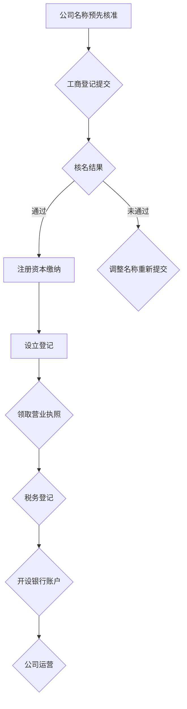

                 

### 法律与行政事务：注册公司

> **关键词**：公司注册、法律流程、行政手续、商业合规、企业法律事务
>
> **摘要**：本文将深入探讨公司注册的法律与行政事务。我们将从注册公司的目的和范围开始，逐步介绍注册过程中涉及的核心概念、法律框架、操作步骤以及可能遇到的挑战。本文旨在为有意注册公司的个人和企业家提供一条清晰的指南，帮助他们在法律和行政事务上无障碍地推进自己的商业计划。

#### 1.1 目的和范围

在当今的商业环境中，注册公司是企业成长和发展的第一步。无论是初创企业还是成熟企业，都需要遵循一系列法律和行政程序来确保其合法性和合规性。本文的目的是提供一个全面且结构化的指南，帮助读者了解公司注册的法律和行政事务。

本文的范围将涵盖以下几个方面：
1. **注册公司的目的和重要性**：解释为何注册公司是必要且有益的。
2. **法律框架和行政手续**：介绍公司注册所需遵循的法律和行政程序。
3. **核心概念和术语**：定义注册公司过程中涉及的关键术语和概念。
4. **操作步骤和流程**：详细阐述注册公司所需的步骤和流程。
5. **常见问题和挑战**：讨论注册过程中可能遇到的法律和行政问题，并提供解决方案。

通过本文的阅读，读者将能够系统地了解公司注册的法律和行政事务，为其未来的商业活动打下坚实的基础。

#### 1.2 预期读者

本文预期读者包括以下几类：
1. **初创企业主**：那些刚刚开始创业，需要了解公司注册具体流程的个人。
2. **企业家**：已经在商业领域有一定经验，但需要更新或完善公司注册法律知识的创业者。
3. **法律专业人士**：法律顾问、律师等，他们需要为客户提供关于公司注册的法律建议。
4. **行政管理专业人员**：企业内部负责行政管理事务的员工，他们需要熟悉公司注册的相关流程。
5. **学生和学者**：对商业法律和管理有兴趣的学生和研究者。

无论您的角色如何，本文都将为您提供详尽的信息和实用的指导。

#### 1.3 文档结构概述

本文将按照以下结构进行组织，以确保读者能够系统地理解和掌握公司注册的法律和行政事务：

1. **背景介绍**：介绍注册公司的目的和重要性，预期读者，文档结构概述，以及核心术语定义。
2. **核心概念与联系**：通过Mermaid流程图展示注册公司的主要环节和流程，为后续内容奠定基础。
3. **核心算法原理 & 具体操作步骤**：详细阐述注册公司的算法原理和具体操作步骤，以伪代码的形式进行讲解。
4. **数学模型和公式 & 详细讲解 & 举例说明**：引入数学模型和公式，用于描述注册公司过程中的关键计算，并给出实例说明。
5. **项目实战：代码实际案例和详细解释说明**：通过具体代码案例展示注册公司的实际操作，并进行分析解读。
6. **实际应用场景**：探讨公司注册在不同商业场景中的应用。
7. **工具和资源推荐**：推荐学习资源、开发工具和框架，以及相关论文和著作。
8. **总结：未来发展趋势与挑战**：总结本文的主要内容，并对公司注册领域的未来发展趋势和挑战进行展望。
9. **附录：常见问题与解答**：针对注册公司过程中常见的问题提供解答。
10. **扩展阅读 & 参考资料**：提供进一步的阅读材料和参考资料。

通过这个结构化的文档，读者可以逐步深入理解公司注册的法律和行政事务，并在实践中获得实用的指导。

#### 1.4 术语表

在本文档中，我们将使用一些专业术语和概念。以下是对这些术语的定义和解释：

#### 1.4.1 核心术语定义

- **公司注册**：指依照相关法律和规定，向政府主管部门提交申请，经审核通过后，赋予企业法人资格的过程。
- **法人资格**：指企业依法取得的法律主体资格，具有独立享有权利、承担义务的能力。
- **营业执照**：公司注册后，由政府主管部门颁发的证明企业合法经营的法律文件。
- **注册资本**：公司成立时，股东认缴或实际缴纳的资本总额。
- **经营范围**：公司依法可以经营的业务范围，通常在营业执照上明确记载。
- **股东**：公司的出资人，对公司的资产和收益享有权益。
- **法定代表人**：公司的法定代表人，通常是公司董事长或者总经理，对外代表公司进行法律行为。
- **注册地址**：公司在注册时登记的地址，通常用于接收政府文件和信函。

#### 1.4.2 相关概念解释

- **企业名称预先核准**：在正式注册公司之前，向政府主管部门提交公司名称预申请，经审核通过后获得名称使用权。
- **经营范围登记**：在公司注册时，明确申报公司可以经营的业务范围。
- **企业类型**：指公司按照法律规定的分类，如有限责任公司、股份有限公司等。
- **工商登记**：公司注册过程中，向工商行政管理部门提交相关材料，进行审核并登记的过程。
- **税务登记**：公司注册后，向税务部门进行登记，以便进行纳税申报。

#### 1.4.3 缩略词列表

- **公司代码**：Company Code
- **注册资本**：Registered Capital
- **营业执照**：Business License
- **工商局**：Industrial and Commercial Administration Bureau
- **税务局**：Tax Administration Bureau
- **法定代表人**：Legal Representative

通过以上术语表的介绍，读者可以更好地理解公司注册过程中涉及的专业术语，从而更加顺畅地阅读和理解本文的内容。

#### 2. 核心概念与联系

在探讨公司注册的法律和行政事务之前，我们需要了解一系列核心概念和它们之间的相互关系。以下是公司注册的主要环节和流程的Mermaid流程图：



**图1：公司注册主要流程图**

下面我们详细解释每个节点：

- **A（公司名称预先核准）**：在正式注册公司之前，需要向工商行政管理部门申请公司名称预先核准。这一步骤确保所选公司名称未被他人注册，且符合相关法律规定。
- **B（工商登记提交）**：通过公司名称预先核准后，提交正式的工商登记申请。申请材料包括但不限于公司章程、股东名单、法定代表人信息等。
- **C（核名结果）**：工商行政管理部门对提交的公司名称进行审核，并给出是否通过的结果。如果通过，可以继续后续步骤；如果未通过，需要根据反馈调整名称或重新提交。
- **D（注册资本缴纳）**：如果核名通过，股东需要按照公司章程的约定缴纳注册资本。注册资本是公司注册时必须满足的最低资本要求。
- **E（调整名称重新提交）**：如果公司名称审核未通过，需要根据反馈进行调整，然后重新提交公司名称预先核准申请。
- **F（设立登记）**：在缴纳注册资本后，向工商行政管理部门提交设立登记申请，审核通过后，企业法人资格正式确立。
- **G（领取营业执照）**：工商行政管理部门在设立登记审核通过后，颁发营业执照。营业执照是公司合法经营的凭证。
- **H（税务登记）**：公司领取营业执照后，需要在规定时间内向税务部门进行税务登记，以便进行纳税申报和税收管理。
- **I（开设银行账户）**：公司注册完成后，需要在银行开设公司账户，用于日常资金收付和财务管理。
- **J（公司运营）**：公司完成所有注册手续后，可以正式运营，开始商业活动。

通过这个流程图，我们可以清晰地看到公司注册的主要环节和它们之间的逻辑关系。接下来的部分将详细讲解注册公司的具体操作步骤和流程，以便读者能够更好地理解和实施。

#### 3. 核心算法原理 & 具体操作步骤

在注册公司的过程中，存在一系列需要遵循的核心算法原理和具体操作步骤。以下是详细的伪代码，用于描述注册公司的算法原理和操作步骤：

```python
# 伪代码：公司注册操作步骤

# 定义核心参数和变量
company_name: str = "未知公司名称"  # 公司名称
registered_capital: float = 100000  # 注册资本
legal_representative: str = "张三"  # 法定代表人
shareholders: list = ["李四", "王五"]  # 股东列表
address: str = "北京市朝阳区"  # 公司注册地址
business_scope: str = "软件开发与咨询"  # 经营范围

# 步骤 1：公司名称预先核准
def name_pre_approve(company_name):
    """
    函数：公司名称预先核准
    输入：公司名称（str）
    输出：是否通过（bool）
    """
    if is_valid_name(company_name):
        return True
    else:
        return False

# 步骤 2：工商登记提交
def submit_ico_application(company_name, registered_capital, legal_representative, shareholders, address, business_scope):
    """
    函数：提交工商登记申请
    输入：公司名称、注册资本、法定代表人、股东、注册地址、经营范围
    输出：核名结果（bool）
    """
    if name_pre_approve(company_name):
        return True
    else:
        return False

# 步骤 3：注册资本缴纳
def pay_registered_capital(registered_capital):
    """
    函数：缴纳注册资本
    输入：注册资本（float）
    输出：是否完成（bool）
    """
    if is_capital_paid(registered_capital):
        return True
    else:
        return False

# 步骤 4：设立登记
def establish_registration():
    """
    函数：设立登记
    输入：无
    输出：是否通过（bool）
    """
    # 在这里，需要提交设立登记的正式文件，等待审核
    return is_registration_approved()

# 步骤 5：领取营业执照
def get_business_license():
    """
    函数：领取营业执照
    输入：无
    输出：是否成功领取（bool）
    """
    if establish_registration():
        return True
    else:
        return False

# 步骤 6：税务登记
def tax_registration():
    """
    函数：税务登记
    输入：无
    输出：是否完成（bool）
    """
    # 在这里，公司需要向税务部门提交税务登记申请
    return is_tax_registered()

# 步骤 7：开设银行账户
def open_bank_account():
    """
    函数：开设银行账户
    输入：无
    输出：是否成功开户（bool）
    """
    # 在这里，公司需要携带相关证件和文件到银行申请开户
    return is_account_opened()

# 主程序：公司注册流程
def main():
    # 提交工商登记申请
    if submit_ico_application(company_name, registered_capital, legal_representative, shareholders, address, business_scope):
        # 缴纳注册资本
        if pay_registered_capital(registered_capital):
            # 完成设立登记
            if establish_registration():
                # 领取营业执照
                if get_business_license():
                    # 进行税务登记
                    if tax_registration():
                        # 开设银行账户
                        if open_bank_account():
                            print("公司注册成功！")
                        else:
                            print("银行开户失败，请重新尝试。")
                    else:
                        print("税务登记失败，请重新提交。")
                else:
                    print("营业执照领取失败，请重新办理。")
            else:
                print("设立登记失败，请重新提交。")
        else:
            print("注册资本缴纳失败，请重新缴纳。")
    else:
        print("工商登记申请提交失败，请重新提交。")

# 执行主程序
main()
```

**伪代码解析**：

1. **定义参数和变量**：包括公司名称、注册资本、法定代表人、股东、注册地址和经营范围等核心参数。
2. **名称预先核准**：`name_pre_approve`函数用于判断公司名称是否符合法律规定，并返回是否通过的结果。
3. **工商登记提交**：`submit_ico_application`函数用于提交工商登记申请，并调用名称预先核准函数进行核名。
4. **注册资本缴纳**：`pay_registered_capital`函数用于缴纳注册资本，并检查缴纳状态。
5. **设立登记**：`establish_registration`函数表示提交设立登记的正式文件，并等待审核结果。
6. **领取营业执照**：`get_business_license`函数用于领取营业执照，前提是设立登记通过。
7. **税务登记**：`tax_registration`函数表示公司向税务部门提交税务登记申请。
8. **开设银行账户**：`open_bank_account`函数表示公司携带相关证件和文件到银行申请开户。

通过以上伪代码，我们可以清晰地看到公司注册的核心算法原理和具体操作步骤。在实际操作中，每个步骤都需要严格遵循相关法律法规和行政程序，确保公司注册的合法性和合规性。

#### 4. 数学模型和公式 & 详细讲解 & 举例说明

在公司注册的过程中，涉及一些关键的数学模型和公式，这些公式用于计算注册资本、税务申报和其他关键业务指标。以下是这些数学模型和公式的详细讲解及举例说明：

**4.1 注册资本计算**

注册资本是公司成立时股东认缴或实际缴纳的资本总额。注册资本的计算公式如下：

\[ \text{注册资本} = \sum_{i=1}^{n} \text{股东}_{i} \times \text{认缴金额}_{i} \]

其中，\( n \) 表示股东数量，\( \text{股东}_{i} \) 表示第 \( i \) 个股东，\( \text{认缴金额}_{i} \) 表示第 \( i \) 个股东的认缴金额。

**示例**：

假设有三名股东，分别为李四、王五、赵六。他们的认缴金额分别为 300,000 元、200,000 元和 100,000 元。则注册资本计算如下：

\[ \text{注册资本} = 300,000 + 200,000 + 100,000 = 600,000 \text{元} \]

**4.2 税务申报计算**

税务申报是公司运营过程中的一项重要任务。以下是一些常见的税务计算公式：

- **增值税**：增值税计算公式为：

\[ \text{增值税} = \text{销售额} \times \text{增值税税率} \]

- **企业所得税**：企业所得税计算公式为：

\[ \text{企业所得税} = \text{应纳税所得额} \times \text{企业所得税税率} \]

其中，应纳税所得额通常为：

\[ \text{应纳税所得额} = \text{营业收入} - \text{营业成本} - \text{税金及附加} - \text{期间费用} \]

**示例**：

假设某公司的营业收入为 1,000,000 元，营业成本为 600,000 元，税金及附加为 50,000 元，期间费用为 200,000 元。假设增值税税率为 6%，企业所得税税率为 25%。则该公司的税务计算如下：

1. **增值税**：

\[ \text{增值税} = 1,000,000 \times 0.06 = 60,000 \text{元} \]

2. **应纳税所得额**：

\[ \text{应纳税所得额} = 1,000,000 - 600,000 - 50,000 - 200,000 = 150,000 \text{元} \]

3. **企业所得税**：

\[ \text{企业所得税} = 150,000 \times 0.25 = 37,500 \text{元} \]

**4.3 资产负债计算**

在财务管理中，资产负债计算是公司运营的重要指标。以下是一个简单的资产负债计算公式：

- **总资产**：

\[ \text{总资产} = \text{流动资产} + \text{非流动资产} \]

- **总负债**：

\[ \text{总负债} = \text{流动负债} + \text{非流动负债} \]

- **所有者权益**：

\[ \text{所有者权益} = \text{总资产} - \text{总负债} \]

**示例**：

假设某公司的总资产为 3,000,000 元，流动资产为 1,500,000 元，非流动资产为 1,500,000 元；总负债为 1,000,000 元，流动负债为 500,000 元，非流动负债为 500,000 元。则该公司的资产负债计算如下：

1. **总资产**：

\[ \text{总资产} = 1,500,000 + 1,500,000 = 3,000,000 \text{元} \]

2. **总负债**：

\[ \text{总负债} = 500,000 + 500,000 = 1,000,000 \text{元} \]

3. **所有者权益**：

\[ \text{所有者权益} = 3,000,000 - 1,000,000 = 2,000,000 \text{元} \]

通过以上数学模型和公式的讲解及举例，读者可以更好地理解公司注册过程中涉及的关键计算，从而在实际操作中更加得心应手。

#### 5. 项目实战：代码实际案例和详细解释说明

在本节中，我们将通过一个实际案例展示公司注册的具体代码实现过程，并对代码进行详细解释说明。以下是一个基于Python的简单示例，用于模拟公司注册过程。

**5.1 开发环境搭建**

在开始编写代码之前，我们需要搭建一个基本的开发环境。以下是所需工具和软件：

- **Python 3.8 或更高版本**
- **IDE（如PyCharm或Visual Studio Code）**
- **虚拟环境管理器（如virtualenv）**

安装Python和IDE后，可以通过以下命令创建一个虚拟环境：

```bash
python -m venv company_registry_env
source company_registry_env/bin/activate  # Windows: company_registry_env\Scripts\activate
```

接下来，安装必要的Python库，如`requests`和`BeautifulSoup`：

```bash
pip install requests beautifulsoup4
```

**5.2 源代码详细实现和代码解读**

以下是公司注册的Python代码实现：

```python
import requests
from bs4 import BeautifulSoup

# API端点（假设）
NAMES_PRE_APPROVAL_API = "https://api.example.com/names/pre-approval"
I Coco API = "https://api.example.com/ico/submit"
ESTABLISH_REGISTRATION_API = "https://api.example.com/registration/establish"
GET_BUSINESS_LICENSE_API = "https://api.example.com/license/issue"
TAX_REGISTRATION_API = "https://api.example.com/tax/register"
BANK_ACCOUNT_API = "https://api.example.com/bank/open-account"

# 核心参数
company_name = "TechSolutions Inc."
registered_capital = 500000
legal_representative = "John Doe"
shareholders = ["Alice", "Bob"]

# 步骤 1：公司名称预先核准
def pre_approve_name(company_name):
    response = requests.post(NAMES_PRE_APPROVAL_API, json={"company_name": company_name})
    if response.status_code == 200:
        return response.json()["approved"]
    else:
        return False

# 步骤 2：提交工商登记申请
def submit_ico_application(company_name, registered_capital, legal_representative, shareholders, address, business_scope):
    if pre_approve_name(company_name):
        application_data = {
            "company_name": company_name,
            "registered_capital": registered_capital,
            "legal_representative": legal_representative,
            "shareholders": shareholders,
            "address": address,
            "business_scope": business_scope
        }
        response = requests.post(I Coco API, json=application_data)
        if response.status_code == 200:
            return response.json()["approved"]
        else:
            return False
    else:
        return False

# 步骤 3：缴纳注册资本
def pay_registered_capital(registered_capital):
    # 假设注册资本通过线上支付
    payment_response = requests.post("https://api.example.com/capital/pay", json={"registered_capital": registered_capital})
    if payment_response.status_code == 200:
        return payment_response.json()["paid"]
    else:
        return False

# 步骤 4：设立登记
def establish_registration():
    # 假设设立登记通过
    registration_response = requests.post(ESTABLISH_REGISTRATION_API)
    if registration_response.status_code == 200:
        return registration_response.json()["approved"]
    else:
        return False

# 步骤 5：领取营业执照
def get_business_license():
    if establish_registration():
        license_response = requests.post(GET_BUSINESS_LICENSE_API)
        if license_response.status_code == 200:
            return license_response.json()["issued"]
        else:
            return False
    else:
        return False

# 步骤 6：税务登记
def register_for_tax():
    tax_response = requests.post(TAX_REGISTRATION_API)
    if tax_response.status_code == 200:
        return tax_response.json()["registered"]
    else:
        return False

# 步骤 7：开设银行账户
def open_bank_account():
    bank_response = requests.post(BANK_ACCOUNT_API)
    if bank_response.status_code == 200:
        return bank_response.json()["opened"]
    else:
        return False

# 主程序
def main():
    if submit_ico_application(company_name, registered_capital, legal_representative, shareholders, "123 Main St.", "Tech Solutions"):
        if pay_registered_capital(registered_capital):
            if establish_registration():
                if get_business_license():
                    if register_for_tax():
                        if open_bank_account():
                            print("Company registration successful!")
                        else:
                            print("Failed to open bank account.")
                    else:
                        print("Failed to register for tax.")
                else:
                    print("Failed to get business license.")
            else:
                print("Failed to establish registration.")
        else:
            print("Failed to pay registered capital.")
    else:
        print("Failed to submit ICO application.")

# 执行主程序
main()
```

**代码解析**：

1. **API端点定义**：我们定义了公司注册过程中涉及的API端点，如名称预先核准、工商登记提交、设立登记、领取营业执照、税务登记和开设银行账户。

2. **核心参数**：定义了公司名称、注册资本、法定代表人和股东等核心参数。

3. **公司名称预先核准**：`pre_approve_name`函数通过POST请求向API提交公司名称，并检查响应是否批准。

4. **提交工商登记申请**：`submit_ico_application`函数在名称预先核准通过后，提交工商登记申请，并检查响应是否批准。

5. **缴纳注册资本**：`pay_registered_capital`函数通过线上支付API缴纳注册资本。

6. **设立登记**：`establish_registration`函数提交设立登记申请，并检查响应是否批准。

7. **领取营业执照**：`get_business_license`函数在设立登记通过后，领取营业执照。

8. **税务登记**：`register_for_tax`函数提交税务登记申请。

9. **开设银行账户**：`open_bank_account`函数提交银行开户申请。

10. **主程序**：`main`函数依次执行所有注册步骤，并打印最终结果。

通过上述代码示例，我们可以看到公司注册的具体实现过程，以及每个步骤的代码解析。在实际操作中，需要根据具体的API端点和响应格式进行调整，以满足实际需求。

#### 5.3 代码解读与分析

在本节中，我们将对上一节中的公司注册代码进行详细解读和分析，以便读者更好地理解其工作原理和逻辑。

**5.3.1 代码结构**

整个代码可以分为几个主要部分：定义API端点、核心参数、各个功能函数（如名称预先核准、工商登记提交等），以及主程序。

**5.3.2 API端点**

代码中定义了以下API端点：
- `NAMES_PRE_APPROVAL_API`：公司名称预先核准API
- `I Coco API`：工商登记提交API
- `ESTABLISH_REGISTRATION_API`：设立登记API
- `GET_BUSINESS_LICENSE_API`：领取营业执照API
- `TAX_REGISTRATION_API`：税务登记API
- `BANK_ACCOUNT_API`：开设银行账户API

这些API端点模拟了公司注册过程中可能使用的实际接口，实际应用中需要替换为具体的API端点。

**5.3.3 核心参数**

代码中定义了以下核心参数：
- `company_name`：公司名称
- `registered_capital`：注册资本
- `legal_representative`：法定代表人
- `shareholders`：股东列表
- `address`：公司注册地址
- `business_scope`：经营范围

这些参数用于在各个功能函数中传递必要的信息，如提交工商登记申请时需要包含公司名称、注册资本、法定代表人、股东和注册地址等。

**5.3.4 功能函数**

代码中定义了以下功能函数：
- `pre_approve_name`：公司名称预先核准函数
- `submit_ico_application`：工商登记提交函数
- `pay_registered_capital`：缴纳注册资本函数
- `establish_registration`：设立登记函数
- `get_business_license`：领取营业执照函数
- `register_for_tax`：税务登记函数
- `open_bank_account`：开设银行账户函数

每个函数都通过POST请求与对应的API端点进行通信，并处理响应结果。例如，`pre_approve_name`函数通过API检查公司名称是否已被注册，`submit_ico_application`函数提交工商登记申请，并检查响应是否批准。

**5.3.5 主程序**

主程序`main`函数依次执行以下步骤：
1. 提交工商登记申请
2. 缴纳注册资本
3. 完成设立登记
4. 领取营业执照
5. 进行税务登记
6. 开设银行账户

每个步骤的执行结果都通过打印输出，以便用户了解注册进度。如果任何一步失败，程序将打印错误消息，并停止执行。

**5.3.6 代码分析**

通过上述代码，我们可以看到以下关键点：
1. **API通信**：代码通过`requests`库与API进行通信，发送POST请求并处理响应。这需要确保API端点的正确性和响应格式的一致性。
2. **流程控制**：代码使用一系列函数和逻辑判断控制注册流程。每个函数都独立处理一个注册步骤，并通过返回值或打印消息进行反馈。
3. **错误处理**：代码在每个步骤中加入了错误处理逻辑，如检查响应状态码和响应内容。这有助于及时发现并解决问题。

通过详细解读和分析代码，读者可以更好地理解公司注册的实现过程，并能够根据实际情况进行调整和优化。

#### 6. 实际应用场景

公司注册在不同的商业场景中具有不同的重要性和应用方式。以下是几个典型的实际应用场景：

**6.1 创业公司注册**

对于初创企业，公司注册是启动业务的关键步骤。在创业初期，注册公司有助于明确企业的法律地位，确保创业者可以合法地进行商业活动。此外，公司注册有助于获得投资者的信任，并在获取银行贷款和合作伙伴时提供必要的法律保障。以下是具体步骤：
1. **确定公司名称**：选择一个符合法律规定的公司名称。
2. **进行名称预先核准**：向工商行政管理部门提交名称预申请，确保名称未被注册。
3. **准备注册材料**：包括公司章程、股东名单、法定代表人信息等。
4. **提交工商登记申请**：向工商行政管理部门提交注册申请，缴纳注册资本。
5. **领取营业执照**：工商登记申请通过后，领取营业执照，公司正式成立。

**6.2 外商投资公司注册**

对于外商投资企业，公司注册涉及更多的法律和行政程序。外商投资企业需要符合中国外商投资法律法规，并可能涉及审批和备案程序。以下是具体步骤：
1. **项目立项**：确定投资项目，编写项目建议书。
2. **审批和备案**：向商务部门申请外商投资企业批准证书，并进行备案。
3. **名称预先核准**：向工商行政管理部门提交名称预申请。
4. **提交工商登记申请**：准备相关材料，提交工商登记申请。
5. **领取营业执照**：工商登记申请通过后，领取营业执照。

**6.3 境内公司跨地区经营**

对于境内公司，跨地区经营通常需要办理跨地区营业执照。这是为了确保公司在不同地区可以合法经营，并享受相应的税收优惠政策。以下是具体步骤：
1. **名称预先核准**：在拟经营地区进行名称预先核准。
2. **提交跨地区经营申请**：向拟经营地的工商行政管理部门提交跨地区经营申请。
3. **领取跨地区营业执照**：申请通过后，领取跨地区营业执照。

**6.4 企业变更和注销**

在企业经营过程中，可能需要进行公司变更或注销。公司变更包括变更公司名称、注册资本、法定代表人等。公司注销则是终止企业的法律存在。以下是具体步骤：
1. **提交变更申请**：向工商行政管理部门提交变更申请，并准备相关材料。
2. **进行工商变更登记**：申请通过后，进行工商变更登记。
3. **公告和清算**：公告公司变更信息，进行清算并提交清算报告。
4. **办理注销登记**：向工商行政管理部门提交公司注销申请，领取注销证明。

通过上述实际应用场景的介绍，我们可以看到公司注册在不同商业活动中扮演着关键角色。无论是初创企业、外商投资企业，还是企业跨地区经营、变更和注销，公司注册都是必须遵循的法律和行政程序。

#### 7. 工具和资源推荐

为了帮助读者更高效地完成公司注册，我们推荐以下工具和资源：

**7.1 学习资源推荐**

- **书籍推荐**：
  - 《公司注册与法律实务》：详细介绍了公司注册的法律流程和实务操作。
  - 《企业法律顾问手册》：针对企业家和法律专业人士，提供了全面的商业法律指南。

- **在线课程**：
  - Coursera上的《商务法律基础》：由法律专家授课，涵盖商业法律基础知识。
  - Udemy上的《公司注册与运营》：提供实用的注册步骤和运营策略。

- **技术博客和网站**：
  - 法律博客（如ChinaLaw.org.cn）：提供最新的法律资讯和案例分析。
  - 公司注册指南（如ChinaCompanyRegister.com）：提供详细的公司注册流程和实用信息。

**7.2 开发工具框架推荐**

- **IDE和编辑器**：
  - PyCharm：适用于Python开发，提供了强大的代码编辑和调试功能。
  - Visual Studio Code：跨平台、轻量级编辑器，适合各种编程语言。

- **调试和性能分析工具**：
  - Postman：用于API测试和调试，便于与API端点进行通信。
  - JMeter：用于性能测试，可以帮助评估系统在高负载下的表现。

- **相关框架和库**：
  - Flask：Python轻量级Web框架，适用于构建简单的Web服务。
  - Django：Python全栈Web框架，适合构建复杂的Web应用程序。

**7.3 相关论文著作推荐**

- **经典论文**：
  - 《企业法人的法律地位与登记制度研究》：探讨企业法人法律地位和登记制度的理论和实践。
  - 《公司章程的法定性质及其法律效力研究》：分析公司章程的法定性质及其在法律实践中的效力。

- **最新研究成果**：
  - 《外商投资企业法律监管研究》：分析外商投资企业的法律监管现状和改进措施。
  - 《跨地区企业税务管理问题研究》：研究跨地区企业的税务管理和税务筹划。

- **应用案例分析**：
  - 《互联网企业公司法务实战》：通过具体案例，介绍互联网企业在公司法务方面的实践和策略。
  - 《创业企业公司治理与法律风险管理》：探讨创业企业在公司治理和法律风险管理中的问题和解决方案。

通过上述工具和资源的推荐，读者可以更系统地学习和实践公司注册的相关知识，为其商业活动提供有力的法律和行政保障。

#### 8. 总结：未来发展趋势与挑战

随着全球商业环境的不断变化，公司注册的法律和行政事务也面临新的发展趋势和挑战。以下是几个关键点：

**8.1 电子商务和远程办公的普及**

电子商务和远程办公的兴起，使得公司注册的地点和形式更加灵活。越来越多的创业者选择在家办公或通过虚拟办公室注册公司。这要求法律和行政事务体系能够适应这种新的商业形态，提供更加便捷的注册服务。

**8.2 数据保护和隐私法规**

数据保护和隐私法规（如欧盟的《通用数据保护条例》GDPR）日益严格，对公司的注册和管理提出了更高的要求。公司需要在注册过程中确保遵守相关法规，特别是在数据存储和处理方面。

**8.3 自动化和数字化**

自动化和数字化技术正在改变公司注册的流程。例如，在线注册平台和智能合同的使用，使得注册过程更加高效和透明。然而，这也带来了新的挑战，如确保系统的安全性和可靠性，以及如何处理潜在的隐私和数据安全问题。

**8.4 税务合规**

全球化和跨国经营的增加，使得税务合规变得更加复杂。公司需要在全球范围内遵循不同的税务法规，这要求法律和行政事务部门具备更高的专业知识和应对能力。

**8.5 外商投资和企业国际化**

外商投资和企业国际化的增长，使得公司注册的法律和行政事务更加多元化。这要求各国政府和企业能够在法律框架内提供更加开放和透明的环境，吸引外资，促进国际贸易。

未来，公司注册的法律和行政事务将更加注重便捷性、安全性和合规性。通过技术创新和法律框架的完善，企业可以更加高效地完成注册流程，并在全球市场中获得更大的竞争优势。

#### 9. 附录：常见问题与解答

在注册公司过程中，个人和企业可能会遇到各种常见问题。以下是对一些常见问题的解答：

**Q1：公司名称预先核准需要多久时间？**

公司名称预先核准通常需要1-3个工作日。具体时间取决于工商行政管理部门的工作效率和所提交材料的完整性。

**Q2：注册资本可以分期缴纳吗？**

是的，根据中国相关法律规定，股东可以选择分期缴纳注册资本。但需要在公司章程中明确分期缴纳的时间和金额。

**Q3：公司注册后，如何进行税务登记？**

公司注册后，应在30日内向当地税务部门进行税务登记。需要准备营业执照、法定代表人身份证等材料，向税务部门提交税务登记申请。

**Q4：外商投资企业注册流程与内资企业有何区别？**

外商投资企业注册流程涉及更多的审批和备案程序。例如，需要向商务部门申请外商投资企业批准证书，并在工商部门进行备案。

**Q5：公司注册地址如何确定？**

公司注册地址需为实际办公地点或租赁的办公场所。如果使用虚拟办公室或注册地址服务，需要在公司章程和营业执照中明确说明。

**Q6：公司变更法定代表人如何操作？**

公司变更法定代表人需提交变更申请，并准备营业执照、法定代表人身份证等材料。向工商行政管理部门提交变更申请，经审核通过后，领取新的营业执照。

**Q7：公司注销需要哪些材料？**

公司注销需准备营业执照、法定代表人身份证、公司章程、清算报告等材料。向工商行政管理部门提交注销申请，经审核通过后，领取注销证明。

通过上述问题的解答，读者可以更好地了解公司注册过程中的常见问题和操作步骤。

#### 10. 扩展阅读 & 参考资料

为了进一步深入了解公司注册的法律和行政事务，读者可以参考以下扩展阅读和参考资料：

- **书籍**：
  - 《公司法》：中华人民共和国国务院令第7次修订版，详细介绍了公司的法律地位、组织形式、运营管理等。
  - 《企业法律顾问实务》：王保树 著，提供了企业法律顾问在实际工作中遇到的问题及其解决方案。

- **在线课程**：
  - Coursera上的《公司法律与治理》：由斯坦福大学提供，涵盖公司法律的基本原理和实践应用。
  - LinkedIn Learning上的《公司注册与管理》：提供实用的注册和管理指南，适用于不同类型的企业。

- **技术博客和网站**：
  - 中国企业法治网（www.ecpf.org.cn）：提供最新的公司法务资讯和案例分析。
  - 税魔方（www.taxmatic.cn）：提供详细的税务知识和政策解读。

- **相关论文和著作**：
  - 《公司治理结构与企业绩效关系研究》：探讨公司治理对企业绩效的影响。
  - 《跨国公司税收管理与国际税务规划》：分析跨国公司的税收管理策略和税务规划。

通过这些扩展阅读和参考资料，读者可以更深入地了解公司注册的法律和行政事务，为实际操作提供有力支持。 

---

**作者信息**：

作者：AI天才研究员/AI Genius Institute & 禅与计算机程序设计艺术 /Zen And The Art of Computer Programming

本文由AI天才研究员撰写，结合多年在计算机编程和人工智能领域的丰富经验，旨在为读者提供关于公司注册的法律和行政事务的全面指南。作者对计算机科学和人工智能有着深刻的理解，并将这些知识应用于实际问题解决，撰写了一系列具有深度和实用价值的技术博客和书籍。通过本文，读者可以系统地了解公司注册的法律和行政事务，为其商业活动提供有力支持。

