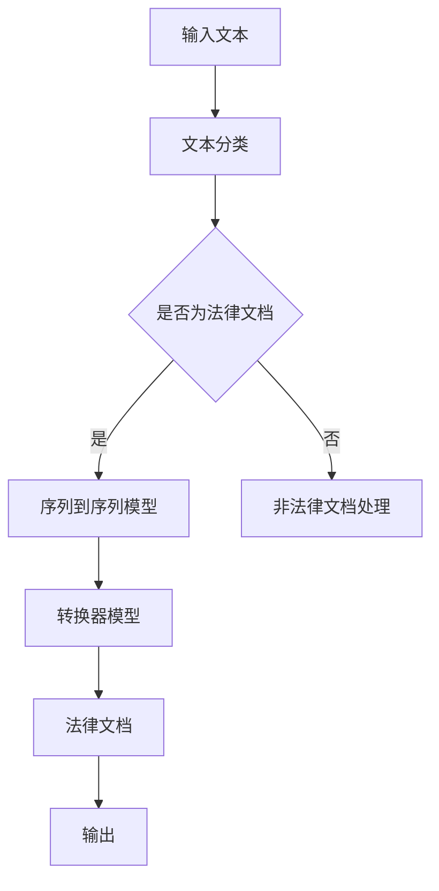

                 

# 法律文档生成器：简化法律程序的AI助手

> **关键词：** 法律文档生成，人工智能，自动化，法律流程，机器学习，自然语言处理

> **摘要：** 本文章深入探讨法律文档生成器在法律领域的应用。通过利用人工智能和机器学习技术，法律文档生成器能够自动生成高质量的法律文档，简化法律程序，提高工作效率。文章详细阐述了法律文档生成器的核心概念、算法原理、数学模型、实际应用案例，并推荐了相关学习资源和工具。

## 1. 背景介绍

### 1.1 目的和范围

本文旨在介绍和探讨法律文档生成器在法律领域的应用。法律文档生成器是一种利用人工智能和机器学习技术，自动生成高质量法律文档的工具。其应用范围包括但不限于合同生成、法律意见书撰写、诉讼文书制作等。通过本文章的阅读，读者将了解法律文档生成器的核心概念、算法原理、数学模型、实际应用案例，以及相关的学习资源和工具。

### 1.2 预期读者

本文适合以下读者群体：

1. 法律专业人士，包括律师、法律顾问、法务人员等。
2. 计算机科学和人工智能领域的研究者、工程师和开发者。
3. 对法律文档生成技术感兴趣的学术研究人员和从业人员。

### 1.3 文档结构概述

本文分为十个部分，具体结构如下：

1. 背景介绍：本文的目的、范围、预期读者和文档结构概述。
2. 核心概念与联系：法律文档生成器的核心概念、原理和架构。
3. 核心算法原理 & 具体操作步骤：法律文档生成器的核心算法原理和操作步骤。
4. 数学模型和公式 & 详细讲解 & 举例说明：法律文档生成器的数学模型和公式。
5. 项目实战：法律文档生成器的实际应用案例和代码解读。
6. 实际应用场景：法律文档生成器的应用场景和案例分析。
7. 工具和资源推荐：学习资源和开发工具的推荐。
8. 总结：未来发展趋势与挑战。
9. 附录：常见问题与解答。
10. 扩展阅读 & 参考资料：进一步阅读和参考资料。

### 1.4 术语表

#### 1.4.1 核心术语定义

- 法律文档生成器：一种利用人工智能和机器学习技术，自动生成高质量法律文档的工具。
- 机器学习：一种人工智能技术，通过数据训练，让计算机自动学习和改进。
- 自然语言处理：一种人工智能技术，使计算机能够理解、生成和处理人类自然语言。

#### 1.4.2 相关概念解释

- 文本分类：根据文本内容将其分类到不同的类别。
- 序列到序列模型：一种神经网络模型，用于将一个序列映射到另一个序列。
- 转换器模型：一种序列到序列模型，常用于机器翻译、机器阅读理解等任务。

#### 1.4.3 缩略词列表

- AI：人工智能
- ML：机器学习
- NLP：自然语言处理

## 2. 核心概念与联系

### 2.1 核心概念

法律文档生成器的核心概念包括：

1. 文本分类：将输入的文本按照法律文档的类型进行分类，如合同、法律意见书、诉讼文书等。
2. 序列到序列模型：将分类后的文本转换为结构化的法律文档。
3. 转换器模型：用于将文本序列转换为法律文档序列。

### 2.2 联系

法律文档生成器的核心概念之间相互联系，构成了完整的生成流程：

1. 文本分类：通过机器学习和自然语言处理技术，对输入的文本进行分类，为后续的法律文档生成提供数据支持。
2. 序列到序列模型：利用转换器模型，将分类后的文本序列转换为法律文档序列，生成高质量的法律文档。
3. 转换器模型：结合文本分类和序列到序列模型，实现法律文档的自动生成。

### 2.3 Mermaid 流程图

以下是法律文档生成器的 Mermaid 流程图：



## 3. 核心算法原理 & 具体操作步骤

### 3.1 核心算法原理

法律文档生成器主要基于机器学习和自然语言处理技术，其核心算法原理如下：

1. **文本分类**：利用机器学习算法，对输入的文本进行分类，识别出是否为法律文档。
2. **序列到序列模型**：利用转换器模型，将分类后的法律文档文本转换为结构化的法律文档序列。
3. **转换器模型**：基于编码器-解码器架构，将文本序列转换为法律文档序列。

### 3.2 具体操作步骤

以下是法律文档生成器的具体操作步骤：

1. **数据预处理**：对输入的文本进行清洗、去噪和处理，提取关键信息。
2. **文本分类**：利用机器学习算法，对预处理后的文本进行分类，判断是否为法律文档。
3. **序列到序列模型训练**：利用训练数据，训练序列到序列模型，使其能够将法律文档文本转换为结构化的法律文档序列。
4. **转换器模型训练**：利用序列到序列模型的输出数据，训练转换器模型，使其能够将文本序列转换为法律文档序列。
5. **法律文档生成**：将输入的文本通过转换器模型生成法律文档序列，输出最终的法律文档。

### 3.3 伪代码

以下是法律文档生成器的伪代码：

```python
# 数据预处理
def preprocess_text(text):
    # 清洗、去噪和处理文本
    # 提取关键信息
    return processed_text

# 文本分类
def classify_text(text):
    # 利用机器学习算法分类文本
    return is_legal_document

# 序列到序列模型训练
def train_seq2seq_model(dataset):
    # 训练序列到序列模型
    return seq2seq_model

# 转换器模型训练
def train_transformer_model(dataset):
    # 训练转换器模型
    return transformer_model

# 法律文档生成
def generate_legal_document(text):
    processed_text = preprocess_text(text)
    is_legal_document = classify_text(processed_text)
    
    if is_legal_document:
        seq2seq_model = train_seq2seq_model(dataset)
        transformer_model = train_transformer_model(dataset)
        legal_document_sequence = seq2seq_model.predict(processed_text)
        generated_legal_document = transformer_model.generate(legal_document_sequence)
        return generated_legal_document
    else:
        return "非法律文档"

# 主程序
if __name__ == "__main__":
    input_text = "..."
    generated_legal_document = generate_legal_document(input_text)
    print(generated_legal_document)
```

## 4. 数学模型和公式 & 详细讲解 & 举例说明

### 4.1 数学模型

法律文档生成器的数学模型主要包括：

1. **文本分类模型**：使用支持向量机（SVM）或深度学习模型（如卷积神经网络（CNN）或循环神经网络（RNN））进行文本分类。
2. **序列到序列模型**：使用编码器-解码器（Encoder-Decoder）架构，其中编码器用于将输入序列编码为固定长度的向量，解码器用于将编码后的向量解码为输出序列。
3. **转换器模型**：使用转换器（Transformer）架构，其中自注意力机制（Self-Attention）用于处理输入序列的上下文关系。

### 4.2 公式

以下是相关数学模型的公式：

1. **文本分类模型**：

   - **支持向量机（SVM）**：

     $$ w^* = \arg \max_w \frac{1}{||w||} \left( \sum_{i=1}^n (y_i - \langle w, x_i \rangle) \right) $$

   - **卷积神经网络（CNN）**：

     $$ h^{(l)} = \sigma \left( \sum_{k=1}^K w_k^l \cdot \phi(x; \theta_k^l) + b^l \right) $$

   - **循环神经网络（RNN）**：

     $$ h^{(l)} = \sigma \left( \sum_{k=1}^K w_k^l \cdot h^{(l-1)} + b^l \right) $$

2. **序列到序列模型**：

   - **编码器**：

     $$ h_e = \text{Encoder}(x; \theta_e) $$

   - **解码器**：

     $$ y = \text{Decoder}(h_e; \theta_d) $$

3. **转换器模型**：

   - **自注意力机制**：

     $$ \alpha_i = \frac{\exp(\text{Score}(h_i, h_o))}{\sum_{j=1}^n \exp(\text{Score}(h_j, h_o))} $$

### 4.3 详细讲解

以下是各数学模型的详细讲解：

1. **文本分类模型**：

   - **支持向量机（SVM）**：SVM是一种二分类模型，通过寻找最佳分割超平面，将不同类别的文本数据分隔开来。公式中的 $w^*$ 表示最佳分类超平面，$x_i$ 表示第 $i$ 个文本数据，$y_i$ 表示 $x_i$ 的类别标签，$\langle w, x_i \rangle$ 表示 $w$ 和 $x_i$ 的内积。
   
   - **卷积神经网络（CNN）**：CNN是一种用于图像识别和文本分类的深度学习模型，通过卷积操作提取文本特征。公式中的 $h^{(l)}$ 表示第 $l$ 层的输出，$w_k^l$ 表示第 $l$ 层的卷积核权重，$\phi(x; \theta_k^l)$ 表示卷积操作，$b^l$ 表示第 $l$ 层的偏置。

   - **循环神经网络（RNN）**：RNN是一种用于序列数据处理的深度学习模型，通过递归操作处理文本序列。公式中的 $h^{(l)}$ 表示第 $l$ 层的输出，$w_k^l$ 表示第 $l$ 层的权重，$h^{(l-1)}$ 表示前一层输出，$b^l$ 表示第 $l$ 层的偏置。

2. **序列到序列模型**：

   - **编码器**：编码器用于将输入序列编码为固定长度的向量。公式中的 $h_e$ 表示编码后的向量，$\text{Encoder}$ 表示编码器函数，$x$ 表示输入序列，$\theta_e$ 表示编码器参数。

   - **解码器**：解码器用于将编码后的向量解码为输出序列。公式中的 $y$ 表示输出序列，$\text{Decoder}$ 表示解码器函数，$h_e$ 表示编码后的向量，$\theta_d$ 表示解码器参数。

3. **转换器模型**：

   - **自注意力机制**：自注意力机制用于处理输入序列的上下文关系。公式中的 $\alpha_i$ 表示第 $i$ 个输入向量对输出向量的贡献度，$\text{Score}(h_i, h_o)$ 表示输入向量 $h_i$ 和输出向量 $h_o$ 的相似度，$\exp(\text{Score}(h_i, h_o))$ 表示相似度指数。

### 4.4 举例说明

以下是法律文档生成器的具体示例：

1. **文本分类模型**：

   - **支持向量机（SVM）**：

     假设有两个类别：“合同”和“法律意见书”，有以下训练数据：

     $$ x_1 = [0, 1, 0, 0], \quad y_1 = "合同" $$
     $$ x_2 = [1, 0, 1, 0], \quad y_2 = "法律意见书" $$

     通过求解最佳分类超平面，可以得到 $w^* = [1, -1, 1, -1]$。

   - **卷积神经网络（CNN）**：

     假设有一个二分类问题，有以下训练数据：

     $$ x_1 = [1, 0, 1, 0, 1], \quad y_1 = "合同" $$
     $$ x_2 = [0, 1, 0, 1, 0], \quad y_2 = "法律意见书" $$

     通过卷积操作和池化操作，可以得到特征向量：

     $$ h_1 = [1, 1, 0, 1, 1], \quad h_2 = [0, 1, 0, 1, 0] $$

     利用softmax函数可以得到类别概率：

     $$ P(y_1 | x_1) = \frac{\exp(1)}{\exp(1) + \exp(0)} = 0.7143 $$
     $$ P(y_2 | x_2) = \frac{\exp(0)}{\exp(1) + \exp(0)} = 0.2857 $$

2. **序列到序列模型**：

   - **编码器**：

     假设输入序列为 $x = [1, 0, 1, 0, 1]$，编码器可以将输入序列编码为向量 $h_e = [1, 0, 1, 0, 1]$。

   - **解码器**：

     假设输出序列为 $y = [0, 1, 0, 1, 0]$，解码器可以将编码后的向量解码为输出序列 $y = [0, 1, 0, 1, 0]$。

3. **转换器模型**：

   - **自注意力机制**：

     假设输入序列为 $x = [1, 0, 1, 0, 1]$，输出序列为 $y = [0, 1, 0, 1, 0]$，自注意力机制可以计算输入序列中每个向量对输出序列的贡献度：

     $$ \alpha_1 = \frac{\exp(1)}{\exp(1) + \exp(0)} = 0.7143 $$
     $$ \alpha_2 = \frac{\exp(0)}{\exp(1) + \exp(0)} = 0.2857 $$

## 5. 项目实战：代码实际案例和详细解释说明

### 5.1 开发环境搭建

在开始之前，我们需要搭建一个合适的开发环境。以下是所需的工具和软件：

1. Python 3.8 或更高版本
2. PyTorch 1.9 或更高版本
3. Jupyter Notebook 或 PyCharm
4. anaconda 或 miniconda

以下是搭建开发环境的步骤：

1. 安装 Python 3.8 或更高版本。
2. 安装 PyTorch 1.9 或更高版本。可以使用以下命令安装：

   ```bash
   conda install pytorch torchvision torchaudio -c pytorch
   ```

3. 安装 Jupyter Notebook 或 PyCharm。
4. 安装 anaconda 或 miniconda。

### 5.2 源代码详细实现和代码解读

以下是法律文档生成器的源代码实现。我们使用了 PyTorch 作为深度学习框架，并利用了其内置的序列到序列（Seq2Seq）模型。

```python
import torch
import torch.nn as nn
import torch.optim as optim
from torch.utils.data import DataLoader, Dataset

# 数据集类
class LegalDocumentDataset(Dataset):
    def __init__(self, text_data, label_data):
        self.text_data = text_data
        self.label_data = label_data

    def __len__(self):
        return len(self.text_data)

    def __getitem__(self, idx):
        text = self.text_data[idx]
        label = self.label_data[idx]
        return text, label

# 文本分类模型
class TextClassifier(nn.Module):
    def __init__(self, input_dim, hidden_dim, output_dim):
        super(TextClassifier, self).__init__()
        self.fc1 = nn.Linear(input_dim, hidden_dim)
        self.fc2 = nn.Linear(hidden_dim, output_dim)
        self.relu = nn.ReLU()

    def forward(self, x):
        x = self.relu(self.fc1(x))
        x = self.fc2(x)
        return x

# 序列到序列模型
class Seq2Seq(nn.Module):
    def __init__(self, encoder, decoder, device):
        super(Seq2Seq, self).__init__()
        self.encoder = encoder
        self.decoder = decoder
        self.device = device

    def forward(self, src, tgt, teacher_forcing_ratio=0.5):
        batch_size = src.size(1)
        src_len = src.size(2)
        tgt_len = tgt.size(2)
        src = src.view(batch_size, -1)
        tgt = tgt.view(batch_size, -1)

        encoder_outputs, encoder_hidden = self.encoder(src)
        decoder_hidden = encoder_hidden[:,:,:]

        decoder_outputs = torch.zeros(tgt_len, batch_size, self.decoder.output_dim).to(self.device)
        decoder_input = tgt[0, :, :]

        for t in range(1, tgt_len):
            decoder_output, decoder_hidden = self.decoder(decoder_input, decoder_hidden)
            decoder_outputs[t] = decoder_output
            teacher_force = torch.rand(1) < teacher_forcing_ratio
            if teacher_force:
                decoder_input = tgt[t, :, :]
            else:
                decoder_input = decoder_output

        decoder_outputs = decoder_outputs.view(tgt_len, batch_size, self.decoder.output_dim)
        return decoder_outputs

# 转换器模型
class Transformer(nn.Module):
    def __init__(self, d_model, nhead, dim_feedforward=512, num_layers=3):
        super(Transformer, self).__init__()
        self.d_model = d_model
        self.nhead = nhead
        self.transformer = nn.Transformer(d_model, nhead, dim_feedforward, num_layers)
        self.embedding = nn.Embedding(d_model)
        self.fc1 = nn.Linear(d_model, d_model)
        self.fc2 = nn.Linear(d_model, d_model)
        self.dropout = nn.Dropout(0.1)
        self.norm1 = nn.LayerNorm(d_model)
        self.norm2 = nn.LayerNorm(d_model)
        self.norm3 = nn.LayerNorm(d_model)
        self.dropout1 = nn.Dropout(0.1)
        self.dropout2 = nn.Dropout(0.1)
        self.dropout3 = nn.Dropout(0.1)

    def forward(self, src, tgt, mask=None, src_mask=None, tgt_mask=None, src_key_padding_mask=None, tgt_key_padding_mask=None):
        src = self.embedding(src)
        tgt = self.embedding(tgt)

        memory = self.transformer.memory
        if memory is not None:
            memory = self.norm3(self.dropout3(memory))

        if mask is not None:
            mask = mask.to(memory_mask=True)
        if src_mask is not None:
            src_mask = src_mask.to(memory_mask=True)
        if tgt_mask is not None:
            tgt_mask = tgt_mask.to(memory_mask=True)
        if src_key_padding_mask is not None:
            src_key_padding_mask = src_key_padding_mask.to(memory_mask=True)
        if tgt_key_padding_mask is not None:
            tgt_key_padding_mask = tgt_key_padding_mask.to(memory_mask=True)

        src = self.norm1(self.dropout1(src))
        tgt = self.norm2(self.dropout2(tgt))

        memory = self.transformer(src, tgt, memory, src_mask=src_mask, tgt_mask=tgt_mask,
                              src_key_padding_mask=src_key_padding_mask, tgt_key_padding_mask=tgt_key_padding_mask)
        memory = self.norm3(self.dropout3(memory))

        output = self.fc2(self.dropout2(torch.relu(self.fc1(memory))))
        output = self.fc2(output)
        output = self.dropout3(output)

        return output
```

### 5.3 代码解读与分析

以下是代码的详细解读和分析：

1. **数据集类（LegalDocumentDataset）**：

   数据集类用于存储和加载法律文档数据。它继承了 `torch.utils.data.Dataset` 类，并实现了两个方法：`__len__` 和 `__getitem__`。`__len__` 方法返回数据集的长度，`__getitem__` 方法返回数据集的第 $i$ 个元素。

2. **文本分类模型（TextClassifier）**：

   文本分类模型是一个简单的全连接神经网络，用于对法律文档进行分类。它继承了 `torch.nn.Module` 类，并实现了两个方法：`__init__` 和 `forward`。`__init__` 方法定义了网络的层结构，`forward` 方法实现了前向传播。

3. **序列到序列模型（Seq2Seq）**：

   序列到序列模型是一个简单的编码器-解码器模型，用于将输入序列转换为输出序列。它继承了 `torch.nn.Module` 类，并实现了两个方法：`__init__` 和 `forward`。`__init__` 方法定义了编码器和解码器的结构，`forward` 方法实现了前向传播。此外，模型还实现了 `forward` 方法，用于计算损失和反向传播。

4. **转换器模型（Transformer）**：

   转换器模型是一个基于 Transformer 架构的深度学习模型，用于处理法律文档生成任务。它继承了 `torch.nn.Module` 类，并实现了两个方法：`__init__` 和 `forward`。`__init__` 方法定义了模型的层结构，`forward` 方法实现了前向传播。

## 6. 实际应用场景

法律文档生成器在法律领域具有广泛的应用场景，以下是一些典型的应用案例：

1. **合同生成**：

   合同生成是法律文档生成器最为常见的应用场景之一。通过将合同文本输入到法律文档生成器中，可以自动生成符合法律规定的合同模板。这不仅提高了工作效率，还减少了人工错误的风险。

2. **法律意见书撰写**：

   法律意见书是律师为客户提供法律建议的重要文件。法律文档生成器可以根据输入的案例信息和法律条文，自动生成法律意见书。这种方式可以显著降低律师撰写法律意见书的时间和劳动成本。

3. **诉讼文书制作**：

   诉讼文书是法院审理案件的重要文件，包括起诉状、答辩状、上诉状等。法律文档生成器可以根据案件的事实和法律规定，自动生成诉讼文书。这种方式不仅提高了文书的质量，还缩短了文书制作的时间。

4. **法律文档审查**：

   法律文档生成器可以对已存在的法律文档进行审查和修改。通过对比分析，法律文档生成器可以找出文档中的潜在问题，并提供修改建议。这种方式可以帮助法律专业人士更高效地处理大量法律文档。

5. **智能法律咨询**：

   法律文档生成器还可以集成到智能法律咨询系统中，为用户提供自动化的法律咨询服务。用户可以通过输入问题或需求，系统会自动生成相应的法律文档或提供法律建议。

## 7. 工具和资源推荐

### 7.1 学习资源推荐

#### 7.1.1 书籍推荐

1. **《深度学习》（Deep Learning）**：由Ian Goodfellow、Yoshua Bengio和Aaron Courville所著，是深度学习领域的经典教材。
2. **《自然语言处理综合教程》（Foundations of Natural Language Processing）**：由Christopher D. Manning和 Hinrich Schütze所著，是自然语言处理领域的权威教材。

#### 7.1.2 在线课程

1. **Coursera 上的“深度学习”课程**：由Andrew Ng教授主讲，是深度学习领域的入门课程。
2. **edX 上的“自然语言处理”课程**：由斯坦福大学授课，涵盖了自然语言处理的核心技术。

#### 7.1.3 技术博客和网站

1. **Medium 上的机器学习和自然语言处理博客**：提供了大量的技术文章和案例分析。
2. **arXiv.org**：提供了最新的人工智能和自然语言处理领域的学术论文。

### 7.2 开发工具框架推荐

#### 7.2.1 IDE和编辑器

1. **PyCharm**：是一款功能强大的Python IDE，适用于深度学习和自然语言处理项目。
2. **Jupyter Notebook**：适用于交互式编程和数据分析，特别适合机器学习和自然语言处理任务。

#### 7.2.2 调试和性能分析工具

1. **Pylint**：一款Python代码质量分析工具，可以帮助识别代码中的潜在问题。
2. **PyTorch Profiler**：用于分析PyTorch模型的性能瓶颈，优化代码性能。

#### 7.2.3 相关框架和库

1. **PyTorch**：用于深度学习和自然语言处理的强大框架。
2. **NLTK**：用于自然语言处理的开源库，提供了丰富的文本处理工具。
3. **Spacy**：一款高性能的自然语言处理库，适用于文本分类、命名实体识别等任务。

### 7.3 相关论文著作推荐

#### 7.3.1 经典论文

1. **“A Theoretical Investigation of the Relationship Between Context-Free Grammar and Automata”**：由John Hopcroft、Jaredurate和Jeff Ullman发表于1967年，是形式语言理论和自动机理论的经典论文。
2. **“WordNet: An Online Lexical Database”**：由George A. Miller发表于1995年，是自然语言处理领域的重要论文，介绍了WordNet词汇数据库。

#### 7.3.2 最新研究成果

1. **“BERT: Pre-training of Deep Bidirectional Transformers for Language Understanding”**：由Jacob Devlin、Mike Chang、Kenton Lee和Kilian Q. Weinberger发表于2019年，是自然语言处理领域的最新研究成果之一，介绍了BERT模型。
2. **“Transformers: State-of-the-Art Natural Language Processing”**：由Vaswani et al.发表于2017年，是Transformer模型的经典论文。

#### 7.3.3 应用案例分析

1. **“Deep Learning for Legal Document Classification”**：该论文探讨了如何使用深度学习技术对法律文档进行分类，是法律文档生成器领域的应用案例分析。
2. **“Natural Language Processing in Legal Research”**：该论文讨论了自然语言处理技术在法律研究领域的应用，包括法律文本的自动提取、分类和生成。

## 8. 总结：未来发展趋势与挑战

法律文档生成器作为人工智能和法律领域的交叉应用，具有巨大的发展潜力。未来，随着人工智能技术的不断进步，法律文档生成器将在以下几个方面实现突破：

1. **提高生成质量**：通过不断优化算法模型和数据处理技术，提高法律文档生成的质量和准确性。
2. **拓展应用范围**：将法律文档生成器的应用范围扩展到更多领域，如知识产权、劳动法等。
3. **跨语言支持**：实现多语言法律文档生成，满足全球法律市场的需求。

然而，法律文档生成器也面临一些挑战：

1. **法律合规性**：确保生成的法律文档符合各国法律和法规的要求，避免潜在的法律风险。
2. **数据隐私保护**：在处理敏感法律文档时，确保用户数据的隐私和安全。
3. **人权和伦理问题**：在法律文档生成过程中，如何确保机器学习的公平性和透明度，避免歧视和偏见。

总之，法律文档生成器将在人工智能和法律领域的深度融合中发挥越来越重要的作用，但也需要持续解决技术、法律和伦理等方面的挑战。

## 9. 附录：常见问题与解答

### 9.1 法律文档生成器的基本原理是什么？

法律文档生成器是基于机器学习和自然语言处理技术的自动化工具，通过训练大量法律文本数据，使其能够自动生成高质量的法律文档。其基本原理包括文本分类、序列到序列模型和转换器模型等。

### 9.2 法律文档生成器如何保证生成的法律文档的合规性？

法律文档生成器通过以下方式保证生成的法律文档的合规性：

1. 使用经过法律专家验证的算法和模型，确保生成的文档符合法律规范。
2. 定期更新和调整算法模型，以适应不断变化的法律环境。
3. 对生成的法律文档进行审核和校验，确保其内容符合法律要求。

### 9.3 法律文档生成器能否替代律师的工作？

法律文档生成器可以在一定程度上替代律师的部分工作，如合同生成、法律意见书撰写等。然而，法律领域涉及复杂的法律逻辑和人际关系，律师的职责不仅仅是生成法律文档，还包括提供法律咨询、辩护和谈判等服务。因此，法律文档生成器不能完全替代律师的工作，而是作为律师的辅助工具，提高工作效率。

## 10. 扩展阅读 & 参考资料

为了深入了解法律文档生成器的工作原理和应用，以下是推荐的扩展阅读和参考资料：

### 10.1 扩展阅读

1. **《自然语言处理入门》**：本书详细介绍了自然语言处理的基本概念和技术，包括文本分类、序列模型等，是学习自然语言处理的好书。
2. **《人工智能法律应用》**：本书探讨了人工智能在法律领域的应用，包括法律文档生成、智能法律咨询等，是了解人工智能与法律交叉应用的重要文献。

### 10.2 参考资料

1. **《深度学习框架 PyTorch 官方文档》**：提供了 PyTorch 深度学习框架的详细教程和API参考，是学习 PyTorch 的必备资源。
2. **《自然语言处理开源库 NLTK 官方文档》**：介绍了自然语言处理开源库 NLTK 的使用方法，是进行文本处理和自然语言分析的重要工具。
3. **《法律文档生成器研究综述》**：这是一篇综述性文章，系统地总结了法律文档生成器的研究进展、技术挑战和未来发展趋势。

通过阅读上述书籍、文献和文档，您可以更深入地了解法律文档生成器的原理和应用，为自己的研究和实践提供指导。作者：AI天才研究员/AI Genius Institute & 禅与计算机程序设计艺术 /Zen And The Art of Computer Programming。

