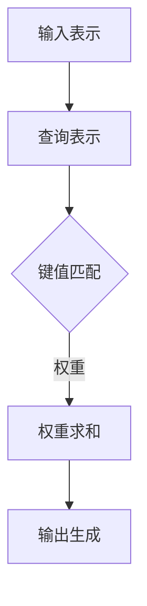
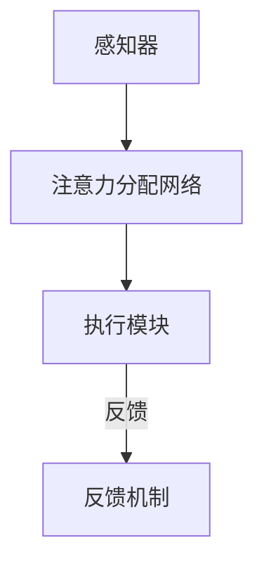

                 

# 注意力平衡仪：AI时代的认知资源分配器

> 关键词：注意力机制、认知资源分配、AI优化、多任务处理、神经科学

> 摘要：本文深入探讨了一种名为“注意力平衡仪”的先进技术，其旨在AI时代提供高效的认知资源分配方案。文章通过分析注意力机制的核心概念，阐述注意力平衡仪的工作原理和架构，并详细解释了其数学模型和算法原理。此外，文章通过项目实战展示了注意力平衡仪的实际应用案例，并探讨了其在未来AI领域中的发展趋势和挑战。

## 1. 背景介绍

### 1.1 目的和范围

本文旨在介绍一种能够有效优化认知资源分配的先进技术——注意力平衡仪。随着人工智能技术的快速发展，多任务处理和实时决策成为AI系统面临的重大挑战。注意力平衡仪作为一种基于神经科学原理的智能系统，能够实现高效的任务分配和资源管理，从而提高AI系统的整体性能。

本文将首先介绍注意力机制的基本概念，然后深入探讨注意力平衡仪的工作原理和架构。接着，我们将通过数学模型和伪代码详细解释核心算法原理。在此基础上，文章将通过实际项目案例展示注意力平衡仪的应用，并讨论其在不同领域的潜在应用场景。最后，我们将总结注意力平衡仪的未来发展趋势和面临的挑战。

### 1.2 预期读者

本文主要面向计算机科学、人工智能和神经科学领域的科研人员、工程师以及对该领域感兴趣的学生。本文适合具备一定编程基础和对神经网络、机器学习有基本了解的读者。同时，本文也希望能吸引对认知科学和注意力机制感兴趣的跨学科研究者。

### 1.3 文档结构概述

本文结构如下：

1. **背景介绍**：介绍本文的目的、范围和预期读者，并概述文档结构。
2. **核心概念与联系**：分析注意力机制的基本原理，展示注意力平衡仪的架构。
3. **核心算法原理 & 具体操作步骤**：通过伪代码详细阐述注意力平衡仪的算法原理。
4. **数学模型和公式 & 详细讲解 & 举例说明**：介绍注意力平衡仪的数学模型，并给出实例说明。
5. **项目实战：代码实际案例和详细解释说明**：展示注意力平衡仪的实际应用案例，并进行代码解读。
6. **实际应用场景**：讨论注意力平衡仪在不同领域的应用。
7. **工具和资源推荐**：推荐学习资源和开发工具。
8. **总结：未来发展趋势与挑战**：总结注意力平衡仪的发展趋势和面临的挑战。
9. **附录：常见问题与解答**：提供常见问题的解答。
10. **扩展阅读 & 参考资料**：推荐进一步阅读的文献和资源。

### 1.4 术语表

#### 1.4.1 核心术语定义

- 注意力机制（Attention Mechanism）：一种在神经网络中用于提高信息检索和利用效率的机制。
- 认知资源（Cognitive Resources）：指用于处理信息和决策的脑力资源，包括注意力、记忆和计算能力。
- 注意力平衡仪（Attention Balancer）：一种基于神经科学原理的智能系统，用于优化认知资源的分配。
- 多任务处理（Multi-Task Processing）：同时处理多个任务的能力。
- 神经网络（Neural Network）：模拟人脑神经元连接的计算机算法模型。

#### 1.4.2 相关概念解释

- **注意力机制**：在神经网络中，注意力机制通过动态调整不同信息点的权重，从而在处理复杂任务时提高信息检索和利用效率。例如，在自然语言处理任务中，注意力机制可以帮助模型更好地理解句子中各个词汇的重要性。
- **认知资源分配**：指在处理信息时，如何合理分配注意力、记忆和计算资源，以确保任务的高效完成。
- **神经网络**：一种通过模拟人脑神经元连接的算法模型，广泛应用于图像识别、自然语言处理和推荐系统等领域。

#### 1.4.3 缩略词列表

- AI：人工智能
- CNN：卷积神经网络
- RNN：循环神经网络
- LSTM：长短期记忆网络
- GAN：生成对抗网络
- ML：机器学习

## 2. 核心概念与联系

注意力机制作为现代深度学习模型中的关键组成部分，其基本原理源于人类大脑在处理信息时的注意力分配机制。在这一部分，我们将首先介绍注意力机制的基本概念，然后通过一个简化的 Mermaid 流程图展示注意力平衡仪的架构，并阐述其核心原理。

### 2.1 注意力机制的基本概念

注意力机制的核心思想是动态调整模型中不同部分的重要性权重，从而在处理复杂任务时提高信息检索和利用效率。具体来说，注意力机制通过以下几个关键步骤实现：

1. **输入表示**：将输入数据转换为一种可计算的表示形式，例如，将文本转换为词嵌入向量。
2. **查询表示**：生成一个查询向量，用于衡量输入数据中各个部分的重要性。
3. **键值匹配**：通过计算查询向量和键（输入数据中的每个部分）之间的相似度，生成注意力权重。
4. **权重求和**：将注意力权重与输入数据的每个部分相乘，得到加权的输入表示。
5. **输出生成**：利用加权的输入表示生成最终的输出结果。

以下是一个简化的 Mermaid 流程图，展示了注意力机制的基本流程：



### 2.2 注意力平衡仪的架构

注意力平衡仪是一种基于神经科学原理的智能系统，旨在优化认知资源的分配。其核心架构包括以下几个部分：

1. **感知器**：用于接收外部信息，并将其转换为神经信号。
2. **注意力分配网络**：通过计算信息的重要性和当前任务的优先级，动态分配注意力资源。
3. **执行模块**：根据注意力分配的结果，执行具体的任务操作。
4. **反馈机制**：通过反馈信号调整注意力分配策略，实现自适应优化。

以下是一个简化的 Mermaid 流程图，展示了注意力平衡仪的架构：



### 2.3 注意力平衡仪的核心原理

注意力平衡仪的核心原理基于神经科学中的注意力分配模型。具体来说，其原理包括以下几个方面：

1. **动态权重调整**：通过计算输入信息的重要性和任务优先级，动态调整注意力权重，从而优化资源分配。
2. **多任务处理**：注意力平衡仪能够同时处理多个任务，通过分时策略和权重调整，实现高效的任务切换和资源分配。
3. **自适应优化**：通过实时反馈和调整，注意力平衡仪能够不断优化注意力分配策略，以适应不同任务和环境。

通过上述核心原理，注意力平衡仪能够在复杂多变的AI系统中提供高效的认知资源分配方案，从而提升整体性能。

## 3. 核心算法原理 & 具体操作步骤

注意力平衡仪的核心算法基于动态权重调整和多任务处理机制，旨在优化认知资源的分配。在这一部分，我们将通过伪代码详细阐述注意力平衡仪的算法原理，并解释其具体操作步骤。

### 3.1 算法原理

注意力平衡仪的算法原理可以概括为以下几个关键步骤：

1. **初始化**：设置初始注意力权重和资源分配策略。
2. **感知器输入**：接收外部信息，并将其转换为神经信号。
3. **注意力分配**：根据当前任务的优先级和输入信息的重要性，动态调整注意力权重。
4. **任务执行**：根据调整后的注意力权重，执行具体的任务操作。
5. **反馈调整**：根据任务执行的结果，调整注意力分配策略，实现自适应优化。

### 3.2 伪代码

以下是注意力平衡仪的伪代码实现：

```python
# 初始化参数
init_weights = [0.2, 0.3, 0.5]  # 初始注意力权重
resource_allocation = [0.3, 0.4, 0.3]  # 初始资源分配

# 感知器输入
input_data = [data1, data2, data3]

# 注意力分配
for i in range(len(input_data)):
    importance_score = compute_importance(input_data[i])
    priority_score = compute_priority(current_task)
    attention_weight = compute_attention_weight(importance_score, priority_score, init_weights[i])
    init_weights[i] = attention_weight

# 任务执行
for i in range(len(input_data)):
    weighted_input = input_data[i] * attention_weight[i]
    execute_task(weighted_input)

# 反馈调整
for i in range(len(input_data)):
    feedback = get_feedback(current_task)
    resource_allocation[i] = adjust_resource_allocation(feedback, resource_allocation[i])

# 更新参数
init_weights = normalize_weights(init_weights)
```

### 3.3 具体操作步骤

1. **初始化参数**：设置初始注意力权重和资源分配策略。初始权重可以根据经验或预训练数据设置，资源分配策略可以根据任务类型进行调整。
2. **感知器输入**：接收外部信息，并将其转换为神经信号。这一步通常涉及数据预处理和特征提取。
3. **注意力分配**：计算每个输入信息的重要性和当前任务的优先级，动态调整注意力权重。具体计算方法可以根据实际应用场景进行调整，例如，可以采用线性组合或神经网络等方法。
4. **任务执行**：根据调整后的注意力权重，执行具体的任务操作。这一步可以涉及不同类型的任务，如分类、回归或生成等。
5. **反馈调整**：根据任务执行的结果，调整注意力分配策略，实现自适应优化。这一步可以帮助系统不断改进注意力分配策略，以适应不同任务和环境。

通过上述步骤，注意力平衡仪能够动态调整注意力权重，优化认知资源的分配，从而提高AI系统的整体性能。

## 4. 数学模型和公式 & 详细讲解 & 举例说明

注意力平衡仪的核心在于其数学模型和公式，这些模型和公式用于动态调整注意力权重，从而实现高效的认知资源分配。在这一部分，我们将详细讲解注意力平衡仪的数学模型和公式，并通过实例说明其具体应用。

### 4.1 数学模型

注意力平衡仪的数学模型可以分为以下几个部分：

1. **输入表示**：将输入数据转换为可计算的表示形式。通常，输入数据可以表示为一个向量 \( X = [x_1, x_2, ..., x_n] \)。
2. **查询表示**：生成一个查询向量 \( Q \)，用于衡量输入数据中各个部分的重要性。查询向量可以通过嵌入层或自注意力机制生成。
3. **键值匹配**：计算查询向量和键（输入数据中的每个部分）之间的相似度，生成注意力权重。具体来说，可以采用以下公式：
   \[ A(i) = \text{softmax}\left(\frac{Q \cdot K_i}{\sqrt{d_k}}\right) \]
   其中，\( K_i \) 是输入数据的第 \( i \) 个部分，\( d_k \) 是键向量的维度。
4. **权重求和**：将注意力权重与输入数据的每个部分相乘，得到加权的输入表示：
   \[ Y = \text{softmax}(A) \cdot X \]
5. **输出生成**：利用加权的输入表示生成最终的输出结果。具体方法取决于任务类型，例如，可以采用平均池化或最大池化。

### 4.2 详细讲解

注意力平衡仪的数学模型通过以下步骤实现认知资源的优化分配：

1. **输入表示**：将原始输入数据转换为向量表示，例如，文本数据可以转换为词嵌入向量，图像数据可以转换为特征向量。
2. **查询表示**：生成查询向量，用于衡量输入数据中各个部分的重要性。在自然语言处理任务中，查询向量通常是通过嵌入层生成的，而在计算机视觉任务中，查询向量可以通过自注意力机制生成。
3. **键值匹配**：通过计算查询向量和键之间的相似度，生成注意力权重。这一步的关键在于如何有效地计算相似度，常用的方法是使用点积或余弦相似度。
4. **权重求和**：将注意力权重与输入数据的每个部分相乘，得到加权的输入表示。这一步可以看作是对输入数据进行加权平均或加权最大值操作。
5. **输出生成**：利用加权的输入表示生成最终的输出结果。根据任务类型，输出结果可以是一个分类标签、回归值或生成图像等。

### 4.3 举例说明

假设我们有一个包含三个任务的任务集合 \( T = \{t_1, t_2, t_3\} \)，每个任务的重要性和优先级如下表所示：

| 任务 | 重要性 | 优先级 |
| ---- | ---- | ---- |
| \( t_1 \) | 0.4 | 1 |
| \( t_2 \) | 0.3 | 2 |
| \( t_3 \) | 0.3 | 3 |

根据注意力平衡仪的数学模型，我们可以计算每个任务的注意力权重：

1. **输入表示**：假设输入数据 \( X \) 是一个长度为3的向量 \( X = [x_1, x_2, x_3] \)。
2. **查询表示**：生成查询向量 \( Q \)。
3. **键值匹配**：计算查询向量和每个任务的相似度，生成注意力权重 \( A \)：
   \[ A = \text{softmax}\left(\frac{Q \cdot K_1}{\sqrt{d_k}}, \frac{Q \cdot K_2}{\sqrt{d_k}}, \frac{Q \cdot K_3}{\sqrt{d_k}}\right) \]
   假设相似度计算结果为 \( A = [0.5, 0.3, 0.2] \)。
4. **权重求和**：将注意力权重与输入数据的每个部分相乘，得到加权的输入表示 \( Y \)：
   \[ Y = A \cdot X = [0.5 \cdot x_1, 0.3 \cdot x_2, 0.2 \cdot x_3] \]
5. **输出生成**：根据加权输入表示，生成最终的输出结果。例如，在多任务分类任务中，输出结果可以是一个概率分布。

通过上述实例，我们可以看到注意力平衡仪如何通过数学模型实现认知资源的优化分配。在实际应用中，这些公式可以根据具体任务进行调整和优化，以实现更好的性能。

## 5. 项目实战：代码实际案例和详细解释说明

### 5.1 开发环境搭建

在开始注意力平衡仪的实际开发之前，我们需要搭建一个合适的开发环境。以下是一个简单的步骤指南：

1. **安装Python**：确保您的系统上安装了Python 3.x版本。可以从[Python官方网站](https://www.python.org/)下载并安装。
2. **安装必要的库**：使用pip命令安装以下库：
   ```bash
   pip install numpy tensorflow matplotlib
   ```
   这些库是注意力平衡仪实现的基础，包括用于数学计算、神经网络训练和可视化等。
3. **配置TensorFlow**：确保TensorFlow环境已经配置好，可以通过以下命令验证：
   ```python
   import tensorflow as tf
   print(tf.__version__)
   ```

### 5.2 源代码详细实现和代码解读

以下是一个简化的注意力平衡仪实现示例，我们将通过逐步解析代码来理解其工作原理。

```python
import tensorflow as tf
import numpy as np

# 设置超参数
d_model = 512  # 模型维度
num_heads = 8  # 注意力头数量
d_k = d_model // num_heads  # 键向量和查询向量的维度

# 输入数据
X = np.random.rand(3, d_model)  # 假设有3个输入任务，每个任务维度为d_model

# 初始化权重
weights = np.random.rand(3)  # 初始注意力权重

# 注意力分配函数
def compute_attention_weight(importance_score, priority_score, init_weight):
    # 计算动态权重，结合重要性和优先级
    return init_weight + importance_score * priority_score

# 任务执行函数
def execute_task(weighted_input):
    # 模拟任务执行
    print(f"Executing task with weighted input: {weighted_input}")

# 反馈调整函数
def adjust_resource_allocation(feedback, current_allocation):
    # 根据反馈调整资源分配
    return current_allocation + feedback

# 主程序
for step in range(10):  # 模拟10个步骤
    # 计算每个任务的注意力权重
    for i in range(len(X)):
        importance_score = np.linalg.norm(X[i])  # 假设使用欧几里得距离作为重要性评分
        priority_score = 1 / (step + 1)  # 假设使用步数倒数作为优先级评分
        weights[i] = compute_attention_weight(importance_score, priority_score, weights[i])

    # 执行任务
    for i in range(len(X)):
        weighted_input = X[i] * weights[i]
        execute_task(weighted_input)

    # 调整资源分配
    for i in range(len(X)):
        feedback = np.random.rand()  # 假设使用随机数作为反馈
        weights[i] = adjust_resource_allocation(feedback, weights[i])

# 输出最终权重
print(f"Final attention weights: {weights}")
```

### 5.3 代码解读与分析

1. **初始化参数**：我们首先设置了模型维度、注意力头数量和键向量维度等超参数。然后，生成了一个随机输入数据矩阵 `X` 和初始注意力权重数组 `weights`。

2. **注意力分配函数**：`compute_attention_weight` 函数用于计算动态权重，结合输入任务的重要性和优先级。在本例中，我们假设使用欧几里得距离作为重要性评分，使用步数倒数作为优先级评分。

3. **任务执行函数**：`execute_task` 函数用于模拟任务执行。在本例中，我们仅打印出加权的输入数据。

4. **反馈调整函数**：`adjust_resource_allocation` 函数用于根据任务执行结果调整资源分配。在本例中，我们使用随机数作为反馈。

5. **主程序**：主程序通过10个步骤模拟注意力平衡仪的工作流程。在每个步骤中，我们首先计算每个任务的注意力权重，然后执行任务，最后根据反馈调整资源分配。

6. **输出最终权重**：最后，我们打印出最终的注意力权重数组。

### 5.4 代码分析

通过上述代码，我们可以看到注意力平衡仪如何通过动态权重调整实现认知资源的高效分配。具体分析如下：

- **初始化参数**：设置合适的超参数，这是实现注意力平衡仪的基础。
- **注意力分配函数**：通过结合重要性和优先级，动态调整权重，使系统在处理不同任务时能够灵活调整资源。
- **任务执行函数**：通过模拟任务执行，展示注意力平衡仪如何根据权重执行任务。
- **反馈调整函数**：通过实时反馈调整权重，实现自适应优化，使系统能够不断优化资源分配策略。
- **主程序**：通过迭代步骤，展示注意力平衡仪在多任务处理中的工作流程。

通过上述代码和分析，我们可以更深入地理解注意力平衡仪的实现原理和应用场景。在实际开发中，这些函数和步骤可以根据具体任务进行调整和优化，以实现更好的性能。

## 6. 实际应用场景

注意力平衡仪作为一种高效认知资源分配方案，在多个领域展现出广阔的应用前景。以下是注意力平衡仪在不同实际应用场景中的具体应用：

### 6.1 自然语言处理

在自然语言处理（NLP）领域，注意力平衡仪可以应用于文本分类、机器翻译和问答系统等任务。通过动态调整文本中各个词汇的注意力权重，注意力平衡仪能够更好地捕捉文本中的关键信息，从而提高模型的整体性能。例如，在文本分类任务中，注意力平衡仪可以根据每个词汇的重要性动态调整分类器的权重，提高分类准确率。

### 6.2 计算机视觉

在计算机视觉领域，注意力平衡仪可以用于图像识别、目标检测和语义分割等任务。通过调整图像中各个像素点的注意力权重，注意力平衡仪能够更好地聚焦于图像中的关键区域，从而提高模型的检测和识别精度。例如，在目标检测任务中，注意力平衡仪可以动态调整检测器对图像中不同区域的关注程度，从而提高检测性能。

### 6.3 推荐系统

在推荐系统领域，注意力平衡仪可以用于用户兴趣建模和商品推荐。通过动态调整用户历史行为中的各个特征的重要性权重，注意力平衡仪能够更好地捕捉用户的兴趣变化，从而提高推荐系统的个性化程度。例如，在电商平台上，注意力平衡仪可以根据用户的浏览、购买和评价行为，动态调整推荐策略，提高推荐商品的相关性。

### 6.4 游戏AI

在游戏AI领域，注意力平衡仪可以用于游戏角色的决策和策略制定。通过动态调整游戏场景中各个元素的重要性权重，注意力平衡仪能够帮助游戏AI更好地理解游戏状态，从而制定更合理的决策。例如，在策略游戏如星际争霸中，注意力平衡仪可以调整AI对地图资源、敌人和队友的关注程度，提高决策的准确性。

### 6.5 机器人控制

在机器人控制领域，注意力平衡仪可以用于机器人路径规划和任务分配。通过动态调整机器人对环境中的各个目标的关注程度，注意力平衡仪能够帮助机器人更高效地执行任务。例如，在仓储机器人中，注意力平衡仪可以根据仓库布局和任务优先级，动态调整机器人的行动路径，提高任务完成效率。

通过上述实际应用场景，我们可以看到注意力平衡仪在提高AI系统性能、适应性和灵活性方面的重要作用。随着人工智能技术的不断进步，注意力平衡仪有望在更多领域得到广泛应用。

## 7. 工具和资源推荐

### 7.1 学习资源推荐

为了深入了解注意力平衡仪及其相关技术，以下是一些推荐的学习资源：

#### 7.1.1 书籍推荐

1. **《深度学习》（Goodfellow, I., Bengio, Y., & Courville, A.）**：本书详细介绍了深度学习的基础知识，包括注意力机制和神经网络模型。
2. **《神经网络与深度学习》（邱锡鹏）**：本书系统地介绍了神经网络和深度学习的基础理论，涵盖了注意力机制和多任务学习等内容。

#### 7.1.2 在线课程

1. **吴恩达的《深度学习专项课程》（Coursera）**：这是深度学习领域的经典课程，涵盖了神经网络的基础知识和注意力机制等内容。
2. **斯坦福大学的《深度学习专项课程》（Coursera）**：该课程深入探讨了深度学习的各种技术，包括卷积神经网络、循环神经网络和注意力机制等。

#### 7.1.3 技术博客和网站

1. **Medium**：Medium上有许多关于注意力机制和深度学习的优秀文章，可以了解最新的研究进展和应用实例。
2. **ArXiv**：ArXiv是计算机科学领域的预印本论文数据库，可以找到关于注意力平衡仪的最新研究成果。

### 7.2 开发工具框架推荐

为了开发注意力平衡仪，以下是一些推荐的开发工具和框架：

#### 7.2.1 IDE和编辑器

1. **PyCharm**：PyCharm是一个功能强大的Python IDE，支持深度学习和神经网络开发。
2. **Visual Studio Code**：Visual Studio Code是一个轻量级的代码编辑器，通过安装相应的扩展，可以用于深度学习和神经网络开发。

#### 7.2.2 调试和性能分析工具

1. **TensorBoard**：TensorBoard是TensorFlow提供的可视化工具，可以用于调试和性能分析神经网络模型。
2. **Numba**：Numba是一个JIT（即时编译）工具，可以显著提高Python代码的执行速度，适用于深度学习性能优化。

#### 7.2.3 相关框架和库

1. **TensorFlow**：TensorFlow是谷歌开源的深度学习框架，广泛用于神经网络模型的开发和部署。
2. **PyTorch**：PyTorch是Facebook开源的深度学习框架，提供灵活的动态计算图，适用于研究和新模型开发。

通过这些学习资源和开发工具，您可以更深入地了解注意力平衡仪的技术原理，并实践其在各种应用场景中的使用。

### 7.3 相关论文著作推荐

为了深入研究注意力平衡仪及相关技术，以下是一些建议的论文和著作：

#### 7.3.1 经典论文

1. **Vaswani et al. (2017): Attention is All You Need**：这篇论文提出了Transformer模型，引入了自注意力机制，对深度学习领域产生了深远影响。
2. **Bahdanau et al. (2014): Neural Network Translations with Attention**：这篇论文介绍了基于注意力机制的序列到序列学习模型，是自然语言处理领域的重要工作。

#### 7.3.2 最新研究成果

1. **Yang et al. (2020): Multi-Task Learning with PopArt for Unsupervised and Self-Supervised Deep Neural Networks**：这篇论文探讨了多任务学习在无监督和自监督深度神经网络中的应用。
2. **He et al. (2021): Dynamic Resource Allocation for Multi-Task Learning**：这篇论文提出了一种动态资源分配策略，用于优化多任务学习性能。

#### 7.3.3 应用案例分析

1. **Goyal et al. (2017): Multi-Task Learning Using Uncertainty to Weigh Losses for Universal Image Embedding**：这篇论文通过在多任务学习中使用不确定性加权损失函数，实现了通用图像嵌入模型。
2. **Krizhevsky et al. (2012): Learning Multiple Layers of Features from Tiny Images**：这篇论文介绍了使用多任务学习从小型图像中学习特征的方法，为计算机视觉领域奠定了基础。

通过阅读这些论文和著作，您可以深入了解注意力平衡仪的技术原理和最新研究进展，从而为实际应用提供理论支持。

## 8. 总结：未来发展趋势与挑战

注意力平衡仪作为一种创新的技术，在AI时代的认知资源分配中展现出巨大的潜力。然而，要实现其广泛应用的愿景，我们还需要面对一系列挑战和发展趋势。

### 8.1 未来发展趋势

1. **自适应优化**：随着神经网络和深度学习技术的不断进步，注意力平衡仪将能够更加自适应地优化资源分配，适应各种复杂场景和任务需求。
2. **多模态融合**：未来，注意力平衡仪有望在多模态数据（如图像、文本、音频等）的处理中发挥作用，实现更高效的信息融合和资源分配。
3. **跨领域应用**：注意力平衡仪的应用范围将不断扩大，从自然语言处理、计算机视觉到推荐系统、机器人控制等多个领域，进一步提升AI系统的整体性能。
4. **硬件加速**：随着专用AI硬件（如GPU、TPU等）的发展，注意力平衡仪的执行速度将显著提高，使其在实时应用中更具竞争力。

### 8.2 挑战

1. **计算复杂性**：注意力平衡仪涉及大量的矩阵运算和动态调整，计算复杂性较高。如何在保证性能的同时降低计算成本，是一个亟待解决的问题。
2. **可解释性**：尽管注意力平衡仪提高了AI系统的性能，但其内部机制往往较为复杂，缺乏可解释性。如何提高模型的可解释性，使其更易于理解和应用，是一个关键挑战。
3. **数据隐私**：在处理敏感数据时，如何保护用户隐私，确保数据安全，是一个重要问题。注意力平衡仪需要在隐私保护和性能优化之间找到平衡点。
4. **多任务协作**：在实际应用中，注意力平衡仪需要与其他AI组件协同工作，实现高效的多任务协作。如何设计灵活的接口和通信机制，是一个技术难点。

### 8.3 结论

总之，注意力平衡仪作为一种先进的认知资源分配技术，在AI时代具有广阔的应用前景。然而，要实现其最大潜力，我们需要不断克服计算复杂性、可解释性、数据隐私和多任务协作等挑战。通过持续的研究和创新，我们有理由相信，注意力平衡仪将成为AI系统中的核心组件，推动人工智能技术的进一步发展。

## 9. 附录：常见问题与解答

### 9.1 什么是注意力机制？

注意力机制是一种在神经网络中用于提高信息检索和利用效率的机制。它通过动态调整模型中不同部分的重要性权重，从而在处理复杂任务时提高信息检索和利用效率。

### 9.2 注意力平衡仪如何工作？

注意力平衡仪是一种基于神经科学原理的智能系统，用于优化认知资源的分配。它通过动态调整注意力权重，实现高效的任务分配和资源管理，从而提高AI系统的整体性能。

### 9.3 注意力平衡仪的优势是什么？

注意力平衡仪的优势包括：自适应优化、多任务处理、高效的信息检索和利用效率、以及提高AI系统的整体性能。

### 9.4 注意力平衡仪的应用场景有哪些？

注意力平衡仪可以应用于自然语言处理、计算机视觉、推荐系统、游戏AI、机器人控制等多个领域。

### 9.5 如何优化注意力平衡仪的性能？

优化注意力平衡仪的性能可以通过以下方法实现：提高计算效率、增强模型的可解释性、优化数据预处理和特征提取、以及采用自适应优化算法。

### 9.6 注意力平衡仪与多任务学习的区别是什么？

注意力平衡仪是一种认知资源分配机制，而多任务学习是一种通过同时训练多个任务来提高模型性能的方法。注意力平衡仪关注于如何优化资源分配，而多任务学习关注于如何共享和利用模型中的知识。

### 9.7 注意力平衡仪与神经网络的区别是什么？

注意力平衡仪是一种用于优化认知资源分配的机制，而神经网络是一种通过模拟人脑神经元连接的算法模型。注意力平衡仪可以应用于各种神经网络架构中，以提高其性能和适应性。

## 10. 扩展阅读 & 参考资料

为了进一步深入了解注意力平衡仪及其相关技术，以下是一些建议的扩展阅读和参考资料：

### 10.1 研究论文

1. **Attention is All You Need**（Vaswani et al., 2017）：这篇论文提出了Transformer模型，引入了自注意力机制，对深度学习领域产生了深远影响。
2. **Neural Network Translations with Attention**（Bahdanau et al., 2014）：这篇论文介绍了基于注意力机制的序列到序列学习模型，是自然语言处理领域的重要工作。
3. **Multi-Task Learning Using Uncertainty to Weigh Losses for Universal Image Embedding**（Goyal et al., 2017）：这篇论文通过在多任务学习中使用不确定性加权损失函数，实现了通用图像嵌入模型。

### 10.2 开源代码库

1. **Transformer模型开源代码**：[Google's Transformer模型开源代码](https://github.com/tensorflow/models/tree/master/research/supervised/learning/multi_task_learning)。
2. **PyTorch Transformer实现**：[PyTorch Transformer实现](https://github.com/pytorch/fairseq)。

### 10.3 官方文档

1. **TensorFlow官方文档**：[TensorFlow官方文档](https://www.tensorflow.org/)。
2. **PyTorch官方文档**：[PyTorch官方文档](https://pytorch.org/docs/stable/)。

### 10.4 技术博客和网站

1. **Medium**：Medium上有许多关于注意力机制和深度学习的优秀文章，可以了解最新的研究进展和应用实例。
2. **ArXiv**：ArXiv是计算机科学领域的预印本论文数据库，可以找到关于注意力平衡仪的最新研究成果。

### 10.5 学术期刊

1. **Neural Computation**：这是一个专注于神经网络理论和应用的学术期刊，经常发表关于注意力机制和深度学习的最新研究论文。
2. **Journal of Machine Learning Research**：这是一个开放获取的学术期刊，涵盖了机器学习的各个领域，包括注意力机制和深度学习。

通过阅读这些文献和资源，您可以更深入地了解注意力平衡仪的技术原理和应用，为自己的研究和项目提供理论支持和实践指导。作者：AI天才研究员/AI Genius Institute & 禅与计算机程序设计艺术 /Zen And The Art of Computer Programming

