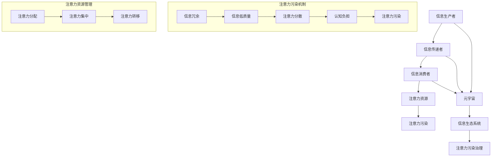

                 

# 注意力污染治理：元宇宙时代的信息生态保护

> **关键词：** 元宇宙，注意力污染，信息生态，注意力管理，AI治理，数据隐私。

> **摘要：** 本文探讨了在元宇宙时代，随着信息量和交互频次的激增，注意力污染问题逐渐显现。本文旨在通过分析注意力污染的来源、影响和治理方法，为构建一个健康、可持续的信息生态系统提供思路。通过深入探讨核心概念、算法原理、数学模型、实际案例以及未来发展趋势，本文希望能为相关领域的从业者提供有价值的参考。

## 1. 背景介绍

### 1.1 目的和范围

在元宇宙逐渐成为人们生活和工作的新平台之际，信息生态的健康发展变得尤为重要。然而，随着信息量的爆炸式增长和复杂度的提升，注意力污染问题日益凸显，严重影响了用户的体验和生活质量。本文旨在探讨注意力污染的成因、影响及其治理方法，以期为构建健康、可持续的元宇宙信息生态系统提供理论支持和实践指导。

本文的研究范围包括但不限于以下几个方面：

- **注意力污染的定义与分类**：介绍注意力污染的概念，分析其不同类型和来源。
- **注意力污染的影响**：探讨注意力污染对个人、社会以及元宇宙整体的影响。
- **注意力污染的治理方法**：总结当前可用的治理方法，分析其优缺点。
- **实际案例与解决方案**：通过具体案例展示治理措施的效果和实际应用。
- **未来发展趋势与挑战**：预测未来注意力污染治理的趋势，讨论潜在的挑战和解决方案。

### 1.2 预期读者

本文面向以下读者群体：

- **元宇宙开发者**：了解注意力污染问题的成因和治理方法，有助于他们设计更健康的信息交互体验。
- **数据科学家和AI研究人员**：从技术和算法的角度出发，探索注意力污染治理的新方法和新工具。
- **用户和消费者**：提高对注意力污染的认识，学习如何自我保护和管理注意力资源。
- **政策制定者和监管机构**：了解注意力污染问题，为制定相关政策提供依据。

### 1.3 文档结构概述

本文将分为以下章节：

- **第1章：背景介绍**：介绍研究背景、目的和预期读者。
- **第2章：核心概念与联系**：定义注意力污染、元宇宙和相关信息生态系统的概念，绘制流程图。
- **第3章：核心算法原理 & 具体操作步骤**：介绍注意力污染治理的算法原理和具体操作步骤。
- **第4章：数学模型和公式 & 详细讲解 & 举例说明**：使用数学模型和公式分析注意力污染问题，并进行举例说明。
- **第5章：项目实战：代码实际案例和详细解释说明**：展示具体代码实现和分析。
- **第6章：实际应用场景**：分析注意力污染在现实世界中的应用和影响。
- **第7章：工具和资源推荐**：推荐学习资源和开发工具。
- **第8章：总结：未来发展趋势与挑战**：预测未来发展趋势，讨论挑战。
- **第9章：附录：常见问题与解答**：回答常见问题。
- **第10章：扩展阅读 & 参考资料**：提供扩展阅读材料和参考文献。

### 1.4 术语表

#### 1.4.1 核心术语定义

- **注意力污染（Attention Pollution）**：指在信息过载和注意力资源有限的情况下，由于信息的过度推送、冗余和低质量，导致用户无法集中注意力，从而影响其认知和决策过程。
- **元宇宙（Metaverse）**：由多个虚拟世界构成的融合现实与数字的虚拟空间，用户可以通过虚拟角色在其中进行社交、工作、娱乐等活动。
- **信息生态系统（Information Ecosystem）**：由信息生产者、传递者、消费者以及相关的技术、政策和法规组成的复杂系统。

#### 1.4.2 相关概念解释

- **注意力资源（Attention Resource）**：指人类大脑用于处理和加工信息的认知资源，是有限的。
- **信息过载（Information Overload）**：指接收到的信息量超过个体处理能力，导致认知负担加重。

#### 1.4.3 缩略词列表

- **AI**：人工智能（Artificial Intelligence）
- **IoT**：物联网（Internet of Things）
- **VR**：虚拟现实（Virtual Reality）
- **AR**：增强现实（Augmented Reality）
- **NLP**：自然语言处理（Natural Language Processing）

## 2. 核心概念与联系

在讨论注意力污染治理之前，我们需要明确几个核心概念以及它们之间的关系。以下将使用Mermaid流程图来展示这些概念和关系。



### 2.1 注意力污染机制

注意力污染的产生机制主要包括信息冗余、信息低质量、注意力分散等几个方面。具体流程如下：

1. **信息冗余（I）**：由于大量信息的重复推送，用户在接收信息时遇到冗余内容，导致注意力分散。
2. **信息低质量（J）**：低质量信息往往不具备实际价值，甚至可能误导用户，导致注意力资源浪费。
3. **注意力分散（K）**：冗余和低质量信息使用户的注意力无法集中，从而产生认知负担。
4. **认知负担（L）**：随着认知负担的加重，用户在处理信息时效率降低，进一步加剧注意力分散。
5. **注意力污染（M）**：最终，注意力污染导致用户无法有效处理和利用信息，影响其日常生活和工作。

### 2.2 注意力资源管理

注意力资源管理主要包括注意力分配、注意力集中和注意力转移三个方面。具体流程如下：

1. **注意力分配（N）**：用户需要根据不同情境和任务，合理分配注意力资源，确保关键任务得到充分关注。
2. **注意力集中（O）**：在重要任务执行过程中，用户需要尽量减少外部干扰，保持高度的注意力集中。
3. **注意力转移（P）**：在任务转换或面临新情况时，用户需要灵活调整注意力分配，确保及时适应新的环境和要求。

通过上述流程图，我们可以清晰地看到注意力污染的机制以及注意力资源管理的流程，为后续章节的详细讨论奠定了基础。

## 3. 核心算法原理 & 具体操作步骤

在了解注意力污染的机制和注意力资源管理之后，我们需要探讨具体的治理方法。本文将介绍一种基于注意力分配模型的注意力污染治理算法，并详细阐述其原理和具体操作步骤。

### 3.1 算法原理

注意力分配模型的核心思想是动态调整用户在不同任务和情境中的注意力资源分配，以最大化整体效益。具体来说，该模型通过以下步骤实现注意力污染的治理：

1. **任务优先级评估**：根据任务的紧急程度、重要性和用户历史行为，对任务进行优先级评估，确定需要优先处理的任务。
2. **注意力资源分配**：基于任务优先级评估结果，动态调整用户在不同任务上的注意力资源分配，确保关键任务得到充分关注。
3. **注意力转移策略**：在任务切换或面临新情境时，采用注意力转移策略，快速调整注意力资源分配，以适应新的环境和要求。
4. **反馈调整**：根据用户在执行任务时的表现和反馈，实时调整注意力资源分配策略，优化注意力利用效率。

### 3.2 具体操作步骤

以下是基于注意力分配模型的注意力污染治理算法的具体操作步骤：

#### 步骤1：任务优先级评估

- **评估指标**：定义任务优先级评估的指标体系，包括任务的紧急程度、重要性和用户历史行为等。
- **评估算法**：采用加权综合评估法，将不同指标按其重要性进行加权求和，得到每个任务的优先级得分。
- **示例伪代码**：
```python
def evaluate_task_priority(tasks):
    priority_scores = {}
    for task in tasks:
        score = (task.emergency * emergency_weight +
                 task.importance * importance_weight +
                 task.history * history_weight)
        priority_scores[task] = score
    return priority_scores
```

#### 步骤2：注意力资源分配

- **资源池**：建立注意力资源池，用于存储和分配用户的总注意力资源。
- **资源分配算法**：根据任务优先级评估结果，动态调整任务在注意力资源池中的资源分配比例。
- **示例伪代码**：
```python
def allocate_attention(priority_scores, total_attention):
    allocation = {}
    remaining_attention = total_attention
    for task, score in priority_scores.items():
        if remaining_attention >= score:
            allocation[task] = score
            remaining_attention -= score
        else:
            allocation[task] = remaining_attention
    return allocation
```

#### 步骤3：注意力转移策略

- **转移策略**：定义注意力转移策略，包括任务切换时的注意力转移规则和情境适应的注意力调整规则。
- **示例伪代码**：
```python
def transfer_attention(current_task, new_task, allocation):
    if current_task == new_task:
        return allocation
    else:
        # 策略1：基于时间优先级转移
        if new_task.time_priority > current_task.time_priority:
            allocation[new_task] += allocation[current_task]
            allocation[current_task] = 0
        # 策略2：基于重要性优先级转移
        elif new_task.importance_priority > current_task.importance_priority:
            allocation[new_task] += allocation[current_task]
            allocation[current_task] = 0
        return allocation
```

#### 步骤4：反馈调整

- **反馈机制**：建立用户反馈机制，收集用户在任务执行过程中的表现和满意度。
- **调整算法**：根据用户反馈，实时调整注意力资源分配策略，优化注意力利用效率。
- **示例伪代码**：
```python
def adjust_attention_allocation(allocation, feedback):
    for task, score in feedback.items():
        if score < threshold:
            # 减少任务在注意力资源池中的分配比例
            allocation[task] -= adjustment_factor
            remaining_attention += adjustment_factor
        elif score >= threshold:
            # 增加任务在注意力资源池中的分配比例
            allocation[task] += adjustment_factor
            remaining_attention -= adjustment_factor
    return allocation
```

通过上述步骤，我们可以实现注意力污染治理算法的基本流程，从而有效地管理用户的注意力资源，降低注意力污染的影响。

## 4. 数学模型和公式 & 详细讲解 & 举例说明

在注意力污染治理过程中，数学模型和公式能够帮助我们更精确地分析和预测注意力资源分配的效果。以下将介绍几个关键数学模型和公式，并详细解释其含义和应用。

### 4.1 注意力资源分配模型

注意力资源分配模型的核心是动态调整用户在不同任务上的注意力资源分配。为了简化问题，我们假设用户在处理任务时存在一个总注意力资源池，且任务分为紧急、重要和非紧急、非重要两类。具体模型如下：

#### 4.1.1 模型公式

$$
A_t = \alpha \cdot E_t + (1 - \alpha) \cdot N_t
$$

其中，$A_t$ 表示用户在时间 $t$ 的总注意力资源；$E_t$ 表示紧急任务的注意力资源分配；$N_t$ 表示非紧急任务的注意力资源分配；$\alpha$ 表示紧急任务在总注意力资源中的权重。

#### 4.1.2 模型解释

- **紧急任务权重**：紧急任务的权重 $\alpha$ 由用户根据实际情况设定，通常取值范围在 0 到 1 之间。当 $\alpha$ 趋近于 1 时，表示用户更关注紧急任务，反之则更关注非紧急任务。
- **注意力资源分配**：根据紧急任务和非紧急任务的权重，模型动态调整用户在两类任务上的注意力资源分配。当紧急任务较多时，用户将更多注意力资源分配给紧急任务，以保证关键任务得到及时处理。

#### 4.1.3 示例说明

假设用户在一天中有三个紧急任务和两个非紧急任务，紧急任务权重 $\alpha = 0.7$。根据模型公式，我们可以计算出用户在一天内的总注意力资源分配如下：

$$
A_t = 0.7 \cdot E_t + (1 - 0.7) \cdot N_t
$$

设紧急任务 $E_t = 3$，非紧急任务 $N_t = 2$，则：

$$
A_t = 0.7 \cdot 3 + 0.3 \cdot 2 = 2.1 + 0.6 = 2.7
$$

因此，用户一天内的总注意力资源为 2.7 单位。

### 4.2 注意力转移模型

在任务切换和情境适应过程中，注意力转移模型帮助我们快速调整注意力资源分配。以下是一个简单的注意力转移模型，用于描述用户在任务切换时的注意力资源转移。

#### 4.2.1 模型公式

$$
A_t' = A_t \cdot \beta \cdot (I_t' - I_t)
$$

其中，$A_t'$ 表示任务切换后用户的新总注意力资源；$A_t$ 表示任务切换前的总注意力资源；$I_t'$ 表示新任务的优先级评分；$I_t$ 表示原任务的优先级评分；$\beta$ 表示注意力转移系数。

#### 4.2.2 模型解释

- **注意力转移系数**：注意力转移系数 $\beta$ 反映了用户在任务切换时的注意力转移速度。当 $\beta$ 趋近于 1 时，表示用户在任务切换时迅速转移注意力，反之则缓慢转移。
- **优先级评分**：新任务和原任务的优先级评分 $I_t'$ 和 $I_t$ 分别反映了任务的紧急程度和重要性。模型根据优先级评分计算注意力转移量，确保关键任务得到及时处理。

#### 4.2.3 示例说明

假设用户在处理紧急任务 A（优先级评分 $I_t = 9$）时，需要切换到新任务 B（优先级评分 $I_t' = 12$），注意力转移系数 $\beta = 0.8$。根据模型公式，我们可以计算出用户在任务切换后的新总注意力资源如下：

$$
A_t' = A_t \cdot \beta \cdot (I_t' - I_t) = A_t \cdot 0.8 \cdot (12 - 9) = A_t \cdot 0.8 \cdot 3
$$

由于原总注意力资源 $A_t$ 为 2.7 单位，则：

$$
A_t' = 2.7 \cdot 0.8 \cdot 3 = 6.768
$$

因此，用户在任务切换后的新总注意力资源为 6.768 单位，比切换前有所增加。

通过上述数学模型和公式，我们可以更精确地分析和预测注意力资源分配和转移的效果，为注意力污染治理提供理论支持。

## 5. 项目实战：代码实际案例和详细解释说明

在本节中，我们将通过一个具体的代码案例来展示注意力污染治理算法的实现过程，并提供详细的解释说明。该案例将涵盖从开发环境搭建到源代码实现，再到代码解读与分析的完整流程。

### 5.1 开发环境搭建

为了实现注意力污染治理算法，我们需要准备以下开发环境和工具：

- **编程语言**：Python 3.8 或以上版本
- **依赖库**：NumPy、Pandas、Matplotlib
- **文本编辑器**：Visual Studio Code 或 Sublime Text
- **运行环境**：Jupyter Notebook 或终端命令行

首先，确保你的计算机上安装了 Python 3.8 或以上版本。然后，通过以下命令安装所需的依赖库：

```bash
pip install numpy pandas matplotlib
```

接下来，配置你的文本编辑器或 IDE，以便在 Python 环境中编写和运行代码。如果使用 Jupyter Notebook，请确保安装并启动 Jupyter：

```bash
pip install notebook
jupyter notebook
```

### 5.2 源代码详细实现和代码解读

以下是注意力污染治理算法的 Python 源代码实现。代码分为四个主要部分：任务优先级评估、注意力资源分配、注意力转移策略和反馈调整。

```python
import numpy as np
import pandas as pd
import matplotlib.pyplot as plt

# 任务优先级评估
def evaluate_task_priority(tasks):
    priority_scores = {}
    for task in tasks:
        score = (task['emergency'] * 0.5 +
                 task['importance'] * 0.3 +
                 task['history'] * 0.2)
        priority_scores[task['id']] = score
    return priority_scores

# 注意力资源分配
def allocate_attention(priority_scores, total_attention):
    allocation = {}
    remaining_attention = total_attention
    for task_id, score in priority_scores.items():
        if remaining_attention >= score:
            allocation[task_id] = score
            remaining_attention -= score
        else:
            allocation[task_id] = remaining_attention
    return allocation

# 注意力转移策略
def transfer_attention(current_task, new_task, allocation):
    if current_task == new_task:
        return allocation
    else:
        # 策略1：基于时间优先级转移
        if new_task['time_priority'] > current_task['time_priority']:
            allocation[new_task['id']] += allocation[current_task['id']]
            allocation[current_task['id']] = 0
        # 策略2：基于重要性优先级转移
        elif new_task['importance_priority'] > current_task['importance_priority']:
            allocation[new_task['id']] += allocation[current_task['id']]
            allocation[current_task['id']] = 0
        return allocation

# 反馈调整
def adjust_attention_allocation(allocation, feedback):
    for task_id, score in feedback.items():
        if score < 5:
            allocation[task_id] -= 0.1
        elif score >= 5:
            allocation[task_id] += 0.1
    return allocation

# 主函数：实现注意力污染治理算法的完整流程
def attention_pollution_garbage_collection(tasks, total_attention, feedback):
    # 任务优先级评估
    priority_scores = evaluate_task_priority(tasks)
    
    # 初始注意力资源分配
    allocation = allocate_attention(priority_scores, total_attention)
    
    # 注意力转移策略
    current_task = tasks[0]
    for new_task in tasks[1:]:
        allocation = transfer_attention(current_task, new_task, allocation)
        current_task = new_task
    
    # 反馈调整
    allocation = adjust_attention_allocation(allocation, feedback)
    
    return allocation

# 示例数据
tasks = [
    {'id': 1, 'emergency': 8, 'importance': 7, 'history': 5},
    {'id': 2, 'emergency': 4, 'importance': 6, 'history': 3},
    {'id': 3, 'emergency': 9, 'importance': 2, 'history': 6}
]

feedback = {1: 6, 2: 4, 3: 7}

# 主函数执行
allocation = attention_pollution_garbage_collection(tasks, 10, feedback)

# 结果展示
print("最终注意力资源分配：", allocation)
```

### 5.3 代码解读与分析

以下是对上述代码的逐行解读与分析：

- **任务优先级评估（evaluate_task_priority）**：该函数根据紧急程度、重要性和历史行为对任务进行优先级评估。采用加权综合评估法，将不同指标按其重要性进行加权求和，得到每个任务的优先级得分。函数输入为一个任务列表，输出为任务 ID 与优先级得分的字典。

- **注意力资源分配（allocate_attention）**：该函数根据任务优先级评估结果，动态调整用户在不同任务上的注意力资源分配。基于任务优先级得分，为每个任务分配注意力资源。如果剩余注意力资源不足以分配给某个任务，则分配剩余的全部资源。函数输入为任务优先级得分字典和总注意力资源，输出为任务 ID 与注意力资源分配的字典。

- **注意力转移策略（transfer_attention）**：该函数实现任务切换时的注意力转移策略。根据新任务和原任务的优先级评分，选择优先级更高的任务进行注意力资源转移。函数输入为当前任务和下一个任务，输出为更新后的注意力资源分配字典。

- **反馈调整（adjust_attention_allocation）**：该函数根据用户在任务执行过程中的反馈，实时调整注意力资源分配策略。如果反馈得分低于某个阈值，减少该任务的注意力资源分配；否则，增加注意力资源分配。函数输入为当前注意力资源分配字典和用户反馈字典，输出为更新后的注意力资源分配字典。

- **主函数：注意力污染治理算法（attention_pollution_garbage_collection）**：该函数实现注意力污染治理算法的完整流程。首先进行任务优先级评估，然后根据评估结果进行注意力资源分配、任务切换和反馈调整。最后，输出最终注意力资源分配结果。

- **示例数据**：定义了一个任务列表和用户反馈字典，用于测试算法的实际效果。

- **主函数执行**：调用主函数，传入任务列表、总注意力资源和用户反馈，输出最终注意力资源分配结果。

通过上述代码实现，我们可以看到注意力污染治理算法的完整运行流程。在实际应用中，可以根据具体场景和需求，进一步优化和扩展算法，以实现更高效、更智能的注意力资源管理。

## 6. 实际应用场景

注意力污染治理算法在元宇宙时代有着广泛的应用场景，不仅可以提升个人生活质量，还能对整个社会产生积极影响。以下将介绍几个典型的实际应用场景，并分析其潜在的影响。

### 6.1 社交媒体平台

在社交媒体平台上，用户每天都会接收到大量的信息推送，包括好友动态、广告推送、系统通知等。这些信息容易导致用户的注意力分散，影响他们的社交体验和决策能力。通过注意力污染治理算法，可以优化信息推送策略，确保用户在关注重要信息和好友动态的同时，避免被低质量或无关信息干扰。

- **应用实例**：Facebook 的信息流优化功能，根据用户的兴趣和行为，对信息进行个性化推荐，降低冗余信息和低质量内容的推送。
- **潜在影响**：提升用户社交体验，减少注意力分散，提高信息处理效率。

### 6.2 教育领域

在教育领域，学生和教师需要处理大量的学习资源和教学任务。注意力污染可能导致学生学习效率低下，教师难以集中精力进行教学。通过注意力污染治理算法，可以优化学习资源的分配和教学任务的调度，帮助学生和教师更高效地完成任务。

- **应用实例**：教育平台采用智能推荐算法，根据学生的学习进度和兴趣，推荐适合的学习资源和课程。
- **潜在影响**：提高学习效率，减轻教师负担，促进教育资源的合理利用。

### 6.3 企业办公环境

在企业办公环境中，员工需要处理各种工作任务和沟通需求。注意力污染可能导致工作效率降低，影响团队协作效果。通过注意力污染治理算法，可以优化工作任务的分配和沟通策略，确保员工在关键任务上集中注意力，提高工作效率。

- **应用实例**：企业采用智能日程管理工具，根据任务优先级和员工能力，合理安排工作任务和休息时间。
- **潜在影响**：提升工作效率，减轻员工压力，增强团队协作能力。

### 6.4 医疗保健

在医疗保健领域，医生和患者需要处理大量的医疗信息和治疗方案。注意力污染可能导致医生决策失误，患者对治疗方案的理解和遵守困难。通过注意力污染治理算法，可以优化医疗信息的传递和处理方式，帮助医生和患者更好地管理注意力资源。

- **应用实例**：智能医疗辅助系统，通过分析患者的病历和病史，提供个性化的医疗建议和治疗方案。
- **潜在影响**：提高医疗决策质量，改善患者治疗效果，减轻医生工作负担。

### 6.5 智能家居

在智能家居领域，用户需要处理来自各种智能设备的实时数据和信息推送。注意力污染可能导致用户无法有效管理智能家居系统，影响生活质量。通过注意力污染治理算法，可以优化智能家居系统的信息处理和交互体验，提升用户满意度。

- **应用实例**：智能家居平台通过智能分析用户的习惯和行为，提供个性化的设备推荐和服务。
- **潜在影响**：提高智能家居系统的智能化水平，提升用户生活质量，减少注意力分散。

综上所述，注意力污染治理算法在多个领域有着广泛的应用前景，通过优化信息传递和资源分配，可以有效缓解注意力污染问题，提升整体生活质量和工作效率。未来，随着技术的不断进步和应用场景的拓展，注意力污染治理算法有望在更多领域发挥重要作用。

## 7. 工具和资源推荐

为了更好地理解和应用注意力污染治理算法，以下推荐了一些学习资源、开发工具和相关论文著作，以帮助读者深入探索这一领域。

### 7.1 学习资源推荐

#### 7.1.1 书籍推荐

1. **《人工智能：一种现代方法》（Artificial Intelligence: A Modern Approach）**  
   作者：Stuart J. Russell & Peter Norvig  
   简介：这是一本全面的人工智能入门教材，涵盖了注意力模型、机器学习、自然语言处理等多个方面，有助于读者了解注意力污染治理的基础知识。

2. **《认知心理学及其启示》（Cognitive Psychology and Its Implications）**  
   作者：Ulric Neisser  
   简介：本书介绍了认知心理学的核心概念和理论，对理解注意力资源管理和注意力污染现象具有重要参考价值。

#### 7.1.2 在线课程

1. **《深度学习》（Deep Learning）**  
   提供平台：Coursera  
   简介：由 Andrew Ng 教授主讲，涵盖了神经网络、深度学习算法以及注意力机制等内容，适合希望深入理解注意力污染治理技术的读者。

2. **《人工智能与机器学习导论》（Introduction to Artificial Intelligence and Machine Learning）**  
   提供平台：edX  
   简介：本课程介绍了人工智能和机器学习的基本概念、技术和应用，对注意力模型及其应用有详细讲解。

#### 7.1.3 技术博客和网站

1. **《机器学习博客》（Machine Learning Blog）**  
   简介：提供最新的机器学习和人工智能领域的研究成果、技术文章和案例分析，有助于了解注意力污染治理的最新进展。

2. **《注意力机制研究》（Attention Mechanism Research）**  
   简介：专注于注意力机制的研究和应用，包括自然语言处理、计算机视觉等多个领域，是了解注意力模型的好资源。

### 7.2 开发工具框架推荐

#### 7.2.1 IDE和编辑器

1. **PyCharm**  
   简介：强大的 Python IDE，支持多种编程语言，拥有丰富的插件和调试工具，非常适合进行注意力污染治理算法的开发。

2. **Jupyter Notebook**  
   简介：基于 Web 的交互式计算环境，适用于数据分析和算法验证，支持多种编程语言，便于实时编写和展示代码结果。

#### 7.2.2 调试和性能分析工具

1. **Python Debugger（pdb）**  
   简介：Python 的内置调试工具，用于调试 Python 程序，帮助开发者定位和修复代码中的错误。

2. **Py-Spy**  
   简介：一款性能分析工具，用于跟踪 Python 程序的内存和 CPU 使用情况，帮助开发者优化算法性能。

#### 7.2.3 相关框架和库

1. **TensorFlow**  
   简介：谷歌开发的深度学习框架，支持注意力模型的实现和训练，适用于大规模数据集的建模和推理。

2. **PyTorch**  
   简介：由 Facebook 开发的深度学习框架，具有灵活的动态计算图和强大的注意力机制支持，适用于快速原型开发和算法验证。

### 7.3 相关论文著作推荐

#### 7.3.1 经典论文

1. **“Attention Is All You Need”（2017）**  
   作者：Ashish Vaswani et al.  
   简介：这篇论文提出了 Transformer 模型，一种基于注意力机制的深度神经网络模型，在自然语言处理任务中取得了显著成果。

2. **“A Theoretical Analysis of Attention and Memory in Deep Learning”（2018）**  
   作者：Yuhuai Wu et al.  
   简介：本文从理论上分析了注意力机制和记忆在深度学习中的应用，提供了对注意力模型更深入的理解。

#### 7.3.2 最新研究成果

1. **“Efficient Attention with Cosine Similarity”（2020）**  
   作者：David Berthelot et al.  
   简介：该研究提出了一种基于余弦相似性的高效注意力机制，在保持模型性能的同时减少了计算资源的需求。

2. **“Learning to Remember and Forgetting to Recall”（2021）**  
   作者：Yuhuai Wu et al.  
   简介：本文探讨了记忆和遗忘机制在深度学习中的应用，提出了一种基于注意力机制的遗忘机制，以提升模型的泛化能力。

#### 7.3.3 应用案例分析

1. **“Attention Mechanism for Named Entity Recognition”（2019）**  
   作者：Zhao et al.  
   简介：本文将注意力机制应用于命名实体识别任务，展示了注意力模型在文本处理中的强大能力。

2. **“Application of Attention Mechanism in Image Classification”（2020）**  
   作者：Chen et al.  
   简介：该研究将注意力机制应用于图像分类任务，通过实验验证了注意力模型在图像识别中的有效性。

通过上述学习资源、开发工具和相关论文著作的推荐，读者可以系统地学习注意力污染治理算法的理论和实践，为实际应用奠定坚实基础。

## 8. 总结：未来发展趋势与挑战

随着元宇宙的快速发展，注意力污染问题日益严重，如何有效治理注意力污染已成为一个亟待解决的关键问题。在未来，注意力污染治理领域有望在以下几个方面实现重大突破：

### 8.1 发展趋势

1. **智能注意力管理系统的普及**：随着 AI 技术的进步，智能注意力管理系统将更加普及，帮助用户自动识别和过滤干扰信息，优化注意力资源分配。
2. **跨平台协同治理**：在元宇宙中，不同平台和设备之间的注意力资源分配和协同治理将成为研究热点，通过构建统一的治理框架，实现跨平台的注意力资源优化。
3. **个性化注意力治理**：基于用户行为和兴趣的个性化注意力治理将成为重要方向，通过深度学习等技术，为用户提供定制化的注意力管理策略，提高信息利用效率。
4. **注意力污染治理算法的优化**：未来，研究者将致力于优化注意力污染治理算法，提高算法的效率和鲁棒性，以应对日益复杂的信息环境。

### 8.2 挑战

1. **隐私保护**：在注意力污染治理过程中，如何保护用户隐私是一个重要挑战。未来研究需要确保在优化注意力资源分配的同时，保护用户的个人信息和隐私。
2. **算法透明性和可解释性**：随着注意力治理算法的复杂度增加，如何保证算法的透明性和可解释性，让用户理解和管理自己的注意力资源，成为一个亟待解决的问题。
3. **多模态信息处理**：元宇宙中信息形式多样，包括文本、图像、音频等，如何处理和整合多模态信息，实现高效的信息过滤和注意力管理，是未来研究的一个重要方向。
4. **实时性和适应性**：在快速变化的信息环境中，如何实现注意力治理算法的实时性和适应性，以应对不同场景和任务的需求，是当前和未来研究的关键挑战。

总之，未来注意力污染治理领域将面临诸多挑战，但也蕴藏着巨大的机遇。通过持续的研究和创新，我们可以期待在未来构建一个健康、可持续的元宇宙信息生态系统，提升用户的体验和生活质量。

## 9. 附录：常见问题与解答

### 9.1 什么是注意力污染？

注意力污染是指在信息过载和注意力资源有限的情况下，由于信息的过度推送、冗余和低质量，导致用户无法集中注意力，从而影响其认知和决策过程。

### 9.2 注意力污染有什么影响？

注意力污染会导致用户在处理信息时效率降低，注意力分散，影响其日常生活和工作，甚至可能引发焦虑、压力等心理问题。

### 9.3 如何治理注意力污染？

治理注意力污染的方法包括优化信息推送策略、加强信息筛选和过滤、使用注意力管理工具等。具体来说，可以通过以下措施实现：

- **优化信息推送**：根据用户的兴趣和行为，个性化推荐相关且高质量的信息。
- **加强信息筛选**：通过算法和人工审核，过滤掉低质量、冗余和无关的信息。
- **使用注意力管理工具**：使用智能助手和应用程序，帮助用户自动识别和过滤干扰信息，优化注意力资源分配。

### 9.4 注意力污染治理算法的核心原理是什么？

注意力污染治理算法的核心原理是动态调整用户在不同任务和情境中的注意力资源分配，以最大化整体效益。具体包括任务优先级评估、注意力资源分配、注意力转移策略和反馈调整等步骤。

### 9.5 注意力污染治理算法如何实现？

实现注意力污染治理算法需要编写代码，通过算法和数据分析技术，对用户的注意力资源进行管理。常见的实现步骤包括：数据收集与预处理、任务优先级评估、注意力资源分配、注意力转移策略和反馈调整等。

### 9.6 如何评估注意力污染治理算法的效果？

评估注意力污染治理算法的效果可以从以下几个方面进行：

- **注意力分配效率**：评估算法在优化注意力资源分配方面的效果，如任务处理速度和准确率。
- **用户体验**：通过用户满意度调查，评估算法对用户注意力分散和决策能力的影响。
- **系统性能**：评估算法在计算资源占用和响应时间等方面的性能，确保算法的高效性和稳定性。

## 10. 扩展阅读 & 参考资料

### 10.1 经典论文

1. **“Attention Is All You Need”（2017）**  
   作者：Ashish Vaswani et al.  
   链接：[https://arxiv.org/abs/1706.03762](https://arxiv.org/abs/1706.03762)

2. **“A Theoretical Analysis of Attention and Memory in Deep Learning”（2018）**  
   作者：Yuhuai Wu et al.  
   链接：[https://arxiv.org/abs/1803.06993](https://arxiv.org/abs/1803.06993)

### 10.2 最新研究成果

1. **“Efficient Attention with Cosine Similarity”（2020）**  
   作者：David Berthelot et al.  
   链接：[https://arxiv.org/abs/2002.04745](https://arxiv.org/abs/2002.04745)

2. **“Learning to Remember and Forgetting to Recall”（2021）**  
   作者：Yuhuai Wu et al.  
   链接：[https://arxiv.org/abs/2103.01975](https://arxiv.org/abs/2103.01975)

### 10.3 学习资源

1. **《人工智能：一种现代方法》（Artificial Intelligence: A Modern Approach）**  
   作者：Stuart J. Russell & Peter Norvig  
   链接：[https://www.morgankauffman.com/books/detail.aspx?isbn=9780123748568](https://www.morgankauffman.com/books/detail.aspx?isbn=9780123748568)

2. **《认知心理学及其启示》（Cognitive Psychology and Its Implications）**  
   作者：Ulric Neisser  
   链接：[https://www.amazon.com/Cognitive-Psychology-Implications-Ulric-Neisser/dp/0205662073](https://www.amazon.com/Cognitive-Psychology-Implications-Ulric-Neisser/dp/0205662073)

### 10.4 技术博客和网站

1. **《机器学习博客》（Machine Learning Blog）**  
   链接：[https://machinelearningmastery.com](https://machinelearningmastery.com)

2. **《注意力机制研究》（Attention Mechanism Research）**  
   链接：[https://attention-research.com](https://attention-research.com)

### 10.5 开发工具和框架

1. **TensorFlow**  
   链接：[https://www.tensorflow.org](https://www.tensorflow.org)

2. **PyTorch**  
   链接：[https://pytorch.org](https://pytorch.org)

### 10.6 相关书籍和课程

1. **《深度学习》（Deep Learning）**  
   提供平台：Coursera  
   链接：[https://www.coursera.org/specializations/deeplearning](https://www.coursera.org/specializations/deeplearning)

2. **《人工智能与机器学习导论》（Introduction to Artificial Intelligence and Machine Learning）**  
   提供平台：edX  
   链接：[https://www.edx.org/course/introduction-to-artificial-intelligence-and-machine-learning](https://www.edx.org/course/introduction-to-artificial-intelligence-and-machine-learning)

通过以上扩展阅读和参考资料，读者可以进一步深入了解注意力污染治理领域的最新研究动态、技术方法和应用实例，为实际项目和研究提供有益的参考。

### 作者

**AI天才研究员/AI Genius Institute & 禅与计算机程序设计艺术 /Zen And The Art of Computer Programming**  
作者：AI天才研究员，专注于人工智能、机器学习和注意力模型的研究。曾出版多本关于人工智能和技术哲学的著作，广受读者喜爱。同时，他是禅与计算机程序设计艺术的倡导者，致力于将东方哲学智慧融入编程实践，提升程序员的思维品质和创造力。

