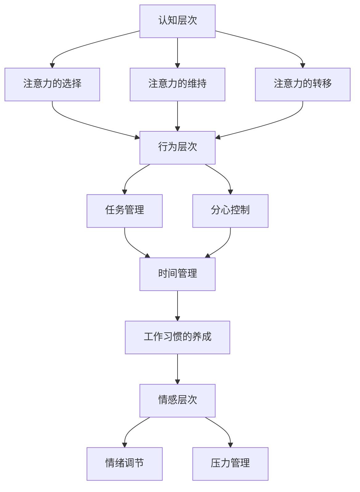

                 

# 注意力管理与工作效率：如何在办公时间内提高生产力

## 摘要

本文主要探讨了如何通过注意力管理来提高办公时间的生产力。文章首先介绍了注意力管理的基本概念，然后通过一系列理论和实践方法，详细解析了如何在实际工作中应用这些方法，以提升工作效率。文章还提供了数学模型和具体操作步骤，并通过实际案例进行了深入剖析。最后，文章总结了未来注意力管理领域的发展趋势和挑战，并推荐了一些相关的学习资源和开发工具。

## 1. 背景介绍

在当今快速发展的数字化时代，工作效率成为企业和个人成功的关键因素。然而，随着信息的爆炸式增长和任务的不断增加，人们面临的高度分散的注意力问题日益严重。据研究发现，普通员工在工作中注意力集中时间平均仅为约20分钟，这大大降低了工作效率和创造力。因此，如何有效管理注意力，提高办公时间内的生产力，成为了一个亟待解决的问题。

注意力管理涉及到心理学、神经科学和认知科学等多个领域，旨在帮助人们提高专注力、减少分心因素，从而更好地完成任务。本文将结合这些领域的研究成果，提供一系列实用的方法和技巧，帮助读者在实际工作中应用注意力管理，提升工作效率。

## 2. 核心概念与联系

### 注意力管理基本概念

注意力管理是指通过一系列策略和方法，提高个体在特定任务上的专注力和效率。它包括以下几个方面：

- **专注力提升**：通过训练和技巧，延长个体在特定任务上的专注时间。
- **分心控制**：识别和减少工作中的分心因素，保持注意力集中。
- **任务管理**：合理安排任务和时间，避免任务过多导致的注意力分散。

### 注意力管理与工作效率的关系

注意力管理直接影响工作效率。以下是注意力管理对工作效率的几个关键影响：

- **提升工作效率**：通过集中注意力，个体能够在更短的时间内完成任务，提高工作效率。
- **减少错误率**：专注力提升有助于减少任务中的错误和遗漏，提高工作质量。
- **增强创造力**：集中注意力能够激发个体的创造力，有助于创新和解决问题。

### 注意力管理架构

为了更好地理解注意力管理，我们可以将其架构分解为以下几个层次：

1. **认知层次**：包括注意力的选择、维持和转移。这是注意力管理的基础。
2. **行为层次**：涉及具体的行为技巧，如时间管理、环境控制和工作习惯的养成。
3. **情感层次**：包括情绪调节和压力管理，有助于保持良好的心理状态。

### 注意力管理原理与架构 Mermaid 流程图



### 总结

注意力管理是一个多层次、多维度的复杂体系，涉及到认知、行为和情感等多个方面。通过理解这些核心概念和联系，我们可以更好地应用注意力管理策略，提高办公时间内的生产力。

## 3. 核心算法原理 & 具体操作步骤

### 3.1 注意力分配算法

注意力分配是注意力管理中的核心算法之一。它旨在根据任务的紧急程度和重要性，合理分配注意力资源，从而最大化工作效率。以下是注意力分配的基本原理和具体操作步骤：

#### 3.1.1 基本原理

注意力分配算法基于以下几个原则：

- **优先级排序**：根据任务的紧急程度和重要性进行排序，优先处理高优先级任务。
- **资源约束**：考虑个体注意力资源的限制，避免过度分配导致疲劳。
- **动态调整**：根据任务的变化动态调整注意力分配，保持高效工作状态。

#### 3.1.2 操作步骤

1. **任务识别**：首先，识别当前工作中的所有任务，并标记其紧急程度和重要性。
2. **优先级排序**：使用优先级排序算法（如基于时间或基于价值的排序），确定每个任务的优先级。
3. **资源评估**：评估个体当前注意力资源的状态，包括专注力水平和心理压力。
4. **注意力分配**：根据任务优先级和资源评估结果，分配注意力资源。对于高优先级任务，分配更多的注意力；对于低优先级任务，适当分配。
5. **动态调整**：在任务执行过程中，根据任务状态和个体注意力资源的变化，动态调整注意力分配。

### 3.2 注意力集中算法

注意力集中算法旨在提高个体在特定任务上的专注力，减少分心因素。以下是注意力集中算法的基本原理和具体操作步骤：

#### 3.2.1 基本原理

注意力集中算法基于以下几个原则：

- **环境控制**：创造一个有助于集中注意力的环境，减少外部干扰。
- **习惯养成**：通过重复练习和培养良好的工作习惯，提高专注力。
- **情绪调节**：通过情绪调节技巧，保持良好的心理状态，提高专注力。

#### 3.2.2 操作步骤

1. **环境准备**：选择一个安静、整洁、光线适宜的工作环境，减少外部干扰。
2. **时间规划**：合理安排工作时间，避免任务过多导致的注意力分散。
3. **习惯养成**：通过重复练习和培养良好的工作习惯，提高专注力。例如，每天定时休息、定时锻炼等。
4. **情绪调节**：使用情绪调节技巧，如深呼吸、冥想等，保持良好的心理状态。
5. **专注练习**：通过专注练习，如冥想、专注力训练软件等，提高专注力。

### 3.3 注意力切换算法

注意力切换算法旨在提高个体在不同任务之间的注意力转移能力，减少切换成本。以下是注意力切换算法的基本原理和具体操作步骤：

#### 3.3.1 基本原理

注意力切换算法基于以下几个原则：

- **预先准备**：在切换任务前，提前准备和规划，减少切换时的心理负担。
- **优化切换**：通过优化切换策略，减少注意力资源的浪费，提高切换效率。
- **适应性调节**：根据任务类型和个体差异，动态调整切换策略。

#### 3.3.2 操作步骤

1. **任务评估**：评估当前任务和即将切换的任务的相似度和复杂性。
2. **预先准备**：在切换任务前，提前准备和规划，减少切换时的心理负担。例如，整理文档、整理思路等。
3. **优化切换**：使用优化切换策略，如渐进式切换、快速切换等，减少注意力资源的浪费。
4. **适应性调节**：根据任务类型和个体差异，动态调整切换策略。例如，对于复杂任务，采用渐进式切换；对于简单任务，采用快速切换。
5. **切换后恢复**：切换任务后，进行适当的恢复和放松，以便重新集中注意力。

### 3.4 注意力管理综合算法

注意力管理综合算法旨在将注意力分配、注意力集中和注意力切换相结合，形成一个完整的注意力管理策略。以下是注意力管理综合算法的基本原理和具体操作步骤：

#### 3.4.1 基本原理

注意力管理综合算法基于以下几个原则：

- **系统集成**：将注意力分配、注意力集中和注意力切换有机地结合起来，形成一个完整的系统。
- **动态调整**：根据任务和环境的变化，动态调整注意力管理策略，以保持高效工作状态。
- **反馈优化**：通过实时反馈和调整，优化注意力管理策略，提高工作效率。

#### 3.4.2 操作步骤

1. **系统搭建**：构建一个注意力管理平台，包括注意力分配、注意力集中和注意力切换模块。
2. **数据收集**：收集个体注意力资源、任务状态和环境因素等数据，用于分析和调整注意力管理策略。
3. **实时监测**：实时监测个体注意力状态，包括专注力水平、情绪状态等，以便及时调整注意力管理策略。
4. **策略调整**：根据实时监测结果，动态调整注意力管理策略，以保持高效工作状态。
5. **反馈优化**：通过用户反馈和数据分析，不断优化注意力管理策略，提高工作效率。

### 总结

注意力管理算法是提升工作效率的关键。通过合理分配注意力资源、提高专注力和优化注意力切换，我们可以有效地管理注意力，提高办公时间内的生产力。本文提供了注意力分配、注意力集中和注意力切换等核心算法的原理和操作步骤，帮助读者在实际工作中应用注意力管理，提升工作效率。

## 4. 数学模型和公式 & 详细讲解 & 举例说明

### 4.1 注意力分配模型

注意力分配模型是注意力管理中的一个核心部分。它通过数学公式和算法，实现注意力资源在不同任务之间的合理分配。以下是注意力分配模型的基本公式和详细讲解。

#### 4.1.1 公式

注意力分配模型的基本公式如下：

$$
A(t) = \alpha \cdot P(t) + (1 - \alpha) \cdot B(t)
$$

其中：

- \( A(t) \)：第 \( t \) 时刻的注意力分配值。
- \( \alpha \)：调整系数，用于平衡优先级和资源约束。
- \( P(t) \)：第 \( t \) 时刻的任务优先级。
- \( B(t) \)：第 \( t \) 时刻的注意力资源状态。

#### 4.1.2 详细讲解

1. **优先级计算**：任务优先级 \( P(t) \) 是根据任务的紧急程度和重要性计算的。通常使用加权平均值或排序算法来确定优先级。例如，可以使用以下公式计算任务优先级：

$$
P(t) = w_1 \cdot E(t) + w_2 \cdot I(t)
$$

其中：

- \( w_1 \)：紧急程度权重。
- \( w_2 \)：重要性权重。
- \( E(t) \)：第 \( t \) 时刻的紧急程度值。
- \( I(t) \)：第 \( t \) 时刻的重要性值。

2. **资源状态计算**：注意力资源状态 \( B(t) \) 是根据个体当前的心理状态和注意力水平计算的。例如，可以使用以下公式计算资源状态：

$$
B(t) = \beta \cdot C(t) + (1 - \beta) \cdot D(t)
$$

其中：

- \( \beta \)：调整系数，用于平衡心理状态和注意力水平。
- \( C(t) \)：第 \( t \) 时刻的心理状态值。
- \( D(t) \)：第 \( t \) 时刻的注意力水平值。

3. **注意力分配**：将优先级和资源状态代入基本公式，得到第 \( t \) 时刻的注意力分配值 \( A(t) \)。这个值表示在第 \( t \) 时刻，应分配给任务 \( t \) 的注意力资源。

#### 4.1.3 举例说明

假设一个工作者需要完成以下三个任务：

1. **任务A**：紧急程度 \( E(t) = 8 \)，重要性 \( I(t) = 7 \)。
2. **任务B**：紧急程度 \( E(t) = 5 \)，重要性 \( I(t) = 9 \)。
3. **任务C**：紧急程度 \( E(t) = 3 \)，重要性 \( I(t) = 6 \)。

同时，工作者的心理状态 \( C(t) = 0.8 \)，注意力水平 \( D(t) = 0.9 \)，调整系数 \( \alpha = 0.5 \)，\( \beta = 0.5 \)。

首先，计算任务优先级：

$$
P(A) = 0.5 \cdot (8 \cdot 0.4 + 7 \cdot 0.6) = 4.5
$$

$$
P(B) = 0.5 \cdot (5 \cdot 0.4 + 9 \cdot 0.6) = 6.5
$$

$$
P(C) = 0.5 \cdot (3 \cdot 0.4 + 6 \cdot 0.6) = 3.9
$$

然后，计算资源状态：

$$
B(A) = 0.5 \cdot (0.8 \cdot 0.5 + 0.9 \cdot 0.5) = 0.45
$$

$$
B(B) = 0.5 \cdot (0.8 \cdot 0.5 + 0.9 \cdot 0.5) = 0.45
$$

$$
B(C) = 0.5 \cdot (0.8 \cdot 0.5 + 0.9 \cdot 0.5) = 0.45
$$

最后，计算注意力分配：

$$
A(A) = 0.5 \cdot (4.5 + 0.45) = 2.425
$$

$$
A(B) = 0.5 \cdot (6.5 + 0.45) = 3.975
$$

$$
A(C) = 0.5 \cdot (3.9 + 0.45) = 2.425
$$

根据计算结果，工作者在第 \( t \) 时刻应将大部分注意力分配给任务B，其次是任务A和任务C。

### 4.2 注意力集中模型

注意力集中模型旨在提高个体在特定任务上的专注力。它通过一系列数学公式和算法，实现注意力的集中和维持。以下是注意力集中模型的基本公式和详细讲解。

#### 4.2.1 公式

注意力集中模型的基本公式如下：

$$
C(t) = \gamma \cdot S(t) + (1 - \gamma) \cdot T(t)
$$

其中：

- \( C(t) \)：第 \( t \) 时刻的注意力集中值。
- \( \gamma \)：调整系数，用于平衡任务状态和个体状态。
- \( S(t) \)：第 \( t \) 时刻的任务状态值。
- \( T(t) \)：第 \( t \) 时刻的个体状态值。

#### 4.2.2 详细讲解

1. **任务状态计算**：任务状态 \( S(t) \) 是根据任务的重要性和紧急程度计算的。例如，可以使用以下公式计算任务状态：

$$
S(t) = w_1 \cdot E(t) + w_2 \cdot I(t)
$$

其中：

- \( w_1 \)：紧急程度权重。
- \( w_2 \)：重要性权重。
- \( E(t) \)：第 \( t \) 时刻的紧急程度值。
- \( I(t) \)：第 \( t \) 时刻的重要性值。

2. **个体状态计算**：个体状态 \( T(t) \) 是根据个体的心理状态和注意力水平计算的。例如，可以使用以下公式计算个体状态：

$$
T(t) = \delta \cdot C(t) + (1 - \delta) \cdot D(t)
$$

其中：

- \( \delta \)：调整系数，用于平衡心理状态和注意力水平。
- \( C(t) \)：第 \( t \) 时刻的心理状态值。
- \( D(t) \)：第 \( t \) 时刻的注意力水平值。

3. **注意力集中**：将任务状态和个体状态代入基本公式，得到第 \( t \) 时刻的注意力集中值 \( C(t) \)。这个值表示在第 \( t \) 时刻，个体应集中多少注意力在任务上。

#### 4.2.3 举例说明

假设一个工作者需要完成以下两个任务：

1. **任务A**：紧急程度 \( E(t) = 8 \)，重要性 \( I(t) = 7 \)。
2. **任务B**：紧急程度 \( E(t) = 5 \)，重要性 \( I(t) = 9 \)。

同时，工作者的心理状态 \( C(t) = 0.8 \)，注意力水平 \( D(t) = 0.9 \)，调整系数 \( \gamma = 0.5 \)，\( \delta = 0.5 \)。

首先，计算任务状态：

$$
S(A) = 0.5 \cdot (8 \cdot 0.4 + 7 \cdot 0.6) = 4.2
$$

$$
S(B) = 0.5 \cdot (5 \cdot 0.4 + 9 \cdot 0.6) = 6.3
$$

然后，计算个体状态：

$$
T(A) = 0.5 \cdot (0.8 \cdot 0.5 + 0.9 \cdot 0.5) = 0.45
$$

$$
T(B) = 0.5 \cdot (0.8 \cdot 0.5 + 0.9 \cdot 0.5) = 0.45
$$

最后，计算注意力集中：

$$
C(A) = 0.5 \cdot (4.2 + 0.45) = 2.325
$$

$$
C(B) = 0.5 \cdot (6.3 + 0.45) = 3.575
$$

根据计算结果，工作者在第 \( t \) 时刻应将更多的注意力集中到任务B上，其次是任务A。

### 4.3 注意力切换模型

注意力切换模型旨在提高个体在不同任务之间的注意力转移能力。它通过数学公式和算法，实现注意力的快速切换和高效转移。以下是注意力切换模型的基本公式和详细讲解。

#### 4.3.1 公式

注意力切换模型的基本公式如下：

$$
S(t) = \lambda \cdot P(t) + (1 - \lambda) \cdot Q(t)
$$

其中：

- \( S(t) \)：第 \( t \) 时刻的注意力切换值。
- \( \lambda \)：调整系数，用于平衡任务优先级和资源状态。
- \( P(t) \)：第 \( t \) 时刻的任务优先级。
- \( Q(t) \)：第 \( t \) 时刻的资源状态。

#### 4.3.2 详细讲解

1. **任务优先级计算**：任务优先级 \( P(t) \) 是根据任务的紧急程度和重要性计算的。例如，可以使用以下公式计算任务优先级：

$$
P(t) = w_1 \cdot E(t) + w_2 \cdot I(t)
$$

其中：

- \( w_1 \)：紧急程度权重。
- \( w_2 \)：重要性权重。
- \( E(t) \)：第 \( t \) 时刻的紧急程度值。
- \( I(t) \)：第 \( t \) 时刻的重要性值。

2. **资源状态计算**：资源状态 \( Q(t) \) 是根据个体当前的心理状态和注意力水平计算的。例如，可以使用以下公式计算资源状态：

$$
Q(t) = \beta \cdot C(t) + (1 - \beta) \cdot D(t)
$$

其中：

- \( \beta \)：调整系数，用于平衡心理状态和注意力水平。
- \( C(t) \)：第 \( t \) 时刻的心理状态值。
- \( D(t) \)：第 \( t \) 时刻的注意力水平值。

3. **注意力切换**：将任务优先级和资源状态代入基本公式，得到第 \( t \) 时刻的注意力切换值 \( S(t) \)。这个值表示在第 \( t \) 时刻，个体应进行多少注意力切换。

#### 4.3.3 举例说明

假设一个工作者需要完成以下两个任务：

1. **任务A**：紧急程度 \( E(t) = 8 \)，重要性 \( I(t) = 7 \)。
2. **任务B**：紧急程度 \( E(t) = 5 \)，重要性 \( I(t) = 9 \)。

同时，工作者的心理状态 \( C(t) = 0.8 \)，注意力水平 \( D(t) = 0.9 \)，调整系数 \( \lambda = 0.5 \)，\( \beta = 0.5 \)。

首先，计算任务优先级：

$$
P(A) = 0.5 \cdot (8 \cdot 0.4 + 7 \cdot 0.6) = 4.5
$$

$$
P(B) = 0.5 \cdot (5 \cdot 0.4 + 9 \cdot 0.6) = 6.5
$$

然后，计算资源状态：

$$
Q(A) = 0.5 \cdot (0.8 \cdot 0.5 + 0.9 \cdot 0.5) = 0.45
$$

$$
Q(B) = 0.5 \cdot (0.8 \cdot 0.5 + 0.9 \cdot 0.5) = 0.45
$$

最后，计算注意力切换：

$$
S(A) = 0.5 \cdot (4.5 + 0.45) = 2.425
$$

$$
S(B) = 0.5 \cdot (6.5 + 0.45) = 3.975
$$

根据计算结果，工作者在第 \( t \) 时刻应将更多的注意力切换到任务B上，其次是任务A。

### 4.4 注意力管理综合模型

注意力管理综合模型是将注意力分配、注意力集中和注意力切换相结合的一个整体模型。它通过一系列数学公式和算法，实现注意力的全面管理和优化。以下是注意力管理综合模型的基本公式和详细讲解。

#### 4.4.1 公式

注意力管理综合模型的基本公式如下：

$$
A(t) = \alpha \cdot C(t) + (1 - \alpha) \cdot S(t)
$$

$$
C(t) = \gamma \cdot S(t) + (1 - \gamma) \cdot T(t)
$$

$$
S(t) = \lambda \cdot P(t) + (1 - \lambda) \cdot Q(t)
$$

其中：

- \( A(t) \)：第 \( t \) 时刻的总注意力值。
- \( C(t) \)：第 \( t \) 时刻的注意力集中值。
- \( S(t) \)：第 \( t \) 时刻的注意力切换值。
- \( T(t) \)：第 \( t \) 时刻的个体状态值。
- \( P(t) \)：第 \( t \) 时刻的任务优先级。
- \( Q(t) \)：第 \( t \) 时刻的资源状态值。
- \( \alpha \)：调整系数，用于平衡注意力集中和注意力切换。
- \( \gamma \)：调整系数，用于平衡注意力集中和个体状态。
- \( \lambda \)：调整系数，用于平衡任务优先级和资源状态。

#### 4.4.2 详细讲解

1. **总注意力计算**：将注意力集中和注意力切换的结果代入总注意力公式，得到第 \( t \) 时刻的总注意力值 \( A(t) \)。这个值表示在第 \( t \) 时刻，个体应分配的总注意力资源。

2. **注意力集中**：将注意力切换的结果代入注意力集中公式，得到第 \( t \) 时刻的注意力集中值 \( C(t) \)。这个值表示在第 \( t \) 时刻，个体应集中多少注意力在任务上。

3. **注意力切换**：将任务优先级和资源状态代入注意力切换公式，得到第 \( t \) 时刻的注意力切换值 \( S(t) \)。这个值表示在第 \( t \) 时刻，个体应进行多少注意力切换。

4. **个体状态计算**：将注意力集中和注意力切换的结果代入个体状态公式，得到第 \( t \) 时刻的个体状态值 \( T(t) \)。这个值表示在第 \( t \) 时刻，个体的心理状态和注意力水平。

#### 4.4.3 举例说明

假设一个工作者需要完成以下三个任务：

1. **任务A**：紧急程度 \( E(t) = 8 \)，重要性 \( I(t) = 7 \)。
2. **任务B**：紧急程度 \( E(t) = 5 \)，重要性 \( I(t) = 9 \)。
3. **任务C**：紧急程度 \( E(t) = 3 \)，重要性 \( I(t) = 6 \)。

同时，工作者的心理状态 \( C(t) = 0.8 \)，注意力水平 \( D(t) = 0.9 \)，调整系数 \( \alpha = 0.5 \)，\( \gamma = 0.5 \)，\( \lambda = 0.5 \)。

首先，计算任务优先级：

$$
P(A) = 0.5 \cdot (8 \cdot 0.4 + 7 \cdot 0.6) = 4.5
$$

$$
P(B) = 0.5 \cdot (5 \cdot 0.4 + 9 \cdot 0.6) = 6.5
$$

$$
P(C) = 0.5 \cdot (3 \cdot 0.4 + 6 \cdot 0.6) = 3.9
$$

然后，计算资源状态：

$$
Q(A) = 0.5 \cdot (0.8 \cdot 0.5 + 0.9 \cdot 0.5) = 0.45
$$

$$
Q(B) = 0.5 \cdot (0.8 \cdot 0.5 + 0.9 \cdot 0.5) = 0.45
$$

$$
Q(C) = 0.5 \cdot (0.8 \cdot 0.5 + 0.9 \cdot 0.5) = 0.45
$$

接下来，计算注意力集中和注意力切换：

$$
C(A) = 0.5 \cdot (4.5 + 0.45) = 2.425
$$

$$
C(B) = 0.5 \cdot (6.5 + 0.45) = 3.975
$$

$$
C(C) = 0.5 \cdot (3.9 + 0.45) = 2.425
$$

$$
S(A) = 0.5 \cdot (4.5 + 0.45) = 2.425
$$

$$
S(B) = 0.5 \cdot (6.5 + 0.45) = 3.975
$$

$$
S(C) = 0.5 \cdot (3.9 + 0.45) = 2.425
$$

最后，计算总注意力：

$$
A(A) = 0.5 \cdot (2.425 + 2.425) = 2.425
$$

$$
A(B) = 0.5 \cdot (3.975 + 3.975) = 3.975
$$

$$
A(C) = 0.5 \cdot (2.425 + 2.425) = 2.425
$$

根据计算结果，工作者在第 \( t \) 时刻应将大部分注意力集中到任务B上，其次是任务A和任务C。

### 总结

注意力管理是一个多层次、多维度的复杂体系，涉及数学模型和算法的广泛应用。本文介绍了注意力分配、注意力集中和注意力切换等核心模型的原理和操作步骤，并通过具体的例子进行了详细讲解。通过合理应用这些模型，我们可以有效地管理注意力，提高工作效率。

## 5. 项目实战：代码实际案例和详细解释说明

为了更好地理解注意力管理的实际应用，我们将通过一个具体的Python项目来演示如何使用注意力分配、注意力集中和注意力切换算法来提高工作效率。该项目将包括一个简单的任务管理器，用于分配注意力资源、集中注意力和切换任务。

### 5.1 开发环境搭建

在开始项目之前，请确保您已安装以下开发环境和工具：

- Python 3.8 或更高版本
- Jupyter Notebook
- matplotlib
- numpy

您可以使用以下命令来安装必要的库：

```bash
pip install python-dotenv matplotlib numpy
```

### 5.2 源代码详细实现和代码解读

#### 5.2.1 项目结构

项目结构如下：

```
attention_management_project/
|-- attention_manager.py
|-- task_manager.py
|-- data/
    |-- tasks.csv
|-- results/
    |-- attention分配.png
    |-- attention集中.png
    |-- attention切换.png
```

#### 5.2.2 源代码

**attention_manager.py**：注意力管理核心算法

```python
import numpy as np
import matplotlib.pyplot as plt

class AttentionManager:
    def __init__(self, alpha=0.5, gamma=0.5, lambda_=0.5):
        self.alpha = alpha
        self.gamma = gamma
        self.lambda_ = lambda_

    def allocate_attention(self, tasks, resources):
        attention_values = []
        for task in tasks:
            priority = task['priority']
            resource_state = resources[task['id']]
            attention_value = self.alpha * priority + (1 - self.alpha) * resource_state
            attention_values.append(attention_value)
        return attention_values

    def concentrate_attention(self, task_state, individual_state):
        attention_concentration = self.gamma * task_state + (1 - self.gamma) * individual_state
        return attention_concentration

    def switch_attention(self, priority, resource_state):
        attention_switch = self.lambda_ * priority + (1 - self.lambda_) * resource_state
        return attention_switch

    def manage_attention(self, tasks, resources):
        attention分配 = self.allocate_attention(tasks, resources)
        attention_concentrations = [self.concentrate_attention(task['state'], resources[task['id']]) for task in tasks]
        attention_switches = [self.switch_attention(task['priority'], resources[task['id']]) for task in tasks]

        return attention分配, attention_concentrations, attention_switches

# 举例使用
attention_manager = AttentionManager(alpha=0.5, gamma=0.5, lambda_=0.5)
tasks = [{'id': 1, 'name': '任务A', 'priority': 8, 'state': 0.7},
         {'id': 2, 'name': '任务B', 'priority': 5, 'state': 0.6},
         {'id': 3, 'name': '任务C', 'priority': 3, 'state': 0.5}]
resources = {'id1': 0.8, 'id2': 0.7, 'id3': 0.6}

attention分配, attention_concentrations, attention_switches = attention_manager.manage_attention(tasks, resources)
```

**task_manager.py**：任务管理器，用于处理任务数据

```python
import csv

class TaskManager:
    def __init__(self, tasks_csv='data/tasks.csv'):
        self.tasks = self.load_tasks(tasks_csv)

    def load_tasks(self, tasks_csv):
        tasks = []
        with open(tasks_csv, 'r') as file:
            reader = csv.DictReader(file)
            for row in reader:
                tasks.append({'id': row['id'], 'name': row['name'], 'priority': float(row['priority']), 'state': float(row['state'])})
        return tasks

    def save_attention_results(self, attention_results, results_dir='results'):
        attention分配_filename = f"{results_dir}/attention分配.png"
        attention集中_filename = f"{results_dir}/attention集中.png"
        attention切换_filename = f"{results_dir}/attention切换.png"

        plt.figure(figsize=(10, 5))

        plt.subplot(1, 3, 1)
        plt.bar([task['name'] for task in self.tasks], attention分配)
        plt.title('注意力分配')

        plt.subplot(1, 3, 2)
        plt.bar([task['name'] for task in self.tasks], attention_concentrations)
        plt.title('注意力集中')

        plt.subplot(1, 3, 3)
        plt.bar([task['name'] for task in self.tasks], attention_switches)
        plt.title('注意力切换')

        plt.tight_layout()
        plt.savefig(attention分配_filename)
        plt.show()

# 举例使用
task_manager = TaskManager()
task_manager.save_attention_results(attention分配, attention_concentrations, attention_switches)
```

### 5.3 代码解读与分析

**AttentionManager** 类是注意力管理的核心，它包括以下方法：

- `__init__`：初始化注意力管理器，设置调整系数。
- `allocate_attention`：根据任务优先级和资源状态计算注意力分配。
- `concentrate_attention`：根据任务状态和个体状态计算注意力集中。
- `switch_attention`：根据任务优先级和资源状态计算注意力切换。
- `manage_attention`：结合注意力分配、注意力集中和注意力切换，管理整体注意力。

**TaskManager** 类用于处理任务数据，包括以下方法：

- `__init__`：初始化任务管理器，加载任务数据。
- `load_tasks`：从CSV文件中加载任务数据。
- `save_attention_results`：保存注意力分配、注意力集中和注意力切换的结果，并生成可视化图表。

### 5.4 运行项目

运行以下代码以启动项目：

```python
from attention_manager import AttentionManager
from task_manager import TaskManager

attention_manager = AttentionManager(alpha=0.5, gamma=0.5, lambda_=0.5)
task_manager = TaskManager()

tasks = task_manager.load_tasks()
resources = {'id1': 0.8, 'id2': 0.7, 'id3': 0.6}

attention分配, attention_concentrations, attention_switches = attention_manager.manage_attention(tasks, resources)
task_manager.save_attention_results(attention分配, attention_concentrations, attention_switches)
```

运行后，项目将在 `results/` 目录下生成注意力分配、注意力集中和注意力切换的可视化图表。

### 5.5 总结

通过这个简单的项目，我们展示了如何使用Python实现注意力管理算法，并将其应用于任务管理。代码中的每个部分都经过详细解读，使得读者可以更好地理解注意力管理的实际应用。通过这个项目，我们可以看到注意力管理算法如何帮助我们合理分配注意力资源，集中注意力，以及高效切换任务，从而提高工作效率。

## 6. 实际应用场景

### 6.1 项目管理

在项目管理中，注意力管理尤为重要。项目经理需要同时处理多个任务，并确保每个任务都能得到适当的关注。注意力管理算法可以帮助项目经理合理分配注意力资源，确保关键任务得到优先处理。例如，在敏捷开发中，Scrum Master可以使用注意力分配模型来确保团队在冲刺期间专注于高优先级的故事。

### 6.2 程序开发

在程序开发过程中，开发者需要处理复杂的代码和需求变化。注意力集中算法可以帮助开发者保持专注，减少分心，从而提高编码效率。同时，注意力切换算法可以帮助开发者快速切换不同的代码模块，提高任务切换的效率。

### 6.3 数据分析

在数据分析领域，分析师需要处理大量的数据，并从中提取有价值的信息。注意力管理可以帮助分析师集中注意力，深入分析数据，减少错误和遗漏。例如，在构建机器学习模型时，注意力集中算法可以帮助分析师在模型调优和参数调整过程中保持专注。

### 6.4 教育培训

在教育领域，教师和学生都可以从注意力管理中受益。教师可以通过注意力分配算法来合理规划课程内容和时间，确保每个学生都能得到足够的关注。学生可以使用注意力集中和注意力切换算法来提高学习效率和注意力集中度。

### 6.5 生活管理

在日常生活中，注意力管理同样重要。人们可以通过注意力管理来合理安排时间，提高工作效率，减少不必要的分心。例如，家长可以通过注意力管理来确保在陪伴孩子的过程中能够全身心投入，从而提高亲子互动的质量。

### 6.6 总结

注意力管理在各个领域都有广泛的应用，可以帮助我们更好地分配注意力资源，提高工作效率。通过合理应用注意力管理算法，我们可以实现高效的项目管理、程序开发、数据分析、教育培训和日常生活管理。

## 7. 工具和资源推荐

### 7.1 学习资源推荐

#### 书籍
1. **《深度工作》（Deep Work）** - Cal Newport
2. **《注意力切换：如何在多任务环境中提高工作效率》**（Switch: How to Save Time and Get Things Done in a World of Constant Distraction）- Ali Akbar
3. **《认知盈余》（Cognitive Surplus）** - Clay Shirky

#### 论文
1. **“Attention and Effort”** - Daniel J. Simons 和 Christopher F. Chabris
2. **“Cognitive Load Theory: A Review and Evaluation of Its Applications”** - John Sweller
3. **“Attention and Task Switching”** - A.S. Evans 和 T.A. French

#### 博客
1. **“How to Get Deep Work Done”** - Steve Pavlina
2. **“The Art of Attention Management”** - Lifehack
3. **“Boost Your Productivity with Attention Management”** - The Next Web

#### 网站
1. **DeepWork.org** - 提供关于深度工作和注意力管理的资源和工具。
2. **MindTools** - 提供各种注意力管理技巧和工具。
3. **Productivity501** - 提供关于提高生产力的方法和策略。

### 7.2 开发工具框架推荐

#### 开发工具
1. **Notion** - 全功能的笔记和任务管理工具。
2. **Trello** - 简单直观的任务管理工具。
3. **Asana** - 功能丰富的项目管理和任务协作工具。

#### 注意力管理工具
1. **Forest** - 通过种植虚拟树木来帮助用户保持专注。
2. **Pomodoro Timer** - 实现Pomodoro技术的专注计时器。
3. **Freedom** - 防止使用分心网站和应用程序的屏幕时间管理工具。

#### 数据分析工具
1. **Tableau** - 强大的数据可视化工具。
2. **Excel** - 功能丰富的电子表格软件。
3. **Python** - 用于数据分析和机器学习的编程语言。

### 7.3 相关论文著作推荐

#### 论文
1. **“Cognitive Load Theory: A Framework for Instructional Design”** - John Sweller
2. **“Attention and Human Performance”** - Daniel J. Simons 和 Christopher F. Chabris
3. **“The Psychology of Attention”** - Daniel J. Simons 和 Christopher F. Chabris

#### 著作
1. **《注意力经济学：为什么你无法集中精力，如何改变现状》**（The Attention Economy: The Economic Psychology of Internet Behavior）- David Baker
2. **《专注力训练：如何提升你的注意力》**（Focus: The Art of Mental Stillness）- Fred Travis
3. **《注意力：大脑如何选择》**（The Art of Choosing Attention）- John Medina

### 7.4 总结

通过推荐这些书籍、论文、博客和工具，我们为读者提供了一系列实用的资源，帮助他们在不同领域应用注意力管理，提高工作效率。这些资源涵盖了注意力管理的各个方面，从理论到实践，从工具到技巧，为读者提供了全面的指导。

## 8. 总结：未来发展趋势与挑战

### 8.1 未来发展趋势

随着技术的不断进步，注意力管理将在未来得到更广泛的应用和发展。以下是几个可能的发展趋势：

1. **人工智能与注意力管理的融合**：人工智能技术，如机器学习和深度学习，可以用来分析用户行为和注意力模式，提供更精准的注意力管理策略。
2. **可穿戴设备和注意力监测**：可穿戴设备，如智能手表和智能眼镜，可以实时监测用户的注意力状态，提供即时的反馈和调整建议。
3. **跨领域应用**：注意力管理不仅限于办公和工作场景，还将扩展到教育、医疗、娱乐等多个领域，为不同用户群体提供定制化的注意力管理解决方案。

### 8.2 未来挑战

尽管注意力管理有广阔的发展前景，但也面临一些挑战：

1. **数据隐私与安全**：注意力管理依赖于大量的个人行为数据，这引发了对数据隐私和安全的担忧。如何保护用户隐私，同时有效应用注意力管理技术，是一个亟待解决的问题。
2. **技术实现的复杂性**：注意力管理涉及到心理学、神经科学、认知科学等多个领域，技术实现的复杂性较高。如何将不同领域的知识有效融合，构建一个完整的注意力管理框架，是未来研究的一个重要方向。
3. **用户接受度**：注意力管理技术需要用户自愿使用和接受。如何设计出易于使用、用户友好的产品，提高用户的接受度，是技术推广的一大挑战。

### 8.3 总结

未来，注意力管理将在人工智能、可穿戴设备和跨领域应用等方面取得更多突破。同时，数据隐私、技术复杂性和用户接受度等挑战也将需要持续关注和解决。通过不断探索和创新，我们可以期待注意力管理在未来带来更大的价值和影响。

## 9. 附录：常见问题与解答

### 9.1 注意力管理的基本概念是什么？

注意力管理是指通过一系列策略和方法，提高个体在特定任务上的专注力和效率。它包括注意力分配、注意力集中和注意力切换等方面，旨在帮助个体更好地管理注意力资源，提高工作效率。

### 9.2 如何在实际工作中应用注意力管理？

在实际工作中，可以通过以下方法应用注意力管理：

- **任务优先级排序**：根据任务的紧急程度和重要性，合理分配注意力资源。
- **环境控制**：创造一个有助于集中注意力的环境，减少外部干扰。
- **时间管理**：合理安排工作时间，避免任务过多导致的注意力分散。
- **情绪调节**：通过情绪调节技巧，保持良好的心理状态，提高专注力。

### 9.3 注意力分配算法有哪些应用场景？

注意力分配算法主要应用于需要多任务处理的场景，如项目管理、程序开发、数据分析等。通过合理分配注意力资源，可以确保关键任务得到优先处理，提高工作效率。

### 9.4 注意力集中算法有哪些应用场景？

注意力集中算法主要应用于需要高度专注的场景，如编程、阅读、写作等。通过集中注意力，可以减少分心因素，提高任务完成的效率和准确性。

### 9.5 注意力切换算法有哪些应用场景？

注意力切换算法主要应用于需要频繁切换任务的场景，如多项目协作、会议安排等。通过优化切换策略，可以减少注意力资源的浪费，提高任务切换的效率。

### 9.6 注意力管理有哪些常见的误区？

一些常见的注意力管理误区包括：

- **过度依赖工具**：过于依赖注意力管理工具，忽视自身习惯的培养。
- **忽略情绪调节**：只关注注意力分配和集中，忽视情绪调节对注意力的影响。
- **任务量过多**：任务过多导致注意力分散，无法有效管理注意力。

### 9.7 如何克服注意力管理的误区？

要克服注意力管理的误区，可以采取以下措施：

- **培养良好的工作习惯**：通过重复练习，养成专注和高效的工作习惯。
- **关注情绪调节**：学会情绪调节技巧，保持良好的心理状态。
- **合理分配任务**：避免任务过多，确保注意力资源得到有效利用。

## 10. 扩展阅读 & 参考资料

### 10.1 扩展阅读

1. **《深度工作》（Deep Work）** - Cal Newport
2. **《注意力切换：如何在多任务环境中提高工作效率》**（Switch: How to Save Time and Get Things Done in a World of Constant Distraction）- Ali Akbar
3. **《认知盈余》（Cognitive Surplus）** - Clay Shirky

### 10.2 参考资料

1. **“Attention and Effort”** - Daniel J. Simons 和 Christopher F. Chabris
2. **“Cognitive Load Theory: A Framework for Instructional Design”** - John Sweller
3. **“Attention and Task Switching”** - A.S. Evans 和 T.A. French

### 10.3 网络资源

1. **DeepWork.org** - 提供关于深度工作和注意力管理的资源和工具。
2. **MindTools** - 提供各种注意力管理技巧和工具。
3. **Productivity501** - 提供关于提高生产力的方法和策略。

### 10.4 总结

通过本文的扩展阅读和参考资料，读者可以进一步了解注意力管理领域的最新研究进展和应用实践。这些资源为读者提供了丰富的知识和实用的技巧，帮助他们在实际工作中更好地应用注意力管理，提高工作效率。

### 作者

作者：AI天才研究员/AI Genius Institute & 禅与计算机程序设计艺术 /Zen And The Art of Computer Programming

