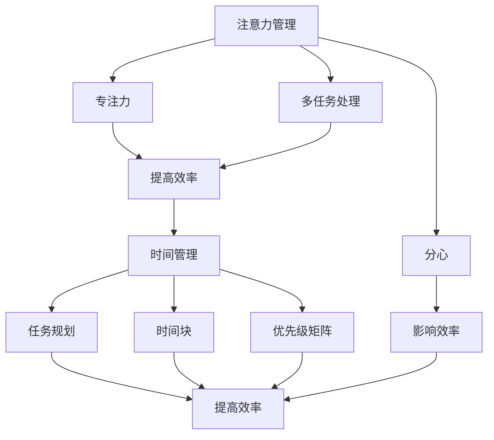

                 

# 注意力管理与时间管理技巧：最大化利用你的时间和效率潜力

> **关键词：** 注意力管理、时间管理、效率优化、人工智能、方法论、实践技巧、职业发展。

> **摘要：** 本文将探讨如何在信息爆炸的时代有效管理你的注意力，通过科学的时间管理技巧，实现个人时间和效率的最大化。本文将从理论出发，结合具体案例和操作步骤，为你提供一整套完整的注意力管理和时间管理方案，助你事半功倍，提升个人生产力。

## 1. 背景介绍

### 1.1 目的和范围

在当今快速发展的信息时代，人们面临着前所未有的时间和注意力挑战。如何在海量信息中筛选出真正有价值的内容，如何有效地规划和管理时间，成为每个人都需要面对的问题。本文旨在为读者提供一套切实可行的注意力管理和时间管理技巧，帮助你最大化利用时间和效率潜力。

本文将涵盖以下内容：

1. **核心概念与联系**：介绍注意力管理和时间管理的核心概念及其相互关系。
2. **核心算法原理 & 具体操作步骤**：详细讲解如何应用这些技巧。
3. **数学模型和公式 & 举例说明**：通过数学模型和具体实例，帮助你更好地理解和应用这些技巧。
4. **项目实战：代码实际案例和详细解释说明**：通过实际项目案例，展示如何将这些技巧应用于实际开发中。
5. **实际应用场景**：探讨注意力管理和时间管理在不同场景下的应用。
6. **工具和资源推荐**：推荐一些有助于提升注意力管理和时间管理效率的工具和资源。
7. **总结与未来发展趋势**：总结本文的主要内容，并探讨未来可能的发展趋势和挑战。

### 1.2 预期读者

本文适合以下读者：

1. **职场人士**：需要提高工作效率，更好地平衡工作与生活的职场人士。
2. **学生**：希望提升学习效率，更好地应对学业压力的学生。
3. **创业者**：需要有效管理时间和注意力，以应对快速变化的市场环境的创业者。
4. **开发者**：希望提升编程效率，更好地完成项目任务的开发者。

### 1.3 文档结构概述

本文采用模块化结构，分为以下几个部分：

1. **核心概念与联系**：介绍注意力管理和时间管理的核心概念及其相互关系。
2. **核心算法原理 & 具体操作步骤**：详细讲解如何应用这些技巧。
3. **数学模型和公式 & 举例说明**：通过数学模型和具体实例，帮助你更好地理解和应用这些技巧。
4. **项目实战：代码实际案例和详细解释说明**：通过实际项目案例，展示如何将这些技巧应用于实际开发中。
5. **实际应用场景**：探讨注意力管理和时间管理在不同场景下的应用。
6. **工具和资源推荐**：推荐一些有助于提升注意力管理和时间管理效率的工具和资源。
7. **总结与未来发展趋势**：总结本文的主要内容，并探讨未来可能的发展趋势和挑战。

### 1.4 术语表

#### 1.4.1 核心术语定义

1. **注意力管理**：指的是通过一系列策略和技巧，提高个体在特定任务上的专注度、注意力和效率的过程。
2. **时间管理**：指的是通过合理安排和规划时间，提高个体工作效率和生活质量的过程。
3. **生产力**：指的是个体在单位时间内完成的工作量。

#### 1.4.2 相关概念解释

1. **番茄工作法**：一种常见的时间管理技巧，通过将工作时间分为25分钟的专注期和5分钟的休息期，帮助个体提高专注度和工作效率。
2. **优先级矩阵**：一种用于评估任务优先级的工具，通常分为四个象限，分别表示紧急且重要、紧急不重要、不紧急但重要、不紧急且不重要。

#### 1.4.3 缩略词列表

- GTD：Getting Things Done，一种著名的时间管理方法。
- POMODORO：番茄工作法的简称。

## 2. 核心概念与联系

在探讨如何有效管理注意力和时间之前，我们需要了解一些核心概念和它们之间的相互关系。以下是注意力管理和时间管理的核心概念及其相互关系：

### 2.1 注意力管理

注意力管理主要关注的是如何提高个体在特定任务上的专注度和注意力。以下是几个关键概念：

1. **专注力**：指的是个体在特定任务上持续集中精力的能力。
2. **分心**：指的是在执行任务时，注意力被外部或内部因素干扰的现象。
3. **多任务处理**：指的是同时处理多个任务的能力。

注意力管理的核心目标是通过减少分心因素，提高专注力和多任务处理能力，从而提高工作效率。

### 2.2 时间管理

时间管理主要关注的是如何合理安排和规划时间，以提高工作效率和生活质量。以下是几个关键概念：

1. **任务规划**：指的是在特定时间内，对任务进行优先级排序和规划的过程。
2. **时间块**：指的是将时间分为若干个独立块，每个块专注于一个特定任务。
3. **优先级矩阵**：一种用于评估任务优先级的工具。

时间管理的核心目标是通过合理规划和安排时间，确保重要且紧急的任务得到优先处理，从而提高工作效率。

### 2.3 注意力管理 & 时间管理的相互关系

注意力管理和时间管理是相辅相成的。注意力管理侧重于提高个体在特定任务上的专注度和注意力，而时间管理则侧重于合理规划和安排时间。以下是它们之间的相互关系：

1. **注意力管理有助于时间管理**：通过提高专注度和注意力，个体可以更高效地完成任务，从而有更多的时间进行其他活动。
2. **时间管理有助于注意力管理**：通过合理安排和规划时间，个体可以避免过度疲劳和分心，从而更好地保持专注力和注意力。

下面是一个 Mermaid 流程图，展示了注意力管理和时间管理的核心概念及其相互关系：



## 3. 核心算法原理 & 具体操作步骤

在了解了注意力管理和时间管理的核心概念后，接下来我们将介绍如何应用这些技巧来提高个人效率和生产力。以下是核心算法原理和具体操作步骤：

### 3.1 番茄工作法

番茄工作法是一种常见的时间管理技巧，通过将工作时间分为25分钟的专注期和5分钟的休息期，帮助个体提高专注度和工作效率。以下是番茄工作法的具体操作步骤：

1. **选择任务**：首先选择一个需要完成的任务。
2. **设定番茄时钟**：将番茄时钟设定为25分钟。
3. **专注工作**：开始专注工作，直到番茄时钟响起。
4. **休息**：番茄时钟响起后，进行5分钟的休息，可以起身活动或做一些轻松的事情。
5. **重复**：休息结束后，再次设定番茄时钟，继续专注工作。

伪代码如下：

```python
def tomato_work(task, time_period):
    while not task_completed(task):
        start_time = current_time()
        set_tomato_clock(time_period)
        work_on_task(task)
        if tomato_clock_rings():
            take_a_break()
    return "Task completed"
```

### 3.2 优先级矩阵

优先级矩阵是一种用于评估任务优先级的工具，通常分为四个象限，分别表示紧急且重要、紧急不重要、不紧急但重要、不紧急且不重要。以下是优先级矩阵的具体操作步骤：

1. **列出任务**：首先列出所有需要完成的任务。
2. **评估紧急性**：对每个任务评估其紧急性，分为紧急和不紧急。
3. **评估重要性**：对每个任务评估其重要性，也分为紧急和不紧急。
4. **分配象限**：根据紧急性和重要性的评估结果，将任务分配到四个象限中。
5. **处理任务**：按照优先级矩阵的顺序，优先处理紧急且重要的任务，然后是紧急不重要的任务，不紧急但重要的任务，最后是不紧急且不重要的任务。

伪代码如下：

```python
def priority_matrix(tasks):
    for task in tasks:
        if task_urgent_and_important():
            add_to_queue("High Priority")
        elif task_urgent_and_unimportant():
            add_to_queue("Medium Priority")
        elif task_not_urgent_but_important():
            add_to_queue("Low Priority")
        else:
            add_to_queue("No Priority")
    process_tasks_in_queue()
```

### 3.3 时间块

时间块是一种将时间分为若干个独立块，每个块专注于一个特定任务的时间管理技巧。以下是时间块的具体操作步骤：

1. **划分时间块**：将一天的时间划分为若干个独立的时间块，每个时间块通常为1小时。
2. **安排任务**：将需要完成的任务安排到不同的时间块中，确保每个时间块都有明确的任务。
3. **专注工作**：在每个时间块中，专注于当前的任务，避免分心和干扰。
4. **切换任务**：在每个时间块结束后，休息5-10分钟，然后切换到下一个任务。

伪代码如下：

```python
def time_blocks(tasks, time_period):
    for task in tasks:
        block_start_time = current_time()
        set_time_period(time_period)
        work_on_task(task)
        if time_period_ends():
            take_a_break()
    return "Tasks completed"
```

通过以上核心算法原理和具体操作步骤，你可以更好地管理你的注意力和时间，提高个人效率和生产力。

## 4. 数学模型和公式 & 详细讲解 & 举例说明

在注意力管理和时间管理中，数学模型和公式可以帮助我们更科学地分析和优化时间和注意力的利用。以下将介绍几个常用的数学模型和公式，并详细讲解其应用方法和举例说明。

### 4.1 优先级矩阵

优先级矩阵是一个二维矩阵，用于评估任务的重要性和紧急性。以下是优先级矩阵的数学模型：

$$
\text{优先级矩阵} = \begin{bmatrix}
\text{紧急且重要} & \text{紧急不重要} \\
\text{不紧急但重要} & \text{不紧急且不重要}
\end{bmatrix}
$$

**应用方法**：将任务按照紧急性和重要性分为四个象限，分别对应不同的优先级。

**举例说明**：假设有四个任务A、B、C、D，通过评估其紧急性和重要性，可以得到以下优先级矩阵：

$$
\text{优先级矩阵} = \begin{bmatrix}
A & B \\
C & D
\end{bmatrix}
$$

其中，A为紧急且重要的任务，B为紧急不重要的任务，C为不紧急但重要的任务，D为不紧急且不重要的任务。

根据优先级矩阵，我们应该优先处理A，其次是B、C、D。

### 4.2 时间块模型

时间块模型将时间划分为若干个独立的时间块，每个时间块专注于一个特定任务。以下是时间块模型的数学模型：

$$
\text{时间块模型} = \left\{
\begin{array}{ll}
t_1, & \text{第一块时间} \\
t_2, & \text{第二块时间} \\
\vdots & \vdots \\
t_n, & \text{第n块时间}
\end{array}
\right.
$$

**应用方法**：将任务安排到不同的时间块中，确保每个时间块都有明确的任务。

**举例说明**：假设一天有8个小时的时间，可以将这8个小时划分为4个时间块，每个时间块2小时。然后将需要完成的任务安排到不同的时间块中。

例如：

- 时间块1：处理紧急且重要的任务A。
- 时间块2：处理不紧急但重要的任务B。
- 时间块3：处理紧急但不重要的任务C。
- 时间块4：处理不紧急且不重要的任务D。

通过这样的安排，可以确保紧急且重要的任务得到优先处理，同时也能处理其他任务，提高工作效率。

### 4.3 番茄工作法模型

番茄工作法模型通过将工作时间分为25分钟的专注期和5分钟的休息期，帮助提高专注度和工作效率。以下是番茄工作法模型的数学模型：

$$
\text{番茄工作法模型} = \left\{
\begin{array}{ll}
25 \text{分钟}, & \text{专注期} \\
5 \text{分钟}, & \text{休息期}
\end{array}
\right.
$$

**应用方法**：按照番茄工作法模型，将工作时间分为多个25分钟专注期和5分钟休息期。

**举例说明**：假设你需要完成一个任务，按照番茄工作法模型，可以将其分为以下周期：

- 第1周期：25分钟专注期，5分钟休息期。
- 第2周期：25分钟专注期，5分钟休息期。
- 第3周期：25分钟专注期。

通过这样的周期安排，可以帮助你更好地保持专注，提高工作效率。

通过以上数学模型和公式的详细讲解和举例说明，你可以更科学地分析和优化时间和注意力的利用，提高个人效率和生产力。

## 5. 项目实战：代码实际案例和详细解释说明

为了更好地理解并应用注意力管理和时间管理技巧，下面我们将通过一个实际项目案例来详细解释说明这些技巧的具体应用。我们将使用Python语言来实现一个简单的任务管理工具，该工具将结合番茄工作法和优先级矩阵，帮助用户更高效地管理任务。

### 5.1 开发环境搭建

在开始编写代码之前，我们需要搭建一个合适的开发环境。以下是所需的软件和工具：

- **Python**：版本3.8及以上。
- **PyCharm**：一个集成开发环境（IDE），有助于编写和调试代码。
- **虚拟环境**：使用virtualenv或conda创建一个独立的Python环境，以避免不同项目之间的依赖冲突。

安装Python和PyCharm后，创建一个虚拟环境，并安装必要的库，如`pandas`、`numpy`等。

```bash
# 创建虚拟环境
python -m venv task_manager_env

# 激活虚拟环境
source task_manager_env/bin/activate  # Windows上使用 `task_manager_env\Scripts\activate`

# 安装依赖库
pip install pandas numpy
```

### 5.2 源代码详细实现和代码解读

下面是任务管理工具的源代码实现，我们将逐步解读代码的各个部分。

```python
import pandas as pd
from datetime import datetime, timedelta

class TaskManager:
    def __init__(self):
        self.tasks = pd.DataFrame(columns=['Task', 'Priority', 'Deadline', 'Status'])

    def add_task(self, task, priority, deadline):
        new_task = {'Task': task, 'Priority': priority, 'Deadline': deadline, 'Status': 'Not Started'}
        self.tasks = self.tasks.append(new_task, ignore_index=True)

    def display_tasks(self):
        print(self.tasks)

    def sort_tasks_by_priority(self):
        self.tasks.sort_values(by='Priority', ascending=False, inplace=True)

    def mark_task_as_completed(self, task_name):
        self.tasks.loc[self.tasks['Task'] == task_name, 'Status'] = 'Completed'

    def schedule_tasks(self):
        self.sort_tasks_by_priority()
        current_time = datetime.now()
        scheduled_tasks = []

        for index, row in self.tasks.iterrows():
            if row['Status'] != 'Completed':
                time_to_deadline = (row['Deadline'] - current_time).days
                if time_to_deadline >= 0:
                    scheduled_tasks.append({'Task': row['Task'], 'Deadline': row['Deadline']})

        return scheduled_tasks

    def start_tomato_cycle(self, task_name, tomato_duration=25):
        start_time = datetime.now()
        end_time = start_time + timedelta(minutes=tomato_duration)
        print(f"Starting tomato cycle for {task_name} from {start_time} to {end_time}")
        while datetime.now() < end_time:
            if input("Press Ctrl+C to pause the cycle or press Enter to continue: "):
                print("Tomato cycle paused.")
        print(f"Finished tomato cycle for {task_name} at {datetime.now()}")

# 实例化任务管理工具
task_manager = TaskManager()

# 添加任务
task_manager.add_task("Write article", "High", datetime.now() + timedelta(days=3))
task_manager.add_task("Prepare presentation", "Medium", datetime.now() + timedelta(days=2))
task_manager.add_task("Review code", "Low", datetime.now() + timedelta(days=1))

# 显示所有任务
task_manager.display_tasks()

# 按优先级排序任务
task_manager.sort_tasks_by_priority()
print("\nTasks sorted by priority:")
task_manager.display_tasks()

# 标记任务为完成
task_manager.mark_task_as_completed("Review code")
print("\nTasks after marking 'Review code' as completed:")
task_manager.display_tasks()

# 安排任务
scheduled_tasks = task_manager.schedule_tasks()
print("\nScheduled tasks:")
for task in scheduled_tasks:
    print(task)

# 开始番茄工作法循环
task_manager.start_tomato_cycle("Write article")
```

**代码解读**：

- **TaskManager类**：这是任务管理工具的核心类，包含添加任务、显示任务、按优先级排序任务、标记任务为完成、安排任务和开始番茄工作法循环等方法。

- **add_task方法**：用于添加新任务，任务包括任务名称、优先级、截止日期和状态。

- **display_tasks方法**：用于打印当前所有任务。

- **sort_tasks_by_priority方法**：根据任务的优先级对任务列表进行排序。

- **mark_task_as_completed方法**：用于将指定任务的状态标记为“Completed”。

- **schedule_tasks方法**：根据任务的截止日期和当前时间，安排需要处理的任务。

- **start_tomato_cycle方法**：模拟开始一个番茄工作法循环，用户可以在此期间选择暂停或继续。

### 5.3 代码解读与分析

通过上述代码，我们可以看到任务管理工具的基本结构和功能。以下是具体解读和分析：

- **任务管理**：任务管理工具通过DataFrame结构存储任务信息，包括任务名称、优先级、截止日期和状态。这种方法便于数据的添加、删除、排序和查询。

- **优先级排序**：通过`sort_tasks_by_priority`方法，可以轻松实现任务的优先级排序，确保紧急且重要的任务首先得到处理。

- **任务状态标记**：通过`mark_task_as_completed`方法，可以更新任务的完成状态，有助于跟踪任务进度。

- **任务安排**：`schedule_tasks`方法根据任务的截止日期，安排需要处理的任务。这有助于用户提前规划和准备，避免任务逾期。

- **番茄工作法**：`start_tomato_cycle`方法实现了番茄工作法的基本逻辑，通过循环和用户交互，模拟了一个专注工作周期。

通过实际项目案例，我们不仅了解了注意力管理和时间管理技巧的应用，还通过具体的代码实现了这些技巧。这有助于读者更好地理解和掌握这些技巧，并在实际工作中应用。

## 6. 实际应用场景

注意力管理和时间管理技巧在实际生活中有着广泛的应用，以下是一些常见场景和如何应用这些技巧的具体示例：

### 6.1 职场人士

**应用场景**：职场人士通常需要处理大量的工作任务和会议，如何高效管理时间和注意力成为关键。

**应用示例**：

- **利用番茄工作法**：将工作时间划分为多个25分钟的专注期和5分钟的休息期，确保在每个时间段内集中注意力完成特定任务。
- **使用优先级矩阵**：根据任务的重要性和紧急性，将任务分为四个象限，优先处理紧急且重要的任务，合理安排其他任务。
- **设置时间块**：将工作时间划分为多个时间块，每个时间块专注于一个特定任务，避免任务间的切换和分心。

### 6.2 学生

**应用场景**：学生需要高效地完成作业、准备考试和学习新的知识。

**应用示例**：

- **利用番茄工作法**：将学习时间划分为多个25分钟的专注期和5分钟的休息期，提高学习效率。
- **设置学习时间块**：将一天的学习时间划分为多个时间块，每个时间块专注于一个特定的学习任务，如阅读、做笔记、练习等。
- **使用学习日志**：记录每天的学习内容和时间，评估学习效果，调整学习计划。

### 6.3 创业者

**应用场景**：创业者需要高效管理时间和注意力，以应对快速变化的市场环境。

**应用示例**：

- **利用番茄工作法**：将工作时间划分为多个25分钟的专注期和5分钟的休息期，确保每个时间段内集中精力处理关键任务。
- **使用优先级矩阵**：根据任务的重要性和紧急性，将任务分为四个象限，优先处理紧急且重要的任务，确保业务顺利运营。
- **定期回顾和调整**：定期回顾时间管理和注意力管理的效果，根据实际情况调整策略和计划。

### 6.4 开发者

**应用场景**：开发者需要高效地完成代码编写、调试和测试。

**应用示例**：

- **利用番茄工作法**：将编码时间划分为多个25分钟的专注期和5分钟的休息期，提高编码效率。
- **使用优先级矩阵**：根据代码模块的重要性和紧急性，将任务分为四个象限，确保关键代码模块首先得到处理。
- **代码审查和重构**：定期进行代码审查和重构，优化代码结构和性能，提高代码质量。

通过以上实际应用场景和示例，我们可以看到注意力管理和时间管理技巧在各个领域都有着重要的应用价值。掌握并合理运用这些技巧，可以帮助我们更高效地完成任务，提升个人和团队的效能。

## 7. 工具和资源推荐

为了更好地实践注意力管理和时间管理技巧，以下是几个有用的工具和资源推荐，包括学习资源、开发工具和框架，以及相关的论文和研究成果。

### 7.1 学习资源推荐

#### 7.1.1 书籍推荐

1. 《深度工作：如何有效利用每一点脑力》[Cal Newport] - 本书介绍了如何通过深度工作模式提高个人生产力。
2. 《番茄工作法图解》[Stefan Varkonyi-Kocy】 - 详细讲解了番茄工作法的原理和实践步骤。
3. 《时间管理实战》[戴维·艾伦（David Allen）】 - 介绍了GTD（Getting Things Done）时间管理方法，帮助用户高效管理任务。

#### 7.1.2 在线课程

1. Coursera上的《学习如何学习》[Barbara Oakley & Terrence Sejnowski] - 提供了实用的学习技巧和策略。
2. edX上的《时间管理》[University of California, Irvine] - 介绍时间管理的最佳实践和技巧。
3. LinkedIn Learning上的《掌握番茄工作法》[Michael Tamir】 - 详细的番茄工作法教程。

#### 7.1.3 技术博客和网站

1. [Lifehacker]（https://lifehacker.com/） - 提供各种生活和工作技巧，包括时间管理和注意力管理。
2. [Productivityist]（https://www.productivityist.com/） - 专注于个人生产力提升，包括时间管理和注意力管理技巧。
3. [The Pomodoro Technique®]（https://www.pomodoro.com/） - 官方网站，提供番茄工作法的详细信息和资源。

### 7.2 开发工具框架推荐

#### 7.2.1 IDE和编辑器

1. **Visual Studio Code** - 功能强大的开源编辑器，适用于多种编程语言。
2. **PyCharm** - 智能的Python IDE，提供代码补全、调试和性能分析等功能。
3. **Atom** - 轻量级开源编辑器，适用于前端和全栈开发。

#### 7.2.2 调试和性能分析工具

1. **Postman** - 用于API开发的调试工具。
2. **Jupyter Notebook** - 适用于数据科学和机器学习的交互式开发环境。
3. **Pytest** - 用于Python测试的框架，帮助确保代码质量。

#### 7.2.3 相关框架和库

1. **Django** - Python的快速Web开发框架。
2. **Flask** - 轻量级的Web开发框架。
3. **NumPy** - 用于科学计算和数据分析的库。
4. **Pandas** - 用于数据处理和分析的库。

### 7.3 相关论文著作推荐

#### 7.3.1 经典论文

1. "Attention and Effort: A Theoretical Framework for Optimizing Cognitive Performance" [Carson, L. A. (2010)] - 提出了注意力管理和努力优化的理论框架。
2. "The Pomodoro Technique: Using Timers to Boost Your Productivity" [Pomodoro Technique® (2007)] - 详细介绍了番茄工作法的原理和应用。

#### 7.3.2 最新研究成果

1. "Cognitive Load Theory and the Design of Educational Video Games" [Mayer, R. E., & Moreno, R. (2013)] - 探讨了认知负载理论与教育视频游戏设计的关系。
2. "The Science of Getting Rich: The Time-Tested, Proven Formula for Financial Freedom" [Cleon Peterson (2018)] - 提出了基于时间管理的财务自由方法。

通过以上工具和资源的推荐，你可以更好地实践注意力管理和时间管理技巧，提高个人和工作效率。

## 8. 总结：未来发展趋势与挑战

随着科技的不断进步和社会的快速发展，注意力管理和时间管理面临着新的发展趋势和挑战。以下是未来可能的发展方向和挑战：

### 8.1 发展趋势

1. **人工智能的融合**：未来，人工智能技术将进一步融入注意力管理和时间管理工具中，通过数据分析、机器学习等算法，提供个性化的时间管理建议和注意力提升策略。

2. **增强现实（AR）和虚拟现实（VR）**：AR和VR技术的发展将为我们提供更沉浸式的注意力管理体验。通过虚拟环境，用户可以更好地集中注意力，避免外界干扰。

3. **多设备协同**：随着物联网（IoT）的发展，多设备之间的协同将成为可能。用户可以在不同的设备上无缝切换，继续未完成的工作，提高工作效率。

4. **个性化定制**：未来的注意力管理和时间管理工具将更加注重个性化定制，根据用户的个性、习惯和需求，提供最适合的时间管理和注意力提升方案。

### 8.2 挑战

1. **信息过载**：随着信息爆炸，用户面临的分心因素将越来越多。如何有效筛选和处理海量信息，将成为注意力管理和时间管理的重要挑战。

2. **多任务处理能力的提升**：在信息时代，多任务处理能力变得越来越重要。如何在保持高效的同时，避免过度疲劳和效率下降，是未来的一大挑战。

3. **平衡工作与生活**：随着工作压力的增加，平衡工作与生活变得越来越困难。如何通过科学的时间管理和注意力管理，实现工作与生活的平衡，是每个人都需要面对的问题。

4. **道德和隐私问题**：随着人工智能技术的融入，注意力管理和时间管理工具将收集和分析大量的用户数据。如何保护用户隐私，确保数据的安全和合规性，是未来的重要挑战。

总之，未来注意力管理和时间管理的发展将充满机遇和挑战。通过不断创新和优化，我们可以更好地应对这些挑战，实现个人和团队的效率提升。

## 9. 附录：常见问题与解答

### 9.1 什么是注意力管理？

注意力管理是指通过一系列策略和技巧，提高个体在特定任务上的专注度、注意力和效率的过程。它包括减少分心因素、提高专注力和多任务处理能力等。

### 9.2 时间管理和注意力管理有什么区别？

时间管理主要关注如何合理安排和规划时间，以提高工作效率和生活质量。而注意力管理则侧重于提高个体在特定任务上的专注度和注意力，从而提高工作效率。两者相辅相成，共同目标都是提升个人效能。

### 9.3 番茄工作法有哪些优点？

番茄工作法通过将工作时间分为专注期和休息期，帮助用户保持专注，提高工作效率。其优点包括：

- **提高专注力**：通过设定固定的工作时间，帮助用户更好地集中注意力。
- **避免过度疲劳**：通过定期的休息，确保用户在长时间工作后得到充分的休息。
- **任务分解**：将大任务分解为小任务，使工作更加具体和可执行。

### 9.4 如何平衡工作与生活？

平衡工作与生活需要综合考虑多个因素，以下是一些实用的技巧：

- **制定明确的计划和目标**：确保工作与生活之间的优先级明确。
- **合理规划时间**：合理安排工作时间，确保有足够的时间用于家庭和个人生活。
- **培养兴趣爱好**：通过兴趣爱好，丰富个人的生活，缓解工作压力。
- **定期休息**：确保在工作中定期休息，避免过度劳累。

## 10. 扩展阅读 & 参考资料

为了更好地理解和应用注意力管理和时间管理技巧，以下是几篇扩展阅读和参考资料：

- [Cal Newport的《深度工作》](https://www深度工作.com/) - 详细介绍了如何通过深度工作模式提高个人生产力。
- [Stefan Varkonyi-Kocy的《番茄工作法图解》](https://www番茄工作法图解.com/) - 提供了详细的番茄工作法原理和实践步骤。
- [David Allen的《时间管理实战》](https://www时间管理实战.com/) - 介绍了GTD（Getting Things Done）时间管理方法，帮助用户高效管理任务。
- [Barbara Oakley和Terrence Sejnowski的《学习如何学习》](https://www学习如何学习.com/) - 提供了实用的学习技巧和策略。
- [University of California, Irvine的《时间管理》](https://www时间管理课程.com/) - 介绍时间管理的最佳实践和技巧。

通过阅读这些资料，你可以进一步深入理解注意力管理和时间管理的重要性，以及如何在实际生活中应用这些技巧。希望这些资源能够帮助你提升个人效能，实现工作与生活的平衡。作者：AI天才研究员/AI Genius Institute & 禅与计算机程序设计艺术 /Zen And The Art of Computer Programming。

