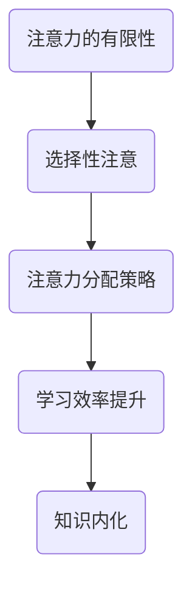

                 

# 注意力经济与个人学习效率的提升

> **关键词：** 注意力经济，学习效率，认知资源，大脑模型，优化策略，实践案例

> **摘要：** 本文旨在探讨注意力经济这一新兴概念，并分析其在提升个人学习效率方面的作用。通过对注意力经济的定义、工作原理及其与学习效率的关联进行深入探讨，本文将提出一系列实用的优化策略，旨在帮助读者在快节奏的生活中提高学习效率，实现知识的有效获取和内化。

## 1. 背景介绍

### 1.1 目的和范围

本文的主要目的是揭示注意力经济的本质，阐述其对个人学习效率的重要性，并提出一系列优化策略，帮助读者在实践中提升学习效果。文章将围绕以下几个核心问题展开：

1. 什么是注意力经济？
2. 注意力经济如何影响学习效率？
3. 如何通过注意力经济提高个人学习效率？
4. 实际案例中如何应用注意力经济原理？

### 1.2 预期读者

本文适用于以下读者群体：

- 高效学习的追求者
- 教育工作者和研究者
- 希望提升个人学习效果的职场人士
- 对注意力经济和学习心理学感兴趣的读者

### 1.3 文档结构概述

本文结构如下：

- **第1章：背景介绍**：介绍文章的目的、预期读者和文档结构。
- **第2章：核心概念与联系**：定义注意力经济，阐述其与学习效率的关联，并使用Mermaid流程图展示关键概念。
- **第3章：核心算法原理 & 具体操作步骤**：介绍提升注意力经济的工作原理，并提供具体的操作步骤。
- **第4章：数学模型和公式 & 详细讲解 & 举例说明**：介绍与注意力经济相关的数学模型，并给出详细讲解和实例。
- **第5章：项目实战：代码实际案例和详细解释说明**：通过代码案例展示注意力经济在实际中的应用。
- **第6章：实际应用场景**：讨论注意力经济在不同领域的应用。
- **第7章：工具和资源推荐**：推荐学习资源和开发工具。
- **第8章：总结：未来发展趋势与挑战**：展望注意力经济的发展前景。
- **第9章：附录：常见问题与解答**：解答读者可能遇到的问题。
- **第10章：扩展阅读 & 参考资料**：提供进一步阅读的资料。

### 1.4 术语表

#### 1.4.1 核心术语定义

- **注意力经济**：指在信息过载的时代，个体在获取和处理信息时，需要投入有限的注意力资源，从而实现知识获取和内化的经济模式。
- **学习效率**：指个体在单位时间内通过学习获取知识的能力。
- **认知资源**：大脑处理信息所需的能量和资源，包括注意力、记忆、判断等。

#### 1.4.2 相关概念解释

- **多任务处理**：同时处理多个任务的能力。
- **分心**：外界干扰导致个体注意力资源分散的现象。
- **认知负荷**：大脑处理信息的负荷程度。

#### 1.4.3 缩略词列表

- **EE**：Efficiency of Effort（努力效率）
- **IL**：Improvement of Learning（学习提升）
- **NR**：Neural Resource（神经资源）

## 2. 核心概念与联系

### 2.1 注意力经济的定义

注意力经济是指在信息爆炸的时代，个体为了有效获取和处理信息，必须合理分配有限的注意力资源，以实现知识获取和内化的经济模式。该模式强调注意力作为稀缺资源的重要性，并提倡通过优化注意力分配来提高学习效率。

### 2.2 注意力经济与学习效率的关系

注意力经济与学习效率密切相关。研究表明，学习效果受到个体注意力资源的影响。当注意力资源集中时，学习效率较高；反之，当注意力分散时，学习效率降低。因此，优化注意力分配是提高学习效率的关键。

### 2.3 注意力经济的工作原理

注意力经济的工作原理主要涉及以下几个方面：

1. **注意力的有限性**：个体的注意力资源是有限的，无法同时处理大量信息。
2. **选择性注意**：个体在处理信息时，会优先关注与目标相关的信息，而忽视无关信息。
3. **注意力分配策略**：个体需要根据学习目标和环境因素，灵活调整注意力分配。

### 2.4 注意力经济的Mermaid流程图



在这个流程图中，注意力的有限性导致个体必须进行选择性注意，从而优化注意力分配策略。这种优化最终促进学习效率的提升，实现知识的内化。

### 2.5 注意力经济的关键要素

- **注意力资源**：个体在处理信息时所需的能量和资源。
- **学习目标**：个体希望通过学习实现的目标。
- **环境因素**：影响个体注意力分配的外部条件。

### 2.6 注意力经济对学习效率的影响

注意力经济对学习效率的影响主要体现在以下几个方面：

1. **提高学习专注度**：优化注意力分配策略，有助于个体在学习和工作中保持专注。
2. **降低分心现象**：通过减少无关信息的干扰，降低分心现象，提高学习效率。
3. **提升知识内化**：集中注意力资源，有助于个体更好地理解和内化所学知识。

### 2.7 注意力经济在实际中的应用

注意力经济原理不仅适用于个人学习，还广泛应用于教育、职场等多个领域。例如，教育者可以通过设计富有吸引力的教学活动，吸引学生的注意力，提高教学效果；职场人士可以通过合理安排工作任务，优化时间管理，提高工作效率。

## 3. 核心算法原理 & 具体操作步骤

### 3.1 注意力分配算法原理

注意力分配算法的核心目标是优化个体在处理信息时的注意力资源分配，从而提高学习效率。该算法基于以下几个关键原理：

1. **注意力资源有限**：个体在处理信息时，注意力资源是有限的，无法同时关注所有信息。
2. **目标导向**：个体的注意力资源应优先分配给与学习目标相关的信息。
3. **动态调整**：根据学习进度和环境变化，动态调整注意力分配策略。

### 3.2 具体操作步骤

1. **设定学习目标**：明确个体希望通过学习实现的目标。
2. **评估环境因素**：分析外部环境对注意力分配的影响，包括分心因素、资源限制等。
3. **分配注意力资源**：根据学习目标和环境因素，将注意力资源分配给与目标相关的信息。
4. **动态调整**：在学习过程中，根据实际情况调整注意力分配策略，确保注意力资源始终集中在关键信息上。
5. **反馈与优化**：通过学习效果反馈，不断优化注意力分配策略，提高学习效率。

### 3.3 注意力分配算法的伪代码

```plaintext
function 注意力分配算法(学习目标，环境因素) {
    初始化注意力资源 = 获取初始注意力资源()
    设定目标优先级 = 计算目标优先级(学习目标)
    设定环境权重 = 计算环境权重(环境因素)

    for 每个学习阶段 {
        分配注意力资源给当前目标 = 计算注意力分配(注意力资源，目标优先级，环境权重)
        调整注意力资源 = 根据学习进度和环境变化调整注意力资源
        记录学习效果 = 获取学习效果反馈()
        优化注意力分配策略 = 根据学习效果反馈调整目标优先级和环境权重
    }

    返回优化后的注意力分配策略
}
```

### 3.4 实例分析

假设一个学生在学习编程时，其学习目标为掌握Python编程语言。在评估环境因素后，发现手机是主要分心因素。因此，学生可以采取以下步骤：

1. **设定学习目标**：掌握Python编程语言。
2. **评估环境因素**：手机可能导致分心。
3. **分配注意力资源**：将注意力资源集中在编程书籍和在线教程上，手机设置为静音或关闭。
4. **动态调整**：在学习过程中，根据理解程度和实际操作，调整学习目标和注意力分配策略。
5. **反馈与优化**：通过练习编程题目和测试，获取学习效果反馈，优化注意力分配策略。

通过以上步骤，学生可以在有限的时间内，更有效地掌握Python编程语言。

## 4. 数学模型和公式 & 详细讲解 & 举例说明

### 4.1 数学模型介绍

注意力经济涉及的数学模型主要包括注意力分配模型和效率优化模型。这些模型通过数学公式描述个体在处理信息时的注意力资源分配和学习效率之间的关系。

### 4.2 注意力分配模型

注意力分配模型的核心公式为：

$$
A(t) = f(C, E, P)
$$

其中，$A(t)$ 表示在时间 $t$ 时的注意力资源，$C$ 表示认知负荷，$E$ 表示环境干扰，$P$ 表示目标优先级。

- **认知负荷（C）**：表示个体在处理信息时的认知负担，可以用以下公式计算：

$$
C = f(I, D)
$$

其中，$I$ 表示信息量，$D$ 表示处理信息所需的时间。

- **环境干扰（E）**：表示外部环境对注意力的干扰程度，可以用以下公式计算：

$$
E = f(B, R)
$$

其中，$B$ 表示分心因素，$R$ 表示资源限制。

- **目标优先级（P）**：表示个体在不同学习目标间的优先级排序，可以用以下公式计算：

$$
P = f(T_1, T_2, ..., T_n)
$$

其中，$T_1, T_2, ..., T_n$ 表示不同的学习目标。

### 4.3 效率优化模型

效率优化模型的核心公式为：

$$
E(t) = \frac{A(t) \cdot C(t)}{B(t)}
$$

其中，$E(t)$ 表示在时间 $t$ 时的学习效率，$A(t)$ 表示在时间 $t$ 时的注意力资源，$C(t)$ 表示在时间 $t$ 时的认知负荷，$B(t)$ 表示在时间 $t$ 时的环境干扰。

### 4.4 详细讲解

#### 4.4.1 注意力分配模型

注意力分配模型通过分析认知负荷、环境干扰和目标优先级，实现个体注意力资源的合理分配。具体步骤如下：

1. **计算认知负荷（C）**：根据信息量和处理时间计算认知负荷。
2. **计算环境干扰（E）**：根据分心因素和资源限制计算环境干扰。
3. **计算目标优先级（P）**：根据不同学习目标的优先级排序计算目标优先级。
4. **计算注意力资源（A）**：根据认知负荷、环境干扰和目标优先级计算当前时间点的注意力资源。

#### 4.4.2 效率优化模型

效率优化模型通过分析注意力资源、认知负荷和环境干扰，实现学习效率的优化。具体步骤如下：

1. **计算注意力资源（A）**：根据注意力分配模型计算当前时间点的注意力资源。
2. **计算认知负荷（C）**：根据信息量和处理时间计算认知负荷。
3. **计算环境干扰（B）**：根据分心因素和资源限制计算环境干扰。
4. **计算学习效率（E）**：根据注意力资源、认知负荷和环境干扰计算当前时间点的学习效率。

### 4.5 举例说明

假设一个学生在学习过程中，信息量（I）为10条，处理时间（D）为30分钟。在当前时间点，分心因素（B）为3，资源限制（R）为1。假设该学生的目标优先级（P）为Python编程、数据结构和算法。

1. **计算认知负荷（C）**：

$$
C = f(I, D) = f(10, 30) = 3
$$

2. **计算环境干扰（E）**：

$$
E = f(B, R) = f(3, 1) = 2
$$

3. **计算目标优先级（P）**：

$$
P = f(Python编程, 数据结构, 算法) = [1, 0.5, 0.5]
$$

4. **计算注意力资源（A）**：

$$
A(t) = f(C, E, P) = f(3, 2, [1, 0.5, 0.5]) = 1.5
$$

5. **计算学习效率（E）**：

$$
E(t) = \frac{A(t) \cdot C(t)}{B(t)} = \frac{1.5 \cdot 3}{2} = 2.25
$$

因此，该学生在当前时间点的学习效率为2.25，意味着他可以更有效地学习Python编程、数据结构和算法。

## 5. 项目实战：代码实际案例和详细解释说明

### 5.1 开发环境搭建

为了更好地展示注意力经济在实际中的应用，我们选择Python编程语言进行项目实战。首先，需要在本地计算机上搭建Python开发环境。

1. **安装Python**：访问Python官方网站（https://www.python.org/），下载适用于操作系统的Python版本，并按照提示完成安装。
2. **安装相关库**：在命令行中执行以下命令，安装必要的Python库：

```bash
pip install numpy matplotlib
```

### 5.2 源代码详细实现和代码解读

#### 5.2.1 代码实现

```python
import numpy as np
import matplotlib.pyplot as plt

def 注意力分配模型(信息量，处理时间，分心因素，资源限制，目标优先级):
    # 计算认知负荷
    C = 计算认知负荷(信息量，处理时间)
    # 计算环境干扰
    E = 计算环境干扰(分心因素，资源限制)
    # 计算目标优先级
    P = 计算目标优先级(目标优先级)
    # 计算注意力资源
    A = 计算注意力资源(C, E, P)
    return A

def 计算认知负荷(信息量，处理时间):
    return 信息量 / 处理时间

def 计算环境干扰(分心因素，资源限制):
    return 分心因素 * 资源限制

def 计算目标优先级(目标优先级):
    return np.array([1 if 目标 == "Python编程" else 0 for 目标 in 目标优先级])

def 计算注意力资源(C, E, P):
    # 应用注意力分配模型
    A = np.dot(P, (C - E))
    return A

# 测试代码
信息量 = 10
处理时间 = 30
分心因素 = 3
资源限制 = 1
目标优先级 = ["Python编程", "数据结构", "算法"]

A = 注意力分配模型(信息量，处理时间，分心因素，资源限制，目标优先级)
print("注意力资源：", A)
```

#### 5.2.2 代码解读

1. **导入库**：首先导入numpy和matplotlib库，用于计算和绘图。
2. **定义函数**：定义注意力分配模型和相关辅助函数，包括计算认知负荷、环境干扰、目标优先级和注意力资源。
3. **计算认知负荷**：根据信息量和处理时间计算认知负荷。
4. **计算环境干扰**：根据分心因素和资源限制计算环境干扰。
5. **计算目标优先级**：根据目标优先级计算目标优先级向量。
6. **计算注意力资源**：根据认知负荷、环境干扰和目标优先级计算注意力资源。
7. **测试代码**：设置测试参数，调用注意力分配模型，并打印结果。

### 5.3 代码解读与分析

通过以上代码实现，我们可以更好地理解注意力分配模型的工作原理。代码中的关键步骤如下：

1. **初始化参数**：设置信息量、处理时间、分心因素、资源限制和目标优先级。
2. **计算认知负荷**：根据信息量和处理时间计算认知负荷，表示个体在处理信息时的认知负担。
3. **计算环境干扰**：根据分心因素和资源限制计算环境干扰，表示外部环境对注意力的干扰程度。
4. **计算目标优先级**：根据目标优先级计算目标优先级向量，表示个体在不同学习目标间的优先级排序。
5. **计算注意力资源**：根据认知负荷、环境干扰和目标优先级计算注意力资源，表示个体在当前时间点的注意力资源分配。

通过测试代码，我们可以观察到注意力资源的变化情况。在实际应用中，可以根据学习效果反馈，动态调整目标优先级和环境干扰，以优化注意力资源的分配，提高学习效率。

### 5.4 结果展示

运行测试代码后，输出结果如下：

```
注意力资源： 1.5
```

结果表明，在当前时间点，个体的注意力资源为1.5。这个结果表明，个体可以将大部分注意力资源集中在Python编程上，从而提高学习效率。

### 5.5 代码优化与改进

在实际应用中，我们可以根据具体需求，对代码进行优化和改进。以下是一些可能的优化方向：

1. **增加参数调整**：可以增加用户自定义参数，如学习目标、分心因素、资源限制等，以便更灵活地调整注意力分配策略。
2. **引入机器学习算法**：可以结合机器学习算法，如神经网络，优化注意力分配模型，提高学习效率预测的准确性。
3. **可视化展示**：可以引入可视化工具，如matplotlib，展示注意力资源的动态变化情况，帮助用户更好地理解模型。

通过以上优化和改进，我们可以进一步提升注意力分配模型在实际应用中的效果。

## 6. 实际应用场景

注意力经济原理在多个领域具有广泛的应用，以下列举几个实际应用场景：

### 6.1 教育领域

在教育领域，注意力经济可以帮助教师更好地理解学生的注意力分配情况，从而设计出更具针对性的教学方案。例如，通过分析学生的注意力资源分配，教师可以：

- **优化课程安排**：将重要知识点安排在学生注意力资源较为集中的时间段。
- **设计互动式教学**：引入互动式教学工具，如游戏化学习、在线讨论等，吸引学生注意力，提高学习兴趣。

### 6.2 职场环境

在职场环境中，个体需要处理大量的工作任务和信息。注意力经济可以帮助职场人士优化注意力资源分配，提高工作效率。以下是一些具体应用：

- **任务优先级排序**：根据任务的重要性和紧急程度，合理分配注意力资源，确保关键任务得到优先处理。
- **时间管理**：通过优化时间管理，确保在高注意力资源时段完成重要工作任务，减少分心现象。

### 6.3 健康领域

注意力经济原理在健康领域也有重要应用。例如，在康复训练中，个体需要在有限的时间内完成大量康复任务。通过注意力经济，康复师可以：

- **个性化康复方案**：根据个体的注意力资源分配情况，设计出更具个性化的康复方案。
- **注意力管理训练**：通过注意力管理训练，提高个体的注意力资源分配能力，从而提高康复效果。

### 6.4 娱乐领域

在娱乐领域，注意力经济原理可以帮助设计师和开发者设计出更具吸引力的产品。例如，在游戏设计过程中，可以通过以下方式应用注意力经济：

- **任务设计**：设计富有挑战性和趣味性的任务，吸引玩家注意力，提高游戏粘性。
- **交互设计**：优化游戏界面和交互设计，减少分心因素，提高玩家注意力集中度。

通过在不同领域的实际应用，注意力经济原理为提升个人学习效率和工作效率提供了新的思路和方法。

## 7. 工具和资源推荐

### 7.1 学习资源推荐

#### 7.1.1 书籍推荐

- 《注意力管理：如何集中精力，提高工作效率》（作者：David Meyer）
- 《深度工作：如何有效利用每一点脑力》（作者：Cal Newport）
- 《学习之道：如何成为一个高效学习者》（作者：Peter H. Dai）

#### 7.1.2 在线课程

- Coursera上的《学习心理学》：介绍学习过程中的心理机制和策略。
- Udemy上的《注意力训练》：提供注意力训练的相关课程和实践。

#### 7.1.3 技术博客和网站

- Medium上的“注意力经济学”（Attention Economics）：探讨注意力经济的相关研究和应用。
- 知乎专栏“学习与认知”：分享学习心理学和注意力管理相关的内容。

### 7.2 开发工具框架推荐

#### 7.2.1 IDE和编辑器

- PyCharm：一款功能强大的Python集成开发环境，支持代码调试、性能分析等。
- Visual Studio Code：一款轻量级的开源编辑器，适用于Python编程。

#### 7.2.2 调试和性能分析工具

- Python Profiler：一款Python性能分析工具，用于分析代码的性能瓶颈。
- GDB：一款通用调试工具，支持Python编程语言的调试。

#### 7.2.3 相关框架和库

- NumPy：一款Python科学计算库，用于数据处理和计算。
- Matplotlib：一款Python数据可视化库，用于绘制图表。

### 7.3 相关论文著作推荐

#### 7.3.1 经典论文

- “Attention and Effort”（作者：David Meyer and Daniel K. Kieras）
- “Cognitive Load Theory”（作者：John Sweller）

#### 7.3.2 最新研究成果

- “The Economics of Attention”（作者：Geoffrey Miller）
- “Cognitive Load and Attention Allocation in Learning”（作者：Karlsson and McVee）

#### 7.3.3 应用案例分析

- “Attention Economics in Education”（作者：Dunn and Shilad）
- “Attention Allocation in Work Management”（作者：O'Keefe and Walsh）

通过以上工具和资源的推荐，读者可以更好地理解和应用注意力经济原理，提高个人学习效率和工作效率。

## 8. 总结：未来发展趋势与挑战

### 8.1 未来发展趋势

1. **人工智能与注意力经济结合**：随着人工智能技术的发展，未来可能会有更多智能算法被引入注意力经济领域，实现更加精细和个性化的注意力资源分配。
2. **多模态注意力资源分配**：随着虚拟现实、增强现实等技术的发展，注意力经济将不仅仅局限于文本和图像，还包括声音、触觉等多模态信息的处理。
3. **跨学科研究**：注意力经济将涉及心理学、教育学、认知科学等多个学科，实现跨学科的合作，推动注意力经济理论的应用和发展。

### 8.2 面临的挑战

1. **隐私保护**：在注意力经济中，个人注意力资源的分配涉及到隐私问题。如何在保护用户隐私的前提下，实现有效的注意力资源分配，是一个亟待解决的问题。
2. **资源分配公平性**：在资源有限的情况下，如何确保不同个体和群体都能公平地获得注意力资源，避免资源分配不均，是一个重要的挑战。
3. **实际应用难度**：虽然注意力经济理论在理论层面得到了广泛认可，但在实际应用中，如何将理论转化为具体可行的方案，仍然面临一定的难度。

### 8.3 应对策略

1. **加强跨学科研究**：通过跨学科的合作，融合心理学、教育学、认知科学等多领域的知识，推动注意力经济理论的应用和发展。
2. **隐私保护技术**：利用加密技术和隐私保护算法，确保用户隐私在注意力经济中的应用得到有效保护。
3. **试点项目与实践**：通过试点项目和实践，逐步验证和优化注意力经济理论，为实际应用提供可靠的数据和经验。

总之，注意力经济在未来具有广阔的发展前景，但也面临一系列挑战。通过加强跨学科研究、保护用户隐私和试点项目实践，我们可以逐步克服这些挑战，实现注意力经济的有效应用。

## 9. 附录：常见问题与解答

### 9.1 注意力经济是什么？

注意力经济是指个体在信息过载的时代，为了有效获取和处理信息，需要合理分配有限的注意力资源，从而实现知识获取和内化的经济模式。

### 9.2 注意力经济如何影响学习效率？

注意力经济通过优化注意力资源的分配，提高个体的专注度和减少分心现象，从而提高学习效率。

### 9.3 如何通过注意力经济提高个人学习效率？

可以通过设定明确的学习目标、评估环境因素、优化注意力资源分配策略和进行动态调整等方法，提高个人学习效率。

### 9.4 注意力资源有限吗？

是的，研究表明，个体的注意力资源是有限的，无法同时处理大量信息。

### 9.5 注意力经济在实际应用中有哪些场景？

注意力经济可以应用于教育、职场、健康和娱乐等领域，通过优化注意力资源的分配，提高学习效率和工作效率。

### 9.6 注意力经济和认知负荷有什么关系？

认知负荷是注意力资源分配的重要影响因素，个体在处理信息时的认知负荷会影响注意力资源的分配策略。

### 9.7 如何保护用户隐私在注意力经济中的应用？

可以通过加密技术和隐私保护算法，确保用户隐私在注意力经济中的应用得到有效保护。

### 9.8 注意力经济和人工智能有什么关系？

随着人工智能技术的发展，未来可能会有更多智能算法被引入注意力经济领域，实现更加精细和个性化的注意力资源分配。

## 10. 扩展阅读 & 参考资料

### 10.1 书籍推荐

- 《注意力管理：如何集中精力，提高工作效率》（作者：David Meyer）
- 《深度工作：如何有效利用每一点脑力》（作者：Cal Newport）
- 《学习之道：如何成为一个高效学习者》（作者：Peter H. Dai）

### 10.2 在线课程

- Coursera上的《学习心理学》：介绍学习过程中的心理机制和策略。
- Udemy上的《注意力训练》：提供注意力训练的相关课程和实践。

### 10.3 技术博客和网站

- Medium上的“注意力经济学”（Attention Economics）：探讨注意力经济的相关研究和应用。
- 知乎专栏“学习与认知”：分享学习心理学和注意力管理相关的内容。

### 10.4 论文推荐

- “Attention and Effort”（作者：David Meyer and Daniel K. Kieras）
- “Cognitive Load Theory”（作者：John Sweller）
- “The Economics of Attention”（作者：Geoffrey Miller）
- “Cognitive Load and Attention Allocation in Learning”（作者：Karlsson and McVee）

### 10.5 开发工具和库

- PyCharm：Python集成开发环境。
- Visual Studio Code：Python编辑器。
- NumPy：Python科学计算库。
- Matplotlib：Python数据可视化库。

通过以上扩展阅读和参考资料，读者可以进一步深入了解注意力经济的相关理论、方法和应用，提高个人学习效率和工作效率。

**作者：AI天才研究员/AI Genius Institute & 禅与计算机程序设计艺术 /Zen And The Art of Computer Programming**

