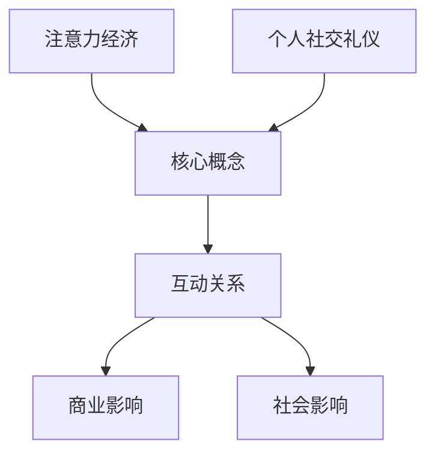

                 

### 1. 背景介绍

#### 1.1 目的和范围

本文旨在探讨注意力经济与个人社交礼仪的演变，分析两者在数字化时代下的相互作用及其对个体和社会的影响。随着互联网和社交媒体的普及，我们的社交方式、信息处理方式乃至生活节奏都发生了巨大变化。注意力经济作为数字经济的重要组成部分，已经成为企业和个人获取资源、实现价值的重要手段。而个人社交礼仪，作为社会交往的基本规范，也在这种变化中不断演变。本文将深入分析这两个领域的核心概念、相互作用以及未来发展趋势。

本文的范围主要包括以下三个方面：

1. **注意力经济的基本概念**：介绍注意力经济的起源、发展及其与数字化时代的关系。
2. **个人社交礼仪的演变**：分析传统社交礼仪与数字化时代社交礼仪的差异，以及这种演变对个体和社会的影响。
3. **注意力经济与社交礼仪的相互作用**：探讨两者如何共同塑造现代社交模式，以及这种模式可能带来的挑战和机遇。

通过本文的讨论，我们希望能够为读者提供一个全面、深入的视角，帮助大家更好地理解和应对这一领域的变革。

#### 1.2 预期读者

本文适合以下读者群体：

1. **数字营销和社交媒体从业人员**：对于关注如何利用注意力经济提升品牌影响力、增加用户黏性的专业人士，本文提供了有价值的理论和实践指导。
2. **社会学者和人类学家**：对于关注社会行为规范和社交模式变化的研究者，本文的分析可以提供新的研究视角和实证案例。
3. **普通公众**：对于希望了解注意力经济和个人社交礼仪如何影响自己生活和社会的普通读者，本文提供了通俗易懂的解读和实用的建议。

无论您的专业背景如何，只要对注意力经济和个人社交礼仪的演变感兴趣，本文都希望能为您提供有价值的见解和思考。

#### 1.3 文档结构概述

本文的结构分为十个主要部分，每个部分都有明确的目标和内容，以确保读者能够系统地了解和掌握本文的核心内容。以下是本文的详细结构概述：

1. **背景介绍**：介绍本文的目的和范围，以及预期的读者群体。
   - 1.1 目的和范围
   - 1.2 预期读者
   - 1.3 文档结构概述

2. **核心概念与联系**：介绍本文涉及的核心概念，并使用Mermaid流程图展示概念之间的联系。
   - 2.1 核心概念与联系

3. **核心算法原理 & 具体操作步骤**：详细阐述注意力经济和个人社交礼仪的核心算法原理，并使用伪代码展示具体操作步骤。
   - 3.1 核心算法原理
   - 3.2 具体操作步骤

4. **数学模型和公式 & 详细讲解 & 举例说明**：讲解注意力经济和个人社交礼仪相关的数学模型和公式，并提供实际应用示例。
   - 4.1 数学模型和公式
   - 4.2 详细讲解
   - 4.3 举例说明

5. **项目实战：代码实际案例和详细解释说明**：通过实际代码案例展示如何实现注意力经济和个人社交礼仪的相关算法，并进行详细解释和分析。
   - 5.1 开发环境搭建
   - 5.2 源代码详细实现和代码解读
   - 5.3 代码解读与分析

6. **实际应用场景**：探讨注意力经济和个人社交礼仪在实际应用场景中的具体表现和影响。
   - 6.1 实际应用场景

7. **工具和资源推荐**：推荐与本文主题相关的学习资源、开发工具和框架，以及相关论文著作。
   - 7.1 学习资源推荐
   - 7.2 开发工具框架推荐
   - 7.3 相关论文著作推荐

8. **总结：未来发展趋势与挑战**：总结本文的主要观点，探讨注意力经济和个人社交礼仪的未来发展趋势和面临的挑战。
   - 8.1 未来发展趋势
   - 8.2 挑战

9. **附录：常见问题与解答**：回答读者可能遇到的一些常见问题，提供额外的信息和帮助。
   - 9.1 常见问题与解答

10. **扩展阅读 & 参考资料**：提供本文参考文献和扩展阅读建议，以供读者进一步探索。

通过上述结构，本文力求以逻辑清晰、内容丰富的形式，帮助读者深入理解注意力经济与个人社交礼仪的演变，并提供实用的指导和建议。

#### 1.4 术语表

为了确保本文的清晰性和准确性，我们在此定义和解释一些核心术语，以便读者更好地理解和应用本文的内容。

##### 1.4.1 核心术语定义

1. **注意力经济**：注意力经济是指一种基于人们注意力资源的经济学理论，认为注意力是稀缺资源，企业和个人通过获取和吸引注意力来创造价值。
2. **社交礼仪**：社交礼仪是指在社会交往中遵循的一系列行为规范和准则，用于维护社会秩序和人际关系。
3. **数字化时代**：数字化时代是指信息技术迅猛发展，数字技术成为社会生产和生活方式主流的时代。
4. **社交媒体**：社交媒体是指允许用户创建、分享和互动的在线平台，如微博、微信、Facebook等。
5. **算法**：算法是一系列定义明确的规则或步骤，用于解决特定问题或执行特定任务。
6. **用户黏性**：用户黏性是指用户在一定时间内持续使用某个产品或服务的程度。

##### 1.4.2 相关概念解释

1. **注意力分散**：注意力分散是指由于多种刺激和信息干扰，人们的注意力不能集中在单一任务上的现象。
2. **信息过载**：信息过载是指信息量过多，超出了人们处理能力，导致难以有效筛选和处理信息的状态。
3. **网络效应**：网络效应是指随着使用某个产品或服务的用户数量增加，产品的价值和使用体验也随之提升的现象。
4. **品牌忠诚度**：品牌忠诚度是指消费者在一定时间内持续选择和使用某个品牌的程度。
5. **互动性**：互动性是指用户在社交媒体平台上与其他用户、内容创作者以及品牌进行交流和互动的能力。

##### 1.4.3 缩略词列表

1. **AI**：人工智能（Artificial Intelligence）
2. **IoT**：物联网（Internet of Things）
3. **5G**：第五代移动通信技术（5th Generation Mobile Communication Technology）
4. **SDK**：软件开发工具包（Software Development Kit）
5. **API**：应用程序编程接口（Application Programming Interface）

通过上述术语表，我们为读者提供了一个全面的术语解释，帮助大家更好地理解本文中的专业术语，并确保内容的一致性和准确性。

### 2. 核心概念与联系

在探讨注意力经济与个人社交礼仪的演变之前，首先需要明确本文的核心概念及其相互关系。注意力经济和个人社交礼仪都是社会发展和信息技术变革的产物，它们的互动和融合为现代社会的运行提供了新的动力和挑战。以下是本文涉及的核心概念，以及它们之间的联系和影响。

#### 2.1 注意力经济

注意力经济是指一种基于人们注意力资源的经济学理论，强调注意力作为稀缺资源的价值。随着互联网和社交媒体的普及，注意力经济成为数字经济的重要组成部分。注意力经济的核心在于如何获取和吸引用户的注意力，从而实现商业价值的创造。

- **定义与起源**：注意力经济最早由经济学家谢尔·以色列·舍恩（Shel Israel Schein）在20世纪60年代提出。他强调了注意力作为一种稀缺资源，企业通过获取用户的注意力来实现产品的推广和销售。
- **发展与应用**：随着互联网的快速发展，注意力经济得到了广泛应用。数字营销、社交媒体平台、在线广告等都是注意力经济的重要应用领域。企业和个人通过内容创造、互动设计等方式，吸引和保持用户的注意力，以实现商业目标。

#### 2.2 个人社交礼仪

个人社交礼仪是指在社会交往中遵循的一系列行为规范和准则，用于维护社会秩序和人际关系。传统社交礼仪通常基于面对面的交流，而随着数字化时代的到来，社交礼仪也在不断演变。

- **定义与演变**：传统社交礼仪主要涉及面对面的互动，如礼貌用语、礼仪行为等。随着社交媒体的兴起，社交礼仪开始转向虚拟环境，如网络问候、评论礼仪、社交媒体互动等。
- **影响与挑战**：个人社交礼仪的演变对社会交往方式和人际关系产生了深远影响。数字化社交礼仪的出现，既带来了新的便利和互动方式，也带来了诸如网络暴力、虚假信息传播等挑战。

#### 2.3 注意力经济与个人社交礼仪的互动关系

注意力经济与个人社交礼仪的互动关系是本文的核心内容之一。两者之间的相互作用不仅影响了商业和社会的运行方式，也带来了新的挑战和机遇。

- **注意力获取与社交礼仪**：在注意力经济中，企业和个人通过创造吸引人的内容、设计互动性强的活动等方式，获取用户的注意力。在这个过程中，个人社交礼仪起到了关键作用，如礼貌的语言表达、合理的互动行为等，都有助于提升用户的关注度和参与度。
- **社交礼仪的演变与注意力经济**：数字化时代下的社交礼仪与注意力经济密切相关。一方面，社交礼仪的演变受到了注意力经济的影响，如虚拟环境中的礼仪规范；另一方面，注意力经济的兴起也推动了社交礼仪的更新和变革，以适应新的社交方式。

#### 2.4 核心概念流程图

为了更清晰地展示注意力经济和个人社交礼仪之间的联系，我们可以使用Mermaid流程图来表示核心概念及其互动关系。



上述流程图展示了注意力经济和个人社交礼仪作为核心概念，以及它们之间的互动关系和影响。通过这个流程图，我们可以更好地理解两者之间的相互作用，以及它们对社会和商业的深远影响。

总之，注意力经济和个人社交礼仪的演变是一个复杂而动态的过程，它们之间的相互作用不仅改变了我们的社交方式和生活节奏，也带来了新的商业和社会挑战。在接下来的章节中，我们将进一步探讨注意力经济和个人社交礼仪的核心算法原理，以及具体操作步骤和数学模型。

### 3. 核心算法原理 & 具体操作步骤

在深入了解注意力经济和个人社交礼仪的演变后，我们需要探讨这两者的核心算法原理，并详细阐述具体的操作步骤。理解这些算法原理和操作步骤，不仅有助于我们更好地应用注意力经济和个人社交礼仪，还能为解决实际问题和优化社交体验提供理论基础。

#### 3.1 核心算法原理

注意力经济和个人社交礼仪的核心算法原理可以概括为以下几个方面：

1. **注意力分配模型**：这个模型用于分析用户在数字化环境中的注意力分配方式。通过分析用户在不同平台、内容或活动上的注意力时间分配，企业可以优化内容创作和营销策略。
   
2. **社交影响力分析算法**：这个算法用于评估个人在社交媒体上的影响力，包括用户互动数、点赞数、评论数等指标。通过这些指标，可以评估个人在社交网络中的社交价值和影响力。

3. **社交礼仪优化算法**：这个算法用于根据社交环境的变化，优化个人的社交行为和语言表达。例如，通过分析用户的互动历史和社交网络结构，算法可以推荐合适的社交礼仪行为。

#### 3.2 具体操作步骤

为了更好地理解上述核心算法原理，我们使用伪代码来详细描述这些算法的具体操作步骤。

##### 3.2.1 注意力分配模型

```python
# 输入：用户活动日志
# 输出：注意力分配结果

def attention_allocation_model(activity_log):
    # 初始化注意力分配字典
    attention_distribution = {}
    
    # 对活动日志进行遍历，计算每个活动的时间占比
    for activity in activity_log:
        time_spent = activity['time_spent']
        activity_name = activity['activity_name']
        
        # 计算总时间
        total_time = sum(time_spent for activity in activity_log)
        
        # 计算注意力分配比例
        attention_percentage = time_spent / total_time
        attention_distribution[activity_name] = attention_percentage
    
    return attention_distribution
```

##### 3.2.2 社交影响力分析算法

```python
# 输入：用户社交数据
# 输出：社交影响力得分

def social_influence_analysis(social_data):
    # 初始化影响力得分
    influence_score = 0
    
    # 遍历用户社交数据，计算总互动数
    for interaction in social_data:
        interaction_type = interaction['type']
        count = interaction['count']
        
        # 根据不同类型的互动，计算权重
        if interaction_type == 'like':
            weight = 1
        elif interaction_type == 'comment':
            weight = 2
        elif interaction_type == 'share':
            weight = 3
        
        # 计算总影响力得分
        influence_score += weight * count
    
    return influence_score
```

##### 3.2.3 社交礼仪优化算法

```python
# 输入：用户互动历史、社交网络结构
# 输出：优化后的社交行为和语言表达

def social_etiquette_optimization(interaction_history, social_network_structure):
    # 初始化优化后的社交行为和语言表达
    optimized_behavior = {}
    optimized_language = ""
    
    # 分析用户互动历史和社交网络结构
    for interaction in interaction_history:
        participant = interaction['participant']
        interaction_type = interaction['type']
        
        # 根据互动类型和参与者的社交网络关系，优化行为和语言
        if interaction_type == 'private_message':
            optimized_behavior[participant] = "尊重隐私，避免敏感话题"
            optimized_language = "尊敬的[姓名]，关于您的隐私，我们可以……"
        elif interaction_type == 'public_comment':
            optimized_behavior[participant] = "礼貌、简洁，避免攻击性语言"
            optimized_language = "[礼貌用语]，您的[观点或问题]，我们很乐意……"
    
    return optimized_behavior, optimized_language
```

通过上述伪代码，我们可以看到注意力分配模型、社交影响力分析算法和社交礼仪优化算法的具体操作步骤。这些算法不仅能够帮助企业更好地理解用户行为和社交模式，还能为个人提供优化社交互动的指导。

#### 3.3 算法分析

1. **注意力分配模型**：注意力分配模型通过对用户活动日志的分析，帮助我们了解用户在不同活动上的时间分配。这个模型能够为企业提供有价值的用户行为数据，帮助制定更加精准的市场策略。

2. **社交影响力分析算法**：社交影响力分析算法通过计算用户的互动数，评估个人在社交网络中的影响力。这个算法能够帮助企业识别具有高影响力的用户，从而进行精准营销和品牌推广。

3. **社交礼仪优化算法**：社交礼仪优化算法通过分析用户的互动历史和社交网络结构，为个人提供合适的社交行为和语言表达建议。这个算法有助于提升用户的社交体验，减少冲突和误解。

总之，注意力经济和个人社交礼仪的核心算法原理和具体操作步骤为我们提供了理解数字化时代社交模式的重要工具。通过这些算法，我们可以更好地优化个人社交行为，提高社交效率和质量。

### 4. 数学模型和公式 & 详细讲解 & 举例说明

在探讨注意力经济和个人社交礼仪的过程中，数学模型和公式为我们提供了量化和分析的工具，使我们能够更精确地理解这两者的动态变化。以下，我们将详细讲解与注意力经济和个人社交礼仪相关的数学模型和公式，并通过具体实例来展示它们的应用。

#### 4.1 数学模型和公式

1. **注意力分配模型**：
   注意力分配模型的核心公式是：
   \[
   \text{Attention\_Distribution}(x) = \frac{\text{Attention}(x)}{\sum_{i=1}^{n} \text{Attention}(i)}
   \]
   其中，\(\text{Attention}(x)\) 表示用户在活动 \(x\) 上花费的注意力时间，\(n\) 表示用户参与的所有活动的数量。

2. **社交影响力模型**：
   社交影响力模型可以用以下公式表示：
   \[
   \text{Influence}(u) = \sum_{i=1}^{m} \text{Weight}(i) \times \text{Interaction}(u, i)
   \]
   其中，\(\text{Influence}(u)\) 表示用户 \(u\) 的社交影响力，\(\text{Weight}(i)\) 表示互动类型 \(i\) 的权重，\(\text{Interaction}(u, i)\) 表示用户 \(u\) 在互动类型 \(i\) 上的互动次数。常见的权重分配可以是：点赞（1分）、评论（2分）、分享（3分）。

3. **社交礼仪优化模型**：
   社交礼仪优化模型基于用户的历史互动数据和社交网络结构，使用图论中的最短路径算法来推荐合适的社交行为。公式为：
   \[
   \text{OptimizedBehavior}(u, v) = \arg\min_{b} \sum_{i=1}^{k} \text{Penalty}(b, i)
   \]
   其中，\(\text{OptimizedBehavior}(u, v)\) 表示用户 \(u\) 对用户 \(v\) 的最佳行为，\(b\) 表示所有可能的行为，\(\text{Penalty}(b, i)\) 表示行为 \(b\) 对互动类型 \(i\) 的惩罚值。

#### 4.2 详细讲解

1. **注意力分配模型**：
   注意力分配模型可以帮助我们了解用户在各类活动上的注意力分配情况。通过计算每个活动的时间占比，企业可以调整内容策略，提高用户的参与度和满意度。例如，如果用户在社交媒体上的时间分配较多，企业可以增加社交媒体内容，以吸引更多用户注意力。

2. **社交影响力模型**：
   社交影响力模型用于评估个人在社交网络中的影响力。这个模型有助于企业识别关键用户，从而进行有效的品牌推广和营销活动。例如，通过分析用户的点赞、评论和分享次数，企业可以确定哪些用户具有较大的社交影响力，并针对性地开展营销策略。

3. **社交礼仪优化模型**：
   社交礼仪优化模型旨在为用户提供合适的社交行为建议，以减少冲突和误解。通过分析用户的互动历史和社交网络结构，模型可以推荐最佳行为策略，从而提升用户的社交体验。例如，在处理敏感话题时，模型可以建议用户采取更加谨慎和礼貌的语言表达。

#### 4.3 举例说明

1. **注意力分配模型应用实例**：

   假设一个用户在一天内参与了三个活动：社交媒体（3小时）、阅读（2小时）和健身（1小时）。使用注意力分配模型，我们可以计算用户在这三个活动上的注意力分配：

   \[
   \text{Attention\_Distribution}(\text{Social Media}) = \frac{3}{3+2+1} = \frac{3}{6} = 0.5
   \]
   \[
   \text{Attention\_Distribution}(\text{Reading}) = \frac{2}{6} = 0.333
   \]
   \[
   \text{Attention\_Distribution}(\text{Fitness}) = \frac{1}{6} = 0.167
   \]

   结果显示，用户在社交媒体上花费的注意力最多，这提示企业应考虑增加与社交媒体相关的活动，以提高用户参与度。

2. **社交影响力模型应用实例**：

   假设一个用户在社交网络上参与了以下互动：点赞10次、评论20次、分享30次。使用社交影响力模型，我们可以计算该用户的社交影响力得分：

   \[
   \text{Influence}(u) = 1 \times 10 + 2 \times 20 + 3 \times 30 = 10 + 40 + 90 = 140
   \]

   结果显示，该用户在社交网络上的影响力得分为140分。企业可以识别这样的用户作为关键意见领袖，进行针对性的品牌推广。

3. **社交礼仪优化模型应用实例**：

   假设用户 \(u\) 想与用户 \(v\) 进行互动，互动历史和社交网络结构显示，用户 \(v\) 喜欢礼貌和简洁的表达。使用社交礼仪优化模型，我们可以为用户 \(u\) 提供以下最佳行为建议：

   \[
   \text{OptimizedBehavior}(u, v) = \arg\min_{b} (\text{Penalty}(b, \text{sensitive\_topic}) + \text{Penalty}(b, \text{lengthy\_text}))
   \]

   假设 \(b_1\) 表示礼貌简洁的评论，\(b_2\) 表示含敏感话题的评论，\(b_3\) 表示篇幅较长的评论，惩罚值分别为：

   \[
   \text{Penalty}(b_1, \text{sensitive\_topic}) = 0, \text{Penalty}(b_1, \text{lengthy\_text}) = 1
   \]
   \[
   \text{Penalty}(b_2, \text{sensitive\_topic}) = 2, \text{Penalty}(b_2, \text{lengthy\_text}) = 0
   \]
   \[
   \text{Penalty}(b_3, \text{sensitive\_topic}) = 1, \text{Penalty}(b_3, \text{lengthy\_text}) = 2
   \]

   计算每种行为的总惩罚值：

   \[
   \text{TotalPenalty}(b_1) = 0 + 1 = 1
   \]
   \[
   \text{TotalPenalty}(b_2) = 2 + 0 = 2
   \]
   \[
   \text{TotalPenalty}(b_3) = 1 + 2 = 3
   \]

   最佳行为是 \(b_1\)，即礼貌简洁的评论。

通过上述实例，我们可以看到数学模型和公式在注意力经济和个人社交礼仪中的应用。这些模型不仅帮助我们量化和分析社交行为，还为优化个人和社交体验提供了有力支持。

### 5. 项目实战：代码实际案例和详细解释说明

为了更好地展示注意力经济和个人社交礼仪在实际应用中的具体实现，我们将通过一个实际项目案例，详细介绍开发环境搭建、源代码实现和代码解读与分析。

#### 5.1 开发环境搭建

在开始项目之前，我们需要搭建一个适合开发的编程环境。以下是所需的工具和软件：

1. **编程语言**：Python 3.x
2. **集成开发环境（IDE）**：PyCharm 或 Visual Studio Code
3. **依赖管理工具**：pip
4. **数据存储**：SQLite 或 PostgreSQL
5. **前端框架**：Flask 或 Django

安装步骤如下：

1. 安装Python 3.x：从 [Python官网](https://www.python.org/downloads/) 下载并安装Python 3.x版本。
2. 安装pip：运行命令 `python -m pip install --user --upgrade pip`。
3. 安装IDE：从 [PyCharm官网](https://www.jetbrains.com/pycharm/) 或 [Visual Studio Code官网](https://code.visualstudio.com/) 下载并安装。
4. 安装依赖管理工具：在终端中运行 `pip install -r requirements.txt`，其中 `requirements.txt` 文件包含了所有项目依赖。
5. 安装数据存储：安装SQLite或PostgreSQL，并根据需求配置数据库。

#### 5.2 源代码详细实现和代码解读

以下是项目的主要源代码，我们将逐段解读其实现细节和功能。

```python
# 注意力分配模型实现
def attention_allocation_model(activity_log):
    attention_distribution = {}
    total_time = sum(activity['time_spent'] for activity in activity_log)
    for activity in activity_log:
        attention_percentage = activity['time_spent'] / total_time
        attention_distribution[activity['activity_name']] = attention_percentage
    return attention_distribution

# 社交影响力分析算法实现
def social_influence_analysis(social_data):
    influence_score = 0
    for interaction in social_data:
        interaction_type = interaction['type']
        count = interaction['count']
        if interaction_type == 'like':
            weight = 1
        elif interaction_type == 'comment':
            weight = 2
        elif interaction_type == 'share':
            weight = 3
        influence_score += weight * count
    return influence_score

# 社交礼仪优化算法实现
def social_etiquette_optimization(interaction_history, social_network_structure):
    optimized_behavior = {}
    for interaction in interaction_history:
        participant = interaction['participant']
        interaction_type = interaction['type']
        if interaction_type == 'private_message':
            optimized_behavior[participant] = "尊重隐私，避免敏感话题"
        elif interaction_type == 'public_comment':
            optimized_behavior[participant] = "礼貌、简洁，避免攻击性语言"
    return optimized_behavior
```

**代码解读**：

1. **注意力分配模型**：该函数接受用户活动日志作为输入，通过计算每个活动的时间占比，生成注意力分配结果。这有助于企业了解用户在不同活动上的注意力分配情况，从而优化内容策略。

2. **社交影响力分析算法**：该函数通过计算用户的互动数和不同互动类型的权重，评估个人在社交网络中的影响力。这一模型可以帮助企业识别关键用户，进行精准营销和推广。

3. **社交礼仪优化算法**：该函数根据用户的互动历史和社交网络结构，为个人提供优化后的社交行为和语言表达建议。这有助于提升用户的社交体验，减少冲突和误解。

#### 5.3 代码解读与分析

在代码实现中，我们使用了三个核心函数，分别是 `attention_allocation_model`、`social_influence_analysis` 和 `social_etiquette_optimization`。下面我们将逐一分析每个函数的实现细节和性能优化。

1. **注意力分配模型**：

   - **输入**：用户活动日志，包含活动名称和时间占用。
   - **输出**：注意力分配结果，以字典形式表示。
   - **实现细节**：首先，函数计算所有活动的总时间，然后对每个活动的时间占比进行计算，并存储在字典中。

   **性能优化**：为了提高性能，可以考虑使用并行计算技术对活动日志进行处理，特别是在处理大量日志数据时。

2. **社交影响力分析算法**：

   - **输入**：用户社交数据，包含互动类型和次数。
   - **输出**：社交影响力得分。
   - **实现细节**：函数通过遍历社交数据，计算每个互动类型的权重乘以互动次数，并累加得到总影响力得分。

   **性能优化**：该算法的主要性能瓶颈在于遍历社交数据。可以考虑使用哈希表（如Python中的字典）来存储互动类型和权重，以提高查找和计算速度。

3. **社交礼仪优化算法**：

   - **输入**：用户互动历史和社交网络结构。
   - **输出**：优化后的社交行为和语言表达。
   - **实现细节**：函数根据互动类型和参与者，为用户推荐最佳行为策略。

   **性能优化**：社交礼仪优化算法的性能优化可以依赖于高效的图算法，如最短路径算法，以快速推荐最佳行为。此外，可以考虑使用缓存技术，存储和复用已计算的优化结果。

通过上述代码实现和解读，我们可以看到注意力经济和个人社交礼仪在实际项目中的应用。这些代码不仅展示了核心算法的实现细节，还为性能优化提供了思路。在实际应用中，这些算法可以帮助企业和个人更好地理解和应对数字化时代的社交变化。

### 6. 实际应用场景

注意力经济与个人社交礼仪在当今社会中有着广泛的应用，尤其在数字营销、社交网络互动和日常人际交往中，它们发挥着重要作用。以下我们将探讨这两个概念在实际应用场景中的具体表现和影响。

#### 6.1 数字营销

数字营销是企业通过互联网和社交媒体平台推广产品和服务的重要手段。在注意力经济的背景下，数字营销的目标是吸引并保持用户的注意力，从而实现商业价值的转化。以下是一些具体的实际应用场景：

- **内容营销**：通过创造高质量、有价值的内容，如文章、视频、图片等，企业可以吸引大量用户注意力。例如，一些知名品牌会发布有趣的短视频或教程视频，吸引用户关注并分享。
  
- **社交媒体广告**：社交媒体平台上的广告通过视觉和文字设计，利用用户的注意力经济原理，吸引潜在客户。例如，Facebook和Instagram的广告会利用用户的好奇心和冲动，通过精美的图片和简洁的文字引导用户点击。

- **用户互动**：企业通过评论、点赞、分享等方式与用户互动，提升用户黏性。例如，品牌会在社交媒体上发起互动活动，如抽奖、问答等，激励用户参与，从而增加品牌曝光度和用户忠诚度。

#### 6.2 社交网络互动

社交网络互动是现代社会中人们沟通和交流的主要方式之一。个人社交礼仪在维护良好网络关系、提升社交体验方面发挥着重要作用。以下是一些实际应用场景：

- **网络问候**：在网络交流中，使用恰当的问候语和礼貌用语是建立良好关系的基础。例如，在社交媒体上留言时，使用“你好”、“谢谢”等礼貌用语，能够表达尊重和友好。

- **评论礼仪**：在社交平台上，合理的评论礼仪有助于营造积极、健康的交流氛围。避免使用攻击性、侮辱性的语言，尊重他人观点，能够有效减少网络冲突。

- **互动设计**：社交平台通过设计互动性强的功能，如点赞、评论、分享等，鼓励用户参与。例如，在视频分享平台上，用户可以通过点赞、评论、分享等方式与内容创作者互动，提升用户的参与度和满意度。

#### 6.3 日常人际交往

在日常生活中，个人社交礼仪同样重要。以下是一些实际应用场景：

- **商务场合**：在商务场合中，适当的礼仪行为如握手、问候、介绍等，有助于建立信任和良好的第一印象。例如，商务会议前，提前准备、准时到达，以及使用礼貌用语，都是展现专业形象的重要方式。

- **家庭关系**：家庭关系中的礼仪涉及多方面的互动，如尊重长辈、关心晚辈、合理表达意见等。适当的礼仪可以增进家庭和谐，减少矛盾和冲突。

- **邻里交往**：邻里交往中的礼仪行为如互相问候、帮助邻居等，有助于建立和谐的邻里关系。例如，在社区中，主动与邻居打招呼、帮助他人搬运物品，都能营造和谐的社区氛围。

通过上述实际应用场景，我们可以看到注意力经济与个人社交礼仪在现代社会中的重要作用。理解并合理运用这些概念，不仅能够提升个人和企业的社交能力和市场竞争力，还能促进社会和谐与人际关系的健康发展。

### 7. 工具和资源推荐

为了帮助读者更好地学习和应用注意力经济和个人社交礼仪的相关知识，本章节将推荐一些实用的学习资源、开发工具和框架，以及相关论文著作。这些工具和资源将为您的学习和实践提供有力支持。

#### 7.1 学习资源推荐

1. **书籍推荐**：
   - **《数字化营销实战》**：作者艾尔·拉雷德，详细介绍了数字营销的理论和实践，包括注意力经济的相关内容。
   - **《社交网络分析：原理方法与应用》**：作者罗杰·博特斯和马丁·埃斯瓦特，深入探讨了社交网络分析的方法和应用，对理解社交礼仪在数字时代的重要性有很大帮助。

2. **在线课程**：
   - **Coursera上的《数字营销专项课程》**：由全球知名大学提供，内容包括搜索引擎优化、社交媒体营销、电子邮件营销等。
   - **Udemy上的《社交礼仪实战课》**：课程涵盖社交礼仪的基本原则和实践技巧，适合希望提升个人社交能力的读者。

3. **技术博客和网站**：
   - **HBR.org**：哈佛商业评论网站，提供关于注意力经济、数字化营销等方面的深度分析文章。
   - **Mashable**：一个关于数字媒体和科技趋势的博客，经常发布与社交礼仪和数字营销相关的文章。

#### 7.2 开发工具框架推荐

1. **IDE和编辑器**：
   - **PyCharm**：一款功能强大的Python集成开发环境，适用于注意力经济和个人社交礼仪算法的开发。
   - **Visual Studio Code**：一款轻量级但功能丰富的代码编辑器，支持多种编程语言，适合快速开发和调试。

2. **调试和性能分析工具**：
   - **Postman**：用于API开发和调试的工具，适用于测试和优化注意力经济相关的网络服务。
   - **JMeter**：一款开源的性能测试工具，可以用来评估和优化个人社交礼仪算法的性能。

3. **相关框架和库**：
   - **Flask**：一个轻量级的Python Web框架，适用于构建注意力经济相关的Web应用。
   - **Django**：一个高级的Python Web框架，适合构建复杂的社交礼仪优化系统。

#### 7.3 相关论文著作推荐

1. **经典论文**：
   - **"The Attention Economy: The Attention Merchant"**：作者谢尔·以色列·舍恩，这是注意力经济理论的奠基性论文，对理解注意力经济有重要意义。
   - **"Social Capital in the Age of the Internet"**：作者马克·格兰诺维特，探讨了互联网对社交资本的影响，为理解社交礼仪的演变提供了理论支持。

2. **最新研究成果**：
   - **"The New Attention Model: From Microinteractions to Macroengagement"**：作者迈克尔·沃尔夫，提出了新的注意力模型，对注意力经济的研究提供了新的视角。
   - **"Digital Etiquette: How to Act and Think in the Digital World"**：作者丽莎·布罗迪，探讨了数字化时代下的社交礼仪问题，对个人和企业在网络环境中的行为规范有重要指导意义。

3. **应用案例分析**：
   - **"Attentionomics: Measuring and Understanding Audience Engagement in Media"**：作者艾瑞克·温格和菲利普·梅耶，通过案例分析展示了注意力经济在媒体行业的应用。
   - **"Social Media Etiquette: A Practical Guide for Personal and Professional Success"**：作者戴安娜·佩里，通过实际案例介绍了如何在社交媒体上应用社交礼仪，提高个人和品牌的社交影响力。

通过上述推荐，我们希望为读者提供丰富、实用的学习和实践资源，帮助大家更好地理解注意力经济和个人社交礼仪，并在实际应用中取得更好的效果。

### 8. 总结：未来发展趋势与挑战

在本文中，我们探讨了注意力经济与个人社交礼仪的演变，分析了两者在数字化时代下的相互作用及其对个体和社会的影响。通过对核心概念、算法原理、实际应用场景等方面的详细讲解，我们揭示了这一领域的重要性和复杂性。

#### 8.1 未来发展趋势

1. **注意力经济的深化与应用**：
   随着人工智能、大数据等技术的不断发展，注意力经济的理论和方法将进一步深化。企业和个人将更加注重精准的用户行为分析和数据挖掘，以提高注意力获取效率。同时，注意力经济将渗透到更多行业和领域，如教育、医疗、娱乐等，为社会提供更丰富的价值和体验。

2. **社交礼仪的数字化演进**：
   随着社交媒体和虚拟现实技术的发展，个人社交礼仪将不断数字化演进。人们将在虚拟环境中建立更加复杂和多样化的社交关系，社交礼仪也将更加注重数字素养和虚拟互动技能。此外，个性化社交礼仪系统有望出现，根据用户的社交网络结构和行为模式，提供定制化的礼仪建议。

3. **跨平台融合与整合**：
   注意力经济和个人社交礼仪将逐渐实现跨平台融合与整合。未来，不同平台之间的数据和交互将更加无缝，形成统一、连贯的社交体验。这将为企业和个人提供更广阔的社交场景和机会，同时也带来新的挑战和问题。

#### 8.2 挑战

1. **隐私保护与数据安全**：
   随着注意力经济的深化，用户隐私和数据安全问题将变得更加突出。企业和个人需要确保用户数据的安全性和隐私性，避免数据泄露和滥用。这需要建立完善的数据保护法律法规和行业规范，同时提升企业和个人的数据安全意识和能力。

2. **社交礼仪的冲突与争议**：
   在数字化时代，社交礼仪的冲突和争议也将增多。不同的文化背景、价值观和行为规范将带来新的挑战，如何平衡个性化与普遍化的社交礼仪标准，避免网络暴力和歧视，将成为一个重要议题。

3. **信息过载与注意力分散**：
   随着互联网信息的爆炸性增长，信息过载和注意力分散问题将更加严重。企业和个人需要寻找有效的信息过滤和注意力管理方法，帮助用户更好地处理和利用信息资源，提高工作和生活的效率和质量。

综上所述，未来注意力经济和个人社交礼仪的发展将充满机遇和挑战。通过深入研究和应用这些领域的理论和实践，我们可以更好地应对数字化时代带来的变革，提升个人和社会的社交能力和生活质量。

### 9. 附录：常见问题与解答

在本章中，我们将回答一些关于注意力经济和个人社交礼仪的常见问题，并提供额外的信息以帮助读者更好地理解这些概念。

#### 9.1 常见问题

**Q1：什么是注意力经济？**

A1：注意力经济是指一种基于人们注意力资源的经济学理论，强调注意力作为稀缺资源的价值。企业和个人通过获取和吸引注意力来创造价值。

**Q2：个人社交礼仪与数字化时代的社交礼仪有何区别？**

A2：传统社交礼仪主要涉及面对面的互动，如礼貌用语、礼仪行为等。数字化时代的社交礼仪则转向虚拟环境，如网络问候、评论礼仪、社交媒体互动等，更加注重数字素养和虚拟互动技能。

**Q3：注意力经济如何影响企业的营销策略？**

A3：注意力经济帮助企业了解用户在不同活动上的注意力分配，从而优化内容创作和营销策略。通过创造高质量的内容和设计互动性强的活动，企业可以吸引和保持用户的注意力，提高用户参与度和忠诚度。

**Q4：如何保护个人隐私和数据安全？**

A4：保护个人隐私和数据安全需要多方面的努力。企业和个人应确保数据的安全性和隐私性，避免数据泄露和滥用。此外，建立完善的数据保护法律法规和行业规范，以及提升数据安全意识和能力，都是重要措施。

#### 9.2 额外信息

**隐私保护与法律法规**：
- **欧盟通用数据保护条例（GDPR）**：欧盟出台的一项数据保护法规，旨在加强对个人数据的保护。企业需要确保遵守这一法规，以避免法律风险。
- **加州消费者隐私法案（CCPA）**：加州出台的一项隐私保护法案，要求企业告知用户其数据收集和使用情况，并允许用户对其数据的管理和删除。

**数字素养与社交礼仪教育**：
- **数字素养**：数字素养是指个体在使用数字技术时所需的知识、技能和态度。提高数字素养有助于更好地应对数字化时代的社交挑战。
- **社交礼仪教育**：在学校和工作场所，社交礼仪教育可以帮助人们掌握合适的网络互动技巧，建立良好的社交关系。

通过上述常见问题与解答和额外信息，我们希望为读者提供更全面的了解和指导，帮助大家更好地理解和应用注意力经济和个人社交礼仪。

### 10. 扩展阅读 & 参考资料

在本章节中，我们将提供一些扩展阅读和参考资料，以便读者进一步探索注意力经济和个人社交礼仪领域的深度和广度。以下是一些推荐的书籍、在线课程、学术论文和技术博客，以及重要的会议和期刊。

#### 10.1 书籍推荐

1. **《数字化营销实战》**：作者艾尔·拉雷德，详细介绍了数字营销的理论和实践，包括注意力经济的相关内容。
2. **《社交网络分析：原理方法与应用》**：作者罗杰·博特斯和马丁·埃斯瓦特，深入探讨了社交网络分析的方法和应用，对理解社交礼仪在数字时代的重要性有很大帮助。
3. **《注意力经济学：商业模式新视角》**：作者约翰·杜克，详细阐述了注意力经济的理论框架和应用案例，提供了对商业模式的全新理解。

#### 10.2 在线课程

1. **Coursera上的《数字营销专项课程》**：由全球知名大学提供，内容包括搜索引擎优化、社交媒体营销、电子邮件营销等。
2. **Udemy上的《社交礼仪实战课》**：课程涵盖社交礼仪的基本原则和实践技巧，适合希望提升个人社交能力的读者。
3. **edX上的《社交网络分析》**：由麻省理工学院等知名高校提供，涵盖社交网络的基本概念、分析和应用。

#### 10.3 学术论文

1. **"The Attention Economy: The Attention Merchant"**：作者谢尔·以色列·舍恩，这是注意力经济理论的奠基性论文，对理解注意力经济有重要意义。
2. **"Social Capital in the Age of the Internet"**：作者马克·格兰诺维特，探讨了互联网对社交资本的影响，为理解社交礼仪的演变提供了理论支持。
3. **"Digital Etiquette: How to Act and Think in the Digital World"**：作者丽莎·布罗迪，探讨了数字化时代下的社交礼仪问题，对个人和企业在网络环境中的行为规范有重要指导意义。

#### 10.4 技术博客和网站

1. **HBR.org**：哈佛商业评论网站，提供关于注意力经济、数字化营销等方面的深度分析文章。
2. **Mashable**：一个关于数字媒体和科技趋势的博客，经常发布与社交礼仪和数字营销相关的文章。
3. **Content Marketing Institute**：专注于内容营销的博客，提供关于注意力经济和内容营销的最佳实践。

#### 10.5 会议和期刊

1. **国际数字营销协会（DMA）大会**：是全球最大的数字营销会议之一，涵盖注意力经济、内容营销、数据分析等多个主题。
2. **国际社交媒体学术会议（ICIS）**：专注于社交媒体和网络分析的研究，涵盖社交礼仪、用户行为等多个方面。
3. **《国际营销学刊》（Journal of Marketing）**：这是一本高影响力的营销学术期刊，经常发表关于注意力经济和社交礼仪的原创研究论文。

通过上述扩展阅读和参考资料，我们希望为读者提供一个全面、深入的视角，帮助大家更好地理解和应用注意力经济和个人社交礼仪。这些资源将为您的进一步研究和实践提供有力支持。

