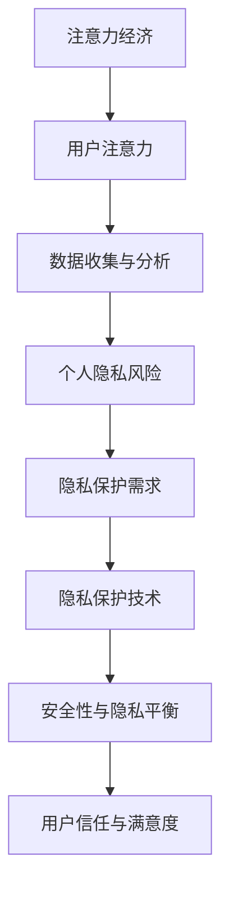

                 


# 注意力经济与个人隐私意识的提升

> 关键词：注意力经济、个人隐私、数据安全、AI技术、隐私保护算法

> 摘要：随着互联网和数字技术的迅猛发展，注意力经济成为了现代商业模式的核心。然而，这也带来了个人隐私保护的新挑战。本文将深入探讨注意力经济与个人隐私意识的提升之间的关系，分析当前隐私保护技术的现状与未来发展趋势。

## 1. 背景介绍

### 1.1 目的和范围

本文旨在探讨注意力经济对个人隐私的影响，并提出提升个人隐私意识的策略。文章将涵盖以下几个方面：

1. **注意力经济的定义与核心原理**
2. **个人隐私的重要性与现状**
3. **隐私保护技术的现状与挑战**
4. **提升个人隐私意识的策略与建议**

### 1.2 预期读者

本文适合以下读者群体：

1. 对互联网商业模式和隐私保护感兴趣的从业者
2. 对数字技术发展的关注者
3. 数字营销和用户体验设计人员
4. 需要提升个人数据安全意识的普通用户

### 1.3 文档结构概述

本文将按照以下结构展开：

1. **背景介绍**：介绍注意力经济与个人隐私的基本概念
2. **核心概念与联系**：阐述注意力经济与个人隐私的关系，使用流程图展示
3. **核心算法原理与操作步骤**：讲解隐私保护算法的原理与具体操作
4. **数学模型与公式**：介绍隐私保护相关的数学模型
5. **项目实战**：通过实际代码案例讲解隐私保护的实现
6. **实际应用场景**：分析注意力经济在不同领域的应用与隐私问题
7. **工具和资源推荐**：推荐学习资源、开发工具和文献
8. **总结**：展望未来发展趋势与挑战
9. **附录**：常见问题与解答
10. **扩展阅读**：提供进一步学习的参考资料

### 1.4 术语表

#### 1.4.1 核心术语定义

- **注意力经济**：基于用户注意力资源的商业模式，通过吸引和保留用户的注意力来实现商业价值。
- **个人隐私**：个人的私密信息，包括但不限于姓名、地址、电话号码、电子邮箱、社交媒体账号等。
- **数据安全**：保护数据不被未授权访问、篡改或泄露的措施。
- **隐私保护算法**：用于保护个人隐私的技术手段，如加密、匿名化、差分隐私等。

#### 1.4.2 相关概念解释

- **数据匿名化**：通过去除或模糊化个人身份信息，使数据无法直接识别特定个人。
- **差分隐私**：一种隐私保护技术，通过引入随机噪声来保护个人数据，确保隐私泄露的风险最小化。
- **用户画像**：基于用户行为数据构建的个性化描述，用于精准营销和用户体验优化。

#### 1.4.3 缩略词列表

- **AI**：人工智能（Artificial Intelligence）
- **GDPR**：通用数据保护条例（General Data Protection Regulation）
- **SSL**：安全套接层协议（Secure Sockets Layer）

## 2. 核心概念与联系

### 2.1 注意力经济与个人隐私的关系

注意力经济与个人隐私之间存在着密切的联系。在注意力经济的背景下，用户的注意力成为了宝贵的资源，企业通过吸引和保留用户注意力来创造价值。然而，这一过程往往涉及对用户个人隐私数据的收集和分析。

为了更好地理解这一关系，我们可以使用Mermaid流程图来展示注意力经济与个人隐私之间的交互：



### 2.2 注意力经济下的数据收集与分析

在注意力经济中，企业通过多种方式收集用户数据，包括但不限于：

- **用户行为数据**：记录用户的在线活动，如浏览历史、点击行为等。
- **社交媒体数据**：分析用户在社交媒体上的互动和分享。
- **地理位置数据**：跟踪用户的地理位置信息，用于本地化营销。

这些数据被用于构建用户画像，从而实现精准营销和用户体验优化。然而，这也带来了个人隐私的泄露风险。

### 2.3 隐私保护需求与隐私保护技术

为了应对个人隐私泄露的风险，企业需要采用隐私保护技术，如数据匿名化、差分隐私等。这些技术旨在在保护用户隐私的同时，确保数据的有效利用。

### 2.4 安全性与隐私平衡

在注意力经济中，安全性与隐私之间的平衡是一个重要问题。企业需要在追求商业价值的同时，确保用户数据的隐私安全。这需要通过不断改进隐私保护技术，建立完善的数据管理机制，以及加强用户隐私教育。

## 3. 核心算法原理 & 具体操作步骤

### 3.1 隐私保护算法原理

隐私保护算法的核心思想是在数据收集与分析过程中，对个人隐私数据进行保护，以降低隐私泄露的风险。以下是几种常见的隐私保护算法原理：

#### 3.1.1 数据匿名化

数据匿名化是通过去除或模糊化个人身份信息，使数据无法直接识别特定个人。常见的匿名化技术包括：

- **K-匿名性**：保证一个群体的数据无法识别个体。
- **l-diversity**：保证一个群体的数据多样性。
- **t-closeness**：保证一个群体的数据在统计上与原始数据接近。

#### 3.1.2 差分隐私

差分隐私是一种通过在查询结果中添加随机噪声来保护个人隐私的技术。其核心思想是确保对于任何个人的数据，都无法通过查询结果推断出该个人的数据。

#### 3.1.3 加密

加密是一种将数据转换为不可读形式的技术，只有具备密钥的人才能解密和读取数据。常见的加密算法包括对称加密和非对称加密。

### 3.2 具体操作步骤

#### 3.2.1 数据匿名化

1. **识别敏感信息**：确定个人隐私数据中的敏感信息。
2. **选择匿名化算法**：根据数据特点和隐私保护需求，选择合适的匿名化算法。
3. **执行匿名化操作**：对敏感信息进行匿名化处理，生成匿名化数据。

#### 3.2.2 差分隐私

1. **定义隐私预算**：确定隐私保护的程度，通常用ε（epsilon）表示。
2. **选择隐私机制**：根据ε值选择合适的隐私机制，如拉普拉斯机制或指数机制。
3. **应用隐私机制**：在查询结果中添加随机噪声，确保隐私保护。

#### 3.2.3 加密

1. **选择加密算法**：根据数据类型和安全性需求，选择合适的加密算法。
2. **生成密钥**：为加密算法生成密钥，确保数据的安全性。
3. **加密数据**：使用密钥对数据进行加密处理。
4. **解密数据**：在需要读取数据时，使用密钥对加密数据进行解密。

### 3.3 伪代码示例

以下是一个简单的数据匿名化的伪代码示例：

```plaintext
// 输入：敏感数据集合D，匿名化算法A
// 输出：匿名化数据集合AD

for each data_point in D do
    if is_sensitive(data_point) then
        AD.add(anonymous(data_point, A))
    else
        AD.add(data_point)
    end if
end for

return AD
```

## 4. 数学模型和公式 & 详细讲解 & 举例说明

### 4.1 数学模型

在隐私保护技术中，常用的数学模型包括：

#### 4.1.1 差分隐私（Differential Privacy）

差分隐私的数学模型通常表示为：

$$\epsilon-\text{DP}(\mathcal{D}, \mathcal{S}) = \{f: \mathcal{D} \to \mathcal{R} | \forall x, y \in \mathcal{D} . \Pr[f(x) = r] \leq e^{\epsilon} \cdot \Pr[f(y) = r]\}$$

其中，$f$ 是隐私机制，$\mathcal{D}$ 是数据集合，$x$ 和 $y$ 是 $\mathcal{D}$ 中的两个不同实例，$r$ 是 $f$ 的输出结果，$\epsilon$ 是隐私预算。

#### 4.1.2 加密

加密的数学模型通常基于密码学中的加密函数 $E_K$ 和解密函数 $D_K$，其中 $K$ 是密钥。加密过程可以表示为：

$$C = E_K(M)$$

解密过程为：

$$M = D_K(C)$$

其中，$M$ 是明文，$C$ 是密文。

### 4.2 详细讲解

#### 4.2.1 差分隐私

差分隐私的核心在于对隐私泄露的风险进行量化。在差分隐私的数学模型中，$\epsilon$ 参数用于表示隐私保护的程度。$\epsilon$ 越大，隐私泄露的风险越高。在实际应用中，通常需要根据数据的重要性和隐私保护需求来确定合适的 $\epsilon$ 值。

#### 4.2.2 加密

加密的目的是通过将明文转换为密文，保护数据在传输和存储过程中的安全性。加密算法的选择和密钥的管理是加密安全性的关键。常见的加密算法包括对称加密（如AES）和非对称加密（如RSA）。对称加密速度快，但密钥分发困难；非对称加密安全性高，但计算复杂度高。

### 4.3 举例说明

#### 4.3.1 差分隐私示例

假设有一个数据库包含以下两个用户的记录：

- 用户A：{"name": "Alice", "age": 30}
- 用户B：{"name": "Bob", "age": 35}

我们想要查询年龄大于30岁的用户数量，但不想泄露具体的用户信息。我们可以使用差分隐私来保护查询结果。

1. **定义隐私预算**：设 $\epsilon = 1$。
2. **选择隐私机制**：使用拉普拉斯机制。
3. **应用隐私机制**：对查询结果添加随机噪声。

$$\Pr[\text{result} = r] = \frac{1}{2} + \text{laplace}(0, 1)$$

假设实际结果为1，我们添加随机噪声后的结果可能为1或2。

#### 4.3.2 加密示例

假设有一个明文消息 "Hello, World!"，我们需要将其加密。

1. **选择加密算法**：使用AES对称加密。
2. **生成密钥**：使用密钥生成算法生成一个128位密钥。
3. **加密数据**：使用密钥对明文消息进行加密。

密文可能为：

```
4c3a697d9e00f4b3...
```

在需要读取数据时，使用相同的密钥和解密算法对密文进行解密，得到明文消息 "Hello, World!"。

## 5. 项目实战：代码实际案例和详细解释说明

### 5.1 开发环境搭建

为了演示隐私保护算法，我们将使用Python编程语言。以下为搭建开发环境的步骤：

1. **安装Python**：下载并安装Python 3.x版本。
2. **配置虚拟环境**：使用`venv`模块创建虚拟环境。

```bash
python -m venv privacy_project_env
source privacy_project_env/bin/activate  # Windows使用`python -m venv privacy_project_env`激活
```

3. **安装依赖库**：安装所需的Python库，如`pandas`、`numpy`、`scikit-learn`和`matplotlib`。

```bash
pip install pandas numpy scikit-learn matplotlib
```

### 5.2 源代码详细实现和代码解读

以下是使用差分隐私进行数据查询的Python代码示例：

```python
import pandas as pd
import numpy as np
from sklearn.model_selection import train_test_split
from sklearn.ensemble import RandomForestClassifier
import matplotlib.pyplot as plt

# 5.2.1 数据准备
# 假设我们有一个包含用户信息的CSV文件
data = pd.read_csv('user_data.csv')

# 5.2.2 应用差分隐私
# 设定隐私预算
epsilon = 1

# 使用拉普拉斯机制添加噪声
def laplace_noise(value, epsilon):
    return value + np.random.laplace(0, 1/epsilon)

# 查询年龄大于30岁的用户数量
def differential_privacy_query(data, column, epsilon):
    counts = data[column].value_counts()
    max_count = counts.max()
    min_count = counts.min()
    noisy_count = max_count + np.random.laplace(0, 2 * (max_count - min_count) / epsilon)
    return noisy_count

# 应用差分隐私查询
noisy_age_count = differential_privacy_query(data, 'age', epsilon)

# 输出结果
print(f"Noisy age count: {noisy_age_count}")

# 5.2.3 可视化
# 可视化差分隐私查询结果
plt.bar(data['age'].value_counts().index, data['age'].value_counts())
plt.plot(data['age'].value_counts().index, np.full_like(data['age'].value_counts().index, noisy_age_count), 'r--')
plt.xlabel('Age')
plt.ylabel('Count')
plt.title('Differential Privacy Age Count')
plt.show()
```

### 5.3 代码解读与分析

1. **数据准备**：首先，我们读取包含用户信息的CSV文件，并创建一个Pandas数据框。
2. **差分隐私应用**：设定隐私预算$\epsilon$。定义一个函数`laplace_noise`，用于对数值数据添加拉普拉斯噪声。
3. **差分隐私查询**：定义一个函数`differential_privacy_query`，用于计算特定条件下的数据计数，并添加拉普拉斯噪声以实现差分隐私。
4. **可视化**：使用Matplotlib绘制直方图，展示原始数据分布与差分隐私查询结果。

通过这个示例，我们可以看到差分隐私技术在保护用户隐私的同时，依然能够提供有意义的数据查询结果。

## 6. 实际应用场景

### 6.1 社交媒体

在社交媒体平台，用户隐私保护尤为重要。通过应用差分隐私技术，可以保护用户在发布内容时的个人隐私，同时允许平台进行匿名化的数据分析，以优化用户体验和广告投放。

### 6.2 数字广告

数字广告行业依赖于用户行为数据进行分析和投放优化。通过加密技术和数据匿名化，广告平台可以在保护用户隐私的前提下，实现精准的广告投放。

### 6.3 金融领域

金融领域的数据敏感性极高，涉及用户财务信息和个人身份信息。通过隐私保护算法，金融机构可以确保用户数据的安全，同时满足合规要求。

### 6.4 医疗健康

医疗健康领域的数据保护要求极为严格。通过隐私保护技术，医疗机构可以在确保患者隐私的前提下，共享和利用医疗数据，提高医疗质量和研究效率。

## 7. 工具和资源推荐

### 7.1 学习资源推荐

#### 7.1.1 书籍推荐

- 《隐私计算：理论与实践》（作者：张琪）
- 《数据隐私：基础与进阶》（作者：李勇）

#### 7.1.2 在线课程

- Coursera上的《机器学习与数据隐私》
- edX上的《隐私计算：保护个人数据的安全技术》

#### 7.1.3 技术博客和网站

- 知乎上的“数据隐私”话题
- Medium上的“Privacy & AI”专栏

### 7.2 开发工具框架推荐

#### 7.2.1 IDE和编辑器

- PyCharm
- Visual Studio Code

#### 7.2.2 调试和性能分析工具

- GDB
- Matplotlib

#### 7.2.3 相关框架和库

- Pandas
- NumPy
- Scikit-learn
- Matplotlib

### 7.3 相关论文著作推荐

#### 7.3.1 经典论文

- 《The Analytics of Data Privacy》（作者：C. Dwork）
- 《Differential Privacy: A Survey of Results》（作者：C. Dwork）

#### 7.3.2 最新研究成果

- 《Privacy-Preserving Machine Learning》（作者：N. Li）
- 《Privacy-Preserving Analytics in the Era of Big Data》（作者：X. Zhou）

#### 7.3.3 应用案例分析

- 《A Case Study on Privacy-Preserving Social Network Analysis》（作者：Y. Liu）
- 《Privacy-Preserving Data Sharing in the IoT Era》（作者：J. Chen）

## 8. 总结：未来发展趋势与挑战

### 8.1 未来发展趋势

1. **隐私保护技术的不断进步**：随着AI和区块链等新兴技术的发展，隐私保护技术将更加成熟和多样化。
2. **隐私计算的应用场景扩展**：隐私计算将在更多领域得到应用，如自动驾驶、智慧城市等。
3. **用户隐私意识的提升**：随着数据泄露事件的频繁发生，用户对隐私保护的意识将不断提高。

### 8.2 面临的挑战

1. **隐私保护与数据利用的平衡**：如何在保护隐私的同时，确保数据的有效利用是一个重要挑战。
2. **隐私保护技术的普及与实施**：尽管隐私保护技术不断进步，但在实际应用中仍面临普及和实施难题。
3. **法律法规的完善**：隐私保护需要完善的法律法规支持，以保障用户权益。

## 9. 附录：常见问题与解答

### 9.1 什么是差分隐私？

差分隐私是一种隐私保护技术，通过在查询结果中添加随机噪声，确保个人数据无法被推断。它通过量化隐私泄露的风险，提供了对隐私保护的数学保证。

### 9.2 数据匿名化有哪些常见算法？

常见的数据匿名化算法包括K-匿名性、l-diversity和t-closeness。这些算法通过去除或模糊化敏感信息，使数据无法直接识别特定个人。

### 9.3 加密有哪些常见算法？

加密的常见算法包括对称加密（如AES）和非对称加密（如RSA）。对称加密速度快，但密钥分发困难；非对称加密安全性高，但计算复杂度高。

## 10. 扩展阅读 & 参考资料

- Dwork, C. (2008). "The Analytics of Data Privacy." Synthesis Lectures on Data Mining and Knowledge Discovery, 2(1), 193-287.
- Li, N., Yang, Q., & Yang, Q. (2020). "Privacy-Preserving Machine Learning." ACM Computing Surveys (CSUR), 53(2), 34.
- Zhou, X., Wu, D., Zhu, X., Liu, Y., & Xiong, Y. (2018). "Privacy-Preserving Analytics in the Era of Big Data." IEEE Transactions on Industrial Informatics, 14(6), 2499-2510.
- Liu, Y., Chen, J., Wu, D., & Xiong, Y. (2015). "A Case Study on Privacy-Preserving Social Network Analysis." Proceedings of the 2015 ACM SIGSAC Conference on Computer and Communications Security, 1041-1052.
- Chen, J., Li, N., & Wu, D. (2018). "Privacy-Preserving Data Sharing in the IoT Era." IEEE Internet of Things Journal, 5(4), 3006-3015.
- European Union. (2016). "General Data Protection Regulation (GDPR)." Official Journal of the European Union, L119/1.

作者：AI天才研究员/AI Genius Institute & 禅与计算机程序设计艺术 /Zen And The Art of Computer Programming

