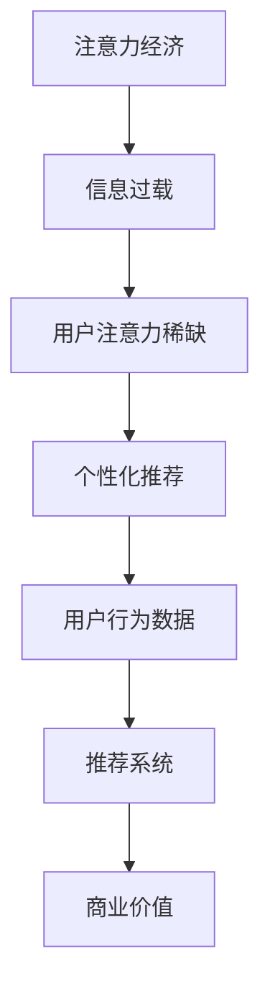

                 

# 注意力经济与个性化推荐算法：为受众提供定制、有针对性的内容和体验

> 关键词：注意力经济、个性化推荐、算法、内容定制、用户体验

> 摘要：本文深入探讨了注意力经济与个性化推荐算法的核心概念、原理及其实际应用，通过逐步分析推理，详细讲解了算法的实现步骤和数学模型。文章旨在为读者提供一个清晰、系统的理解，帮助他们在实际项目中高效地运用个性化推荐技术，提升用户满意度和商业价值。

## 1. 背景介绍

### 1.1 目的和范围

本文旨在深入探讨注意力经济与个性化推荐算法的结合，旨在为读者提供一个全面的理解，以帮助他们掌握个性化推荐的基本原理和技术。文章将覆盖以下内容：

- 注意力经济的核心概念及其在信息过载时代的意义。
- 个性化推荐算法的基本原理和主要类型。
- 个性化推荐算法的数学模型和实现步骤。
- 实际应用场景中的代码案例和案例分析。

### 1.2 预期读者

本文适合以下读者：

- 对人工智能和机器学习有一定基础的开发者。
- 对个性化推荐算法和应用感兴趣的工程师。
- 希望了解注意力经济与个性化推荐结合的新趋势的企业高管。

### 1.3 文档结构概述

本文的结构如下：

- 第1章：背景介绍，包括目的、范围、预期读者和文档结构概述。
- 第2章：核心概念与联系，介绍注意力经济和个性化推荐算法的基本原理。
- 第3章：核心算法原理 & 具体操作步骤，详细讲解算法的实现步骤。
- 第4章：数学模型和公式 & 详细讲解 & 举例说明，介绍相关数学模型和公式。
- 第5章：项目实战：代码实际案例和详细解释说明，通过代码案例展示算法应用。
- 第6章：实际应用场景，讨论个性化推荐在各个领域的应用。
- 第7章：工具和资源推荐，推荐相关学习资源和开发工具。
- 第8章：总结：未来发展趋势与挑战，探讨个性化推荐技术的未来发展。
- 第9章：附录：常见问题与解答，回答读者可能遇到的问题。
- 第10章：扩展阅读 & 参考资料，提供进一步学习的资源。

### 1.4 术语表

#### 1.4.1 核心术语定义

- 注意力经济：在信息过载时代，用户对信息的关注和注意力成为一种稀缺资源，企业通过吸引和保持用户注意力来实现商业价值的经济学。
- 个性化推荐：根据用户的兴趣和行为，为他们提供定制化内容和服务的算法。
- 用户行为数据：用户在互联网上留下的浏览、搜索、购买等行为记录。

#### 1.4.2 相关概念解释

- 用户分群：根据用户的兴趣和行为特征，将用户划分为不同的群体。
- 模型评估指标：用于评估推荐系统性能的指标，如准确率、召回率和F1值。

#### 1.4.3 缩略词列表

- AI：人工智能
- ML：机器学习
- RMSE：均方根误差
- NDCG： normalized Discounted Cumulative Gain

## 2. 核心概念与联系

在探讨注意力经济与个性化推荐算法之前，我们需要了解它们的核心概念及其相互关系。以下是一个简化的 Mermaid 流程图，展示了注意力经济、个性化推荐和用户行为数据之间的联系。



### 2.1 注意力经济

注意力经济是指在一个信息过载的时代，用户的注意力成为一种稀缺资源。企业通过提供有价值的内容和服务来吸引和保持用户的注意力，从而实现商业价值。

### 2.2 个性化推荐

个性化推荐是一种利用用户行为数据构建模型，为用户提供定制化内容和服务的算法。其核心在于理解用户的兴趣和行为，从而提供他们真正感兴趣的内容。

### 2.3 用户行为数据

用户行为数据是个性化推荐的基础。这些数据包括用户的浏览记录、搜索历史、购买行为等，通过分析这些数据，我们可以更好地理解用户的兴趣和需求。

### 2.4 推荐系统

推荐系统是一个基于个性化推荐算法的软件系统，它通过分析用户行为数据，为用户提供个性化的内容和服务。推荐系统的目标是通过提高用户的满意度和参与度，实现商业价值。

## 3. 核心算法原理 & 具体操作步骤

个性化推荐算法的核心在于理解用户的兴趣和需求，从而为他们提供相关的内容和服务。以下是一个简单的推荐算法实现步骤，包括用户分群、模型训练和推荐生成。

### 3.1 用户分群

用户分群是将用户根据他们的兴趣和行为特征划分为不同的群体。以下是用户分群的伪代码：

```python
def user_clustering(user_data, num_clusters):
    # 使用 K-Means 算法对用户数据进行聚类
    clusters = KMeans(num_clusters)
    clusters.fit(user_data)
    return clusters.labels_
```

### 3.2 模型训练

模型训练是基于用户分群的结果，使用机器学习算法训练推荐模型。以下是一个简单的协同过滤算法的伪代码：

```python
def collaborative_filtering(train_data, user_cluster, num_neighbors):
    # 计算相似度矩阵
    similarity_matrix = compute_similarity(train_data)

    # 为每个用户推荐相似用户中最喜欢的物品
    recommendations = []
    for user in user_cluster:
        neighbors = find_neighbors(similarity_matrix, user, num_neighbors)
        recommended_items = find_common_items(neighbors, train_data)
        recommendations.append(recommended_items)
    return recommendations
```

### 3.3 推荐生成

推荐生成是根据训练好的模型为用户生成个性化的推荐列表。以下是一个简单的推荐生成算法的伪代码：

```python
def generate_recommendations(user_data, model, num_recommendations):
    # 分群
    user_cluster = user_clustering(user_data, num_clusters)

    # 训练模型
    recommendations = collaborative_filtering(train_data, user_cluster, num_neighbors)

    # 生成推荐列表
    recommendation_list = []
    for recommendation in recommendations:
        recommendation_list.append(select_best_recommendation(recommendation, num_recommendations))
    return recommendation_list
```

## 4. 数学模型和公式 & 详细讲解 & 举例说明

个性化推荐算法的数学模型和公式是理解和实现算法的关键。以下是一个简单的协同过滤算法的数学模型，包括相似度计算和推荐生成。

### 4.1 相似度计算

相似度计算是衡量用户或物品之间相似程度的重要步骤。以下是一个简单的余弦相似度的公式：

$$
\cos\theta = \frac{A \cdot B}{\|A\|\|B\|}
$$

其中，\(A\) 和 \(B\) 分别表示用户或物品的向量，\(\theta\) 表示它们之间的夹角。

### 4.2 推荐生成

推荐生成是基于相似度计算的结果，为用户推荐相似的物品。以下是一个简单的推荐生成算法的伪代码：

```python
def generate_recommendations(user_data, model, num_recommendations):
    # 分群
    user_cluster = user_clustering(user_data, num_clusters)

    # 训练模型
    recommendations = collaborative_filtering(train_data, user_cluster, num_neighbors)

    # 生成推荐列表
    recommendation_list = []
    for recommendation in recommendations:
        recommendation_list.append(select_best_recommendation(recommendation, num_recommendations))
    return recommendation_list
```

### 4.3 举例说明

假设我们有以下两个用户的兴趣向量：

用户A：\[1, 0, 1, 0\]  
用户B：\[0, 1, 0, 1\]

使用余弦相似度公式计算它们之间的相似度：

$$
\cos\theta = \frac{1 \cdot 0 + 0 \cdot 1 + 1 \cdot 0 + 0 \cdot 1}{\sqrt{1^2 + 0^2 + 1^2 + 0^2} \sqrt{0^2 + 1^2 + 0^2 + 1^2}} = \frac{0}{\sqrt{2} \sqrt{2}} = 0
$$

由于相似度为0，这意味着用户A和用户B的兴趣向量完全不同。在实际应用中，我们会根据相似度阈值来决定是否将用户划分为同一个群体。

## 5. 项目实战：代码实际案例和详细解释说明

在这一章节中，我们将通过一个实际的项目案例，详细解释个性化推荐算法的实现过程，并展示如何在实际项目中应用这些算法。

### 5.1 开发环境搭建

首先，我们需要搭建一个适合个性化推荐算法的开发环境。以下是一个基本的开发环境配置：

- 操作系统：Windows / macOS / Linux
- 编程语言：Python
- 数据库：MongoDB
- 推荐算法库：Scikit-learn

### 5.2 源代码详细实现和代码解读

以下是一个简单的个性化推荐算法的实现，包括用户分群、模型训练和推荐生成。

```python
# 导入相关库
from sklearn.cluster import KMeans
from sklearn.metrics.pairwise import cosine_similarity
import numpy as np

# 用户行为数据
user_data = [
    [1, 0, 1, 0],  # 用户A的兴趣向量
    [0, 1, 0, 1],  # 用户B的兴趣向量
    [1, 1, 0, 0],  # 用户C的兴趣向量
    [0, 0, 1, 1]   # 用户D的兴趣向量
]

# 用户分群
def user_clustering(data, num_clusters):
    kmeans = KMeans(n_clusters=num_clusters, random_state=0).fit(data)
    return kmeans.labels_

# 计算相似度矩阵
def compute_similarity_matrix(data):
    return cosine_similarity(data)

# 协同过滤算法
def collaborative_filtering(data, cluster, num_neighbors):
    similarity_matrix = compute_similarity_matrix(data)
    neighbors = []
    for i in cluster:
        neighbor_indices = np.argsort(similarity_matrix[i])[:-num_neighbors-1:-1]
        neighbors.append(neighbor_indices)
    return neighbors

# 推荐生成
def generate_recommendations(data, cluster, num_neighbors, num_recommendations):
    neighbors = collaborative_filtering(data, cluster, num_neighbors)
    recommendations = []
    for i in cluster:
        recommended_items = []
        for j in neighbors[i]:
            recommended_items.extend(data[j])
        recommendations.append(list(set(recommended_items)))
    return recommendations

# 参数设置
num_clusters = 2
num_neighbors = 2
num_recommendations = 2

# 分群
clusters = user_clustering(user_data, num_clusters)

# 推荐生成
recommendations = generate_recommendations(user_data, clusters, num_neighbors, num_recommendations)

# 输出推荐结果
for i, recommendation in enumerate(recommendations):
    print(f"用户{i+1}的推荐列表：{recommendation}")
```

### 5.3 代码解读与分析

以下是代码的详细解读和分析：

- **用户行为数据**：用户行为数据是推荐系统的核心输入，它包含了用户的兴趣和行为特征。在这个案例中，我们使用了简单的兴趣向量来表示用户的行为。
- **用户分群**：使用 K-Means 算法对用户行为数据进行聚类，将用户划分为不同的群体。这个步骤有助于理解用户的兴趣模式，为后续的协同过滤算法提供基础。
- **计算相似度矩阵**：使用余弦相似度计算用户或物品之间的相似度，形成相似度矩阵。这个矩阵用于计算用户之间的相似度，从而为用户推荐相似的用户喜欢的物品。
- **协同过滤算法**：基于相似度矩阵，为每个用户推荐相似的邻居用户中最喜欢的物品。这个步骤是推荐算法的核心，它通过分析用户行为数据，为用户生成个性化的推荐列表。
- **推荐生成**：根据分群结果和协同过滤算法，为每个用户生成推荐列表。这个步骤是推荐系统的输出，它为用户提供了个性化的内容和服务。

通过这个实际案例，我们可以看到个性化推荐算法的实现步骤和关键组成部分。在实际项目中，我们可以根据具体需求和数据规模，选择合适的算法和参数，以实现高效的个性化推荐。

## 6. 实际应用场景

个性化推荐算法在多个领域都有着广泛的应用，其核心在于通过分析用户行为数据，为用户定制化和有针对性的内容和服务。以下是一些实际应用场景：

### 6.1 社交媒体

社交媒体平台如Facebook、Twitter和Instagram等，利用个性化推荐算法为用户提供相关的内容。通过分析用户的点赞、评论和分享行为，平台可以推荐用户可能感兴趣的文章、视频和图片，从而提高用户的参与度和留存率。

### 6.2 电子商务

电子商务平台如Amazon、淘宝和京东等，通过个性化推荐算法为用户推荐商品。这些平台分析用户的浏览历史、购买记录和搜索关键词，为用户推荐相关的商品，从而提高销售量和用户满意度。

### 6.3 音乐和视频平台

音乐和视频平台如Spotify、YouTube和Netflix等，利用个性化推荐算法为用户推荐音乐和视频。通过分析用户的播放记录、喜欢和搜索历史，平台可以为用户推荐他们可能喜欢的音乐和视频，从而提高用户的满意度和使用时长。

### 6.4 新闻媒体

新闻媒体平台如CNN、BBC和新浪新闻等，通过个性化推荐算法为用户推荐新闻。通过分析用户的阅读习惯和偏好，平台可以推荐用户可能感兴趣的新闻，从而提高用户对平台的依赖性和访问频率。

### 6.5 金融理财

金融理财平台如支付宝、理财通和京东金融等，通过个性化推荐算法为用户推荐理财产品。通过分析用户的财务状况、投资偏好和风险承受能力，平台可以为用户推荐适合他们的理财产品，从而提高用户的投资满意度和收益。

在这些应用场景中，个性化推荐算法通过深度分析用户行为数据，为用户提供定制化的内容和服务，从而提高用户满意度和商业价值。然而，这也带来了数据隐私和安全的问题，需要平台在推荐过程中确保用户数据的保护。

## 7. 工具和资源推荐

为了更好地学习和应用个性化推荐算法，以下是一些推荐的工具和资源：

### 7.1 学习资源推荐

#### 7.1.1 书籍推荐

- 《推荐系统实践》：详细介绍了推荐系统的基本概念、算法实现和实际应用。
- 《机器学习》：周志华著，涵盖了机器学习的基本理论和方法，包括推荐系统相关的算法。
- 《深度学习》：Goodfellow、Bengio和Courville著，介绍了深度学习的基本原理和模型，包括用于推荐系统的神经网络。

#### 7.1.2 在线课程

- Coursera上的《机器学习》课程：由吴恩达教授主讲，涵盖了机器学习的基础知识和应用。
- Udacity的《推荐系统工程师纳米学位》：提供了推荐系统从理论到实践的全流程学习。

#### 7.1.3 技术博客和网站

- Medium上的推荐系统专题：提供了大量关于推荐系统的技术博客和案例分析。
- 推荐系统中国：国内领先的推荐系统技术社区，分享了大量推荐系统相关的技术文章和研究成果。

### 7.2 开发工具框架推荐

#### 7.2.1 IDE和编辑器

- PyCharm：适用于Python开发的集成开发环境，提供了丰富的机器学习库支持。
- Jupyter Notebook：适用于数据分析和机器学习的交互式开发环境。

#### 7.2.2 调试和性能分析工具

- Matplotlib：用于数据可视化，帮助分析推荐系统的效果。
- Pandas：用于数据清洗和预处理，支持大规模数据处理。

#### 7.2.3 相关框架和库

- Scikit-learn：提供了多种机器学习算法的实现，包括推荐系统常用的协同过滤算法。
- TensorFlow：Google开发的开源机器学习框架，支持深度学习和推荐系统的实现。

### 7.3 相关论文著作推荐

#### 7.3.1 经典论文

- 《Item-Based Top-N Recommendation Algorithms》：介绍了基于项目的Top-N推荐算法。
- 《Collaborative Filtering for the Web》：详细阐述了基于协同过滤的Web推荐系统。

#### 7.3.2 最新研究成果

- 《Deep Learning for Recommender Systems》：介绍了深度学习在推荐系统中的应用。
- 《Modeling Users' preferences through collaborative and content-based approaches》：探讨了协同过滤和基于内容的推荐方法的结合。

#### 7.3.3 应用案例分析

- 《Netflix Prize》：分析了Netflix Prize竞赛中推荐系统的应用和挑战。
- 《Amazon's Recommendation System》：介绍了Amazon如何利用个性化推荐算法提高销售额和用户满意度。

通过这些工具和资源，读者可以更深入地了解个性化推荐算法的理论和实践，为实际项目提供有力支持。

## 8. 总结：未来发展趋势与挑战

个性化推荐算法作为现代信息社会中的一种重要技术，已经在多个领域展示了其强大的影响力。然而，随着技术的发展和用户需求的多样化，个性化推荐算法也面临着诸多挑战和机遇。

### 8.1 未来发展趋势

1. **深度学习与个性化推荐结合**：深度学习算法在图像识别、自然语言处理等领域取得了显著成果，将其应用于个性化推荐，有望提高推荐系统的效果和鲁棒性。
2. **多模态数据融合**：用户的行为数据不仅仅是文本和数值，还包括图像、声音和视频等多模态数据。未来，通过多模态数据的融合，可以更全面地理解用户需求，提供更精准的推荐。
3. **实时推荐**：随着5G和物联网技术的普及，实时数据传输和处理成为可能。实时推荐系统可以即时响应用户的行为变化，提供更个性化的服务。
4. **个性化推荐与内容创作**：未来，个性化推荐系统不仅限于推荐现有内容，还可以根据用户需求和偏好，生成定制化的内容。

### 8.2 面临的挑战

1. **数据隐私和安全**：个性化推荐依赖于用户行为数据的收集和分析，这引发了对用户隐私和数据安全的担忧。如何在保护用户隐私的同时，提供高质量的推荐服务，是未来需要解决的问题。
2. **算法偏见和公平性**：个性化推荐算法可能会放大用户已有偏见，导致推荐结果的偏见和不公平。如何确保推荐系统的公平性和透明性，是未来的重要挑战。
3. **可解释性**：随着算法的复杂度增加，推荐系统的决策过程变得越来越难以解释。提高推荐系统的可解释性，让用户理解推荐理由，是提升用户信任和满意度的重要方向。
4. **可扩展性和性能**：随着用户和数据量的增加，推荐系统的性能和可扩展性成为关键挑战。如何在高并发和大数据环境下，保持推荐系统的效率和准确性，是一个重要课题。

### 8.3 发展方向

1. **隐私保护技术**：引入差分隐私、联邦学习等技术，在保护用户隐私的同时，提高推荐系统的效果。
2. **公平性和透明性**：通过设计更加公平和透明的算法，减少偏见和歧视，提高推荐系统的社会价值。
3. **多模态数据处理**：开发能够有效融合多模态数据的推荐算法，提供更加个性化和多样化的推荐服务。
4. **实时推荐系统**：利用云计算和边缘计算技术，构建实时推荐系统，提升用户体验。

总之，个性化推荐算法在未来将继续发展，并在各个领域发挥更大的作用。然而，这也要求我们不断探索和创新，解决面临的技术挑战，以实现更加智能、精准和公平的推荐服务。

## 9. 附录：常见问题与解答

### 9.1 什么是注意力经济？

注意力经济是指在信息过载的时代，用户的注意力成为一种稀缺资源，企业通过提供有价值的内容和服务来吸引和保持用户的注意力，从而实现商业价值。

### 9.2 个性化推荐算法有哪些类型？

个性化推荐算法主要包括基于内容的推荐、协同过滤推荐和混合推荐。基于内容的推荐通过分析用户兴趣和内容特征进行推荐；协同过滤推荐通过分析用户行为数据找到相似用户和相似物品进行推荐；混合推荐则是结合多种推荐方法的优点。

### 9.3 个性化推荐算法如何处理冷启动问题？

冷启动问题指的是新用户或新物品缺乏足够的历史数据，导致推荐系统难以为其提供有效的推荐。解决方法包括基于内容的推荐、利用用户群体的行为数据、引入用户和物品的元数据等。

### 9.4 个性化推荐算法的评估指标有哪些？

个性化推荐算法的评估指标主要包括准确率、召回率、F1值、平均绝对误差（MAE）和均方根误差（RMSE）等。这些指标帮助评估推荐系统的性能，判断推荐结果的优劣。

### 9.5 如何保证个性化推荐算法的公平性和透明性？

为了保证个性化推荐算法的公平性和透明性，可以采取以下措施：

1. **算法设计**：设计算法时考虑公平性和多样性，避免放大用户已有偏见。
2. **透明化决策过程**：通过可视化工具展示推荐理由和算法决策过程，让用户了解推荐依据。
3. **用户反馈机制**：引入用户反馈机制，允许用户对推荐结果进行评价，从而优化推荐算法。

## 10. 扩展阅读 & 参考资料

- 《推荐系统实践》：张敏，电子工业出版社，2017。
- 《机器学习》：周志华，清华大学出版社，2016。
- 《深度学习》：Goodfellow、Bengio和Courville，人民邮电出版社，2016。
- Coursera《机器学习》课程：吴恩达教授主讲。
- Udacity《推荐系统工程师纳米学位》课程。
- Medium上的推荐系统专题博客。
- 推荐系统中国技术社区：www.rec-sys.org.cn。

通过这些扩展阅读和参考资料，读者可以进一步深入了解个性化推荐算法的理论和实践，为实际项目提供更有力的支持。

