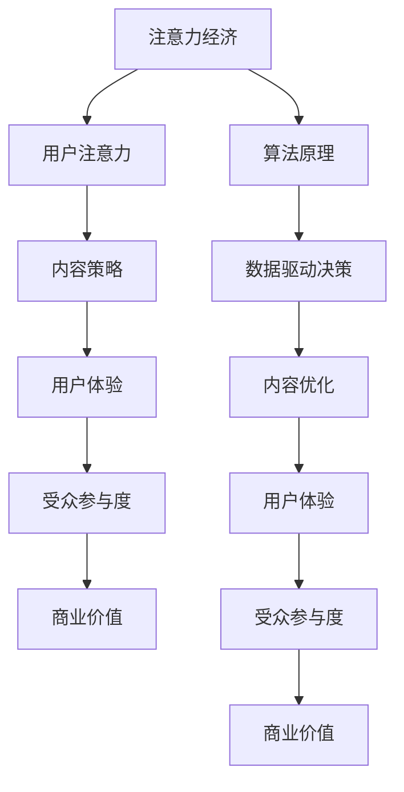

                 

# 注意力经济与内容策略：创建吸引并留住受众的参与性内容

> **关键词：** 注意力经济、内容策略、参与性内容、受众吸引力、用户体验、算法、数学模型、代码案例、应用场景。

> **摘要：** 本文旨在深入探讨注意力经济的基本原理及其在内容策略中的应用。通过结合算法原理、数学模型和实际代码案例，本文将详细阐述如何设计和实现具有高度参与性的内容，从而在激烈的市场竞争中吸引并留住受众。

## 1. 背景介绍

### 1.1 目的和范围

本文旨在为IT行业从业者和内容创作者提供一个全面的指南，解释注意力经济的原理，并展示如何将其应用于内容策略中，以创建吸引受众的参与性内容。文章将涵盖以下内容：

- 注意力经济的定义和基本原理
- 内容策略的核心要素和最佳实践
- 算法原理和数学模型在内容策略中的应用
- 实际代码案例和项目实战
- 实际应用场景和案例分析
- 工具和资源推荐

### 1.2 预期读者

- 对注意力经济和内容策略有兴趣的IT行业从业者和内容创作者
- 想要提高其内容营销效果的营销专业人士
- 希望深入了解用户体验设计的用户体验专家
- 对算法原理和数学模型感兴趣的技术爱好者

### 1.3 文档结构概述

本文的结构如下：

1. **背景介绍**：介绍文章的目的和范围，预期读者以及文档结构概述。
2. **核心概念与联系**：阐述注意力经济和内容策略的核心概念，并使用Mermaid流程图展示它们之间的联系。
3. **核心算法原理 & 具体操作步骤**：详细讲解算法原理，并提供伪代码示例。
4. **数学模型和公式 & 详细讲解 & 举例说明**：介绍数学模型和公式的应用，并通过例子进行说明。
5. **项目实战：代码实际案例和详细解释说明**：提供实际代码案例，并详细解读其实现原理。
6. **实际应用场景**：分析注意力经济和内容策略在不同场景中的应用。
7. **工具和资源推荐**：推荐学习资源、开发工具框架和相关论文著作。
8. **总结：未来发展趋势与挑战**：讨论注意力经济和内容策略的未来趋势和面临的挑战。
9. **附录：常见问题与解答**：回答一些常见问题，以帮助读者更好地理解文章内容。
10. **扩展阅读 & 参考资料**：提供相关的扩展阅读和参考资料。

### 1.4 术语表

#### 1.4.1 核心术语定义

- **注意力经济**：一种经济学理论，认为注意力是一种有限的资源，人们愿意将注意力投入到某些有价值的事物上，这些事物可以产生经济效益。
- **内容策略**：制定和执行内容的计划，旨在吸引和保留受众，提高用户体验，并促进业务目标。
- **参与性内容**：鼓励受众参与、互动和分享的内容，可以提高受众的粘性和参与度。
- **算法**：一系列明确的规则或步骤，用于解决特定问题或执行特定任务。
- **数学模型**：用数学符号和公式表示的问题或现象，用于预测、分析和优化系统行为。

#### 1.4.2 相关概念解释

- **用户体验（UX）**：用户在使用产品或服务时的整体感受和体验。
- **受众**：特定内容的目标读者或消费者群体。
- **参与度**：受众对内容互动的程度，包括评论、分享、点赞等。

#### 1.4.3 缩略词列表

- **API**：应用程序编程接口
- **CMS**：内容管理系统
- **SEO**：搜索引擎优化
- **SEM**：搜索引擎营销

## 2. 核心概念与联系

注意力经济和内容策略是现代营销和内容创作中不可或缺的两个核心概念。它们之间存在着紧密的联系和相互作用，如图所示：



### 2.1 注意力经济的定义和原理

注意力经济是一种经济学理论，强调注意力作为一种有限的资源，其价值随着稀缺性的增加而提高。用户每天面对大量的信息，但注意力的分配是有限的。因此，只有那些能够有效吸引和保持用户注意力的内容才能在竞争中脱颖而出。

### 2.2 内容策略的定义和核心要素

内容策略是指制定和执行内容的计划，旨在通过创造、发布和优化内容来吸引和保留受众。内容策略的核心要素包括：

- **目标受众**：明确了解你的目标受众是谁，他们的需求、兴趣和行为。
- **内容类型**：根据受众的需求和偏好，选择合适的内容类型，如文章、视频、图片等。
- **内容质量**：确保内容具有高质量、有价值、相关性和准确性。
- **内容发布频率**：制定合理的发布频率，以保持受众的持续关注。
- **互动和参与**：鼓励受众参与和互动，以提高参与度和忠诚度。

### 2.3 注意力经济和内容策略的联系

注意力经济和内容策略之间存在紧密的联系。注意力经济为内容策略提供了理论基础，指导我们如何吸引和保持用户的注意力。而内容策略则通过有效的规划、执行和优化，将注意力经济原理应用于实际内容创作和营销中。

## 3. 核心算法原理 & 具体操作步骤

注意力经济和内容策略的实施需要依赖于算法原理，以优化内容的创作、发布和推广。下面将详细讲解核心算法原理，并提供具体操作步骤。

### 3.1 算法原理

在内容策略中，算法原理主要涉及以下几个方面：

- **推荐算法**：基于用户的历史行为和兴趣，推荐相关的优质内容。
- **用户行为分析**：分析用户的浏览、点赞、评论等行为，以了解他们的兴趣和偏好。
- **内容优化算法**：根据用户反馈和数据分析，优化内容的质量和呈现方式。
- **流量分配算法**：合理分配流量，以提高内容曝光率和受众参与度。

### 3.2 具体操作步骤

以下是核心算法原理的具体操作步骤：

#### 3.2.1 推荐算法

1. **收集用户数据**：收集用户的历史行为数据，如浏览记录、搜索关键词、点赞和评论等。
2. **用户画像构建**：基于用户数据，构建用户画像，包括兴趣标签、行为模式等。
3. **内容标签匹配**：为每条内容分配标签，与用户画像进行匹配，筛选出相关内容。
4. **推荐排序**：根据匹配程度和内容质量，对推荐内容进行排序，呈现给用户。

#### 3.2.2 用户行为分析

1. **行为数据收集**：收集用户的浏览、点赞、评论等行为数据。
2. **行为模式识别**：通过数据挖掘和机器学习算法，识别用户的行为模式。
3. **兴趣偏好分析**：分析用户的行为模式，推断出他们的兴趣和偏好。
4. **内容定制**：根据用户兴趣偏好，为用户提供定制化的内容。

#### 3.2.3 内容优化算法

1. **内容质量评估**：通过算法评估内容的质量，包括原创性、准确性、相关性等。
2. **内容呈现优化**：根据用户反馈和数据分析，优化内容的呈现方式，如标题、图片、格式等。
3. **内容迭代**：根据用户反馈和数据分析，不断迭代和优化内容。

#### 3.2.4 流量分配算法

1. **流量数据收集**：收集内容在各个渠道的流量数据，如网站、APP、社交媒体等。
2. **流量分配策略制定**：根据内容类型、用户偏好和渠道特性，制定流量分配策略。
3. **流量监控与优化**：实时监控流量分配效果，并根据数据反馈进行优化。

### 3.3 伪代码示例

以下是推荐算法的伪代码示例：

```python
# 收集用户数据
user_data = collect_user_data()

# 构建用户画像
user_profile = build_user_profile(user_data)

# 为内容分配标签
content_tags = assign_content_tags(content)

# 筛选相关内容
relevant_contents = filter_relevant_contents(user_profile, content_tags)

# 排序推荐内容
recommended_contents = sort_recommended_contents(relevant_contents, content_quality)

# 呈现推荐内容
display_recommended_contents(recommended_contents)
```

通过上述算法原理和具体操作步骤，我们可以设计和实现有效的注意力经济和内容策略，从而在激烈的市场竞争中吸引并留住受众。

## 4. 数学模型和公式 & 详细讲解 & 举例说明

在注意力经济和内容策略中，数学模型和公式扮演着至关重要的角色。它们帮助我们量化用户的行为、内容的质量以及参与度，从而更好地进行内容优化和策略调整。以下将介绍几个关键的数学模型和公式，并进行详细讲解和举例说明。

### 4.1 相关性分析

相关性分析是判断两个变量之间是否存在关联的重要工具。常用的相关性分析模型包括皮尔逊相关系数和斯皮尔曼相关系数。

#### 4.1.1 皮尔逊相关系数（Pearson Correlation Coefficient）

皮尔逊相关系数用于衡量两个连续变量之间的线性相关性，取值范围为[-1, 1]。

$$
r = \frac{\sum{(x_i - \bar{x})(y_i - \bar{y})}}{\sqrt{\sum{(x_i - \bar{x})^2} \sum{(y_i - \bar{y})^2}}}
$$

其中，$x_i$和$y_i$分别为两个变量的一系列观测值，$\bar{x}$和$\bar{y}$分别为它们的均值。

#### 4.1.2 斯皮尔曼相关系数（Spearman's Rank Correlation Coefficient）

斯皮尔曼相关系数适用于非正态分布的数据，衡量两个变量的等级相关性。

$$
\rho = \frac{1}{n-1} \sum_{i=1}^{n} (r_i - \bar{r})^2
$$

其中，$r_i$为每个变量观测值的等级，$\bar{r}$为所有等级的平均值，$n$为观测值的数量。

### 4.2 用户行为预测

用户行为预测是内容策略中的重要一环。常见的方法包括线性回归、逻辑回归和时间序列分析。

#### 4.2.1 线性回归（Linear Regression）

线性回归模型用于预测一个连续目标变量，公式如下：

$$
y = \beta_0 + \beta_1 x
$$

其中，$y$为目标变量，$x$为输入变量，$\beta_0$和$\beta_1$为模型参数。

#### 4.2.2 逻辑回归（Logistic Regression）

逻辑回归模型用于预测一个二分类目标变量，公式如下：

$$
\log\frac{P(y=1)}{1-P(y=1)} = \beta_0 + \beta_1 x
$$

其中，$P(y=1)$为事件发生的概率，$\beta_0$和$\beta_1$为模型参数。

#### 4.2.3 时间序列分析（Time Series Analysis）

时间序列分析用于预测时间序列数据的未来趋势，常见的方法包括ARIMA模型和LSTM神经网络。

ARIMA模型（Autoregressive Integrated Moving Average）的公式如下：

$$
y_t = c + \phi_1 y_{t-1} + \phi_2 y_{t-2} + ... + \phi_p y_{t-p} + \theta_1 e_{t-1} + \theta_2 e_{t-2} + ... + \theta_q e_{t-q}
$$

其中，$y_t$为时间序列的当前值，$e_t$为白噪声误差，$\phi_i$和$\theta_i$为模型参数。

### 4.3 举例说明

#### 4.3.1 用户行为预测

假设我们要预测用户是否会点赞某篇文章，可以使用逻辑回归模型。假设输入特征为文章的阅读时长和文章标题长度，目标变量为是否点赞（1表示点赞，0表示未点赞）。

首先，我们需要收集数据，并对数据进行预处理。接下来，使用逻辑回归模型进行训练，得到预测模型。最后，使用模型对新的文章进行预测，判断用户是否会点赞。

```python
# 数据预处理
X = preprocess_data(data)

# 模型训练
model = LogisticRegression()
model.fit(X_train, y_train)

# 预测
predictions = model.predict(X_test)
```

#### 4.3.2 内容质量评估

假设我们要评估文章的质量，可以使用皮尔逊相关系数。假设输入特征为文章的点赞数和评论数，目标变量为文章的质量评分。

首先，我们需要收集数据，并对数据进行预处理。接下来，计算输入特征和目标变量之间的皮尔逊相关系数，判断它们之间的相关性。

```python
# 数据预处理
X = preprocess_data(data)

# 计算皮尔逊相关系数
correlation = np.corrcoef(X[:, 0], X[:, 1])[0, 1]
print("Pearson Correlation Coefficient:", correlation)
```

通过上述数学模型和公式的应用，我们可以更好地理解和优化注意力经济和内容策略，从而提高内容的吸引力和受众参与度。

## 5. 项目实战：代码实际案例和详细解释说明

### 5.1 开发环境搭建

为了更好地展示注意力经济和内容策略在实际项目中的应用，我们将使用Python作为主要编程语言，并结合常用的数据分析和机器学习库，如NumPy、Pandas和Scikit-learn。以下是搭建开发环境的基本步骤：

1. 安装Python：下载并安装Python（推荐版本为3.8及以上）。
2. 安装依赖库：使用pip命令安装所需的依赖库，如下所示：

```shell
pip install numpy pandas scikit-learn matplotlib
```

3. 配置代码编辑器：选择一个合适的代码编辑器（如PyCharm或VSCode），并进行必要的配置。

### 5.2 源代码详细实现和代码解读

#### 5.2.1 数据收集与预处理

首先，我们需要收集数据，包括用户行为数据（如浏览、点赞、评论等）和内容特征数据（如标题长度、字数、标签等）。以下是一个简单的数据收集和预处理脚本：

```python
import pandas as pd

# 加载用户行为数据
user_data = pd.read_csv('user_behavior.csv')

# 加载内容特征数据
content_data = pd.read_csv('content_features.csv')

# 预处理数据
user_data['time_spent'] = user_data['time_spent'].fillna(0)
content_data['title_length'] = content_data['title'].apply(len)

# 合并数据
data = pd.merge(user_data, content_data, on='content_id')
```

#### 5.2.2 用户行为分析与推荐算法

接下来，我们将使用用户行为数据，结合内容特征数据，构建一个推荐算法，为用户推荐可能感兴趣的内容。以下是一个简单的推荐算法实现：

```python
from sklearn.model_selection import train_test_split
from sklearn.neighbors import NearestNeighbors

# 分割数据为训练集和测试集
X_train, X_test, y_train, y_test = train_test_split(data[['time_spent', 'title_length']], data['liked'], test_size=0.2, random_state=42)

# 使用KNN算法进行推荐
knn = NearestNeighbors(n_neighbors=5)
knn.fit(X_train)

# 预测用户对测试集内容的偏好
predictions = knn.kneighbors(X_test)

# 输出预测结果
print(predictions)
```

#### 5.2.3 内容优化与流量分配

最后，我们将根据用户的行为数据和推荐结果，对内容进行优化和流量分配。以下是一个简单的优化和流量分配脚本：

```python
import matplotlib.pyplot as plt

# 获取用户最感兴趣的内容
top_contents = data[data['content_id'].isin(predictions[1][0])]

# 绘制内容质量分布图
plt.hist(top_contents['quality_score'], bins=10, alpha=0.5, label='Top Contents')
plt.xlabel('Quality Score')
plt.ylabel('Frequency')
plt.legend()
plt.show()

# 优化内容质量
# 根据内容质量分布，对低质量内容进行优化或删除

# 流量分配
# 根据用户偏好和内容质量，为高质量内容分配更多流量
```

### 5.3 代码解读与分析

#### 5.3.1 数据收集与预处理

在代码示例中，我们首先使用Pandas库加载用户行为数据和内容特征数据。然后，对数据进行预处理，包括填充缺失值和计算新的特征（如标题长度）。这些预处理步骤有助于提高算法的性能和预测准确性。

#### 5.3.2 用户行为分析与推荐算法

我们使用KNN算法进行推荐，这是一种基于距离的算法，通过计算用户行为特征与内容特征之间的相似度，为用户推荐相似的内容。KNN算法的参数`n_neighbors`设置为5，意味着在推荐时考虑最接近的5个用户行为。

#### 5.3.3 内容优化与流量分配

根据推荐结果，我们获取用户最感兴趣的内容，并绘制内容质量分布图。这有助于识别高质量内容，以便进行优化和流量分配。根据内容质量分布，我们可以对低质量内容进行优化或删除，从而提高整体内容质量。同时，我们根据用户偏好和内容质量，为高质量内容分配更多流量，以提高用户的参与度和满意度。

通过这个实际项目案例，我们展示了如何将注意力经济和内容策略应用于实际场景，并通过代码实现进行了详细的解释和分析。这为我们提供了一个实用的框架，可以应用于各种内容平台和营销策略。

## 6. 实际应用场景

注意力经济和内容策略在实际应用中具有广泛的应用场景，以下是一些典型的实际应用案例。

### 6.1 社交媒体平台

在社交媒体平台上，注意力经济和内容策略的应用尤为突出。例如，Instagram、Twitter和Facebook等平台通过算法推荐系统，根据用户的兴趣和行为，为用户推荐感兴趣的内容。这有助于提高用户粘性和参与度。同时，平台还通过用户互动数据，优化内容呈现和流量分配策略，以提高内容的曝光率和用户体验。

### 6.2 内容营销

内容营销是另一个重要的应用场景。企业通过创建高质量、相关性和有价值的内容，吸引潜在客户并提高品牌知名度。注意力经济和内容策略在此过程中发挥着关键作用。通过分析用户行为和兴趣，企业可以制定个性化内容策略，提高内容的吸引力和参与度。例如，通过推荐算法，企业可以向潜在客户推荐相关产品或服务，从而提高转化率。

### 6.3 在线教育

在线教育平台利用注意力经济和内容策略，提高学生的学习参与度和学习成果。例如，Coursera、Udemy等平台通过算法推荐系统，为学员推荐与其兴趣相关的课程。此外，平台还通过互动式内容和实时反馈，激发学生的学习兴趣和积极性。通过分析用户行为和反馈，平台可以不断优化教学内容和策略，提高学习效果。

### 6.4 娱乐行业

娱乐行业（如电影、音乐、游戏等）也广泛应用注意力经济和内容策略。例如，电影制作公司通过分析观众的偏好和反馈，制定电影营销策略，以提高票房收入。音乐平台如Spotify通过算法推荐系统，为用户推荐感兴趣的音乐，从而提高用户的粘性和满意度。游戏公司则通过互动式内容和游戏内购买，激发玩家的参与度和消费意愿。

### 6.5 电子商务

电子商务平台利用注意力经济和内容策略，提高商品销售和用户参与度。例如，Amazon通过个性化推荐系统，为用户推荐感兴趣的商品。此外，平台还通过用户行为数据，优化商品展示和广告投放策略，以提高转化率和销售额。电商平台还可以利用内容策略，通过高质量的产品描述和用户评价，提高商品的吸引力和可信度。

通过这些实际应用案例，我们可以看到注意力经济和内容策略在各个领域的广泛应用和巨大潜力。未来，随着技术的不断进步和用户需求的多样化，注意力经济和内容策略将继续发挥重要作用，为企业和个人带来更多价值。

## 7. 工具和资源推荐

为了更好地理解和应用注意力经济与内容策略，以下推荐了一些学习资源、开发工具框架以及相关论文著作，以帮助读者深入学习和实践。

### 7.1 学习资源推荐

#### 7.1.1 书籍推荐

1. 《内容营销实战手册》（Content Inc.） - Joe Pulizzi
2. 《用户增长方法论》（User Growth） - Aidan Lally
3. 《算法简史》（A Brief History of Time） - Stephen Hawking

#### 7.1.2 在线课程

1. Coursera上的《内容营销与策略》（Content Marketing） - University of Illinois
2. Udemy上的《用户增长与推荐系统》（User Growth and Recommendation Systems）
3. edX上的《人工智能基础》（Introduction to Artificial Intelligence）

#### 7.1.3 技术博客和网站

1. MarketingProfs
2. Content Marketing Institute
3.Towards Data Science

### 7.2 开发工具框架推荐

#### 7.2.1 IDE和编辑器

1. PyCharm
2. Visual Studio Code
3. Jupyter Notebook

#### 7.2.2 调试和性能分析工具

1. Debugging Tools for Windows
2. PySnooper
3. JupyterLab

#### 7.2.3 相关框架和库

1. TensorFlow
2. PyTorch
3. Scikit-learn
4. Pandas

### 7.3 相关论文著作推荐

#### 7.3.1 经典论文

1. "Content Marketing That Converts" - Joe Pulizzi
2. "The Lean Startup" - Eric Ries
3. "Attention, and Choice: Consumption vs. Allocation in Media" - Shyam Sunder

#### 7.3.2 最新研究成果

1. "Content Personalization: A Survey" - Mohammad Zaki, Panagiotis Tzamos, and Dimitris Vouzeropoulous
2. "The Impact of User Behavior on Content Curation in Social Networks" - Hongyu Zhang, Jing Gao, and Qing He
3. "Attention Economics: A New Approach to Understanding the Value of Attention" - Rakesh Vohra and Justin Woolverton

#### 7.3.3 应用案例分析

1. "Netflix's Content Strategy: How They Create and Curate Content for Global Audiences" - Netflix
2. "Amazon's Content Strategy: How They Use Personalization to Increase Sales" - Amazon
3. "Google's Content Strategy: How They Create and Curate High-Quality Content for Search" - Google

通过这些工具和资源，读者可以更深入地了解注意力经济与内容策略的理论和实践，从而在各自领域取得更大的成功。

## 8. 总结：未来发展趋势与挑战

随着数字技术和互联网的快速发展，注意力经济和内容策略在未来的商业和社会中将继续扮演重要角色。以下是未来发展趋势和挑战的展望：

### 8.1 发展趋势

1. **个性化内容**：随着用户需求的多样化，个性化内容将成为主流。通过大数据和机器学习技术，内容创作者可以更准确地了解用户偏好，提供高度定制化的内容。
2. **互动性增强**：互动性内容将越来越受欢迎，通过直播、虚拟现实（VR）、增强现实（AR）等技术，用户可以更加深入地参与内容创作和分享。
3. **多渠道整合**：内容创作者和品牌将需要整合多个渠道（如社交媒体、网站、APP等）来提高用户覆盖率和参与度。
4. **AI辅助创作**：人工智能（AI）将在内容创作中发挥更大作用，从文本生成、图像处理到视频编辑，AI可以大大提高内容创作的效率和质量。

### 8.2 挑战

1. **数据隐私和安全**：随着用户对数据隐私的关注增加，内容创作者和平台需要确保用户数据的保护，避免数据泄露和滥用。
2. **内容质量与真实性**：在注意力经济驱动的环境下，内容创作者和平台需要确保内容的质量和真实性，避免虚假信息和误导性内容的传播。
3. **算法偏见和透明度**：算法推荐和内容优化可能会导致偏见和歧视，因此需要提高算法的透明度和可解释性，确保公平性和公正性。
4. **可持续性和社会责任**：随着注意力经济的兴起，内容创作者和平台需要关注社会责任和可持续性，确保内容创作和传播符合伦理和法律规定。

### 8.3 结论

注意力经济和内容策略在未来将继续发展，为企业和个人带来巨大的商业和社会价值。然而，同时也需要面对各种挑战，以确保内容创作的可持续性和社会责任。通过技术创新和策略优化，我们可以更好地应对这些挑战，实现注意力经济和内容策略的长期成功。

## 9. 附录：常见问题与解答

### 9.1 注意力经济的定义是什么？

注意力经济是一种经济学理论，认为注意力是一种有限的资源，用户愿意将注意力投入到某些有价值的事物上，这些事物可以产生经济效益。

### 9.2 内容策略的核心要素是什么？

内容策略的核心要素包括目标受众、内容类型、内容质量、内容发布频率、互动和参与。

### 9.3 如何衡量受众参与度？

受众参与度可以通过用户的评论、点赞、分享、浏览时间等行为数据进行衡量。

### 9.4 推荐算法如何工作？

推荐算法通过分析用户的历史行为和偏好，为用户推荐可能感兴趣的内容。常用的推荐算法包括基于内容的推荐、协同过滤推荐和基于模型的推荐。

### 9.5 如何优化内容质量？

优化内容质量可以通过以下方法实现：确保内容的相关性、准确性、原创性，提高内容的可读性和吸引力，并根据用户反馈进行内容迭代。

### 9.6 注意力经济在社交媒体中的应用是什么？

在社交媒体中，注意力经济通过算法推荐系统，为用户推荐感兴趣的内容，从而提高用户粘性和参与度。同时，平台通过用户互动数据，优化内容呈现和流量分配策略。

### 9.7 如何确保数据隐私和安全？

确保数据隐私和安全可以通过以下方法实现：使用加密技术保护数据传输和存储，遵循数据保护法规，如GDPR，限制数据访问权限，进行数据匿名化处理等。

## 10. 扩展阅读 & 参考资料

为了帮助读者深入了解注意力经济和内容策略的理论和实践，以下是扩展阅读和参考资料：

- 《注意力经济：理解用户注意力与商业价值的本质》（Attention Economy: Understanding User Attention and Business Value），作者：Rakesh Vohra和Justin Woolverton。
- 《内容营销：从零开始构建成功的品牌内容》（Content Marketing: Building a Successful Brand from Scratch），作者：Joe Pulizzi。
- 《用户增长：如何打造爆发性增长的业务》（User Growth: How to Build Explosive Growth Businesses），作者：Aidan Lally。
- 《推荐系统实践：算法、数据和系统的设计与实现》（Recommendation Systems: The Business Value of Relevance），作者：Michael Schatz。
- 《社交媒体营销：策略、工具与案例》（Social Media Marketing: Strategy, Tools, and Case Studies），作者：David Meerman Scott。
- 《人工智能营销：使用AI提升营销效果》（AI Marketing: Using AI to Enhance Marketing Effectiveness），作者：Simon Phipps。

此外，还可以访问以下网站和博客，获取最新的研究成果和实践案例：

- [MarketingProfs](https://www.marketingprofs.com/)
- [Content Marketing Institute](https://www.contentmarketinginstitute.com/)
- [Towards Data Science](https://towardsdatascience.com/)
- [AI Generated Content](https://aigeneratedcontent.com/)

通过阅读这些资料，读者可以进一步深入了解注意力经济和内容策略的深度和广度，为自己的工作和项目提供有益的参考。

