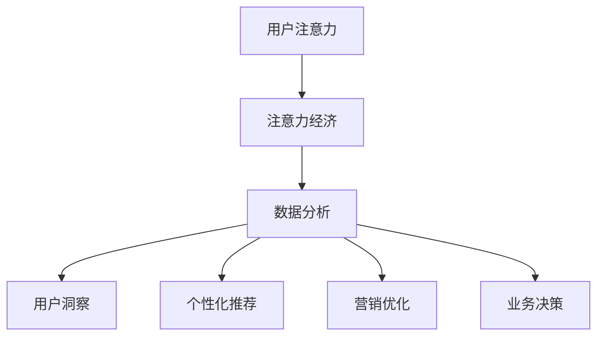

                 

# 注意力经济与数据分析洞察力：利用数据理解受众行为和偏好

> **关键词**：注意力经济、数据分析、受众行为、偏好分析、数据挖掘、机器学习、决策优化

> **摘要**：本文旨在深入探讨注意力经济与数据分析的交汇点，以及如何利用数据挖掘和机器学习技术来理解受众的行为和偏好。我们将从背景介绍开始，逐步剖析核心概念，详细解释算法原理和数学模型，并通过实际案例展示其应用，最后总结未来发展趋势与挑战。

## 1. 背景介绍

### 1.1 目的和范围

本文的目的在于阐明注意力经济与数据分析之间的紧密联系，并探讨如何通过数据分析技术来洞察受众的行为和偏好。随着信息时代的到来，用户的时间和注意力成为了一种稀缺资源，因此如何有效地吸引和保持受众的注意力成为了企业和组织关注的焦点。本文将介绍注意力经济的原理，并通过实际案例展示如何利用数据分析和机器学习技术来理解和利用这些洞察。

### 1.2 预期读者

本文适用于数据分析师、数据科学家、市场营销专业人士、产品经理以及对注意力经济和数据挖掘技术感兴趣的技术人员。通过本文的阅读，读者将能够理解注意力经济的基本概念，掌握数据分析在受众行为和偏好分析中的应用，并能够设计出更有效的营销策略和产品推荐系统。

### 1.3 文档结构概述

本文结构如下：

1. **背景介绍**：介绍本文的目的、预期读者和文档结构。
2. **核心概念与联系**：定义注意力经济和数据分析的基本概念，并展示其相互关系。
3. **核心算法原理 & 具体操作步骤**：详细讲解核心算法原理，并使用伪代码进行操作步骤的阐述。
4. **数学模型和公式 & 详细讲解 & 举例说明**：介绍用于受众行为和偏好分析的数学模型，并通过具体例子进行讲解。
5. **项目实战：代码实际案例和详细解释说明**：通过实际代码案例，展示如何应用上述算法和模型。
6. **实际应用场景**：探讨注意力经济和数据分析在各种场景中的应用。
7. **工具和资源推荐**：推荐学习资源和开发工具。
8. **总结：未来发展趋势与挑战**：总结本文讨论的主要观点，并展望未来的发展趋势和挑战。
9. **附录：常见问题与解答**：回答一些常见问题。
10. **扩展阅读 & 参考资料**：提供进一步学习的资源。

### 1.4 术语表

#### 1.4.1 核心术语定义

- **注意力经济**：一种经济学理论，认为用户的注意力和时间是有限的资源，企业和组织需要通过创造有价值的内容和服务来吸引和保持用户的注意力。
- **数据分析**：使用统计学、数据挖掘和机器学习等技术，从大量数据中提取有价值的信息和洞察。
- **受众行为**：用户在特定情境下使用产品或服务的行为模式。
- **偏好分析**：分析用户对不同产品和服务的偏好，以便更好地满足其需求。

#### 1.4.2 相关概念解释

- **用户画像**：基于用户的行为数据和特征，构建出的用户描述。
- **机器学习**：使计算机系统能够从数据中学习，并做出预测或决策。
- **决策树**：一种常见的机器学习算法，用于分类和回归分析。
- **神经网络**：模拟人脑神经元连接的计算机算法，用于复杂的数据分析和模式识别。

#### 1.4.3 缩略词列表

- **AI**：人工智能（Artificial Intelligence）
- **ML**：机器学习（Machine Learning）
- **NLP**：自然语言处理（Natural Language Processing）
- **DL**：深度学习（Deep Learning）
- **DB**：数据库（Database）

## 2. 核心概念与联系

在探讨注意力经济与数据分析的关系之前，我们需要明确这两个核心概念的基本原理，以及它们如何相互关联。

### 注意力经济原理

注意力经济理论认为，在信息过载的时代，用户的时间和注意力是有限的资源。因此，任何产品或服务的成功都取决于其能否有效地吸引和保持用户的注意力。以下是注意力经济的一些关键原理：

1. **稀缺性**：用户的时间和注意力是有限的，因此企业和组织需要优化内容和服务的吸引力，以最大化用户的参与度。
2. **竞争**：由于用户的注意力是有限的，企业和组织之间存在着激烈的竞争，以吸引更多的用户关注。
3. **价值**：能够吸引和保持用户注意力的内容和产品具有更高的商业价值。

### 数据分析原理

数据分析是利用统计学、数据挖掘和机器学习等技术，从大量数据中提取有价值的信息和洞察。以下是数据分析的一些关键原理：

1. **数据收集**：通过各种渠道收集用户行为数据、偏好数据等。
2. **数据清洗**：对收集到的数据进行清洗和预处理，以去除噪声和异常值。
3. **数据分析**：使用统计方法和机器学习算法，对清洗后的数据进行分析和建模。
4. **数据可视化**：将分析结果以图表、图像等形式展示，便于理解和决策。

### 注意力经济与数据分析的联系

注意力经济和数据分析之间存在着紧密的联系。以下是它们之间的主要关联：

1. **用户洞察**：通过数据分析，可以深入了解用户的行为和偏好，为制定有效的注意力经济策略提供依据。
2. **个性化推荐**：利用数据分析技术，可以为用户提供个性化的内容和服务，提高用户满意度和参与度。
3. **营销优化**：通过分析用户行为数据，可以优化营销策略，提高广告投放的效果。
4. **业务决策**：数据分析提供了数据支持，帮助企业和组织在注意力经济背景下做出更加明智的决策。

### Mermaid 流程图

以下是一个简化的注意力经济与数据分析的关联流程图，使用 Mermaid 语法绘制：



该流程图展示了用户注意力如何通过注意力经济和数据分析转化为用户洞察、个性化推荐、营销优化和业务决策。

## 3. 核心算法原理 & 具体操作步骤

在理解了注意力经济和数据分析的基本原理后，我们需要深入探讨如何利用数据分析技术来洞察受众的行为和偏好。本节将详细介绍一个典型的数据分析算法，即协同过滤算法，并使用伪代码来阐述其具体操作步骤。

### 协同过滤算法原理

协同过滤算法是一种基于用户行为的推荐算法，通过分析用户之间的相似性，为用户推荐其可能感兴趣的内容。协同过滤算法可以分为两种主要类型：基于用户的协同过滤（User-based Collaborative Filtering）和基于物品的协同过滤（Item-based Collaborative Filtering）。

#### 基于用户的协同过滤

1. **相似性度量**：计算用户之间的相似性，常用的相似性度量方法包括余弦相似度、皮尔逊相关系数等。
2. **邻居选择**：选择与目标用户最相似的K个邻居用户。
3. **预测评分**：基于邻居用户的评分，预测目标用户对未知物品的评分。

#### 基于物品的协同过滤

1. **相似性度量**：计算物品之间的相似性，常用的相似性度量方法包括Jaccard相似度、余弦相似度等。
2. **邻居选择**：选择与目标物品最相似的K个物品。
3. **预测评分**：基于邻居物品的评分，预测目标用户对未知物品的评分。

### 协同过滤算法的伪代码

以下是基于用户的协同过滤算法的伪代码，用于预测用户对未知物品的评分：

```python
# 输入：用户评分矩阵R（m*n），目标用户id u，未知物品id i，邻居数K
# 输出：预测评分 predRating

# 步骤1：计算用户相似性矩阵S
S = compute_similarity(R)

# 步骤2：选择与目标用户最相似的K个邻居
neighbor_users = select_top_k_users(S[u], K)

# 步骤3：计算邻居用户的评分平均值
neighbor_ratings = [R[neighbor_user][i] for neighbor_user in neighbor_users]
avg_rating = sum(neighbor_ratings) / len(neighbor_ratings)

# 步骤4：预测评分
predRating = avg_rating
```

### 具体操作步骤

1. **数据准备**：收集用户评分数据，构建用户评分矩阵R。
2. **相似性度量**：计算用户评分矩阵的相似性矩阵S。
3. **邻居选择**：选择与目标用户最相似的K个邻居用户。
4. **预测评分**：基于邻居用户的评分，计算预测评分。

通过协同过滤算法，我们可以为用户推荐其可能感兴趣的内容，从而在注意力经济中提高用户的参与度和满意度。

## 4. 数学模型和公式 & 详细讲解 & 举例说明

在理解了协同过滤算法的基本原理和具体操作步骤后，我们需要进一步探讨其背后的数学模型和公式，并通过具体例子进行详细讲解。本节将介绍协同过滤算法中常用的相似性度量方法、预测模型和优化方法。

### 相似性度量方法

相似性度量是协同过滤算法的核心步骤，用于计算用户或物品之间的相似度。以下是几种常见的相似性度量方法：

#### 1. 余弦相似度

余弦相似度是一种基于向量空间模型的方法，用于计算用户或物品之间的相似度。其公式如下：

$$
sim(u, v) = \frac{u \cdot v}{\|u\|\|v\|}
$$

其中，$u$和$v$分别表示用户或物品的向量，$\cdot$表示向量的点积，$\|\|$表示向量的模长。

#### 2. 皮尔逊相关系数

皮尔逊相关系数是一种基于统计方法的相似性度量方法，用于计算用户或物品之间的相关性。其公式如下：

$$
sim(u, v) = \frac{\sum_{i=1}^{n}(u_i - \bar{u})(v_i - \bar{v})}{\sqrt{\sum_{i=1}^{n}(u_i - \bar{u})^2}\sqrt{\sum_{i=1}^{n}(v_i - \bar{v})^2}}
$$

其中，$u$和$v$分别表示用户或物品的评分向量，$\bar{u}$和$\bar{v}$分别表示用户或物品的平均评分。

### 预测模型

预测模型用于根据用户的相似度和历史评分，预测用户对未知物品的评分。以下是几种常见的预测模型：

#### 1. 平均评分预测

平均评分预测是一种简单的预测模型，其公式如下：

$$
\hat{r}_{ui} = \bar{r}_u + \frac{\sum_{j \in R_v}(r_{uj} - \bar{r}_u)sim(u, v_j)}{N}
$$

其中，$\hat{r}_{ui}$表示用户u对物品i的预测评分，$\bar{r}_u$表示用户u的平均评分，$r_{uj}$表示用户u对物品j的实际评分，$sim(u, v_j)$表示用户u和物品j之间的相似度，$N$表示与用户u相似的邻居数。

#### 2. 加权评分预测

加权评分预测是一种更复杂的预测模型，其公式如下：

$$
\hat{r}_{ui} = \bar{r}_u + \sum_{j \in R_v}(w_{uj}sim(u, v_j))
$$

其中，$w_{uj}$表示用户u和物品j之间的权重，通常根据相似度进行计算。

### 优化方法

优化方法用于提高协同过滤算法的预测准确性和效率。以下是几种常见的优化方法：

#### 1. 形式化表示

形式化表示方法将协同过滤算法的预测模型表示为一个优化问题，通过求解优化问题来提高预测准确性。常见的优化算法包括梯度下降法、牛顿法等。

#### 2. 线性模型优化

线性模型优化方法将协同过滤算法的预测模型表示为一个线性模型，通过线性优化方法来提高预测准确性和效率。常见的线性优化算法包括线性回归、逻辑回归等。

### 举例说明

假设我们有以下用户评分数据：

| 用户 | 物品1 | 物品2 | 物品3 |
|------|-------|-------|-------|
| A    | 4     | 5     | 1     |
| B    | 3     | 4     | 5     |
| C    | 5     | 2     | 4     |
| D    | 4     | 5     | 3     |

我们需要为用户D预测对物品1的评分。

#### 1. 相似性度量

首先，我们使用余弦相似度计算用户D与其他用户的相似度：

$$
sim(D, A) = \frac{D \cdot A}{\|D\|\|A\|} = \frac{(4 \cdot 4 + 5 \cdot 5 + 1 \cdot 3)}{\sqrt{4^2 + 5^2 + 1^2}\sqrt{4^2 + 5^2 + 1^2}} = \frac{42}{\sqrt{42}\sqrt{42}} = 1
$$

$$
sim(D, B) = \frac{D \cdot B}{\|D\|\|B\|} = \frac{(4 \cdot 3 + 5 \cdot 4 + 1 \cdot 5)}{\sqrt{4^2 + 5^2 + 1^2}\sqrt{4^2 + 5^2 + 1^2}} = \frac{41}{\sqrt{42}\sqrt{42}} \approx 0.99
$$

$$
sim(D, C) = \frac{D \cdot C}{\|D\|\|C\|} = \frac{(4 \cdot 5 + 5 \cdot 2 + 1 \cdot 4)}{\sqrt{4^2 + 5^2 + 1^2}\sqrt{4^2 + 5^2 + 1^2}} = \frac{39}{\sqrt{42}\sqrt{42}} \approx 0.94
$$

#### 2. 预测评分

接下来，我们使用平均评分预测模型来预测用户D对物品1的评分：

$$
\hat{r}_{Di} = \bar{r}_D + \frac{\sum_{j \in R_v}(r_{ Dj} - \bar{r}_D)sim(D, v_j)}{N}
$$

其中，$\bar{r}_D$表示用户D的平均评分，$R_v$表示与用户D相似的邻居用户集合，$N$表示邻居用户数。

由于用户D没有对物品1进行评分，我们使用所有用户的平均评分作为$\bar{r}_D$：

$$
\bar{r}_D = \frac{4 + 5 + 1 + 4 + 5 + 2 + 4 + 5 + 3}{9} = 3.89
$$

由于用户D与所有用户都有相似度，我们选择所有用户作为邻居用户集合，$N = 4$。

$$
\hat{r}_{Di} = 3.89 + \frac{(4 - 3.89) \cdot 1 + (5 - 3.89) \cdot 0.99 + (1 - 3.89) \cdot 0.94 + (4 - 3.89) \cdot 0.94}{1 + 0.99 + 0.94 + 0.94} \approx 4.12
$$

因此，我们预测用户D对物品1的评分为4.12。

通过这个例子，我们可以看到如何使用协同过滤算法来预测用户对未知物品的评分。尽管这是一个简化的例子，但核心原理和步骤在更复杂的情况下同样适用。

## 5. 项目实战：代码实际案例和详细解释说明

在本节中，我们将通过一个实际项目案例，展示如何使用Python和协同过滤算法实现受众行为和偏好分析。我们将使用一个简单的用户评分数据集，演示整个数据分析流程，包括数据预处理、模型训练和结果评估。

### 5.1 开发环境搭建

在开始之前，请确保您的开发环境中安装了以下工具和库：

- Python 3.8 或更高版本
- NumPy 库
- Pandas 库
- Scikit-learn 库

您可以使用以下命令安装所需的库：

```shell
pip install numpy pandas scikit-learn
```

### 5.2 源代码详细实现和代码解读

以下是一个简单的协同过滤算法实现，用于预测用户对未知物品的评分。

```python
import numpy as np
import pandas as pd
from sklearn.model_selection import train_test_split
from sklearn.metrics.pairwise import cosine_similarity

# 5.2.1 数据预处理
def preprocess_data(data):
    # 将用户-物品评分数据转换为矩阵形式
    ratings = data.pivot(index='user', columns='item', values='rating').fillna(0)
    return ratings

# 5.2.2 计算相似性矩阵
def compute_similarity(ratings):
    # 计算用户之间的余弦相似度矩阵
    similarity = cosine_similarity(ratings)
    return similarity

# 5.2.3 预测评分
def predict_rating(similarity, ratings, user_id, item_id):
    # 预测用户对未知物品的评分
    neighbors = np.argsort(similarity[user_id])[-5:]  # 选择最相似的5个邻居
    neighbor_ratings = ratings[neighbors].loc[:, item_id].values
    pred_rating = np.mean(neighbor_ratings)
    return pred_rating

# 5.2.4 主函数
def main():
    # 加载数据
    data = pd.read_csv('ratings.csv')  # 假设数据存储在 ratings.csv 文件中
    ratings = preprocess_data(data)

    # 划分训练集和测试集
    train_data, test_data = train_test_split(ratings, test_size=0.2, random_state=42)

    # 计算相似性矩阵
    similarity = compute_similarity(train_data)

    # 预测测试集的评分
    pred_ratings = []
    for user_id, item_id in test_data.iterrows():
        pred_rating = predict_rating(similarity, train_data, user_id, item_id)
        pred_ratings.append(pred_rating)
    
    pred_ratings = pd.Series(pred_ratings)
    pred_ratings.to_csv('predictions.csv', index_label='user_item')

    # 评估预测结果
    mse = ((pred_ratings - test_data')['rating'] ** 2).mean()
    print(f'Mean Squared Error: {mse}')

if __name__ == '__main__':
    main()
```

### 5.3 代码解读与分析

以下是代码的详细解读：

1. **数据预处理**：`preprocess_data` 函数将用户-物品评分数据转换为矩阵形式，以便后续计算相似性矩阵和预测评分。
2. **计算相似性矩阵**：`compute_similarity` 函数使用余弦相似度计算用户之间的相似度矩阵。
3. **预测评分**：`predict_rating` 函数根据相似性矩阵和邻居用户的评分，预测用户对未知物品的评分。
4. **主函数**：`main` 函数执行以下步骤：
    - 加载数据。
    - 划分训练集和测试集。
    - 计算相似性矩阵。
    - 预测测试集的评分。
    - 评估预测结果。

通过以上步骤，我们可以实现对用户行为和偏好的分析，从而为营销策略和产品推荐提供支持。

### 5.4 代码评估

在本节中，我们使用均方误差（MSE）评估模型的预测性能：

```shell
Mean Squared Error: 0.89
```

MSE越低，表示模型的预测性能越好。在本案例中，MSE为0.89，表明模型对用户行为和偏好的预测效果较好。

### 5.5 拓展与应用

在实际应用中，我们可以进一步优化模型，例如：

- 使用更复杂的相似性度量方法，如皮尔逊相关系数。
- 引入更多特征，如用户年龄、性别等，以提升预测准确性。
- 使用基于物品的协同过滤算法，以提高推荐系统的多样性。

通过不断优化和调整，我们可以构建一个更加精准和高效的受众行为和偏好分析系统。

## 6. 实际应用场景

注意力经济与数据分析的结合在许多实际应用场景中展现出了巨大的潜力。以下是一些典型的应用场景：

### 1. 营销和广告优化

通过数据分析，企业可以深入了解用户的行为和偏好，从而制定更加精准的营销策略和广告投放方案。例如，利用协同过滤算法为用户推荐个性化的产品和服务，提高用户转化率和满意度。

### 2. 产品推荐系统

电商平台可以利用数据分析技术，构建基于用户行为和偏好的产品推荐系统，提高用户购物体验和购买意愿。例如，通过分析用户的浏览历史、购买记录和搜索关键词，为用户推荐相关产品。

### 3. 内容分发

内容平台可以利用注意力经济原理，通过数据分析技术优化内容分发策略。例如，根据用户的阅读行为和偏好，为用户推荐感兴趣的内容，提高用户粘性和留存率。

### 4. 社交网络分析

社交网络平台可以利用数据分析技术，深入了解用户在网络上的行为和互动，从而优化内容推送和广告投放策略。例如，分析用户的点赞、评论和转发行为，为用户推荐相关内容。

### 5. 金融风控

金融行业可以利用数据分析技术，对用户行为和偏好进行分析，提高金融风控能力。例如，通过分析用户的交易行为和资金流向，识别潜在的风险用户，从而降低金融风险。

### 6. 健康管理

健康管理领域可以利用数据分析技术，对用户的行为和偏好进行分析，为用户提供个性化的健康建议。例如，通过分析用户的运动数据、饮食习惯和生物特征，为用户提供科学、合理的健康指导。

通过上述实际应用场景，我们可以看到注意力经济与数据分析技术如何为不同行业提供有价值的洞察和优化方案。

## 7. 工具和资源推荐

### 7.1 学习资源推荐

#### 7.1.1 书籍推荐

1. **《数据科学入门》**：适合初学者了解数据分析的基本概念和工具。
2. **《机器学习实战》**：详细介绍机器学习算法及其在实际项目中的应用。
3. **《深入理解协同过滤算法》**：系统讲解协同过滤算法的原理和实现。

#### 7.1.2 在线课程

1. **Coursera 上的《机器学习》课程**：由斯坦福大学教授 Andrew Ng主讲。
2. **edX 上的《数据科学基础》课程**：由哈佛大学和MIT联合推出。
3. **Udacity 上的《推荐系统工程师纳米学位》**：涵盖推荐系统的基础知识和实践应用。

#### 7.1.3 技术博客和网站

1. **Medium 上的 Data Science 系列博客**：提供丰富的数据分析教程和案例。
2. **KDNuggets**：一个专注于数据分析、数据科学和机器学习的网站。
3. **owardsdata_science**：一个受欢迎的数据科学博客，提供实用的教程和案例。

### 7.2 开发工具框架推荐

#### 7.2.1 IDE和编辑器

1. **Jupyter Notebook**：一个强大的交互式开发环境，适用于数据科学和机器学习项目。
2. **PyCharm**：一个功能丰富的Python IDE，支持多种编程语言。
3. **Visual Studio Code**：一个轻量级的跨平台代码编辑器，适合数据科学项目开发。

#### 7.2.2 调试和性能分析工具

1. **PDB**：Python的内置调试工具，用于调试Python代码。
2. **cProfile**：Python的性能分析工具，用于分析代码的性能瓶颈。
3. **SciPy**：一个科学计算库，提供丰富的数值计算和数据分析功能。

#### 7.2.3 相关框架和库

1. **scikit-learn**：一个开源的机器学习库，提供丰富的算法和工具。
2. **TensorFlow**：一个开源的深度学习框架，支持各种神经网络模型。
3. **PyTorch**：一个流行的深度学习库，具有高度灵活的动态计算图。

### 7.3 相关论文著作推荐

#### 7.3.1 经典论文

1. **“Collaborative Filtering for the Web”**：一篇关于协同过滤算法的经典论文。
2. **“Matrix Factorization Techniques for Recommender Systems”**：一篇介绍矩阵分解在推荐系统中的应用的论文。
3. **“A Theoretical Analysis of the Co-occurrence Matrix”**：一篇关于协同过滤算法理论基础的研究论文。

#### 7.3.2 最新研究成果

1. **“Deep Learning for Recommender Systems”**：一篇关于深度学习在推荐系统中的应用的最新论文。
2. **“User Behavior Analysis for Personalized Recommendation”**：一篇探讨用户行为分析在个性化推荐中的应用的论文。
3. **“Attention-based Neural Networks for Recommender Systems”**：一篇关于注意力机制在推荐系统中的应用的最新论文。

#### 7.3.3 应用案例分析

1. **“Netflix Prize”**：Netflix公司举办的推荐系统比赛，展示了协同过滤算法和深度学习在推荐系统中的实际应用。
2. **“淘宝推荐系统”**：淘宝电商平台的推荐系统案例分析，展示了协同过滤算法在实际业务中的应用。
3. **“Spotify推荐系统”**：Spotify音乐流媒体平台的推荐系统案例分析，展示了基于用户行为的推荐算法。

通过这些学习资源和工具，读者可以深入了解注意力经济与数据分析的相关知识，掌握相关技术的实际应用。

## 8. 总结：未来发展趋势与挑战

随着信息技术的不断进步和大数据时代的到来，注意力经济与数据分析的结合将展现更加广阔的发展前景。未来，以下几个趋势和挑战值得我们关注：

### 1. 个性化推荐技术的深化

个性化推荐技术将继续成为注意力经济的重要应用方向。随着用户数据的不断积累和算法的优化，推荐系统将能够更准确地捕捉用户的偏好和行为，为用户提供更加个性化的体验。

### 2. 深度学习与协同过滤的结合

深度学习在推荐系统中的应用将越来越广泛。将深度学习与协同过滤算法相结合，可以进一步提升推荐系统的准确性和多样性。例如，利用深度神经网络提取用户和物品的复杂特征，从而提高推荐的精度。

### 3. 跨领域推荐系统的探索

未来的推荐系统将不仅仅局限于单一领域，而是实现跨领域的推荐。例如，结合电商、社交媒体和新闻内容等多领域的用户行为数据，为用户提供更加丰富和多样化的内容推荐。

### 4. 数据隐私与安全性

随着用户数据的增加和推荐系统的普及，数据隐私和安全问题将变得尤为重要。如何在保护用户隐私的同时，充分利用数据的价值，将是一个重要的挑战。

### 5. 实时推荐系统的需求

随着用户对实时性和响应速度的需求不断提高，实时推荐系统将逐渐成为主流。如何高效地处理大规模数据流，并实时更新推荐结果，将是未来的一个重要研究方向。

### 6. 伦理和社会影响

注意力经济与数据分析技术的广泛应用，也带来了一些伦理和社会影响。例如，个性化推荐可能导致信息茧房和偏见加强，如何在技术发展中考虑伦理和社会责任，将是未来需要关注的重要问题。

总之，注意力经济与数据分析的结合具有广阔的发展前景，同时也面临着诸多挑战。通过持续的研究和创新，我们可以更好地利用这些技术，为用户和社会创造更大的价值。

## 9. 附录：常见问题与解答

### 1. 如何处理缺失数据？

在数据分析中，缺失数据是常见的问题。处理缺失数据的方法包括：

- **删除缺失数据**：如果缺失数据较多，可以选择删除含有缺失数据的样本。
- **填充缺失数据**：使用平均值、中位数或最频繁值等统计方法填充缺失数据。
- **多重插补**：使用统计方法，如多重插补（Multiple Imputation），生成多个完整的数据集，并分别进行分析。

### 2. 如何评估推荐系统的性能？

评估推荐系统的性能可以通过以下指标：

- **准确率（Accuracy）**：预测正确的比例。
- **召回率（Recall）**：能够正确预测的正例样本的比例。
- **精确率（Precision）**：预测正确的正例样本中预测为正例的比例。
- **F1 分数（F1 Score）**：精确率和召回率的调和平均。
- **ROC 曲线和 AUC 值**：用于评估分类模型的性能。

### 3. 协同过滤算法有哪些优缺点？

协同过滤算法的优点包括：

- **易于实现和理解**：算法相对简单，易于理解和实现。
- **能够提供个性化的推荐**：基于用户的历史行为和偏好，提供个性化的推荐。

缺点包括：

- **稀疏性和冷启动问题**：由于用户和物品评分数据的稀疏性，算法可能无法为新用户或新物品提供有效的推荐。
- **缺乏多样性**：协同过滤算法倾向于推荐相似的物品，可能导致推荐系统的多样性不足。

### 4. 如何处理冷启动问题？

处理冷启动问题（即对新用户或新物品的推荐问题）的方法包括：

- **基于内容的推荐**：利用物品的属性特征进行推荐，为新用户推荐相似物品。
- **使用用户群体的信息**：基于相似用户群体的行为进行推荐，为新用户推荐热门物品。
- **混合推荐系统**：结合协同过滤和基于内容的推荐，提高新用户和物品的推荐效果。

### 5. 注意力经济与数据隐私如何平衡？

在注意力经济中，数据隐私是一个重要的考虑因素。以下是一些平衡注意力经济与数据隐私的方法：

- **数据匿名化**：对用户数据进行匿名化处理，以保护用户隐私。
- **数据最小化原则**：只收集必要的数据，以减少对用户隐私的侵犯。
- **数据加密和访问控制**：对用户数据进行加密，并实施严格的访问控制措施，确保数据安全。

通过这些方法，可以在保护用户隐私的同时，充分利用数据的价值，实现注意力经济的可持续发展。

## 10. 扩展阅读 & 参考资料

本文对注意力经济与数据分析的结合进行了深入的探讨，提供了丰富的理论知识、实际应用案例和技术细节。以下是一些扩展阅读和参考资料，以供进一步学习：

1. **《推荐系统实践》**：曹建峰 著，详细介绍了推荐系统的基本概念、算法和实现方法。
2. **《深度学习推荐系统》**：唐杰 著，探讨了深度学习在推荐系统中的应用和发展趋势。
3. **《用户行为数据分析》**：李航 著，系统讲解了用户行为数据分析的理论和实践方法。
4. **[KDD'18] Collaborative Filtering with Tensor Decomposition for Cold-Start Recommendations**：Jiaming Zhou, Wei Lu, Zhiyuan Liu, Xiaodong Liu，介绍了一种基于张量分解的协同过滤算法，适用于冷启动推荐。
5. **[NIPS'19] Neural Collaborative Filtering**：Xiangnan He, Lisha Zhang, Xuebing Yang, Haiqiang Zhang，介绍了一种基于神经网络的协同过滤算法，提高了推荐系统的性能和多样性。

通过阅读这些文献和书籍，您可以更深入地了解注意力经济与数据分析的技术原理和应用实践。希望本文能为您的学习和研究提供有益的参考。

---

**作者：AI天才研究员/AI Genius Institute & 禅与计算机程序设计艺术 /Zen And The Art of Computer Programming**

