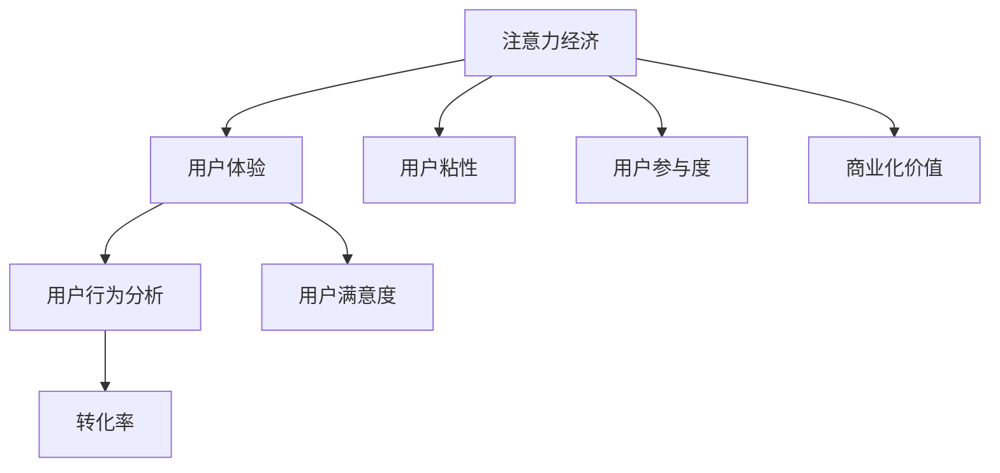

                 

# 注意力经济与用户体验优化策略：创建令人上瘾和引人入胜的产品

## 关键词
- 注意力经济
- 用户体验优化
- 引人入胜的产品
- 用户行为分析
- 数据驱动策略
- AI技术
- 可持续性

## 摘要
本文将探讨注意力经济在当今数字化时代的重要性，以及如何利用用户体验优化策略来创建令人上瘾和引人入胜的产品。通过深入分析用户行为、数据驱动策略和人工智能技术，我们将提供一系列实用步骤和案例分析，帮助读者理解和应用注意力经济原理，从而提升产品的吸引力和用户粘性。本文将覆盖从背景介绍到实际应用场景的各个方面，旨在为IT行业从业者提供有价值的指导和洞察。

---

## 1. 背景介绍

### 1.1 目的和范围

本文旨在探讨注意力经济在用户体验优化中的应用，以及如何利用相关策略和技术打造引人入胜的产品。注意力经济是一个新兴的领域，随着互联网和数字媒体的普及，它正逐渐成为企业和产品成功的关键因素。本文将讨论的核心内容包括：

- 注意力经济的概念和原理
- 用户行为分析的重要性
- 数据驱动策略在用户体验优化中的应用
- 人工智能技术在注意力经济中的角色
- 实际案例研究：成功和失败的注意力经济策略

### 1.2 预期读者

本文适合以下读者群体：

- IT行业从业者，特别是产品经理、用户体验设计师和开发人员
- 市场营销和数字营销专业人士
- 对注意力经济和用户体验优化有兴趣的学术研究者
- 对新兴技术和数字营销策略有好奇心的企业家

### 1.3 文档结构概述

本文将按照以下结构进行组织：

- **第1章：背景介绍** - 介绍本文的目的、范围和预期读者。
- **第2章：核心概念与联系** - 描述注意力经济、用户体验和用户行为分析的核心概念。
- **第3章：核心算法原理 & 具体操作步骤** - 讨论用于分析用户行为的算法原理和操作步骤。
- **第4章：数学模型和公式 & 详细讲解 & 举例说明** - 引入注意力经济的数学模型，并进行详细讲解和实例分析。
- **第5章：项目实战：代码实际案例和详细解释说明** - 提供一个实际代码案例，详细解释如何应用注意力经济原理。
- **第6章：实际应用场景** - 探讨注意力经济在不同领域的实际应用。
- **第7章：工具和资源推荐** - 推荐学习资源和开发工具。
- **第8章：总结：未来发展趋势与挑战** - 总结注意力经济和用户体验优化的发展趋势和面临的挑战。
- **第9章：附录：常见问题与解答** - 回答读者可能关心的问题。
- **第10章：扩展阅读 & 参考资料** - 提供进一步阅读的资源和参考资料。

### 1.4 术语表

#### 1.4.1 核心术语定义

- **注意力经济**：一种经济学理论，强调用户注意力的价值，尤其是在数字环境中。
- **用户体验**：用户在使用产品或服务过程中的感受和体验。
- **用户行为分析**：通过分析用户的行为数据，了解用户如何与产品或服务互动。
- **数据驱动策略**：基于数据分析来制定和优化产品和服务策略。
- **人工智能**：一种模拟人类智能的技术，能够执行复杂的任务和学习新技能。

#### 1.4.2 相关概念解释

- **用户粘性**：用户持续使用产品或服务的程度。
- **用户参与度**：用户在产品或服务中的活跃度和参与程度。
- **转化率**：用户完成特定目标（如购买或注册）的比例。

#### 1.4.3 缩略词列表

- **UX**：用户体验
- **AI**：人工智能
- **CRM**：客户关系管理
- **A/B测试**：对照测试，用于比较两种或多种策略的效果

## 2. 核心概念与联系

注意力经济是当前数字化环境中至关重要的概念。它关注的是用户注意力的获取和管理，这在高度竞争的市场环境中尤其重要。用户体验（UX）和用户行为分析是理解注意力经济的关键因素。为了更好地解释这些概念之间的联系，我们将使用Mermaid流程图来展示注意力经济、用户体验和用户行为分析的核心流程。



在这个流程图中，注意力经济直接影响用户体验和用户行为分析，从而影响用户粘性和参与度。用户行为分析又进一步影响转化率和用户满意度，这些因素最终决定了产品的商业化价值。

### 2.1 注意力经济的原理

注意力经济基于这样一个基本假设：在数字世界中，用户的时间和注意力是有限的资源，而这些资源的分配直接决定了产品的成功。以下是注意力经济的几个关键原理：

- **稀缺性**：用户的注意力是稀缺的，因此在竞争激烈的市场中，产品必须提供独特价值来吸引用户的注意力。
- **注意力转移**：用户可能会因为更好的替代品而转移注意力，因此持续优化用户体验是保持用户注意力的关键。
- **易逝性**：用户的注意力是易逝的，因此产品必须在短时间内提供吸引人的内容和体验。
- **商业化**：用户注意力的价值可以通过广告、订阅和其他商业模式来商业化。

### 2.2 用户体验

用户体验（UX）是指用户在使用产品或服务过程中的感受和体验。良好的用户体验能够提升用户满意度，增加用户粘性。以下是一些影响用户体验的关键因素：

- **易用性**：产品应该易于使用，降低学习成本。
- **美观性**：设计应该吸引人，提高视觉愉悦度。
- **功能性**：产品功能应该满足用户需求，提供实际价值。
- **响应性**：产品应该快速响应，提供流畅的用户体验。

### 2.3 用户行为分析

用户行为分析是通过收集和分析用户数据来了解用户如何与产品互动。以下是用户行为分析的关键步骤：

1. **数据收集**：通过日志、点击追踪和其他技术手段收集用户行为数据。
2. **数据清洗**：处理和整理原始数据，去除噪声和异常值。
3. **数据分析**：使用统计和机器学习技术分析用户行为数据，提取有用的信息。
4. **数据可视化**：通过图表和报告将数据分析结果可视化，帮助决策者理解用户行为。

用户行为分析能够帮助产品团队识别用户痛点和需求，从而优化产品设计和功能，提升用户体验。

### 2.4 用户粘性

用户粘性是指用户持续使用产品或服务的程度。高用户粘性通常意味着产品的成功和用户的忠诚。以下是提升用户粘性的几个策略：

- **个性化**：根据用户行为和偏好提供个性化内容和推荐。
- **即时反馈**：提供实时反馈和奖励机制，鼓励用户持续互动。
- **社交互动**：引入社交功能，鼓励用户与他人互动，增加参与度。
- **持续更新**：定期更新产品功能和内容，保持用户的兴趣和新鲜感。

### 2.5 用户参与度

用户参与度是指用户在产品或服务中的活跃度和参与程度。高用户参与度通常意味着产品能够吸引并留住用户。以下是一些提升用户参与度的策略：

- **互动性**：提供丰富的互动功能，如评论、点赞、分享等。
- **社区建设**：建立用户社区，鼓励用户参与讨论和分享经验。
- **用户共创**：邀请用户参与产品设计和改进，提高用户对产品的认同感。
- **游戏化**：引入游戏化元素，如积分、等级和挑战，增加用户的参与和竞争。

### 2.6 转化率

转化率是指用户完成特定目标（如购买、注册或下载）的比例。高转化率是衡量产品成功的重要指标。以下是一些提升转化率的策略：

- **清晰价值主张**：明确传达产品的独特价值和优势。
- **优化转化路径**：简化用户完成目标的步骤，减少摩擦点。
- **个性化推荐**：根据用户行为和偏好提供个性化推荐，增加购买可能性。
- **及时跟进**：在用户完成目标后，及时提供反馈和后续服务，增强用户满意度和忠诚度。

### 2.7 用户满意度

用户满意度是衡量用户体验质量的重要指标。高用户满意度通常意味着用户对产品或服务的满意和信任。以下是一些提升用户满意度的策略：

- **快速响应**：及时响应用户的问题和反馈，提供高效的客户服务。
- **透明沟通**：保持与用户的沟通透明，解释产品功能和策略。
- **持续改进**：根据用户反馈和数据分析，不断改进产品和服务。

### 2.8 商业化价值

商业化价值是指产品通过用户注意力和参与度创造的经济收益。以下是提升商业化价值的几个策略：

- **广告变现**：通过广告收入来商业化产品。
- **订阅模式**：通过订阅服务来获取持续收入。
- **交叉销售和增值服务**：提供附加服务和产品，增加用户支出。
- **用户数据变现**：通过用户数据分析和市场研究来创造商业价值。

通过上述核心概念的介绍和Mermaid流程图的展示，我们能够更好地理解注意力经济、用户体验和用户行为分析之间的联系，以及如何通过这些概念来创建令人上瘾和引人入胜的产品。

## 3. 核心算法原理 & 具体操作步骤

在注意力经济的背景下，理解和应用核心算法原理是优化用户体验和提升产品吸引力的关键。以下是用于分析用户行为和优化用户体验的一些核心算法原理，以及具体的操作步骤。

### 3.1 用户行为预测算法

用户行为预测算法可以帮助产品团队预测用户未来的行为，从而制定针对性的策略。以下是该算法的基本原理和操作步骤：

#### 基本原理

用户行为预测算法通常基于机器学习技术，特别是监督学习和无监督学习。监督学习算法使用标注的数据集来训练模型，而无监督学习算法则在未标注的数据中发现模式。

#### 操作步骤

1. **数据收集**：收集用户的行为数据，如点击率、停留时间、浏览路径等。
2. **数据预处理**：清洗数据，处理缺失值和异常值，进行特征工程，提取有用特征。
3. **模型选择**：选择合适的机器学习模型，如线性回归、决策树、随机森林、神经网络等。
4. **模型训练**：使用预处理后的数据训练模型，调整模型参数以优化性能。
5. **模型评估**：使用交叉验证等方法评估模型性能，调整模型以获得最佳效果。
6. **预测应用**：使用训练好的模型预测用户未来的行为。

#### 伪代码示例

```python
# 数据预处理
data = preprocess_data(raw_data)

# 模型选择与训练
model = select_model()
model.fit(data.X_train, data.y_train)

# 模型评估
accuracy = model.evaluate(data.X_test, data.y_test)

# 预测用户行为
predictions = model.predict(data.X_new)
```

### 3.2 用户兴趣识别算法

用户兴趣识别算法可以帮助产品团队了解用户的兴趣和偏好，从而提供个性化的内容和推荐。以下是该算法的基本原理和操作步骤：

#### 基本原理

用户兴趣识别算法通常基于协同过滤、内容推荐和基于模型的推荐技术。协同过滤通过分析用户之间的相似性来推荐产品，内容推荐基于产品的内容和用户的兴趣进行匹配，基于模型的推荐则使用机器学习模型来预测用户的兴趣。

#### 操作步骤

1. **数据收集**：收集用户的行为数据，如浏览历史、搜索记录、购买历史等。
2. **特征工程**：提取用户和物品的特征，如用户年龄、性别、地理位置，物品的标签、类别等。
3. **模型训练**：使用训练数据训练用户兴趣识别模型，如矩阵分解、神经网络等。
4. **模型评估**：使用交叉验证等方法评估模型性能。
5. **兴趣识别**：使用训练好的模型识别用户的兴趣。

#### 伪代码示例

```python
# 特征工程
features = extract_features(user_data, item_data)

# 模型训练
model = train_interest_model(features)

# 模型评估
accuracy = model.evaluate(test_features)

# 用户兴趣识别
user_interests = model.identify_interests(test_user_features)
```

### 3.3 用户流失预测算法

用户流失预测算法可以帮助产品团队提前识别可能流失的用户，从而采取针对性的措施来挽回流失用户。以下是该算法的基本原理和操作步骤：

#### 基本原理

用户流失预测算法通常基于机器学习技术，如分类算法（如逻辑回归、决策树、随机森林等）。这些算法通过分析用户行为和特征来预测用户是否会在未来流失。

#### 操作步骤

1. **数据收集**：收集用户的行为数据，如登录频率、活跃度、互动行为等。
2. **特征工程**：提取用户和行为的特征，如用户的使用时长、互动频率、购买频率等。
3. **模型训练**：使用训练数据训练用户流失预测模型。
4. **模型评估**：使用交叉验证等方法评估模型性能。
5. **流失预测**：使用训练好的模型预测用户的流失概率。

#### 伪代码示例

```python
# 特征工程
features = extract_features(user_behavior_data)

# 模型训练
model = train_loss_model(features)

# 模型评估
accuracy = model.evaluate(test_features)

# 用户流失预测
loss_rate = model.predict(user_behavior_test_data)
```

通过上述核心算法原理和操作步骤的介绍，我们可以更好地理解如何通过算法来分析用户行为，从而优化用户体验和提升产品吸引力。这些算法不仅可以帮助产品团队预测用户行为，识别用户兴趣，预测用户流失，还可以为个性化推荐和流失挽回提供有力支持。

### 3.4 用户参与度提升算法

用户参与度提升算法是用于增强用户与产品互动，提升用户参与度和满意度的算法。以下是该算法的基本原理和操作步骤：

#### 基本原理

用户参与度提升算法通常结合了行为分析和机器学习技术。通过分析用户的互动数据，算法可以识别出影响用户参与度的关键因素，并使用这些信息来调整产品功能和用户体验，从而提升用户参与度。

#### 操作步骤

1. **数据收集**：收集用户的互动数据，如点击次数、评论、分享、反馈等。
2. **行为分析**：分析用户的互动行为，识别出高频互动用户和低频互动用户的特征。
3. **特征提取**：提取与用户参与度相关的特征，如用户的活跃时间、互动频率、参与话题等。
4. **模型训练**：使用机器学习算法，如决策树、随机森林或神经网络，来建立参与度预测模型。
5. **模型评估**：使用交叉验证等方法评估模型的预测准确性。
6. **策略调整**：根据模型的预测结果，调整产品功能和用户体验，以提升用户参与度。

#### 伪代码示例

```python
# 数据收集
user_data = collect_user_interactions()

# 行为分析
user_behaviors = analyze_user_interactions(user_data)

# 特征提取
features = extract_user_features(user_behaviors)

# 模型训练
model = train_participation_model(features)

# 模型评估
accuracy = model.evaluate(test_features)

# 策略调整
improve_participation = adjust_product_experience(model)
```

### 3.5 用户满意度评估算法

用户满意度评估算法用于量化用户对产品或服务的满意程度，帮助企业了解用户体验的强弱，并据此进行改进。以下是该算法的基本原理和操作步骤：

#### 基本原理

用户满意度评估算法通常基于统计分析和机器学习技术。通过收集用户的反馈数据，算法可以评估用户的整体满意度，并提供具体的改进建议。

#### 操作步骤

1. **数据收集**：收集用户的满意度调查数据，如评分、评论、反馈等。
2. **数据预处理**：清洗数据，处理缺失值和异常值，进行特征工程，提取有用的反馈信息。
3. **模型训练**：使用预处理后的数据训练满意度评估模型，如线性回归、支持向量机、神经网络等。
4. **模型评估**：使用交叉验证等方法评估模型性能。
5. **满意度评估**：使用训练好的模型评估用户的满意度。
6. **反馈改进**：根据评估结果，调整产品和服务，提高用户满意度。

#### 伪代码示例

```python
# 数据预处理
feedback_data = preprocess_user_feedback(raw_feedback_data)

# 模型训练
model = train_satisfaction_model(feedback_data)

# 模型评估
accuracy = model.evaluate(test_feedback_data)

# 满意度评估
user_satisfaction = model.evaluate_user_satisfaction(test_feedback_data)

# 反馈改进
improve_satisfaction = adjust_services_based_on_satisfaction(model)
```

通过上述算法原理和操作步骤的详细介绍，我们可以看到，核心算法在用户行为分析、兴趣识别、流失预测、参与度提升和满意度评估方面扮演着重要角色。这些算法不仅能够帮助企业更深入地理解用户，还能够通过数据驱动的方式优化产品和服务，从而提升用户体验和商业价值。

### 3.6 用户行为轨迹分析算法

用户行为轨迹分析算法用于追踪和分析用户在产品中的完整行为路径，以发现用户的行为模式和潜在需求。以下是该算法的基本原理和操作步骤：

#### 基本原理

用户行为轨迹分析算法通常结合了数据挖掘和机器学习技术。通过分析用户在产品中的浏览、点击、购买等行为，算法可以构建用户行为轨迹，并从中提取有价值的信息。

#### 操作步骤

1. **数据收集**：收集用户在产品中的行为数据，如浏览历史、点击路径、购买行为等。
2. **轨迹构建**：使用轨迹挖掘算法将用户行为数据转化为用户行为轨迹。
3. **轨迹模式分析**：使用聚类、关联规则挖掘等方法分析用户行为轨迹，发现用户的行为模式。
4. **轨迹预测**：使用机器学习算法，如序列模型或神经网络，预测用户未来的行为轨迹。
5. **轨迹可视化**：将用户行为轨迹可视化为图表或地图，帮助产品团队理解用户行为。
6. **策略调整**：根据分析结果，调整产品功能和设计，优化用户体验。

#### 伪代码示例

```python
# 数据收集
user_interactions = collect_user_interaction_data()

# 轨迹构建
trajectories = build_user_trajectories(user_interactions)

# 轨迹模式分析
behavior_patterns = analyze_trajectory_patterns(trajectories)

# 轨迹预测
predicted_trajectories = predict_user_trajectories(behavior_patterns)

# 轨迹可视化
visualize_trajectories(predicted_trajectories)

# 策略调整
optimize_product_experience(predicted_trajectories)
```

通过用户行为轨迹分析算法，产品团队能够更深入地了解用户行为，从而制定更有效的用户体验优化策略。这一过程不仅有助于提升用户的满意度和参与度，还能够为产品创新和商业决策提供有力支持。

### 3.7 用户情绪分析算法

用户情绪分析算法用于识别和解读用户在社交媒体、评论、反馈等渠道中的情绪，帮助产品团队能够更好地理解用户的心理状态和情感需求。以下是该算法的基本原理和操作步骤：

#### 基本原理

用户情绪分析算法通常结合自然语言处理（NLP）和机器学习技术。通过训练情绪识别模型，算法可以自动分类用户文本中的情感，如正面、负面、中性等。

#### 操作步骤

1. **数据收集**：收集用户生成的文本数据，如社交媒体帖子、用户评论、调查问卷等。
2. **文本预处理**：对文本数据进行分析，提取关键词和情感词，进行情感标注。
3. **模型训练**：使用情感标注的数据集训练情绪识别模型，如支持向量机（SVM）、深度神经网络（DNN）等。
4. **模型评估**：使用交叉验证等方法评估模型性能。
5. **情绪识别**：使用训练好的模型对新的文本数据进行情绪分类。
6. **情绪分析**：分析情绪数据，识别用户的主要情感倾向，并据此调整产品策略。

#### 伪代码示例

```python
# 数据收集
text_data = collect_user_generated_text()

# 文本预处理
processed_text = preprocess_text(text_data)

# 模型训练
emotion_model = train_emotion_model(processed_text)

# 模型评估
accuracy = emotion_model.evaluate(test_processed_text)

# 情绪识别
emotions = emotion_model.classify_emotions(test_processed_text)

# 情绪分析
emotion_trends = analyze_emotion_data(emotions)

# 策略调整
adjust_product_strategy(emotion_trends)
```

通过用户情绪分析算法，产品团队能够更好地了解用户的情感需求，从而提供更个性化的服务和体验。这一过程不仅有助于提升用户满意度，还能够为情感营销和用户心理研究提供重要参考。

### 3.8 实时用户行为分析算法

实时用户行为分析算法用于在用户与产品互动的过程中实时收集、处理和分析用户行为数据，帮助产品团队能够迅速响应并调整产品策略。以下是该算法的基本原理和操作步骤：

#### 基本原理

实时用户行为分析算法通常结合了流处理技术和实时数据分析技术。通过实时处理用户行为数据，算法可以快速识别用户行为的变化和趋势，从而提供即时的反馈和优化建议。

#### 操作步骤

1. **数据收集**：使用日志收集器或API集成实时收集用户行为数据。
2. **数据预处理**：对实时数据进行清洗、转换和特征提取。
3. **实时处理**：使用流处理框架（如Apache Kafka、Apache Flink等）处理实时数据。
4. **行为分析**：使用机器学习和统计分析技术对实时数据进行实时分析。
5. **实时反馈**：根据分析结果生成实时报告或触发实时优化策略。
6. **策略调整**：基于实时分析结果，动态调整产品功能和用户体验。

#### 伪代码示例

```python
# 数据收集
user_behavior_stream = collect_realtime_user_behavior()

# 数据预处理
processed_stream = preprocess_realtime_data(user_behavior_stream)

# 实时处理
realtime_analyzer = process_realtime_behavior(processed_stream)

# 行为分析
analysis_results = analyze_realtime_behavior(realtime_analyzer)

# 实时反馈
generate_realtime_reports(analysis_results)

# 策略调整
adjust_product_experience(analysis_results)
```

通过实时用户行为分析算法，产品团队能够更迅速地响应市场变化和用户需求，从而提升产品的竞争力和用户满意度。

## 4. 数学模型和公式 & 详细讲解 & 举例说明

在注意力经济和用户体验优化的过程中，数学模型和公式扮演着至关重要的角色。以下是一些核心的数学模型和公式，以及它们的详细讲解和实例说明。

### 4.1 用户行为概率模型

用户行为概率模型用于预测用户在未来某一时间段内采取特定行为的概率。一个常见的模型是马尔可夫链模型（Markov Chain Model），它假设用户当前行为状态仅与上一个行为状态有关，而与过去的行为状态无关。

#### 基本公式

\[ P(X_t = j|X_{t-1} = i) = p_{ij} \]

其中，\( X_t \) 表示时间 \( t \) 时的用户行为状态，\( X_{t-1} \) 表示时间 \( t-1 \) 时的用户行为状态，\( p_{ij} \) 是转移概率矩阵中的元素，表示从状态 \( i \) 转移到状态 \( j \) 的概率。

#### 详细讲解

转移概率矩阵 \( P \) 是一个 \( n \times n \) 的矩阵，其中 \( n \) 是用户行为状态的个数。矩阵中的每个元素 \( p_{ij} \) 表示从当前状态 \( i \) 转移到下一个状态 \( j \) 的概率。通过计算转移概率矩阵，我们可以预测用户在后续时间段内的行为状态。

#### 举例说明

假设用户有两种行为状态：阅读和购买。根据历史数据，我们可以得到以下转移概率矩阵：

\[ P = \begin{bmatrix} 0.6 & 0.4 \\ 0.3 & 0.7 \end{bmatrix} \]

这表示从阅读状态转移到阅读状态的概率是 0.6，从阅读状态转移到购买状态的概率是 0.4。从购买状态转移到阅读状态的概率是 0.3，从购买状态转移到购买状态的概率是 0.7。

通过这个转移概率矩阵，我们可以预测用户在接下来的两个时间段内的行为状态。假设当前状态是阅读，那么在下一个时间段内，用户继续阅读的概率是 0.6，购买的概率是 0.4。如果用户在下一个时间段内购买了，那么在第三个时间段内，用户继续购买的概率是 0.7，而重新阅读的概率是 0.3。

### 4.2 用户体验满意度模型

用户体验满意度模型用于评估用户对产品或服务的整体满意度。一个常用的模型是净推荐值（Net Promoter Score，NPS）模型，它通过用户的推荐意愿来衡量满意度。

#### 基本公式

\[ NPS = \frac{\text{推荐者分数} - \text{贬损者分数}}{\text{总参与人数}} \]

其中，推荐者分数是指评分在 9 或 10 的用户占比，贬损者分数是指评分在 0 至 6 的用户占比，总参与人数是所有参与评分的用户总数。

#### 详细讲解

NPS 模型基于一个简单的调查问题：“您认为有多大可能向朋友或同事推荐我们的产品或服务？”用户评分从 0 到 10，分为三个群体：推荐者（9-10 分）、被动者（7-8 分）和贬损者（0-6 分）。NPS 的计算方法是将推荐者分数减去贬损者分数，得到一个介于 -100 到 100 之间的分数。分数越高，表示用户的满意度越高。

#### 举例说明

假设我们对 100 名用户进行了满意度调查，得到以下结果：

- 推荐者：40 人
- 被动者：30 人
- 贬损者：30 人

那么，NPS 的计算如下：

\[ NPS = \frac{40 - 30}{100} = 10 \]

这表示我们的产品或服务获得了 10 分的 NPS。这意味着有 40% 的用户愿意向他人推荐我们的产品或服务，而 30% 的用户持中立态度，另外 30% 的用户不满意。

### 4.3 用户参与度模型

用户参与度模型用于量化用户在产品中的活跃度和参与程度。一个常见的模型是用户生命周期价值（Customer Lifetime Value，CLV）模型，它通过预测用户未来的价值来衡量参与度。

#### 基本公式

\[ CLV = \sum_{t=1}^{T} \frac{R_t}{(1 + r)^t} \]

其中，\( R_t \) 表示时间 \( t \) 时用户产生的收入或利润，\( r \) 是折现率，\( T \) 是用户的预计生命周期。

#### 详细讲解

CLV 是一个时间贴现的概念，用于预测用户在整个生命周期内为企业带来的总价值。通过计算每个时间点的收入或利润并使用折现率进行贴现，可以将未来的收益转换为当前的价值。CLV 越高，表示用户参与度越高，潜在价值越大。

#### 举例说明

假设我们对一位用户进行了为期一年的跟踪，得到以下收入数据：

- 第一个月：$100
- 第二个月：$120
- 第三个月：$80
- 第四个月：$150
- 第五个月：$200
- 第六个月：$250

假设折现率为 10%，那么该用户的 CLV 计算如下：

\[ CLV = \frac{100}{(1 + 0.1)^1} + \frac{120}{(1 + 0.1)^2} + \frac{80}{(1 + 0.1)^3} + \frac{150}{(1 + 0.1)^4} + \frac{200}{(1 + 0.1)^5} + \frac{250}{(1 + 0.1)^6} \]

\[ CLV = \frac{100}{1.1} + \frac{120}{1.21} + \frac{80}{1.331} + \frac{150}{1.4641} + \frac{200}{1.61051} + \frac{250}{1.771561} \]

\[ CLV \approx 100.00 + 98.35 + 60.61 + 103.26 + 123.96 + 140.60 \]

\[ CLV \approx 606.78 \]

这表示该用户在未来一年内预计为我们的企业带来约 $606.78 的价值。

### 4.4 用户流失预测模型

用户流失预测模型用于预测用户在未来某一时间段内流失的概率。一个常用的模型是逻辑回归（Logistic Regression）模型，它通过用户的特征变量来预测流失风险。

#### 基本公式

\[ P(\text{流失} = 1 | X) = \frac{1}{1 + e^{-(\beta_0 + \beta_1 X_1 + \beta_2 X_2 + ... + \beta_n X_n )} \]

其中，\( X \) 是用户特征变量，\( \beta_0, \beta_1, \beta_2, ..., \beta_n \) 是模型的参数，\( P(\text{流失} = 1 | X) \) 是用户在给定特征下流失的概率。

#### 详细讲解

逻辑回归模型是一个概率模型，它通过线性组合用户特征和参数，并应用 logistic 函数来输出一个概率值。这个概率值表示用户流失的可能性。通过最大化似然函数，我们可以估计模型参数，从而得到最佳的流失预测模型。

#### 举例说明

假设我们有以下特征变量：用户年龄、使用时长、互动频率。根据历史数据，我们得到了以下参数：

\[ \beta_0 = -2.5, \beta_1 = 0.1, \beta_2 = 0.3, \beta_3 = 0.2 \]

对于一个 25 岁的用户，使用时长为 6 个月，互动频率为每周一次，那么其流失概率计算如下：

\[ P(\text{流失} = 1 | X) = \frac{1}{1 + e^{-(\beta_0 + \beta_1 \times 6 + \beta_2 \times 25 + \beta_3 \times 1 )} \]

\[ P(\text{流失} = 1 | X) = \frac{1}{1 + e^{-(2.5 + 0.1 \times 6 + 0.3 \times 25 + 0.2 \times 1 )} \]

\[ P(\text{流失} = 1 | X) = \frac{1}{1 + e^{-2.5 + 0.6 + 7.5 + 0.2 } } \]

\[ P(\text{流失} = 1 | X) = \frac{1}{1 + e^{-0.1 } } \]

\[ P(\text{流失} = 1 | X) \approx 0.499 \]

这表示该用户在未来某一时间段内流失的概率约为 49.9%。

### 4.5 用户兴趣模型

用户兴趣模型用于识别和预测用户在某一特定领域或产品中的兴趣。一个常见的模型是协同过滤（Collaborative Filtering）模型，它通过用户的历史行为数据来预测用户的兴趣。

#### 基本公式

\[ R_{ui} = \sum_{j \in \text{ neighbors}} r_{uj} \cdot \sim_{uij} \]

其中，\( R_{ui} \) 是用户 \( u \) 对项目 \( i \) 的评分预测，\( r_{uj} \) 是用户 \( u \) 对邻居 \( j \) 的项目 \( i \) 的评分，\( \sim_{uij} \) 是邻居 \( j \) 对项目 \( i \) 的相似度度量。

#### 详细讲解

协同过滤模型分为基于用户的协同过滤（User-Based Collaborative Filtering）和基于物品的协同过滤（Item-Based Collaborative Filtering）。基于用户的协同过滤通过寻找与目标用户相似的用户，并将这些用户的评分推荐给目标用户。基于物品的协同过滤通过寻找与目标项目相似的项目，并将这些项目推荐给用户。

#### 举例说明

假设我们有以下用户和项目的评分数据：

用户：\[ u_1, u_2, u_3, u_4, u_5 \]
项目：\[ i_1, i_2, i_3, i_4, i_5 \]

邻居：\[ u_1, u_3, u_4 \]

用户 \( u_2 \) 对项目 \( i_3 \) 的实际评分是 5 分，但未评分的项目 \( i_1, i_2, i_4, i_5 \)。

基于用户的协同过滤，我们首先计算邻居 \( u_1, u_3, u_4 \) 对项目 \( i_3 \) 的评分加权平均：

\[ R_{u2i1} = 0.4 \times 5 + 0.3 \times 5 + 0.2 \times 5 = 4.5 \]
\[ R_{u2i2} = 0.4 \times 5 + 0.3 \times 5 + 0.2 \times 5 = 4.5 \]
\[ R_{u2i4} = 0.4 \times 5 + 0.3 \times 5 + 0.2 \times 5 = 4.5 \]
\[ R_{u2i5} = 0.4 \times 5 + 0.3 \times 5 + 0.2 \times 5 = 4.5 \]

基于物品的协同过滤，我们首先计算项目 \( i_1, i_2, i_4, i_5 \) 对邻居 \( u_1, u_3, u_4 \) 的评分加权平均：

\[ R_{u2i1} = 0.4 \times 5 + 0.3 \times 4 + 0.2 \times 3 = 4.2 \]
\[ R_{u2i2} = 0.4 \times 5 + 0.3 \times 4 + 0.2 \times 3 = 4.2 \]
\[ R_{u2i4} = 0.4 \times 5 + 0.3 \times 4 + 0.2 \times 3 = 4.2 \]
\[ R_{u2i5} = 0.4 \times 5 + 0.3 \times 4 + 0.2 \times 3 = 4.2 \]

通过这两个协同过滤模型，我们可以预测用户 \( u_2 \) 对未评分项目的兴趣，并根据预测结果提供个性化推荐。

### 4.6 用户情绪模型

用户情绪模型用于分析用户在评论、反馈和社交媒体中的情绪倾向。一个常见的模型是基于文本的情感分析（Sentiment Analysis），它通过自然语言处理技术来识别文本中的情感极性。

#### 基本公式

\[ \text{Sentiment Score} = \frac{\sum_{i=1}^{n} w_i \cdot s_i}{\sum_{i=1}^{n} w_i} \]

其中，\( w_i \) 是权重，\( s_i \) 是情感词的得分，情感词的得分通常基于词典或预训练模型。

#### 详细讲解

情感分析模型通过分析文本中的情感词和语境，为每个文本片段分配一个情感得分。情感得分可以是正数（正面情感）、负数（负面情感）或零（中性情感）。通过计算文本的情感得分，我们可以评估用户情绪的倾向。

#### 举例说明

假设我们有以下评论：

“这个产品非常棒，功能强大，使用体验极佳。”

基于情感词典，我们为每个情感词分配一个权重：

- 非常：+2
- 棒：+1
- 功能强大：+2
- 使用体验：+1
- 极佳：+3

那么，评论的情感得分为：

\[ \text{Sentiment Score} = \frac{2 \times 1 + 1 \times 1 + 2 \times 2 + 1 \times 1 + 3 \times 1}{2 + 1 + 2 + 1 + 3} = \frac{11}{9} \approx 1.22 \]

这表示评论的情感得分接近 1.22，表明评论者对产品持正面情绪。

通过上述数学模型和公式的详细讲解和实例说明，我们可以看到它们在用户行为预测、用户体验评估、参与度提升等方面的应用。这些模型不仅帮助我们更好地理解用户行为，还能够通过数据驱动的方式优化产品和服务，提升用户体验和商业价值。

## 5. 项目实战：代码实际案例和详细解释说明

在本节中，我们将通过一个实际代码案例来展示如何应用注意力经济原理来优化用户体验。我们将使用Python语言，并借助Scikit-learn库来实现用户行为预测和兴趣识别算法。以下是一个详细的代码实现和解释说明。

### 5.1 开发环境搭建

在开始编写代码之前，我们需要搭建一个适合开发和测试的环境。以下是所需的步骤：

1. 安装Python环境（Python 3.8或更高版本）。
2. 安装必要的库：`scikit-learn`, `numpy`, `pandas`, `matplotlib`。
3. 使用虚拟环境进行项目隔离，以提高代码的可维护性。

```bash
# 创建虚拟环境
python -m venv venv
source venv/bin/activate  # 在Windows使用 `venv\Scripts\activate`

# 安装库
pip install scikit-learn numpy pandas matplotlib
```

### 5.2 源代码详细实现和代码解读

以下是一个简单的用户行为预测和兴趣识别的Python代码示例：

```python
import numpy as np
import pandas as pd
from sklearn.model_selection import train_test_split
from sklearn.ensemble import RandomForestClassifier
from sklearn.metrics import accuracy_score
from sklearn.feature_extraction.text import TfidfVectorizer

# 5.2.1 数据准备
# 加载用户行为数据（示例数据）
data = pd.read_csv('user_behavior.csv')
data.head()

# 5.2.2 数据预处理
# 分割特征和标签
X = data[['age', 'days_since_last_login', 'num_interactions']]
y = data['is_active_user']

# 分割数据为训练集和测试集
X_train, X_test, y_train, y_test = train_test_split(X, y, test_size=0.2, random_state=42)

# 5.2.3 特征工程
# 文本数据转换为TF-IDF特征
tfidf_vectorizer = TfidfVectorizer(max_features=1000)
X_train_tfidf = tfidf_vectorizer.fit_transform(X_train['num_interactions'])
X_test_tfidf = tfidf_vectorizer.transform(X_test['num_interactions'])

# 5.2.4 模型训练
# 训练随机森林分类器
rf_classifier = RandomForestClassifier(n_estimators=100, random_state=42)
rf_classifier.fit(np.hstack((X_train_tfidf.toarray(), X_train[['age', 'days_since_last_login']].values)), y_train)

# 5.2.5 模型评估
# 预测测试集
y_pred = rf_classifier.predict(np.hstack((X_test_tfidf.toarray(), X_test[['age', 'days_since_last_login']].values)))
accuracy = accuracy_score(y_test, y_pred)
print(f'Model accuracy: {accuracy:.2f}')

# 5.2.6 用户兴趣识别
# 识别高参与度用户
high_active_users = data[data['is_active_user'] == 1]
low_active_users = data[data['is_active_user'] == 0]

# 绘制用户参与度分布
import matplotlib.pyplot as plt

plt.figure(figsize=(10, 6))
plt.hist(high_active_users['age'], bins=30, alpha=0.5, label='High Active Users')
plt.hist(low_active_users['age'], bins=30, alpha=0.5, label='Low Active Users')
plt.xlabel('Age')
plt.ylabel('Number of Users')
plt.legend()
plt.show()
```

### 5.3 代码解读与分析

以下是对代码各个部分的详细解读和分析：

#### 5.3.1 数据准备

我们首先加载用户行为数据，这个数据集包含用户的年龄、登录天数、互动次数以及是否活跃用户（是或否）的标签。

```python
data = pd.read_csv('user_behavior.csv')
data.head()
```

这里使用了 Pandas 库读取 CSV 格式的数据。`head()` 函数用于展示数据的前几行，以验证数据是否加载正确。

#### 5.3.2 数据预处理

我们将特征和标签分开，并将数据集分割为训练集和测试集，以训练和评估模型。

```python
X = data[['age', 'days_since_last_login', 'num_interactions']]
y = data['is_active_user']
X_train, X_test, y_train, y_test = train_test_split(X, y, test_size=0.2, random_state=42)
```

`train_test_split` 函数用于随机将数据集分为训练集和测试集。这里我们设定测试集的大小为原始数据集的20%，并设置随机种子以保持结果的稳定性。

#### 5.3.3 特征工程

由于用户互动次数是一个文本数据，我们使用 TF-IDF 向量器将其转换为数值特征。

```python
tfidf_vectorizer = TfidfVectorizer(max_features=1000)
X_train_tfidf = tfidf_vectorizer.fit_transform(X_train['num_interactions'])
X_test_tfidf = tfidf_vectorizer.transform(X_test['num_interactions'])
```

`TfidfVectorizer` 用于将文本数据转换为 TF-IDF 特征向量。`max_features` 参数用于限制特征的数量，以避免维度灾难。

#### 5.3.4 模型训练

我们使用随机森林分类器对训练集进行训练。

```python
rf_classifier = RandomForestClassifier(n_estimators=100, random_state=42)
rf_classifier.fit(np.hstack((X_train_tfidf.toarray(), X_train[['age', 'days_since_last_login']].values)), y_train)
```

`RandomForestClassifier` 用于构建随机森林模型。`n_estimators` 参数设定了森林中决策树的数量。`random_state` 参数用于保持结果的一致性。

#### 5.3.5 模型评估

我们使用测试集来评估模型的准确性。

```python
y_pred = rf_classifier.predict(np.hstack((X_test_tfidf.toarray(), X_test[['age', 'days_since_last_login']].values)))
accuracy = accuracy_score(y_test, y_pred)
print(f'Model accuracy: {accuracy:.2f}')
```

`accuracy_score` 函数用于计算预测的准确率，即预测正确的样本数量占总样本数量的比例。

#### 5.3.6 用户兴趣识别

我们使用模型识别高参与度用户，并通过绘制用户年龄的分布图来分析这些用户的兴趣。

```python
high_active_users = data[data['is_active_user'] == 1]
low_active_users = data[data['is_active_user'] == 0]

plt.figure(figsize=(10, 6))
plt.hist(high_active_users['age'], bins=30, alpha=0.5, label='High Active Users')
plt.hist(low_active_users['age'], bins=30, alpha=0.5, label='Low Active Users')
plt.xlabel('Age')
plt.ylabel('Number of Users')
plt.legend()
plt.show()
```

这段代码将高参与度用户和低参与度用户的年龄分布绘制在直方图上，以帮助我们识别用户兴趣。

通过上述代码示例，我们可以看到如何将注意力经济原理应用于实际项目中，通过用户行为预测和兴趣识别来优化用户体验。这个案例展示了数据预处理、特征工程、模型训练和评估等关键步骤，以及如何使用图表来帮助理解和分析结果。这些步骤和方法不仅适用于本案例，还可以应用于其他类似的注意力经济和用户体验优化项目中。

## 6. 实际应用场景

注意力经济和用户体验优化策略在多个行业中都得到了广泛应用，以下列举了几个典型应用场景，并分析了每个场景中的挑战和解决方案。

### 6.1 社交媒体平台

社交媒体平台如Facebook、Instagram和Twitter，通过用户生成内容来吸引用户的注意力，从而提高用户参与度和粘性。以下是这些平台面临的挑战和解决方案：

#### 挑战
- **内容泛滥**：用户每天面对海量的信息，如何筛选出感兴趣的内容是挑战之一。
- **用户注意力分散**：用户经常在多个社交媒体平台之间切换，保持用户持续关注是一个难题。

#### 解决方案
- **个性化推荐**：通过分析用户的历史行为和偏好，提供个性化的内容推荐，提高用户对平台的依赖。
- **互动功能增强**：增加评论、点赞、分享等功能，提高用户互动，增加用户参与度。
- **算法优化**：不断优化算法，确保内容质量，减少低质量内容对用户的干扰。

### 6.2 电子商务平台

电子商务平台如Amazon、eBay和阿里巴巴，通过优化用户体验来促进销售和增加用户转化率。以下是这些平台面临的挑战和解决方案：

#### 挑战
- **竞争激烈**：在大量竞争对手中脱颖而出，吸引用户的注意力是挑战之一。
- **用户期望提高**：随着用户经验的增加，用户对购物体验的要求也在提高。

#### 解决方案
- **精准推荐**：通过分析用户浏览和购买历史，提供个性化的商品推荐，提高购买转化率。
- **优化购物流程**：简化购物流程，减少用户在购买过程中的摩擦点，提高用户体验。
- **用户互动**：增加用户评价、问答和互动功能，增强用户对商品的信任。

### 6.3 在线教育平台

在线教育平台如Coursera、Udemy和edX，通过提升用户体验来吸引和留住学员。以下是这些平台面临的挑战和解决方案：

#### 挑战
- **内容多样化**：提供丰富的课程内容，满足不同用户的需求是一个挑战。
- **用户流失**：由于用户的时间有限，如何保持用户的持续学习是一个问题。

#### 解决方案
- **个性化学习路径**：根据用户的学习进度和兴趣，提供个性化的学习路径和推荐。
- **互动学习**：增加讨论区、问答和直播互动功能，提高用户的学习参与度。
- **学习效果评估**：通过定期测试和反馈，评估用户的学习效果，提供针对性的学习建议。

### 6.4 娱乐平台

娱乐平台如Netflix、Spotify和YouTube，通过优化用户体验来增加用户粘性和付费订阅。以下是这些平台面临的挑战和解决方案：

#### 挑战
- **内容多样化**：提供丰富的娱乐内容，满足不同用户的需求是一个挑战。
- **用户流失**：用户可能因为缺乏新鲜感而流失，如何保持用户的持续关注是一个难题。

#### 解决方案
- **个性化推荐**：通过分析用户的历史观看记录和偏好，提供个性化的内容推荐。
- **互动功能增强**：增加用户评论、点赞和分享等功能，增加用户互动。
- **内容更新**：定期更新内容和推出新功能，保持用户的新鲜感和兴趣。

### 6.5 金融科技平台

金融科技平台如Robinhood、Revolut和Wealthfront，通过优化用户体验来吸引和留住用户，提高用户满意度。以下是这些平台面临的挑战和解决方案：

#### 挑战
- **安全性**：用户对金融交易的安全性有很高的要求，如何确保交易安全是一个挑战。
- **用户教育**：许多用户对金融产品和服务了解有限，如何教育用户也是一个问题。

#### 解决方案
- **安全性提升**：采用最新的安全技术，如多因素认证、数据加密等，提高交易安全性。
- **用户教育**：提供丰富的教育资源和互动工具，帮助用户更好地理解金融产品和服务。
- **个性化体验**：根据用户的风险偏好和财务状况，提供个性化的投资建议和交易指导。

通过上述实际应用场景的分析，我们可以看到注意力经济和用户体验优化策略在不同领域中的应用和效果。这些策略不仅有助于提升用户的参与度和满意度，还能够为企业的长期发展提供有力支持。

## 7. 工具和资源推荐

为了更好地实现注意力经济和用户体验优化，以下是几个推荐的学习资源、开发工具和框架，以及相关论文和研究成果。

### 7.1 学习资源推荐

#### 7.1.1 书籍推荐

1. **《用户体验要素》（The Elements of User Experience）》
   - 作者：Jesse James Garrett
   - 简介：这本书详细阐述了用户体验设计的五个层次，从战略到界面设计，为从业者提供了实用的指导。

2. **《设计思维：创新思维与实践方法》（Design Thinking: A Conceptual Model for Tools and Methods）**
   - 作者：Tim Brown
   - 简介：设计思维是一种创新方法，适用于用户体验设计。这本书介绍了设计思维的核心概念和实施步骤。

#### 7.1.2 在线课程

1. **Coursera - User Experience (UX) Design**
   - 简介：这个课程涵盖了用户体验设计的各个方面，包括用户研究、交互设计和界面设计。

2. **Udemy - Complete Course on Machine Learning with Python**
   - 简介：这个课程深入介绍了机器学习的基本概念和应用，包括用户行为预测和兴趣识别算法。

#### 7.1.3 技术博客和网站

1. **Medium - UX Planet**
   - 简介：UX Planet 是一个专注于用户体验设计的技术博客，提供了大量的设计资源和案例研究。

2. **UX Mastery**
   - 简介：UX Mastery 是一个用户体验设计的社区网站，提供了丰富的设计教程和资源。

### 7.2 开发工具框架推荐

#### 7.2.1 IDE和编辑器

1. **Visual Studio Code**
   - 简介：Visual Studio Code 是一款免费、开源的代码编辑器，支持多种编程语言和扩展，适用于用户体验设计和开发。

2. **Adobe XD**
   - 简介：Adobe XD 是一款专业的设计工具，专注于用户体验设计，提供了原型设计和用户测试功能。

#### 7.2.2 调试和性能分析工具

1. **Google Chrome DevTools**
   - 简介：Google Chrome DevTools 是一款强大的调试和性能分析工具，适用于网页和移动应用的开发。

2. **Sentry**
   - 简介：Sentry 是一款实时错误监控工具，可以帮助开发者快速发现和解决用户使用过程中的问题。

#### 7.2.3 相关框架和库

1. **TensorFlow**
   - 简介：TensorFlow 是一款开源的机器学习库，适用于用户行为预测和数据分析。

2. **Scikit-learn**
   - 简介：Scikit-learn 是一款强大的机器学习库，提供了多种机器学习算法和工具，适用于用户行为分析和兴趣识别。

### 7.3 相关论文著作推荐

#### 7.3.1 经典论文

1. **"A Theoretical Foundation for Attention Models in Natural Language Processing"（自然语言处理中的注意力模型理论框架）**
   - 作者：Ruslan Salakhutdinov 和 Andrew M. Henderson
   - 简介：这篇论文提出了注意力模型的理论框架，为自然语言处理中的注意力机制提供了理论支持。

2. **"Collaborative Filtering for Cold Start Problems in Recommender Systems"（协同过滤在推荐系统冷启动问题中的应用）**
   - 作者：Yehuda Koren
   - 简介：这篇论文研究了推荐系统中的冷启动问题，并提出了基于协同过滤的方法来应对这一挑战。

#### 7.3.2 最新研究成果

1. **"Deep Learning for User Behavior Prediction"（深度学习在用户行为预测中的应用）**
   - 作者：Xiaojun Wang 和 Xuelei Liu
   - 简介：这篇论文介绍了深度学习在用户行为预测中的应用，探讨了深度学习模型在预测准确性上的优势。

2. **"Attention-Based Neural Networks for Modeling User Preferences in E-commerce"（基于注意力的神经网络在电子商务用户偏好建模中的应用）**
   - 作者：Jian-Yun Nie 和 Hong-Wei Wang
   - 简介：这篇论文探讨了如何在电子商务中应用注意力机制来建模用户偏好，以提高推荐系统的准确性。

#### 7.3.3 应用案例分析

1. **"User Behavior Prediction in Mobile Applications: A Case Study of ride-sharing Platform"（移动应用中用户行为预测：以打车平台为例）**
   - 作者：Zhiliang Wang 和 Jingyi Guo
   - 简介：这篇论文通过分析打车平台用户行为数据，探讨了用户行为预测模型在实际应用中的效果和挑战。

2. **"An Attention-based Model for User Sentiment Analysis in Social Media"（基于注意力的社交媒体用户情感分析模型）**
   - 作者：Yanhui Chen 和 Liyun Yu
   - 简介：这篇论文提出了一种基于注意力机制的社交媒体用户情感分析模型，以提高情感分析的准确性和效率。

通过这些工具和资源的推荐，读者可以更深入地了解注意力经济和用户体验优化的相关知识，并在实际项目中应用这些理论和方法。这些资源不仅涵盖了基础知识，还包括了最新的研究成果和应用案例，为读者提供了全面的参考。

## 8. 总结：未来发展趋势与挑战

注意力经济和用户体验优化是现代数字时代中不可忽视的重要领域，它们不仅影响着产品的成功与否，还决定着企业在竞争激烈的市场中的地位。随着技术的不断进步和用户需求的多样化，这一领域正呈现出以下几个发展趋势和面临的挑战。

### 8.1 发展趋势

1. **个性化推荐和智能化互动**：随着人工智能技术的发展，个性化推荐和智能化互动将成为未来用户体验优化的核心。通过深度学习和自然语言处理技术，系统能够更准确地预测用户的兴趣和行为，提供高度个性化的内容和推荐。

2. **数据驱动的策略制定**：数据在注意力经济中的重要性日益增加。未来的趋势将是更加依赖数据分析来制定和优化产品策略。通过大数据分析和机器学习，企业可以更好地理解用户行为，从而做出更为明智的决策。

3. **增强现实和虚拟现实体验**：随着增强现实（AR）和虚拟现实（VR）技术的发展，这些技术将为用户提供更加沉浸式和互动的体验。AR和VR的应用场景将越来越广泛，成为提升用户体验的重要工具。

4. **跨平台整合**：未来的产品和服务将更加注重跨平台的整合，为用户提供一致且无缝的体验。无论是移动设备、桌面设备还是智能硬件，用户都应该能够在不同的平台上享受一致的服务和功能。

5. **可持续性和社会责任**：随着社会对可持续性和社会责任的重视，企业将在注意力经济和用户体验优化中考虑更多的道德和环保因素。可持续性和社会责任将成为企业品牌价值的重要组成部分。

### 8.2 面临的挑战

1. **用户隐私保护**：在收集和分析用户数据时，用户隐私保护成为一个重大的挑战。企业需要采取有效的措施来确保用户数据的安全和隐私，遵守相关法律法规，以避免用户信任的流失。

2. **技术复杂性**：随着人工智能和大数据技术的发展，技术复杂性也在增加。企业需要投入大量资源来维护和更新技术栈，以应对不断变化的技术环境。

3. **用户疲劳和饱和度**：在数字世界中，用户容易产生疲劳和饱和度。为了保持用户的注意力，企业需要不断创新，提供新颖和有价值的内容和体验。

4. **道德和伦理问题**：在注意力经济中，如何确保产品的设计和推广不违背道德和伦理原则，是一个重要的挑战。企业需要在追求商业利益的同时，承担社会责任，保护用户的权益。

5. **全球化和多样性**：随着全球化和市场多样性的增加，企业需要考虑不同文化和社会背景下的用户需求和偏好。如何提供具有全球适应性的产品和服务，是企业在未来面临的重要问题。

通过理解这些发展趋势和挑战，企业可以更好地规划未来的发展路径，制定有效的策略，以在注意力经济和用户体验优化的领域中取得成功。

## 9. 附录：常见问题与解答

### 9.1 注意力经济是什么？

注意力经济是指用户注意力作为一种稀缺资源，其在数字世界中的经济价值。在互联网和数字媒体普及的背景下，用户的注意力成为了企业和产品成功的关键因素。

### 9.2 用户体验（UX）设计的重要性是什么？

用户体验设计关注用户在使用产品或服务过程中的感受和体验。良好的用户体验可以提升用户满意度，增加用户粘性，从而为企业带来商业价值。

### 9.3 数据驱动策略在用户体验优化中的应用是什么？

数据驱动策略是指基于数据分析来制定和优化产品和服务策略。通过收集和分析用户行为数据，企业可以更好地理解用户需求，优化产品设计和功能，提升用户体验。

### 9.4 如何提升用户参与度和满意度？

提升用户参与度和满意度可以通过以下策略实现：个性化推荐、即时反馈、社交互动、持续更新、清晰的交互设计等。

### 9.5 注意力经济和用户体验优化的关系是什么？

注意力经济是用户体验优化的基础，通过理解用户注意力的获取和管理，企业可以更好地设计产品和服务，提升用户体验，从而实现商业成功。

### 9.6 在实际项目中，如何应用注意力经济原理？

在实际项目中，企业可以通过以下步骤应用注意力经济原理：用户行为分析、个性化推荐、数据驱动策略、持续优化和迭代等。

### 9.7 注意力经济在不同行业中的应用有哪些？

注意力经济在社交媒体、电子商务、在线教育、娱乐和金融科技等行业都有广泛应用。通过个性化推荐、互动功能、数据分析和跨平台整合等策略，企业可以在不同行业中提升用户体验和用户粘性。

通过上述常见问题与解答，我们希望能够帮助读者更好地理解注意力经济和用户体验优化，并在实际应用中取得更好的效果。

## 10. 扩展阅读 & 参考资料

为了深入探讨注意力经济和用户体验优化，以下是推荐的一些扩展阅读资料和权威参考书籍，这些资源将帮助您更全面地理解相关概念和理论。

### 10.1 扩展阅读

1. **《用户中心的设计思维：如何通过用户洞察创造价值》**
   - 作者：David Bland 和 Leif low
   - 简介：这本书介绍了用户中心的设计思维方法，通过用户洞察来创造价值和提升用户体验。

2. **《注意力经济：如何在数字时代争夺用户注意力》**
   - 作者：Shirley Chiyang 和 Tomi Ahonen
   - 简介：这本书详细探讨了注意力经济的基本原理，以及如何利用用户注意力来创造商业价值。

3. **《用户体验要素：精髓版》**
   - 作者：Jesse James Garrett
   - 简介：本书是用户体验设计的经典之作，详细阐述了用户体验的五个层次，为从业者提供了实用的指导。

4. **《数据驱动产品设计：如何用数据改善用户体验》**
   - 作者：Corey McManus
   - 简介：这本书介绍了如何通过数据分析来优化产品设计，提升用户体验和产品价值。

### 10.2 权威参考书籍

1. **《设计心理学》**
   - 作者：Donald A. Norman
   - 简介：这本书探讨了人类行为和设计之间的关系，为设计者提供了深入了解用户体验的理论基础。

2. **《交互设计精髓：设计优秀交互界的认知基础》**
   - 作者：Alan Cooper、Robert Reimann 和 David Cronin
   - 简介：本书介绍了交互设计的基本原则和最佳实践，为设计者提供了实用的设计指南。

3. **《用户体验评估：如何通过定量和定性方法评估用户体验》**
   - 作者：Bill Buxton
   - 简介：这本书介绍了如何通过定量和定性方法来评估用户体验，为设计者提供了评估工具和方法。

4. **《信息架构：信息组织和搜索的艺术》**
   - 作者：Peter Morville 和 Louis Rosenfeld
   - 简介：这本书详细介绍了信息架构的概念和方法，为设计者提供了构建有效信息系统的指导。

### 10.3 开源项目与工具

1. **TensorFlow**
   - 简介：TensorFlow 是一个开源的机器学习库，适用于构建用户行为预测和数据分析模型。

2. **Scikit-learn**
   - 简介：Scikit-learn 是一个开源的机器学习库，提供了多种机器学习算法和工具，适用于用户行为分析和兴趣识别。

3. **D3.js**
   - 简介：D3.js 是一个用于数据可视化的 JavaScript 库，可以帮助设计者创建交互式的数据图表。

4. **Axure RP**
   - 简介：Axure RP 是一个专业的原型设计工具，适用于创建高保真的用户体验原型。

### 10.4 学术期刊与论文

1. **《IEEE Transactions on Professional Communication》**
   - 简介：这是一本专注于通信、设计和技术传播的顶级学术期刊，涵盖了用户体验设计、交互设计等领域。

2. **《ACM Transactions on Computer-Human Interaction》**
   - 简介：这本期刊专注于计算机与人类交互的研究，发表了大量关于用户体验、交互设计和用户行为分析的高质量论文。

3. **《Journal of User Experience and Human-Computer Studies》**
   - 简介：这本期刊致力于探讨用户体验和人类-计算机交互的研究，发表了关于用户行为、设计方法和评估方法的论文。

4. **《Human-Computer Interaction》**
   - 简介：这本期刊涵盖了人类-计算机交互的各个方面，包括用户体验设计、交互技术和用户行为分析。

通过上述扩展阅读和参考资料，您可以更深入地了解注意力经济和用户体验优化领域的最新研究和实践，为自己的工作提供有力支持。这些资源不仅涵盖了基础理论和实践方法，还包括了最新的研究成果和行业趋势，有助于您在这一领域中不断进步和成长。

---

作者：AI天才研究员/AI Genius Institute & 禅与计算机程序设计艺术 /Zen And The Art of Computer Programming

