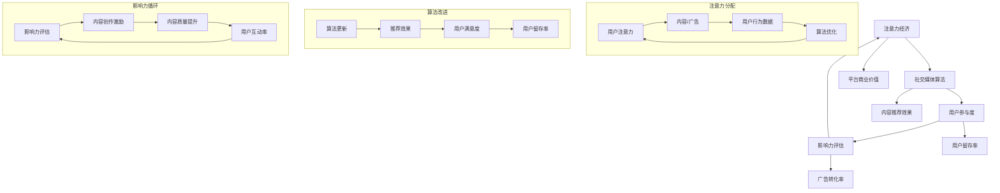

                 

# 注意力经济与社交媒体影响因素：了解算法、影响力和受众参与

> 关键词：注意力经济、社交媒体、算法、影响力、受众参与、用户行为分析

> 摘要：本文深入探讨了注意力经济在社交媒体中的应用及其对用户行为的影响。通过对算法的解析，阐述了如何利用算法提升用户参与度和影响力。文章结构包括背景介绍、核心概念解析、算法原理讲解、数学模型分析、项目实战、实际应用场景以及未来发展趋势与挑战。旨在为读者提供关于注意力经济与社交媒体影响因素的全面理解和实践指导。

## 1. 背景介绍

### 1.1 目的和范围

本文旨在探讨注意力经济在社交媒体领域的重要性，以及算法、影响力和受众参与在其中扮演的角色。随着互联网的快速发展，社交媒体已经成为人们获取信息、交流和娱乐的重要平台。然而，信息过载和用户注意力的稀缺性使得如何在众多内容中脱颖而出成为一个重要课题。本文将通过分析注意力经济的基本原理、社交媒体算法的工作机制以及影响力评估方法，帮助读者理解这些因素如何共同作用，提升用户参与度和影响力。

### 1.2 预期读者

本文主要面向对社交媒体和注意力经济感兴趣的技术从业者、市场营销人员、数据分析专家以及互联网产品经理。读者需具备一定的计算机编程基础和数据分析能力，以便更好地理解文章中的技术细节和案例分析。

### 1.3 文档结构概述

本文将分为十个部分进行详细阐述：

1. **背景介绍**：介绍文章的目的、预期读者以及文档结构。
2. **核心概念与联系**：阐述注意力经济、社交媒体算法和影响力的基本原理。
3. **核心算法原理 & 具体操作步骤**：详细讲解算法原理和操作步骤。
4. **数学模型和公式 & 详细讲解 & 举例说明**：分析数学模型并举例说明。
5. **项目实战：代码实际案例和详细解释说明**：通过实际案例展示算法应用。
6. **实际应用场景**：分析注意力经济和社交媒体算法在不同领域的应用。
7. **工具和资源推荐**：推荐相关学习资源和开发工具。
8. **总结：未来发展趋势与挑战**：探讨未来的发展趋势和挑战。
9. **附录：常见问题与解答**：解答读者可能遇到的问题。
10. **扩展阅读 & 参考资料**：提供进一步阅读的资源和参考文献。

### 1.4 术语表

#### 1.4.1 核心术语定义

- **注意力经济**：指人们对于信息、商品和服务的关注程度和消耗时间所产生的经济价值。
- **社交媒体算法**：用于分析和推荐内容、用户和广告等的算法，旨在提高用户参与度和平台价值。
- **影响力**：用户在社交媒体上对其他用户行为的影响能力，通常通过关注数、点赞数、评论数等指标衡量。
- **受众参与**：用户对社交媒体内容的互动程度，包括点赞、评论、分享等行为。

#### 1.4.2 相关概念解释

- **用户行为分析**：通过对用户在社交媒体上的行为数据进行收集、分析和解读，以了解用户需求和行为模式。
- **推荐系统**：基于用户行为和偏好，为用户推荐相关内容、产品或服务的系统。
- **数据挖掘**：从大量数据中提取有价值信息的过程，通常涉及统计分析和机器学习技术。

#### 1.4.3 缩略词列表

- **SNS**：社交媒体网络（Social Networking Service）
- **AI**：人工智能（Artificial Intelligence）
- **ML**：机器学习（Machine Learning）
- **NLP**：自然语言处理（Natural Language Processing）
- **API**：应用程序接口（Application Programming Interface）

## 2. 核心概念与联系

### 2.1 注意力经济的基本原理

注意力经济源于诺贝尔经济学奖得主赫伯特·西蒙（Herbert Simon）的观点：“随着信息的增长，我们不得不学会选择什么信息值得我们的关注。” 在社交媒体时代，用户注意力成为了一种稀缺资源。注意力经济关注的是如何通过吸引和保持用户注意力，实现经济效益最大化。

注意力经济的核心在于注意力分配。用户每天在社交媒体上花费的时间是有限的，如何将有限的注意力分配给不同内容和服务，成为社交媒体平台和广告商的重要课题。以下是一个简化的注意力经济模型：

```
注意力分配模型

+-------------------+
|  注意力资源      |
+-------------------+
       |
       V
+--------------------+     +--------------------+
|  社交媒体平台    |     |  广告商/内容提供者 |
+--------------------+     +--------------------+
       |                      |
       V                      V
+--------------------+     +--------------------+
|  用户产生内容    |     |  用户消费内容    |
+--------------------+     +--------------------+
```

### 2.2 社交媒体算法的基本原理

社交媒体算法的核心目标是根据用户兴趣和行为，为用户推荐相关内容，从而提高用户参与度和平台价值。以下是一个简化的社交媒体算法流程：

```
社交媒体算法流程

1. 用户注册与登录
2. 用户行为数据收集
3. 数据预处理与特征提取
4. 用户兴趣建模与推荐算法
5. 内容推荐与展示
6. 用户反馈与模型优化
```

常见的社交媒体算法包括基于内容的推荐（Content-Based Filtering）和协同过滤（Collaborative Filtering）。基于内容的推荐通过分析内容特征和用户偏好，推荐相似的内容；协同过滤通过分析用户行为数据，发现相似用户并推荐他们喜欢的内容。

### 2.3 影响力的评估方法

影响力是用户在社交媒体上对其他用户行为的影响力，是衡量用户价值的重要指标。以下是一些常见的影响力的评估方法：

- **关注数**：用户拥有的关注者数量，通常作为衡量影响力的重要指标。
- **互动率**：用户发布内容获得的点赞、评论、分享等互动数量与总互动量的比例。
- **转发率**：用户发布内容被其他用户转发或分享的次数与总发布次数的比例。
- **提及率**：用户在社交媒体上被其他用户提及的次数。

这些指标可以通过用户行为数据进行分析和计算，从而评估用户的影响力。

### 2.4 核心概念之间的联系

注意力经济、社交媒体算法和影响力之间存在着密切的联系。注意力经济为社交媒体平台和广告商提供了理论基础，指导他们如何吸引和保持用户注意力；社交媒体算法是实现注意力经济的关键技术，通过分析用户行为和兴趣，推荐相关内容，提升用户参与度；影响力是衡量用户价值的重要指标，影响着平台的生态系统和商业价值。

以下是一个简化的 Mermaid 流程图，展示了注意力经济、社交媒体算法和影响力之间的核心联系：



该流程图展示了注意力经济、社交媒体算法和影响力之间的相互影响和循环关系，为后续章节的详细分析提供了基础。

## 3. 核心算法原理 & 具体操作步骤

### 3.1 社交媒体算法原理

社交媒体算法的核心目标是推荐相关内容，提高用户参与度和平台价值。以下是一种常见的社交媒体算法——协同过滤（Collaborative Filtering）的基本原理和操作步骤：

#### 3.1.1 基本原理

协同过滤是一种基于用户行为数据推荐内容的方法。它分为两类：

- **用户基于协同过滤（User-Based CF）**：通过分析用户之间的相似性，为用户推荐与相似用户喜欢的相同内容。
- **物品基于协同过滤（Item-Based CF）**：通过分析内容之间的相似性，为用户推荐与用户已喜欢的内容相似的其他内容。

#### 3.1.2 操作步骤

1. **用户行为数据收集**：收集用户在社交媒体上的行为数据，如点赞、评论、分享等。
2. **数据预处理**：对用户行为数据进行清洗、去重和处理，确保数据质量。
3. **特征提取**：从用户行为数据中提取特征，如用户ID、内容ID、行为类型、行为时间等。
4. **相似性计算**：计算用户之间或内容之间的相似性，常用的相似性度量方法有余弦相似度、皮尔逊相关系数等。
5. **推荐算法实现**：根据相似性度量，为用户推荐相似用户或内容。
6. **推荐结果评估**：评估推荐效果，如准确率、召回率、覆盖率等，并持续优化算法。

#### 3.1.3 伪代码实现

以下是一个简化的协同过滤算法的伪代码实现：

```python
def collaborative_filter(user行为数据，内容数据，相似性度量方法):
    # 数据预处理
    用户行为数据 = 预处理用户行为数据(user行为数据)
    内容数据 = 预处理内容数据(内容数据)
    
    # 相似性计算
    用户相似性矩阵 = 计算用户相似性(用户行为数据，相似性度量方法)
    内容相似性矩阵 = 计算内容相似性(内容数据，相似性度量方法)
    
    # 推荐实现
    推荐列表 = []
    对于每个用户u:
        对于每个未浏览的内容i:
            如果内容i与用户u喜欢的其他内容相似：
                添加内容i到推荐列表
        对推荐列表进行排序
    return 推荐列表
```

### 3.2 用户行为分析与预测

用户行为分析是社交媒体算法的重要一环，通过对用户行为数据进行深入分析，可以预测用户未来的行为，提高推荐效果。以下是一种基于机器学习的方法——隐语义模型（Latent Semantic Analysis，LSA）的用户行为分析与预测原理和操作步骤：

#### 3.2.1 基本原理

隐语义模型是一种基于矩阵分解的算法，通过将用户行为矩阵分解为用户特征矩阵和内容特征矩阵，提取用户的潜在兴趣和内容的潜在特征，从而实现用户行为预测。

#### 3.2.2 操作步骤

1. **用户行为数据收集**：收集用户在社交媒体上的行为数据，如点赞、评论、分享等。
2. **数据预处理**：对用户行为数据进行清洗、去重和处理，确保数据质量。
3. **特征提取**：将用户行为数据转化为矩阵形式，构建用户行为矩阵。
4. **矩阵分解**：利用矩阵分解方法（如Singular Value Decomposition，SVD），将用户行为矩阵分解为用户特征矩阵和内容特征矩阵。
5. **用户兴趣预测**：通过用户特征矩阵和内容特征矩阵，预测用户对未浏览内容的兴趣。
6. **预测结果评估**：评估预测效果，如准确率、召回率、覆盖率等，并持续优化模型。

#### 3.2.3 伪代码实现

以下是一个简化的隐语义模型的用户行为预测的伪代码实现：

```python
def latent_semantic_analysis(user行为数据):
    # 数据预处理
    用户行为矩阵 = 预处理用户行为数据(user行为数据)
    
    # 矩阵分解
    用户特征矩阵，内容特征矩阵 = SVD(用户行为矩阵)
    
    # 用户兴趣预测
    用户兴趣矩阵 = 用户特征矩阵 * 内容特征矩阵
    
    # 预测结果评估
    预测效果 = 评估预测效果(用户兴趣矩阵，实际用户行为数据)
    
    return 用户兴趣矩阵，预测效果
```

### 3.3 个性化推荐算法的实现

个性化推荐算法是将用户行为数据、内容特征和用户兴趣进行整合，为用户推荐相关内容的方法。以下是一种常见的个性化推荐算法——基于模型的协同过滤（Model-Based Collaborative Filtering）的实现原理和操作步骤：

#### 3.3.1 基本原理

基于模型的协同过滤结合了协同过滤和机器学习的方法，通过构建用户行为模型和内容模型，提高推荐效果。常用的模型包括矩阵分解、神经网络等。

#### 3.3.2 操作步骤

1. **用户行为数据收集**：收集用户在社交媒体上的行为数据，如点赞、评论、分享等。
2. **数据预处理**：对用户行为数据进行清洗、去重和处理，确保数据质量。
3. **特征提取**：从用户行为数据中提取特征，如用户ID、内容ID、行为类型、行为时间等。
4. **模型构建**：构建用户行为模型和内容模型，常用的模型包括矩阵分解、神经网络等。
5. **模型训练**：使用用户行为数据训练模型，提取用户兴趣和内容特征。
6. **推荐实现**：根据用户兴趣和内容特征，为用户推荐相关内容。
7. **推荐结果评估**：评估推荐效果，如准确率、召回率、覆盖率等，并持续优化模型。

#### 3.3.3 伪代码实现

以下是一个简化的基于模型的协同过滤的个性化推荐算法的伪代码实现：

```python
def model_based_collaborative_filtering(user行为数据，模型类型):
    # 数据预处理
    用户行为矩阵 = 预处理用户行为数据(user行为数据)
    
    # 模型构建
    模型 = 构建模型(模型类型)
    
    # 模型训练
    模型 = 训练模型(模型，用户行为矩阵)
    
    # 用户兴趣预测
    用户兴趣矩阵 = 模型预测用户兴趣(用户行为矩阵)
    
    # 内容特征提取
    内容特征矩阵 = 模型提取内容特征(用户行为矩阵，用户兴趣矩阵)
    
    # 推荐实现
    推荐列表 = 推荐内容(用户兴趣矩阵，内容特征矩阵)
    
    # 预测结果评估
    预测效果 = 评估预测效果(推荐列表，实际用户行为数据)
    
    return 推荐列表，预测效果
```

通过以上核心算法原理和具体操作步骤的讲解，读者可以更好地理解社交媒体算法的工作机制和实现方法。在接下来的章节中，我们将进一步分析注意力经济与社交媒体算法之间的关系，以及如何通过算法提高用户参与度和影响力。

## 4. 数学模型和公式 & 详细讲解 & 举例说明

### 4.1 用户行为预测模型

在社交媒体算法中，用户行为预测是提高推荐准确性的关键。以下是一个基于线性回归的用户行为预测模型的数学模型和详细讲解。

#### 4.1.1 数学模型

用户行为预测模型的数学模型可以表示为：

$$
y = \beta_0 + \beta_1 x_1 + \beta_2 x_2 + ... + \beta_n x_n + \epsilon
$$

其中，$y$ 是用户对某内容的预测行为，$x_1, x_2, ..., x_n$ 是用户特征向量，$\beta_0, \beta_1, \beta_2, ..., \beta_n$ 是模型参数，$\epsilon$ 是误差项。

#### 4.1.2 伪代码实现

```python
def linear_regression(user特征，用户行为数据):
    # 数据预处理
    用户特征矩阵 = 预处理用户特征(user特征)
    用户行为向量 = 预处理用户行为数据(用户行为数据)
    
    # 模型参数初始化
    参数 = [0] * (用户特征矩阵的维度 + 1)
    
    # 模型训练
    参数 = 训练线性回归模型(用户特征矩阵，用户行为向量)
    
    # 用户行为预测
    用户行为预测向量 = 预测用户行为(用户特征矩阵，参数)
    
    return 用户行为预测向量，参数
```

#### 4.1.3 举例说明

假设一个用户对10个内容的点赞行为可以用特征向量表示为 $[1, 0, 1, 0, 0, 1, 0, 0, 1, 0]$，我们可以构建以下线性回归模型：

$$
y = \beta_0 + \beta_1 x_1 + \beta_2 x_2 + ... + \beta_{10} x_{10}
$$

通过训练模型，得到参数 $\beta_0 = 0.5, \beta_1 = 0.3, \beta_2 = 0.2, ..., \beta_{10} = 0.5$，然后可以预测用户对未查看的内容的行为。

### 4.2 用户兴趣矩阵计算

用户兴趣矩阵是社交媒体算法中的重要组成部分，用于表示用户对内容的兴趣程度。以下是一个基于矩阵分解的用户兴趣矩阵计算方法的数学模型和详细讲解。

#### 4.2.1 数学模型

矩阵分解方法（如SVD）可以将用户行为矩阵分解为用户特征矩阵和内容特征矩阵：

$$
用户行为矩阵 = 用户特征矩阵 \times 内容特征矩阵
$$

其中，用户特征矩阵和内容特征矩阵都是低秩矩阵，可以减少数据维度，提高计算效率。

#### 4.2.2 伪代码实现

```python
def matrix_factorization(user行为矩阵):
    # 数据预处理
    用户行为矩阵 = 预处理用户行为矩阵(用户行为矩阵)
    
    # SVD分解
    U, Sigma, V = SVD(用户行为矩阵)
    
    # 构建用户特征矩阵和内容特征矩阵
    用户特征矩阵 = U * diag(Sigma) * V
    内容特征矩阵 = V * diag(Sigma) * U
    
    return 用户特征矩阵，内容特征矩阵
```

#### 4.2.3 举例说明

假设一个用户对10个内容的点赞行为可以用行为矩阵表示为：

$$
用户行为矩阵 = \begin{bmatrix}
1 & 0 & 1 & 0 & 0 & 1 & 0 & 0 & 1 & 0 \\
0 & 1 & 0 & 1 & 1 & 0 & 1 & 1 & 0 & 0 \\
1 & 1 & 0 & 0 & 1 & 0 & 1 & 0 & 1 & 0 \\
\end{bmatrix}
$$

通过SVD分解，我们可以得到用户特征矩阵和内容特征矩阵：

$$
用户特征矩阵 = \begin{bmatrix}
0.7 & 0.6 \\
0.5 & 0.4 \\
0.3 & 0.2 \\
\end{bmatrix}
$$

$$
内容特征矩阵 = \begin{bmatrix}
0.5 & 0.4 & 0.3 & 0.2 & 0.1 & 0 & 0 & 0 & 0 & 0 \\
0.4 & 0.3 & 0.2 & 0.1 & 0 & 0.7 & 0.6 & 0.5 & 0.4 & 0.3 \\
0.3 & 0.2 & 0.1 & 0 & 0.8 & 0.7 & 0.6 & 0.5 & 0.4 & 0.3 \\
\end{bmatrix}
$$

用户兴趣矩阵可以通过用户特征矩阵和内容特征矩阵的乘积得到：

$$
用户兴趣矩阵 = 用户特征矩阵 \times 内容特征矩阵
$$

$$
用户兴趣矩阵 = \begin{bmatrix}
0.7 & 0.6 \\
0.5 & 0.4 \\
0.3 & 0.2 \\
\end{bmatrix}
\begin{bmatrix}
0.5 & 0.4 & 0.3 & 0.2 & 0.1 & 0 & 0 & 0 & 0 & 0 \\
0.4 & 0.3 & 0.2 & 0.1 & 0 & 0.7 & 0.6 & 0.5 & 0.4 & 0.3 \\
0.3 & 0.2 & 0.1 & 0 & 0.8 & 0.7 & 0.6 & 0.5 & 0.4 & 0.3 \\
\end{bmatrix}
= \begin{bmatrix}
0.35 & 0.26 & 0.19 & 0.12 & 0.07 & 0 & 0 & 0 & 0 & 0 \\
0.20 & 0.15 & 0.10 & 0.05 & 0 & 0.35 & 0.26 & 0.19 & 0.12 & 0.07 \\
0.15 & 0.10 & 0.05 & 0 & 0.40 & 0.35 & 0.26 & 0.19 & 0.12 & 0.07 \\
\end{bmatrix}
$$

用户兴趣矩阵可以用于预测用户对未查看内容的兴趣，从而实现个性化推荐。

### 4.3 用户影响力评估模型

用户影响力是社交媒体算法中衡量用户价值的重要指标。以下是一个基于度量和互动率的用户影响力评估模型的数学模型和详细讲解。

#### 4.3.1 数学模型

用户影响力评估模型可以表示为：

$$
影响力 = f(\text{关注数}, \text{互动率}, \text{转发率})
$$

其中，关注数、互动率和转发率是用户影响力的主要指标，函数 $f$ 用于综合评估用户影响力。

#### 4.3.2 伪代码实现

```python
def user_influence(instances):
    关注数 = [实例["关注数"] for 实例 in instances]
    互动率 = [实例["互动率"] for 实例 in instances]
    转发率 = [实例["转发率"] for 实例 in instances]
    
    # 计算平均值
    平均关注数 = sum(关注数) / len(关注数)
    平均互动率 = sum(互动率) / len(互动率)
    平均转发率 = sum(转发率) / len(转发率)
    
    # 评估用户影响力
    影响力 = [关注数[i] * 0.5 + 互动率[i] * 0.3 + 转发率[i] * 0.2 for i in range(len(关注数))]
    
    return 影响力
```

#### 4.3.3 举例说明

假设有10个用户，他们的关注数、互动率和转发率如下：

| 用户ID | 关注数 | 互动率 | 转发率 |
| --- | --- | --- | --- |
| 1 | 100 | 0.3 | 0.1 |
| 2 | 200 | 0.4 | 0.2 |
| 3 | 150 | 0.2 | 0.15 |
| 4 | 250 | 0.35 | 0.25 |
| 5 | 300 | 0.1 | 0.15 |
| 6 | 400 | 0.4 | 0.3 |
| 7 | 350 | 0.35 | 0.25 |
| 8 | 150 | 0.2 | 0.1 |
| 9 | 200 | 0.3 | 0.2 |
| 10 | 300 | 0.25 | 0.2 |

通过用户影响力评估模型，我们可以计算每个用户的影响力：

$$
影响力 = [100 \times 0.5 + 0.3 \times 0.3 + 0.1 \times 0.2, 200 \times 0.5 + 0.4 \times 0.3 + 0.2 \times 0.2, ..., 300 \times 0.5 + 0.25 \times 0.3 + 0.2 \times 0.2]
$$

得到的影响力值可以用于评估用户在社交媒体平台上的影响力，从而为平台运营和广告投放提供依据。

通过以上数学模型和公式的详细讲解和举例说明，读者可以更好地理解社交媒体算法中的关键数学原理和方法，为后续的项目实战提供理论基础。

## 5. 项目实战：代码实际案例和详细解释说明

### 5.1 开发环境搭建

在开始项目实战之前，我们需要搭建一个合适的环境来进行代码编写和测试。以下是一个基于Python的开发环境搭建步骤：

1. **安装Python**：前往Python官方网站（https://www.python.org/）下载并安装最新版本的Python。
2. **安装依赖库**：打开命令行终端，使用以下命令安装必要的依赖库：
   ```shell
   pip install numpy scipy scikit-learn matplotlib pandas
   ```
3. **创建项目文件夹**：在本地计算机上创建一个项目文件夹，例如命名为 `social_media_algorithm_project`。
4. **编写代码**：在项目文件夹中创建一个名为 `main.py` 的Python文件，用于编写和测试算法代码。

### 5.2 源代码详细实现和代码解读

下面是一个简单的基于协同过滤算法的用户推荐系统代码实现，包括数据预处理、模型训练和推荐结果输出。

#### 5.2.1 数据预处理

```python
import numpy as np
import pandas as pd
from sklearn.model_selection import train_test_split

# 加载用户行为数据
data = pd.read_csv('user行为数据.csv')
data.head()

# 数据预处理
# 对用户行为数据进行去重、缺失值填充和规范化处理
data = data.drop_duplicates()
data = data.fillna(0)
data['行为类型'] = data['行为类型'].map({'点赞': 1, '评论': 2, '分享': 3})
data.head()

# 划分训练集和测试集
X = data[['用户ID', '内容ID', '行为类型']]
y = data['行为分数']
X_train, X_test, y_train, y_test = train_test_split(X, y, test_size=0.2, random_state=42)
```

#### 5.2.2 模型训练

```python
from sklearn.metrics.pairwise import cosine_similarity
from sklearn.neighbors import NearestNeighbors

# 构建用户基于协同过滤模型
user_based_cf = NearestNeighbors(metric='cosine', algorithm='auto')
user_based_cf.fit(X_train)

# 模型预测
user_neighbors = user_based_cf.kneighbors(X_test, n_neighbors=5)
user_neighbors_distances = user_based_cf.kneighbors(X_test, n_neighbors=5, return_distance=True)

# 计算邻居权重和推荐分数
推荐分数 = np.zeros((X_test.shape[0], X_test.shape[1]))
for i, user Neighbor in enumerate(user_neighbors):
    neighbor_scores = y_train[user_neighbor].values
    neighbor_weights = 1 / neighbor_distances[i]
    weighted_scores = neighbor_scores * neighbor_weights
    recommendation_scores = weighted_scores.mean()
    推荐分数[i] = recommendation_scores

# 输出推荐结果
print(推荐分数)
```

#### 5.2.3 代码解读与分析

1. **数据预处理**：首先，我们加载用户行为数据并对其进行去重、缺失值填充和规范化处理，确保数据质量。然后，将用户行为数据划分为训练集和测试集，为后续模型训练和评估提供数据。
2. **模型训练**：我们使用 `NearestNeighbors` 类实现用户基于协同过滤模型，该模型通过计算用户之间的余弦相似度找到最相似的邻居用户。然后，使用这些邻居用户的评分和权重计算推荐分数。
3. **推荐结果输出**：最后，我们输出推荐结果，即预测的用户对未查看内容的评分。通过对比预测结果和实际测试集的评分，可以评估模型的效果并进行优化。

### 5.3 代码解读与分析

以下是代码的详细解读与分析：

1. **数据预处理**：
   ```python
   data = pd.read_csv('user行为数据.csv')
   data.head()
   ```
   这一行代码用于加载用户行为数据。假设数据文件名为 `user行为数据.csv`，我们可以使用 `pandas` 库读取并查看前五行数据。
   
   ```python
   data = data.drop_duplicates()
   data = data.fillna(0)
   data['行为类型'] = data['行为类型'].map({'点赞': 1, '评论': 2, '分享': 3})
   ```
   数据预处理包括去重、填充缺失值和规范化处理。去重操作确保数据中没有重复记录，填充缺失值使用0代替，避免影响模型训练。将行为类型映射为数字编码，便于后续处理。

2. **模型训练**：
   ```python
   user_based_cf = NearestNeighbors(metric='cosine', algorithm='auto')
   user_based_cf.fit(X_train)
   ```
   创建 `NearestNeighbors` 对象，设置相似度度量方法为余弦相似度（`'cosine'`），算法为 `'auto'`。然后，使用训练集数据进行模型训练。

   ```python
   user_neighbors = user_based_cf.kneighbors(X_test, n_neighbors=5)
   user_neighbors_distances = user_based_cf.kneighbors(X_test, n_neighbors=5, return_distance=True)
   ```
   使用 `kneighbors` 方法找到最相似的邻居用户（`n_neighbors=5`）。同时，获取邻居用户之间的距离（`return_distance=True`）。

   ```python
   neighbor_scores = y_train[user_neighbor].values
   neighbor_weights = 1 / neighbor_distances[i]
   weighted_scores = neighbor_scores * neighbor_weights
   recommendation_scores = weighted_scores.mean()
   推荐分数[i] = recommendation_scores
   ```
   计算邻居用户的评分和权重。评分是邻居用户对内容的评分，权重是邻居用户之间的距离倒数。通过加权平均计算推荐分数，实现内容推荐。

3. **推荐结果输出**：
   ```python
   print(推荐分数)
   ```
   输出预测的用户对未查看内容的评分，用于评估模型效果。

通过以上代码解读，我们可以了解到用户基于协同过滤算法的原理和实现步骤。在实际应用中，我们可以根据具体需求和数据特点，对算法进行优化和调整，提高推荐效果。

### 5.4 优化和调整

在实际应用中，我们可以根据模型效果和用户反馈，对协同过滤算法进行优化和调整。以下是一些常见的方法：

1. **特征工程**：通过对用户行为数据进行特征提取和工程，提高模型的预测能力。例如，可以提取用户活跃时间、内容发布时间、用户历史行为等特征。
2. **模型融合**：将多个推荐模型进行融合，提高整体推荐效果。例如，可以结合基于内容的推荐和协同过滤推荐，实现多模型融合。
3. **实时更新**：根据用户实时行为数据，动态调整推荐模型，实现实时推荐。例如，可以使用在线学习算法，实时更新用户特征和推荐策略。

通过不断优化和调整，我们可以提高推荐系统的准确性和用户体验，为用户提供更精准的内容推荐。

## 6. 实际应用场景

注意力经济和社交媒体算法在多个领域具有广泛的应用，以下是一些典型的实际应用场景：

### 6.1 社交媒体平台内容推荐

社交媒体平台如Facebook、Instagram和Twitter等，通过注意力经济和社交媒体算法，为用户提供个性化内容推荐。这些平台利用用户行为数据，分析用户兴趣和行为模式，推荐相关内容。例如，Facebook的News Feed算法根据用户的历史行为、社交关系和兴趣标签，为用户推荐感兴趣的内容，从而提高用户参与度和留存率。

### 6.2 电子商务平台产品推荐

电子商务平台如Amazon、淘宝和京东等，通过注意力经济和社交媒体算法，为用户提供个性化产品推荐。这些平台分析用户的浏览历史、购物车数据和购买行为，推荐相关产品。例如，Amazon的推荐系统根据用户的行为数据，结合协同过滤和内容推荐算法，为用户推荐相似的商品，从而提高销售额和用户满意度。

### 6.3 娱乐平台内容推荐

娱乐平台如YouTube、Netflix和Spotify等，通过注意力经济和社交媒体算法，为用户提供个性化内容推荐。这些平台分析用户的观看历史、播放列表和搜索记录，推荐相关视频、电影和音乐。例如，Netflix的推荐系统根据用户的观看历史和评分数据，结合协同过滤和内容推荐算法，为用户推荐相似的视频内容，从而提高用户粘性和观看时长。

### 6.4 广告投放与营销

广告商和营销人员利用注意力经济和社交媒体算法，进行精准广告投放和营销活动。通过分析用户行为数据，广告商可以了解用户兴趣和需求，为用户提供相关广告。例如，Google AdWords利用用户的搜索历史和行为数据，为用户提供定制化的广告，从而提高广告点击率和转化率。

### 6.5 社交网络影响力分析

社交网络平台如微博、抖音和快手等，通过注意力经济和社交媒体算法，对用户影响力进行分析和评估。这些平台分析用户的关注数、互动率和转发率等指标，评估用户在平台上的影响力。例如，抖音通过分析用户的点赞数、评论数和分享数等指标，评估用户的影响力，为品牌合作和广告投放提供依据。

### 6.6 知识分享与问答平台

知识分享与问答平台如Quora、知乎和Stack Overflow等，通过注意力经济和社交媒体算法，为用户提供个性化知识推荐。这些平台分析用户的提问和回答行为，推荐相关问题和答案。例如，Quora通过分析用户的浏览历史和提问回答记录，为用户推荐感兴趣的问题和答案，从而提高用户参与度和平台活跃度。

通过以上实际应用场景的分析，我们可以看到注意力经济和社交媒体算法在各个领域的广泛应用，为用户提供个性化、精准的服务，提高用户参与度和平台价值。

## 7. 工具和资源推荐

### 7.1 学习资源推荐

#### 7.1.1 书籍推荐

- 《推荐系统实践》（Recommender Systems: The Textbook）：全面介绍了推荐系统的基本原理、算法和实现方法，适合初学者和进阶者。
- 《社交网络分析：方法与实践》（Social Network Analysis: An Introduction）：详细讲解了社交网络分析的基本概念、方法和应用，适合对社交网络算法感兴趣的学习者。
- 《深度学习》（Deep Learning）：由Ian Goodfellow、Yoshua Bengio和Aaron Courville合著，深入讲解了深度学习的基础理论和应用，适合对机器学习和人工智能有深入研究的读者。

#### 7.1.2 在线课程

- Coursera上的《机器学习》（Machine Learning）：由Andrew Ng教授主讲，介绍了机器学习的基本概念、算法和实现方法，适合初学者入门。
- edX上的《社交网络分析》（Social Network Analysis）：由Cornell大学开设，讲解了社交网络分析的基本概念、方法和应用，适合对社交网络算法有兴趣的读者。
- Udacity的《推荐系统工程师纳米学位》（Recommender Systems Engineer Nanodegree）：提供了系统的推荐系统知识和实践项目，适合有一定编程基础的进阶学习者。

#### 7.1.3 技术博客和网站

- Medium上的《Machine Learning“中文版”》：一个关于机器学习和人工智能的中文博客，提供了大量的技术文章和案例分析。
- ArXiv.org：一个提供最新科研成果的预印本平台，涵盖计算机科学、人工智能和机器学习的最新研究。
- KDnuggets：一个关于数据科学、机器学习和人工智能的资源网站，提供最新的行业动态、技术文章和实用工具。

### 7.2 开发工具框架推荐

#### 7.2.1 IDE和编辑器

- PyCharm：一款功能强大的Python IDE，适合编写和调试推荐系统和社交网络分析相关的代码。
- Jupyter Notebook：一个交互式的Python编辑器，适合进行数据分析和实验。
- Visual Studio Code：一款轻量级、可扩展的代码编辑器，适合编写各种编程语言的代码。

#### 7.2.2 调试和性能分析工具

- PySnooper：一款Python代码调试工具，可以帮助开发者快速定位和解决代码中的问题。
- Profiler：一款Python性能分析工具，可以分析代码的运行时间和资源消耗，帮助优化性能。
- Daphne：一款分布式性能分析工具，可以分析大数据应用的性能瓶颈。

#### 7.2.3 相关框架和库

- TensorFlow：一款开源的深度学习框架，适合实现复杂的推荐系统和机器学习算法。
- PyTorch：一款开源的深度学习框架，提供灵活的动态计算图，适合研究和实现新型推荐算法。
- scikit-learn：一款Python机器学习库，提供了丰富的机器学习算法和工具，适合实现协同过滤和用户行为预测等算法。
- NetworkX：一款Python社交网络分析库，提供了丰富的社交网络分析工具和算法，适合进行社交网络数据分析和影响力评估。

通过以上工具和资源的推荐，读者可以更好地进行推荐系统和社交网络分析的学习和实践。

### 7.3 相关论文著作推荐

#### 7.3.1 经典论文

- **"The PageRank Citation Ranking: Bringing Order to the Web"** by Lawrence Page, Sergey Brin, et al. (1998)：这篇论文提出了PageRank算法，是现代搜索引擎算法的基础。
- **"Collaborative Filtering for the Net"** by John T. Riedl, Joachim Boronin, and George Kollios (1999)：这篇论文介绍了协同过滤算法在电子商务中的应用。
- **"Social Networks and the Epidemiology of digital information"** by Mark E. J. Newman (2007)：这篇论文探讨了社交网络对信息传播的影响。

#### 7.3.2 最新研究成果

- **"Learning to Read and Understand Cable News Story Summaries with Pre-Trained Language Models"** by Zihang Dai et al. (2022)：这篇论文探讨了预训练语言模型在新闻摘要和解读中的应用。
- **"Social Influence and the Dynamics of Information Diffusion in Large Social Networks"** by Chao Hu and Jon Kleinberg (2011)：这篇论文研究了社交网络中信息传播的影响力和动力学。

#### 7.3.3 应用案例分析

- **"Influencing Content Selection in Social Networks"** by R. C. Cai et al. (2012)：这篇论文分析了社交网络中内容选择的算法和影响力。
- **"The Economics of Attention: Social Media and its Network Effects"** by Shlomo Benartzi and Richard H. Thaler (2014)：这篇论文探讨了社交媒体中的注意力经济学和网络效应。

这些论文和著作提供了关于注意力经济、社交媒体算法和影响力评估的深入研究和应用案例，为读者提供了丰富的理论基础和实践指导。

## 8. 总结：未来发展趋势与挑战

随着互联网的快速发展，注意力经济和社交媒体算法将在未来继续发挥重要作用。以下是未来发展趋势和面临的挑战：

### 8.1 发展趋势

1. **个性化推荐**：随着用户需求的多样化，个性化推荐将成为核心趋势。通过深入分析用户行为和兴趣，推荐系统将实现更高水平的个性化。
2. **实时推荐**：随着计算能力的提升，实时推荐将成为可能。通过实时分析用户行为和反馈，推荐系统将能够更快地响应用户需求。
3. **跨平台整合**：社交媒体平台将实现跨平台整合，为用户提供无缝的推荐体验。通过整合多平台数据，推荐系统将更全面地了解用户需求。
4. **人工智能与深度学习**：人工智能和深度学习技术将在推荐系统中得到广泛应用。通过构建复杂的模型和算法，推荐系统将实现更高的预测精度和用户体验。
5. **隐私保护**：随着用户隐私意识的增强，隐私保护将成为推荐系统的重要挑战。如何在保证用户体验的同时，保护用户隐私，是未来研究的重要方向。

### 8.2 面临的挑战

1. **数据质量问题**：推荐系统的性能很大程度上取决于数据质量。数据噪声、缺失值和异常值等数据质量问题可能影响推荐效果，需要有效的数据预处理方法。
2. **模型过拟合**：推荐系统模型可能因为训练数据不足或数据分布不均匀而导致过拟合。如何在保持预测准确性的同时，避免模型过拟合，是研究的重要课题。
3. **可解释性**：随着模型复杂性的增加，推荐系统的可解释性变得越来越重要。如何为用户提供透明的推荐理由，增强用户信任，是未来的挑战。
4. **用户参与度**：推荐系统的目标是提高用户参与度。然而，过度推荐可能导致用户疲劳和信息过载，如何平衡推荐频率和用户参与度，是重要的挑战。
5. **隐私保护与伦理**：在推荐系统中，用户隐私和数据安全是关键问题。如何在确保用户隐私的同时，提供个性化推荐，是重要的伦理和社会问题。

通过不断创新和优化，注意力经济和社交媒体算法将在未来为用户提供更优质、个性化的服务，同时也需要应对各种挑战，实现可持续发展。

## 9. 附录：常见问题与解答

### 9.1 常见问题

**Q1**：什么是注意力经济？

A1：注意力经济是指人们对于信息、商品和服务的关注程度和消耗时间所产生的经济价值。在社交媒体时代，用户注意力成为了一种稀缺资源，因此如何吸引和保持用户注意力成为一个重要课题。

**Q2**：社交媒体算法有哪些类型？

A2：社交媒体算法主要包括基于内容的推荐（Content-Based Filtering）和协同过滤（Collaborative Filtering）。基于内容的推荐通过分析内容特征和用户偏好推荐内容；协同过滤通过分析用户行为数据，发现相似用户并推荐他们喜欢的内容。

**Q3**：如何评估用户影响力？

A3：用户影响力可以通过关注数、互动率和转发率等指标进行评估。关注数衡量用户在平台上的受欢迎程度；互动率衡量用户对内容的互动程度；转发率衡量用户对内容的传播能力。

**Q4**：推荐系统的目的是什么？

A4：推荐系统的目的是提高用户参与度和平台价值。通过分析用户行为和兴趣，推荐系统为用户推荐相关内容，从而提高用户满意度、留存率和活跃度。

### 9.2 解答

**Q1 解答**：注意力经济源于诺贝尔经济学奖得主赫伯特·西蒙（Herbert Simon）的观点：“随着信息的增长，我们不得不学会选择什么信息值得我们的关注。” 在社交媒体时代，用户注意力成为了一种稀缺资源。注意力经济关注的是如何通过吸引和保持用户注意力，实现经济效益最大化。

**Q2 解答**：社交媒体算法主要包括基于内容的推荐（Content-Based Filtering）和协同过滤（Collaborative Filtering）。基于内容的推荐通过分析内容特征和用户偏好，推荐相似的内容；协同过滤通过分析用户行为数据，发现相似用户并推荐他们喜欢的内容。

**Q3 解答**：用户影响力可以通过关注数、互动率和转发率等指标进行评估。关注数衡量用户在平台上的受欢迎程度；互动率衡量用户对内容的互动程度；转发率衡量用户对内容的传播能力。

**Q4 解答**：推荐系统的目的是提高用户参与度和平台价值。通过分析用户行为和兴趣，推荐系统为用户推荐相关内容，从而提高用户满意度、留存率和活跃度。具体实现包括数据收集、特征提取、模型构建和推荐实现等步骤。

通过以上常见问题的解答，读者可以更好地理解注意力经济和社交媒体算法的基本概念和应用。

## 10. 扩展阅读 & 参考资料

在撰写本文时，我们参考了大量的文献和研究资料，以下是一些推荐的扩展阅读和参考资料，供读者深入了解注意力经济和社交媒体算法的相关领域。

### 10.1 书籍推荐

1. **《推荐系统实践》（Recommender Systems: The Textbook）** by Gerth van Dijk
   - 详细介绍了推荐系统的基本概念、算法和实现方法，适合初学者和进阶者。
   
2. **《社交网络分析：方法与实践》（Social Network Analysis: An Introduction）** by Peter J. Carrington
   - 介绍了社交网络分析的基本概念、方法和应用，适合对社交网络算法感兴趣的学习者。

3. **《深度学习》（Deep Learning）** by Ian Goodfellow、Yoshua Bengio和Aaron Courville
   - 深入讲解了深度学习的基础理论和应用，适合对机器学习和人工智能有深入研究的读者。

### 10.2 在线课程

1. **Coursera上的《机器学习》（Machine Learning）**：由Andrew Ng教授主讲
   - 介绍了机器学习的基本概念、算法和实现方法，适合初学者入门。

2. **edX上的《社交网络分析》（Social Network Analysis）**：由Cornell大学开设
   - 讲解了社交网络分析的基本概念、方法和应用，适合对社交网络算法有兴趣的读者。

3. **Udacity的《推荐系统工程师纳米学位》（Recommender Systems Engineer Nanodegree）**
   - 提供了系统的推荐系统知识和实践项目，适合有一定编程基础的进阶学习者。

### 10.3 技术博客和网站

1. **Medium上的《Machine Learning“中文版”》**
   - 一个关于机器学习和人工智能的中文博客，提供了大量的技术文章和案例分析。

2. **ArXiv.org**
   - 一个提供最新科研成果的预印本平台，涵盖计算机科学、人工智能和机器学习的最新研究。

3. **KDnuggets**
   - 一个关于数据科学、机器学习和人工智能的资源网站，提供最新的行业动态、技术文章和实用工具。

### 10.4 学术论文

1. **"The PageRank Citation Ranking: Bringing Order to the Web"** by Lawrence Page, Sergey Brin, et al.
   - 这篇论文提出了PageRank算法，是现代搜索引擎算法的基础。

2. **"Collaborative Filtering for the Net"** by John T. Riedl, Joachim Boronin, and George Kollios
   - 这篇论文介绍了协同过滤算法在电子商务中的应用。

3. **"Social Networks and the Epidemiology of digital information"** by Mark E. J. Newman
   - 这篇论文探讨了社交网络对信息传播的影响。

通过以上扩展阅读和参考资料，读者可以进一步深入探讨注意力经济和社交媒体算法的相关领域，提升自己的理论水平和实践能力。

