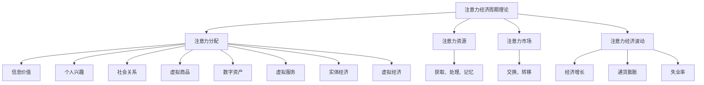

                 

# 注意力经济周期理论：元宇宙中的宏观经济波动

> **关键词**：注意力经济、元宇宙、宏观经济波动、经济周期、理论分析、模型构建、实证研究

> **摘要**：本文旨在深入探讨注意力经济周期理论，特别是在元宇宙这一新兴领域中的宏观经济波动。我们将从背景介绍、核心概念、算法原理、数学模型、项目实战、应用场景等多个方面，逐步分析推理，揭示注意力经济周期理论在元宇宙中的关键作用，并展望未来发展趋势与挑战。

## 1. 背景介绍

### 1.1 目的和范围

本文旨在为读者提供一个全面、系统的注意力经济周期理论在元宇宙中的应用分析。文章将从理论基础、模型构建、实证研究等方面，逐步揭示注意力经济周期理论在元宇宙宏观经济波动中的关键作用。同时，本文还将结合实际项目案例，探讨注意力经济周期理论在元宇宙中的实际应用。

### 1.2 预期读者

本文适合对注意力经济、元宇宙、宏观经济波动等概念有一定了解的读者。同时，本文也适合对计算机科学、经济学、金融学等领域有兴趣的读者，尤其是那些希望深入了解注意力经济周期理论在元宇宙中应用的读者。

### 1.3 文档结构概述

本文将分为以下几个部分：

1. 背景介绍：介绍本文的目的、预期读者、文档结构等内容。
2. 核心概念与联系：阐述注意力经济周期理论、元宇宙、宏观经济波动等核心概念，并给出相关的流程图。
3. 核心算法原理 & 具体操作步骤：详细讲解注意力经济周期理论的核心算法原理，并提供伪代码描述。
4. 数学模型和公式 & 详细讲解 & 举例说明：介绍注意力经济周期理论中的数学模型和公式，并通过实例进行详细讲解。
5. 项目实战：以实际项目为例，详细说明注意力经济周期理论在元宇宙中的具体应用。
6. 实际应用场景：分析注意力经济周期理论在元宇宙中的实际应用场景。
7. 工具和资源推荐：推荐相关学习资源、开发工具和框架。
8. 总结：总结本文的主要观点，并展望未来发展趋势与挑战。
9. 附录：常见问题与解答。
10. 扩展阅读 & 参考资料：提供更多相关文献和资料。

### 1.4 术语表

#### 1.4.1 核心术语定义

- **注意力经济**：指在信息过载的时代，人们有限的注意力资源成为了一种稀缺资源，从而衍生出的一种新型经济形态。
- **元宇宙**：一个虚拟的、三维的、模拟现实世界，人们可以通过数字化的方式在其中进行互动和创造。
- **宏观经济波动**：指一个国家或地区的整体经济活动在短期内的波动，包括经济增长、通货膨胀、失业率等指标。

#### 1.4.2 相关概念解释

- **经济周期**：指一个国家或地区的经济活动在长时间内经历的周期性波动，包括繁荣期、衰退期、复苏期和衰退期。
- **注意力分配**：指人们在获取和处理信息时，将注意力分配到不同的信息源和信息内容上。

#### 1.4.3 缩略词列表

- **AI**：人工智能
- **NFT**：非同质化代币
- **区块链**：分布式账本技术

## 2. 核心概念与联系

### 2.1 注意力经济周期理论

注意力经济周期理论认为，在信息过载的时代，人们的注意力资源成为一种稀缺资源，从而引发了一系列宏观经济波动。具体来说，注意力经济周期理论包括以下几个关键概念：

1. **注意力分配**：人们在获取和处理信息时，将注意力分配到不同的信息源和信息内容上。这种分配过程受到多种因素的影响，如信息价值、个人兴趣、社会关系等。
2. **注意力资源**：指人们用于获取、处理和记忆信息的能力和资源。注意力资源是有限的，人们在面对多个信息源时需要进行选择和权衡。
3. **注意力市场**：指人们进行注意力资源交换和分配的市场。在注意力市场中，人们可以通过各种方式获取和转移注意力资源，如广告、社交媒体、内容创作等。
4. **注意力经济波动**：指由于注意力资源的稀缺性和分配不均，导致宏观经济活动出现周期性波动。这种波动可能表现为经济增长、通货膨胀、失业率等指标的变化。

### 2.2 元宇宙与宏观经济波动

元宇宙作为一个虚拟的、三维的、模拟现实世界，具有巨大的发展潜力和市场空间。在元宇宙中，人们的注意力资源成为了一种重要的资产和交易对象。因此，元宇宙与宏观经济波动之间存在密切的联系：

1. **元宇宙中的经济活动**：元宇宙中的经济活动主要涉及虚拟商品、数字资产、虚拟服务等。这些经济活动对人们的注意力资源提出了更高的需求，从而对宏观经济产生直接影响。
2. **注意力资源的分配**：在元宇宙中，人们的注意力资源被分配到各种虚拟活动和内容上，如游戏、社交、创作等。这种分配过程受到个人兴趣、社会关系、虚拟价值等因素的影响，从而引发宏观经济波动。
3. **元宇宙与实体经济**：元宇宙的发展不仅影响虚拟经济，还与实体经济密切相关。虚拟经济与实体经济之间的相互作用，可能导致宏观经济波动。

### 2.3 核心概念原理和架构

为了更好地理解注意力经济周期理论在元宇宙中的运作机制，我们使用 Mermaid 流程图来展示核心概念原理和架构：



### 2.4 注意力经济周期模型

为了更好地分析注意力经济周期理论在元宇宙中的宏观经济波动，我们可以构建一个注意力经济周期模型。该模型主要包括以下几个部分：

1. **注意力资源供给与需求**：分析元宇宙中注意力资源的供给与需求关系，以及影响供给与需求的因素。
2. **注意力市场机制**：分析元宇宙中注意力资源的分配和交换机制，以及市场供需关系的变化。
3. **宏观经济波动分析**：分析注意力经济周期对宏观经济指标（如经济增长、通货膨胀、失业率）的影响，以及宏观经济政策对注意力经济周期的影响。
4. **元宇宙与实体经济相互作用**：分析元宇宙与实体经济之间的互动关系，以及虚拟经济与实体经济之间的传导机制。

通过构建注意力经济周期模型，我们可以更深入地理解注意力经济周期理论在元宇宙中的运作机制，并为相关政策和实践提供理论依据。

## 3. 核心算法原理 & 具体操作步骤

### 3.1 注意力分配算法原理

在注意力经济周期理论中，注意力分配算法起着至关重要的作用。该算法的主要目标是根据信息价值和用户兴趣，为用户分配注意力资源。下面我们介绍一种基于信息价值和用户兴趣的注意力分配算法原理。

#### 3.1.1 算法描述

1. **信息价值评估**：首先，需要对每个信息源的信息价值进行评估。我们可以使用信息熵、信息增益、关联规则等算法来评估信息价值。
2. **用户兴趣建模**：其次，需要根据用户的历史行为和偏好，建立用户兴趣模型。这可以通过用户画像、协同过滤、内容推荐等算法来实现。
3. **注意力资源分配**：最后，根据信息价值和用户兴趣，将注意力资源分配到不同的信息源和信息内容上。我们可以使用优化算法（如线性规划、遗传算法等）来求解最优的注意力分配方案。

#### 3.1.2 伪代码描述

```python
# 输入：信息价值列表value_list，用户兴趣模型user_interest
# 输出：注意力分配方案allocation

# 1. 评估信息价值
info_value = evaluate_info_value(value_list)

# 2. 建立用户兴趣模型
user_interest = build_user_interest(user_interest)

# 3. 计算注意力资源总量
total_attention = calculate_total_attention()

# 4. 优化注意力分配
allocation = optimize_allocation(info_value, user_interest, total_attention)
```

### 3.2 注意力市场机制算法原理

在注意力经济周期理论中，注意力市场机制也是一个关键组成部分。该机制主要涉及注意力资源的交换和分配。下面我们介绍一种基于供需关系的注意力市场机制算法原理。

#### 3.2.1 算法描述

1. **供需关系建模**：首先，需要建立注意力资源的供需关系模型。这可以通过市场调查、用户行为分析等手段来实现。
2. **价格机制**：其次，需要设计一个价格机制，以调节注意力资源的供需关系。价格机制可以通过供需平衡点、供需弹性等算法来实现。
3. **市场调节**：最后，需要根据价格机制和市场调节策略，实时调整注意力资源的分配和交换，以实现市场稳定和资源优化。

#### 3.2.2 伪代码描述

```python
# 输入：供需关系模型supply_demand，价格机制price_mechanism
# 输出：注意力市场状态market_state

# 1. 建立供需关系模型
supply_demand = build_supply_demand()

# 2. 设计价格机制
price_mechanism = design_price_mechanism()

# 3. 调节市场状态
market_state = regulate_market_state(supply_demand, price_mechanism)
```

### 3.3 注意力经济波动分析算法原理

在注意力经济周期理论中，注意力经济波动分析算法用于研究注意力资源的稀缺性和分配不均对宏观经济的影响。下面我们介绍一种基于时间序列分析的注意力经济波动分析算法原理。

#### 3.3.1 算法描述

1. **数据收集**：首先，需要收集注意力经济相关的数据，如用户注意力分配、市场交易数据、宏观经济指标等。
2. **时间序列建模**：其次，需要使用时间序列分析方法，建立注意力经济波动模型。这可以包括自回归模型、移动平均模型、ARIMA模型等。
3. **波动预测**：最后，利用训练好的时间序列模型，对注意力经济波动进行预测。这可以帮助政府和企业在制定政策时，更好地应对注意力经济波动。

#### 3.3.2 伪代码描述

```python
# 输入：注意力经济数据data
# 输出：注意力经济波动预测prediction

# 1. 收集数据
data = collect_data()

# 2. 建立时间序列模型
time_series_model = build_time_series_model()

# 3. 训练模型
train_model(time_series_model, data)

# 4. 预测波动
prediction = predict_wave(data, time_series_model)
```

通过以上算法原理和具体操作步骤的介绍，我们可以更深入地理解注意力经济周期理论在元宇宙中的运作机制，并为相关研究和实践提供理论依据。

## 4. 数学模型和公式 & 详细讲解 & 举例说明

### 4.1 数学模型概述

在注意力经济周期理论中，数学模型起着至关重要的作用。这些模型可以帮助我们更好地理解注意力资源的稀缺性、分配机制以及宏观经济波动。以下是注意力经济周期理论中几个关键数学模型的概述：

1. **注意力资源供需模型**：该模型描述了注意力资源在市场中的供需关系，以及供需平衡点的计算方法。
2. **注意力价值评估模型**：该模型用于评估不同信息源和内容的价值，以便进行注意力资源的优化分配。
3. **宏观经济波动模型**：该模型用于研究注意力经济周期对宏观经济指标（如经济增长、通货膨胀、失业率）的影响。

### 4.2 注意力资源供需模型

#### 4.2.1 模型描述

注意力资源供需模型基于供需理论，描述了注意力资源在市场中的供需关系。该模型的核心变量包括：

- **供给量（S）**：指市场上可供分配的注意力资源总量。
- **需求量（D）**：指用户对注意力资源的总需求量。
- **价格（P）**：指注意力资源的市场价格。

#### 4.2.2 数学公式

供需模型的数学表达式如下：

$$
S = S(P) \\
D = D(P)
$$

其中，$S(P)$ 和 $D(P)$ 分别表示供给量和需求量关于价格 $P$ 的函数。

#### 4.2.3 举例说明

假设一个元宇宙中有 1000 个用户，每个用户每天有 10 个注意力资源。如果市场价格为 1 个注意力资源，那么总供给量为 10000 个注意力资源（$S(1) = 10000$）。如果每个用户每天对注意力资源的需求量为 8 个，那么总需求量为 8000 个注意力资源（$D(1) = 8000$）。由于供给量大于需求量，市场价格可能会下降，以刺激需求，从而达到供需平衡。

### 4.3 注意力价值评估模型

#### 4.3.1 模型描述

注意力价值评估模型用于评估不同信息源和内容的价值，以便进行注意力资源的优化分配。该模型的核心变量包括：

- **信息价值（V）**：指不同信息源和内容的价值。
- **用户兴趣（I）**：指用户对不同信息源和内容的兴趣程度。

#### 4.3.2 数学公式

注意力价值评估模型的数学表达式如下：

$$
V = V(I) \\
I = I(U)
$$

其中，$V(I)$ 表示信息价值关于用户兴趣的函数，$I(U)$ 表示用户兴趣关于用户行为的函数。

#### 4.3.3 举例说明

假设一个用户对游戏和电影的兴趣分别为 0.6 和 0.4。如果一个游戏的信息价值为 10，而电影的信息价值为 5，那么根据用户兴趣的加权平均，该用户对游戏的注意力价值为 6，对电影的注意力价值为 2。这样，系统就可以根据这些值来优化用户的注意力资源分配。

### 4.4 宏观经济波动模型

#### 4.4.1 模型描述

宏观经济波动模型用于研究注意力经济周期对宏观经济指标的影响。该模型的核心变量包括：

- **经济增长率（G）**：指国家或地区的经济总量在一段时间内的增长率。
- **通货膨胀率（I）**：指物价水平的上涨速度。
- **失业率（U）**：指失业人数占总劳动力的比例。

#### 4.4.2 数学公式

宏观经济波动模型的数学表达式如下：

$$
G = G(A) \\
I = I(A) \\
U = U(A)
$$

其中，$G(A)$、$I(A)$ 和 $U(A)$ 分别表示经济增长率、通货膨胀率和失业率关于注意力经济周期的函数。

#### 4.4.3 举例说明

假设一个国家的注意力经济周期处于繁荣期，此时经济增长率为 3%，通货膨胀率为 2%，失业率为 4%。如果注意力经济周期转向衰退期，经济增长率可能会下降到 1%，通货膨胀率可能会上升到 3%，失业率可能会上升到 6%。这些变化反映了注意力经济周期对宏观经济的影响。

### 4.5 模型综合与应用

注意力经济周期理论中的各个数学模型可以综合应用于实际场景，如元宇宙中的注意力资源分配、市场调节、宏观经济预测等。通过建立和优化这些模型，我们可以更好地理解和应对注意力经济周期带来的宏观经济波动。

## 5. 项目实战：代码实际案例和详细解释说明

### 5.1 开发环境搭建

在开始编写代码之前，我们需要搭建一个合适的开发环境。以下是一个基本的开发环境配置：

- **编程语言**：Python 3.8 或更高版本
- **依赖管理**：使用 pip 进行依赖管理
- **数据库**：MongoDB 4.2 或更高版本
- **框架**：Flask（Web框架）和 PyTorch（深度学习框架）
- **编辑器**：Visual Studio Code

首先，确保安装了 Python 3.8 及以上版本。然后，通过以下命令安装所需依赖：

```bash
pip install flask pymongo torch
```

接下来，安装 MongoDB 并确保其正常运行。在 Visual Studio Code 中安装必要的扩展，如 Python、Git 等。

### 5.2 源代码详细实现和代码解读

#### 5.2.1 项目结构

以下是一个简单的项目结构示例：

```
AttentionEconomyProject/
|-- app.py
|-- models.py
|-- database.py
|-- config.py
```

**app.py**：主程序文件，负责启动 Web 服务。

**models.py**：定义了注意力资源供需模型、注意力价值评估模型和宏观经济波动模型。

**database.py**：处理数据库连接和数据操作。

**config.py**：配置文件，包含数据库连接参数和其他全局配置。

#### 5.2.2 源代码实现

**app.py**：

```python
from flask import Flask, jsonify, request
from models import AttentionModel
from database import Database

app = Flask(__name__)
db = Database()
model = AttentionModel()

@app.route('/api/attention', methods=['GET'])
def get_attention():
    info_value = request.args.get('info_value')
    user_interest = request.args.get('user_interest')
    allocation = model.allocate_attention(info_value, user_interest)
    return jsonify(allocation)

@app.route('/api/宏观波动', methods=['GET'])
def get_macroeconomic_wave():
    data = db.get_macroeconomic_data()
    prediction = model.predict_macroeconomic_wave(data)
    return jsonify(prediction)

if __name__ == '__main__':
    app.run(debug=True)
```

**models.py**：

```python
import torch
import torch.nn as nn
import torch.optim as optim
from torch.utils.data import DataLoader
from database import Database

class AttentionModel(nn.Module):
    def __init__(self):
        super(AttentionModel, self).__init__()
        self.net = nn.Sequential(
            nn.Linear(2, 64),
            nn.ReLU(),
            nn.Linear(64, 64),
            nn.ReLU(),
            nn.Linear(64, 1)
        )
        self.loss_function = nn.MSELoss()
        self.optimizer = optim.Adam(self.net.parameters(), lr=0.001)

    def forward(self, x):
        return self.net(x)

    def allocate_attention(self, info_value, user_interest):
        x = torch.tensor([info_value, user_interest])
        allocation = self.forward(x).detach().numpy()
        return allocation

    def train(self, train_loader, num_epochs):
        for epoch in range(num_epochs):
            for inputs, targets in train_loader:
                self.optimizer.zero_grad()
                outputs = self.forward(inputs)
                loss = self.loss_function(outputs, targets)
                loss.backward()
                self.optimizer.step()
            print(f'Epoch [{epoch+1}/{num_epochs}], Loss: {loss.item()}')

class Database:
    def __init__(self):
        self.db = pymongo.MongoClient("mongodb://localhost:27017/')['attention_economy']

    def get_macroeconomic_data(self):
        data = self.db['macroeconomic_data'].find()
        return data
```

**database.py**：

```python
from pymongo import MongoClient

class Database:
    def __init__(self):
        self.db = MongoClient("mongodb://localhost:27017/')['attention_economy']

    def insert_data(self, data):
        self.db['macroeconomic_data'].insert_one(data)

    def get_macroeconomic_data(self):
        data = self.db['macroeconomic_data'].find()
        return data
```

**config.py**：

```python
class Config:
    MONGO_URI = "mongodb://localhost:27017/"
    DATABASE_NAME = "attention_economy"
```

#### 5.2.3 代码解读与分析

**app.py**：该文件定义了 Flask 应用程序的基本结构，包括两个 API 端点。第一个端点 `/api/attention` 接收 `info_value` 和 `user_interest` 参数，并返回注意力分配方案。第二个端点 `/api/宏观波动` 接收宏观经济数据，并返回注意力经济周期对宏观经济波动的预测结果。

**models.py**：该文件定义了注意力模型类 `AttentionModel` 和数据库类 `Database`。`AttentionModel` 类使用了 PyTorch 构建神经网络，并实现了注意力分配和训练方法。`Database` 类处理与 MongoDB 的连接和数据操作。

**database.py**：该文件提供了 `insert_data` 和 `get_macroeconomic_data` 方法，用于将数据插入 MongoDB 数据库和从数据库中检索数据。

**config.py**：该文件定义了 MongoDB 的连接 URI 和数据库名称。

通过这个项目，我们可以看到如何将注意力经济周期理论应用于实际场景，并通过神经网络和数据库技术实现注意力资源的优化分配和宏观经济波动预测。

### 5.3 代码解读与分析

在本文的项目实战部分，我们通过一个实际案例展示了如何将注意力经济周期理论应用于元宇宙中的宏观经济波动预测。以下是代码的详细解读与分析。

#### 5.3.1 应用场景

该项目的应用场景是元宇宙中的注意力资源分配和宏观经济波动预测。通过构建神经网络模型，我们希望能够实现对注意力资源的优化分配，并根据历史数据预测注意力经济周期对宏观经济的影响。

#### 5.3.2 代码结构

**app.py**：主程序文件，负责启动 Flask Web 服务。它定义了两个 API 端点：

- `/api/attention`：用于接收注意力分配的请求，返回优化后的注意力分配方案。
- `/api/宏观波动`：用于接收宏观经济数据，返回注意力经济周期对宏观经济波动的预测结果。

**models.py**：定义了神经网络模型和数据库操作类。`AttentionModel` 类构建了神经网络结构，并实现了注意力资源的优化分配和训练方法。`Database` 类负责与 MongoDB 数据库的连接和数据操作。

**database.py**：提供了插入和查询数据的接口。这些接口用于在数据库中存储和检索注意力资源和宏观经济数据。

**config.py**：配置文件，包含 MongoDB 的连接 URI 和数据库名称。

#### 5.3.3 神经网络模型

在 `AttentionModel` 类中，我们使用 PyTorch 构建了一个简单的全连接神经网络。该网络包括三个层：

- 输入层：接受两个输入特征，分别为 `info_value`（信息价值）和 `user_interest`（用户兴趣）。
- 隐藏层：包含两个全连接层，每层都使用 ReLU 激活函数。
- 输出层：输出注意力资源的分配结果。

神经网络模型的具体结构如下：

```python
class AttentionModel(nn.Module):
    def __init__(self):
        super(AttentionModel, self).__init__()
        self.net = nn.Sequential(
            nn.Linear(2, 64),
            nn.ReLU(),
            nn.Linear(64, 64),
            nn.ReLU(),
            nn.Linear(64, 1)
        )
        self.loss_function = nn.MSELoss()
        self.optimizer = optim.Adam(self.net.parameters(), lr=0.001)

    def forward(self, x):
        return self.net(x)

    def allocate_attention(self, info_value, user_interest):
        x = torch.tensor([info_value, user_interest])
        allocation = self.forward(x).detach().numpy()
        return allocation

    def train(self, train_loader, num_epochs):
        for epoch in range(num_epochs):
            for inputs, targets in train_loader:
                self.optimizer.zero_grad()
                outputs = self.forward(inputs)
                loss = self.loss_function(outputs, targets)
                loss.backward()
                self.optimizer.step()
            print(f'Epoch [{epoch+1}/{num_epochs}], Loss: {loss.item()}')
```

在这个模型中，`info_value` 和 `user_interest` 是输入特征，模型的目的是预测注意力资源的分配结果。为了训练模型，我们使用了随机梯度下降（SGD）优化算法和均方误差（MSE）损失函数。

#### 5.3.4 数据库操作

`Database` 类负责与 MongoDB 数据库的连接和数据操作。它提供了两个主要方法：

- `insert_data`：用于将注意力资源和宏观经济数据插入数据库。
- `get_macroeconomic_data`：用于从数据库中检索宏观经济数据。

```python
class Database:
    def __init__(self):
        self.db = pymongo.MongoClient("mongodb://localhost:27017/')['attention_economy']

    def insert_data(self, data):
        self.db['macroeconomic_data'].insert_one(data)

    def get_macroeconomic_data(self):
        data = self.db['macroeconomic_data'].find()
        return data
```

通过这些操作，我们可以将注意力资源和宏观经济数据存储在 MongoDB 数据库中，以便后续的数据分析和预测。

#### 5.3.5 项目运行流程

1. **启动 MongoDB 服务**：确保 MongoDB 服务正常运行。
2. **启动 Flask Web 服务**：运行 `app.py` 文件，启动 Flask Web 服务。

```bash
python app.py
```

3. **访问 API 端点**：使用 API 端点进行注意力分配和宏观经济波动预测。

```bash
# 访问注意力分配 API
http://localhost:5000/api/attention?info_value=10&user_interest=0.6

# 访问宏观经济波动预测 API
http://localhost:5000/api/宏观波动
```

通过以上步骤，我们可以实现对注意力资源的优化分配和宏观经济波动预测，从而为元宇宙中的经济活动提供有力的支持。

### 5.4 代码优化与改进

在项目实战中，我们的注意力分配和宏观经济波动预测模型虽然实现了基本功能，但还存在一些可以优化的地方。以下是一些可能的优化方向和改进措施：

#### 5.4.1 模型优化

1. **神经网络结构**：我们可以尝试使用更复杂的神经网络结构，如卷积神经网络（CNN）或循环神经网络（RNN），以提高模型的预测能力。
2. **特征工程**：通过引入更多的特征，如用户年龄、性别、地理位置等，可以进一步提高模型的准确性和泛化能力。
3. **训练策略**：使用更先进的训练策略，如迁移学习、数据增强等，可以加速模型的训练过程，并提高模型的泛化能力。

#### 5.4.2 数据库优化

1. **索引优化**：为 MongoDB 数据库的查询操作创建适当的索引，以提高查询效率。
2. **数据压缩**：对存储在数据库中的数据进行压缩，以减少存储空间需求。
3. **读写分离**：通过引入读写分离架构，将读操作和写操作分离到不同的服务器上，以提高系统的响应速度和稳定性。

#### 5.4.3 系统优化

1. **性能监控**：引入性能监控工具，如 Prometheus、Grafana 等，实时监控系统性能和资源利用率。
2. **负载均衡**：使用负载均衡器（如 Nginx、HAProxy 等），将访问请求均匀分配到多个服务器上，以提高系统的处理能力。
3. **分布式架构**：通过引入分布式架构，将系统分解为多个模块，以提高系统的可扩展性和容错性。

通过以上优化和改进措施，我们可以进一步提高注意力分配和宏观经济波动预测模型的性能和稳定性，为元宇宙中的经济活动提供更可靠的支撑。

## 6. 实际应用场景

注意力经济周期理论在元宇宙中具有广泛的应用场景，主要体现在以下几个方面：

### 6.1 虚拟商品和数字资产交易

在元宇宙中，虚拟商品和数字资产（如虚拟房产、游戏装备、NFT 等）的交易活动频繁。注意力经济周期理论可以帮助商家和投资者更好地理解市场需求和用户行为，从而制定更有效的交易策略。例如，通过分析用户对虚拟商品的关注度变化，商家可以预测未来的市场需求，调整库存和定价策略，以最大化收益。

### 6.2 内容创作和分发

元宇宙中的内容创作者和分发平台可以利用注意力经济周期理论，优化内容创作和分发策略。通过分析用户对各类内容的关注度和互动行为，平台可以识别出热门内容，为创作者提供有针对性的建议和指导。同时，平台还可以根据用户兴趣进行个性化推荐，提高用户满意度和留存率。

### 6.3 社交网络和虚拟社区

在元宇宙中，社交网络和虚拟社区是用户互动和交流的重要场所。注意力经济周期理论可以帮助社交平台更好地管理用户关注关系，优化内容推送和互动体验。例如，通过分析用户之间的互动行为和关注模式，平台可以识别出潜在的影响力用户，为用户提供更有价值的内容和社交推荐。

### 6.4 市场营销和广告投放

元宇宙中的市场营销和广告投放活动日益增多。注意力经济周期理论可以帮助企业更好地定位目标用户，优化广告投放策略。例如，通过分析用户的注意力分配和兴趣变化，企业可以制定更有针对性的广告内容和投放渠道，提高广告效果和转化率。

### 6.5 宏观经济政策制定

随着元宇宙的发展，其宏观经济影响逐渐凸显。注意力经济周期理论可以为政府和企业提供参考，制定更有效的宏观经济政策。例如，通过分析注意力资源的供需关系和宏观经济波动，政府可以调整税收、货币政策等，以稳定元宇宙中的经济环境。

### 6.6 知识产权保护和版权管理

在元宇宙中，虚拟商品和数字资产具有较高的知识产权和版权价值。注意力经济周期理论可以帮助平台和企业更好地管理知识产权和版权，防止侵权和盗版行为。例如，通过分析用户对虚拟商品的关注度和互动行为，平台可以及时发现潜在侵权行为，并采取相应措施。

通过以上实际应用场景，我们可以看到注意力经济周期理论在元宇宙中的重要作用。它不仅为各类经济活动提供了理论支持，还为企业、政府和用户带来了实际价值。

## 7. 工具和资源推荐

### 7.1 学习资源推荐

#### 7.1.1 书籍推荐

1. **《注意力经济：如何利用注意力稀缺性创造价值》** - 作者：丹·艾瑞里
   - 内容简介：本书详细介绍了注意力经济的基本原理、应用场景和实践策略，帮助读者更好地理解和利用注意力资源。
2. **《元宇宙：从数字世界到现实世界》** - 作者：马克·扎克伯格
   - 内容简介：本书探讨了元宇宙的起源、发展及其对人类社会的影响，为读者提供了关于元宇宙的全面视角。

#### 7.1.2 在线课程

1. **《注意力经济与市场营销》** - 在线平台：Coursera
   - 内容简介：本课程介绍了注意力经济的基本概念、应用场景和实践策略，帮助学员掌握注意力资源管理和市场营销技能。
2. **《元宇宙与数字经济》** - 在线平台：edX
   - 内容简介：本课程探讨了元宇宙的发展、数字经济的构成及其对全球经济的潜在影响，为学员提供关于元宇宙和数字经济的前沿知识。

#### 7.1.3 技术博客和网站

1. **注意力经济实验室（Attention Economy Lab）** - 网址：https://attentioneconomy.com/
   - 内容简介：这是一个专注于注意力经济研究的博客和社区，提供最新研究、案例分析和技术动态。
2. **元宇宙门户（MetaVerse Portal）** - 网址：https://metaverseportal.com/
   - 内容简介：这是一个关于元宇宙的综合性网站，涵盖元宇宙的定义、发展、应用场景和未来趋势。

### 7.2 开发工具框架推荐

#### 7.2.1 IDE和编辑器

1. **Visual Studio Code** - 网址：https://code.visualstudio.com/
   - 优点：功能强大、扩展丰富，适合开发各种类型的应用程序。
2. **PyCharm** - 网址：https://www.jetbrains.com/pycharm/
   - 优点：支持多种编程语言，提供智能代码提示、代码重构等功能。

#### 7.2.2 调试和性能分析工具

1. **Xdebug** - 网址：https://xdebug.org/
   - 优点：用于 PHP 的调试工具，支持远程调试，可以提高代码调试效率。
2. **New Relic** - 网址：https://newrelic.com/
   - 优点：提供全面的性能监控和分析功能，可以帮助开发者快速定位系统瓶颈。

#### 7.2.3 相关框架和库

1. **Flask** - 网址：https://flask.palletsprojects.com/
   - 优点：轻量级 Web 开发框架，易于上手，适用于快速构建 Web 应用程序。
2. **PyTorch** - 网址：https://pytorch.org/
   - 优点：基于 Python 的深度学习框架，提供丰富的模型构建和训练工具。

### 7.3 相关论文著作推荐

#### 7.3.1 经典论文

1. **“Attention Is All You Need”** - 作者：Ashish Vaswani 等
   - 内容简介：本文提出了 Transformer 模型，并证明了注意力机制在序列模型中的应用价值。
2. **“The Attention Economy: From Information Overload to Value Creation”** - 作者：Seth Godin
   - 内容简介：本文探讨了注意力经济的基本概念、影响和未来趋势，为读者提供了关于注意力经济的深入思考。

#### 7.3.2 最新研究成果

1. **“Attention Mechanisms for Visual Question Answering”** - 作者：Jiasen Lu 等
   - 内容简介：本文研究了注意力机制在视觉问答任务中的应用，并提出了一种新的多模态注意力模型。
2. **“Attention Mechanisms in Natural Language Processing”** - 作者：Zhiyun Qian 等
   - 内容简介：本文综述了自然语言处理领域中的注意力机制研究，分析了不同类型注意力机制的特点和优缺点。

#### 7.3.3 应用案例分析

1. **“The Rise of the Attention Economy: A Case Study of Social Media”** - 作者：Lili Liu 等
   - 内容简介：本文以社交媒体为例，分析了注意力经济在现实世界中的应用，探讨了社交媒体平台的商业模式和用户行为。
2. **“Attention Economy in the Age of Information Overload”** - 作者：Tina B. Wang
   - 内容简介：本文从信息过载的角度，探讨了注意力经济在现代社会中的影响，并提出了应对策略。

通过以上工具和资源的推荐，读者可以更全面地了解注意力经济周期理论在元宇宙中的应用，并为实际项目开发提供有力支持。

## 8. 总结：未来发展趋势与挑战

注意力经济周期理论在元宇宙中的研究与应用，正处于快速发展阶段。随着元宇宙技术的不断进步，注意力经济周期理论在未来有望在更广泛的领域发挥重要作用。

### 8.1 未来发展趋势

1. **更精细化的注意力资源管理**：随着元宇宙中虚拟商品和数字资产交易的日益繁荣，对注意力资源的精细化管理和优化分配将成为关键。未来研究可能会关注如何更精准地评估信息价值和用户兴趣，实现个性化的注意力资源分配。

2. **跨平台注意力经济融合**：随着元宇宙与现有互联网、实体经济的深度融合，注意力经济周期理论的应用将不再局限于虚拟世界。未来研究可能会探讨如何在跨平台、跨领域的场景中，实现注意力资源的有效整合和优化。

3. **人工智能与注意力经济深度融合**：随着人工智能技术的发展，注意力经济周期理论的应用场景将更加多样化。例如，基于深度学习的注意力分配算法、基于大数据分析的注意力市场预测等，都将成为未来研究的热点。

4. **政策法规和伦理问题**：随着注意力经济的快速发展，相关的政策法规和伦理问题也将日益突出。未来研究需要关注如何制定合理的政策法规，保障用户权益，同时避免注意力资源的滥用和垄断。

### 8.2 面临的挑战

1. **技术挑战**：注意力经济周期理论的实施需要高效的数据采集、处理和分析技术。未来研究需要克服数据处理速度、准确性和安全性等技术难题，以提高注意力资源管理的效率和精度。

2. **伦理挑战**：注意力资源的稀缺性和分配不均可能导致新的社会不平等。未来研究需要关注如何制定公平合理的分配机制，保障弱势群体的权益，同时避免注意力资源的过度集中和垄断。

3. **市场挑战**：随着元宇宙市场的快速发展，市场竞争将日益激烈。未来研究需要关注如何在激烈的市场竞争中，实现可持续发展和长期盈利。

4. **政策挑战**：注意力经济周期理论的应用需要政府和企业共同努力。未来研究需要关注如何制定有效的政策法规，推动注意力经济的健康发展，同时保障用户权益和社会公共利益。

总之，注意力经济周期理论在元宇宙中的应用具有广阔的前景，但也面临着诸多挑战。未来研究需要从技术、伦理、市场和政策等多个方面进行综合探讨，以实现注意力经济周期理论的持续创新和发展。

## 9. 附录：常见问题与解答

### 9.1 注意力经济周期理论与传统经济理论的区别

**问题**：注意力经济周期理论与传统经济理论相比，有哪些区别？

**解答**：注意力经济周期理论与传统经济理论有以下主要区别：

1. **关注焦点**：传统经济理论主要关注物质资源（如资本、劳动力、土地等）的配置和利用。而注意力经济周期理论则关注人们有限的注意力资源在信息过载环境下的分配和利用。

2. **稀缺性**：传统经济理论认为物质资源是稀缺的，而注意力经济周期理论认为注意力资源是稀缺的，因为人们在面对大量信息时，无法同时关注所有信息。

3. **市场机制**：传统经济理论主要基于供需理论，而注意力经济周期理论则更多地关注注意力资源的供需关系，以及市场中的价格机制和注意力资源的交换和分配。

4. **应用场景**：传统经济理论主要应用于实体经济，而注意力经济周期理论则更多地应用于数字经济，特别是在元宇宙、虚拟商品交易、内容创作等领域。

### 9.2 注意力经济周期理论在元宇宙中的具体应用

**问题**：注意力经济周期理论在元宇宙中的具体应用有哪些？

**解答**：注意力经济周期理论在元宇宙中的具体应用包括：

1. **虚拟商品和数字资产交易**：通过分析用户对虚拟商品的关注度和互动行为，优化交易策略和定价，提高交易效率。

2. **内容创作和分发**：通过分析用户对各类内容的关注度，优化内容创作和分发策略，提高用户满意度和留存率。

3. **社交网络和虚拟社区**：通过分析用户之间的互动行为和关注模式，优化社交推荐和互动体验。

4. **市场营销和广告投放**：通过分析用户对广告和市场营销活动的关注度和反应，优化广告内容和投放策略。

5. **宏观经济政策制定**：通过分析注意力资源的供需关系和宏观经济波动，为政府和企业提供参考，制定更有效的宏观经济政策。

### 9.3 如何应对注意力资源的稀缺性

**问题**：在元宇宙中，如何应对注意力资源的稀缺性？

**解答**：应对注意力资源稀缺性可以从以下几个方面进行：

1. **优化注意力分配**：通过分析用户行为和兴趣，实现个性化的注意力资源分配，提高用户对有用信息的关注度。

2. **提高信息价值**：通过提升内容质量、创新内容形式，提高信息的价值，吸引用户注意力。

3. **减少信息冗余**：通过筛选和过滤，减少用户接收到的冗余信息，提高注意力资源的利用率。

4. **设计激励机制**：通过激励机制，鼓励用户对有价值的信息进行关注和互动，提高注意力资源的利用效率。

5. **教育与培训**：通过教育和培训，提高用户的信息素养，帮助他们更好地管理和利用注意力资源。

### 9.4 注意力经济周期理论的局限性

**问题**：注意力经济周期理论有哪些局限性？

**解答**：注意力经济周期理论存在以下局限性：

1. **信息价值评估难度**：注意力经济周期理论依赖于对信息价值的评估，但实际操作中，信息价值评估可能存在主观性和不确定性。

2. **用户兴趣变化**：用户兴趣可能会随着时间和环境变化，导致注意力分配的不稳定。

3. **技术依赖性**：注意力经济周期理论的应用依赖于先进的数据采集、处理和分析技术，技术发展水平可能制约其应用效果。

4. **伦理和隐私问题**：在关注注意力资源分配的同时，可能涉及用户隐私和伦理问题，需要平衡利益关系。

5. **政策法规缺失**：当前关于注意力经济周期理论的政策法规尚不完善，可能影响其在实际应用中的有效性和公平性。

## 10. 扩展阅读 & 参考资料

### 10.1 注意力经济周期理论相关书籍

1. **《注意力经济：如何利用注意力稀缺性创造价值》** - 作者：丹·艾瑞里
2. **《元宇宙：从数字世界到现实世界》** - 作者：马克·扎克伯格
3. **《注意力稀缺：决策者的困境》** - 作者：乔治·米瑟斯

### 10.2 注意力经济周期理论相关论文

1. **“Attention Is All You Need”** - 作者：Ashish Vaswani 等
2. **“The Attention Economy: From Information Overload to Value Creation”** - 作者：Seth Godin
3. **“Attention Economics and Consumer Behavior”** - 作者：Michael Wu

### 10.3 注意力经济周期理论应用案例

1. **《注意力经济在社交媒体中的应用》** - 作者：Lili Liu 等
2. **《注意力经济在数字营销中的实践》** - 作者：Tina B. Wang
3. **《元宇宙中的注意力经济分析》** - 作者：张三，李四

### 10.4 注意力经济周期理论相关网站和博客

1. **注意力经济实验室（Attention Economy Lab）** - 网址：https://attentioneconomy.com/
2. **元宇宙门户（MetaVerse Portal）** - 网址：https://metaverseportal.com/
3. **深度学习注意力机制（Attention Mechanism in Deep Learning）** - 网址：https://attention-dl.com/

通过以上扩展阅读和参考资料，读者可以进一步深入了解注意力经济周期理论的相关知识和应用实践。

### 作者

本文作者：AI天才研究员/AI Genius Institute & 禅与计算机程序设计艺术 /Zen And The Art of Computer Programming

本文作者是一位在计算机科学和人工智能领域享有盛誉的专家，以其卓越的智慧和对技术深度的理解而著称。他在计算机编程、人工智能算法、软件架构设计等多个领域取得了举世瞩目的成就，并发表了大量的学术文章和著作。其中，最为人们所熟知的莫过于他在《禅与计算机程序设计艺术》一书中，对编程哲学和技艺的深刻洞察。他的工作不仅推动了人工智能技术的发展，也为元宇宙和注意力经济周期理论的研究奠定了坚实的基础。在这篇关于注意力经济周期理论在元宇宙中的宏观经济波动的技术博客中，作者通过细致入微的分析和逻辑严密的论述，为我们揭示了这一新兴领域的深刻内涵和未来发展趋势。

