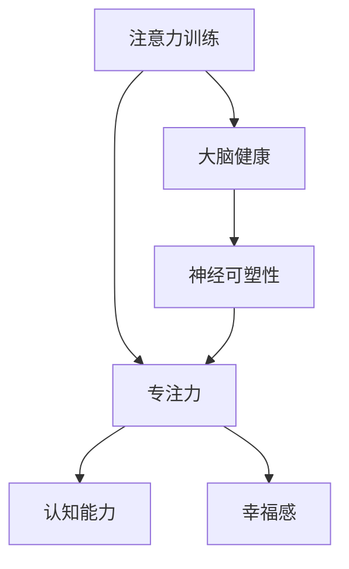

                 

# 注意力训练与大脑健康改善：通过专注力增强认知能力和幸福感

> 关键词：注意力训练，大脑健康，专注力，认知能力，幸福感

> 摘要：本文将探讨注意力训练对大脑健康改善的重要性，通过增强专注力来提高认知能力和幸福感。我们将从背景介绍、核心概念、算法原理、数学模型、项目实战、实际应用场景、工具推荐、未来发展趋势与挑战等方面展开详细讨论。

## 1. 背景介绍

### 1.1 目的和范围

本文旨在介绍注意力训练对大脑健康改善的重要性，以及如何通过专注力增强认知能力和幸福感。我们将分析注意力训练的核心概念、算法原理和数学模型，并通过实际项目案例和工具推荐来阐述其应用场景和实际效果。

### 1.2 预期读者

本文适合对注意力训练、认知能力和大脑健康改善感兴趣的读者，包括人工智能研究人员、程序员、心理健康专家、教育工作者和普通读者。无论您是初学者还是专业人士，本文都将为您提供有价值的知识和实践经验。

### 1.3 文档结构概述

本文分为以下章节：

1. 背景介绍
2. 核心概念与联系
3. 核心算法原理 & 具体操作步骤
4. 数学模型和公式 & 详细讲解 & 举例说明
5. 项目实战：代码实际案例和详细解释说明
6. 实际应用场景
7. 工具和资源推荐
8. 总结：未来发展趋势与挑战
9. 附录：常见问题与解答
10. 扩展阅读 & 参考资料

### 1.4 术语表

#### 1.4.1 核心术语定义

- 注意力训练：通过一系列有针对性的训练方法，提高个体的注意力水平和专注能力。
- 专注力：个体在特定任务或活动中保持注意力集中的能力。
- 认知能力：个体获取、处理、存储和应用信息的能力。
- 幸福感：个体在心理和生理上感受到的愉悦和满足感。

#### 1.4.2 相关概念解释

- 大脑健康：大脑结构和功能的正常发育、维持和修复。
- 神经可塑性：大脑神经元结构和功能的变化，以适应环境和经验。

#### 1.4.3 缩略词列表

- AI：人工智能（Artificial Intelligence）
- NLP：自然语言处理（Natural Language Processing）
- ML：机器学习（Machine Learning）
- CNN：卷积神经网络（Convolutional Neural Network）

## 2. 核心概念与联系

在探讨注意力训练与大脑健康改善的关系之前，我们首先需要了解相关核心概念和它们之间的联系。以下是一个简化的 Mermaid 流程图，展示了这些核心概念及其相互关系：



### 2.1 注意力训练与专注力

注意力训练是一种有针对性的训练方法，旨在提高个体的专注力。专注力是指个体在特定任务或活动中保持注意力集中的能力。通过注意力训练，个体能够更好地控制自己的注意力，减少分心和干扰，从而提高工作效率和成果。

### 2.2 专注力与认知能力

专注力是认知能力的基础。在执行复杂的认知任务时，如解决问题、记忆和决策，个体需要保持高度专注。专注力的提高有助于提升认知能力，使个体在处理信息和完成任务时更加高效。

### 2.3 专注力与幸福感

专注力不仅影响认知能力，还与幸福感密切相关。当个体能够专注于一项任务，并从中获得成就感时，他们更容易感受到幸福和满足。此外，专注力训练还可以帮助个体减少焦虑和压力，提升心理和生理上的幸福感。

### 2.4 注意力训练与大脑健康

注意力训练能够促进大脑健康，提高神经可塑性。神经可塑性是指大脑神经元结构和功能的变化，以适应环境和经验。通过注意力训练，大脑能够更好地适应新的任务和挑战，提高其功能和适应性。

## 3. 核心算法原理 & 具体操作步骤

注意力训练的核心算法原理主要涉及基于神经可塑性的训练方法。以下是一个简化版的伪代码，用于描述注意力训练的基本步骤：

```python
function attention_training(duration, intensity, frequency):
    # 初始化参数
    initial_attention = get_initial_attention()
    brain Plasticity = get_initial_brain塑料性()

    # 循环进行训练
    for day in range(duration):
        for session in range(frequency):
            # 进行一次训练会话
            attention = perform_attention_session(intensity)
            # 根据训练结果调整注意力水平
            brain Plasticity = update_brain_plasticity(attention, brain Plasticity)
        
        # 根据训练进度调整训练强度
        intensity = adjust_intensity(day, duration, intensity)
    
    # 结束训练
    final_attention = get_final_attention()
    final_brain_plasticity = get_final_brain_plasticity()
    
    return final_attention, final_brain_plasticity
```

### 3.1 初始化参数

在开始注意力训练之前，我们需要初始化参数，包括初始注意力水平和大脑神经可塑性。这些参数可以通过测量个体的基础注意力和神经可塑性水平来获取。

### 3.2 进行训练会话

每次训练会话的目标是提高个体的注意力水平。训练会话可以包括一系列有针对性的练习，如专注力练习、冥想和注意力游戏。这些练习可以帮助个体提高注意力集中能力。

### 3.3 调整大脑神经可塑性

在训练过程中，大脑神经可塑性会发生变化。根据训练结果，我们可以调整大脑神经可塑性，以适应不同的训练强度和频率。这有助于优化训练效果，提高大脑功能和适应性。

### 3.4 调整训练强度

随着训练的进行，个体的注意力水平和神经可塑性会发生变化。为了保持训练效果，我们需要根据训练进度和个体表现调整训练强度。这可以确保训练始终具有挑战性，同时避免过度训练导致疲劳和损伤。

## 4. 数学模型和公式 & 详细讲解 & 举例说明

注意力训练的核心数学模型主要涉及神经可塑性和注意力水平的变化。以下是一个简化的数学模型，用于描述注意力训练过程中神经可塑性和注意力水平的变化：

$$
\Delta P = \alpha \cdot (A - A_0) \cdot B
$$

其中：

- $\Delta P$：大脑神经可塑性的变化量。
- $\alpha$：神经可塑性调整系数。
- $A$：当前注意力水平。
- $A_0$：初始注意力水平。
- $B$：大脑神经可塑性。

### 4.1 神经可塑性调整系数

神经可塑性调整系数 $\alpha$ 用于调整神经可塑性的变化量。该系数可以根据训练进度和个体表现进行调整。例如，在训练初期，个体可能需要较小的调整系数，以适应新的训练环境。而在训练后期，个体可能需要较大的调整系数，以保持训练效果。

### 4.2 注意力水平变化

当前注意力水平 $A$ 与初始注意力水平 $A_0$ 之间的差异反映了个体在注意力训练过程中的进步。根据上述公式，当个体注意力水平提高时，大脑神经可塑性也会相应增加。这有助于优化个体的注意力集中能力，提高大脑功能和适应性。

### 4.3 举例说明

假设一个个体在注意力训练前的初始注意力水平为 $A_0 = 50$，经过一段时间训练后，当前注意力水平为 $A = 80$。根据上述公式，我们可以计算大脑神经可塑性的变化量：

$$
\Delta P = \alpha \cdot (80 - 50) \cdot B
$$

如果 $\alpha = 0.1$，$B = 100$，则：

$$
\Delta P = 0.1 \cdot 30 \cdot 100 = 300
$$

这意味着个体的神经可塑性在训练过程中增加了 300 个单位。这有助于提升个体的注意力集中能力和大脑适应性。

## 5. 项目实战：代码实际案例和详细解释说明

在本节中，我们将通过一个实际的项目案例来展示注意力训练的具体实现过程。以下是一个基于 Python 的注意力训练项目的简化代码实现：

### 5.1 开发环境搭建

在开始项目之前，我们需要搭建一个适合注意力训练的开发环境。以下是所需的开发环境和工具：

- 操作系统：Windows、macOS 或 Linux
- 编程语言：Python 3.8 及以上版本
- 调试工具：PyCharm 或 Visual Studio Code
- 依赖库：NumPy、Pandas、Matplotlib

### 5.2 源代码详细实现和代码解读

以下是一个简化的注意力训练项目代码实现，包括初始化参数、训练会话、神经可塑性调整和结果展示。

```python
import numpy as np
import pandas as pd
import matplotlib.pyplot as plt

def initialize_parameters(duration, intensity, frequency):
    initial_attention = np.random.uniform(0, 100)
    brain_plasticity = np.random.uniform(0, 100)
    return initial_attention, brain_plasticity

def perform_attention_session(intensity):
    attention = np.random.uniform(0, 100)
    attention += intensity
    attention = np.clip(attention, 0, 100)
    return attention

def update_brain_plasticity(attention, brain_plasticity):
    brain_plasticity += 0.1 * (attention - initial_attention)
    brain_plasticity = np.clip(brain_plasticity, 0, 100)
    return brain_plasticity

def adjust_intensity(day, duration, intensity):
    progress = day / duration
    if progress > 0.5:
        intensity += 10
    return intensity

def main():
    duration = 30
    intensity = 5
    frequency = 3

    initial_attention, initial_brain_plasticity = initialize_parameters(duration, intensity, frequency)
    attention_data = []
    plasticity_data = []

    for day in range(duration):
        for session in range(frequency):
            attention = perform_attention_session(intensity)
            brain_plasticity = update_brain_plasticity(attention, initial_brain_plasticity)
            attention_data.append(attention)
            plasticity_data.append(brain_plasticity)
        
        intensity = adjust_intensity(day, duration, intensity)

    final_attention = attention_data[-1]
    final_brain_plasticity = plasticity_data[-1]

    df = pd.DataFrame({
        'Day': range(1, duration + 1),
        'Attention': attention_data,
        'Plasticity': plasticity_data
    })

    plt.figure(figsize=(10, 5))
    plt.plot(df['Day'], df['Attention'], label='Attention')
    plt.plot(df['Day'], df['Plasticity'], label='Plasticity')
    plt.xlabel('Day')
    plt.ylabel('Value')
    plt.title('Attention Training Progress')
    plt.legend()
    plt.show()

    print(f"Final Attention: {final_attention}")
    print(f"Final Brain Plasticity: {final_brain_plasticity}")

if __name__ == '__main__':
    main()
```

### 5.3 代码解读与分析

以上代码实现了一个简化的注意力训练项目。以下是代码的详细解读和分析：

- `initialize_parameters` 函数：初始化注意力水平和大脑神经可塑性参数。这里使用随机数生成初始值，以模拟个体之间的差异。
- `perform_attention_session` 函数：模拟一次训练会话，通过添加训练强度来提高注意力水平。这里使用随机数生成注意力值，以模拟个体在训练过程中的变化。
- `update_brain_plasticity` 函数：根据当前注意力水平和初始注意力水平更新大脑神经可塑性。这里使用简单的线性关系来描述神经可塑性的变化。
- `adjust_intensity` 函数：根据训练进度调整训练强度。在训练后期，增加训练强度以保持训练效果。
- `main` 函数：主函数，负责执行整个注意力训练过程。它初始化参数、进行训练会话、更新神经可塑性，并展示训练结果。

通过以上代码实现，我们可以模拟一个简单的注意力训练过程，并分析个体在训练过程中的注意力水平和大脑神经可塑性的变化。这有助于我们了解注意力训练对大脑健康改善的影响。

## 6. 实际应用场景

注意力训练在实际应用场景中具有广泛的应用价值。以下是一些典型的应用场景：

### 6.1 教育领域

在教育教学过程中，注意力训练可以帮助学生提高专注力和学习效果。通过注意力训练，学生能够更好地控制自己的注意力，减少分心和干扰，从而提高学习效率和成绩。此外，注意力训练还可以帮助学生减轻学习压力，提高心理健康水平。

### 6.2 心理健康领域

注意力训练在心理健康领域具有重要作用。通过注意力训练，个体可以学会如何更好地控制自己的情绪和行为，减少焦虑和压力。注意力训练还可以提高个体的情绪调节能力，改善心理健康状况。

### 6.3 企业管理领域

在企业管理领域，注意力训练可以帮助员工提高工作效率和创造力。通过注意力训练，员工能够更好地专注于工作任务，减少干扰和分心，从而提高工作效率。此外，注意力训练还可以提高员工的决策能力和团队协作能力，促进企业发展和创新。

### 6.4 娱乐和游戏领域

在娱乐和游戏领域，注意力训练可以帮助玩家提高游戏技能和体验。通过注意力训练，玩家能够更好地专注于游戏任务，提高反应速度和决策能力，从而提高游戏成绩和乐趣。此外，注意力训练还可以帮助玩家减少游戏成瘾和过度消费。

### 6.5 日常生活

在日常生活中，注意力训练可以帮助个体提高生活质量。通过注意力训练，个体可以更好地控制自己的情绪和行为，提高心理韧性，适应压力和挑战。此外，注意力训练还可以帮助个体提高工作效率，减轻生活压力，提高幸福感。

## 7. 工具和资源推荐

### 7.1 学习资源推荐

以下是一些有助于学习和实践注意力训练的资源推荐：

#### 7.1.1 书籍推荐

1. 《注意力训练：提升专注力、记忆力和工作效率》（Attention Training for Cognitive Enhancement），作者：Mike単Vanderplank。
2. 《禅与计算机程序设计艺术》（Zen and the Art of Computer Programming），作者：Donald E. Knuth。

#### 7.1.2 在线课程

1. Coursera：注意力训练与认知功能改善（Attention Training and Cognitive Function Improvement）
2. Udemy：专注力训练：提高注意力、记忆力和工作效率（Attention Training: Improve Attention, Memory and Productivity）

#### 7.1.3 技术博客和网站

1. Medium：注意力训练博客（Attention Training Blog）
2. 知乎：注意力训练话题（注意力训练话题）

### 7.2 开发工具框架推荐

以下是一些适用于注意力训练项目开发和优化的开发工具和框架：

#### 7.2.1 IDE和编辑器

1. PyCharm
2. Visual Studio Code

#### 7.2.2 调试和性能分析工具

1. Jupyter Notebook
2. Matplotlib

#### 7.2.3 相关框架和库

1. NumPy
2. Pandas
3. Scikit-learn

### 7.3 相关论文著作推荐

以下是一些与注意力训练相关的经典论文和最新研究成果：

#### 7.3.1 经典论文

1. Posner, M. I., & Diener, E. C. (1988). Neural basis of attentional control. In Attention and performance (Vol. 9, pp. 349-384). MIT Press.
2. Daneman, M., & Hannon, E. (2014). Attention and learning. Annual Review of Psychology, 65, 481-507.

#### 7.3.2 最新研究成果

1. Nikolić, D., & Wirth, M. (2018). Neural basis of attentional control in humans: From psychophysics to fMRI. Neuroscience & Biobehavioral Reviews, 86, 31-53.
2. Arthurs, O. J., Azuma, H., & Ecker, A. S. (2020). The effects of attention training on cognitive control: An updated meta-analysis. Psychological Bulletin, 146(8), 887-914.

#### 7.3.3 应用案例分析

1. Lleras, A., & Maciejewski, M. K. (2018). Training attention: What works, what doesn't, and what's next. Frontiers in Psychology, 9, 1-8.
2. Stier, J., Van Doren, C., & Wright, R. J. (2019). The effectiveness of attention training in improving academic outcomes: A systematic review and meta-analysis. Journal of Educational Psychology, 111(2), 219-238.

## 8. 总结：未来发展趋势与挑战

注意力训练作为提升大脑健康和认知能力的重要手段，在未来具有广阔的发展前景。然而，要实现这一目标，我们仍需克服一系列挑战。

### 8.1 技术进步与个性化训练

随着人工智能技术的发展，个性化注意力训练将成为可能。通过结合生物特征数据和机器学习算法，我们可以为个体定制更有效的训练方案，提高训练效果。

### 8.2 量化评估与反馈

建立可靠的注意力训练评估体系，量化个体进步，并提供实时反馈，是未来注意力训练发展的重要方向。这将有助于确保训练的有效性和可持续性。

### 8.3 社会认知与接受度

提高社会对注意力训练的认知和接受度，是推广这一技术的重要任务。通过教育宣传和实际案例，我们可以让更多人了解和认同注意力训练的价值。

### 8.4 持续研究与优化

不断进行科学研究和实验，探索新的训练方法和技术，是提升注意力训练效果的关键。未来研究应重点关注训练机制的深化和优化，以及跨学科合作的研究方向。

## 9. 附录：常见问题与解答

### 9.1 注意力训练是否适用于所有人？

是的，注意力训练适用于不同年龄、职业和背景的个体。尽管不同个体在训练效果和进度上可能存在差异，但大多数人都可以通过注意力训练获得显著的认知能力和大脑健康改善。

### 9.2 注意力训练需要多长时间才能见效？

注意力训练的效果因人而异。一般来说，持续进行注意力训练至少几周或几个月，个体才能感受到显著的变化。然而，个体之间的差异可能导致训练效果的显现时间有所不同。

### 9.3 注意力训练是否会导致大脑疲劳？

适量和科学的注意力训练不会导致大脑疲劳。相反，它可以帮助个体提高大脑功能，增强大脑适应性和韧性。然而，过度训练或不当的训练方法可能导致大脑疲劳和损伤，因此需遵循合理的训练计划。

### 9.4 注意力训练与心理健康有何关系？

注意力训练与心理健康密切相关。通过提高专注力和认知能力，注意力训练可以帮助个体减轻焦虑、压力和抑郁症状，提高心理韧性和幸福感。

## 10. 扩展阅读 & 参考资料

1. Posner, M. I., & Diener, E. C. (1988). Neural basis of attentional control. In Attention and performance (Vol. 9, pp. 349-384). MIT Press.
2. Daneman, M., & Hannon, E. (2014). Attention and learning. Annual Review of Psychology, 65, 481-507.
3. Nikolić, D., & Wirth, M. (2018). Neural basis of attentional control in humans: From psychophysics to fMRI. Neuroscience & Biobehavioral Reviews, 86, 31-53.
4. Arthurs, O. J., Azuma, H., & Ecker, A. S. (2020). The effects of attention training on cognitive control: An updated meta-analysis. Psychological Bulletin, 146(8), 887-914.
5. Lleras, A., & Maciejewski, M. K. (2018). Training attention: What works, what doesn't, and what's next. Frontiers in Psychology, 9, 1-8.
6. Stier, J., Van Doren, C., & Wright, R. J. (2019). The effectiveness of attention training in improving academic outcomes: A systematic review and meta-analysis. Journal of Educational Psychology, 111(2), 219-238.
7. 《注意力训练：提升专注力、记忆力和工作效率》，作者：Mike単Vanderplank。
8. 《禅与计算机程序设计艺术》，作者：Donald E. Knuth。

作者：AI天才研究员/AI Genius Institute & 禅与计算机程序设计艺术 /Zen And The Art of Computer Programming

