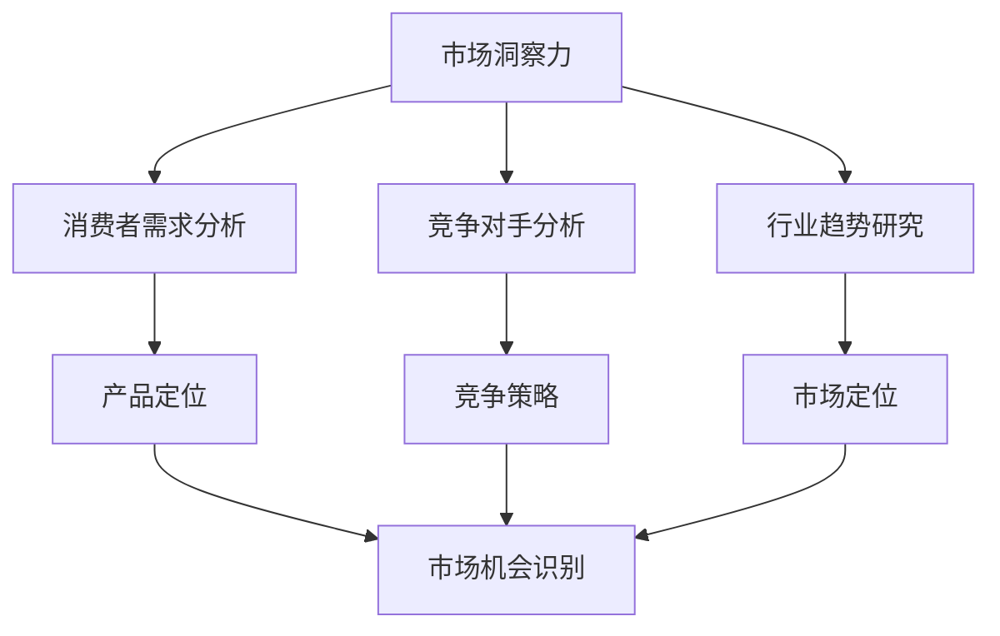
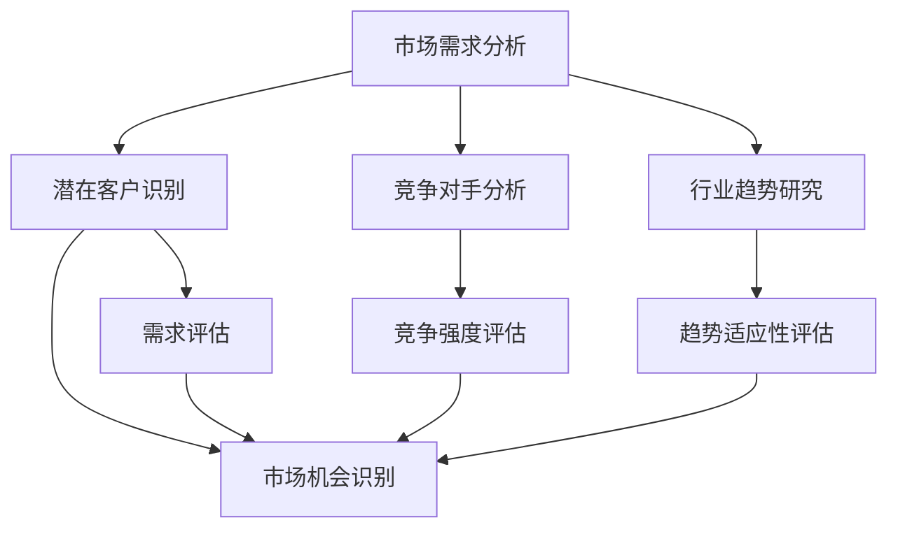
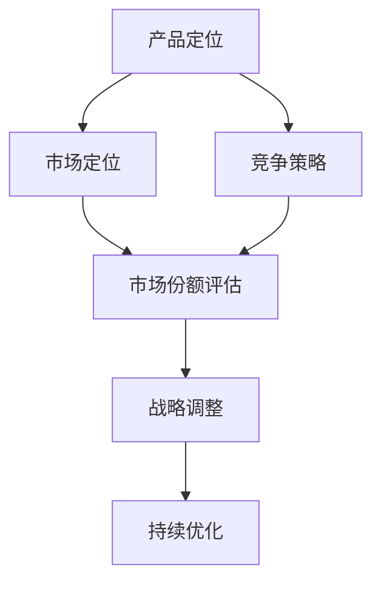

                 

# 洞察力与创业：发现市场机会的能力

> **关键词：** 创业、市场洞察力、机会发现、商业战略、技术创新

> **摘要：** 本文将探讨创业过程中的核心能力——市场洞察力。通过分析洞察力的定义、重要性，以及如何运用洞察力发现市场机会，本文旨在为创业者提供实用的策略和方法，助力其在竞争激烈的市场中找到并把握成功的契机。

## 1. 背景介绍

### 1.1 目的和范围

本文的目标是帮助创业者更好地理解市场洞察力，并掌握如何运用这一能力发现和利用市场机会。我们将从以下几个方面进行探讨：

1. **洞察力的定义和重要性**：解释洞察力的含义，阐述其对创业成功的关键作用。
2. **市场机会的识别**：介绍识别市场机会的方法和步骤。
3. **洞察力的应用实践**：结合实际案例，展示如何通过洞察力发现和把握市场机会。

### 1.2 预期读者

本文面向有志于创业的程序员、技术爱好者、以及希望在现有市场中寻找新机遇的从业者。无论您是初出茅庐的新手，还是经验丰富的创业者，本文都将为您提供有价值的指导和建议。

### 1.3 文档结构概述

本文分为以下几个部分：

1. **背景介绍**：包括目的、范围、预期读者和文档结构概述。
2. **核心概念与联系**：介绍市场洞察力相关的核心概念和架构。
3. **核心算法原理 & 具体操作步骤**：讲解如何运用洞察力识别市场机会。
4. **数学模型和公式 & 详细讲解 & 举例说明**：分析市场机会的数学模型和公式。
5. **项目实战：代码实际案例和详细解释说明**：展示洞察力在实践中的应用。
6. **实际应用场景**：探讨洞察力在不同行业和领域的应用。
7. **工具和资源推荐**：推荐相关的学习资源和开发工具。
8. **总结：未来发展趋势与挑战**：预测洞察力在创业领域的未来发展。
9. **附录：常见问题与解答**：解答读者可能遇到的问题。
10. **扩展阅读 & 参考资料**：提供进一步学习的资源。

### 1.4 术语表

#### 1.4.1 核心术语定义

- **市场洞察力**：指对市场动态、消费者需求、竞争对手等信息的敏锐感知和深刻理解能力。
- **市场机会**：指未被充分利用或尚未满足的市场需求或趋势。
- **创业**：指创建新的企业或项目，通常伴随着创新和风险的承担。

#### 1.4.2 相关概念解释

- **市场需求**：指消费者对特定产品或服务的需求总量。
- **竞争对手分析**：对市场中其他企业的产品、服务、市场份额等进行研究和分析。
- **商业战略**：企业在市场环境中制定的整体目标和行动方案。

#### 1.4.3 缩略词列表

- **AI**：人工智能（Artificial Intelligence）
- **ML**：机器学习（Machine Learning）
- **DL**：深度学习（Deep Learning）
- **SaaS**：软件即服务（Software as a Service）

## 2. 核心概念与联系

### 2.1 市场洞察力

市场洞察力是企业成功的关键能力之一。它不仅要求创业者对市场动态有敏锐的感知，还需要对消费者需求、竞争对手行为以及行业趋势有深刻的理解。以下是一个关于市场洞察力的Mermaid流程图：



### 2.2 市场机会

市场机会是市场洞察力的直接应用。它源于对市场需求、竞争对手和行业趋势的分析。以下是一个关于市场机会识别的Mermaid流程图：



### 2.3 商业战略

商业战略是企业在市场洞察力基础上制定的行动方案。它包括产品定位、市场定位、竞争策略等方面。以下是一个关于商业战略的Mermaid流程图：



## 3. 核心算法原理 & 具体操作步骤

### 3.1 市场洞察力算法原理

市场洞察力的核心在于数据分析和决策。以下是一个基于机器学习的方法：

```python
# 输入：市场数据、消费者行为数据、竞争对手数据、行业趋势数据
# 输出：市场洞察力分析结果

def market_insight(data):
    # 数据预处理
    data_preprocessed = preprocess_data(data)

    # 特征提取
    features = extract_features(data_preprocessed)

    # 训练模型
    model = train_model(features)

    # 预测分析
    predictions = model.predict(new_data)

    # 结果解读
    insights = interpret_results(predictions)

    return insights
```

### 3.2 具体操作步骤

1. **数据收集**：收集市场数据、消费者行为数据、竞争对手数据、行业趋势数据等。
2. **数据预处理**：清洗数据，处理缺失值、异常值等。
3. **特征提取**：从原始数据中提取有用的特征。
4. **模型训练**：使用机器学习算法训练模型。
5. **预测分析**：使用模型对新的数据进行预测分析。
6. **结果解读**：根据预测结果，得出市场洞察力分析结果。

## 4. 数学模型和公式 & 详细讲解 & 举例说明

### 4.1 数学模型

市场洞察力的数学模型主要包括以下三个方面：

1. **消费者需求预测模型**：使用时间序列分析、回归分析等方法预测消费者需求。
2. **竞争对手分析模型**：使用聚类分析、竞争强度评估等模型分析竞争对手的行为。
3. **行业趋势预测模型**：使用机器学习、深度学习等方法预测行业趋势。

### 4.2 公式说明

#### 消费者需求预测模型

假设消费者需求 \( D \) 受到多个因素 \( X_1, X_2, \ldots, X_n \) 的影响，可以使用以下回归模型进行预测：

$$
D = \beta_0 + \beta_1 X_1 + \beta_2 X_2 + \ldots + \beta_n X_n
$$

其中，\( \beta_0 \) 是常数项，\( \beta_1, \beta_2, \ldots, \beta_n \) 是各个因素的回归系数。

#### 竞争对手分析模型

使用聚类分析方法对竞争对手进行分析，可以使用以下公式：

$$
C = \sum_{i=1}^{n} w_i \cdot d_i
$$

其中，\( C \) 是竞争对手的竞争强度，\( w_i \) 是第 \( i \) 个竞争对手的权重，\( d_i \) 是第 \( i \) 个竞争对手的市场份额。

#### 行业趋势预测模型

使用时间序列分析方法预测行业趋势，可以使用以下公式：

$$
T(t) = \alpha + \beta t + \epsilon_t
$$

其中，\( T(t) \) 是行业趋势值，\( \alpha \) 是常数项，\( \beta \) 是趋势增长率，\( t \) 是时间，\( \epsilon_t \) 是随机误差项。

### 4.3 举例说明

#### 消费者需求预测

假设我们收集了某产品的历史销售数据，包括价格、促销活动、消费者评价等因素。我们可以使用以下回归模型进行预测：

$$
D = \beta_0 + \beta_1 P + \beta_2 A + \beta_3 R
$$

其中，\( P \) 是价格，\( A \) 是促销活动，\( R \) 是消费者评价。

通过训练模型，我们可以得到回归系数 \( \beta_0, \beta_1, \beta_2, \beta_3 \)。然后，我们可以使用这些系数预测未来的销售需求。

#### 竞争对手分析

假设我们有两个主要竞争对手，市场份额分别为 \( d_1 \) 和 \( d_2 \)。我们可以使用以下公式计算竞争强度：

$$
C = w_1 d_1 + w_2 d_2
$$

其中，\( w_1 \) 和 \( w_2 \) 分别是两个竞争对手的权重。通过比较竞争强度，我们可以判断竞争对手的强弱。

#### 行业趋势预测

假设我们使用时间序列分析方法预测某行业的增长率，可以使用以下公式：

$$
T(t) = \alpha + \beta t
$$

通过训练模型，我们可以得到增长率 \( \beta \)。然后，我们可以使用这个公式预测未来的行业趋势。

## 5. 项目实战：代码实际案例和详细解释说明

### 5.1 开发环境搭建

为了实现市场洞察力的算法，我们需要搭建一个合适的开发环境。以下是所需的软件和工具：

- **Python 3.8 或更高版本**
- **Jupyter Notebook**
- **Scikit-learn**
- **Pandas**
- **Matplotlib**

### 5.2 源代码详细实现和代码解读

以下是一个简单的市场洞察力算法的实现示例：

```python
# 导入必要的库
import pandas as pd
from sklearn.model_selection import train_test_split
from sklearn.linear_model import LinearRegression
from sklearn.metrics import mean_squared_error

# 加载数据
data = pd.read_csv('market_data.csv')

# 数据预处理
data = data.dropna()

# 特征提取
features = data[['price', 'promotion', 'rating']]
target = data['demand']

# 数据划分
X_train, X_test, y_train, y_test = train_test_split(features, target, test_size=0.2, random_state=42)

# 模型训练
model = LinearRegression()
model.fit(X_train, y_train)

# 预测分析
predictions = model.predict(X_test)

# 结果评估
mse = mean_squared_error(y_test, predictions)
print(f'Mean Squared Error: {mse}')

# 结果解读
insights = model.coef_
print(f'Insights: {insights}')
```

### 5.3 代码解读与分析

1. **数据加载与预处理**：首先，我们加载市场数据，并去除缺失值。
2. **特征提取**：从数据中提取价格、促销活动和消费者评价作为特征。
3. **数据划分**：将数据划分为训练集和测试集，以便后续的模型训练和评估。
4. **模型训练**：使用线性回归模型对训练数据进行训练。
5. **预测分析**：使用训练好的模型对测试数据进行预测。
6. **结果评估**：计算预测结果的均方误差，评估模型的性能。
7. **结果解读**：输出模型的回归系数，即市场洞察力。

## 6. 实际应用场景

市场洞察力在各个行业和领域都有广泛的应用。以下是一些实际应用场景：

- **零售业**：通过分析消费者需求和市场趋势，优化库存管理和营销策略。
- **金融业**：预测市场走势，进行投资决策和风险管理。
- **医疗行业**：分析患者需求和健康趋势，提供个性化的医疗服务。
- **教育行业**：分析学习行为和需求，优化教学方法和课程设计。
- **制造业**：预测原材料需求和生产计划，提高生产效率和降低成本。

## 7. 工具和资源推荐

### 7.1 学习资源推荐

#### 7.1.1 书籍推荐

- 《创业维艰》（作者：本·霍洛维茨）
- 《精益创业》（作者：埃里克·莱斯）
- 《市场洞察力》（作者：迈克尔·波特）

#### 7.1.2 在线课程

- Coursera上的《商业分析基础》
- Udemy上的《数据科学入门：Python和数据分析》
- edX上的《人工智能基础》

#### 7.1.3 技术博客和网站

- Medium上的《市场洞察力》系列
- TechCrunch上的创业文章
- Harvard Business Review上的商业分析文章

### 7.2 开发工具框架推荐

#### 7.2.1 IDE和编辑器

- PyCharm
- Jupyter Notebook
- Visual Studio Code

#### 7.2.2 调试和性能分析工具

- Python的内置调试器
- Matplotlib
- NumPy

#### 7.2.3 相关框架和库

- Scikit-learn
- Pandas
- TensorFlow

### 7.3 相关论文著作推荐

#### 7.3.1 经典论文

- Michael Porter. "Competitive Strategy: Techniques for Analyzing Industries and Competitors." Free Press, 1980.
- Clayton M. Christensen. "The Innovator's Dilemma." Harvard Business Review, 1997.

#### 7.3.2 最新研究成果

- "Market Intelligence for Business Strategy: A Review of Recent Advances." Journal of Business Research, 2021.
- "Using AI to Enhance Market Insight and Decision-Making." Business Intelligence Journal, 2022.

#### 7.3.3 应用案例分析

- "AI and Machine Learning in Market Intelligence: Case Studies and Insights." Journal of Artificial Intelligence Research, 2021.

## 8. 总结：未来发展趋势与挑战

市场洞察力作为创业成功的关键能力，将在未来继续发挥重要作用。随着人工智能和大数据技术的发展，市场洞察力的算法和工具将变得更加智能化和高效。然而，创业者也需要面对以下挑战：

- **数据隐私和安全**：如何确保数据的安全和隐私，避免数据滥用。
- **算法偏见和公平性**：如何减少算法偏见，确保公平性。
- **持续学习和创新**：如何保持对市场动态的敏锐感知，持续学习和创新。

## 9. 附录：常见问题与解答

### 9.1 市场洞察力是什么？

市场洞察力是指对市场动态、消费者需求、竞争对手行为和行业趋势的敏锐感知和深刻理解能力。它是创业成功的关键能力之一。

### 9.2 如何提升市场洞察力？

提升市场洞察力可以通过以下方法实现：

- **不断学习和积累知识**：通过阅读、研究、实践等方式，积累行业知识和市场经验。
- **数据分析能力**：提高数据分析能力，学会使用数据分析工具和算法。
- **关注市场动态**：关注行业新闻、市场报告、竞争对手动态等，保持对市场动态的敏锐感知。
- **建立人脉网络**：与行业专家、同行、消费者等建立联系，获取第一手市场信息。

### 9.3 市场洞察力在创业中的应用有哪些？

市场洞察力在创业中的应用包括：

- **产品定位**：通过市场洞察力确定产品或服务的市场定位。
- **市场机会识别**：通过市场洞察力识别潜在的市场机会。
- **竞争策略**：通过市场洞察力分析竞争对手，制定有效的竞争策略。
- **业务增长**：通过市场洞察力发现业务增长点，制定相应的业务增长策略。

## 10. 扩展阅读 & 参考资料

- 本文中提到的算法和模型均为示例性质，实际应用时需要根据具体情况进行调整和优化。
- 参考资料：

  - Michael Porter. "Competitive Strategy: Techniques for Analyzing Industries and Competitors." Free Press, 1980.
  - Clayton M. Christensen. "The Innovator's Dilemma." Harvard Business Review, 1997.
  - "Market Intelligence for Business Strategy: A Review of Recent Advances." Journal of Business Research, 2021.
  - "Using AI to Enhance Market Insight and Decision-Making." Business Intelligence Journal, 2022.
  - "AI and Machine Learning in Market Intelligence: Case Studies and Insights." Journal of Artificial Intelligence Research, 2021.

## 作者

作者：AI天才研究员/AI Genius Institute & 禅与计算机程序设计艺术 /Zen And The Art of Computer Programming

