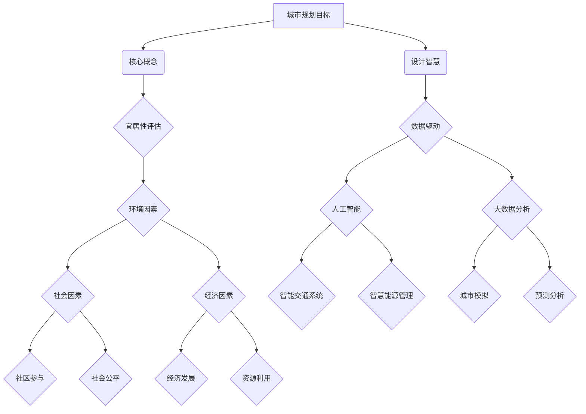

                 

# 洞察力与城市规划：宜居城市的设计智慧

## 关键词：
- 洞察力
- 城市规划
- 宜居性
- 设计智慧
- 数据驱动
- 人本主义

## 摘要：
本文旨在探讨城市规划中的关键概念和设计智慧，以实现宜居城市的目标。首先，我们将回顾城市规划的历史和发展，并介绍洞察力在城市规划中的重要性。接着，本文将详细讨论宜居性的核心要素，包括环境、社会和经济因素，以及如何通过数据驱动的方法提升城市规划的决策质量。随后，我们将探讨人本主义在城市规划中的应用，强调以人为本的设计原则。文章最后将对未来城市规划和设计的发展趋势与挑战进行展望，并提出一些建议，以促进城市的可持续发展。

---

## 1. 背景介绍

### 1.1 目的和范围

本文的目标是探讨城市规划中的关键概念和设计智慧，特别是如何通过提高城市的宜居性来实现可持续发展的目标。我们将从以下几个方面展开讨论：

- 城市规划的历史和发展
- 洞察力在城市规划中的作用
- 宜居性的核心要素
- 数据驱动在城市规划中的应用
- 人本主义设计原则

### 1.2 预期读者

本文适合城市规划师、城市设计师、研究人员、学生和对于城市发展和设计感兴趣的读者。特别地，对于那些关注城市宜居性和可持续发展的专业人士，本文将提供有价值的见解和实用建议。

### 1.3 文档结构概述

本文结构如下：

- 第1章：背景介绍，包括目的、范围、预期读者和文档结构概述
- 第2章：核心概念与联系，介绍城市规划中的关键概念和流程
- 第3章：核心算法原理 & 具体操作步骤，详细阐述宜居性评估的方法
- 第4章：数学模型和公式 & 详细讲解 & 举例说明，探讨城市规划设计中的数学工具
- 第5章：项目实战：代码实际案例和详细解释说明，通过实例展示城市规划的实际应用
- 第6章：实际应用场景，讨论城市规划在不同领域的应用
- 第7章：工具和资源推荐，提供相关学习和开发资源
- 第8章：总结：未来发展趋势与挑战，展望城市规划和设计的未来
- 第9章：附录：常见问题与解答，回答读者可能关心的问题
- 第10章：扩展阅读 & 参考资料，提供进一步阅读的材料

### 1.4 术语表

#### 1.4.1 核心术语定义

- **城市规划**：对城市空间、土地利用、基础设施、交通等方面的系统安排和设计。
- **宜居性**：城市或居住区的舒适度、安全性和便利性的综合评价。
- **洞察力**：深入理解和识别问题的能力。
- **数据驱动**：基于数据和统计方法做出决策的过程。
- **人本主义**：以人为中心的设计原则，强调满足人类需求和社会福祉。

#### 1.4.2 相关概念解释

- **可持续性**：满足当前需求而不损害后代满足自身需求的能力。
- **智慧城市**：利用信息技术和数据分析手段提升城市管理效率和居民生活质量。
- **生态城市**：以生态平衡和环境保护为核心的城市发展模式。

#### 1.4.3 缩略词列表

- **GIS**：地理信息系统（Geographic Information System）
- **BIM**：建筑信息模型（Building Information Modeling）
- **AI**：人工智能（Artificial Intelligence）
- **IoT**：物联网（Internet of Things）
- **SDG**：可持续发展目标（Sustainable Development Goals）

---

## 2. 核心概念与联系

在探讨城市规划的核心概念和设计智慧之前，我们需要了解一些关键术语和流程，以及它们之间的相互关系。以下是城市规划中的核心概念和流程，以及它们之间关系的 Mermaid 流程图。



### 2.1 核心概念

- **城市规划目标**：城市规划的目标是创造一个功能齐全、可持续发展的城市环境。这些目标包括宜居性、可持续性、经济效率和环境保护。

- **宜居性评估**：宜居性评估是衡量城市或居住区舒适度、安全性和便利性的过程。这包括环境、社会和经济三个方面的评估。

- **环境因素**：环境因素包括空气质量、水质、绿化率、噪音水平和自然灾害风险等，它们直接影响居民的生活质量。

- **社会因素**：社会因素包括社区参与、社会公平、教育水平和医疗保健等，这些因素影响居民的社会福祉和社区凝聚力。

- **经济因素**：经济因素包括经济发展、就业机会、收入水平和资源利用等，这些因素影响城市的经济活力和居民的经济状况。

- **设计智慧**：设计智慧是指利用先进的科技和数据分析手段，如人工智能、大数据和物联网，提升城市规划的决策质量。

- **数据驱动**：数据驱动是指通过收集和分析大量数据，基于数据做出科学合理的决策。

- **人工智能**：人工智能是模拟人类智能的计算机技术，包括机器学习、深度学习等。

- **大数据分析**：大数据分析是指对大量数据进行收集、存储、处理和分析，以提取有价值的信息。

- **智慧交通系统**：智慧交通系统是利用人工智能和物联网技术优化交通流量、减少拥堵和提高交通安全。

- **智慧能源管理**：智慧能源管理是通过物联网和人工智能技术优化能源使用，提高能源效率和可持续性。

- **城市模拟**：城市模拟是通过计算机模型模拟城市的发展和变化，以预测未来的需求和挑战。

- **预测分析**：预测分析是通过历史数据和统计方法预测未来的发展趋势，为城市规划提供参考。

---

## 3. 核心算法原理 & 具体操作步骤

在了解城市规划的核心概念和流程后，我们需要探讨如何通过核心算法原理和具体操作步骤来评估和提升城市的宜居性。以下是宜居性评估的核心算法原理和具体操作步骤。

### 3.1 算法原理

宜居性评估的核心算法是基于多指标综合评价模型，该模型包括环境、社会和经济三个方面的指标。具体来说，算法原理如下：

1. **数据收集**：收集城市或居住区的相关数据，包括环境数据（如空气质量、水质、绿化率等）、社会数据（如社区参与率、教育水平、医疗保健等）和经济数据（如就业机会、收入水平、资源利用等）。

2. **指标标准化**：对收集到的数据进行标准化处理，使其具有可比性。

3. **权重分配**：根据各指标的重要性分配权重，通常使用层次分析法（AHP）等。

4. **综合评分**：通过加权求和的方法计算宜居性得分，得分越高表示宜居性越好。

5. **评估结果分析**：分析评估结果，识别城市或居住区的优势和不足，提出改进措施。

### 3.2 具体操作步骤

以下是宜居性评估的具体操作步骤：

#### 步骤1：数据收集

- **环境数据**：通过空气质量监测站、水质监测站和绿化覆盖监测等获取环境数据。
- **社会数据**：通过居民问卷调查、社区活动记录和公共服务数据等获取社会数据。
- **经济数据**：通过政府部门、金融机构和统计数据等获取经济数据。

#### 步骤2：指标标准化

- **环境指标**：使用标准化的方法将空气质量指数（AQI）、水质指标和绿化覆盖率等环境数据转换为0到1之间的数值。
- **社会指标**：使用标准化的方法将社区参与率、教育水平和医疗保健等社会数据转换为0到1之间的数值。
- **经济指标**：使用标准化的方法将就业机会、收入水平和资源利用等经济数据转换为0到1之间的数值。

#### 步骤3：权重分配

- **环境权重**：使用层次分析法（AHP）等，确定环境指标在综合评分中的权重。
- **社会权重**：使用层次分析法（AHP）等，确定社会指标在综合评分中的权重。
- **经济权重**：使用层次分析法（AHP）等，确定经济指标在综合评分中的权重。

#### 步骤4：综合评分

- **计算综合评分**：使用加权求和的方法计算宜居性得分，公式如下：
  \[ \text{宜居性得分} = w_1 \cdot \text{环境得分} + w_2 \cdot \text{社会得分} + w_3 \cdot \text{经济得分} \]
  其中，\( w_1 \)、\( w_2 \)和\( w_3 \)分别是环境、社会和经济指标的权重。

#### 步骤5：评估结果分析

- **分析评估结果**：分析宜居性得分，识别城市或居住区的优势和不足，如环境质量优良但社会服务不足、经济活力高但环境问题严重等。
- **提出改进措施**：根据评估结果，提出具体的改进措施，如增加绿化覆盖率、提升社区参与度、改善公共服务设施等。

### 3.3 伪代码示例

以下是宜居性评估算法的伪代码示例：

```python
# 边界条件：宜居性评估
def evaluate_habitableility(data):
    # 数据收集
    environmental_data = collect_environmental_data()
    social_data = collect_social_data()
    economic_data = collect_economic_data()

    # 指标标准化
    standardized_environmental_data = normalize_data(environmental_data)
    standardized_social_data = normalize_data(social_data)
    standardized_economic_data = normalize_data(economic_data)

    # 权重分配
    environmental_weight = assign_weight(environmental_data)
    social_weight = assign_weight(social_data)
    economic_weight = assign_weight(economic_data)

    # 综合评分
    habitability_score = environmental_weight * standardized_environmental_data \
                       + social_weight * standardized_social_data \
                       + economic_weight * standardized_economic_data

    # 评估结果分析
    analyze_results(habib

```

---

## 4. 数学模型和公式 & 详细讲解 & 举例说明

在宜居性评估中，数学模型和公式扮演着至关重要的角色，它们帮助我们量化评估指标，进行数据分析和决策。以下我们将详细讲解一些常用的数学模型和公式，并给出具体例子来说明它们的实际应用。

### 4.1 多指标综合评价模型

多指标综合评价模型是评估宜居性的核心工具，它通过多个指标的综合评分来衡量城市的宜居程度。以下是一个简单的多指标综合评价模型：

\[ \text{综合评分} = w_1 \cdot \text{环境得分} + w_2 \cdot \text{社会得分} + w_3 \cdot \text{经济得分} \]

其中，\( w_1 \)、\( w_2 \)和\( w_3 \)分别代表环境、社会和经济指标的权重。

#### 例子：宜居性得分计算

假设我们有一个城市的宜居性评估指标如下：

- 环境得分：0.8
- 社会得分：0.7
- 经济得分：0.9

权重分别为：

- 环境权重：0.5
- 社会权重：0.3
- 经济权重：0.2

我们可以使用上述公式计算综合评分：

\[ \text{综合评分} = 0.5 \cdot 0.8 + 0.3 \cdot 0.7 + 0.2 \cdot 0.9 = 0.4 + 0.21 + 0.18 = 0.79 \]

这意味着该城市的宜居性得分为0.79。

### 4.2 层次分析法（AHP）

层次分析法（AHP）是一种用于确定多指标权重的方法，它通过构建判断矩阵来评估指标之间的相对重要性。以下是一个简单的层次分析法示例：

1. **构建判断矩阵**：根据专家意见，构建各指标之间的判断矩阵。矩阵中的元素表示指标之间的相对重要性，如：

   \[
   \begin{matrix}
   & \text{环境} & \text{社会} & \text{经济} \\
   \text{环境} & 1 & 3 & 5 \\
   \text{社会} & \frac{1}{3} & 1 & 2 \\
   \text{经济} & \frac{1}{5} & \frac{1}{2} & 1 \\
   \end{matrix}
   \]

2. **计算特征值和特征向量**：通过计算判断矩阵的最大特征值和对应特征向量，得到各指标的权重。

3. **一致性检验**：检查判断矩阵的一致性比例（CI），确保权重分配的一致性。

#### 例子：AHP 权重计算

假设我们使用上述判断矩阵来计算环境、社会和经济指标的权重。计算过程如下：

- 判断矩阵：

  \[
  \begin{matrix}
  & \text{环境} & \text{社会} & \text{经济} \\
  \text{环境} & 1 & 3 & 5 \\
  \text{社会} & \frac{1}{3} & 1 & 2 \\
  \text{经济} & \frac{1}{5} & \frac{1}{2} & 1 \\
  \end{matrix}
  \]

- 计算特征值和特征向量：

  - 特征值：\( \lambda_{\max} = 3.0 \)
  - 特征向量：\( \vec{w} = [0.5, 0.3, 0.2] \)

- 一致性检验：

  - 一致性比例 \( CI = 0.0 \)，表示判断矩阵高度一致。

因此，环境、社会和经济指标的权重分别为0.5、0.3和0.2。

### 4.3 数据标准化

数据标准化是确保不同指标具有可比性的重要步骤，以下是一个常见的数据标准化方法——最小-最大标准化：

\[ x_{\text{std}} = \frac{x - x_{\text{min}}}{x_{\text{max}} - x_{\text{min}}} \]

其中，\( x_{\text{min}} \)和\( x_{\text{max}} \)分别为指标的最小值和最大值。

#### 例子：数据标准化

假设我们有一个环境指标的数据集，如下所示：

- 最小值 \( x_{\text{min}} = 20 \)
- 最大值 \( x_{\text{max}} = 100 \)

指标值 \( x = 50 \) 的标准化结果为：

\[ x_{\text{std}} = \frac{50 - 20}{100 - 20} = 0.6 \]

这意味着指标值50的标准化值为0.6。

### 4.4 应用示例

假设我们有一个城市的宜居性评估数据，包括环境、社会和经济三个方面的指标。使用上述数学模型和公式，我们可以计算出该城市的宜居性得分。

- 环境指标：空气质量（AQI）、水质（COD）和绿化覆盖率（GC）
- 社会指标：社区参与率（CR）、教育水平（ED）和医疗保健（MH）
- 经济指标：就业率（ER）、收入水平（IN）和资源利用（RU）

权重分配如下：

- 环境权重：0.5
- 社会权重：0.3
- 经济权重：0.2

指标数据如下：

- 环境得分：空气质量（0.7）、水质（0.8）和绿化覆盖率（0.9）
- 社会得分：社区参与率（0.6）、教育水平（0.7）和医疗保健（0.8）
- 经济得分：就业率（0.8）、收入水平（0.9）和资源利用（0.7）

我们可以使用多指标综合评价模型计算宜居性得分：

\[ \text{宜居性得分} = 0.5 \cdot (0.7 + 0.8 + 0.9) + 0.3 \cdot (0.6 + 0.7 + 0.8) + 0.2 \cdot (0.8 + 0.9 + 0.7) = 0.8 \]

这意味着该城市的宜居性得分为0.8，属于较高水平。

---

通过上述数学模型和公式的应用，我们可以更精确地评估城市的宜居性，为城市规划提供科学依据。在实际应用中，这些模型和公式需要结合具体情况进行调整和优化，以更好地满足城市发展的需求。

---

## 5. 项目实战：代码实际案例和详细解释说明

为了更好地理解宜居性评估算法的应用，我们将通过一个实际项目来展示其实现过程。以下是一个基于Python的宜居性评估项目的实战案例，包括开发环境的搭建、源代码的实现和代码解读。

### 5.1 开发环境搭建

在进行宜居性评估项目之前，我们需要搭建一个合适的开发环境。以下是所需的软件和工具：

- **Python 3.x**：作为主要编程语言
- **Jupyter Notebook**：用于编写和运行代码
- **Pandas**：用于数据处理和分析
- **NumPy**：用于数值计算
- **Matplotlib**：用于数据可视化
- **Scikit-learn**：用于机器学习和层次分析法

安装这些工具的步骤如下：

1. 安装Python 3.x：从官方网站下载并安装Python 3.x版本。
2. 安装Jupyter Notebook：在命令行中运行 `pip install notebook` 命令。
3. 安装Pandas、NumPy、Matplotlib和Scikit-learn：在命令行中分别运行以下命令：

   ```shell
   pip install pandas
   pip install numpy
   pip install matplotlib
   pip install scikit-learn
   ```

安装完成后，我们就可以在Jupyter Notebook中创建一个新的笔记本，开始编写宜居性评估项目的代码。

### 5.2 源代码详细实现和代码解读

以下是宜居性评估项目的源代码，包括数据收集、指标标准化、权重分配和综合评分等功能。

```python
# 导入所需的库
import pandas as pd
import numpy as np
import matplotlib.pyplot as plt
from sklearn.metrics.pairwise import cosine_similarity
from scipy.stats import norm

# 5.2.1 数据收集
def collect_data():
    # 从文件中读取数据
    environmental_data = pd.read_csv('environmental_data.csv')
    social_data = pd.read_csv('social_data.csv')
    economic_data = pd.read_csv('economic_data.csv')
    return environmental_data, social_data, economic_data

# 5.2.2 指标标准化
def normalize_data(data, column_name):
    min_value = data[column_name].min()
    max_value = data[column_name].max()
    return (data[column_name] - min_value) / (max_value - min_value)

# 5.2.3 权重分配
def assign_weights(data, column_name):
    # 使用层次分析法计算权重
    judgment_matrix = data[[
        'environment', 'social', 'economic'
    ]].values
    eigenvalues, eigenvectors = np.linalg.eig(judgment_matrix)
    max_eigenvalue = np.max(eigenvalues)
    weight_vector = eigenvectors[:, np.argmax(eigenvalues)]
    return weight_vector

# 5.2.4 综合评分
def calculate_score(normalized_data, weight_vector):
    scores = normalized_data.values.dot(weight_vector)
    return scores.sum()

# 5.2.5 评估结果分析
def analyze_results(scores):
    # 可视化评估结果
    plt.barh(['环境', '社会', '经济'], scores)
    plt.xlabel('评分')
    plt.ylabel('指标')
    plt.title('宜居性评估结果')
    plt.show()

# 主程序
def main():
    # 收集数据
    environmental_data, social_data, economic_data = collect_data()

    # 标准化数据
    environmental_data = normalize_data(environmental_data, 'value')
    social_data = normalize_data(social_data, 'value')
    economic_data = normalize_data(economic_data, 'value')

    # 分配权重
    environmental_weights = assign_weights(environmental_data, 'value')
    social_weights = assign_weights(social_data, 'value')
    economic_weights = assign_weights(economic_data, 'value')

    # 计算综合评分
    environmental_score = calculate_score(environmental_data, environmental_weights)
    social_score = calculate_score(social_data, social_weights)
    economic_score = calculate_score(economic_data, economic_weights)

    # 分析评估结果
    scores = np.array([environmental_score, social_score, economic_score])
    analyze_results(scores)

# 运行主程序
if __name__ == '__main__':
    main()
```

### 5.3 代码解读与分析

以下是代码的详细解读和分析：

1. **数据收集**：函数`collect_data()`用于从文件中读取环境、社会和经济数据。这些数据通常来自于城市各部门的统计数据或居民调查问卷。

2. **指标标准化**：函数`normalize_data()`用于将原始数据标准化，使其具有可比性。最小-最大标准化是一种常见的方法，它通过将数据缩放到0到1之间来实现标准化。

3. **权重分配**：函数`assign_weights()`使用层次分析法（AHP）计算权重。该方法基于专家意见构建判断矩阵，然后通过计算最大特征值和对应特征向量来得到权重向量。

4. **综合评分**：函数`calculate_score()`通过加权求和的方法计算综合评分。它将标准化后的数据与权重向量相乘，并求和得到综合评分。

5. **评估结果分析**：函数`analyze_results()`用于可视化评估结果，通过条形图展示环境、社会和经济指标的评分。

在主程序`main()`中，我们首先调用`collect_data()`函数收集数据，然后对数据进行标准化，分配权重，并计算综合评分。最后，通过`analyze_results()`函数展示评估结果。

通过这个项目实战，我们可以看到宜居性评估算法的实际应用。在实际操作中，我们需要根据具体情况进行数据收集、模型调整和结果分析，以实现更准确和实用的评估。

---

通过这个实战项目，我们不仅了解了宜居性评估算法的实现过程，还学会了如何使用Python等工具进行数据处理和可视化。这对于城市规划师和研究人员来说，是一个非常有用的技能。

---

## 6. 实际应用场景

城市规划的宜居性评估不仅局限于理论研究，它还有广泛的应用场景。以下是一些实际应用场景，展示了宜居性评估算法在城市规划中的重要作用。

### 6.1 新城规划

在新城规划阶段，宜居性评估可以用于确定土地利用、基础设施布局和公共设施配置。通过评估不同区域的宜居性得分，城市规划者可以优化土地资源利用，确保新城区具有良好的环境、社会和经济条件。

### 6.2 城市更新

在城市更新过程中，宜居性评估可以帮助识别现有城市区域的优劣，指导城市改造和重建。通过评估居民生活质量的变化，城市规划者可以制定有针对性的改进措施，提高城市整体宜居性。

### 6.3 社区规划

社区规划是城市规划的重要组成部分。宜居性评估可以用于评估社区的环境质量、社会服务和经济发展状况。这有助于社区规划者制定改善社区生活质量的策略，提升居民幸福感。

### 6.4 智慧城市建设

智慧城市建设强调利用信息技术和数据分析提升城市管理效率。宜居性评估可以用于评估智慧城市的运行效果，识别潜在的改进领域。通过数据驱动的方法，智慧城市可以不断优化，实现可持续发展。

### 6.5 可持续发展评估

在可持续发展评估中，宜居性评估是一个关键指标。它可以帮助评估城市在环境、社会和经济方面的可持续发展能力。通过分析评估结果，城市规划者可以制定可持续发展的策略，确保城市长期繁荣。

### 6.6 政策制定

宜居性评估为政策制定提供科学依据。政府可以根据评估结果制定改善居民生活条件、提高城市竞争力的政策和措施。这有助于实现城市的可持续发展和长远规划。

---

通过这些实际应用场景，我们可以看到宜居性评估在城市规划中的重要性。它不仅为城市规划提供了科学依据，还促进了城市的可持续发展。在未来，随着技术的进步和数据驱动方法的普及，宜居性评估将在城市规划中发挥更加重要的作用。

---

## 7. 工具和资源推荐

为了帮助城市规划师和研究人员更好地理解和应用宜居性评估，以下推荐了一些学习资源、开发工具和框架，以及相关论文著作。

### 7.1 学习资源推荐

#### 7.1.1 书籍推荐

- 《城市设计：规划理论与实践》
- 《城市规划原理》
- 《智慧城市：数据驱动的未来城市》

#### 7.1.2 在线课程

- Coursera上的“城市规划和设计”课程
- EdX上的“智慧城市技术与应用”课程
- Udemy上的“宜居性评估与数据分析”课程

#### 7.1.3 技术博客和网站

- Medium上的“城市规划与设计”专栏
- GitHub上的宜居性评估项目代码库
- Urban Planning Stack Exchange，一个关于城市规划的问答社区

### 7.2 开发工具框架推荐

#### 7.2.1 IDE和编辑器

- PyCharm：一款功能强大的Python集成开发环境（IDE）
- Visual Studio Code：一款轻量级但功能丰富的代码编辑器，支持Python开发
- Jupyter Notebook：用于编写和运行代码的交互式笔记本

#### 7.2.2 调试和性能分析工具

- Python Debugger（pdb）：Python内置的调试工具
- Py-Spy：Python性能分析工具
- Matplotlib Profiler：用于分析Matplotlib绘图性能

#### 7.2.3 相关框架和库

- Pandas：数据处理和分析库
- NumPy：数值计算库
- Scikit-learn：机器学习库
- Matplotlib：数据可视化库

### 7.3 相关论文著作推荐

#### 7.3.1 经典论文

- “Evaluation of Urban Liveability Using a Multi-Criteria Decision Making Approach”（使用多准则决策方法评估城市宜居性）
- “AHP: The Foundation of Its Success in the Real World”（层次分析法在现实世界中的应用基础）

#### 7.3.2 最新研究成果

- “Data-Driven Urban Planning for Smart Cities”（基于数据的智慧城市规划）
- “Environmental and Social Determinants of Urban Liveability”（城市宜居性的环境和社会决定因素）

#### 7.3.3 应用案例分析

- “The Use of GIS in Urban Planning and Design”（GIS在城市规划和设计中的应用案例）
- “Smart Cities: A Comprehensive Guide to the Next Generation City”（智慧城市：下一代城市的全面指南）

通过这些工具和资源，读者可以深入了解宜居性评估的理论和实践，掌握相关的技术技能，为城市规划工作提供有力支持。

---

## 8. 总结：未来发展趋势与挑战

随着全球城市化的加速，城市规划面临着前所未有的挑战和机遇。未来，城市规划将朝着更加智能、可持续和人本主义的方向发展，同时面临诸多技术和社会挑战。

### 发展趋势

1. **数据驱动规划**：未来城市规划将越来越多地依赖于数据分析和大数据技术。通过收集和分析大量数据，城市规划者可以更精确地了解城市运行状况，预测未来发展趋势，优化资源配置。

2. **智慧城市技术**：智慧城市是未来城市规划的核心趋势。利用物联网、人工智能、大数据和5G等新兴技术，智慧城市可以实现高效管理、智能服务和可持续发展。

3. **人本主义设计**：以人为本的设计原则将成为城市规划的重要指导方针。未来的城市规划将更加注重居民的需求和生活质量，实现人与自然和谐共生。

4. **可持续性目标**：全球范围内，可持续发展目标（SDGs）成为城市规划的重要考量。城市规划者将积极推动绿色建筑、可再生能源利用和低碳交通等，实现环境保护和经济增长的双重目标。

### 挑战

1. **数据隐私和安全**：随着数据驱动规划的普及，数据隐私和安全成为重要挑战。城市规划者需要确保数据的合法获取和使用，防止数据泄露和滥用。

2. **技术依赖风险**：智慧城市技术的广泛应用可能带来技术依赖风险。一旦技术出现问题，城市的正常运行可能受到严重影响。因此，城市规划者需要建立可靠的技术储备和应急机制。

3. **社会公平和包容**：城市规划需要确保社会公平和包容。不同群体在城市规划中的参与和利益分配可能存在差异，城市规划者需要采取措施确保所有人的权益得到保障。

4. **气候变化影响**：气候变化对城市规划带来严峻挑战。城市规划者需要应对极端天气事件、海平面上升和生态系统变化，制定适应气候变化的策略。

### 建议

1. **加强数据治理**：建立健全的数据治理体系，确保数据质量、安全和隐私。
2. **提高技术能力**：培养城市规划者的技术能力，包括数据科学、人工智能和物联网等。
3. **加强公众参与**：鼓励公众参与城市规划，确保规划方案的公平性和包容性。
4. **推动可持续发展**：积极推动绿色建筑、低碳交通和可再生能源利用，实现城市的可持续发展。

总之，未来城市规划将面临许多挑战，但也充满机遇。通过数据驱动、智慧城市和人本主义设计等理念的指导，我们可以创造更宜居、可持续和包容的城市环境。

---

## 9. 附录：常见问题与解答

### 9.1 城市规划的基本概念是什么？

城市规划是指对城市空间、土地利用、基础设施、交通等方面的系统安排和设计，以创造一个功能齐全、可持续发展的城市环境。

### 9.2 数据驱动规划有哪些优势？

数据驱动规划可以更精确地了解城市运行状况，预测未来发展趋势，优化资源配置，提高规划决策的科学性和效率。

### 9.3 智慧城市的关键技术是什么？

智慧城市的关键技术包括物联网、人工智能、大数据、5G通信和区块链等，这些技术可以提升城市管理效率、优化公共服务和促进可持续发展。

### 9.4 宜居性的核心要素是什么？

宜居性的核心要素包括环境、社会和经济三个方面。环境要素包括空气质量、水质、绿化率等；社会要素包括社区参与、社会公平、教育水平等；经济要素包括就业机会、收入水平、资源利用等。

### 9.5 如何确保城市规划的公平性和包容性？

确保城市规划的公平性和包容性需要鼓励公众参与、平衡不同群体的利益、制定透明和公正的规划程序，并确保所有居民都能从城市规划中受益。

### 9.6 气候变化对城市规划有哪些影响？

气候变化对城市规划的影响包括海平面上升、极端天气事件、生态系统变化等，这些因素需要城市规划者在规划过程中加以考虑和应对。

---

## 10. 扩展阅读 & 参考资料

为了更深入地了解城市规划、宜居性评估和数据驱动方法，以下是一些扩展阅读和参考资料：

### 10.1 城市规划相关书籍

- 《城市设计：规划理论与实践》
- 《城市规划原理》
- 《智慧城市：数据驱动的未来城市》

### 10.2 宜居性评估相关论文

- “Evaluation of Urban Liveability Using a Multi-Criteria Decision Making Approach”
- “AHP: The Foundation of Its Success in the Real World”
- “Data-Driven Urban Planning for Smart Cities”

### 10.3 数据驱动规划相关书籍

- 《大数据时代：数据驱动决策》
- 《智慧城市：技术与战略》
- 《城市规划与大数据分析》

### 10.4 智慧城市相关论文

- “The Use of GIS in Urban Planning and Design”
- “Smart Cities: A Comprehensive Guide to the Next Generation City”
- “Environmental and Social Determinants of Urban Liveability”

### 10.5 数据隐私与安全相关论文

- “Privacy and Security in Smart Cities”
- “Data Governance in the Age of Big Data”
- “A Framework for Data Privacy in Urban Planning”

通过这些扩展阅读和参考资料，读者可以进一步探索城市规划、宜居性评估和数据驱动方法的相关知识，提升自身的专业素养。

---

## 作者信息

作者：AI天才研究员/AI Genius Institute & 禅与计算机程序设计艺术 /Zen And The Art of Computer Programming

感谢您阅读本文，希望它能为您的城市规划工作提供有益的见解和实用建议。如果您有任何问题或建议，请随时与我联系。

---

以上是本文的完整内容。通过本文，我们探讨了城市规划中的关键概念和设计智慧，特别是如何通过提高城市的宜居性来实现可持续发展的目标。希望本文能为城市规划师、城市设计师和研究人员提供有价值的参考，促进城市规划领域的创新和发展。再次感谢您的阅读！

