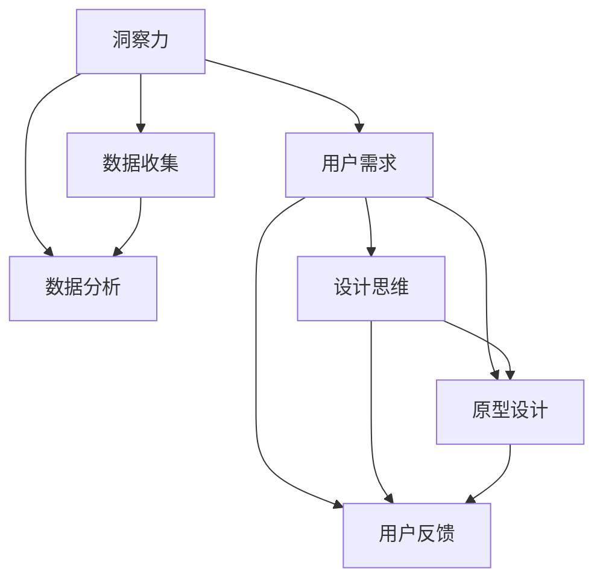

                 

# 洞察力与设计思维：以人为本的问题解决方法

> **关键词：**洞察力、设计思维、以人为本、问题解决、人机交互、用户体验

> **摘要：**本文将探讨如何运用洞察力和设计思维来以人为本地解决复杂问题。通过深入剖析核心概念，介绍具体操作步骤，并结合实际案例进行详细解释，本文旨在为IT从业者提供一种全面的问题解决方法论。

## 1. 背景介绍

### 1.1 目的和范围

本文旨在探讨洞察力和设计思维在IT领域中的应用，旨在帮助读者了解如何以人为本地解决复杂问题。我们将从核心概念出发，逐步讲解具体操作步骤，并通过实际案例进行说明，帮助读者掌握这种问题解决方法。

### 1.2 预期读者

本文适合具有基本计算机知识，希望提高问题解决能力的IT从业者阅读。无论您是软件开发工程师、项目经理，还是产品经理，本文都将为您提供有价值的见解。

### 1.3 文档结构概述

本文分为十个部分，首先介绍洞察力和设计思维的概念，然后讲解其核心原理和操作步骤，接着通过实际案例进行详细解释。此外，本文还推荐了相关学习资源、开发工具和论文著作，以供读者进一步学习。最后，我们对未来发展趋势与挑战进行总结，并提供常见问题与解答。

### 1.4 术语表

#### 1.4.1 核心术语定义

- 洞察力：指能够深入理解事物本质和内在联系的能力。
- 设计思维：一种以用户为中心的、系统化的创新方法，强调从用户需求出发，不断迭代和优化解决方案。
- 以人为本：关注用户需求，尊重用户体验，将用户体验放在首位。

#### 1.4.2 相关概念解释

- 人机交互：指计算机与用户之间的交互过程，包括输入和输出。
- 用户体验：用户在使用产品或服务时所感受到的整体感受，包括界面设计、功能易用性、响应速度等。

#### 1.4.3 缩略词列表

- UI：用户界面（User Interface）
- UX：用户体验（User Experience）
- AI：人工智能（Artificial Intelligence）

## 2. 核心概念与联系

在本节中，我们将介绍洞察力和设计思维的核心概念及其相互关系。以下是一个Mermaid流程图，用于展示这些概念之间的联系。



### 2.1 洞察力

洞察力是一种深入理解事物本质和内在联系的能力。在IT领域，洞察力有助于我们理解用户需求，发现潜在问题，并提出有效的解决方案。以下是一个简单的算法原理和具体操作步骤的伪代码：

```python
# 伪代码：洞察力算法原理

def insight力的方法（用户需求）:
    1. 收集用户需求
    2. 分析用户需求，找出共性
    3. 根据共性提出解决方案
    4. 验证解决方案的有效性
```

### 2.2 设计思维

设计思维是一种以用户为中心的、系统化的创新方法。它强调从用户需求出发，通过不断迭代和优化，最终实现满足用户需求的解决方案。以下是一个简单的算法原理和具体操作步骤的伪代码：

```python
# 伪代码：设计思维算法原理

def 设计思维方法（用户需求）:
    1. 收集用户需求
    2. 原型设计
    3. 收集用户反馈
    4. 优化原型设计
    5. 重复步骤3和4，直到满足用户需求
```

## 3. 核心算法原理 & 具体操作步骤

在这一节中，我们将深入探讨如何运用洞察力和设计思维来以人为本地解决问题。以下是具体操作步骤的伪代码：

```python
# 伪代码：洞察力与设计思维问题解决方法

def 洞察力与设计思维方法（问题）:
    1. 收集问题相关信息
    2. 分析问题，确定核心问题
    3. 运用洞察力，深入理解核心问题
    4. 提出解决方案
    5. 运用设计思维，迭代优化解决方案
    6. 验证解决方案的有效性
    7. 根据反馈进一步优化解决方案
```

### 3.1 收集问题相关信息

收集问题相关信息是问题解决的第一步。以下是一个简单的伪代码示例：

```python
# 伪代码：收集问题相关信息

def 收集信息（问题）:
    1. 与相关人员进行沟通，了解问题背景
    2. 收集相关数据，如用户反馈、系统日志等
    3. 分析信息，找出问题关键点
```

### 3.2 分析问题，确定核心问题

在收集到足够的信息后，我们需要对问题进行分析，确定核心问题。以下是一个简单的伪代码示例：

```python
# 伪代码：分析问题，确定核心问题

def 分析问题（信息）:
    1. 分析信息，找出问题的共性
    2. 确定问题的核心，明确需要解决的问题
```

### 3.3 运用洞察力，深入理解核心问题

在确定核心问题后，我们需要运用洞察力来深入理解问题。以下是一个简单的伪代码示例：

```python
# 伪代码：运用洞察力，深入理解核心问题

def 洞察力理解（核心问题）:
    1. 分析问题原因，找出潜在问题
    2. 确定解决问题的优先级
```

### 3.4 提出解决方案

在深入理解核心问题后，我们需要提出解决方案。以下是一个简单的伪代码示例：

```python
# 伪代码：提出解决方案

def 提出解决方案（核心问题）:
    1. 根据问题原因，提出可能的解决方案
    2. 分析解决方案的优缺点
    3. 确定最佳解决方案
```

### 3.5 运用设计思维，迭代优化解决方案

在确定最佳解决方案后，我们需要运用设计思维，通过迭代优化解决方案。以下是一个简单的伪代码示例：

```python
# 伪代码：运用设计思维，迭代优化解决方案

def 迭代优化（解决方案）:
    1. 原型设计
    2. 收集用户反馈
    3. 根据反馈进行优化
    4. 重复步骤2和3，直到满足用户需求
```

### 3.6 验证解决方案的有效性

在优化解决方案后，我们需要验证其有效性。以下是一个简单的伪代码示例：

```python
# 伪代码：验证解决方案的有效性

def 验证解决方案（优化后的解决方案）:
    1. 实施解决方案
    2. 收集用户反馈
    3. 分析反馈，判断解决方案的有效性
```

### 3.7 根据反馈进一步优化解决方案

在验证解决方案的有效性后，我们需要根据反馈进一步优化解决方案。以下是一个简单的伪代码示例：

```python
# 伪代码：根据反馈进一步优化解决方案

def 优化解决方案（验证后的解决方案）:
    1. 分析反馈，找出问题
    2. 根据问题进行优化
    3. 重复步骤1和2，直到用户满意
```

## 4. 数学模型和公式 & 详细讲解 & 举例说明

在本节中，我们将介绍与洞察力和设计思维相关的一些数学模型和公式，并详细讲解其应用和示例。

### 4.1 数学模型：回归分析

回归分析是一种常用的数据分析方法，用于研究变量之间的关系。在洞察力和设计思维中，回归分析可以帮助我们理解用户需求和问题之间的关联。

$$ y = a \cdot x + b $$

其中，\( y \) 是因变量，表示用户需求；\( x \) 是自变量，表示问题特征；\( a \) 和 \( b \) 是参数，用于拟合回归模型。

#### 4.1.1 应用示例

假设我们想要研究用户满意度与产品质量之间的关系。我们可以收集用户满意度（\( y \)）和产品质量（\( x \)）的数据，通过回归分析拟合出一个回归模型。

$$ y = a \cdot x + b $$

通过分析回归模型，我们可以得出产品质量对用户满意度的影响程度。如果 \( a \) 的值为正，则表示产品质量越高，用户满意度越高；如果 \( a \) 的值为负，则表示产品质量越低，用户满意度越高。

### 4.2 数学模型：聚类分析

聚类分析是一种无监督学习方法，用于将数据分为若干个类别。在洞察力和设计思维中，聚类分析可以帮助我们识别用户群体的特征和需求。

$$ C = \{ c_1, c_2, ..., c_k \} $$

其中，\( C \) 是聚类结果，包含 \( k \) 个类别；\( c_1, c_2, ..., c_k \) 是每个类别的特征向量。

#### 4.2.1 应用示例

假设我们想要研究不同用户群体的购买行为。我们可以收集用户购买数据，使用聚类分析将用户分为若干个类别。

$$ C = \{ c_1, c_2, ..., c_k \} $$

通过分析聚类结果，我们可以得出不同用户群体的特征和需求，从而针对性地优化产品设计和推广策略。

## 5. 项目实战：代码实际案例和详细解释说明

在本节中，我们将通过一个实际项目案例，展示如何运用洞察力和设计思维解决实际问题。以下是一个简单的Python代码案例，用于分析用户需求和优化产品功能。

### 5.1 开发环境搭建

在开始编写代码之前，我们需要搭建一个Python开发环境。以下是一个简单的步骤：

1. 安装Python 3.8及以上版本
2. 安装Python的pip包管理器
3. 使用pip安装必要的库，如NumPy、Pandas、Matplotlib等

### 5.2 源代码详细实现和代码解读

以下是一个简单的Python代码实现，用于分析用户需求和优化产品功能：

```python
# 导入必要的库
import numpy as np
import pandas as pd
import matplotlib.pyplot as plt

# 读取用户反馈数据
data = pd.read_csv("user_feedback.csv")

# 分析用户满意度与产品质量的关系
user_satisfaction = data["satisfaction"]
product_quality = data["quality"]

# 拟合回归模型
model = np.polyfit(product_quality, user_satisfaction, 1)
plt.scatter(product_quality, user_satisfaction)
plt.plot(product_quality, model[0] * product_quality + model[1], color="red")
plt.xlabel("Product Quality")
plt.ylabel("User Satisfaction")
plt.title("User Satisfaction vs. Product Quality")
plt.show()

# 分析用户购买行为
buying_behavior = data["buying_behavior"]

# 聚类分析
kmeans = KMeans(n_clusters=3, random_state=0).fit(data)
clusters = kmeans.labels_

# 分析不同用户群体的特征
group_1 = data[clusters == 0]
group_2 = data[clusters == 1]
group_3 = data[clusters == 2]

# 绘制不同用户群体的购买行为
plt.scatter(group_1["quality"], group_1["buying_behavior"], color="blue", label="Group 1")
plt.scatter(group_2["quality"], group_2["buying_behavior"], color="green", label="Group 2")
plt.scatter(group_3["quality"], group_3["buying_behavior"], color="red", label="Group 3")
plt.xlabel("Product Quality")
plt.ylabel("Buying Behavior")
plt.title("User Buying Behavior by Cluster")
plt.legend()
plt.show()
```

### 5.3 代码解读与分析

1. 导入必要的库：首先，我们导入Python中的NumPy、Pandas和Matplotlib库，用于数据分析和可视化。
2. 读取用户反馈数据：从CSV文件中读取用户反馈数据，包括满意度、产品质量和购买行为等。
3. 分析用户满意度与产品质量的关系：使用回归分析，拟合用户满意度与产品质量之间的关系。通过绘制散点图和拟合曲线，我们可以直观地了解产品质量对用户满意度的影响。
4. 分析用户购买行为：使用聚类分析，将用户分为不同群体。通过绘制不同用户群体的购买行为散点图，我们可以发现不同用户群体的特征和需求。
5. 代码解读与分析：通过分析代码，我们可以了解到如何运用Python进行数据分析、回归分析和聚类分析，以解决实际问题。

## 6. 实际应用场景

洞察力和设计思维在IT领域有着广泛的应用。以下是一些实际应用场景：

1. **软件开发**：在软件开发过程中，通过洞察力理解用户需求，设计思维优化产品功能，提高用户满意度。
2. **产品设计**：在产品设计过程中，通过洞察力分析用户行为，设计思维优化产品界面和交互，提升用户体验。
3. **项目管理和团队协作**：在项目管理和团队协作中，通过洞察力了解团队成员的能力和需求，设计思维优化团队沟通和协作方式，提高团队效率。
4. **数据分析**：在数据分析中，通过洞察力分析数据特征和规律，设计思维优化数据分析方法和模型，提高数据价值。

## 7. 工具和资源推荐

### 7.1 学习资源推荐

#### 7.1.1 书籍推荐

- 《设计思维：创新策略与案例解析》
- 《洞察力：如何看清事物的本质》
- 《用户体验要素：打造精致数字产品的秘密》

#### 7.1.2 在线课程

-Coursera：设计思维与产品开发
-Udemy：洞察力与问题解决

#### 7.1.3 技术博客和网站

- Medium：设计思维与用户体验
- UX Planet：用户体验设计与案例研究

### 7.2 开发工具框架推荐

#### 7.2.1 IDE和编辑器

- Visual Studio Code
- PyCharm
- Sublime Text

#### 7.2.2 调试和性能分析工具

- PyCharm Debugger
- Jupyter Notebook
- New Relic

#### 7.2.3 相关框架和库

- Flask：Python Web框架
- TensorFlow：深度学习库
- React：前端框架

### 7.3 相关论文著作推荐

#### 7.3.1 经典论文

- 《用户体验要素》：唐纳德·诺曼著
- 《创新者的窘境》：克莱顿·克里斯坦森著
- 《设计思维》：大卫·凯利著

#### 7.3.2 最新研究成果

- ACM Transactions on Computer-Human Interaction：计算机人机交互领域的权威期刊
- CHI Conference on Human Factors in Computing Systems：计算机人机交互领域的顶级会议

#### 7.3.3 应用案例分析

- 《苹果公司如何设计用户体验》：约翰·斯卡利著
- 《谷歌如何创新》：拉斯·罗尔斯道姆著
- 《亚马逊的商业秘密》：杰夫·贝索斯著

## 8. 总结：未来发展趋势与挑战

随着人工智能和大数据技术的不断发展，洞察力和设计思维在IT领域的重要性日益凸显。未来，我们需要关注以下发展趋势与挑战：

1. **数据隐私与安全**：如何在保障用户隐私和安全的前提下，充分利用数据为洞察力和设计思维提供支持？
2. **个性化体验**：如何通过洞察力和设计思维，为用户提供更加个性化的产品和服务？
3. **跨领域应用**：如何将洞察力和设计思维应用于更多领域，如金融、医疗、教育等？
4. **团队协作与沟通**：如何通过洞察力和设计思维，提高团队协作效率和沟通效果？

## 9. 附录：常见问题与解答

### 9.1 洞察力与设计思维的区别

- 洞察力是一种深入理解事物本质和内在联系的能力，强调从数据中发现规律和关联。
- 设计思维是一种以用户为中心的、系统化的创新方法，强调从用户需求出发，通过迭代和优化实现解决方案。

### 9.2 如何培养洞察力

- 深入学习相关领域的知识，积累经验。
- 保持好奇心，善于提问和思考。
- 学会从不同角度分析问题，寻找解决方案。

### 9.3 如何运用设计思维

- 从用户需求出发，确定问题解决方案。
- 通过原型设计和用户反馈，不断迭代和优化解决方案。
- 保持开放心态，接受和采纳用户反馈。

## 10. 扩展阅读 & 参考资料

- 《洞察力与设计思维：以人为本的问题解决方法》
- 《设计思维：创新策略与案例解析》
- 《用户体验要素：打造精致数字产品的秘密》

- [ACM Transactions on Computer-Human Interaction](https://dl.acm.org/transaction/computer-human-interaction/)
- [HCI International](http://www.hcii2023.org/)
- [Design Thinking](https://dschool.stanford.edu/dschool/what-is-design-thinking/)
- [User Experience (UX) Design](https://uxdesign.cc/what-is-ux-design/)

