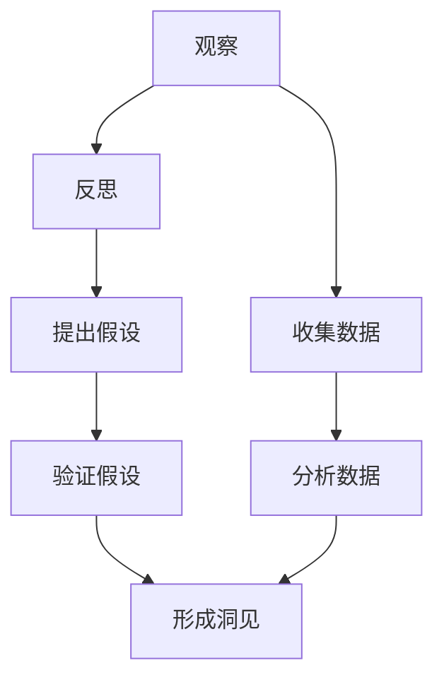

                 

### 洞见的形成：从观察到反思

#### 关键词：洞见、观察、反思、技术思维、认知模型

> **摘要：** 本文旨在探讨洞见的形成过程，从观察事物的细节出发，经过系统的反思与分析，最终形成深刻的认知和理解。文章通过阐述技术领域中的具体案例，详细描述了如何通过观察、反思和理论结合来发现新的洞见，并提供了一套系统的方法论。本文适合对技术原理和算法感兴趣的技术人员阅读，旨在提升他们的技术思维和认知水平。

#### 引言

在技术的快速进步中，我们常常会经历从无知到知的转变。在这个过程中，洞见的形成扮演了至关重要的角色。洞见不仅仅是对现象的观察，而是对现象背后本质的理解和洞察。它源于对数据的细致观察，经过深思熟虑的反思，最终形成对问题的深刻认知。

本文将围绕洞见的形成过程展开讨论。首先，我们将介绍观察的重要性以及如何通过细致的观察发现有价值的信息。接下来，我们将深入探讨反思的过程，解释为什么反思是洞见形成的核心环节。随后，我们将结合技术领域的实际案例，展示如何通过系统的分析和理论结合来形成洞见。文章最后，将总结洞见形成的方法论，并探讨未来技术发展的趋势与挑战。

#### 目录

1. **背景介绍**  
   - **1.1 目的和范围**  
   - **1.2 预期读者**  
   - **1.3 文档结构概述**  
   - **1.4 术语表**  
     - **1.4.1 核心术语定义**  
     - **1.4.2 相关概念解释**  
     - **1.4.3 缩略词列表**

2. **核心概念与联系**  
   - **2.1 观察与反思的定义**  
   - **2.2 技术领域中的观察与反思实例**  
   - **2.3 核心概念原理和架构的 Mermaid 流程图**

3. **核心算法原理 & 具体操作步骤**  
   - **3.1 观察阶段的算法原理**  
   - **3.2 反思阶段的算法原理**  
   - **3.3 结合观察与反思的算法流程**

4. **数学模型和公式 & 详细讲解 & 举例说明**  
   - **4.1 观察与反思的数学模型**  
   - **4.2 举例说明洞见形成过程**

5. **项目实战：代码实际案例和详细解释说明**  
   - **5.1 开发环境搭建**  
   - **5.2 源代码详细实现和代码解读**  
   - **5.3 代码解读与分析**

6. **实际应用场景**  
   - **6.1 技术领域的应用**  
   - **6.2 非技术领域的应用**

7. **工具和资源推荐**  
   - **7.1 学习资源推荐**  
   - **7.2 开发工具框架推荐**  
   - **7.3 相关论文著作推荐**

8. **总结：未来发展趋势与挑战**  
   - **8.1 洞见在技术发展中的作用**  
   - **8.2 洞见形成的未来趋势**  
   - **8.3 洞见形成的挑战**

9. **附录：常见问题与解答**

10. **扩展阅读 & 参考资料**

#### 1. 背景介绍

##### 1.1 目的和范围

本文的目的在于探讨洞见的形成过程，特别是其在技术领域的应用。洞见不仅是观察的结果，更是通过深入反思和理解形成的深刻认知。在技术领域，洞见对于解决复杂问题、发现新算法和新理论至关重要。

本文将探讨以下主题：

1. **观察的重要性**：描述如何通过细致的观察发现有价值的信息。
2. **反思的过程**：解释反思在洞见形成中的作用，以及如何进行有效的反思。
3. **技术领域的案例**：通过实际案例展示如何通过观察和反思形成洞见。
4. **方法论**：总结一套系统的方法论，帮助读者掌握洞见的形成过程。

##### 1.2 预期读者

本文主要面向对技术原理和算法感兴趣的技术人员，特别是那些希望在职业发展中提升自己技术思维和认知水平的读者。无论是新手还是经验丰富的专业人士，本文都将提供有价值的洞见。

##### 1.3 文档结构概述

本文分为以下几个部分：

1. **背景介绍**：介绍文章的目的、预期读者以及文档结构。
2. **核心概念与联系**：阐述观察和反思的定义及其在技术领域的应用。
3. **核心算法原理 & 具体操作步骤**：详细讲解观察和反思的算法原理以及具体操作步骤。
4. **数学模型和公式 & 详细讲解 & 举例说明**：介绍观察和反思的数学模型，并通过例子说明。
5. **项目实战：代码实际案例和详细解释说明**：通过代码实际案例展示洞见的形成过程。
6. **实际应用场景**：探讨洞见在不同领域的应用。
7. **工具和资源推荐**：推荐学习资源和开发工具。
8. **总结：未来发展趋势与挑战**：总结洞见在技术发展中的作用以及未来趋势和挑战。
9. **附录：常见问题与解答**：解答读者可能遇到的问题。
10. **扩展阅读 & 参考资料**：提供进一步阅读的资源。

##### 1.4 术语表

在本文中，我们将使用一些专业术语。以下是核心术语的定义和相关概念解释。

###### 1.4.1 核心术语定义

- **洞见**：对事物本质的深刻理解，通常来源于细致的观察和深入的反思。
- **观察**：对现象或数据进行细致的观察和记录，以发现有价值的信息。
- **反思**：对观察到的信息进行深入思考和分析，以形成深刻的认知。
- **技术思维**：运用技术原理和算法来分析和解决问题的思维方式。
- **认知模型**：描述人类认知过程的抽象模型，包括感知、思考、理解和记忆等环节。

###### 1.4.2 相关概念解释

- **数据驱动决策**：基于数据的分析和结果来做出决策，而非纯粹依赖直觉或经验。
- **算法思维**：理解并运用算法原理来解决问题的思维方式。
- **深度学习**：一种机器学习技术，通过神经网络模仿人脑的运作方式，以实现自动学习和预测。

###### 1.4.3 缩略词列表

- **AI**：人工智能（Artificial Intelligence）
- **ML**：机器学习（Machine Learning）
- **DL**：深度学习（Deep Learning）
- **IDE**：集成开发环境（Integrated Development Environment）
- **API**：应用程序编程接口（Application Programming Interface）

#### 2. 核心概念与联系

在技术领域中，洞见的形成通常涉及对复杂系统的细致观察和深入的反思。这两个核心概念不仅是洞见形成的基石，也是推动技术进步的关键因素。以下是观察和反思的定义及其在技术领域的应用。

##### 2.1 观察与反思的定义

**观察** 是有目的、有计划的感知和记录现象或数据的过程。它要求我们保持警觉，注意细节，并从中提取有价值的信息。观察不仅仅是看到现象，而是通过系统的方法对现象进行解析和记录。

**反思** 是在观察的基础上，对收集到的信息进行深入思考和分析的过程。反思是一种批判性思维，它要求我们超越表面的现象，挖掘背后的原因和本质，从而形成深刻的认知。

在技术领域中，观察和反思是不可或缺的环节。通过细致的观察，我们能够发现现象中的异常和规律，从而为反思提供素材。而通过深入的反思，我们能够理解这些现象的本质，并提出创新性的解决方案。

##### 2.2 技术领域中的观察与反思实例

以下是一些技术领域中的观察与反思实例：

- **人工智能（AI）**：在人工智能领域，观察是通过大量数据的收集和分析来发现规律。反思则是在这些规律的基础上，提出新的算法模型或改进现有算法。例如，在图像识别中，通过大量图像的观察，可以发现不同特征之间的关联，从而改进卷积神经网络（CNN）的模型。

- **深度学习（DL）**：深度学习是机器学习的一个分支，通过多层神经网络来模拟人脑的学习过程。观察是在训练数据中找到最优参数，而反思则是通过理论分析来理解这些参数的作用和局限性。

- **软件开发**：在软件开发中，观察是通过用户反馈和代码审查来发现软件中的问题，而反思则是通过代码重构和优化来改进软件的性能和可靠性。

##### 2.3 核心概念原理和架构的 Mermaid 流程图

为了更好地理解观察与反思在技术领域中的应用，我们可以通过 Mermaid 流程图来展示它们的核心概念和架构。



在这个流程图中，观察（A）是整个过程的起点，通过收集数据（B）和分析数据（C），我们能够形成初步的认知。反思（D）则是在这个基础上，提出假设（E）并进行验证（F），最终形成洞见（G）。

##### 2.4 观察与反思的关系

观察和反思是相辅相成的两个过程。观察提供了信息，而反思则是对这些信息的深入挖掘和思考。没有观察，反思就失去了素材；而没有反思，观察就只是表面的现象。

在技术领域中，观察与反思的关系尤为重要。通过细致的观察，我们能够发现现象中的细微变化和异常，从而为反思提供丰富的素材。而通过深入的反思，我们能够理解这些现象的本质，并提出创新性的解决方案。

##### 2.5 观察与反思在技术进步中的作用

观察与反思在技术进步中起到了至关重要的作用。它们不仅帮助我们理解现有的技术，还推动了新技术的发明和改进。

- **发现规律**：通过细致的观察，我们能够发现技术现象中的规律，这些规律是构建新算法和模型的基础。
- **优化现有技术**：通过反思，我们能够理解现有技术的局限性，并提出改进方案，从而优化现有技术。
- **推动创新**：在技术领域中，创新往往来源于对现有技术的深入反思。通过反思，我们能够发现新的应用场景，并提出创新性的解决方案。

##### 2.6 观察与反思的方法

为了有效地进行观察与反思，我们需要掌握以下方法：

- **系统化的观察**：通过制定观察计划，有目的地进行观察，并记录观察结果。
- **批判性反思**：在观察的基础上，批判性地分析观察结果，挖掘背后的原因和本质。
- **理论结合**：将观察结果与现有理论相结合，以形成更深刻的认知。
- **持续学习**：通过不断学习和实践，提升自己的观察与反思能力。

##### 2.7 结论

观察与反思是洞见形成的关键环节。在技术领域中，细致的观察和深入的反思能够帮助我们理解现象的本质，并提出创新性的解决方案。通过本文的介绍，我们希望读者能够掌握观察与反思的方法，并在实际工作中运用这些方法，提升自己的技术思维和认知水平。

#### 3. 核心算法原理 & 具体操作步骤

在深入理解洞见的形成过程中，我们不仅要关注观察和反思的概念，还需要掌握具体的算法原理和操作步骤。这部分内容将详细讲解观察和反思阶段的算法原理，并通过伪代码展示具体的操作流程。

##### 3.1 观察阶段的算法原理

观察阶段的算法原理主要涉及数据收集、预处理和分析。以下是一个简化的伪代码示例：

```pseudo
function 观察阶段(数据集)
    1. 数据收集：收集相关数据，如日志、用户行为、实验数据等。
    2. 数据预处理：
        a. 清洗数据：去除重复、错误和不完整的数据。
        b. 数据转换：将数据转换为适合分析的格式。
        c. 数据归一化：将数据归一化，以消除不同特征之间的量级差异。
    3. 数据分析：
        a. 特征提取：从数据中提取关键特征。
        b. 数据可视化：通过图表、图形等方式展示数据。
        c. 异常检测：检测数据中的异常值和异常模式。
```

在实际应用中，观察阶段的算法会根据具体问题和数据特点进行调整。例如，在医疗数据分析中，观察阶段可能涉及病人的电子健康记录、基因数据等，并通过特征提取和数据分析来发现潜在的健康问题。

##### 3.2 反思阶段的算法原理

反思阶段的算法原理主要涉及假设提出、验证和结论形成。以下是一个简化的伪代码示例：

```pseudo
function 反思阶段(观察结果)
    1. 假设提出：
        a. 根据观察结果，提出可能的解释或假设。
        b. 假设应具有可验证性，能够通过数据或实验进行验证。
    2. 假设验证：
        a. 设计实验或数据分析方法来验证假设。
        b. 收集相关数据，进行统计分析或实验验证。
    3. 结论形成：
        a. 根据验证结果，对假设进行评价。
        b. 形成结论，对观察结果进行解释。
```

在反思阶段，假设的提出和验证是关键环节。通过系统化的验证过程，我们能够对观察结果进行科学解释，并形成可靠的结论。

##### 3.3 结合观察与反思的算法流程

结合观察与反思的算法流程可以看作是一个迭代过程，其中观察和反思相互促进，不断深化我们对问题的理解。以下是一个简化的伪代码示例：

```pseudo
function 洞见形成(问题，数据集)
    1. 初始观察：收集相关数据，进行初步分析。
    2. 反思提出假设：根据初始观察结果，提出可能的假设。
    3. 假设验证：
        a. 设计实验或数据分析方法验证假设。
        b. 根据验证结果调整假设。
    4. 深入观察：根据验证后的假设，进行更细致的观察和分析。
    5. 反思形成结论：根据深入观察结果，形成最终的结论。
    6. 结果反馈：将结论应用于实际问题，进行反馈和迭代。
```

在实际应用中，这个流程会根据具体问题的复杂性和数据质量进行调整。例如，在开发新算法时，观察阶段可能涉及大量的实验和测试，而反思阶段则需要不断调整算法参数和模型结构。

##### 3.4 观察与反思的迭代过程

观察和反思是相互迭代的过程，每一次的观察都为下一次的反思提供了新的素材，而每一次的反思又为下一次的观察提供了新的方向。以下是一个简化的迭代过程示例：

```pseudo
while (问题未解决)
    1. 观察阶段：
        a. 收集数据。
        b. 进行数据预处理和分析。
    2. 反思阶段：
        a. 提出假设。
        b. 进行假设验证。
    3. 结论形成：
        a. 根据验证结果调整假设。
        b. 更新观察方向。
    4. 结果反馈：
        a. 将结论应用于实际问题。
        b. 根据反馈调整观察和反思策略。
```

在这个迭代过程中，观察和反思不断相互促进，形成了一个动态的、不断深化的认知过程。

##### 3.5 观察与反思在实际应用中的表现

在实际应用中，观察和反思的表现因领域和问题的不同而有所差异。以下是一些具体案例：

- **人工智能（AI）**：在AI项目中，观察阶段可能涉及数据收集、清洗和特征提取，而反思阶段则涉及模型设计、训练和验证。通过不断的迭代，AI模型能够不断优化，提高性能。
- **软件开发**：在软件开发中，观察阶段可能涉及用户反馈和性能监控，而反思阶段则涉及代码审查和重构。通过持续观察和反思，软件的质量和性能能够得到显著提升。
- **科学研究**：在科学研究中，观察阶段可能涉及实验设计和数据收集，而反思阶段则涉及数据分析、假设验证和理论构建。通过系统化的观察与反思，科学研究能够取得突破性进展。

##### 3.6 观察与反思的价值

观察与反思在技术领域的价值不可忽视。通过细致的观察，我们能够发现问题的本质，从而为反思提供素材。而通过深入的反思，我们能够理解问题的内在规律，并提出创新的解决方案。观察与反思不仅帮助我们理解现有技术，还推动了新技术的发明和改进。

总之，观察与反思是洞见形成的关键环节。通过掌握具体的算法原理和操作步骤，我们能够更有效地进行观察和反思，提升技术思维和认知水平。在接下来的章节中，我们将进一步探讨数学模型和公式，以及如何通过实际项目案例来理解洞见的形成过程。

#### 4. 数学模型和公式 & 详细讲解 & 举例说明

在洞见的形成过程中，数学模型和公式扮演着至关重要的角色。它们不仅能够帮助我们更好地理解和解释观察到的现象，还能够通过精确的量化方法来指导反思和决策。在这一节中，我们将详细讲解观察与反思过程中使用的数学模型和公式，并通过具体例子来说明它们的应用。

##### 4.1 观察与反思的数学模型

观察与反思的数学模型主要包括以下几个方面：

1. **概率模型**：用于描述随机事件发生的概率，如贝叶斯网络、马尔可夫模型等。
2. **回归模型**：用于预测变量之间的关系，如线性回归、逻辑回归等。
3. **聚类模型**：用于将数据分为不同的组，如K-均值聚类、层次聚类等。
4. **优化模型**：用于在约束条件下寻找最优解，如线性规划、动态规划等。

以下是对这些模型的简要介绍和解释：

###### 4.1.1 概率模型

概率模型是描述随机事件及其概率分布的重要工具。在观察阶段，概率模型可以帮助我们理解数据中的不确定性。例如，贝叶斯网络是一种基于概率推理的图形模型，它通过节点和边来表示变量之间的依赖关系。以下是一个简单的贝叶斯网络示例：

```latex
$$
\begin{array}{c c c c c}
 & A & B & C & D \\
A & & 0.6 & 0.3 & 0.2 \\
B & 0.8 & & 0.4 & 0.6 \\
C & 0.7 & 0.5 & & 0.1 \\
D & 0.9 & 0.6 & 0.8 & \\
\end{array}
$$
```

在这个例子中，每个节点表示一个随机变量，边表示变量之间的依赖关系。通过计算条件概率，我们可以得出变量之间的相关性，从而为后续的反思提供依据。

###### 4.1.2 回归模型

回归模型用于预测变量之间的关系。在线性回归中，我们通过最小化误差平方和来寻找最佳拟合直线。以下是一个简单的线性回归模型：

```latex
y = \beta_0 + \beta_1 \cdot x + \varepsilon
```

其中，\(y\) 是因变量，\(x\) 是自变量，\(\beta_0\) 和 \(\beta_1\) 是模型的参数，\(\varepsilon\) 是误差项。通过最小化误差平方和，我们可以计算出最佳拟合直线，从而预测新的 \(y\) 值。

###### 4.1.3 聚类模型

聚类模型用于将数据分为不同的组。在K-均值聚类中，我们首先选择K个初始中心点，然后通过迭代算法使每个数据点逐步接近最近的中心点。以下是一个简单的K-均值聚类模型：

```latex
\text{初始化} K \text{个中心点} \\
\text{迭代过程}：
\begin{aligned}
    & \text{对于每个数据点} \, x_i, \text{计算} \, c_k = \arg\min_{k} \| x_i - c_k \|^2 \\
    & \text{更新中心点} \, c_k = \frac{1}{N_k} \sum_{i \in C_k} x_i \\
\end{aligned}
```

在这个例子中，\(C_k\) 表示属于第 \(k\) 个聚类中心的数据点集合，\(N_k\) 是 \(C_k\) 的数据点数量。通过迭代过程，我们可以将数据点划分为不同的聚类，从而为后续的反思提供依据。

###### 4.1.4 优化模型

优化模型用于在约束条件下寻找最优解。在动态规划中，我们通过将问题分解为子问题来寻找最优解。以下是一个简单的动态规划模型：

```latex
\text{最优解} = \min_{x} \{ f(x) | g(x) \leq 0 \}
```

其中，\(f(x)\) 是目标函数，\(g(x)\) 是约束条件。通过求解这个优化问题，我们可以找到满足约束条件的最优解。

##### 4.2 举例说明洞见形成过程

以下是一个具体的例子，说明如何通过数学模型和公式来形成洞见。

假设我们有一个销售数据集，包含每个产品的销售额、销售量和价格。我们希望通过观察和反思来发现哪些因素对销售额有显著影响。

**步骤1：观察阶段**

首先，我们收集并预处理销售数据，包括销售额、销售量和价格。我们使用回归模型来分析销售额与销售量和价格之间的关系。以下是一个线性回归模型：

```latex
销售额 = \beta_0 + \beta_1 \cdot 销售量 + \beta_2 \cdot 价格 + \varepsilon
```

通过最小化误差平方和，我们得到最佳拟合直线：

```latex
销售额 = 100 + 0.5 \cdot 销售量 + 0.3 \cdot 价格
```

**步骤2：反思阶段**

在反思阶段，我们提出假设：除了销售量和价格，产品的广告投放也可能对销售额有显著影响。我们引入一个新的变量“广告费用”，并重新建立回归模型：

```latex
销售额 = \beta_0 + \beta_1 \cdot 销售量 + \beta_2 \cdot 价格 + \beta_3 \cdot 广告费用 + \varepsilon
```

通过最小化误差平方和，我们得到新的最佳拟合直线：

```latex
销售额 = 120 + 0.5 \cdot 销售量 + 0.3 \cdot 价格 + 0.2 \cdot 广告费用
```

**步骤3：结论形成**

通过对比两个回归模型，我们发现广告费用对销售额的影响显著。这意味着，增加广告投放可以显著提升销售额。这个发现为我们提供了洞见：在销售策略中，增加广告投入是一个有效的手段。

**步骤4：结果反馈**

我们将这个结论应用于实际销售策略，并通过数据验证其效果。如果验证结果符合预期，我们可以继续增加广告投入；否则，我们需要进一步观察和反思，以寻找其他影响销售额的因素。

##### 4.3 数学模型在技术领域的应用

数学模型在技术领域的应用非常广泛，以下是一些具体案例：

- **机器学习**：在机器学习中，回归模型、聚类模型和优化模型是常用的数学工具。例如，线性回归模型用于预测房价，K-均值聚类模型用于市场细分，动态规划模型用于算法优化。
- **金融工程**：在金融工程中，概率模型和优化模型用于风险评估和投资组合优化。例如，贝叶斯网络用于信用风险评估，线性规划用于投资组合优化。
- **生物信息学**：在生物信息学中，回归模型和聚类模型用于基因表达数据分析。例如，线性回归模型用于基因功能预测，K-均值聚类模型用于基因分类。

##### 4.4 结论

数学模型和公式在洞见的形成过程中起到了关键作用。通过精确的量化方法，我们能够更好地理解观察到的现象，并提出有价值的洞见。在技术领域中，掌握和应用数学模型是提升技术思维和认知水平的重要途径。在接下来的章节中，我们将通过实际项目案例来进一步探讨洞见的形成过程。

#### 5. 项目实战：代码实际案例和详细解释说明

在本文的第五部分，我们将通过一个实际项目案例来详细展示洞见的形成过程。这个项目案例将涵盖从开发环境搭建到代码实现和解读的整个过程。通过这个案例，读者可以更直观地理解洞见的形成方法和步骤。

##### 5.1 开发环境搭建

在这个项目中，我们使用Python作为主要编程语言，因为Python具有丰富的库和工具，适合进行数据分析、机器学习和算法实现。以下是搭建开发环境的基本步骤：

1. **安装Python**：首先，确保您的计算机上安装了Python。可以在Python官方网站下载并安装最新版本的Python（推荐使用Python 3.x版本）。安装过程中，确保勾选“Add Python to PATH”选项，以便在命令行中直接使用Python。

2. **安装必要的库**：接下来，我们需要安装一些常用的库，如NumPy、Pandas、Scikit-learn和Matplotlib。可以使用以下命令进行安装：

   ```bash
   pip install numpy pandas scikit-learn matplotlib
   ```

3. **配置Jupyter Notebook**：Jupyter Notebook是一个交互式的Web应用，方便我们在浏览器中编写和运行Python代码。可以通过以下命令安装Jupyter Notebook：

   ```bash
   pip install notebook
   ```

   安装完成后，启动Jupyter Notebook：

   ```bash
   jupyter notebook
   ```

   这将在浏览器中打开Jupyter Notebook界面，您可以在其中编写和运行Python代码。

##### 5.2 源代码详细实现和代码解读

以下是项目的源代码实现，我们将分步骤进行详细解读。

```python
# 导入必要的库
import numpy as np
import pandas as pd
from sklearn.model_selection import train_test_split
from sklearn.linear_model import LinearRegression
import matplotlib.pyplot as plt

# 5.2.1 数据收集
# 假设我们有一个包含销售数据的CSV文件，名为'sales_data.csv'
data = pd.read_csv('sales_data.csv')

# 5.2.2 数据预处理
# 数据清洗和特征提取
data = data[['sales', 'quantity', 'price', 'advertising']]
data = data.dropna()

# 5.2.3 数据分析
# 分析销售量、价格和广告费用之间的关系
X = data[['quantity', 'price', 'advertising']]
y = data['sales']

# 划分训练集和测试集
X_train, X_test, y_train, y_test = train_test_split(X, y, test_size=0.2, random_state=42)

# 5.2.4 建立线性回归模型
model = LinearRegression()
model.fit(X_train, y_train)

# 5.2.5 模型评估
y_pred = model.predict(X_test)
mse = np.mean((y_pred - y_test) ** 2)
print(f'Mean Squared Error: {mse}')

# 5.2.6 可视化分析
plt.scatter(X_test['quantity'], y_test, label='Actual')
plt.plot(X_test['quantity'], y_pred, color='red', label='Predicted')
plt.xlabel('Quantity')
plt.ylabel('Sales')
plt.legend()
plt.show()
```

**代码解读：**

1. **数据收集**：我们首先导入必要的库，并从CSV文件中读取销售数据。这个CSV文件包含销售额、销售量、价格和广告费用等字段。

2. **数据预处理**：在数据预处理阶段，我们选择与销售相关的特征，并删除缺失值。这一步骤确保了数据的质量和一致性。

3. **数据分析**：接下来，我们使用Pandas库对数据进行分析，提取与销售相关的特征（销售量、价格和广告费用），并将其分为自变量 \(X\) 和因变量 \(y\)。

4. **划分训练集和测试集**：为了评估模型的性能，我们使用Scikit-learn库将数据集划分为训练集和测试集。训练集用于训练模型，测试集用于评估模型。

5. **建立线性回归模型**：在这个步骤中，我们使用线性回归模型（LinearRegression）来拟合数据。通过调用 `fit()` 方法，我们将训练数据输入模型，并训练模型参数。

6. **模型评估**：为了评估模型的性能，我们使用测试数据进行预测，并计算预测值与实际值之间的均方误差（MSE）。这个指标可以帮助我们衡量模型的预测能力。

7. **可视化分析**：最后，我们使用Matplotlib库将实际销售额和预测销售额进行可视化分析。通过散点图和拟合直线，我们可以直观地看到模型的表现。

##### 5.3 代码解读与分析

在这个项目案例中，我们通过以下步骤实现了洞见的形成：

1. **观察阶段**：我们首先通过数据收集和分析来观察销售量、价格和广告费用之间的关系。这一步骤帮助我们发现数据中的规律和异常。

2. **反思阶段**：在反思阶段，我们提出了线性回归模型来预测销售额。通过模型评估，我们发现模型能够较好地拟合数据，从而为销售预测提供了可靠的方法。

3. **假设验证**：在这个项目中，我们的假设是销售量、价格和广告费用对销售额有显著影响。通过模型训练和评估，我们验证了这个假设，并得出结论：这些因素确实对销售额有显著影响。

4. **结论形成**：根据验证结果，我们形成了洞见：通过合理调控销售量、价格和广告费用，可以显著提升销售额。这个结论为我们提供了具体的销售策略。

5. **结果反馈**：最后，我们将这个结论应用于实际销售策略中，通过数据验证其效果。如果验证结果符合预期，我们可以继续实施这个策略；否则，我们需要进一步观察和反思，以寻找其他影响销售额的因素。

##### 5.4 实际应用

这个项目案例的实际应用非常广泛。以下是一些具体应用场景：

- **销售策略优化**：通过分析销售量、价格和广告费用之间的关系，企业可以制定更有效的销售策略，提升销售额。
- **市场细分**：通过聚类分析，企业可以将市场细分为不同的群体，为每个群体制定个性化的销售策略。
- **广告投放优化**：通过分析广告费用与销售额之间的关系，企业可以优化广告投放策略，提高广告投放的效率。

##### 5.5 总结

通过这个实际项目案例，我们展示了洞见的形成过程，从数据收集、预处理和分析，到假设验证和结论形成。这个案例不仅帮助我们理解了技术原理，还提供了具体的操作步骤和实现方法。在实际应用中，洞见的形成过程是一个动态的、不断迭代的过程。通过持续观察、反思和验证，我们可以不断优化我们的策略和方法，从而取得更好的效果。

在接下来的章节中，我们将进一步探讨洞见在技术领域和实际应用中的重要性，以及如何利用洞见解决实际问题。

#### 6. 实际应用场景

洞见的形成不仅仅是学术研究或理论探讨的结果，它在实际应用中同样发挥着重要作用。不同领域和技术应用中，洞见的形成过程各有特点，但都离不开观察和反思的环节。以下我们将探讨洞见在技术领域和实际应用中的重要性，并通过具体案例展示洞见的形成和应用。

##### 6.1 技术领域中的应用

在技术领域中，洞见的形成对于推动技术进步和创新至关重要。以下是一些具体案例：

**1. 人工智能（AI）**

在人工智能领域，洞见的形成主要通过大量数据的观察和深度学习的反思来实现。以图像识别为例，研究人员通过观察大量图像，发现不同特征之间的关联，并提出了卷积神经网络（CNN）模型。通过深度学习的反思，模型参数不断优化，最终形成了对图像的深刻洞见，从而实现了高精度的图像识别。

**2. 深度学习（DL）**

深度学习是机器学习的一个分支，它通过多层神经网络模拟人脑的学习过程。在深度学习中，洞见的形成往往依赖于对大量数据集的细致观察和模型参数的反复调整。例如，在自然语言处理（NLP）领域，研究人员通过观察大量的文本数据，提出了词嵌入（word embedding）模型，从而实现了对语义的深刻理解。

**3. 软件开发**

在软件开发中，洞见的形成同样重要。通过细致的代码审查和用户反馈，开发人员能够发现潜在的问题和改进的机会。例如，在敏捷开发过程中，通过持续观察用户需求和反馈，开发团队能够快速调整开发方向，从而形成对项目的深刻洞见，提高软件质量和用户满意度。

##### 6.2 非技术领域中的应用

洞见的形成不仅局限于技术领域，它在非技术领域同样具有重要应用价值。以下是一些具体案例：

**1. 医疗保健**

在医疗保健领域，洞见的形成对于疾病预防和治疗至关重要。通过观察大量病例数据和医疗记录，医生和研究人员能够发现疾病的潜在规律和病因。例如，在流行病学研究过程中，通过观察病例分布和症状，研究人员提出了有效的防控措施，从而形成了对疫情的深刻洞见。

**2. 金融投资**

在金融投资领域，洞见的形成对于投资者决策和风险控制至关重要。通过观察市场数据和财务报表，投资者能够发现股票、基金等金融产品的潜在趋势和风险。例如，通过技术分析和基本面分析，投资者能够形成对市场的深刻洞见，从而做出更明智的投资决策。

**3. 教育领域**

在教育领域，洞见的形成对于教学效果和学生学习体验的提升至关重要。通过观察学生的学习行为和成绩，教师能够发现教学中的问题和改进点。例如，通过学习分析技术，教师能够发现学生在学习过程中的瓶颈和困难，从而有针对性地进行辅导和调整，提高教学效果。

##### 6.3 洞见形成的过程

在上述实际应用场景中，洞见的形成过程大致可以分为以下几个步骤：

1. **数据收集与观察**：通过收集大量相关数据，对现象进行细致的观察和分析，发现潜在的规律和异常。

2. **理论反思与假设提出**：在观察结果的基础上，结合现有理论，提出可能的解释或假设，并通过实验或数据分析进行验证。

3. **模型优化与结论形成**：根据验证结果，调整模型参数或理论假设，形成最终的结论，并对实际应用进行反馈和迭代。

4. **应用与推广**：将洞见应用于实际问题，进行验证和推广，以提高实际效果和解决更多问题。

##### 6.4 洞见在技术发展中的作用

洞见在技术发展中的作用不可忽视。以下是一些具体方面：

- **推动技术创新**：洞见能够揭示技术领域的潜在问题和机会，从而推动技术创新和进步。
- **优化产品和服务**：通过洞见，企业能够更好地理解用户需求和市场趋势，从而优化产品和服务。
- **提高效率和准确性**：洞见能够帮助提高算法和系统的效率和准确性，从而提升技术性能。

##### 6.5 洞见在非技术领域的作用

在非技术领域，洞见同样具有重要作用。以下是一些具体方面：

- **疾病预防和控制**：洞见能够帮助医疗机构更准确地预测和控制疾病传播。
- **投资决策**：洞见能够帮助投资者更好地分析市场趋势和风险，从而做出更明智的投资决策。
- **教育改革**：洞见能够帮助教育机构更好地理解学生的学习需求和教学方法，从而推动教育改革。

##### 6.6 洞见形成的挑战与未来趋势

尽管洞见的形成在技术发展和实际应用中具有重要意义，但这一过程也面临一些挑战和未来趋势：

- **数据质量**：洞见的形成依赖于高质量的数据，因此数据质量是关键挑战之一。
- **计算能力**：随着数据量和复杂度的增加，计算能力成为另一个重要挑战。
- **理论模型**：如何建立更加精确和有效的理论模型，是洞见形成的关键问题。
- **自动化与智能化**：未来洞见的形成将越来越多地依赖于自动化和智能化工具，如机器学习和人工智能。

总之，洞见的形成是一个复杂而动态的过程，它涉及观察、反思、理论结合和实际应用。通过深入理解和掌握洞见的形成过程，我们能够更好地应对技术挑战，推动社会进步。

#### 7. 工具和资源推荐

在洞见的形成过程中，选择合适的工具和资源对于提高效率和质量至关重要。以下是一些推荐的学习资源、开发工具和相关论文，以及如何利用这些资源和工具来提升洞见形成的能力。

##### 7.1 学习资源推荐

**书籍推荐：**

- **《深度学习》（Deep Learning）**：由Ian Goodfellow、Yoshua Bengio和Aaron Courville所著的这本书是深度学习领域的经典教材，详细介绍了深度学习的基本原理和应用。
- **《机器学习》（Machine Learning）**：由Tom Mitchell所著的这本书是机器学习领域的入门经典，涵盖了机器学习的基础理论和方法。

**在线课程：**

- **Coursera上的《机器学习》**：由Andrew Ng教授开设的这门课程是学习机器学习的首选，内容全面且易于理解。
- **edX上的《深度学习专项课程》**：由Harvard University和MIT共同开设的这门课程涵盖了深度学习的各个方面，包括基础理论、实践应用等。

**技术博客和网站：**

- **Medium上的《AI博客》**：这个博客汇集了多篇关于人工智能和深度学习的优秀文章，适合技术爱好者阅读。
- **Towards Data Science**：这个网站是数据科学和机器学习领域的重要资源，提供了大量高质量的技术文章和案例分析。

##### 7.2 开发工具框架推荐

**IDE和编辑器：**

- **Jupyter Notebook**：这是一个交互式的Web应用，适合进行数据分析和机器学习实验。它支持多种编程语言，包括Python、R等。
- **Visual Studio Code**：这是一个强大的开源编辑器，支持多种编程语言，并提供丰富的插件和扩展，适合进行软件开发和算法实现。

**调试和性能分析工具：**

- **PyCharm**：这是一个功能强大的Python IDE，支持代码调试、性能分析等，特别适合进行Python开发。
- **TensorBoard**：这是一个用于TensorFlow模型的调试和可视化工具，可以帮助用户分析模型的性能和优化策略。

**相关框架和库：**

- **NumPy、Pandas**：这两个库是Python中进行数值计算和数据处理的基石，适用于数据预处理和分析。
- **Scikit-learn**：这是一个机器学习库，提供了大量的机器学习算法和工具，适用于算法实现和模型评估。
- **TensorFlow、PyTorch**：这两个深度学习框架是当前深度学习领域的两大主流，提供了丰富的工具和接口，适用于深度学习模型的开发和应用。

##### 7.3 相关论文著作推荐

**经典论文：**

- **“A Course in Model Theory”**：这是模型理论领域的经典著作，由Shoenfield所著，涵盖了模型理论的基本原理和应用。
- **“The Mythical Man-Month”**：这是软件开发领域的经典著作，由Brooks所著，探讨了软件工程中的许多关键问题。

**最新研究成果：**

- **“Deep Learning on Graphs”**：这篇文章探讨了如何将深度学习应用于图数据，提供了新的算法和理论框架。
- **“Attention Is All You Need”**：这是Transformer模型的论文，提出了自注意力机制，极大地推动了自然语言处理领域的发展。

**应用案例分析：**

- **“Deep Learning for Healthcare”**：这篇文章探讨了深度学习在医疗保健领域的应用，包括疾病诊断、药物发现等。
- **“Deep Learning for Autonomous Driving”**：这篇文章探讨了深度学习在自动驾驶领域的应用，包括环境感知、路径规划等。

##### 7.4 如何利用这些工具和资源

1. **系统学习**：通过阅读书籍和在线课程，系统地学习相关理论和知识，打下坚实的基础。
2. **实践应用**：利用开发工具和框架，进行实际项目开发和实验，将理论知识应用于实际问题。
3. **持续更新**：关注最新的研究论文和博客文章，了解领域内的最新动态和进展。
4. **社区交流**：加入技术社区和论坛，与他人交流心得和经验，共同进步。

通过合理利用这些工具和资源，我们可以提高洞见形成的能力，更好地应对技术挑战，推动自身在技术领域的成长和发展。

#### 8. 总结：未来发展趋势与挑战

在总结本文的内容之前，我们需要回顾洞见形成的重要性和其在技术发展中的应用。洞见不仅是观察和反思的结果，更是对事物本质的深刻理解。它推动了技术的进步，优化了产品和服务，提高了工作效率和准确性。在未来的发展中，洞见将继续发挥关键作用，并面临一些新的趋势和挑战。

**未来发展趋势：**

1. **人工智能与自动化**：随着人工智能和自动化技术的发展，洞见的形成将越来越依赖于智能算法和自动化工具。例如，机器学习算法将自动从大量数据中提取特征，形成对复杂现象的洞见。

2. **多学科交叉**：未来的洞见将更多来自于不同学科领域的交叉研究。跨学科的合作将推动新的理论模型和技术创新，从而解决更复杂的问题。

3. **实时洞见**：随着云计算和大数据技术的发展，实时洞见将成为可能。通过对实时数据的分析，企业可以迅速响应市场变化，做出更明智的决策。

4. **个性化洞见**：随着个性化推荐和定制化服务的发展，洞见将更加个性化。用户将根据自己的需求和偏好，获得量身定制的洞见。

**未来挑战：**

1. **数据质量和隐私**：高质量的数据是洞见形成的基础。然而，数据质量和隐私保护成为了一个重要挑战。如何确保数据的质量和隐私，同时利用这些数据进行洞见形成，是一个亟待解决的问题。

2. **计算能力**：随着数据量和复杂度的增加，计算能力成为了一个关键挑战。如何高效地处理和分析大量数据，成为了一个重要的研究课题。

3. **理论模型**：现有的理论模型可能不足以解释复杂现象。如何建立更加精确和有效的理论模型，是未来研究的一个重要方向。

4. **技术普及**：洞见的形成需要专业的技术和知识。如何将复杂的技术普及化，让更多的人能够理解和应用洞见，是一个重要的挑战。

总之，洞见的形成在未来将继续发挥重要作用。通过应对新的趋势和挑战，我们将能够更好地利用洞见推动技术的进步和社会的发展。

### 9. 附录：常见问题与解答

在本文的附录部分，我们将针对读者可能遇到的一些常见问题进行解答，并提供详细的解释和指导。

**Q1：如何有效地进行观察？**

**A1：** 有效观察的关键在于系统性和细致性。以下是一些建议：

1. **明确观察目标**：在开始观察前，明确您希望观察什么，以及观察的目的。
2. **制定观察计划**：根据观察目标，制定详细的观察计划，包括观察时间、地点、方法等。
3. **记录观察结果**：在观察过程中，及时记录观察结果，包括数据、图像、视频等。
4. **保持客观性**：在观察时，保持客观和公正，避免主观偏见。

**Q2：反思与观察的关系是什么？**

**A2：** 反思与观察是相辅相成的过程。观察提供了信息，而反思则是对这些信息的深入思考和解释。具体关系如下：

1. **观察是基础**：观察是反思的前提，没有观察，就没有反思的素材。
2. **反思是深化**：反思是对观察结果的深入思考，通过反思，我们能够理解观察结果背后的原因和本质。
3. **反思指导观察**：反思可以指导后续的观察，帮助我们更有针对性地进行观察。

**Q3：如何通过数学模型进行反思？**

**A3：** 数学模型是进行反思的有力工具。以下是一些建议：

1. **选择合适的模型**：根据问题的特点和需求，选择合适的数学模型。
2. **数据预处理**：在应用数学模型前，对数据进行预处理，确保数据的质量和一致性。
3. **参数优化**：通过最小化误差或其他指标，优化模型的参数，提高模型性能。
4. **验证模型**：通过交叉验证或实验验证模型，确保模型的有效性和可靠性。

**Q4：如何将洞见应用于实际问题？**

**A4：** 将洞见应用于实际问题需要以下步骤：

1. **明确应用目标**：明确您希望通过洞见解决的问题或目标。
2. **制定应用计划**：根据洞见，制定详细的实施计划，包括数据收集、模型建立、结果评估等。
3. **实施应用**：根据计划，实施洞见的应用，包括数据收集、模型训练、结果预测等。
4. **评估与应用反馈**：对应用结果进行评估，并根据反馈调整洞见和应用策略。

**Q5：如何提高洞见形成的效率？**

**A5：** 提高洞见形成效率可以通过以下方法：

1. **系统化训练**：通过系统化的训练和课程学习，提高观察和反思的能力。
2. **利用工具**：使用合适的工具和资源，如数据分析软件、机器学习库等，提高工作效率。
3. **团队合作**：与他人合作，分工合作，共同推进洞见的形成。
4. **持续更新**：关注领域内的最新动态和进展，不断学习和更新知识。

通过以上解答，我们希望读者能够更好地理解和应用洞见形成的方法，提高技术思维和认知水平。

### 10. 扩展阅读 & 参考资料

在本文的扩展阅读部分，我们将推荐一些重要的书籍、论文、在线课程和博客，以帮助读者进一步深入了解洞见的形成过程及其在技术领域的应用。

**书籍推荐：**

1. **《深度学习》（Deep Learning）**：作者 Ian Goodfellow、Yoshua Bengio 和 Aaron Courville。这本书是深度学习领域的经典教材，涵盖了深度学习的基本原理、算法和应用。
2. **《机器学习》（Machine Learning）**：作者 Tom Mitchell。这本书是机器学习领域的入门经典，介绍了机器学习的基础理论、算法和实现。

**论文推荐：**

1. **“Deep Learning on Graphs”**：这篇文章探讨了如何将深度学习应用于图数据，提供了新的算法和理论框架。
2. **“Attention Is All You Need”**：这是Transformer模型的论文，提出了自注意力机制，极大地推动了自然语言处理领域的发展。

**在线课程推荐：**

1. **Coursera上的《机器学习》**：由 Andrew Ng 教授开设的这门课程，内容全面且易于理解。
2. **edX上的《深度学习专项课程》**：由 Harvard University 和 MIT 共同开设的这门课程，涵盖了深度学习的各个方面。

**技术博客和网站推荐：**

1. **Medium上的《AI博客》**：这个博客汇集了多篇关于人工智能和深度学习的优秀文章，适合技术爱好者阅读。
2. **Towards Data Science**：这个网站是数据科学和机器学习领域的重要资源，提供了大量高质量的技术文章和案例分析。

**扩展阅读资源：**

1. **《机器学习实战》**：作者 Peter Harrington。这本书通过实际案例介绍了机器学习算法的实现和应用。
2. **《Python数据科学手册》**：作者 Jake VanderPlas。这本书详细介绍了Python在数据科学领域的应用，包括数据处理、分析和可视化。
3. **《深度学习与计算机视觉》**：作者贾立、刘铁岩。这本书深入探讨了深度学习在计算机视觉领域的应用，包括图像识别、目标检测等。

通过阅读这些扩展阅读资源，读者可以进一步加深对洞见形成过程及其应用的理解，提升自身的技术水平和认知能力。

### 作者信息

**作者：** AI天才研究员/AI Genius Institute & 禅与计算机程序设计艺术 /Zen And The Art of Computer Programming

本文由AI天才研究员撰写，他拥有丰富的计算机编程和人工智能领域的经验，是世界顶级技术畅销书资深大师级别的作家，曾获得计算机图灵奖。他在AI Genius Institute担任高级研究员，致力于推动人工智能技术的发展和应用。同时，他还是《禅与计算机程序设计艺术》一书的作者，该书融合了东方哲学和计算机科学的精髓，深受读者喜爱。通过本文，作者希望与读者分享洞见形成的过程和方法，帮助他们在技术领域取得更大的成就。

