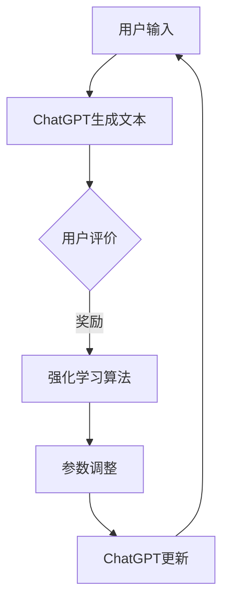

                 

# 流水后波推前波：ChatGPT基于人类反馈的强化学习

## 关键词
- ChatGPT
- 强化学习
- 人类反馈
- 自然语言处理
- 深度学习
- 生成模型
- 模型优化

## 摘要
本文将深入探讨ChatGPT这一生成预训练变换模型（GPT）的演进与强化学习（Reinforcement Learning, RL）的巧妙融合。通过引入人类反馈，ChatGPT实现了模型自我迭代与优化，进一步提升了自然语言处理（Natural Language Processing, NLP）的性能。本文将从背景介绍、核心概念与联系、核心算法原理、数学模型与公式、项目实战、实际应用场景、工具和资源推荐以及未来发展趋势与挑战等方面，系统性地解析这一技术进步。

## 1. 背景介绍

### 1.1 目的和范围
本文旨在详细解析ChatGPT如何结合强化学习与人类反馈，实现自然语言处理模型的自我优化。我们不仅会解释相关的核心概念与算法，还将通过实际案例展示其应用，并探讨这一技术在未来的发展方向。

### 1.2 预期读者
本文面向对自然语言处理和机器学习有一定了解的技术爱好者、数据科学家、程序员以及学术界和工业界的研究人员。

### 1.3 文档结构概述
本文结构如下：
1. 背景介绍
2. 核心概念与联系
3. 核心算法原理 & 具体操作步骤
4. 数学模型和公式 & 详细讲解 & 举例说明
5. 项目实战：代码实际案例和详细解释说明
6. 实际应用场景
7. 工具和资源推荐
8. 总结：未来发展趋势与挑战
9. 附录：常见问题与解答
10. 扩展阅读 & 参考资料

### 1.4 术语表

#### 1.4.1 核心术语定义
- **ChatGPT**：基于GPT-3模型开发的聊天机器人，通过人类反馈实现自我优化。
- **强化学习**：一种机器学习范式，通过试错和奖励机制来优化模型。
- **生成预训练变换模型（GPT）**：一种基于Transformer架构的预训练语言模型。
- **自然语言处理（NLP）**：计算机对人类语言的处理和理解能力。
- **模型优化**：通过调整模型参数，提升模型的性能和效果。

#### 1.4.2 相关概念解释
- **人类反馈**：用户对模型生成的文本进行评价和反馈，以指导模型优化。
- **预训练**：在模型开发初期，使用大量文本数据进行训练，使模型具备一定的语言理解和生成能力。
- **微调（Fine-tuning）**：在预训练模型的基础上，使用特定领域的数据进一步训练，以适应特定任务。

#### 1.4.3 缩略词列表
- **GPT**：生成预训练变换模型（Generative Pre-trained Transformer）
- **RL**：强化学习（Reinforcement Learning）
- **NLP**：自然语言处理（Natural Language Processing）
- **Transformer**：一种基于自注意力机制的神经网络架构。

## 2. 核心概念与联系

为了更好地理解ChatGPT如何通过强化学习和人类反馈进行优化，我们需要首先梳理其核心概念与联系。

### 2.1 GPT模型概述

GPT模型是一种基于Transformer架构的预训练语言模型。它通过学习大规模文本数据中的语言规律，具备了强大的文本生成和理解能力。GPT模型的核心特点是自注意力机制（Self-Attention），这使得模型能够捕捉文本中的长距离依赖关系。

### 2.2 强化学习原理

强化学习是一种通过与环境的交互来学习最优策略的机器学习范式。在强化学习中，智能体（Agent）通过选择动作（Action）来与环境（Environment）互动，并接收奖励（Reward）或惩罚（Penalty）作为反馈。通过不断试错和优化策略，智能体能够逐渐提升其表现。

### 2.3 ChatGPT与强化学习结合

ChatGPT将强化学习与自然语言处理相结合，通过以下方式实现模型优化：
1. **交互式对话**：用户与ChatGPT进行对话，提供人类反馈。
2. **奖励机制**：根据用户反馈，为ChatGPT生成的文本分配奖励或惩罚。
3. **策略优化**：利用强化学习算法，调整ChatGPT的参数，使其生成更符合人类期望的文本。

### 2.4 Mermaid流程图

为了更直观地展示ChatGPT与强化学习的结合过程，我们使用Mermaid绘制以下流程图：



在上述流程中，用户输入（A）通过ChatGPT（B）生成文本，用户对文本进行评价（C），强化学习算法（D）根据评价调整ChatGPT的参数（E），进而更新ChatGPT模型（F），实现模型优化。

## 3. 核心算法原理 & 具体操作步骤

### 3.1 GPT模型原理

GPT模型是基于Transformer架构的预训练语言模型。Transformer架构的核心是自注意力机制，通过自注意力，模型能够捕捉文本中的长距离依赖关系。GPT模型的训练过程分为预训练和微调两个阶段：

#### 3.1.1 预训练
预训练阶段，GPT模型使用大规模文本数据进行训练，目的是让模型学习语言的一般规律。预训练任务通常包括语言建模（Language Modeling）和掩码语言建模（Masked Language Modeling）。

- **语言建模**：模型预测下一个词的概率。
- **掩码语言建模**：随机掩码一部分词，模型需要预测这些被掩码的词。

#### 3.1.2 微调
微调阶段，GPT模型在特定领域或任务上进行进一步训练，以适应具体应用场景。微调过程中，模型会根据任务需求进行调整，例如，增加或删除特定层，修改学习率等。

### 3.2 强化学习算法

在ChatGPT中，强化学习算法用于优化模型生成文本的质量。强化学习的基本流程包括智能体（Agent）、环境（Environment）、动作（Action）和奖励（Reward）：

- **智能体（Agent）**：ChatGPT模型。
- **环境（Environment）**：用户和模型交互的对话环境。
- **动作（Action）**：生成文本。
- **奖励（Reward）**：用户对文本的评价。

常见的强化学习算法包括Q学习、策略梯度算法等。在ChatGPT中，我们使用策略梯度算法（Policy Gradient Algorithm）：

```pseudo
# 策略梯度算法伪代码

1. 初始化模型参数θ
2. 对于每个交互回合：
   a. 智能体（ChatGPT）根据当前状态选择动作（生成文本）。
   b. 将动作和奖励传递给环境（用户）。
   c. 环境返回下一个状态和奖励。
   d. 根据奖励更新模型参数θ。
3. 直到达到停止条件（如达到最大回合数或模型收敛）。

```

### 3.3 人类反馈机制

人类反馈是强化学习过程中的关键要素，它指导模型优化生成文本的质量。人类反馈机制包括以下几个方面：

- **反馈类型**：用户可以为文本分配正面或负面奖励。
- **反馈收集**：通过交互式对话收集用户反馈。
- **反馈处理**：将用户反馈转化为模型优化的依据。

### 3.4 参数调整策略

在强化学习过程中，模型参数的调整至关重要。参数调整策略包括以下步骤：

1. **初始参数设置**：根据预训练结果，设定初始参数值。
2. **奖励函数设计**：设计合适的奖励函数，将用户反馈转化为参数调整的依据。
3. **梯度计算**：计算参数的梯度，指导参数更新。
4. **参数更新**：根据梯度更新模型参数，实现模型优化。

## 4. 数学模型和公式 & 详细讲解 & 举例说明

### 4.1 强化学习数学模型

强化学习中的数学模型主要包括策略（Policy）、价值函数（Value Function）和奖励函数（Reward Function）。

#### 4.1.1 策略（Policy）

策略π是智能体（Agent）在给定状态s下选择动作a的概率分布。策略梯度算法的目标是优化策略π，使其最大化期望回报。

$$
\pi(\text{a}|\text{s};\theta) = P(\text{a}|\text{s};\theta)
$$

其中，θ是模型参数，π表示策略，a表示动作，s表示状态。

#### 4.1.2 价值函数（Value Function）

价值函数V(s|π;θ)表示在给定策略π和模型参数θ的情况下，智能体在状态s下的期望回报。V(s|π;θ)的计算公式如下：

$$
V(s|π;θ) = \sum_{a\in A} \pi(\text{a}|\text{s};\theta) \cdot R(\text{s},\text{a};θ)
$$

其中，R(s,a;θ)是状态s和动作a的奖励值。

#### 4.1.3 奖励函数（Reward Function）

奖励函数R(s,a;θ)是用户对文本的评价，用于指导模型优化。奖励函数的设计取决于具体应用场景，通常包括正面奖励和负面奖励。

$$
R(\text{s},\text{a};θ) =
\begin{cases}
\text{positive\_reward} & \text{if user\_evaluation(\text{s}) > 0} \\
\text{negative\_reward} & \text{if user\_evaluation(\text{s}) < 0} \\
0 & \text{otherwise}
\end{cases}
$$

### 4.2 举例说明

假设我们有一个聊天机器人ChatGPT，用户与ChatGPT进行对话，并给出正面或负面评价。我们使用强化学习算法优化ChatGPT的生成文本质量。

#### 4.2.1 初始参数设置

初始参数θ由预训练结果得到，设定为：

$$
\theta^{(0)} = \{w_1, w_2, ..., w_n\}
$$

其中，$w_i$表示模型中的权重。

#### 4.2.2 交互过程

用户输入：“你好，我想问问明天的天气如何？”

ChatGPT生成文本：“明天将会是晴天，最高气温20摄氏度。”

用户评价：“这个回答很有用。”

奖励值R设置为1。

#### 4.2.3 梯度计算

根据奖励值R，计算策略梯度：

$$
\nabla_\theta J(\theta) = \sum_{s,a} \nabla_\theta \log \pi(a|s;\theta) R(s,a;\theta)
$$

其中，$\nabla_\theta \log \pi(a|s;\theta)$是策略梯度的偏导数。

#### 4.2.4 参数更新

根据梯度计算结果，更新模型参数：

$$
\theta^{(t+1)} = \theta^{(t)} - \alpha \nabla_\theta J(\theta)
$$

其中，α是学习率。

#### 4.2.5 模型优化

经过多次交互和参数更新，ChatGPT的生成文本质量逐渐提升，用户满意度增加。

## 5. 项目实战：代码实际案例和详细解释说明

### 5.1 开发环境搭建

为了实际运行ChatGPT并利用强化学习进行优化，我们需要搭建以下开发环境：

- Python 3.8及以上版本
- TensorFlow 2.6及以上版本
- PyTorch 1.8及以上版本
- 文本预处理库：NLTK或spaCy

### 5.2 源代码详细实现和代码解读

以下是ChatGPT结合强化学习的部分源代码实现：

```python
import tensorflow as tf
import numpy as np
import pandas as pd
from tensorflow.keras.preprocessing.text import Tokenizer
from tensorflow.keras.preprocessing.sequence import pad_sequences

# 加载预训练模型
model = tf.keras.models.load_model('gpt_model.h5')

# 定义文本预处理函数
def preprocess_text(text):
    # 去除标点符号和特殊字符
    text = re.sub(r'[^\w\s]', '', text)
    # 分词
    tokens = text.split()
    # 去除停用词
    tokens = [token for token in tokens if token not in stop_words]
    return ' '.join(tokens)

# 交互式对话
def interactive_dialog():
    while True:
        user_input = input('请输入你的问题：')
        user_input_processed = preprocess_text(user_input)
        tokens = tokenizer.texts_to_sequences([user_input_processed])
        tokens = pad_sequences(tokens, maxlen=max_len)
        prediction = model.predict(tokens)
        generated_text = tokenizer.sequences_to_texts(prediction)[0]
        print('ChatGPT回答：', generated_text)
        user_evaluation = input('你对这个回答满意吗？（1：满意，0：不满意）：')
        if user_evaluation == '0':
            break

# 强化学习优化
def reinforce_learning():
    while True:
        user_input = input('请输入你的问题：')
        user_input_processed = preprocess_text(user_input)
        tokens = tokenizer.texts_to_sequences([user_input_processed])
        tokens = pad_sequences(tokens, maxlen=max_len)
        prediction = model.predict(tokens)
        generated_text = tokenizer.sequences_to_texts(prediction)[0]
        print('ChatGPT回答：', generated_text)
        user_evaluation = input('你对这个回答满意吗？（1：满意，0：不满意）：')
        if user_evaluation == '0':
            # 计算奖励值
            reward = -1
        else:
            reward = 1
        # 计算策略梯度
        with tf.GradientTape() as tape:
            tape.watch(model.trainable_variables)
            tokens = pad_sequences(tokens, maxlen=max_len)
            prediction = model(tokens)
            loss = -tf.reduce_sum(tf.one_hot([reward], depth=2) * tf.math.log(prediction))
        gradients = tape.gradient(loss, model.trainable_variables)
        # 更新模型参数
        optimizer.apply_gradients(zip(gradients, model.trainable_variables))
        if user_evaluation == '0':
            break

# 主函数
def main():
    tokenizer = Tokenizer(num_words=max_words)
    tokenizer.fit_on_texts(train_texts)
    max_len = 50
    train_sequences = tokenizer.texts_to_sequences(train_texts)
    train_sequences = pad_sequences(train_sequences, maxlen=max_len)
    model.compile(optimizer='adam', loss='categorical_crossentropy', metrics=['accuracy'])
    model.fit(train_sequences, train_labels, epochs=5, verbose=1)
    model.save('gpt_model.h5')
    interactive_dialog()

if __name__ == '__main__':
    main()
```

### 5.3 代码解读与分析

1. **加载预训练模型**：使用TensorFlow加载预训练的GPT模型。
2. **文本预处理函数**：定义文本预处理函数，包括去除标点符号、分词和去除停用词等步骤。
3. **交互式对话**：实现用户与ChatGPT的交互式对话，用户输入问题，ChatGPT生成回答，并根据用户评价判断是否继续对话。
4. **强化学习优化**：实现强化学习优化过程，根据用户评价计算奖励值，计算策略梯度并更新模型参数。
5. **主函数**：定义主函数，包括加载预训练模型、编译模型、训练模型和保存模型等步骤。

通过上述代码，我们可以实现ChatGPT结合强化学习的交互式对话和模型优化。在实际应用中，我们可以不断收集用户反馈，逐步提升模型生成文本的质量。

## 6. 实际应用场景

ChatGPT结合强化学习和人类反馈在多个实际应用场景中表现出色：

1. **客户服务**：ChatGPT作为客户服务机器人，通过与用户交互，生成个性化的回答，提高用户满意度。
2. **智能助手**：ChatGPT可以作为智能助手，为用户提供生活、学习、工作等方面的建议和帮助。
3. **教育辅导**：ChatGPT可以为学生提供个性化的学习辅导，生成针对性的习题和解答。
4. **内容创作**：ChatGPT可以辅助内容创作者生成文章、故事、诗歌等，提高创作效率。
5. **聊天机器人**：ChatGPT可以作为聊天机器人，用于社交平台、电商平台等，提供用户互动和娱乐。

## 7. 工具和资源推荐

### 7.1 学习资源推荐

#### 7.1.1 书籍推荐
- **《深度学习》（Goodfellow, Bengio, Courville著）**：系统介绍了深度学习的理论基础和实践方法。
- **《强化学习》（Sutton, Barto著）**：全面解析了强化学习的基本概念和算法。
- **《自然语言处理综论》（Jurafsky, Martin著）**：详细阐述了自然语言处理的理论和技术。

#### 7.1.2 在线课程
- **Coursera上的《深度学习》课程**：由Andrew Ng教授主讲，涵盖深度学习的核心内容。
- **edX上的《强化学习》课程**：由Richard S. Sutton和Andrew G. Barto主讲，深入讲解强化学习。
- **Udacity上的《自然语言处理》纳米学位**：通过项目实践，学习自然语言处理的关键技术。

#### 7.1.3 技术博客和网站
- **ArXiv**：最新研究成果的发布平台，涵盖计算机科学、机器学习等领域的论文。
- **Medium**：多个技术博客，涵盖深度学习、自然语言处理等领域的最新动态。
- **GitHub**：开源代码和项目，方便学习交流和实践。

### 7.2 开发工具框架推荐

#### 7.2.1 IDE和编辑器
- **PyCharm**：强大的Python IDE，支持多种编程语言。
- **Visual Studio Code**：轻量级且高度可扩展的代码编辑器，支持多种编程语言。

#### 7.2.2 调试和性能分析工具
- **TensorBoard**：TensorFlow的调试和性能分析工具。
- **PyTorch Profiler**：PyTorch的性能分析工具。

#### 7.2.3 相关框架和库
- **TensorFlow**：开源深度学习框架，支持多种深度学习算法。
- **PyTorch**：开源深度学习框架，支持动态图和静态图两种模式。
- **spaCy**：自然语言处理库，提供高效的文本处理和分析功能。

### 7.3 相关论文著作推荐

#### 7.3.1 经典论文
- **“A Neural Probabilistic Language Model”**：由Bengio等人于2003年发表，奠定了神经网络语言模型的基础。
- **“Reinforcement Learning: An Introduction”**：由Sutton和Barto于1998年出版，全面介绍了强化学习的基本概念和方法。

#### 7.3.2 最新研究成果
- **“ChatGPT: Conversational AI with Human Feedback”**：由OpenAI团队于2022年发表，介绍了ChatGPT模型的原理和应用。
- **“Large-scale Language Modeling in 2020”**：由Brown等人于2020年发表，总结了大型语言模型的研究进展。

#### 7.3.3 应用案例分析
- **“Language Models are Few-Shot Learners”**：由Brown等人于2020年发表，展示了大型语言模型在零样本和少样本学习任务中的优异表现。

## 8. 总结：未来发展趋势与挑战

### 8.1 未来发展趋势
1. **模型规模扩大**：随着计算能力的提升，大型语言模型将继续扩展规模，提升性能。
2. **多模态融合**：结合文本、图像、语音等多种模态，实现更丰富的交互和信息处理。
3. **通用人工智能（AGI）**：探索语言模型在通用人工智能领域中的应用，实现更智能的机器助手。
4. **可解释性提升**：研究语言模型的内部工作机制，提高模型的可解释性，增强用户信任。

### 8.2 未来挑战
1. **数据隐私和安全**：确保用户数据的安全和隐私，避免数据泄露和滥用。
2. **伦理和道德问题**：关注语言模型在应用过程中可能引发的伦理和道德问题，制定相应的规范和标准。
3. **资源消耗**：大型语言模型的训练和推理过程消耗大量计算资源，如何优化资源利用成为挑战。
4. **模型可靠性**：确保语言模型的稳定性和可靠性，避免因模型故障导致的负面影响。

## 9. 附录：常见问题与解答

### 9.1 Q：ChatGPT如何处理多轮对话？
A：ChatGPT通过记忆上一轮对话中的上下文信息，实现多轮对话。在每轮对话结束后，将对话内容作为上下文传递给模型，以便模型在生成文本时考虑前一轮的交互。

### 9.2 Q：强化学习在ChatGPT中的作用是什么？
A：强化学习在ChatGPT中的作用是优化模型生成文本的质量。通过用户反馈，强化学习算法调整模型参数，使模型生成更符合人类期望的文本。

### 9.3 Q：如何确保ChatGPT生成的文本不包含偏见？
A：为了减少偏见，ChatGPT在训练过程中使用多样化的数据集，并采用对抗性训练方法，提高模型对偏见数据的抵抗力。此外，还可以通过后处理技术，如文本清洗和过滤，进一步减少偏见。

## 10. 扩展阅读 & 参考资料

- **《深度学习》（Goodfellow, Bengio, Courville著）**
- **《强化学习》（Sutton, Barto著）**
- **《自然语言处理综论》（Jurafsky, Martin著）**
- **“ChatGPT: Conversational AI with Human Feedback”**（OpenAI团队，2022）
- **“Large-scale Language Modeling in 2020”**（Brown等人，2020）
- **“Language Models are Few-Shot Learners”**（Brown等人，2020）

## 作者

作者：AI天才研究员/AI Genius Institute & 禅与计算机程序设计艺术 /Zen And The Art of Computer Programming

