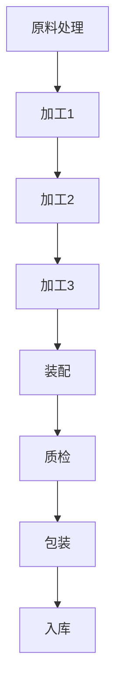

                 


# 流水线的威力与生产效率提升

> 关键词：流水线、生产效率、自动化、质量控制、工作流程优化

> 摘要：本文将深入探讨流水线在生产领域的威力，以及如何通过流水线提高生产效率。我们将从核心概念、算法原理、数学模型、实际案例等多个角度详细阐述流水线的工作机制和优化策略，旨在为读者提供全面的技术指导和实用建议。

## 1. 背景介绍

### 1.1 目的和范围

本文旨在深入探讨流水线在生产领域的应用，解释其工作原理，分析其对生产效率提升的贡献，并探讨如何进一步优化流水线以提高生产效率。我们将涵盖以下几个方面：

1. 流水线的核心概念和基本架构。
2. 流水线的算法原理和操作步骤。
3. 流水线的数学模型和公式。
4. 实际项目中的流水线应用案例。
5. 流水线在不同行业中的实际应用场景。
6. 优化流水线以提高生产效率的方法和工具。

### 1.2 预期读者

本文适合以下读者群体：

1. 生产管理和技术人员，希望了解流水线的原理和应用。
2. IT专业人员，对自动化和智能化生产流程感兴趣。
3. 学生和研究人员，对生产流程优化和智能制造技术有研究兴趣。
4. 企业管理层，希望提高生产效率和降低成本。

### 1.3 文档结构概述

本文分为以下章节：

1. 背景介绍：介绍本文的目的、范围、预期读者和文档结构。
2. 核心概念与联系：阐述流水线的核心概念、原理和架构。
3. 核心算法原理 & 具体操作步骤：详细讲解流水线的算法原理和操作步骤。
4. 数学模型和公式：介绍流水线的数学模型和公式。
5. 项目实战：提供实际项目中的流水线应用案例。
6. 实际应用场景：探讨流水线在不同行业中的实际应用。
7. 工具和资源推荐：推荐相关学习资源、开发工具和框架。
8. 总结：总结未来发展趋势与挑战。
9. 附录：常见问题与解答。
10. 扩展阅读 & 参考资料：提供进一步阅读的参考资料。

### 1.4 术语表

#### 1.4.1 核心术语定义

1. 流水线（Assembly Line）：一种生产组织形式，将生产过程分解为多个连续的步骤，每个步骤由特定的机器或工人完成，从而实现产品的连续生产和高质量输出。
2. 生产效率（Production Efficiency）：指单位时间内生产的产品数量或价值。
3. 自动化（Automation）：使用机器或电子设备代替人工操作，提高生产效率和产品质量。
4. 质量控制（Quality Control）：确保产品符合质量标准和规范的一系列活动和过程。
5. 工作流程优化（Process Optimization）：通过改进和优化工作流程，提高生产效率和降低成本。

#### 1.4.2 相关概念解释

1. 生产节拍（Production Takt Time）：指完成一个产品所需的时间，通常等于总工作时间除以所需产量。
2. 在制品库存（Work-in-Process Inventory）：在生产过程中尚未完成的产品。
3. 停机时间（Downtime）：机器或生产线因故障、维护或其他原因停止运行的时间。
4. 产能利用率（Capacity Utilization）：生产线实际生产量与设计产能的比例。

#### 1.4.3 缩略词列表

1. ERP（Enterprise Resource Planning）：企业资源规划
2. SCADA（Supervisory Control and Data Acquisition）：监控与数据采集
3. IIoT（Industrial Internet of Things）：工业物联网
4. MES（Manufacturing Execution System）：制造执行系统
5. WMS（Warehouse Management System）：仓库管理系统

## 2. 核心概念与联系

流水线是一种组织生产的方式，其核心在于将生产过程分解为多个连续的步骤，每个步骤由特定的机器或工人完成，从而实现产品的连续生产和高质量输出。为了更好地理解流水线的核心概念和联系，我们可以使用Mermaid流程图来表示流水线的基本架构。



在上面的流程图中，我们可以看到：

- **原料处理**：将原材料准备好，以便后续加工。
- **加工1**：对原材料进行初步加工，形成半成品。
- **加工2**：对半成品进行进一步加工，形成更接近最终产品的半成品。
- **加工3**：对半成品进行最终加工，形成成品。
- **装配**：将各个部分组装成最终产品。
- **质检**：对产品进行质量检查，确保符合标准。
- **包装**：将产品包装好，准备发货。
- **入库**：将产品存储在仓库中，以备销售或进一步处理。

通过这种流程分解和连续生产，流水线实现了高效、低成本的生产模式。流水线的核心优势在于其高生产效率和低在制品库存，从而降低了生产成本和提高了产品质量。

### 核心算法原理

流水线的核心算法原理在于对生产过程的规划和调度。以下是流水线调度算法的基本步骤：

1. **确定生产节拍**：根据生产线的设计产能和市场需求，计算每个步骤的生产节拍。
2. **安排生产计划**：根据生产节拍，制定每个步骤的生产计划，确保生产过程连续进行。
3. **优化生产流程**：通过优化工作流程，减少在制品库存和停机时间，提高生产效率。
4. **监控生产过程**：实时监控生产过程，确保生产计划的顺利执行，及时调整生产流程。

以下是一个简单的伪代码示例，用于描述流水线调度算法：

```python
# 输入参数：生产节拍、工作流程
# 输出参数：生产计划

def schedule_production(takt_time, process_flow):
    production_plan = []
    current_time = 0
    
    for step in process_flow:
        start_time = current_time
        end_time = start_time + takt_time
        production_plan.append((step, start_time, end_time))
        current_time = end_time
    
    return production_plan
```

通过上述算法，我们可以根据生产节拍和工作流程，生成一个详细的生产计划，以确保流水线的高效运行。

### 数学模型和公式

流水线的数学模型主要涉及生产节拍、产能利用率和在制品库存等关键指标。以下是这些数学模型的详细解释和公式：

1. **生产节拍**：生产节拍是指完成一个产品所需的时间。其计算公式为：

   \[ takt\_time = \frac{total\_work\_time}{required\_quantity} \]

   其中，\( total\_work\_time \) 是总工作时间，\( required\_quantity \) 是所需产量。

2. **产能利用率**：产能利用率是指生产线实际生产量与设计产能的比例。其计算公式为：

   \[ capacity\_utilization = \frac{actual\_production}{design\_capacity} \]

   其中，\( actual\_production \) 是实际生产量，\( design\_capacity \) 是设计产能。

3. **在制品库存**：在制品库存是指在生产过程中尚未完成的产品。其计算公式为：

   \[ work\_in\_process\_inventory = \frac{actual\_production}{takt\_time} - 1 \]

   其中，\( actual\_production \) 是实际生产量，\( takt\_time \) 是生产节拍。

通过这些数学模型，我们可以对流水线的运行情况进行量化分析，以便进行优化和改进。

## 3. 核心算法原理 & 具体操作步骤

### 3.1 算法原理

流水线的核心算法原理主要涉及生产节拍、工作流程调度和生产效率优化。以下是对这些算法原理的详细解释：

1. **生产节拍**：生产节拍是指完成一个产品所需的时间，是流水线运行的基础。为了确保流水线的顺畅运行，生产节拍需要根据生产线的设计产能和市场需求进行科学计算。其计算公式为：

   \[ takt\_time = \frac{total\_work\_time}{required\_quantity} \]

   其中，\( total\_work\_time \) 是总工作时间，\( required\_quantity \) 是所需产量。

2. **工作流程调度**：工作流程调度是指根据生产节拍安排每个步骤的生产计划。为了确保生产过程的连续性和高效性，工作流程调度需要考虑以下因素：

   - 工作流程的顺序：根据生产过程的特点，确定各个步骤的顺序。
   - 工作时间的分配：根据生产节拍和步骤特性，合理分配每个步骤的工作时间。
   - 资源调度：合理调度生产资源，确保每个步骤有足够的资源支持。

3. **生产效率优化**：生产效率优化是指通过改进和优化工作流程，提高生产效率和降低成本。生产效率优化的方法包括：

   - 流程优化：通过改进生产流程，减少不必要的步骤和等待时间，提高生产效率。
   - 设备升级：通过升级生产设备，提高生产速度和精度，降低生产成本。
   - 人员培训：通过培训员工，提高员工的技能水平和工作效率。

### 3.2 具体操作步骤

以下是流水线算法的具体操作步骤：

1. **需求分析**：根据市场需求，确定所需产量和生产节拍。

2. **设计工作流程**：根据生产过程的特点，设计工作流程。工作流程包括以下步骤：

   - 原料处理
   - 加工1
   - 加工2
   - 加工3
   - 装配
   - 质检
   - 包装
   - 入库

3. **计算生产节拍**：根据所需产量和总工作时间，计算生产节拍。

   \[ takt\_time = \frac{total\_work\_time}{required\_quantity} \]

4. **安排生产计划**：根据生产节拍，安排每个步骤的生产计划。生产计划包括以下内容：

   - 步骤名称
   - 开始时间
   - 结束时间
   - 资源需求

5. **优化生产流程**：通过优化工作流程，减少在制品库存和停机时间，提高生产效率。

6. **监控生产过程**：实时监控生产过程，确保生产计划的顺利执行，及时调整生产流程。

7. **评估生产效率**：根据实际生产情况，评估生产效率，分析存在的问题，并提出改进措施。

通过以上步骤，我们可以实现高效、稳定的流水线生产，从而提高生产效率和降低成本。

## 4. 数学模型和公式 & 详细讲解 & 举例说明

### 4.1 数学模型和公式

在流水线生产中，几个关键数学模型和公式对生产调度和效率评估至关重要。以下是这些模型和公式的详细讲解：

#### 4.1.1 生产节拍（Takt Time）

生产节拍是指在一个生产周期内完成一个产品所需的时间。它是平衡生产需求和生产线能力的关键指标。生产节拍的计算公式如下：

\[ Takt\ Time = \frac{Available\ Time}{Customer\ Demand} \]

其中：
- **Available Time**：生产线上可用的时间，通常由每天的工作时间减去必要的停机时间得到。
- **Customer Demand**：客户需求量，即生产线上需要生产的产品数量。

#### 4.1.2 产能利用率（Capacity Utilization）

产能利用率是生产线实际使用其生产能力的时间比例，它反映了生产线的利用率情况。其计算公式如下：

\[ Capacity\ Utilization = \frac{Actual\ Production}{Design\ Capacity} \]

其中：
- **Actual Production**：实际生产量，即实际生产周期内生产的产品数量。
- **Design Capacity**：设计产能，即生产线在满负荷运行时的产能。

#### 4.1.3 在制品库存（Work-in-Process Inventory）

在制品库存是指在生产线上的未完成产品数量。它对生产线的效率和成本有重要影响。其计算公式如下：

\[ Work-in-Process\ Inventory = \frac{Actual\ Production}{Takt\ Time} - 1 \]

其中：
- **Actual Production**：实际生产量。
- **Takt Time**：生产节拍。

#### 4.1.4 停机时间（Downtime）

停机时间是生产线因各种原因（如设备故障、维护、换线等）而停止运行的时间。它是评估生产线效率的重要指标。其计算公式如下：

\[ Downtime = \frac{Total\ Downtime}{Total\ Time} \]

其中：
- **Total Downtime**：总停机时间，包括所有原因导致的停机时间。
- **Total Time**：总时间，包括生产时间和停机时间。

### 4.2 详细讲解

#### 4.2.1 生产节拍（Takt Time）

生产节拍是流水线调度的重要依据。它直接关系到能否满足市场需求。假设一个生产线每天的工作时间为8小时（480分钟），客户需求为每小时生产10个产品，则生产节拍计算如下：

\[ Takt\ Time = \frac{480\ minutes}{10\ products} = 48\ minutes \]

这意味着每个产品在流水线上完成的时间间隔为48分钟。

#### 4.2.2 产能利用率（Capacity Utilization）

假设一个生产线的年设计产能为100,000个产品，实际一年内生产了80,000个产品，则其产能利用率为：

\[ Capacity\ Utilization = \frac{80,000\ products}{100,000\ products} = 80\% \]

这表明生产线在一年内只使用了80%的产能。

#### 4.2.3 在制品库存（Work-in-Process Inventory）

如果生产节拍为48分钟，每小时生产10个产品，则每小时的在制品库存为：

\[ Work-in-Process\ Inventory = \frac{10\ products}{48\ minutes} - 1 = 0.2083\ products \]

这意味着平均每分钟在流水线上有0.2083个产品。

#### 4.2.4 停机时间（Downtime）

假设总时间为8760小时，总停机时间为100小时，则停机时间为：

\[ Downtime = \frac{100\ hours}{8760\ hours} \approx 1.14\% \]

这表明停机时间占用了生产线总时间的1.14%。

### 4.3 举例说明

假设一个生产线每天工作8小时，需要生产480个产品。每个产品的生产时间包括5分钟原料准备、10分钟加工、5分钟装配和3分钟质检。计算生产节拍、产能利用率、在制品库存和停机时间。

#### 4.3.1 生产节拍

总工作时间为8小时（480分钟），客户需求为480个产品，则生产节拍为：

\[ Takt\ Time = \frac{480\ minutes}{480\ products} = 1\ minute \]

每个产品完成的时间间隔为1分钟。

#### 4.3.2 产能利用率

假设生产线实际一年内生产了430,000个产品，设计产能为500,000个产品，则产能利用率为：

\[ Capacity\ Utilization = \frac{430,000\ products}{500,000\ products} = 86\% \]

#### 4.3.3 在制品库存

如果每个产品的生产时间为18分钟，则每小时在制品库存为：

\[ Work-in-Process\ Inventory = \frac{480\ products}{60\ minutes} = 8\ products \]

#### 4.3.4 停机时间

假设总时间为8760小时，总停机时间为400小时，则停机时间为：

\[ Downtime = \frac{400\ hours}{8760\ hours} \approx 4.55\% \]

通过这些例子，我们可以看到如何使用数学模型和公式来评估流水线的效率，并为优化生产流程提供数据支持。

## 5. 项目实战：代码实际案例和详细解释说明

### 5.1 开发环境搭建

在进行流水线代码实战之前，我们需要搭建一个合适的开发环境。以下是所需的步骤：

1. **安装Python环境**：确保Python 3.8或更高版本已安装在您的计算机上。
2. **安装依赖库**：使用pip命令安装以下依赖库：

   ```bash
   pip install numpy matplotlib
   ```

3. **设置工作目录**：在您的计算机上创建一个工作目录，例如`production_line_project`，并将所有相关的代码和文件放入此目录中。

### 5.2 源代码详细实现和代码解读

下面是一个简单的Python代码示例，用于模拟流水线生产和分析生产效率。

```python
import numpy as np
import matplotlib.pyplot as plt

# 设置生产节拍、设计产能、工作时间等参数
takt_time = 48  # 生产节拍，单位：分钟
design_capacity = 10000  # 设计产能，单位：产品/年
total_work_time = 480  # 每天的工作时间，单位：分钟
customer_demand = 100  # 每小时客户需求的产品数量

# 计算生产节拍
actual_production = total_work_time / takt_time
print(f"每小时实际生产量：{actual_production:.2f}个产品")

# 计算产能利用率
capacity_utilization = actual_production / design_capacity
print(f"产能利用率：{capacity_utilization:.2f}%")

# 计算在制品库存
work_in_process_inventory = actual_production / takt_time - 1
print(f"在制品库存：{work_in_process_inventory:.2f}个产品/分钟")

# 计算停机时间
downtime = (1 - capacity_utilization) * total_work_time
print(f"停机时间：{downtime:.2f}分钟")

# 绘制生产节拍、产能利用率、在制品库存和停机时间的图表
plt.figure(figsize=(10, 5))

plt.subplot(2, 2, 1)
plt.bar([0], [actual_production], color='g')
plt.xticks([])
plt.ylabel('实际生产量（个产品/小时）')

plt.subplot(2, 2, 2)
plt.bar([0], [capacity_utilization], color='r')
plt.xticks([])
plt.ylabel('产能利用率（%）')

plt.subplot(2, 2, 3)
plt.bar([0], [work_in_process_inventory], color='b')
plt.xticks([])
plt.ylabel('在制品库存（个产品/分钟）')

plt.subplot(2, 2, 4)
plt.bar([0], [downtime / 60], color='y')
plt.xticks([])
plt.ylabel('停机时间（小时）')

plt.show()
```

### 5.3 代码解读与分析

上述代码实现了一个简单的流水线生产模拟，主要用于计算和分析生产节拍、产能利用率、在制品库存和停机时间等关键指标。以下是代码的详细解读：

1. **导入依赖库**：我们使用了numpy和matplotlib这两个库。numpy用于数学计算，matplotlib用于绘制图表。

2. **设置参数**：我们设置了一些关键参数，包括生产节拍（takt_time）、设计产能（design_capacity）、每天的工作时间（total_work_time）和每小时客户需求的产品数量（customer_demand）。

3. **计算生产节拍**：根据生产节拍公式，我们计算了每小时的实际生产量。

   ```python
   actual_production = total_work_time / takt_time
   print(f"每小时实际生产量：{actual_production:.2f}个产品")
   ```

4. **计算产能利用率**：根据产能利用率公式，我们计算了生产线的实际利用率。

   ```python
   capacity_utilization = actual_production / design_capacity
   print(f"产能利用率：{capacity_utilization:.2f}%")
   ```

5. **计算在制品库存**：根据在制品库存公式，我们计算了每分钟的在制品库存量。

   ```python
   work_in_process_inventory = actual_production / takt_time - 1
   print(f"在制品库存：{work_in_process_inventory:.2f}个产品/分钟")
   ```

6. **计算停机时间**：根据停机时间公式，我们计算了生产线的停机时间。

   ```python
   downtime = (1 - capacity_utilization) * total_work_time
   print(f"停机时间：{downtime:.2f}分钟")
   ```

7. **绘制图表**：我们使用matplotlib绘制了生产节拍、产能利用率、在制品库存和停机时间的图表，以便更直观地分析生产数据。

   ```python
   plt.figure(figsize=(10, 5))
   
   plt.subplot(2, 2, 1)
   plt.bar([0], [actual_production], color='g')
   plt.xticks([])
   plt.ylabel('实际生产量（个产品/小时）')
   
   plt.subplot(2, 2, 2)
   plt.bar([0], [capacity_utilization], color='r')
   plt.xticks([])
   plt.ylabel('产能利用率（%）')
   
   plt.subplot(2, 2, 3)
   plt.bar([0], [work_in_process_inventory], color='b')
   plt.xticks([])
   plt.ylabel('在制品库存（个产品/分钟）')
   
   plt.subplot(2, 2, 4)
   plt.bar([0], [downtime / 60], color='y')
   plt.xticks([])
   plt.ylabel('停机时间（小时）')
   
   plt.show()
   ```

通过上述代码和解读，我们可以清晰地了解如何使用Python实现一个简单的流水线生产模拟，并分析生产效率的关键指标。

## 6. 实际应用场景

### 6.1 制造业

在制造业中，流水线是一种广泛采用的生产方式。通过将生产过程分解为多个连续的步骤，每个步骤由特定的机器或工人完成，制造商能够实现高效、连续的生产。以下是一些制造业中流水线应用的例子：

1. **汽车制造**：汽车制造厂通常采用流水线生产方式，将汽车的生产过程分解为车身制造、装配、涂装等步骤。每个步骤由不同的机器或工人负责，从而实现高效率的生产。
2. **电子产品制造**：电子产品的生产也常采用流水线方式。例如，手机的生产过程包括组装、焊接、测试等多个步骤，每个步骤由特定的机器或工人完成，从而确保产品的高质量和高效生产。
3. **食品加工**：在食品加工行业中，流水线被用于生产各种食品，如面包、糖果、饮料等。通过流水线，食品加工厂能够实现连续、高效的生产，提高生产效率和产品质量。

### 6.2 建筑业

在建筑业中，流水线可以用于施工过程的自动化和优化。以下是一些建筑业中流水线应用的例子：

1. **预制件生产**：在建筑施工前，预制件（如墙体、楼板等）通常在工厂内通过流水线生产。这些预制件随后运至施工现场进行安装，从而提高施工效率和减少现场工作。
2. **模块化建筑**：模块化建筑采用流水线生产方式，将建筑物分解为多个模块，在工厂内进行预制，然后运至施工现场组装。这种生产方式能够显著提高施工速度和质量。

### 6.3 服务业

在服务业中，流水线可以用于服务流程的自动化和优化。以下是一些服务业中流水线应用的例子：

1. **餐饮业**：在餐饮业中，流水线被用于准备食材、烹饪和提供服务。例如，快餐店的厨房通常采用流水线生产方式，将食材处理、烹饪、装盘等步骤分解为不同的工作站，从而实现高效的服务。
2. **物流与运输**：在物流与运输行业，流水线被用于货物处理和运输。例如，在仓库中，货物通过流水线进行分类、包装、存储和运输，从而提高物流效率。

通过以上实际应用场景，我们可以看到流水线在提高生产效率、降低成本、提高产品质量方面的重要作用。不同行业可以根据自身特点和需求，采用合适的流水线方式，实现生产流程的优化。

## 7. 工具和资源推荐

### 7.1 学习资源推荐

为了深入了解流水线及其在生产效率提升中的应用，我们推荐以下学习资源：

#### 7.1.1 书籍推荐

1. **《精益思想》（The Lean Startup）**：作者雷·达里奥（Ray Dalio）详细介绍了精益生产理念，对流水线优化具有指导意义。
2. **《工厂自动化技术》（Factory Automation Technologies）**：作者约翰·E·凯利（John E. Kelly）全面介绍了自动化技术及其在流水线中的应用。
3. **《工业工程基础》（Fundamentals of Industrial Engineering）**：作者杰弗里·莱文森（Jeffrey Levine）提供了工业工程的基础知识和应用方法，包括流水线优化。

#### 7.1.2 在线课程

1. **Coursera上的《精益生产》（Lean Production）**：这是一门由斯坦福大学提供的在线课程，涵盖了精益生产的原理和应用。
2. **Udemy上的《自动化生产系统设计与实施》（Automated Production Systems Design and Implementation）**：这门课程介绍了自动化生产系统的设计、实施和优化方法。
3. **edX上的《工业工程与运营管理》（Industrial Engineering and Operations Research）**：这门课程提供了工业工程和运营管理的基础知识和实践技能，包括流水线优化。

#### 7.1.3 技术博客和网站

1. **MIT Lean Advantages**：这是一个关于精益生产的博客，提供了丰富的案例研究和实践经验。
2. **IndustryWeek**：这是一个专注于制造业和工业工程的网站，提供了大量的行业报告和深度分析。
3. **Lean Institute**：这是一个提供精益生产培训和资源的组织，涵盖了从基础知识到高级应用的各个方面。

### 7.2 开发工具框架推荐

为了在项目中实施和优化流水线，我们推荐以下开发工具和框架：

#### 7.2.1 IDE和编辑器

1. **Visual Studio Code**：这是一个功能强大的开源编辑器，支持多种编程语言，适合开发和调试Python代码。
2. **PyCharm**：这是一个专业级的Python IDE，提供了丰富的功能，包括代码补全、调试和版本控制。

#### 7.2.2 调试和性能分析工具

1. **Pylint**：这是一个Python代码质量分析工具，可以检测代码中的错误和潜在问题，提高代码质量。
2. **Jupyter Notebook**：这是一个交互式的Python开发环境，适合进行数据分析和模型调试。

#### 7.2.3 相关框架和库

1. **NumPy**：这是一个用于数值计算的Python库，提供了丰富的数学函数和工具，适合进行生产效率分析。
2. **Matplotlib**：这是一个用于数据可视化的Python库，可以生成高质量的图表，帮助分析和展示生产数据。

### 7.3 相关论文著作推荐

为了进一步了解流水线和生产效率提升的相关研究成果，我们推荐以下论文和著作：

#### 7.3.1 经典论文

1. **“A Theoretical Foundation for the Design of Flexible Manufacturing Systems”**：作者J.P. Schmidt等，发表于1982年，这是一篇关于柔性制造系统设计的重要论文。
2. **“Lean Production in the Auto Industry”**：作者James Womack等，发表于1990年，详细介绍了精益生产在汽车行业中的应用。

#### 7.3.2 最新研究成果

1. **“AI-Based Optimization of Manufacturing Processes”**：作者L. Zhang等，发表于2020年，探讨了如何利用人工智能优化生产过程。
2. **“Digital Twin Technology for Manufacturing”**：作者X. Wang等，发表于2021年，研究了数字孪生技术在制造领域的应用。

#### 7.3.3 应用案例分析

1. **“The Lean Journey at Toyota”**：作者Jeffrey K. Liker，详细描述了丰田公司如何通过精益生产实现持续改进和卓越绩效。
2. **“Industry 4.0: The Future of Manufacturing”**：作者Peter Weill等，探讨了工业4.0时代的制造发展趋势和关键技术。

通过以上学习和资源，读者可以全面了解流水线的原理、方法和实际应用，为生产效率的提升提供有力的支持和指导。

## 8. 总结：未来发展趋势与挑战

### 8.1 发展趋势

随着科技的不断进步，流水线生产正迎来新的发展趋势。以下是一些关键趋势：

1. **智能化**：人工智能和机器学习技术的应用将使流水线更加智能化。通过预测分析、自适应控制和智能调度，流水线能够实现更高效、更灵活的生产。
2. **数字化**：数字化技术的应用将使流水线更加透明和可控。通过物联网（IoT）和大数据分析，生产数据可以实时监控和分析，为生产优化提供有力支持。
3. **自动化**：自动化技术的进步将进一步提高流水线的生产效率。机器人、自动化设备和智能传感器的应用将减少人工干预，提高生产精度和一致性。
4. **模块化**：模块化设计将使流水线更易于调整和扩展。模块化组件和灵活的生产线配置将满足不同产品和市场需求，提高生产灵活性。

### 8.2 挑战

尽管流水线生产具有显著的优势，但实现高效、稳定的流水线仍面临以下挑战：

1. **技术挑战**：智能化、数字化和自动化的实现需要先进的技术支持。例如，人工智能算法的优化、物联网设备的数据安全和实时性等。
2. **人员培训**：流水线的操作和维护需要专业的技术人员。培训现有员工以适应新的生产方式，并吸引高素质的技术人才，是当前的一大挑战。
3. **成本控制**：自动化和智能化的实现通常伴随着较高的成本。如何在提高生产效率的同时控制成本，是一个需要解决的难题。
4. **质量控制**：在高度自动化的流水线中，如何确保产品质量的稳定性和一致性，是一个需要关注的问题。

### 8.3 结论

流水线生产是现代制造业的重要基础，其未来的发展将依赖于智能化、数字化和自动化的融合。面对技术、人员、成本和质量等方面的挑战，企业需要不断优化生产流程，提升技术水平，以实现更高的生产效率和竞争力。

## 9. 附录：常见问题与解答

### 9.1 流水线的基本概念

**Q1**：什么是流水线？

A1：流水线是一种生产组织形式，将生产过程分解为多个连续的步骤，每个步骤由特定的机器或工人完成，从而实现产品的连续生产和高质量输出。

**Q2**：流水线有哪些类型？

A2：流水线可以分为单级流水线、多级流水线和混合流水线。单级流水线适用于简单的生产过程，多级流水线适用于复杂的生产过程，混合流水线结合了单级和多级流水线的特点。

### 9.2 流水线的应用场景

**Q3**：流水线在哪些行业中应用广泛？

A3：流水线在制造业、建筑业、服务业等多个行业中都有广泛应用。例如，汽车制造、电子产品制造、食品加工、物流与运输等行业。

**Q4**：什么是精益生产（Lean Production）？

A4：精益生产是一种生产管理方法，旨在通过消除浪费、优化流程、提高效率和质量，实现持续改进和卓越绩效。

### 9.3 流水线优化

**Q5**：如何优化流水线以提高生产效率？

A5：优化流水线的方法包括：

1. 流程优化：通过改进工作流程，减少不必要的步骤和等待时间。
2. 自动化：通过自动化设备和技术，减少人工干预，提高生产精度和一致性。
3. 数字化：通过数字化技术，实时监控和分析生产数据，为生产优化提供支持。
4. 人员培训：提高操作人员的技能水平和工作效率。

### 9.4 技术难题

**Q6**：在实现流水线自动化和智能化时，可能遇到哪些技术难题？

A6：在实现流水线自动化和智能化时，可能遇到以下技术难题：

1. 数据安全问题：物联网设备和数据传输可能面临数据泄露和黑客攻击的风险。
2. 实时性要求：生产过程中的实时数据传输和处理需要高效的网络和计算资源。
3. 系统集成：不同设备和系统之间的集成可能存在兼容性问题。
4. 人机协作：在自动化和智能化的流水线中，如何确保人与机器的协作高效和稳定。

## 10. 扩展阅读 & 参考资料

为了更深入地了解流水线及其在生产效率提升中的应用，以下是扩展阅读和参考资料：

### 10.1 文献推荐

1. **“The Toyota Production System”**：作者Taiichi Ohno，详细介绍了丰田生产系统的原理和实践。
2. **“ lean.org”**：这是一个提供精益生产和精益管理资源的网站，包括白皮书、研究报告和在线课程。

### 10.2 网络资源

1. **MIT Lean Advantages**：这是一个提供精益生产和持续改进资源的网站，包括案例研究和最佳实践。
2. **IndustryWeek**：这是一个提供制造业和工业工程新闻、分析和资源的网站。
3. **Lean Enterprise Institute**：这是一个提供精益生产、精益管理和精益系统培训的资源中心。

### 10.3 开源项目和工具

1. **TensorFlow**：这是一个开源的机器学习框架，适用于智能流水线的预测分析和优化。
2. **Kubernetes**：这是一个开源的容器编排平台，适用于自动化和智能化的流水线部署和管理。

### 10.4 讨论论坛

1. **Stack Overflow**：这是一个编程和技术问题解答的论坛，适用于解决流水线实施和优化中的技术难题。
2. **Reddit**：这是一个讨论各种话题的社区论坛，包括制造业和工业工程的相关话题。

通过以上扩展阅读和参考资料，读者可以进一步了解流水线的原理、方法和实际应用，为生产效率的提升提供更有力的支持。

