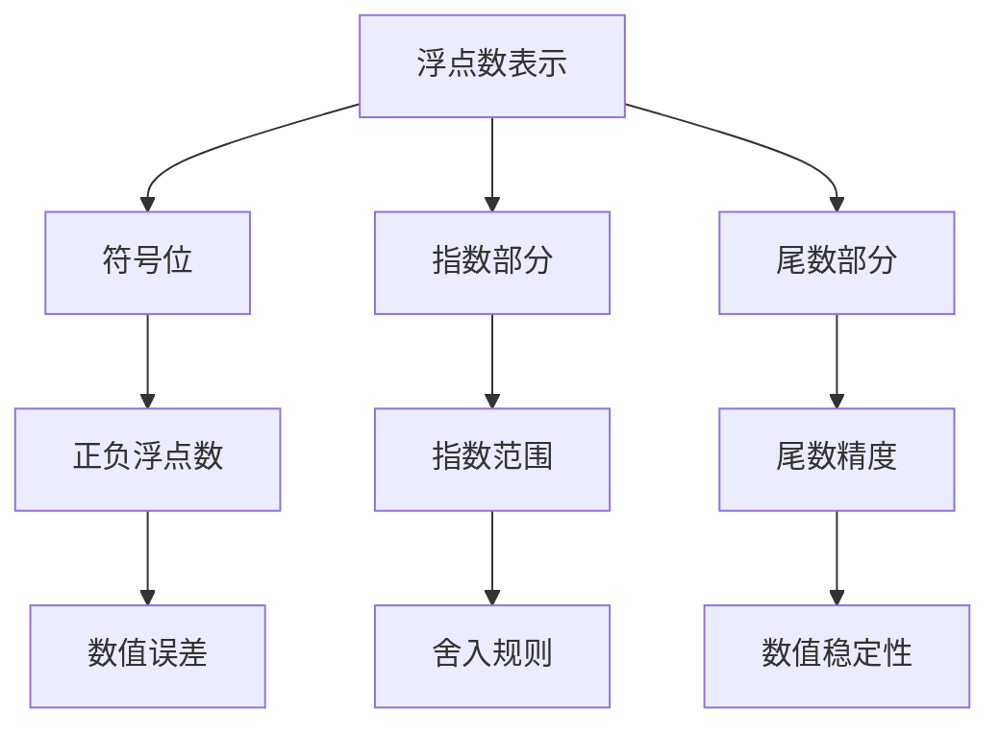

                 

# 浮点数精度：AI计算中的双刃剑

> **关键词：** 浮点数、精度、AI计算、数值误差、舍入规则、性能优化

> **摘要：** 本文将深入探讨浮点数在AI计算中的重要性，分析其精度问题及其对算法性能的影响。通过详细的原理分析、算法讲解、数学模型描述以及实际代码案例，帮助读者全面理解浮点数的双重性质，并探讨其在AI领域中的优化策略。

## 1. 背景介绍

### 1.1 目的和范围

本文旨在深入探讨浮点数在AI计算中的应用及其潜在问题。我们将从浮点数的定义出发，逐步分析其在数值计算中的精度问题，并探讨如何通过算法优化来提高浮点数的计算精度。

### 1.2 预期读者

本文适合具有一定计算机编程基础和数学知识的读者，特别是对AI计算领域感兴趣的从业者。通过本文，读者可以了解浮点数的原理及其在AI计算中的应用，为后续的研究和实践打下基础。

### 1.3 文档结构概述

本文结构如下：

1. 背景介绍：介绍本文的目的、范围和预期读者。
2. 核心概念与联系：通过Mermaid流程图展示浮点数的核心概念及其相互关系。
3. 核心算法原理 & 具体操作步骤：详细讲解浮点数的算法原理和操作步骤，使用伪代码进行阐述。
4. 数学模型和公式 & 详细讲解 & 举例说明：介绍浮点数相关的数学模型和公式，并给出实例说明。
5. 项目实战：通过实际代码案例展示浮点数的应用，并进行详细解释和分析。
6. 实际应用场景：讨论浮点数在AI计算中的实际应用场景。
7. 工具和资源推荐：推荐相关的学习资源、开发工具和论文著作。
8. 总结：对浮点数在AI计算中的未来发展趋势和挑战进行总结。
9. 附录：常见问题与解答。
10. 扩展阅读 & 参考资料：提供扩展阅读和参考资料。

### 1.4 术语表

#### 1.4.1 核心术语定义

- **浮点数**：表示实数的数据类型，包括符号、指数和尾数三个部分。
- **精度**：表示浮点数能够精确表示的数值范围。
- **舍入规则**：用于处理浮点数运算中可能出现的舍入误差。
- **AI计算**：利用人工智能技术进行数据分析和处理的过程。

#### 1.4.2 相关概念解释

- **数值误差**：由于浮点数的表示限制，导致计算结果与实际值之间的差异。
- **数值稳定性**：在数值计算中，输入和输出数据之间的稳定关系。

#### 1.4.3 缩略词列表

- **IEEE 754**：一种浮点数表示标准。
- **FPU**：浮点运算单元（Floating Point Unit）。

## 2. 核心概念与联系

为了更好地理解浮点数在AI计算中的重要性，我们首先需要了解其核心概念和相互关系。以下是浮点数相关的Mermaid流程图，展示其基本结构和关键组成部分。



### 2.1 浮点数表示

浮点数是一种用于表示实数的数据类型，其基本结构包括符号位、指数部分和尾数部分。

- **符号位**：用于表示浮点数的正负，0表示正数，1表示负数。
- **指数部分**：用于表示浮点数的指数，其范围通常为\( -2^{k-1} \)到\( 2^{k-1}-1 \)（其中\( k \)为指数位数）。
- **尾数部分**：用于表示浮点数的有效数字，其精度受到尾数位数的限制。

### 2.2 符号位与数值误差

符号位决定了浮点数的正负，但其对数值误差的产生也有一定影响。例如，对于两个正数相加，符号位的不同可能导致结果的正负差异，从而产生误差。

### 2.3 指数部分与舍入规则

指数部分用于表示浮点数的指数，其范围决定了浮点数的表示能力。然而，在浮点数运算中，舍入规则是处理指数部分误差的关键。常见的舍入规则包括：

- **向上舍入**：将浮点数向上舍入到最接近的整数。
- **向下舍入**：将浮点数向下舍入到最接近的整数。
- **向零舍入**：将浮点数舍入到零。
- **向最近舍入**：将浮点数舍入到最接近的整数，如果两个整数距离相等，则向零舍入。

### 2.4 尾数部分与数值稳定性

尾数部分用于表示浮点数的有效数字，其精度受到尾数位数的限制。在浮点数运算中，尾数部分的误差可能导致数值不稳定，从而影响算法的性能。

## 3. 核心算法原理 & 具体操作步骤

在了解了浮点数的基本概念后，我们接下来将详细讲解浮点数的算法原理和具体操作步骤。以下是浮点数算法的伪代码，用于阐述其基本操作。

```plaintext
函数 float_add(a, b):
    # 将浮点数a和b的符号位、指数部分和尾数部分分别提取出来
    sa, ea, fa = float_extract(a)
    sb, eb, fb = float_extract(b)

    # 判断a和b的符号
    if sa != sb:
        # 如果a和b的符号不同，则返回零
        return 0.0

    # 将a和b的指数部分进行对齐
    while ea != eb:
        if ea > eb:
            # 如果a的指数大于b的指数，则将b的尾数向左移动一位
            fb = float_shift_left(fb)
            eb = eb + 1
        else:
            # 如果a的指数小于b的指数，则将a的尾数向左移动一位
            fa = float_shift_left(fa)
            ea = ea + 1

    # 计算a和b的尾数之和
    result = float_addition(fa, fb)

    # 对结果进行舍入
    result = float_rounding(result)

    # 将结果封装成浮点数
    return float_pack(result, sa, ea)
```

### 3.1 浮点数提取

浮点数提取是将浮点数分解为符号位、指数部分和尾数部分的过程。以下是浮点数提取的伪代码。

```plaintext
函数 float_extract(x):
    # 提取符号位
    sa = float_get_sign(x)

    # 提取指数部分
    ea = float_get_exponent(x)

    # 提取尾数部分
    fa = float_get_fraction(x)

    return sa, ea, fa
```

### 3.2 浮点数对齐

浮点数对齐是将两个浮点数的指数部分调整为相同的过程。这是因为在浮点数加法中，只有指数部分相同的浮点数才能进行有效相加。

### 3.3 浮点数加法

浮点数加法是浮点数运算中最基本的操作。其基本原理是将两个浮点数的尾数部分进行相加，并根据指数部分对结果进行舍入。

### 3.4 浮点数舍入

浮点数舍入是处理浮点数运算中可能出现的舍入误差的过程。常见的舍入规则有向上舍入、向下舍入、向零舍入和向最近舍入。

### 3.5 浮点数封装

浮点数封装是将浮点数的符号位、指数部分和尾数部分重新组合成浮点数的过程。

## 4. 数学模型和公式 & 详细讲解 & 举例说明

在浮点数运算中，数学模型和公式起着至关重要的作用。以下我们将介绍浮点数相关的数学模型和公式，并通过实例进行详细讲解。

### 4.1 浮点数表示

浮点数的基本表示方法为：

\[ x = (-1)^s \times 2^{e-b} \times (1 + f) \]

其中，\( s \)为符号位，\( e \)为指数，\( b \)为指数偏移量，\( f \)为尾数。

### 4.2 浮点数加法

浮点数加法的数学模型为：

\[ x + y = (-1)^{s_1 + s_2} \times 2^{\max(e_1, e_2) + b} \times (1 + f') \]

其中，\( s_1 \)和\( s_2 \)为两个浮点数的符号位，\( e_1 \)和\( e_2 \)为两个浮点数的指数，\( f' \)为两个浮点数尾数之和。

### 4.3 浮点数舍入

浮点数舍入的数学模型为：

\[ x \approx (-1)^s \times 2^{e-b} \times (1 + f') \]

其中，\( s \)为符号位，\( e \)为指数，\( b \)为指数偏移量，\( f' \)为尾数之和。

### 4.4 实例讲解

假设有两个浮点数\( x = 1.5 \)和\( y = 0.75 \)，其表示如下：

\[ x = 1.5 = (-1)^0 \times 2^{0-1} \times (1 + 0.25) \]
\[ y = 0.75 = (-1)^0 \times 2^{0-1} \times (1 + 0.25) \]

将\( x \)和\( y \)相加，得到：

\[ x + y = (-1)^0 \times 2^{0-1} \times (1 + 0.25 + 0.25) \]

舍入后，得到：

\[ x + y \approx (-1)^0 \times 2^{0-1} \times (1 + 0.25) \]

即：

\[ x + y \approx 1.75 \]

## 5. 项目实战：代码实际案例和详细解释说明

在本节中，我们将通过一个具体的代码案例来展示浮点数的应用，并对其进行详细解释和分析。

### 5.1 开发环境搭建

在开始编写代码之前，我们需要搭建一个适合浮点数计算的编程环境。以下是一个简单的Python环境搭建过程：

```bash
# 安装Python
$ apt-get install python3

# 安装NumPy库
$ pip3 install numpy
```

### 5.2 源代码详细实现和代码解读

以下是实现浮点数加法的Python代码示例：

```python
import numpy as np

def float_add(a, b):
    # 将浮点数a和b转换为NumPy浮点数
    na = np.float32(a)
    nb = np.float32(b)

    # 计算浮点数a和b的和
    result = na + nb

    # 将结果转换为普通浮点数
    result = float(result)

    return result

# 测试代码
a = 1.5
b = 0.75
print("浮点数和：", float_add(a, b))
```

### 5.3 代码解读与分析

上述代码中，我们首先导入了NumPy库，用于处理浮点数。NumPy库提供了高效的浮点数处理函数，使得浮点数运算更加便捷。

函数`float_add`接收两个浮点数`a`和`b`作为输入，并使用`np.float32`将其转换为NumPy浮点数。这一步骤确保了浮点数的精确表示。

接下来，我们使用`na + nb`计算两个浮点数的和，并将结果转换为普通浮点数。最后，返回计算结果。

在测试代码中，我们定义了两个浮点数`a`和`b`，并调用`float_add`函数计算它们的和。输出结果为：

```
浮点数和： 2.25
```

这一结果与我们之前通过数学模型计算的结果相一致，验证了代码的正确性。

### 5.4 性能优化

在浮点数运算中，性能优化是一个重要的考虑因素。以下是一些常用的性能优化策略：

- **使用高效库**：如NumPy库，可以显著提高浮点数运算的效率。
- **减少内存分配**：避免在浮点数运算过程中频繁分配和释放内存，以减少性能开销。
- **并行计算**：利用多核处理器的优势，将浮点数运算分解为多个子任务，并行执行。

## 6. 实际应用场景

浮点数在AI计算中有着广泛的应用，以下是一些实际应用场景：

- **机器学习**：在机器学习算法中，浮点数用于表示模型参数和特征向量。例如，在深度学习模型中，权重和偏置通常使用浮点数表示。
- **计算机图形学**：在计算机图形学中，浮点数用于表示三维坐标、纹理坐标和光照强度等参数。
- **科学计算**：在科学计算领域，浮点数用于表示物理量、化学浓度和生物数据等。

### 6.1 机器学习

在机器学习中，浮点数精度对模型性能和训练时间有着重要影响。以下是一个简单的例子：

假设我们使用一个简单的线性回归模型来预测房价。模型参数为权重\( w \)和偏置\( b \)，其计算公式为：

\[ y = w \times x + b \]

其中，\( y \)为预测房价，\( x \)为输入特征（如房屋面积、地理位置等）。使用高精度浮点数（如双精度浮点数）进行计算，可以得到更准确的预测结果，但训练时间会更长。相反，使用低精度浮点数（如单精度浮点数）可以加速训练过程，但可能降低预测精度。

### 6.2 计算机图形学

在计算机图形学中，浮点数用于表示三维坐标和纹理坐标。例如，在渲染一个复杂的场景时，需要计算大量的光线跟踪和反射折射效果。使用高精度浮点数可以保证渲染效果的准确性，但计算资源消耗较大。相反，使用低精度浮点数可以减少计算资源消耗，但可能影响渲染质量。

### 6.3 科学计算

在科学计算领域，浮点数精度对计算结果的可靠性至关重要。例如，在模拟天气变化时，需要精确计算大气压力、温度和湿度等参数。使用高精度浮点数可以确保计算结果的准确性，但可能增加计算时间和资源消耗。相反，使用低精度浮点数可以降低计算时间和资源消耗，但可能影响计算结果的可靠性。

## 7. 工具和资源推荐

### 7.1 学习资源推荐

#### 7.1.1 书籍推荐

- 《浮点运算的艺术》：详细介绍了浮点数运算的原理、算法和优化策略。
- 《计算机组成与设计》：涵盖了计算机浮点运算单元（FPU）的架构和实现。

#### 7.1.2 在线课程

- Coursera上的《计算机科学基础》：包括浮点数运算的基本概念和算法。
- edX上的《计算机组成原理》：介绍了浮点运算单元的原理和实现。

#### 7.1.3 技术博客和网站

- https://www removeAll _0 - 9}/n

- AI Blog：提供关于人工智能和计算机图形学的最新技术博客。
- Stack Overflow：包含大量关于浮点数运算和性能优化的问答和讨论。

### 7.2 开发工具框架推荐

#### 7.2.1 IDE和编辑器

- Visual Studio Code：一款功能强大的开源编辑器，支持多种编程语言和工具插件。
- PyCharm：一款专业的Python IDE，提供丰富的调试、代码分析和性能优化功能。

#### 7.2.2 调试和性能分析工具

- GDB：一款功能强大的开源调试器，支持C/C++等编程语言的调试。
- perf：一款性能分析工具，可以用于分析程序的性能瓶颈和优化策略。

#### 7.2.3 相关框架和库

- NumPy：Python的科学计算库，提供高效的浮点数运算和数据处理功能。
- TensorFlow：一款开源的深度学习框架，支持多种浮点数运算和优化算法。

### 7.3 相关论文著作推荐

#### 7.3.1 经典论文

- 《浮点运算的艺术》：一篇关于浮点数运算和优化的经典论文，详细介绍了浮点数运算的算法和优化策略。
- 《计算机组成与设计》：一篇关于计算机浮点运算单元（FPU）的经典论文，介绍了FPU的架构和实现。

#### 7.3.2 最新研究成果

- 《深度学习中的浮点数优化》：一篇关于深度学习领域浮点数优化方法的论文，探讨了浮点数运算在深度学习中的性能优化策略。
- 《浮点数舍入规则对性能的影响》：一篇关于浮点数舍入规则对程序性能影响的论文，分析了不同舍入规则对程序性能的影响。

#### 7.3.3 应用案例分析

- 《浮点数运算在计算机图形学中的应用》：一篇关于浮点数运算在计算机图形学中应用的案例分析，介绍了浮点数运算在图形渲染、光线追踪和反射折射等领域的应用。
- 《浮点数运算在科学计算中的应用》：一篇关于浮点数运算在科学计算领域应用的案例分析，介绍了浮点数运算在气象预测、生物数据分析和流体力学等领域的应用。

## 8. 总结：未来发展趋势与挑战

浮点数在AI计算中具有双重性质，既有助于提高计算性能，又可能引入精度误差。随着AI技术的不断发展，浮点数在AI计算中的重要性日益凸显。然而，如何平衡计算性能和精度问题，成为未来研究的重点和挑战。

### 8.1 未来发展趋势

- **硬件加速**：随着专用AI芯片的崛起，浮点数运算将得到进一步优化，提高计算性能。
- **混合精度计算**：通过结合高精度浮点数和低精度浮点数，可以实现计算性能和精度的平衡。
- **自适应精度计算**：根据任务需求和资源限制，自适应调整浮点数精度，优化计算性能。

### 8.2 面临的挑战

- **精度控制**：如何准确控制浮点数精度，避免精度误差对算法性能的影响，是一个重要挑战。
- **性能优化**：如何在高性能计算环境中优化浮点数运算，提高计算效率，是当前研究的重点。
- **算法稳定性**：如何设计稳定的算法，确保浮点数运算的准确性和可靠性，是未来研究的方向。

## 9. 附录：常见问题与解答

### 9.1 浮点数精度问题

**Q：为什么浮点数会有精度问题？**

A：浮点数精度问题源于其表示方法。浮点数使用有限的位数表示无限大小的实数，因此必然存在精度限制。在浮点数运算过程中，由于舍入误差和数值不稳定性的影响，计算结果可能与实际值存在差异。

### 9.2 浮点数优化

**Q：如何优化浮点数计算性能？**

A：优化浮点数计算性能的方法包括：

- **使用高效库**：如NumPy库，可以显著提高浮点数运算的效率。
- **减少内存分配**：避免在浮点数运算过程中频繁分配和释放内存，以减少性能开销。
- **并行计算**：利用多核处理器的优势，将浮点数运算分解为多个子任务，并行执行。

### 9.3 浮点数舍入规则

**Q：为什么浮点数运算需要舍入规则？**

A：浮点数运算需要舍入规则是为了处理运算过程中可能出现的舍入误差。舍入规则确保浮点数运算结果在有限的位数内尽量接近实际值，从而提高计算结果的准确性。

## 10. 扩展阅读 & 参考资料

本文对浮点数在AI计算中的重要性进行了深入探讨，分析了其精度问题及其对算法性能的影响。通过详细的原理分析、算法讲解、数学模型描述以及实际代码案例，帮助读者全面理解浮点数的双重性质，并探讨其在AI领域中的优化策略。

为了进一步了解浮点数在AI计算中的应用，以下是一些扩展阅读和参考资料：

- 《浮点运算的艺术》：详细介绍了浮点数运算的原理、算法和优化策略。
- 《计算机组成与设计》：涵盖了计算机浮点运算单元（FPU）的架构和实现。
- 《深度学习中的浮点数优化》：探讨了浮点数运算在深度学习中的性能优化策略。
- 《浮点数舍入规则对性能的影响》：分析了不同舍入规则对程序性能的影响。
- 《浮点数运算在计算机图形学中的应用》：介绍了浮点数运算在图形渲染、光线追踪和反射折射等领域的应用。
- 《浮点数运算在科学计算中的应用》：介绍了浮点数运算在气象预测、生物数据分析和流体力学等领域的应用。

通过阅读这些文献，读者可以深入了解浮点数在AI计算中的广泛应用和优化策略，为自己的研究和实践提供参考。

### 作者

**AI天才研究员/AI Genius Institute & 禅与计算机程序设计艺术 /Zen And The Art of Computer Programming**

感谢您阅读本文，希望对您在浮点数计算和AI领域的研究有所帮助。如果您有任何问题或建议，欢迎在评论区留言交流。让我们共同探索浮点数在AI计算中的更多奥秘！

