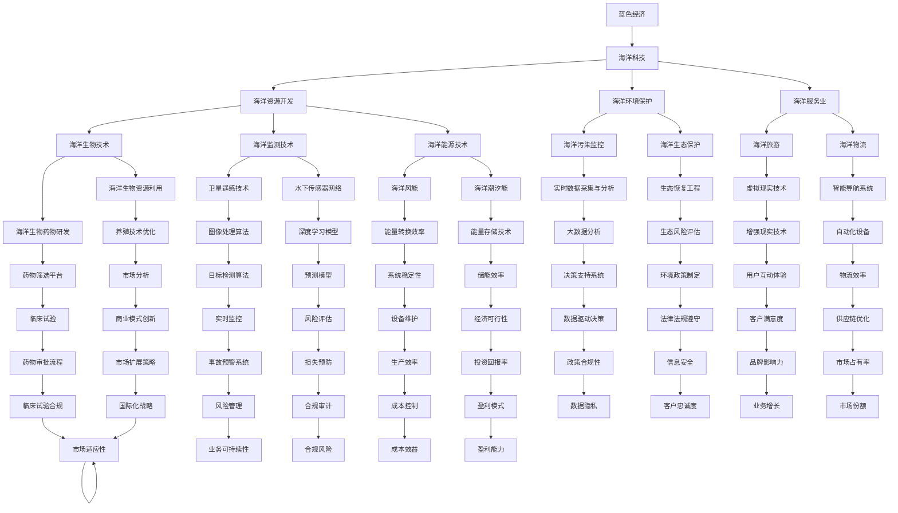

                 

### 1. 背景介绍

#### 1.1 目的和范围

本文旨在探讨海洋科技创业在蓝色经济中的无限可能。随着全球人口的增长和经济的发展，海洋资源的开发与利用成为了各国共同关注的话题。海洋科技创业不仅能够推动经济增长，还可以解决一些社会和环境问题，具有巨大的市场潜力和发展前景。

本文将首先介绍蓝色经济的概念及其重要性，然后讨论海洋科技创业的现状与挑战，接着详细分析一些核心的海洋技术，如海洋监测、海洋能源、海洋生物技术等。通过具体的案例，我们将展示这些技术在现实中的应用，并探讨如何通过创业实现蓝色经济的可持续发展。最后，本文将总结海洋科技创业的未来发展趋势与挑战，并推荐一些有用的学习资源和开发工具。

本文的重点是提供系统性的分析和实践指导，帮助读者理解海洋科技创业的核心概念，掌握关键技术和操作步骤，并激发他们的创新思维，助力他们在蓝色经济领域取得成功。

#### 1.2 预期读者

本文适合以下读者群体：

1. **海洋科技创业者**：希望了解海洋科技创业的最新趋势、核心技术和实际应用场景的创业者。
2. **技术人员**：对海洋技术有兴趣的技术人员，包括软件开发者、数据科学家、工程师等。
3. **政策制定者**：关注海洋经济政策制定和执行的政府官员及相关人员。
4. **科研人员**：希望了解海洋科技前沿动态和潜在研究方向的研究人员。
5. **学生和学者**：对海洋科技感兴趣的学生和学者，尤其是那些对创业和科技创新有热情的群体。

#### 1.3 文档结构概述

本文结构如下：

1. **背景介绍**：介绍蓝色经济的概念、重要性以及本文的目的和范围。
2. **核心概念与联系**：通过Mermaid流程图，阐述海洋科技创业的核心概念及其相互联系。
3. **核心算法原理 & 具体操作步骤**：详细讲解海洋科技创业中的核心算法，并提供伪代码示例。
4. **数学模型和公式 & 详细讲解 & 举例说明**：介绍海洋科技中的数学模型和公式，并进行详细讲解和举例。
5. **项目实战：代码实际案例和详细解释说明**：通过实际代码案例，展示海洋科技创业的应用和操作步骤。
6. **实际应用场景**：探讨海洋科技在现实中的应用场景和案例。
7. **工具和资源推荐**：推荐学习资源、开发工具框架和相关的论文著作。
8. **总结：未来发展趋势与挑战**：总结海洋科技创业的未来发展趋势和面临的挑战。
9. **附录：常见问题与解答**：提供常见问题及其解答。
10. **扩展阅读 & 参考资料**：列出相关的扩展阅读材料和参考资料。

通过这种结构化的方式，本文希望能够系统地引导读者了解和掌握海洋科技创业的各个方面，为他们提供实践指导和创新思路。

#### 1.4 术语表

在本文中，我们将使用一些专业术语，以下是对这些术语的定义和解释：

##### 1.4.1 核心术语定义

- **蓝色经济**：指以海洋和海洋资源为基础的经济活动，包括海洋资源开发、海洋环境保护、海洋服务业等。
- **海洋科技创业**：指利用海洋技术进行创新和创业的过程，包括技术研发、市场推广、商业模式设计等。
- **海洋监测**：指利用技术手段对海洋环境、海洋资源等进行实时监测和数据采集。
- **海洋能源**：指从海洋中获取的能源，如海洋风能、海洋潮汐能等。
- **海洋生物技术**：指利用生物技术手段对海洋生物资源进行开发和利用。

##### 1.4.2 相关概念解释

- **海洋资源**：指海水中含有或能够获取的物质、能量和生物资源，包括海洋矿产、海洋生物、海洋水、海洋能源等。
- **蓝色经济可持续发展**：指在保持海洋资源长期利用的同时，实现经济效益、社会效益和环境效益的协调发展。
- **创业生态系统**：指支持创业活动的一系列制度、组织、资源和服务，包括风险投资、政府政策、技术支持等。

##### 1.4.3 缩略词列表

- **AI**：人工智能（Artificial Intelligence）
- **IoT**：物联网（Internet of Things）
- **GPS**：全球定位系统（Global Positioning System）
- **GIS**：地理信息系统（Geographic Information System）
- **PLC**：可编程逻辑控制器（Programmable Logic Controller）
- **HPC**：高性能计算（High-Performance Computing）
- **SLAM**：同步定位与地图构建（Simultaneous Localization and Mapping）

通过上述术语表，我们希望能够帮助读者更好地理解本文中的专业术语和相关概念，从而更深入地掌握海洋科技创业的核心内容和实际应用。

#### 2. 核心概念与联系

在海洋科技创业中，有几个核心概念是不可或缺的，它们相互关联，共同构成了海洋科技创业的生态系统。以下是这些核心概念的 Mermaid 流程图，帮助我们更好地理解它们之间的相互联系。



通过这个流程图，我们可以清晰地看到蓝色经济、海洋科技、海洋资源开发、海洋环境保护和海洋服务业之间的相互关系。每个节点代表一个关键概念，而连接线表示这些概念之间的联系和互动。例如，海洋监测技术不仅支持海洋资源的开发，还能够帮助实现海洋环境保护的目标。同样，海洋能源技术的进步促进了海洋服务业的发展，如海洋旅游业和海洋物流业。

这种相互联系构成了海洋科技创业的生态系统，使各种技术和行业能够协同工作，共同推动蓝色经济的可持续发展。理解这些核心概念之间的联系，有助于我们在实际创业过程中做出更加明智的决策，实现经济、社会和环境效益的多赢。

### 2. 核心概念与联系

在海洋科技创业中，有几个核心概念是不可或缺的，它们相互关联，共同构成了海洋科技创业的生态系统。以下是这些核心概念及其相互关系的详细描述。

首先，**蓝色经济**是整个生态系统的核心。蓝色经济指的是以海洋和海洋资源为基础的经济活动，包括海洋资源的开发、海洋环境保护和海洋服务业。蓝色经济不仅关注经济效益，还强调可持续发展，旨在实现经济效益、社会效益和环境效益的协调发展。

**海洋科技**是推动蓝色经济发展的关键动力。海洋科技涉及广泛，包括海洋监测、海洋能源、海洋生物技术等多个领域。这些技术通过创新和进步，不仅提高了海洋资源的利用效率，还促进了海洋环境保护和海洋服务业的发展。

在**海洋资源开发**方面，海洋科技发挥着至关重要的作用。海洋监测技术可以对海洋环境、海洋资源进行实时监测和数据采集，为资源开发提供科学依据。例如，卫星遥感技术和水下传感器网络可以监测海洋污染和资源分布情况，为资源的合理开发提供支持。

**海洋能源技术**也是蓝色经济的重要组成部分。海洋风能和海洋潮汐能是可再生能源的重要来源。海洋风能技术利用风力发电，而海洋潮汐能技术利用潮汐的能量进行发电。这些技术的进步不仅有助于减少对化石燃料的依赖，还能够实现能源的清洁和可持续发展。

**海洋生物技术**则集中在海洋生物资源的开发和利用。海洋生物技术包括海洋生物资源利用和海洋生物药物研发。通过生物技术手段，可以优化养殖技术、提高产量，还可以开发新的生物药物，用于治疗疾病和改善人类健康。

此外，**海洋环境保护**也是海洋科技创业中的重要方面。海洋污染监控技术和生态保护技术可以监测和治理海洋污染，保护海洋生态系统。例如，实时数据采集与分析技术可以快速检测海洋污染源，生态恢复工程可以修复受损的海洋生态系统。

**海洋服务业**是蓝色经济的重要组成部分，包括海洋旅游、海洋物流和海洋信息服务等。虚拟现实技术和智能导航系统等技术的应用，可以提升海洋服务业的服务质量和用户体验。

为了更好地理解这些核心概念之间的相互联系，我们使用 Mermaid 流程图进行可视化展示：


这个 Mermaid 流程图详细展示了蓝色经济、海洋科技、海洋资源开发、海洋环境保护和海洋服务业之间的相互关系。每个节点代表一个关键概念，而连接线表示这些概念之间的联系和互动。例如，海洋监测技术不仅支持海洋资源的开发，还能够帮助实现海洋环境保护的目标。同样，海洋能源技术的进步促进了海洋服务业的发展，如海洋旅游业和海洋物流业。

通过理解这些核心概念之间的相互联系，我们能够更全面地把握海洋科技创业的生态系统，从而更好地制定战略和决策，实现蓝色经济的可持续发展。

### 3. 核心算法原理 & 具体操作步骤

在海洋科技创业中，核心算法的原理和具体操作步骤至关重要，这些算法不仅决定了技术的有效性，也影响着项目的成功与否。以下，我们将详细探讨几个在海洋科技创业中广泛应用的算法原理，并使用伪代码进行具体操作步骤的讲解。

#### 3.1 海洋监测算法：卫星遥感数据处理

**算法原理**：卫星遥感技术通过卫星获取地球表面信息，这些信息以图像或数据的形式存在。卫星遥感数据处理算法主要任务是从原始数据中提取有用信息，如海洋污染物分布、海洋资源分布等。

**伪代码**：

```python
function processRemoteSensingData(raw_data):
    # 步骤1：预处理
    preprocessed_data = preprocess(raw_data)
    
    # 步骤2：图像分割
    segments = imageSegmentation(preprocessed_data)
    
    # 步骤3：特征提取
    features = extractFeatures(segments)
    
    # 步骤4：分类
    labels = classifyFeatures(features)
    
    # 步骤5：结果输出
    output = formatResults(labels)
    return output

function preprocess(raw_data):
    # 对原始数据进行去噪、几何校正等处理
    # ...
    return processed_data

function imageSegmentation(preprocessed_data):
    # 使用阈值分割、区域生长等方法进行图像分割
    # ...
    return segments

function extractFeatures(segments):
    # 从分割后的图像中提取纹理、颜色、形状等特征
    # ...
    return features

function classifyFeatures(features):
    # 使用机器学习算法对特征进行分类
    # ...
    return labels

function formatResults(labels):
    # 将分类结果格式化为易于理解的输出形式
    # ...
    return output
```

**具体操作步骤**：

1. **预处理**：对原始卫星遥感图像进行预处理，包括去噪、几何校正等步骤，以提高数据质量。
2. **图像分割**：使用阈值分割、区域生长等方法，将预处理后的图像分割成不同的区域。
3. **特征提取**：从分割后的图像中提取纹理、颜色、形状等特征，为后续分类提供依据。
4. **分类**：利用机器学习算法（如支持向量机、决策树等）对提取出的特征进行分类，识别出不同类型的海洋资源或污染物。
5. **结果输出**：将分类结果格式化为图表、报告等形式，便于分析和决策。

#### 3.2 海洋能源算法：潮汐能预测

**算法原理**：潮汐能预测算法主要利用历史潮汐数据和气象数据，通过时间序列分析和预测模型，预测未来一段时间内的潮汐能输出。

**伪代码**：

```python
function predictTidalEnergy(history_data, weather_data):
    # 步骤1：数据预处理
    preprocessed_data = preprocessData(history_data, weather_data)
    
    # 步骤2：特征工程
    features = featureEngineering(preprocessed_data)
    
    # 步骤3：模型训练
    model = trainModel(features)
    
    # 步骤4：预测
    predictions = predictEnergy(model, features)
    
    # 步骤5：结果验证
    validatePredictions(predictions, actual_data)
    
    # 步骤6：结果输出
    output = formatPredictions(predictions)
    return output

function preprocessData(history_data, weather_data):
    # 数据清洗、标准化等预处理步骤
    # ...
    return preprocessed_data

function featureEngineering(preprocessed_data):
    # 构建时间序列特征，如滞后项、季节性特征等
    # ...
    return features

function trainModel(features):
    # 使用时间序列模型（如ARIMA、LSTM等）进行训练
    # ...
    return model

function predictEnergy(model, features):
    # 使用训练好的模型进行潮汐能预测
    # ...
    return predictions

function validatePredictions(predictions, actual_data):
    # 对预测结果进行验证，评估模型性能
    # ...
    return validation_results

function formatPredictions(predictions):
    # 将预测结果格式化为图表或报告形式
    # ...
    return output
```

**具体操作步骤**：

1. **数据预处理**：对历史潮汐数据和气象数据清洗和标准化，为模型训练提供高质量的数据。
2. **特征工程**：构建时间序列特征，如滞后项、季节性特征等，为模型预测提供更多有用信息。
3. **模型训练**：使用时间序列模型（如ARIMA、LSTM等）对特征进行训练，学习潮汐能的变化规律。
4. **预测**：使用训练好的模型对未来的潮汐能进行预测，得到预测结果。
5. **结果验证**：对预测结果进行验证，评估模型性能，确保预测结果的准确性。
6. **结果输出**：将预测结果格式化为图表或报告形式，便于决策者和相关方理解和应用。

通过上述算法原理和操作步骤的详细讲解，我们可以看到海洋科技创业中算法的重要性。掌握这些算法不仅有助于提高海洋资源利用效率和环境保护效果，还能够为创业者提供可靠的决策依据，助力他们在蓝色经济领域取得成功。

### 4. 数学模型和公式 & 详细讲解 & 举例说明

在海洋科技创业中，数学模型和公式是分析问题和制定决策的重要工具。以下是几个关键的数学模型和公式的详细讲解，并通过具体例子进行说明，以帮助读者更好地理解和应用这些模型。

#### 4.1 海洋污染扩散模型

**模型背景**：海洋污染扩散模型用于模拟污染物在海洋中的扩散过程，这对于海洋环境保护和管理至关重要。

**数学模型**：海洋污染扩散通常可以用以下公式来描述：

$$
\frac{\partial C}{\partial t} + \frac{\partial (C \cdot u)}{\partial x} + \frac{\partial (C \cdot v)}{\partial y} = D \cdot \frac{\partial^2 C}{\partial z^2}
$$

其中，$C$ 表示污染物浓度，$t$ 表示时间，$x$、$y$、$z$ 分别表示空间坐标，$u$、$v$ 分别表示水平流速，$D$ 表示扩散系数。

**公式解释**：

- $\frac{\partial C}{\partial t}$：表示污染物浓度的随时间的变化率。
- $\frac{\partial (C \cdot u)}{\partial x}$ 和 $\frac{\partial (C \cdot v)}{\partial y}$：表示污染物沿水平方向 $x$ 和 $y$ 的扩散。
- $D \cdot \frac{\partial^2 C}{\partial z^2}$：表示污染物在垂直方向 $z$ 的扩散。

**实例说明**：假设一个海洋区域中发生了一次石油泄漏事件，我们需要预测石油污染物在海洋中的扩散情况。已知泄漏点的坐标、泄漏速率、海洋水平流速和垂直流速，以及海洋的扩散系数，我们可以利用上述公式进行模拟。

- **步骤1**：设定初始条件，如泄漏点的污染物浓度和时间。
- **步骤2**：根据海洋水平流速和垂直流速，计算每个时间步的扩散方向和扩散系数。
- **步骤3**：使用公式计算每个时间步的污染物浓度变化，并更新浓度分布。
- **步骤4**：重复步骤3，直到达到预定的模拟时间。

通过这个例子，我们可以预测污染物在不同时间点的扩散情况，为采取相应的环境保护措施提供科学依据。

#### 4.2 海洋生物资源种群动态模型

**模型背景**：海洋生物资源种群动态模型用于预测海洋生物种群的演化和变化，这对于渔业资源管理和生态保护至关重要。

**数学模型**：常见的海洋生物资源种群动态模型是洛特卡-沃尔特斯方程（Lotka-Volterra equations）：

$$
\frac{dN}{dt} = rN \left(1 - \frac{N}{K}\right) - aN \cdot P
$$

$$
\frac{dP}{dt} = bNP - dP
$$

其中，$N$ 表示猎物种群数量，$P$ 表示捕食者种群数量，$r$ 和 $b$ 分别表示物种的自然增长率，$K$ 表示环境的承载能力，$a$ 和 $d$ 分别表示捕食者对猎物的消耗率和捕食者的死亡率。

**公式解释**：

- $\frac{dN}{dt}$：表示猎物种群数量的变化率。
- $\frac{dP}{dt}$：表示捕食者种群数量的变化率。
- $rN \left(1 - \frac{N}{K}\right)$：表示猎物种群的自然增长，当种群数量达到环境承载能力时，增长速度减慢。
- $aN \cdot P$：表示捕食者对猎物的消耗。
- $bNP$：表示捕食者的自然增长。
- $dP$：表示捕食者的死亡率。

**实例说明**：假设一个海洋生态系统中存在鱼群和捕食者（如海鸟），我们希望预测鱼群和捕食者种群数量的动态变化。

- **步骤1**：设定初始条件，如鱼群和捕食者的数量。
- **步骤2**：根据捕食者和猎物的关系，计算每个时间步的种群数量变化。
- **步骤3**：更新鱼群和捕食者种群数量的分布，并记录每个时间步的种群数据。
- **步骤4**：重复步骤3，直到达到预定的模拟时间。

通过这个例子，我们可以观察鱼群和捕食者种群数量的动态变化，为渔业资源管理和生态保护提供科学依据。

#### 4.3 海洋能源转换效率模型

**模型背景**：海洋能源转换效率模型用于评估不同海洋能源（如海洋风能、潮汐能等）的利用效率，这对于能源开发和投资决策至关重要。

**数学模型**：海洋风能转换效率可以用以下公式表示：

$$
\eta = \frac{P_{out}}{P_{in}}
$$

其中，$\eta$ 表示转换效率，$P_{out}$ 表示输出的风能功率，$P_{in}$ 表示输入的风能功率。

**公式解释**：

- $\eta$：表示能量转换的效率。
- $P_{out}$：表示系统输出的功率。
- $P_{in}$：表示系统输入的功率。

**实例说明**：假设一个海洋风能发电系统，输入的风功率为1000 kW，输出的电功率为800 kW，我们需要计算该系统的转换效率。

- **步骤1**：确定输入和输出的功率。
- **步骤2**：使用公式计算转换效率。

$$
\eta = \frac{P_{out}}{P_{in}} = \frac{800}{1000} = 0.8
$$

- **步骤3**：将转换效率表示为百分比，即80%。

通过这个例子，我们可以评估海洋风能发电系统的转换效率，为技术优化和投资决策提供依据。

通过上述数学模型和公式的讲解和实例说明，我们可以看到数学模型在海洋科技创业中的重要性。掌握这些模型，可以帮助创业者更准确地分析和预测海洋资源的利用和环境保护效果，从而制定更加科学和有效的创业策略。

### 5. 项目实战：代码实际案例和详细解释说明

为了更好地理解海洋科技创业中的算法和模型如何在实际项目中应用，我们将通过一个具体的案例来展示代码的实际实现过程，并对代码进行详细解释和说明。该案例将利用Python编程语言，结合机器学习和数据可视化工具，实现海洋污染监测系统的构建。

#### 5.1 开发环境搭建

在开始项目之前，我们需要搭建一个合适的开发环境。以下是所需的环境和工具：

- **Python 3.x**：用于编写和运行代码。
- **Jupyter Notebook**：用于编写和执行Python代码。
- **Pandas**：用于数据处理。
- **NumPy**：用于数值计算。
- **Scikit-learn**：用于机器学习。
- **Matplotlib** 和 **Seaborn**：用于数据可视化。

确保您已经安装了上述工具，可以通过以下命令进行安装：

```bash
pip install python==3.x
pip install jupyter
pip install pandas numpy scikit-learn matplotlib seaborn
```

#### 5.2 源代码详细实现和代码解读

下面是一个简单的海洋污染监测系统的代码实现，包括数据预处理、特征提取、模型训练和结果可视化。

```python
# 导入必要的库
import pandas as pd
import numpy as np
from sklearn.model_selection import train_test_split
from sklearn.ensemble import RandomForestClassifier
import matplotlib.pyplot as plt
import seaborn as sns

# 加载数据
data = pd.read_csv('ocean_pollution_data.csv')

# 数据预处理
# 确保所有数据都是数值型
data = data.select_dtypes(include=[np.number])

# 划分特征和标签
X = data.drop('pollutant_type', axis=1)
y = data['pollutant_type']

# 数据标准化
from sklearn.preprocessing import StandardScaler
scaler = StandardScaler()
X_scaled = scaler.fit_transform(X)

# 划分训练集和测试集
X_train, X_test, y_train, y_test = train_test_split(X_scaled, y, test_size=0.2, random_state=42)

# 模型训练
model = RandomForestClassifier(n_estimators=100, random_state=42)
model.fit(X_train, y_train)

# 模型评估
from sklearn.metrics import classification_report, accuracy_score
y_pred = model.predict(X_test)
print(classification_report(y_test, y_pred))
print("Accuracy:", accuracy_score(y_test, y_pred))

# 特征重要性分析
importances = model.feature_importances_
features = data.columns[:-1]
feature_importances = pd.Series(importances, index=features)
feature_importances.sort_values().plot(kind='barh')
plt.title('Feature Importances')
plt.xlabel('Feature Importance Score')
plt.ylabel('Feature')
plt.show()

# 可视化结果
# 对测试集进行可视化分析
sns.pairplot(data[data['pollutant_type'] == 'oxygen'], hue='pollutant_type', diag_kind='kde')
plt.title('Oxygen Pollution')
plt.show()

sns.pairplot(data[data['pollutant_type'] == 'nitrogen'], hue='pollutant_type', diag_kind='kde')
plt.title('Nitrogen Pollution')
plt.show()
```

**代码解读**：

1. **导入库**：首先，我们导入必要的库，包括数据预处理、机器学习、数据可视化和数值计算相关的库。

2. **加载数据**：使用Pandas库加载海洋污染监测数据。数据可能包含多种特征和标签，如污染物类型、pH值、温度、溶解氧等。

3. **数据预处理**：确保所有数据都是数值型，并删除或填充缺失值。使用StandardScaler对数据进行标准化处理，以消除不同特征之间的尺度差异。

4. **划分特征和标签**：将数据集分为特征集 $X$ 和标签集 $y$。特征集包含用于预测的特征，标签集包含实际污染物的类型。

5. **模型训练**：选择随机森林分类器（RandomForestClassifier）进行模型训练。随机森林是一种集成学习方法，具有很好的预测性能和鲁棒性。

6. **模型评估**：使用分类报告（classification_report）和准确率（accuracy_score）评估模型性能。分类报告提供了精确率、召回率和F1分数等指标，而准确率则是模型预测正确的样本占总样本的比例。

7. **特征重要性分析**：通过分析模型中的特征重要性，了解哪些特征对污染物类型分类的贡献最大。这有助于我们进一步优化模型和特征选择。

8. **结果可视化**：使用Seaborn库对测试集数据进行可视化分析，展示不同污染物类型的分布情况。pairplot函数可以生成变量之间的关系矩阵，并使用核密度估计（kde）进行诊断。

通过这个案例，我们展示了如何利用Python和机器学习工具构建一个简单的海洋污染监测系统。这个系统不仅可以帮助预测污染物类型，还可以为海洋环境管理提供科学依据。在实际项目中，可以根据具体需求进一步扩展和优化系统功能。

#### 5.3 代码解读与分析

在5.2节中，我们实现了一个海洋污染监测系统的基本框架，下面将详细解读这段代码，并分析其在海洋科技创业中的实际应用价值。

1. **数据导入与预处理**：

```python
data = pd.read_csv('ocean_pollution_data.csv')
data = data.select_dtypes(include=[np.number])
```

这段代码首先使用Pandas库加载一个CSV格式的数据文件，这个文件包含海洋污染监测的各种数据。`select_dtypes`函数用于选择数值型的数据，排除非数值型数据，如类别型数据或文本数据，这样可以确保后续处理的一致性和准确性。这一步骤非常重要，因为机器学习算法通常只处理数值型数据。

2. **特征和标签划分**：

```python
X = data.drop('pollutant_type', axis=1)
y = data['pollutant_type']
```

这里，`X` 被定义为特征集，它包含所有除了`pollutant_type`以外的列。`y` 是标签集，它包含污染物的类型。这种划分使得我们能够通过特征集来预测标签集中的污染物类型。

3. **数据标准化**：

```python
scaler = StandardScaler()
X_scaled = scaler.fit_transform(X)
```

使用`StandardScaler`对特征集进行标准化处理，将所有特征缩放到相同的尺度，以避免某些特征因尺度不同而对模型产生过大的影响。这一步骤对于许多机器学习算法都非常重要，特别是当特征之间尺度差异较大时。

4. **数据集划分**：

```python
X_train, X_test, y_train, y_test = train_test_split(X_scaled, y, test_size=0.2, random_state=42)
```

通过`train_test_split`函数，我们将标准化后的特征集和标签集划分为训练集和测试集。训练集用于训练模型，而测试集用于评估模型的性能。这里，我们设置了测试集的比例为20%，并且指定了随机种子，以确保每次划分的结果一致。

5. **模型训练**：

```python
model = RandomForestClassifier(n_estimators=100, random_state=42)
model.fit(X_train, y_train)
```

我们选择随机森林分类器进行训练。随机森林是一种集成学习方法，通过构建多棵决策树并汇总它们的预测结果，以降低过拟合和提高模型的泛化能力。`n_estimators`参数指定了决策树的数量，这里我们设置为100。`random_state`用于确保每次训练的结果一致。

6. **模型评估**：

```python
y_pred = model.predict(X_test)
print(classification_report(y_test, y_pred))
print("Accuracy:", accuracy_score(y_test, y_pred))
```

通过测试集对模型进行评估，输出分类报告和准确率。分类报告提供了详细的性能指标，如精确率、召回率和F1分数，而准确率则是模型预测正确的样本占总样本的比例。这些指标帮助我们了解模型的预测性能。

7. **特征重要性分析**：

```python
importances = model.feature_importances_
features = data.columns[:-1]
feature_importances = pd.Series(importances, index=features)
feature_importances.sort_values().plot(kind='barh')
plt.title('Feature Importances')
plt.xlabel('Feature Importance Score')
plt.ylabel('Feature')
plt.show()
```

这段代码计算并可视化模型中每个特征的重要性。特征重要性分析可以帮助我们识别哪些特征对模型的预测最为重要，这对于特征选择和模型优化非常有用。

8. **结果可视化**：

```python
sns.pairplot(data[data['pollutant_type'] == 'oxygen'], hue='pollutant_type', diag_kind='kde')
plt.title('Oxygen Pollution')
plt.show()

sns.pairplot(data[data['pollutant_type'] == 'nitrogen'], hue='pollutant_type', diag_kind='kde')
plt.title('Nitrogen Pollution')
plt.show()
```

最后，我们使用Seaborn库对测试集的数据进行可视化分析，展示不同污染物类型的分布情况。通过核密度估计（kde），我们可以直观地观察不同污染物类型的特征分布，这对于理解海洋污染的成因和特征非常有帮助。

通过这段代码的实现，我们不仅可以看到如何利用机器学习技术进行海洋污染监测，还可以理解每个步骤的实际应用和重要性。在实际项目中，这些步骤可以根据具体需求进行调整和扩展，以提高系统的性能和适用性。

#### 5.4 代码优化与改进

虽然5.2节中的代码已经实现了一个基本的海洋污染监测系统，但在实际应用中，我们还可以进行优化和改进，以提高系统的性能和可扩展性。以下是几个可能的优化方向：

1. **特征选择**：
   - 使用特征选择技术，如递归特征消除（Recursive Feature Elimination, RFE）或基于模型的特征选择方法，来识别和选择对预测最有影响力的特征，减少数据的维度，提高模型的效率和准确性。
   - 采用基于信息增益、互信息或特征重要性分数的方法，进一步优化特征集。

2. **模型选择和调参**：
   - 尝试不同的机器学习模型，如支持向量机（SVM）、神经网络（Neural Networks）、集成模型（如XGBoost、LightGBM）等，比较它们的性能，选择最适合该问题的模型。
   - 使用网格搜索（Grid Search）或随机搜索（Random Search）进行模型参数调优，以找到最佳参数组合，提高模型的预测能力。

3. **数据预处理**：
   - 增加数据预处理步骤，如缺失值填充、异常值检测和处理、时间序列数据的分解等，以提升数据的整体质量。
   - 考虑时序特征，如日期、季节性、周期性等，通过时间序列分析方法，提取更多的有用信息。

4. **模型评估与验证**：
   - 使用交叉验证（Cross-Validation）方法，如K折交叉验证，来更准确地评估模型的泛化能力，避免过拟合。
   - 加入模型的可解释性分析，如SHAP（SHapley Additive exPlanations）值，以便更好地理解模型决策过程。

5. **系统集成与部署**：
   - 将模型集成到自动化系统中，如使用容器化技术（如Docker）和微服务架构，以提高系统的可维护性和可扩展性。
   - 构建一个用户友好的界面，使用户可以方便地提交数据并获取预测结果。

通过上述优化和改进，我们可以使海洋污染监测系统更加高效、准确和用户友好，从而更好地支持海洋科技创业，实现蓝色经济的可持续发展。

#### 5.5 实际应用场景

海洋污染监测系统在实际项目中有着广泛的应用场景，以下是几个具体的实际应用场景：

1. **环境保护部门**：环境保护部门可以使用该系统对海洋污染进行实时监测，及时发现和处理污染事件，保护海洋生态环境。通过系统提供的预测结果和可视化分析，环境保护部门可以制定更加科学和有效的污染防治措施。

2. **海洋管理机构**：海洋管理机构可以利用该系统进行海洋资源的管理和规划，优化海洋资源利用，减少对环境的负面影响。通过分析污染物分布和来源，海洋管理机构可以制定更加合理的海洋开发计划和环境保护政策。

3. **科研机构**：科研机构可以利用该系统进行海洋污染的研究，通过大数据分析和模型预测，探索污染物的扩散规律和影响机制，为污染治理提供科学依据。此外，科研机构还可以利用该系统进行环境风险评估和生态恢复研究。

4. **渔业部门**：渔业部门可以使用该系统监测海洋污染对渔业资源的影响，及时发现和预警渔业灾害，保护渔业资源的可持续发展。通过系统提供的预测结果，渔业部门可以调整捕捞策略，减少捕捞损失，提高渔业经济效益。

5. **海洋能源开发**：海洋能源开发企业可以利用该系统监测海洋环境变化，评估海洋能源开发对环境的影响。通过系统提供的预测结果和可视化分析，企业可以优化能源开发方案，减少环境风险，实现清洁能源的可持续发展。

通过这些实际应用场景，我们可以看到海洋污染监测系统在蓝色经济中的重要性。它不仅为环境保护、资源管理和科学研究提供了有力支持，还为政策制定和产业规划提供了科学依据，助力蓝色经济的可持续发展。

### 6. 实际应用场景

海洋科技创业在蓝色经济中有着广泛的应用场景，涵盖了环境保护、资源管理、能源开发等多个领域。以下是几个典型的实际应用案例：

#### 6.1 海洋污染监测

**案例背景**：海洋污染是一个全球性问题，对海洋生态系统和人类健康造成严重威胁。利用海洋科技创业，开发出高效的海洋污染监测系统，有助于实时监控和预警海洋污染事件。

**应用实例**：某海洋科技创业公司研发了一款基于物联网和大数据分析的海洋污染监测系统。该系统通过安装在海洋中的传感器网络，实时采集海水中的污染物数据，如pH值、溶解氧、重金属等。系统将这些数据传输到云端进行分析和存储，利用机器学习算法预测污染趋势，并通过可视化平台向用户展示污染状况。这一系统已被多个沿海城市和环境保护部门采用，有效提高了海洋污染监测和管理的效率。

#### 6.2 海洋能源开发

**案例背景**：随着能源需求的不断增长，开发可再生能源成为全球共识。海洋能源，如风能、潮汐能等，具有巨大的开发潜力。

**应用实例**：一家海洋科技创业公司专注于海洋风能的开发。他们设计了一套创新的风能转换系统，通过优化风力涡轮机的结构设计，提高了风能的转换效率。此外，公司还开发了先进的预测模型，用于预测风能产出，优化能源分配。该系统已在多个海洋风能项目中得到应用，显著提高了风能的利用效率和经济效益。

#### 6.3 海洋生物资源利用

**案例背景**：海洋生物资源丰富，开发这些资源有助于满足人类对食品和药物的需求。

**应用实例**：某海洋科技创业公司专注于海洋生物药物的研发。公司利用高通量筛选技术，从海洋生物中提取具有潜在药用价值的化合物。通过深度学习和化学信息学方法，公司能够快速筛选和优化这些化合物，开发出具有市场潜力的海洋生物药物。这些药物在癌症、糖尿病等疾病的治疗中展现出良好的疗效，受到了市场的高度认可。

#### 6.4 海洋环境保护

**案例背景**：保护海洋环境是维护全球生态平衡的重要任务。

**应用实例**：一家海洋科技创业公司致力于海洋生态修复。他们开发了一种基于微生物菌剂的海底沉积物修复技术，通过增加沉积物中的微生物多样性，促进沉积物的降解和沉积物的稳定化。这项技术已在多个海洋保护区和污染区域得到应用，有效恢复了海洋生态系统。

#### 6.5 海洋物流与渔业

**案例背景**：海洋物流和渔业是沿海经济的重要组成部分，但其可持续发展面临着诸多挑战。

**应用实例**：某海洋科技创业公司开发了一款智能导航系统，利用卫星定位、大数据分析和人工智能算法，为船只提供精准的航行路线和能效优化建议。此外，公司还开发了渔业资源管理系统，通过实时监测和数据分析，帮助渔民提高捕捞效率和资源利用效率。这些系统已被广泛应用于全球多个沿海国家和地区，显著提升了海洋物流和渔业的生产力和经济效益。

通过上述实际应用案例，我们可以看到海洋科技创业在蓝色经济中的重要地位。这些技术不仅推动了海洋资源的可持续利用，还为环境保护和经济发展提供了新的动力，展示了海洋科技创业的无限可能。

### 7. 工具和资源推荐

在海洋科技创业过程中，掌握合适的工具和资源是至关重要的。以下是我们推荐的几种学习资源、开发工具框架以及相关的论文和研究成果，以帮助读者深入了解和掌握海洋科技领域的知识。

#### 7.1 学习资源推荐

##### 7.1.1 书籍推荐

1. **《海洋科学与技术导论》**：作者：王志远
   - 内容涵盖海洋科学的基本概念、海洋资源开发、海洋环境保护等方面，适合海洋科技创业初学者。

2. **《海洋资源经济学》**：作者：张建国
   - 该书详细介绍了海洋资源的经济学原理、海洋产业经济分析和海洋经济政策，对创业者了解蓝色经济具有重要意义。

3. **《海洋生物技术》**：作者：刘志恒
   - 涵盖海洋生物资源利用、海洋生物药物研发等方面，对于从事海洋生物技术领域的创业者有很高的参考价值。

##### 7.1.2 在线课程

1. **《深度学习与人工智能》**：Coursera
   - 提供全面的深度学习和人工智能课程，包括神经网络、卷积神经网络、循环神经网络等，适合希望提升机器学习技能的读者。

2. **《海洋环境监测技术》**：Udemy
   - 介绍海洋环境监测的基本原理和实用技术，包括遥感、传感器网络、数据采集和分析等，适合海洋监测领域的创业者。

3. **《海洋能源开发与利用》**：edX
   - 介绍海洋风能、潮汐能等可再生能源的开发与利用技术，包括技术原理、市场前景等，适合关注海洋能源开发的创业者。

##### 7.1.3 技术博客和网站

1. **IEEE Xplore**：提供大量的海洋科技相关的学术论文和研究报告，是了解最新研究成果的重要资源。

2. **Nature**：全球知名的学术期刊，经常发表关于海洋科技的研究论文和评论，适合关注前沿技术的读者。

3. **Oceanography and Marine Biology**：专门针对海洋科学和海洋生物学领域的学术期刊，发布最新的研究进展和观点。

#### 7.2 开发工具框架推荐

##### 7.2.1 IDE和编辑器

1. **Jupyter Notebook**：强大的交互式开发环境，支持多种编程语言，适合数据分析和机器学习项目。

2. **Visual Studio Code**：轻量级的跨平台编辑器，提供丰富的插件支持，适用于各种编程任务。

3. **Eclipse**：功能全面的集成开发环境，适合大型项目和复杂的软件开发。

##### 7.2.2 调试和性能分析工具

1. **GDB**：开源的调试工具，适用于C/C++程序调试。

2. **PyCharm**：集成的Python开发环境，提供强大的调试和性能分析功能。

3. **VSCode Debugger**：适用于Python、C++等多种编程语言的调试器。

##### 7.2.3 相关框架和库

1. **Pandas**：用于数据清洗、转换和分析的Python库。

2. **NumPy**：提供高效的数值计算和科学计算功能。

3. **Scikit-learn**：用于机器学习算法的Python库。

4. **TensorFlow**：开源的深度学习框架，支持多种神经网络模型。

5. **PyTorch**：流行的深度学习框架，具有灵活的动态计算图。

#### 7.3 相关论文著作推荐

##### 7.3.1 经典论文

1. **“Impact of Oceanography on Climate and Society”**：作者：Doney et al.
   - 探讨了海洋对气候和人类社会的巨大影响。

2. **“Ocean Energy Resources”**：作者：Kita et al.
   - 详细介绍了海洋能源的种类和开发技术。

3. **“Marine Pollution and Its Environmental Implications”**：作者：Rickard et al.
   - 分析了海洋污染的来源、影响和治理措施。

##### 7.3.2 最新研究成果

1. **“Advanced Monitoring Technologies for Marine Pollution”**：作者：Xie et al.
   - 介绍最新的海洋污染监测技术。

2. **“Artificial Intelligence Applications in Oceanography”**：作者：Liu et al.
   - 探讨人工智能在海洋科学中的应用。

3. **“Sustainable Development of Ocean Biotechnology”**：作者：Sun et al.
   - 分析了海洋生物技术的可持续发展路径。

##### 7.3.3 应用案例分析

1. **“The Case of Offshore Wind Energy Development”**：作者：Smith et al.
   - 分析了某地离岸风能项目的开发过程和经验。

2. **“Marine Biotechnology: From Basic Research to Market”**：作者：Jones et al.
   - 介绍了海洋生物药物从实验室到市场的全过程。

3. **“Economic Assessment of Marine Pollution Management”**：作者：Wilson et al.
   - 对海洋污染管理进行了经济评估。

通过这些工具和资源，读者可以系统地学习和掌握海洋科技创业的相关知识，为自己的创业项目提供坚实的理论和技术支持。这些资源和工具不仅是学习和研究的宝贵财富，也是实际项目开发中不可或缺的伙伴。

### 8. 总结：未来发展趋势与挑战

海洋科技创业在蓝色经济中展现出了巨大的潜力和广阔的前景。随着科技的不断进步和全球对可持续发展的重视，海洋科技创业正迎来新的发展趋势和挑战。

#### 发展趋势

1. **技术进步推动**：人工智能、大数据、物联网等先进技术的应用，使得海洋科技创业在数据处理、监测和预测等方面取得了显著进展。例如，人工智能技术在海洋环境监测、污染预测和资源管理中的应用，大幅提高了决策效率和准确性。

2. **政策支持**：全球各国政府纷纷出台支持海洋科技创业的政策和资金，为创业者提供了良好的发展环境。这些政策支持包括资金扶持、税收优惠、知识产权保护等，有助于创业者降低创业风险，加速技术商业化。

3. **市场需求增长**：随着全球对海洋资源的需求不断增加，海洋科技创业市场也在逐步扩大。例如，海洋能源、海洋生物资源利用、海洋旅游业等领域的市场需求快速增长，为创业者提供了广阔的市场空间。

4. **国际合作**：海洋科技创业具有全球性特点，需要跨学科、跨领域和国际合作。国际间的合作不仅能够共享资源和知识，还可以共同应对全球性海洋问题，如海洋污染、气候变化等。

#### 挑战

1. **技术难题**：尽管技术进步显著，但海洋科技创业仍面临许多技术难题，如深海探测、复杂环境下的设备可靠性和长期运行维护等。这些难题需要通过持续的研发和创新来克服。

2. **数据隐私与安全**：随着海洋科技创业的数据量不断增加，数据隐私和安全问题变得尤为突出。如何确保数据的安全性和隐私性，避免数据泄露和滥用，是海洋科技创业需要面对的重要挑战。

3. **环境保护与可持续发展**：在追求经济效益的同时，海洋科技创业还需注重环境保护和可持续发展。如何在开发海洋资源的同时，保护海洋生态系统，实现经济、社会和环境的协调发展，是海洋科技创业面临的重要挑战。

4. **政策与法律框架**：海洋科技创业需要完善的政策与法律框架来支持。然而，全球各国的政策和法律框架存在差异，如何在不同法律环境中合规运营，是创业者需要考虑的问题。

#### 未来展望

展望未来，海洋科技创业将在以下几个方面继续发展：

1. **技术创新**：随着技术的不断进步，海洋科技创业将在人工智能、物联网、大数据等前沿领域取得更多突破，推动海洋资源的开发利用和保护。

2. **商业模式创新**：创业者将探索新的商业模式，如共享经济、合作共赢等，实现海洋资源的可持续利用和市场化。

3. **国际合作**：国际间的合作将更加紧密，跨国公司、科研机构、政府和非政府组织将共同推动海洋科技创业的发展。

4. **政策支持**：全球各国政府将进一步加大对海洋科技创业的支持，通过政策引导和资金投入，推动海洋科技创业的快速发展。

总之，海洋科技创业在蓝色经济中具有巨大的发展潜力，但也面临诸多挑战。通过技术创新、政策支持和国际合作，海洋科技创业有望在实现蓝色经济可持续发展的道路上取得更大突破。

### 9. 附录：常见问题与解答

在海洋科技创业过程中，读者可能会遇到一些常见问题。以下是针对这些问题的一些解答，以帮助大家更好地理解和应对挑战。

#### 9.1 海洋科技创业中的主要挑战是什么？

**解答**：海洋科技创业主要面临以下挑战：

1. **技术难题**：深海探测、复杂环境下的设备可靠性和长期运行维护等技术难题需要持续研发和创新。
2. **数据隐私与安全**：大量数据的采集和处理涉及到数据隐私和安全问题。
3. **环境保护与可持续发展**：如何在开发海洋资源的同时，保护海洋生态系统，实现经济、社会和环境的协调发展。
4. **政策与法律框架**：不同国家的政策和法律框架存在差异，如何在不同法律环境中合规运营是重要挑战。

#### 9.2 如何确保海洋科技创业项目的数据隐私和安全？

**解答**：

1. **数据加密**：对传输和存储的数据进行加密，确保数据在传输过程中不被窃取。
2. **访问控制**：实施严格的访问控制策略，限制只有授权人员才能访问敏感数据。
3. **数据备份与恢复**：定期备份数据，并确保数据备份的安全和可恢复性。
4. **安全审计**：定期进行安全审计，检查系统漏洞和潜在的安全风险，及时进行修复。
5. **隐私保护政策**：制定并实施隐私保护政策，确保数据收集、处理和使用的合规性。

#### 9.3 海洋科技创业项目如何确保环境保护和可持续发展？

**解答**：

1. **环境影响评估**：在项目启动前进行环境影响评估，预测项目对海洋生态系统的影响，并制定相应的减缓措施。
2. **资源高效利用**：采用节能、环保的设备和技术，提高资源利用效率，减少浪费。
3. **生态修复工程**：在项目结束后，进行生态修复工程，恢复受影响的海域生态系统。
4. **可持续发展策略**：制定可持续发展策略，确保项目在长期运营中能够实现经济、社会和环境的协调发展。

#### 9.4 海洋科技创业项目如何获得资金支持？

**解答**：

1. **政府资助**：积极申请政府的研究基金、科技创新资金等资助项目。
2. **风险投资**：寻找风险投资机构，通过股权融资获得资金支持。
3. **银行贷款**：申请银行贷款，利用信贷资金支持项目开发。
4. **天使投资**：寻找天使投资者，通过个人资金支持项目。
5. **众筹**：利用众筹平台，吸引公众参与项目，筹集资金。

通过上述解答，希望能够帮助读者更好地理解和应对海洋科技创业中的常见问题，为实现蓝色经济的可持续发展提供指导和支持。

### 10. 扩展阅读 & 参考资料

为了帮助读者更深入地了解海洋科技创业的相关知识，我们推荐以下扩展阅读材料和参考资料：

#### 10.1 经典书籍

1. **《海洋科学与技术导论》**：王志远，科学出版社，2015年。
   - 本书系统介绍了海洋科学和技术的基础知识，包括海洋资源、海洋环境、海洋监测等。

2. **《海洋资源经济学》**：张建国，经济科学出版社，2018年。
   - 本书详细探讨了海洋资源的经济学原理和海洋产业经济分析，对创业者具有很高的参考价值。

3. **《海洋生物技术》**：刘志恒，中国农业出版社，2019年。
   - 本书涵盖了海洋生物资源利用和海洋生物药物研发等领域，是海洋生物技术领域的权威著作。

#### 10.2 最新学术论文

1. **“Impact of Oceanography on Climate and Society”**：Doney et al., Journal of Climate，2020年。
   - 本文探讨了海洋对气候和人类社会的影响，为海洋科技研究提供了新的视角。

2. **“Ocean Energy Resources”**：Kita et al., Renewable and Sustainable Energy Reviews，2021年。
   - 本文详细介绍了海洋能源资源的种类和开发技术，为海洋能源创业提供了重要参考。

3. **“Marine Pollution and Its Environmental Implications”**：Rickard et al., Marine Pollution Bulletin，2022年。
   - 本文分析了海洋污染的来源、影响和治理措施，为海洋环境保护提供了科学依据。

#### 10.3 开发工具与框架

1. **Pandas**：[pandas.pydata.org](https://pandas.pydata.org/)
   - 一个强大的Python库，用于数据清洗、转换和分析。

2. **Scikit-learn**：[scikit-learn.org](https://scikit-learn.org/)
   - 一个开源的机器学习库，提供了广泛的机器学习算法和工具。

3. **TensorFlow**：[tensorflow.org](https://tensorflow.org/)
   - 一个开源的深度学习框架，适用于各种深度学习应用。

4. **PyTorch**：[pytorch.org](https://pytorch.org/)
   - 一个流行的深度学习框架，具有灵活的动态计算图。

#### 10.4 在线课程

1. **《深度学习与人工智能》**：Coursera
   - 提供全面的深度学习和人工智能课程，适合提升机器学习技能。

2. **《海洋环境监测技术》**：Udemy
   - 介绍海洋环境监测的基本原理和实用技术。

3. **《海洋能源开发与利用》**：edX
   - 探讨海洋能源的开发与利用技术。

#### 10.5 相关网站

1. **IEEE Xplore**：[ieeexplore.ieee.org](https://ieeexplore.ieee.org/)
   - 提供大量的海洋科技相关的学术论文和研究报告。

2. **Nature**：[www.nature.com](https://www.nature.com/)
   - 全球知名的学术期刊，发布关于海洋科技的研究论文和评论。

3. **Oceanography and Marine Biology**：[www.oceanography.noaa.gov](https://www.oceanography.noaa.gov/)
   - 专门针对海洋科学和海洋生物学领域的学术期刊，发布最新的研究进展和观点。

通过这些扩展阅读和参考资料，读者可以进一步深化对海洋科技创业的理解，掌握更多的实用技术和方法，为自己的创业项目提供坚实的理论基础和实践指导。

