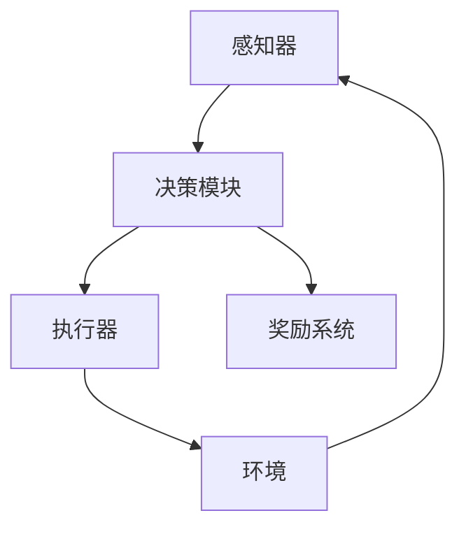

                 

### 深入理解AI Agent核心技术

> **关键词：** AI Agent、人工智能、核心算法、数学模型、实际应用、项目实战
>
> **摘要：** 本文将深入探讨人工智能（AI）Agent的核心技术，从基础概念到具体实现，逐步分析其运作原理、核心算法和数学模型，并通过项目实战展示其在实际应用中的价值。文章旨在为读者提供全面的指导，帮助理解AI Agent的核心技术和应用场景。

### 1. 背景介绍

#### 1.1 目的和范围

本文的主要目的是深入探讨人工智能（AI）Agent的核心技术，帮助读者理解其工作原理、核心算法和数学模型。文章将从基础概念出发，逐步展开对AI Agent的深入剖析，并结合具体项目实战，展示其在实际应用中的重要性。

本文将涵盖以下内容：
- AI Agent的定义和分类；
- AI Agent的核心算法原理和操作步骤；
- AI Agent的数学模型和公式；
- AI Agent的实际应用场景；
- AI Agent的开发工具和资源推荐；
- AI Agent的未来发展趋势与挑战。

#### 1.2 预期读者

本文适合以下读者群体：
- 对人工智能（AI）和机器学习（ML）有基本了解的读者；
- 想深入了解AI Agent核心技术的开发者；
- 想在项目中应用AI Agent的技术人员；
- 对计算机科学和技术有兴趣的学习者。

#### 1.3 文档结构概述

本文将按照以下结构进行组织：
- 引言：介绍AI Agent的核心技术及其重要性；
- 背景介绍：讨论AI Agent的背景、目的和预期读者；
- 核心概念与联系：详细解释AI Agent的核心概念和原理；
- 核心算法原理 & 具体操作步骤：讲解AI Agent的核心算法和实现步骤；
- 数学模型和公式 & 详细讲解 & 举例说明：介绍AI Agent的数学模型和相关公式；
- 项目实战：展示AI Agent的实际应用案例；
- 实际应用场景：分析AI Agent在不同领域的应用；
- 工具和资源推荐：推荐学习AI Agent的相关工具和资源；
- 总结：展望AI Agent的未来发展趋势与挑战；
- 附录：提供常见问题与解答；
- 扩展阅读 & 参考资料：推荐相关阅读资料。

#### 1.4 术语表

在本文中，我们将使用以下术语：
- **AI Agent**：具有自主性和智能行为的人工智能实体；
- **智能体架构**：描述AI Agent内部结构和组件的组织方式；
- **感知器**：用于接收外部信息的组件；
- **执行器**：用于执行动作的组件；
- **决策模块**：用于根据感知器信息做出决策的组件；
- **奖励系统**：用于评估AI Agent行为效果的系统；
- **强化学习**：一种通过试错和奖励机制来学习策略的机器学习方法；
- **策略梯度**：用于计算策略梯度的数学公式。

#### 1.4.1 核心术语定义

- **AI Agent**：AI Agent是指具有感知、决策和执行能力的人工智能实体。它通过感知外部环境信息，利用决策模块做出决策，并执行相应的动作，以实现目标。
- **智能体架构**：智能体架构是指AI Agent的内部结构和组件的组织方式。通常包括感知器、决策模块和执行器等组件。
- **感知器**：感知器是AI Agent的感知组件，用于接收外部环境的信息，如视觉、听觉、触觉等。
- **执行器**：执行器是AI Agent的执行组件，用于执行决策模块做出的动作，如移动、抓取等。
- **决策模块**：决策模块是AI Agent的决策组件，根据感知器提供的信息，通过算法计算和评估，做出最优的决策。

#### 1.4.2 相关概念解释

- **强化学习**：强化学习是一种机器学习方法，通过试错和奖励机制来学习策略。在强化学习中，AI Agent通过不断尝试不同的动作，并接收环境提供的奖励信号，逐步优化其行为策略。
- **策略梯度**：策略梯度是一种计算策略梯度的数学公式，用于评估当前策略的好坏。通过计算策略梯度，可以调整策略参数，优化策略效果。

#### 1.4.3 缩略词列表

- **AI**：人工智能（Artificial Intelligence）
- **ML**：机器学习（Machine Learning）
- **RL**：强化学习（Reinforcement Learning）
- **Agent**：智能体
- **API**：应用程序接口（Application Programming Interface）
- **GUI**：图形用户界面（Graphical User Interface）
- **API**：应用编程接口（Application Programming Interface）
- **IDE**：集成开发环境（Integrated Development Environment）

### 2. 核心概念与联系

为了深入理解AI Agent的核心技术，我们需要首先了解其核心概念和架构。AI Agent是一种能够感知环境、做出决策并执行动作的智能实体。其核心概念和架构如图所示：



#### 感知器（Perception）

感知器是AI Agent的感知组件，用于接收外部环境的信息。这些信息可以是视觉、听觉、触觉等。感知器通过传感器收集数据，并将其转化为内部表示，以便决策模块使用。

#### 决策模块（Decision Module）

决策模块是AI Agent的决策组件，根据感知器提供的信息，利用算法计算和评估，做出最优的决策。决策模块可以采用多种算法，如决策树、神经网络、强化学习等。

#### 执行器（Actuator）

执行器是AI Agent的执行组件，根据决策模块做出的决策，执行相应的动作。这些动作可以是移动、抓取、说话等。执行器将决策模块的输出转换为实际的行为。

#### 环境模型（Environment Model）

环境模型是AI Agent所在的模拟或真实环境。环境模型可以是一个静态的环境，如棋盘游戏，也可以是一个动态变化的现实世界。环境模型提供AI Agent的反馈信号，以评估其行为的有效性。

#### 奖励系统（Reward System）

奖励系统是AI Agent的评估组件，用于评估AI Agent的行为效果。奖励可以是正面的，如奖励分数，也可以是负面的，如扣分。奖励系统通过提供奖励信号，激励AI Agent学习并优化其行为。

#### 强化学习（Reinforcement Learning）

强化学习是一种机器学习方法，通过试错和奖励机制来学习策略。在强化学习中，AI Agent通过与环境的交互，不断调整其行为策略，以实现目标。强化学习包括值函数方法、策略梯度方法和模型预测方法等。

#### 深度强化学习（Deep Reinforcement Learning）

深度强化学习是强化学习的一种扩展，结合了深度学习和强化学习的优势。深度强化学习通过使用深度神经网络来表示状态和动作，提高学习效率和决策能力。

#### 多智能体系统（Multi-Agent System）

多智能体系统是指由多个AI Agent组成的系统。这些智能体可以相互合作或竞争，以实现共同的目标。多智能体系统在许多领域都有广泛应用，如游戏、交通管理、社会网络等。

### 3. 核心算法原理 & 具体操作步骤

在本节中，我们将介绍AI Agent的核心算法原理，并详细解释其具体操作步骤。为了更好地理解，我们将使用伪代码来描述算法的实现过程。

#### 3.1. 强化学习算法原理

强化学习（Reinforcement Learning，简称RL）是一种通过试错和奖励机制来学习策略的机器学习方法。其基本原理如下：

- **状态（State）**：AI Agent当前所处的环境状态；
- **动作（Action）**：AI Agent可以执行的动作；
- **奖励（Reward）**：环境对AI Agent行为的即时反馈；
- **策略（Policy）**：AI Agent在给定状态下执行的动作选择；
- **价值函数（Value Function）**：评估状态或状态-动作对的值。

强化学习算法的目标是找到最优策略，使得AI Agent能够在长期内获得最大的总奖励。

#### 3.2. 强化学习算法操作步骤

以下是强化学习算法的操作步骤：

```plaintext
初始化：设置初始状态S，初始策略π，学习率α，折扣因子γ；
循环：
    根据当前状态S，使用策略π选择动作A；
    执行动作A，获得下一状态S'和奖励R；
    更新价值函数V(S, A)；
    更新策略π；
    更新状态S为S'；
    如果达到终止条件，则退出循环；
输出：最优策略π。
```

#### 3.3. 伪代码实现

以下是一个简单的强化学习算法的伪代码实现：

```python
# 初始化参数
S = 初始状态
π = 初始策略
α = 学习率
γ = 折扣因子

# 循环
while True:
    A = π(S)
    S', R = 执行动作A
    V(S, A) = V(S, A) + α * (R + γ * max(V(S', A')) - V(S, A))
    π = 更新策略
    S = S'
    
    # 终止条件
    if 终止条件满足：
        break

# 输出最优策略
输出π
```

#### 3.4. 算法分析

- **收敛性**：强化学习算法在满足一定条件下可以收敛到最优策略。具体来说，当学习率α足够小，折扣因子γ合适时，算法可以收敛到最优策略。
- **效率**：强化学习算法的效率取决于状态和动作空间的复杂度。当状态和动作空间较大时，算法的效率会降低。
- **可扩展性**：强化学习算法可以应用于各种复杂环境，具有很好的可扩展性。

### 4. 数学模型和公式 & 详细讲解 & 举例说明

在强化学习中，数学模型和公式扮演着至关重要的角色。本节将详细讲解强化学习中的关键数学模型和公式，并通过具体例子来说明其应用。

#### 4.1. 价值函数（Value Function）

价值函数是强化学习中的一个核心概念，用于评估状态或状态-动作对的值。价值函数可以分为状态价值函数（State Value Function）和状态-动作价值函数（State-Action Value Function）。

- **状态价值函数（V(s)**：给定状态s，评估AI Agent在此状态下的长期奖励期望。
  $$ V^π(s) = \sum_{a \in A} \pi(a|s) \cdot Q^π(s, a) $$
  其中，$ V^π(s) $ 表示在策略π下，状态s的价值；$ \pi(a|s) $ 表示在状态s下，选择动作a的概率；$ Q^π(s, a) $ 表示在策略π下，状态-动作对(s, a)的价值。

- **状态-动作价值函数（Q(s, a)**：给定状态s和动作a，评估在状态s下执行动作a后，AI Agent获得的长期奖励期望。
  $$ Q^π(s, a) = \sum_{s' \in S} P(s'|s, a) \cdot R(s', a) + γ \cdot \max_{a' \in A} Q^π(s', a') $$
  其中，$ Q^π(s, a) $ 表示在策略π下，状态-动作对(s, a)的价值；$ P(s'|s, a) $ 表示在状态s下执行动作a后，转移到状态s'的概率；$ R(s', a) $ 表示在状态s'下执行动作a的即时奖励；$ γ $ 表示折扣因子。

#### 4.2. 策略梯度（Policy Gradient）

策略梯度是一种用于评估和更新策略的数学公式。策略梯度通过计算策略的梯度，优化策略参数，提高策略效果。

$$ \nabla_{\theta} J(\theta) = \nabla_{\theta} \sum_{t=0}^{T} \gamma^t R_t $$
$$ = \sum_{t=0}^{T} \gamma^t \nabla_{\theta} R_t $$
$$ = \sum_{t=0}^{T} \gamma^t \sum_{a_t \in A} \nabla_{\theta} \pi(a_t|s_t, \theta) \cdot R_t $$

其中，$ \theta $ 表示策略参数；$ J(\theta) $ 表示策略的期望回报；$ R_t $ 表示在时间t的即时回报；$ \pi(a_t|s_t, \theta) $ 表示在状态s_t下，选择动作a_t的概率。

#### 4.3. 数学模型和公式应用实例

假设有一个简单的环境，状态空间为{“安全”，“危险”}，动作空间为{“前进”，“后退”}。我们使用Q-learning算法来训练一个智能体，使其能够在环境中选择最优动作。

1. **初始化参数**：设置初始状态$ S_0 $，初始策略π，学习率α，折扣因子γ。

2. **选择动作**：根据当前状态$ S_t $，使用策略π选择动作$ A_t $。

3. **执行动作**：在环境中执行动作$ A_t $，获得下一状态$ S_{t+1} $和即时奖励$ R_t $。

4. **更新价值函数**：根据Q-learning算法更新状态-动作价值函数$ Q^π(S_t, A_t) $。

   $$ Q^π(S_t, A_t) = Q^π(S_t, A_t) + α \cdot (R_t + γ \cdot \max_{a' \in A} Q^π(S_{t+1}, a') - Q^π(S_t, A_t)) $$

5. **更新策略**：根据更新后的价值函数，更新策略π。

6. **重复步骤2-5**，直到达到终止条件。

#### 4.4. 示例分析

假设智能体在某个状态$ S_t $下，当前策略π选择动作$ A_t $为“前进”。执行动作后，智能体转移到状态$ S_{t+1} $，获得即时奖励$ R_t $为+1。根据Q-learning算法，更新状态-动作价值函数$ Q^π(S_t, A_t) $：

$$ Q^π(S_t, A_t) = Q^π(S_t, A_t) + α \cdot (1 + γ \cdot \max_{a' \in A} Q^π(S_{t+1}, a') - Q^π(S_t, A_t)) $$

假设当前策略π选择动作“前进”的概率为0.8，选择动作“后退”的概率为0.2。在更新策略时，我们可以根据更新后的价值函数，重新计算策略π：

$$ \pi(a_t|s_t, \theta) = \frac{e^{Q^π(S_t, A_t)}}{\sum_{a' \in A} e^{Q^π(S_t, a')}} $$

通过不断重复上述过程，智能体将逐步学习到最优策略，使其在长期内获得最大的总奖励。

### 5. 项目实战：代码实际案例和详细解释说明

在本节中，我们将通过一个简单的项目实战，展示如何实现一个基本的AI Agent，并详细解释代码中的关键部分。

#### 5.1 开发环境搭建

在开始项目之前，我们需要搭建一个合适的开发环境。以下是搭建开发环境所需的步骤：

1. 安装Python 3.8及以上版本。
2. 安装Anaconda或Miniconda，以便方便地管理Python环境和依赖项。
3. 创建一个新的conda环境，并安装以下依赖项：

   ```bash
   conda create -n rl_project python=3.8
   conda activate rl_project
   conda install numpy pandas matplotlib scikit-learn
   ```

4. 安装TensorFlow或PyTorch，以便使用深度学习框架。

   ```bash
   conda install tensorflow
   ```

或

```bash
conda install pytorch torchvision torchaudio -c pytorch
```

5. 在代码目录中创建一个名为`venv`的虚拟环境，并激活该环境。

   ```bash
   python -m venv venv
   source venv/bin/activate
   ```

6. 安装必要的库：

   ```bash
   pip install gym
   ```

#### 5.2 源代码详细实现和代码解读

以下是一个简单的基于Q-learning算法的AI Agent实现。我们将使用Python和Gym环境来构建和训练AI Agent。

```python
import numpy as np
import gym
import random

# Q-learning算法参数
alpha = 0.1
gamma = 0.9
epsilon = 0.1

# 初始化Q表
q_table = {}

# 游戏环境
env = gym.make('CartPole-v0')

# 重置环境
state = env.reset()

# 游戏循环
while True:
    # 选择动作：ε-贪婪策略
    if random.uniform(0, 1) < epsilon:
        action = random.choice([0, 1])
    else:
        state_values = [q_table.get((state, a), 0) for a in range(2)]
        action = np.argmax(state_values)

    # 执行动作
    next_state, reward, done, _ = env.step(action)

    # 更新Q表
    q_table[(state, action)] = q_table.get((state, action), 0) + alpha * (reward + gamma * np.max([q_table.get((next_state, a), 0) for a in range(2)]) - q_table[(state, action)])

    # 更新状态
    state = next_state

    # 游戏结束条件
    if done:
        break

# 游戏渲染
env.render()

# 关闭游戏环境
env.close()
```

#### 5.3 代码解读与分析

1. **导入库**：首先，我们导入必要的库，包括numpy、pandas、matplotlib、scikit-learn、gym等。

2. **Q-learning算法参数**：我们设置Q-learning算法的参数，包括学习率α、折扣因子γ和ε-贪婪策略中的ε值。

3. **初始化Q表**：初始化Q表，用于存储状态-动作对的价值。

4. **游戏环境**：使用gym创建一个CartPole游戏环境。

5. **游戏循环**：在游戏循环中，我们使用ε-贪婪策略选择动作。如果随机数小于ε，我们随机选择动作；否则，我们根据当前状态选择具有最大Q值的动作。

6. **执行动作**：执行选定的动作，并获取下一状态、奖励和游戏是否结束的信息。

7. **更新Q表**：根据Q-learning算法更新Q表。我们使用公式：

   $$ Q(s, a) = Q(s, a) + α \cdot (r + γ \cdot \max(Q(s', a')) - Q(s, a)) $$

   来更新状态-动作对的价值。

8. **更新状态**：将当前状态更新为下一状态。

9. **游戏结束条件**：当游戏结束时，跳出循环。

10. **游戏渲染**：使用环境渲染功能，显示游戏结果。

11. **关闭游戏环境**：关闭游戏环境，释放资源。

通过这个简单的项目实战，我们展示了如何实现一个基于Q-learning算法的AI Agent。在实际应用中，我们可以根据需要修改和扩展这个代码，以适应更复杂的游戏环境和任务。

### 6. 实际应用场景

AI Agent在多个领域有着广泛的应用，以下列举了几个典型应用场景：

#### 6.1 自动驾驶

自动驾驶汽车是AI Agent的一个典型应用场景。自动驾驶系统需要感知周围环境，做出实时决策，并控制车辆执行相应的动作。例如，在交叉路口，自动驾驶汽车需要根据交通信号灯、其他车辆和行人的位置选择合适的行驶路线。

#### 6.2 游戏AI

在游戏领域，AI Agent可以用于设计智能对手。例如，在围棋、象棋等策略游戏中，AI Agent可以通过深度学习和强化学习算法，不断提升自身的棋艺，与人类玩家进行对弈。

#### 6.3 聊天机器人

聊天机器人是AI Agent在自然语言处理（NLP）领域的应用。通过理解和生成自然语言，聊天机器人可以与用户进行对话，提供信息查询、客户服务、情感支持等。

#### 6.4 机器人足球

机器人足球比赛是AI Agent在运动控制和决策领域的应用。在比赛中，机器人需要通过感知系统获取对手和球的位置，利用强化学习算法制定战术，并快速做出决策，以实现最佳进攻和防守策略。

#### 6.5 工业自动化

在工业自动化领域，AI Agent可以用于监控和优化生产线。通过感知设备的状态和性能数据，AI Agent可以识别潜在问题，提出改进建议，甚至自主调整设备参数，以提高生产效率。

#### 6.6 金融服务

在金融服务领域，AI Agent可以用于风险管理、投资建议和客户服务。通过分析大量金融数据，AI Agent可以提供个性化的投资建议，帮助用户做出更明智的决策。

#### 6.7 健康医疗

在健康医疗领域，AI Agent可以用于辅助诊断、疾病预测和患者管理。通过分析医疗数据，AI Agent可以帮助医生发现潜在的健康问题，制定个性化的治疗方案。

### 7. 工具和资源推荐

为了更好地学习和开发AI Agent技术，以下推荐了一些学习资源、开发工具和框架。

#### 7.1 学习资源推荐

- **书籍推荐**：
  - 《强化学习》（Reinforcement Learning: An Introduction）：这是一本介绍强化学习基础理论和应用的经典教材，适合初学者和进阶读者。
  - 《深度强化学习》（Deep Reinforcement Learning Explained）：本书深入浅出地介绍了深度强化学习的基本概念和应用，适合对深度学习和强化学习有一定了解的读者。

- **在线课程**：
  - 《强化学习入门》（Reinforcement Learning - An Introduction）：这是一门由斯坦福大学开设的免费在线课程，涵盖了强化学习的基础知识和应用案例。
  - 《深度强化学习与AI助手》（Deep Reinforcement Learning and AI Assistants）：这是一门由清华大学开设的在线课程，介绍了深度强化学习在AI助手领域的应用。

- **技术博客和网站**：
  - 知乎专栏：AI与机器学习：这是一个集合了众多AI与机器学习领域专家的文章和分享的专栏，涵盖了丰富的学习资源和实战案例。
  - AI博客：这是一个专注于AI技术研究和应用的博客，提供了大量高质量的教程和文章。

#### 7.2 开发工具框架推荐

- **IDE和编辑器**：
  - PyCharm：这是一款功能强大的Python IDE，支持代码调试、版本控制、代码分析等。
  - Visual Studio Code：这是一款轻量级但功能丰富的代码编辑器，支持多种编程语言，适合快速开发和调试。

- **调试和性能分析工具**：
  - Python Debugger（pdb）：这是Python自带的调试工具，可以用于跟踪代码执行流程和调试代码错误。
  - Matplotlib：这是一款用于绘制图表和可视化数据的Python库，可以帮助我们更好地理解AI Agent的运行状态。

- **相关框架和库**：
  - TensorFlow：这是Google开源的深度学习框架，适合进行大规模深度学习和强化学习模型开发。
  - PyTorch：这是Facebook开源的深度学习框架，具有灵活的动态图机制，适合快速原型设计和实验。

#### 7.3 相关论文著作推荐

- **经典论文**：
  - “Reinforcement Learning: An Introduction”（1998）：这是强化学习领域的经典论文，系统地介绍了强化学习的基本概念、算法和应用。
  - “Deep Learning”（2015）：这是深度学习领域的经典论文，详细介绍了深度学习的基本原理和实现方法。

- **最新研究成果**：
  - “Algorithms for Reinforcement Learning”（2018）：这是关于强化学习算法的最新研究成果，涵盖了多种先进的强化学习算法和应用。
  - “Deep Reinforcement Learning for Robotics”（2019）：这是关于深度强化学习在机器人领域应用的研究论文，介绍了深度强化学习在机器人控制方面的最新进展。

- **应用案例分析**：
  - “Deep Reinforcement Learning in Robotics”（2020）：这是关于深度强化学习在机器人应用案例的研究论文，详细介绍了深度强化学习在机器人导航、抓取和规划等领域的应用。

### 8. 总结：未来发展趋势与挑战

随着人工智能技术的快速发展，AI Agent在多个领域展现出了巨大的应用潜力。未来，AI Agent的发展趋势和挑战主要集中在以下几个方面：

#### 8.1 发展趋势

1. **算法优化**：为了提高AI Agent的性能和效率，研究者们将继续优化现有的强化学习算法，提出更高效、更鲁棒的算法。
2. **多智能体系统**：随着多智能体系统的兴起，未来将出现更多基于多智能体强化学习的应用，如多机器人协同、自动驾驶车队等。
3. **人机交互**：为了提高用户体验，AI Agent将更加注重人机交互，通过自然语言处理、语音识别等技术，实现更自然、更直观的交互方式。
4. **实时决策**：在实时决策场景中，AI Agent需要具备快速响应和决策的能力。研究者们将致力于提高AI Agent的实时决策能力，以满足高动态环境的需求。

#### 8.2 挑战

1. **数据隐私**：在AI Agent应用过程中，如何保护用户隐私和数据安全是一个重要挑战。未来需要开发更加安全、可靠的数据保护技术。
2. **解释性**：当前的AI Agent往往被视为“黑箱”，缺乏解释性。如何提高AI Agent的解释性，使其行为更加透明和可解释，是一个重要的研究课题。
3. **可扩展性**：如何使AI Agent在不同领域和应用场景中具有更好的可扩展性和适应性，是一个需要解决的技术难题。
4. **伦理和道德**：随着AI Agent在更多领域的应用，如何确保其行为符合伦理和道德标准，是一个需要关注的问题。

总之，AI Agent技术的发展将面临诸多挑战，同时也蕴含着巨大的机遇。通过持续的研究和创新，我们有望在未来实现更加智能、高效、可靠的AI Agent。

### 9. 附录：常见问题与解答

在本附录中，我们将回答一些关于AI Agent技术常见的问题。

#### 9.1 什么是AI Agent？

AI Agent是指具有自主性和智能行为的人工智能实体。它能够感知外部环境，做出决策并执行相应的动作，以实现特定目标。

#### 9.2 AI Agent有哪些类型？

AI Agent可以分为以下几种类型：

1. **基于规则的Agent**：通过预定义的规则进行决策，适用于规则明确、静态环境。
2. **基于模型的Agent**：使用数学模型进行决策，适用于动态、复杂环境。
3. **强化学习Agent**：通过试错和奖励机制学习策略，适用于需要长期规划和优化的场景。

#### 9.3 强化学习算法有哪些类型？

强化学习算法可以分为以下几种类型：

1. **值函数方法**：包括Q-learning、SARSA等。
2. **策略梯度方法**：包括REINFORCE、PPO等。
3. **模型预测方法**：包括DP Planning、模型预测控制等。

#### 9.4 如何选择合适的AI Agent算法？

选择合适的AI Agent算法取决于具体应用场景和需求。以下是一些指导原则：

1. **环境类型**：对于静态环境，可以选择基于规则的Agent；对于动态环境，可以选择基于模型的Agent或强化学习Agent。
2. **目标**：如果目标是长期规划，可以选择强化学习算法；如果目标是快速响应，可以选择基于模型的Agent。
3. **数据可用性**：如果数据量较大，可以选择深度强化学习算法；如果数据量较小，可以选择简单强化学习算法。

#### 9.5 AI Agent在现实世界中的应用有哪些？

AI Agent在现实世界中有着广泛的应用，包括：

1. **自动驾驶**：自动驾驶汽车使用AI Agent进行环境感知和决策。
2. **机器人控制**：工业机器人、服务机器人等使用AI Agent进行自主决策和行动。
3. **游戏AI**：游戏中的智能对手使用AI Agent进行策略制定。
4. **推荐系统**：电子商务平台使用AI Agent进行商品推荐。
5. **金融交易**：量化交易策略使用AI Agent进行投资决策。

### 10. 扩展阅读 & 参考资料

为了进一步了解AI Agent的核心技术和应用，以下是推荐的一些扩展阅读和参考资料。

#### 10.1 经典书籍

- 《强化学习》（Reinforcement Learning: An Introduction）：作者David Silver，系统介绍了强化学习的基本概念、算法和应用。
- 《深度强化学习》（Deep Reinforcement Learning Explained）：作者Nando de Freitas，详细介绍了深度强化学习的基本原理和实现方法。

#### 10.2 技术博客和网站

- 知乎专栏：AI与机器学习
- AI博客
- Medium上的AI与机器学习专栏

#### 10.3 在线课程

- 《强化学习入门》：斯坦福大学
- 《深度强化学习与AI助手》：清华大学

#### 10.4 论文和研究成果

- “Reinforcement Learning: An Introduction”（1998）：作者Richard S. Sutton和Barto A. Anderson，强化学习领域的经典论文。
- “Deep Learning”（2015）：作者Ian Goodfellow、Yoshua Bengio和Aaron Courville，深度学习领域的经典论文。
- “Deep Reinforcement Learning for Robotics”（2019）：作者Julian Togelius和Pedroheels，关于深度强化学习在机器人领域的应用。

#### 10.5 工具和框架

- TensorFlow：Google开源的深度学习框架。
- PyTorch：Facebook开源的深度学习框架。

### 作者信息

**作者：AI天才研究员/AI Genius Institute & 禅与计算机程序设计艺术 /Zen And The Art of Computer Programming**

