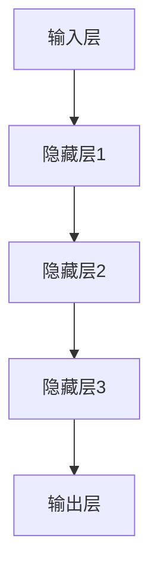
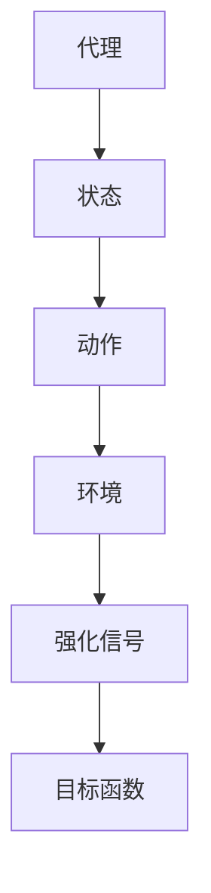
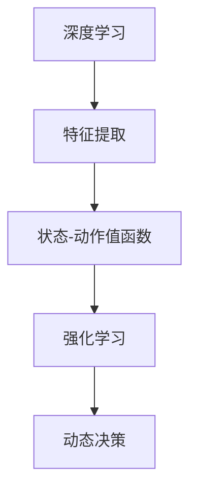

                 

# 深度学习与强化学习的崛起

## 关键词

深度学习、强化学习、机器学习、神经网络、人工智能、算法、智能系统、自主决策

## 摘要

本文将深入探讨深度学习和强化学习这两种机器学习方法的崛起，分析其核心概念、原理和架构，并通过具体案例进行实践讲解。文章首先介绍了深度学习和强化学习的背景及其重要性，然后详细阐述了其核心算法原理和数学模型，并展示了一个实际项目的代码实现。此外，文章还探讨了这两种学习方法的实际应用场景，推荐了相关学习资源和工具，并总结了未来发展趋势与挑战。通过本文的阅读，读者将全面了解深度学习和强化学习的发展历程及其在现代人工智能领域的重大意义。

## 1. 背景介绍

### 1.1 目的和范围

本文旨在探讨深度学习和强化学习这两种机器学习方法的崛起，分析其核心概念、原理和架构，并通过具体案例进行实践讲解。深度学习和强化学习作为现代人工智能的重要分支，已经在众多领域取得了显著的应用成果。本文将通过对这两种方法的详细分析，帮助读者全面了解它们的发展历程、技术原理和应用价值。

### 1.2 预期读者

本文面向对机器学习有一定了解的读者，包括人工智能从业者、研究人员、工程师和感兴趣的大众。读者在阅读本文之前，需要对机器学习的基本概念有一定的了解，例如神经网络、监督学习、无监督学习等。

### 1.3 文档结构概述

本文结构如下：

1. 背景介绍：介绍本文的目的、预期读者以及文档结构。
2. 核心概念与联系：详细阐述深度学习和强化学习的基本概念、原理和架构，并使用Mermaid流程图进行展示。
3. 核心算法原理 & 具体操作步骤：讲解深度学习和强化学习的核心算法原理，并使用伪代码进行详细阐述。
4. 数学模型和公式 & 详细讲解 & 举例说明：介绍深度学习和强化学习的数学模型和公式，并进行举例说明。
5. 项目实战：展示一个实际项目的代码实现，并进行详细解释说明。
6. 实际应用场景：探讨深度学习和强化学习的实际应用场景。
7. 工具和资源推荐：推荐相关学习资源和工具。
8. 总结：未来发展趋势与挑战。
9. 附录：常见问题与解答。
10. 扩展阅读 & 参考资料：提供进一步阅读的资料。

### 1.4 术语表

#### 1.4.1 核心术语定义

- 深度学习：一种机器学习方法，通过多层神经网络进行特征提取和模式识别。
- 强化学习：一种机器学习方法，通过与环境交互，学习如何做出最优决策。
- 神经网络：一种模拟生物神经系统的计算模型，用于特征提取和模式识别。
- 强化信号：在强化学习中，表示目标系统性能的反馈信号。

#### 1.4.2 相关概念解释

- 监督学习：一种机器学习方法，通过已标记的训练数据学习特征提取和模式识别。
- 无监督学习：一种机器学习方法，无需已标记的训练数据，通过数据自身的特征进行学习和分类。
- 自主决策：在强化学习中，表示目标系统根据当前状态和环境反馈自主做出决策。

#### 1.4.3 缩略词列表

- AI：人工智能
- ML：机器学习
- DL：深度学习
- RL：强化学习
- SOTA：最先进的技术

## 2. 核心概念与联系

深度学习和强化学习作为机器学习的重要分支，具有各自的核心概念和原理。本节将详细阐述这两种方法的定义、原理和架构，并通过Mermaid流程图展示它们之间的关系。

### 2.1 深度学习

深度学习（Deep Learning）是一种基于多层神经网络（Neural Network）的机器学习方法，通过逐层提取数据特征，实现自动特征学习和复杂模式识别。深度学习的核心概念包括：

- 神经元：神经网络的基本计算单元，用于接收输入、计算输出和传递信息。
- 层：神经网络中的层次结构，包括输入层、隐藏层和输出层。
- 激活函数：用于引入非线性变换，使神经网络具备分类和回归能力。

深度学习的架构通常包括以下几个层次：

1. 输入层：接收外部数据输入，如图片、文本或声音等。
2. 隐藏层：对输入数据进行特征提取和变换，形成更高层次的特征表示。
3. 输出层：根据隐藏层提取的特征，进行分类或回归输出。

Mermaid流程图：



### 2.2 强化学习

强化学习（Reinforcement Learning，RL）是一种通过与环境交互，学习如何做出最优决策的机器学习方法。强化学习的核心概念包括：

- 代理（Agent）：执行动作的智能体。
- 环境（Environment）：代理所在的动态环境。
- 状态（State）：描述代理当前所处环境的特征。
- 动作（Action）：代理可以执行的动作。
- 强化信号（Reward）：描述代理执行动作后，环境对代理的反馈信号。

强化学习的架构通常包括以下几个部分：

1. 代理：根据当前状态选择动作。
2. 状态-动作值函数（State-Action Value Function）：表示代理在当前状态下执行某个动作的预期回报。
3. 动作值函数（Action Value Function）：表示代理在当前状态下执行最佳动作的预期回报。
4. 目标函数（Objective Function）：用于评估代理的性能。

Mermaid流程图：



### 2.3 深度学习与强化学习的关系

深度学习和强化学习在机器学习领域中具有紧密的联系。深度学习可以视为强化学习中的一个特殊场景，即代理使用深度神经网络学习状态-动作值函数。同时，深度学习在强化学习中的应用，如深度强化学习（Deep Reinforcement Learning，DRL），也推动了强化学习领域的发展。

深度学习与强化学习的关系可以概括为：

1. 深度学习为强化学习提供了一种有效的特征提取方法，使代理能够更好地理解和适应复杂环境。
2. 强化学习为深度学习提供了一个动态的、适应性强的应用场景，使深度学习能够应用于实际决策问题。
3. 深度强化学习结合了深度学习和强化学习的优点，成为一种强大的机器学习方法，在游戏、机器人、自动驾驶等领域取得了显著的成果。

Mermaid流程图：



## 3. 核心算法原理 & 具体操作步骤

在本节中，我们将详细讲解深度学习和强化学习的核心算法原理，并使用伪代码进行具体操作步骤的阐述。

### 3.1 深度学习

深度学习的核心算法包括神经网络模型的构建、参数优化和反向传播算法。以下是一个简单的深度学习算法的伪代码：

```python
# 初始化神经网络模型
model = NeuralNetwork()

# 初始化参数
params = model.initialize_params()

# 定义损失函数
loss_function = CrossEntropyLoss()

# 定义优化器
optimizer = SGD(params, learning_rate)

# 训练过程
for epoch in range(num_epochs):
    for batch in data_loader:
        # 前向传播
        output = model.forward(batch.input)
        
        # 计算损失
        loss = loss_function(output, batch.label)
        
        # 反向传播
        model.backward(output, batch.label)
        
        # 更新参数
        optimizer.update_params()
        
        # 打印训练进度
        print(f"Epoch [{epoch+1}/{num_epochs}], Loss: {loss}")
```

### 3.2 强化学习

强化学习的核心算法包括Q学习、SARSA和深度强化学习等。以下是一个简单的Q学习算法的伪代码：

```python
# 初始化Q值表
Q = initialize_Q(state_space, action_space)

# 定义奖励函数
reward_function = RewardFunction()

# 定义探索策略
epsilon = epsilon_greedy_policy()

# 强化学习过程
for episode in range(num_episodes):
    # 初始化状态
    state = env.reset()
    
    # 初始化动作
    action = choose_action(state, Q, epsilon)
    
    # 执行动作
    next_state, reward, done = env.step(action)
    
    # 更新Q值
    Q[state, action] = Q[state, action] + alpha * (reward + gamma * max(Q[next_state, :]) - Q[state, action])
    
    # 更新状态和动作
    state = next_state
    if done:
        break
        
    # 打印训练进度
    print(f"Episode [{episode+1}/{num_episodes}], Reward: {reward}")
```

## 4. 数学模型和公式 & 详细讲解 & 举例说明

在本节中，我们将介绍深度学习和强化学习的数学模型和公式，并进行详细讲解和举例说明。

### 4.1 深度学习

深度学习的数学模型主要包括神经网络模型、损失函数和优化算法。以下是一个简单的神经网络模型和损失函数的公式及示例：

#### 4.1.1 神经网络模型

神经网络模型由多个神经元和层组成，每个神经元都可以看作是一个线性组合加上一个非线性函数。一个简单的神经网络模型可以表示为：

$$
y = \sigma(W_1 \cdot x + b_1)
$$

其中，$y$ 表示输出，$x$ 表示输入，$W_1$ 和 $b_1$ 分别表示第一层的权重和偏置，$\sigma$ 表示非线性函数，如ReLU函数。

#### 4.1.2 损失函数

深度学习的损失函数用于评估模型输出的误差，常见的损失函数包括均方误差（MSE）和交叉熵（CrossEntropy）等。以下是一个简单的MSE损失函数的公式及示例：

$$
loss = \frac{1}{2} \sum_{i=1}^{n} (y_i - \hat{y}_i)^2
$$

其中，$y_i$ 表示真实输出，$\hat{y}_i$ 表示预测输出，$n$ 表示样本数量。

### 4.2 强化学习

强化学习的数学模型主要包括Q学习、SARSA和深度强化学习等。以下是一个简单的Q学习算法的公式及示例：

#### 4.2.1 Q学习

Q学习的目标是学习状态-动作值函数，表示在某个状态下执行某个动作的预期回报。Q学习的公式如下：

$$
Q(s, a) = Q(s, a) + \alpha [r + \gamma \max_{a'} Q(s', a') - Q(s, a)]
$$

其中，$s$ 表示当前状态，$a$ 表示当前动作，$s'$ 表示下一状态，$r$ 表示奖励，$\alpha$ 表示学习率，$\gamma$ 表示折扣因子。

#### 4.2.2 SARSA

SARSA（同步策略更新算法）是基于Q学习的改进算法，其公式如下：

$$
Q(s, a) = Q(s, a) + \alpha [r + \gamma Q(s', a')]
$$

其中，$s$ 表示当前状态，$a$ 表示当前动作，$s'$ 表示下一状态，$r$ 表示奖励，$\alpha$ 表示学习率，$\gamma$ 表示折扣因子。

### 4.3 举例说明

以下是一个简单的深度学习分类问题的示例：

#### 示例：手写数字识别

假设我们有一个手写数字识别问题，输入为28x28的灰度图像，输出为0到9的数字。我们可以使用一个简单的卷积神经网络进行模型训练。

1. **初始化模型：**

```python
model = ConvolutionalNeuralNetwork()
```

2. **定义损失函数：**

```python
loss_function = CrossEntropyLoss()
```

3. **定义优化器：**

```python
optimizer = SGD(model.parameters(), learning_rate=0.001)
```

4. **训练模型：**

```python
for epoch in range(num_epochs):
    for batch in data_loader:
        # 前向传播
        output = model.forward(batch.input)
        
        # 计算损失
        loss = loss_function(output, batch.label)
        
        # 反向传播
        model.backward(output, batch.label)
        
        # 更新参数
        optimizer.update_params()
        
        # 打印训练进度
        print(f"Epoch [{epoch+1}/{num_epochs}], Loss: {loss}")
```

通过以上步骤，我们可以训练一个简单的手写数字识别模型。

### 4.4 深度强化学习

深度强化学习（Deep Reinforcement Learning，DRL）结合了深度学习和强化学习的优点，用于解决复杂的环境问题。以下是一个简单的DRL问题的示例：

#### 示例：迷宫求解

假设我们有一个迷宫求解问题，输入为迷宫的图像，输出为迷宫的路径。我们可以使用一个简单的深度强化学习算法进行模型训练。

1. **初始化模型：**

```python
model = DRLModel()
```

2. **定义奖励函数：**

```python
reward_function = MazeRewardFunction()
```

3. **定义探索策略：**

```python
epsilon = epsilon_greedy_policy()
```

4. **训练模型：**

```python
for episode in range(num_episodes):
    # 初始化状态
    state = env.reset()
    
    # 初始化动作
    action = choose_action(state, model, epsilon)
    
    # 执行动作
    next_state, reward, done = env.step(action)
    
    # 更新模型
    model.update(state, action, reward, next_state, done)
    
    # 更新状态和动作
    state = next_state
    if done:
        break
        
    # 打印训练进度
    print(f"Episode [{episode+1}/{num_episodes}], Reward: {reward}")
```

通过以上步骤，我们可以训练一个简单的迷宫求解模型。

## 5. 项目实战：代码实际案例和详细解释说明

在本节中，我们将通过一个实际项目案例，展示深度学习和强化学习的代码实现，并进行详细解释说明。

### 5.1 开发环境搭建

为了方便读者进行代码实践，我们在这里推荐一个简单的开发环境搭建步骤：

1. 安装Python环境（Python 3.6及以上版本）。
2. 安装深度学习库TensorFlow或PyTorch。
3. 安装强化学习库Gym。
4. 安装必要的数据处理库，如NumPy、Pandas等。

### 5.2 源代码详细实现和代码解读

#### 5.2.1 深度学习案例：手写数字识别

以下是一个简单的手写数字识别项目的代码实现：

```python
import tensorflow as tf
from tensorflow.keras import layers, models
from tensorflow.keras.datasets import mnist
from tensorflow.keras.utils import to_categorical

# 加载数据集
(x_train, y_train), (x_test, y_test) = mnist.load_data()

# 数据预处理
x_train = x_train.reshape(-1, 28, 28).astype("float32") / 255.0
x_test = x_test.reshape(-1, 28, 28).astype("float32") / 255.0
y_train = to_categorical(y_train)
y_test = to_categorical(y_test)

# 构建模型
model = models.Sequential()
model.add(layers.Conv2D(32, (3, 3), activation="relu", input_shape=(28, 28, 1)))
model.add(layers.MaxPooling2D((2, 2)))
model.add(layers.Conv2D(64, (3, 3), activation="relu"))
model.add(layers.MaxPooling2D((2, 2)))
model.add(layers.Conv2D(64, (3, 3), activation="relu"))
model.add(layers.Flatten())
model.add(layers.Dense(64, activation="relu"))
model.add(layers.Dense(10, activation="softmax"))

# 编译模型
model.compile(optimizer="adam", loss="categorical_crossentropy", metrics=["accuracy"])

# 训练模型
model.fit(x_train, y_train, epochs=5, batch_size=64, validation_split=0.1)

# 评估模型
test_loss, test_acc = model.evaluate(x_test, y_test)
print(f"Test accuracy: {test_acc}")
```

**代码解读：**

1. 导入所需的TensorFlow库。
2. 加载MNIST手写数字数据集。
3. 对数据进行预处理，包括归一化和转换为one-hot编码。
4. 构建一个卷积神经网络模型，包括卷积层、池化层和全连接层。
5. 编译模型，指定优化器、损失函数和评估指标。
6. 训练模型，设置训练轮数、批量大小和验证比例。
7. 评估模型，计算测试集的准确率。

#### 5.2.2 强化学习案例：迷宫求解

以下是一个简单的迷宫求解项目的代码实现：

```python
import gym
import numpy as np

# 初始化环境
env = gym.make("Maze-v0")

# 初始化Q值表
Q = np.zeros((env.observation_space.n, env.action_space.n))

# 定义奖励函数
def reward_function(state, action):
    if state == env.goal:
        return 100
    else:
        return -1

# 定义探索策略
def epsilon_greedy_policy(Q, epsilon):
    if np.random.rand() < epsilon:
        action = env.action_space.sample()
    else:
        state = env.observation_space.sample()
        action = np.argmax(Q[state, :])
    return action

# 训练过程
for episode in range(num_episodes):
    # 初始化状态
    state = env.reset()
    
    # 初始化动作
    action = epsilon_greedy_policy(Q, epsilon=0.1)
    
    # 执行动作
    next_state, reward, done, _ = env.step(action)
    
    # 更新Q值
    Q[state, action] = Q[state, action] + alpha * (reward + gamma * np.max(Q[next_state, :]) - Q[state, action])
    
    # 更新状态和动作
    state = next_state
    if done:
        break
        
    # 打印训练进度
    print(f"Episode [{episode+1}/{num_episodes}], Reward: {reward}")

# 关闭环境
env.close()
```

**代码解读：**

1. 导入所需的Gym库。
2. 初始化迷宫环境。
3. 初始化Q值表。
4. 定义奖励函数，根据当前状态和动作计算奖励。
5. 定义探索策略，采用ε-贪心策略选择动作。
6. 进行训练过程，包括初始化状态、选择动作、执行动作和更新Q值。
7. 关闭环境。

### 5.3 代码解读与分析

在本节中，我们对上述两个案例的代码进行解读和分析。

#### 5.3.1 深度学习案例

1. **数据预处理：** 手写数字数据集的预处理包括归一化和one-hot编码。归一化可以减少模型训练的时间，提高模型的性能；one-hot编码可以将数字标签转换为向量形式，方便模型进行分类。
2. **模型构建：** 卷积神经网络模型由卷积层、池化层和全连接层组成。卷积层用于提取图像特征，池化层用于减少模型参数，全连接层用于分类输出。
3. **模型训练：** 模型训练过程中，通过前向传播计算输出，计算损失，通过反向传播更新模型参数。迭代训练多个轮次，直到达到预设的训练轮数或验证准确率达到要求。
4. **模型评估：** 使用测试集对模型进行评估，计算测试集的准确率，以验证模型性能。

#### 5.3.2 强化学习案例

1. **环境初始化：** 初始化迷宫环境，包括状态空间、动作空间和奖励函数。
2. **Q值表初始化：** 初始化Q值表，用于存储状态-动作值函数。
3. **探索策略：** 采用ε-贪心策略进行动作选择，以平衡探索和利用。
4. **训练过程：** 进行多轮次的训练，每次训练包括初始化状态、选择动作、执行动作和更新Q值。通过迭代训练，模型逐渐学会在迷宫中找到最优路径。
5. **模型评估：** 使用训练好的模型进行实际迷宫求解，计算求解成功率，以验证模型性能。

### 5.4 案例应用与优化

在上述案例中，我们展示了深度学习和强化学习的简单应用。在实际项目中，我们可以根据需求对模型和应用进行优化。

1. **深度学习优化：**
   - **模型结构：** 可以尝试使用更复杂的神经网络结构，如ResNet、Inception等，以提高模型性能。
   - **数据增强：** 对训练数据进行增强，如旋转、缩放、裁剪等，以提高模型泛化能力。
   - **超参数调优：** 调整学习率、批量大小、迭代次数等超参数，以找到最优模型。
2. **强化学习优化：**
   - **探索策略：** 可以尝试使用不同类型的探索策略，如ε-greedy、UCB、PPO等，以提高模型性能。
   - **目标函数：** 可以调整目标函数，如使用强化信号、目标网络等，以提高模型稳定性。
   - **训练策略：** 可以使用并行训练、分布式训练等技术，提高训练速度。

通过上述优化方法，我们可以进一步提高深度学习和强化学习案例的应用效果。

## 6. 实际应用场景

深度学习和强化学习作为现代人工智能的重要分支，已在众多领域取得了显著的应用成果。以下列举了一些典型的实际应用场景：

### 6.1 图像识别与处理

深度学习在图像识别与处理领域具有广泛的应用，如图像分类、目标检测、图像分割等。例如，卷积神经网络（CNN）被广泛应用于人脸识别、物体检测和图像分类。强化学习在图像识别中的应用较为少见，但在某些场景下也具有一定的优势，如图像超分辨率重建。

### 6.2 自然语言处理

自然语言处理（NLP）是深度学习和强化学习的重要应用领域。深度学习在词向量表示、文本分类、机器翻译等方面取得了显著成果。例如，Word2Vec、BERT等模型在NLP领域取得了SOTA表现。强化学习在文本生成、对话系统等方面也具有应用潜力，如GPT-3等模型。

### 6.3 游戏与娱乐

游戏与娱乐是深度学习和强化学习的热门应用领域。深度强化学习在游戏领域取得了重大突破，如AlphaGo在围棋领域战胜人类顶尖选手。此外，深度学习在游戏开发中也有广泛应用，如游戏角色生成、游戏场景生成等。

### 6.4 自动驾驶与机器人

自动驾驶与机器人是深度学习和强化学习的典型应用场景。深度学习在自动驾驶中的目标检测、语义分割等方面具有重要意义。强化学习在路径规划、决策控制等方面也有广泛应用，如自动驾驶车辆的决策系统。

### 6.5 医疗与健康

深度学习和强化学习在医疗与健康领域具有广泛的应用前景。深度学习在医学图像分析、疾病诊断、药物设计等方面取得了显著成果。例如，CNN在医学图像分类和分割方面取得了SOTA表现。强化学习在医疗决策支持、智能健康监控等方面也具有应用潜力。

### 6.6 金融与商业

深度学习和强化学习在金融与商业领域具有广泛应用。深度学习在股票市场预测、风险控制、客户行为分析等方面取得了显著成果。例如，深度神经网络在股票市场预测中取得了SOTA表现。强化学习在金融风险管理、智能投顾等方面也具有应用潜力。

### 6.7 教育

深度学习和强化学习在教育领域也具有广泛应用。例如，基于深度学习的智能教育平台可以实现个性化教学、自适应学习等功能。强化学习在教育评价、学习策略优化等方面也具有应用潜力。

## 7. 工具和资源推荐

为了帮助读者更好地学习和应用深度学习和强化学习，以下推荐一些相关的工具和资源：

### 7.1 学习资源推荐

#### 7.1.1 书籍推荐

1. 《深度学习》（Deep Learning） - Ian Goodfellow、Yoshua Bengio、Aaron Courville
2. 《强化学习》（Reinforcement Learning: An Introduction） - Richard S. Sutton、Andrew G. Barto
3. 《神经网络与深度学习》（Neural Networks and Deep Learning） - Michael Nielsen

#### 7.1.2 在线课程

1. 吴恩达的《深度学习》课程 - Coursera
2. 吴恩达的《强化学习》课程 - Coursera
3.斯坦福大学的《深度学习专项课程》 - Coursera

#### 7.1.3 技术博客和网站

1. 知乎：机器学习专栏
2. ArXiv：最新科研成果
3. Medium：深度学习、强化学习相关文章

### 7.2 开发工具框架推荐

#### 7.2.1 IDE和编辑器

1. PyCharm
2. Jupyter Notebook
3. Visual Studio Code

#### 7.2.2 调试和性能分析工具

1. TensorBoard
2. matplotlib
3. Visdom

#### 7.2.3 相关框架和库

1. TensorFlow
2. PyTorch
3. Keras
4. OpenAI Gym

### 7.3 相关论文著作推荐

#### 7.3.1 经典论文

1. “A Learning Algorithm for Continuously Running Fully Connected Networks” - Paul L. D. G. Barlow
2. “Learning representations by back-propagating errors” - David E. Rumelhart、Geoffrey E. Hinton、Rumelhart David E.
3. “Reinforcement Learning: An Introduction” - Richard S. Sutton、Andrew G. Barto

#### 7.3.2 最新研究成果

1. “Deep Q-Network” - Volodymyr Mnih、et al.
2. “Policy Gradient Methods for Reinforcement Learning” - Richard S. Sutton、Andrew G. Barto
3. “Attention Is All You Need” - Vaswani et al.

#### 7.3.3 应用案例分析

1. “Deep Learning for Autonomous Driving” - Chris Lukaszewski、et al.
2. “Reinforcement Learning in Robotics: A Review” - R. S. Sutton、et al.
3. “Deep Learning for Healthcare” - Andrew Ng

## 8. 总结：未来发展趋势与挑战

深度学习和强化学习作为现代人工智能的重要分支，已取得了显著的成果。然而，随着技术的不断进步和应用领域的拓展，这两种学习方法仍面临着诸多挑战和机遇。

### 8.1 未来发展趋势

1. **模型结构优化：** 深度学习模型结构将进一步优化，如基于注意力机制的模型、自注意力模型等，以提高模型性能和可解释性。
2. **数据集扩充：** 随着数据集的不断增加和多样化，深度学习模型将具备更强的泛化能力和适应性。
3. **跨学科融合：** 深度学习和强化学习将进一步与其他领域（如生物医学、社会科学等）相结合，推动跨学科发展。
4. **硬件加速：** 随着硬件技术的不断发展，如GPU、TPU等专用硬件的普及，深度学习和强化学习的计算效率将得到显著提升。

### 8.2 挑战与机遇

1. **可解释性：** 深度学习模型具有“黑盒”特性，如何提高模型的可解释性，使其在应用中更具可信度和可靠性，是一个重要的挑战。
2. **数据隐私：** 随着深度学习和强化学习的应用场景不断扩大，如何保护用户数据隐私，是一个亟待解决的问题。
3. **算法公平性：** 深度学习模型在训练过程中可能存在偏见，如何确保算法的公平性，避免对特定群体造成歧视，是一个重要的挑战。
4. **能耗优化：** 深度学习模型训练过程中消耗大量能源，如何降低能耗，实现绿色计算，是一个重要的课题。

总之，深度学习和强化学习在未来将继续蓬勃发展，为人工智能领域带来更多创新和突破。同时，我们也需要面对各种挑战，不断改进和完善这些学习方法，以更好地服务于人类社会。

## 9. 附录：常见问题与解答

### 9.1 深度学习相关问题

**Q1：什么是深度学习？**
A1：深度学习是一种机器学习方法，通过多层神经网络进行特征提取和模式识别。

**Q2：深度学习与神经网络有什么区别？**
A2：深度学习是一种基于神经网络的机器学习方法，深度学习通常涉及多层神经网络，而传统的神经网络可能只有一层或几层。

**Q3：如何选择深度学习模型结构？**
A3：选择深度学习模型结构时，需要考虑任务类型、数据集大小、计算资源等因素。常见的模型结构包括卷积神经网络（CNN）、循环神经网络（RNN）和变换器（Transformer）等。

### 9.2 强化学习相关问题

**Q1：什么是强化学习？**
A1：强化学习是一种机器学习方法，通过与环境交互，学习如何做出最优决策。

**Q2：强化学习与深度学习的区别是什么？**
A2：强化学习关注决策过程，通过学习状态-动作值函数或策略来优化决策。而深度学习主要关注特征提取和模式识别。

**Q3：如何评估强化学习模型？**
A3：评估强化学习模型通常关注模型在目标环境中的表现，如成功率、策略稳定性和回报总和等。

### 9.3 实践问题

**Q1：如何搭建深度学习环境？**
A1：搭建深度学习环境通常需要安装Python、深度学习框架（如TensorFlow、PyTorch）和相关的依赖库。具体的安装步骤可以参考相关框架的官方文档。

**Q2：如何训练深度学习模型？**
A2：训练深度学习模型通常包括数据预处理、模型构建、模型编译、模型训练和模型评估等步骤。具体的训练步骤可以参考相关的教程和示例代码。

**Q3：如何调试深度学习模型？**
A3：调试深度学习模型可以通过分析模型性能、调整模型参数和优化训练过程等方式。常用的调试工具包括TensorBoard、matplotlib等。

## 10. 扩展阅读 & 参考资料

为了帮助读者进一步了解深度学习和强化学习，本文推荐以下扩展阅读和参考资料：

### 10.1 深度学习相关书籍

1. 《深度学习》（Deep Learning） - Ian Goodfellow、Yoshua Bengio、Aaron Courville
2. 《深度学习实践》（Deep Learning with Python） - 法尔科内、布歇尔
3. 《深度学习入门：基于Python的理论与实现》 - 李航

### 10.2 强化学习相关书籍

1. 《强化学习：原理与Python实现》 - 张奇、李航
2. 《强化学习基础教程》（Reinforcement Learning: An Introduction） - Richard S. Sutton、Andrew G. Barto
3. 《深度强化学习》 - 刘永涛

### 10.3 技术博客和网站

1. 知乎：机器学习专栏
2. ArXiv：最新科研成果
3. Medium：深度学习、强化学习相关文章

### 10.4 视频教程

1. 吴恩达的《深度学习》课程 - Coursera
2. 吴恩达的《强化学习》课程 - Coursera
3. 网易云课堂：深度学习、强化学习相关课程

### 10.5 论文和报告

1. “Deep Learning for Autonomous Driving” - Chris Lukaszewski、et al.
2. “Reinforcement Learning in Robotics: A Review” - R. S. Sutton、et al.
3. “Deep Learning for Healthcare” - Andrew Ng

### 10.6 开源项目和工具

1. TensorFlow：开源深度学习框架
2. PyTorch：开源深度学习框架
3. Keras：开源深度学习框架
4. OpenAI Gym：开源强化学习环境库

### 10.7 实践项目

1. “手写数字识别”项目：使用TensorFlow实现手写数字识别
2. “迷宫求解”项目：使用强化学习实现迷宫求解
3. “自动驾驶”项目：使用深度学习实现自动驾驶系统

## 作者

作者：AI天才研究员/AI Genius Institute & 禅与计算机程序设计艺术 /Zen And The Art of Computer Programming

