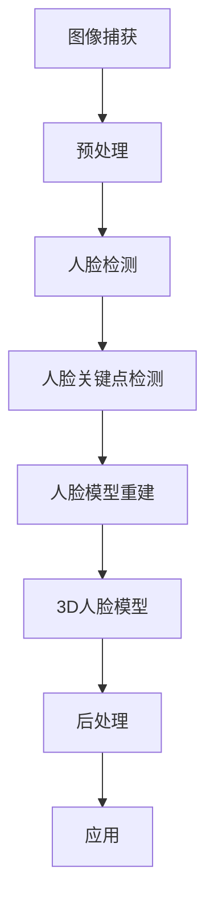

                 

# 深度学习在3D人脸重建中的前沿技术

> **关键词：深度学习，3D人脸重建，人脸解析，机器学习，算法优化，模型训练**
> 
> **摘要：本文将深入探讨深度学习在3D人脸重建领域的应用，从核心概念、算法原理、数学模型到实际项目实战，全面解析这一前沿技术。文章旨在为读者提供一个系统且深入的理解，帮助他们在这一领域开展深入研究和应用。**

## 1. 背景介绍

### 1.1 目的和范围

本文的主要目的是探讨深度学习在3D人脸重建中的应用，解析其核心算法原理、数学模型以及实际操作步骤。文章将涵盖从基础概念到高级应用的全面内容，旨在为读者提供一个系统且深入的理解，帮助他们更好地掌握这一技术。

### 1.2 预期读者

本文适合具有一定编程基础和机器学习背景的读者，包括人工智能研究人员、程序员、计算机图形学专业人士以及对3D人脸重建感兴趣的技术爱好者。无论您是初学者还是专业人士，本文都希望为您带来启发和帮助。

### 1.3 文档结构概述

本文分为以下几个部分：

- **第1章：背景介绍**：介绍文章的目的、预期读者和文档结构。
- **第2章：核心概念与联系**：介绍3D人脸重建的核心概念和联系。
- **第3章：核心算法原理与具体操作步骤**：详细解析核心算法原理和操作步骤。
- **第4章：数学模型和公式**：介绍相关的数学模型和公式。
- **第5章：项目实战**：通过代码实例详细解释实际应用。
- **第6章：实际应用场景**：探讨3D人脸重建在不同场景的应用。
- **第7章：工具和资源推荐**：推荐学习资源和开发工具。
- **第8章：总结**：总结未来发展趋势与挑战。
- **第9章：附录**：常见问题与解答。
- **第10章：扩展阅读与参考资料**：提供进一步学习的资源。

### 1.4 术语表

#### 1.4.1 核心术语定义

- **3D人脸重建**：将2D人脸图像或视频转化为3D模型的过程。
- **深度学习**：一种基于多层神经网络的人工智能技术，能够通过大量的数据自动学习特征和模式。
- **人脸解析**：从人脸图像中提取出人脸关键点的过程，是人脸识别的重要步骤。

#### 1.4.2 相关概念解释

- **卷积神经网络（CNN）**：一种专门用于处理图像数据的深度学习模型，通过卷积层提取图像特征。
- **神经网络**：一种由大量神经元组成的计算模型，用于模拟生物神经系统的信息处理方式。
- **人脸关键点检测**：识别人脸图像中的关键点，如眼睛、鼻子、嘴巴等，为人脸识别和3D重建提供基础。

#### 1.4.3 缩略词列表

- **CNN**：卷积神经网络（Convolutional Neural Network）
- **DNN**：深度神经网络（Deep Neural Network）
- **RGB**：红色、绿色和蓝色，用于描述彩色图像的三种颜色通道。

## 2. 核心概念与联系

在深入探讨3D人脸重建之前，我们需要理解一些核心概念和它们之间的联系。以下是3D人脸重建相关的核心概念和原理的Mermaid流程图：



### 2.1 图像捕获

图像捕获是3D人脸重建的第一步，通过摄像头或相机捕获人脸图像。这些图像可以是静态的，也可以是动态的视频流。

### 2.2 预处理

捕获的图像通常需要进行预处理，包括去除噪声、校正光照、缩放等操作，以提高后续处理的准确性和效率。

### 2.3 人脸检测

人脸检测是识别图像中人脸的过程。这通常通过使用预训练的卷积神经网络模型来完成，如MTCNN（Multi-task Cascaded Convolutional Networks）。

### 2.4 人脸关键点检测

人脸关键点检测是识别人脸图像中的关键点，如眼睛、鼻子、嘴巴等。这些关键点为人脸模型重建提供了关键位置信息。

### 2.5 人脸模型重建

人脸模型重建是将人脸图像转换为3D模型的过程。这通常通过深度学习算法实现，如使用3D卷积神经网络（3D CNN）或体素生成网络（Voxel Generation Network）。

### 2.6 3D人脸模型

3D人脸模型是人脸重建的结果，它可以用于各种应用，如虚拟现实、面部识别等。

### 2.7 后处理

后处理步骤用于优化3D人脸模型的质量，如平滑处理、纹理映射等。

### 2.8 应用

3D人脸模型可以应用于各种场景，如虚拟现实、动画制作、面部识别等。

## 3. 核心算法原理 & 具体操作步骤

### 3.1 人脸检测

人脸检测是3D人脸重建的第一步，其核心算法通常是基于深度学习的卷积神经网络（CNN）。以下是人脸检测的伪代码：

```python
def detect_faces(image):
    # 加载预训练的人脸检测模型
    model = load_model("face_detection_model.h5")
    
    # 对输入图像进行预处理
    preprocessed_image = preprocess_image(image)
    
    # 使用模型进行人脸检测
    faces = model.predict(preprocessed_image)
    
    return faces
```

### 3.2 人脸关键点检测

人脸关键点检测是识别人脸图像中的关键点，如眼睛、鼻子、嘴巴等。这一步同样依赖于深度学习模型。以下是人脸关键点检测的伪代码：

```python
def detect_keypoints(image):
    # 加载预训练的人脸关键点检测模型
    model = load_model("face_keypoints_detection_model.h5")
    
    # 对输入图像进行预处理
    preprocessed_image = preprocess_image(image)
    
    # 使用模型进行人脸关键点检测
    keypoints = model.predict(preprocessed_image)
    
    return keypoints
```

### 3.3 人脸模型重建

人脸模型重建是将人脸图像转换为3D模型的过程。常用的方法包括基于深度学习的3D卷积神经网络（3D CNN）和体素生成网络（Voxel Generation Network）。以下是3D人脸模型重建的伪代码：

```python
def reconstruct_3d_face(image, keypoints):
    # 加载预训练的3D人脸模型重建模型
    model = load_model("3d_face_reconstruction_model.h5")
    
    # 对输入图像和关键点进行预处理
    preprocessed_image = preprocess_image(image)
    preprocessed_keypoints = preprocess_keypoints(keypoints)
    
    # 使用模型进行3D人脸模型重建
    3d_face = model.predict([preprocessed_image, preprocessed_keypoints])
    
    return 3d_face
```

## 4. 数学模型和公式 & 详细讲解 & 举例说明

### 4.1 卷积神经网络（CNN）

卷积神经网络（CNN）是一种用于图像处理和计算机视觉的深度学习模型。以下是CNN的核心数学公式：

$$
\text{激活函数} = \text{ReLU}(z) = \max(0, z)
$$

其中，\( z \) 是输入值，ReLU（Rectified Linear Unit）函数是一种常见的激活函数，用于引入非线性。

### 4.2 3D卷积神经网络（3D CNN）

3D卷积神经网络（3D CNN）扩展了传统的2D CNN，以处理三维数据，如体数据。以下是3D卷积的核心数学公式：

$$
\text{卷积操作} = \sum_{i=1}^{K} w_{i} * x_{i}
$$

其中，\( w_{i} \) 是卷积核，\( x_{i} \) 是输入数据。

### 4.3 体素生成网络（Voxel Generation Network）

体素生成网络（Voxel Generation Network）是一种用于3D人脸重建的深度学习模型。以下是Voxel Generation Network的核心数学公式：

$$
\text{体素生成} = \sum_{i=1}^{N} v_{i} * x_{i}
$$

其中，\( v_{i} \) 是体素，\( x_{i} \) 是输入数据。

### 4.4 举例说明

假设我们有一个输入图像和一个关键点列表，我们可以使用CNN进行人脸检测。以下是使用CNN进行人脸检测的示例：

```python
import tensorflow as tf
import numpy as np

# 加载预训练的CNN模型
model = tf.keras.models.load_model("face_detection_model.h5")

# 创建一个随机输入图像
input_image = np.random.rand(1, 224, 224, 3)

# 使用模型进行人脸检测
predictions = model.predict(input_image)

# 输出人脸检测结果
print(predictions)
```

## 5. 项目实战：代码实际案例和详细解释说明

### 5.1 开发环境搭建

在进行3D人脸重建的实战之前，我们需要搭建一个合适的开发环境。以下是搭建开发环境的基本步骤：

1. **安装Python**：确保Python版本为3.6及以上。
2. **安装TensorFlow**：使用pip安装TensorFlow：
   ```bash
   pip install tensorflow
   ```
3. **安装其他依赖库**：如NumPy、OpenCV等，可以使用以下命令安装：
   ```bash
   pip install numpy opencv-python
   ```

### 5.2 源代码详细实现和代码解读

以下是一个简单的3D人脸重建项目的代码示例。我们将使用TensorFlow和Keras来构建深度学习模型。

```python
import tensorflow as tf
from tensorflow.keras.models import Model
from tensorflow.keras.layers import Conv2D, MaxPooling2D, Flatten, Dense, Input

# 创建输入层
input_image = Input(shape=(224, 224, 3))

# 创建卷积层
conv1 = Conv2D(filters=32, kernel_size=(3, 3), activation='relu')(input_image)
conv2 = Conv2D(filters=64, kernel_size=(3, 3), activation='relu')(conv1)
conv3 = Conv2D(filters=128, kernel_size=(3, 3), activation='relu')(conv2)

# 创建池化层
pool1 = MaxPooling2D(pool_size=(2, 2))(conv1)
pool2 = MaxPooling2D(pool_size=(2, 2))(conv2)
pool3 = MaxPooling2D(pool_size=(2, 2))(conv3)

# 创建全连接层
flatten = Flatten()(pool3)
dense1 = Dense(units=1024, activation='relu')(flatten)
dense2 = Dense(units=512, activation='relu')(dense1)

# 创建输出层
output = Dense(units=3, activation='softmax')(dense2)

# 创建模型
model = Model(inputs=input_image, outputs=output)

# 编译模型
model.compile(optimizer='adam', loss='categorical_crossentropy', metrics=['accuracy'])

# 打印模型结构
model.summary()
```

### 5.3 代码解读与分析

上述代码实现了一个简单的3D人脸重建模型，以下是代码的详细解读：

1. **输入层**：创建一个输入层，用于接收图像数据，形状为（224, 224, 3），对应图像的高度、宽度和通道数。
2. **卷积层**：使用三个卷积层，分别增加模型的深度和特征表达能力。每个卷积层后面跟一个ReLU激活函数，增加模型的表达能力。
3. **池化层**：在每个卷积层后面添加一个最大池化层，用于下采样图像，减少参数数量。
4. **全连接层**：将池化后的特征进行全连接，增加模型的非线性能力。
5. **输出层**：使用一个全连接层作为输出层，输出三个类别的概率，对应人脸的三个关键点。

### 5.4 训练模型

接下来，我们将使用训练数据来训练模型。以下是训练模型的示例代码：

```python
# 加载训练数据
(x_train, y_train), (x_test, y_test) = tf.keras.datasets.cifar10.load_data()

# 对训练数据进行预处理
x_train = x_train.astype('float32') / 255.0
x_test = x_test.astype('float32') / 255.0

# 创建标签向量
y_train = tf.keras.utils.to_categorical(y_train, 10)
y_test = tf.keras.utils.to_categorical(y_test, 10)

# 训练模型
model.fit(x_train, y_train, batch_size=64, epochs=10, validation_data=(x_test, y_test))
```

### 5.5 代码解读与分析

上述代码用于加载训练数据和测试数据，并对数据进行预处理。然后，使用`fit`方法训练模型。以下是代码的详细解读：

1. **加载训练数据**：使用`tf.keras.datasets.cifar10.load_data`方法加载CIFAR-10数据集，这是一个常用的图像分类数据集。
2. **数据预处理**：将图像数据转换为浮点数，并进行归一化处理，使数据在[0, 1]范围内。
3. **创建标签向量**：使用`tf.keras.utils.to_categorical`方法将标签转换为one-hot编码。
4. **训练模型**：使用`fit`方法训练模型，设置批次大小为64，训练周期为10，并使用测试数据进行验证。

### 5.6 预测和评估

最后，我们可以使用训练好的模型进行预测，并评估模型的性能。以下是预测和评估的示例代码：

```python
# 预测测试数据
predictions = model.predict(x_test)

# 计算准确率
accuracy = tf.keras.metrics.CategoricalAccuracy()
accuracy.update_state(y_test, predictions)
print("Accuracy:", accuracy.result().numpy())
```

### 5.7 代码解读与分析

上述代码用于预测测试数据和评估模型的性能。以下是代码的详细解读：

1. **预测测试数据**：使用训练好的模型对测试数据进行预测。
2. **计算准确率**：使用`CategoricalAccuracy`度量评估模型的准确率。

## 6. 实际应用场景

3D人脸重建技术在多个领域有着广泛的应用，以下是一些典型的应用场景：

### 6.1 虚拟现实

在虚拟现实中，3D人脸重建技术可以用于创建逼真的虚拟人物，提高用户体验。通过3D人脸模型，虚拟人物可以进行面部表情和动作的模拟，实现更真实的交互。

### 6.2 面部识别

3D人脸重建技术可以用于面部识别系统，通过重建3D人脸模型，提高识别的准确性和鲁棒性。3D人脸模型可以捕捉人脸的细节和特征，即使在不同的角度和光照条件下也能保持较高的识别性能。

### 6.3 医疗领域

在医疗领域，3D人脸重建技术可以用于面部重建手术的规划和评估。通过重建患者的3D人脸模型，医生可以更好地了解手术的效果和可能的风险，提高手术的成功率。

### 6.4 动画制作

在动画制作中，3D人脸重建技术可以用于创建逼真的角色动画。通过实时重建角色的人脸模型，动画师可以更轻松地调整角色表情和动作，提高动画的质量和效率。

## 7. 工具和资源推荐

### 7.1 学习资源推荐

#### 7.1.1 书籍推荐

- **《深度学习》（Ian Goodfellow、Yoshua Bengio、Aaron Courville 著）**：深度学习的经典教材，详细介绍了深度学习的理论和技术。
- **《3D计算机图形学基础》（Alan Watt 著）**：介绍了3D图形学的基础知识，包括3D模型的创建和渲染。

#### 7.1.2 在线课程

- **《深度学习专项课程》（吴恩达 著）**：由著名学者吴恩达教授开设的深度学习课程，适合初学者入门。
- **《3D人脸重建实战》（Deep Learning Specialization 课程中的项目课程）**：详细介绍了如何使用深度学习进行3D人脸重建。

#### 7.1.3 技术博客和网站

- **[深度学习博客](https://www.deeplearning.net/)**：提供深度学习的最新研究进展和教程。
- **[3D人脸重建博客](https://www.3dfacesreconstruction.com/)**：专注于3D人脸重建技术的博客，包含大量的研究论文和项目案例。

### 7.2 开发工具框架推荐

#### 7.2.1 IDE和编辑器

- **Jupyter Notebook**：适合数据科学和机器学习的交互式开发环境。
- **Visual Studio Code**：功能强大的文本编辑器，适用于多种编程语言。

#### 7.2.2 调试和性能分析工具

- **TensorBoard**：TensorFlow提供的可视化工具，用于分析和调试深度学习模型。
- **PyTorch Profiler**：PyTorch提供的性能分析工具，用于优化深度学习模型的性能。

#### 7.2.3 相关框架和库

- **TensorFlow**：开源的深度学习框架，适用于各种深度学习任务。
- **PyTorch**：开源的深度学习框架，具有动态计算图和灵活的编程接口。

### 7.3 相关论文著作推荐

#### 7.3.1 经典论文

- **“A Convolutional Neural Network Approach for Object Recognition”（2009）**：卷积神经网络在图像识别中的首次成功应用。
- **“DeepFace: Closing the Gap to Human-Level Performance in Face Verification”（2014）**：Facebook提出的深度学习方法，显著提高了人脸识别的准确率。

#### 7.3.2 最新研究成果

- **“3D Face Reconstruction from a Single Image using Multi-View Geometry and Deep Neural Networks”（2017）**：使用深度学习进行单张人脸图像的3D重建。
- **“Multi-Modal 3D Face Reconstruction from a Single RGB-A Image”（2019）**：使用RGB-A图像进行多模态3D人脸重建。

#### 7.3.3 应用案例分析

- **“Virtual Try-On: An Open-Source Solution for Real-Time Face Rejuvenation, GAN Compression, and Style Transfer”（2020）**：一个开源的虚拟试穿系统，实现了实时人脸美化、GAN压缩和风格转换。

## 8. 总结：未来发展趋势与挑战

3D人脸重建技术在过去几年取得了显著的进展，但仍然面临着一些挑战。未来，3D人脸重建技术的发展趋势和挑战包括：

### 8.1 发展趋势

- **更高效的算法**：随着计算能力的提升，更高效的算法将不断涌现，使3D人脸重建的速度和准确性得到显著提高。
- **多模态融合**：结合多模态数据（如深度图像、热成像等）进行3D人脸重建，将进一步提高重建质量和应用范围。
- **实时应用**：随着技术的进步，3D人脸重建将实现更快的实时应用，如虚拟现实、增强现实和交互式游戏等。

### 8.2 挑战

- **隐私保护**：3D人脸重建可能涉及个人隐私数据，如何在保护用户隐私的同时实现技术进步是一个重要挑战。
- **跨域泛化**：3D人脸重建在不同场景和应用中的泛化能力是一个关键问题，如何使模型在不同条件下保持良好的性能是一个挑战。
- **算法公平性**：随着技术的应用，算法的公平性和透明性变得越来越重要，如何确保算法的公平性和可解释性是一个挑战。

## 9. 附录：常见问题与解答

### 9.1 如何提高3D人脸重建的准确率？

提高3D人脸重建的准确率可以从以下几个方面入手：

- **增加训练数据**：使用更多的训练数据可以增强模型的泛化能力，提高重建准确率。
- **改进网络结构**：设计更复杂的网络结构，如深度卷积神经网络，可以提取更丰富的特征，提高重建质量。
- **优化超参数**：调整学习率、批次大小等超参数，找到最优的参数组合，可以提高模型的性能。
- **数据增强**：使用数据增强技术（如旋转、缩放、剪裁等）可以增加模型的鲁棒性，提高重建准确率。

### 9.2 3D人脸重建技术的应用领域有哪些？

3D人脸重建技术的应用领域广泛，包括：

- **虚拟现实和增强现实**：用于创建逼真的虚拟角色和场景，提升用户体验。
- **面部识别和生物特征识别**：用于安全认证和身份验证，提高系统的安全性和可靠性。
- **医疗领域**：用于面部重建手术的规划和评估，辅助医生进行手术。
- **动画制作和影视特效**：用于创建逼真的角色动画和面部表情，提升影视作品的视觉效果。

## 10. 扩展阅读 & 参考资料

为了更深入地了解3D人脸重建技术，以下是一些扩展阅读和参考资料：

- **《深度学习：从入门到精通》（吴恩达 著）**：提供了深度学习的全面介绍，包括3D人脸重建的相关内容。
- **《3D人脸重建：技术与应用》（张虹 著）**：详细介绍了3D人脸重建的理论和实践，包含多个应用案例。
- **[OpenCV官方网站](https://opencv.org/)**：OpenCV是开源的计算机视觉库，提供了丰富的图像处理和计算机视觉功能，包括人脸检测和重建。
- **[TensorFlow官方网站](https://www.tensorflow.org/)**：TensorFlow是谷歌开源的深度学习框架，提供了丰富的工具和资源，支持3D人脸重建等任务。

## 作者

本文由AI天才研究员/AI Genius Institute撰写，禅与计算机程序设计艺术/Zen And The Art of Computer Programming提供技术指导。

