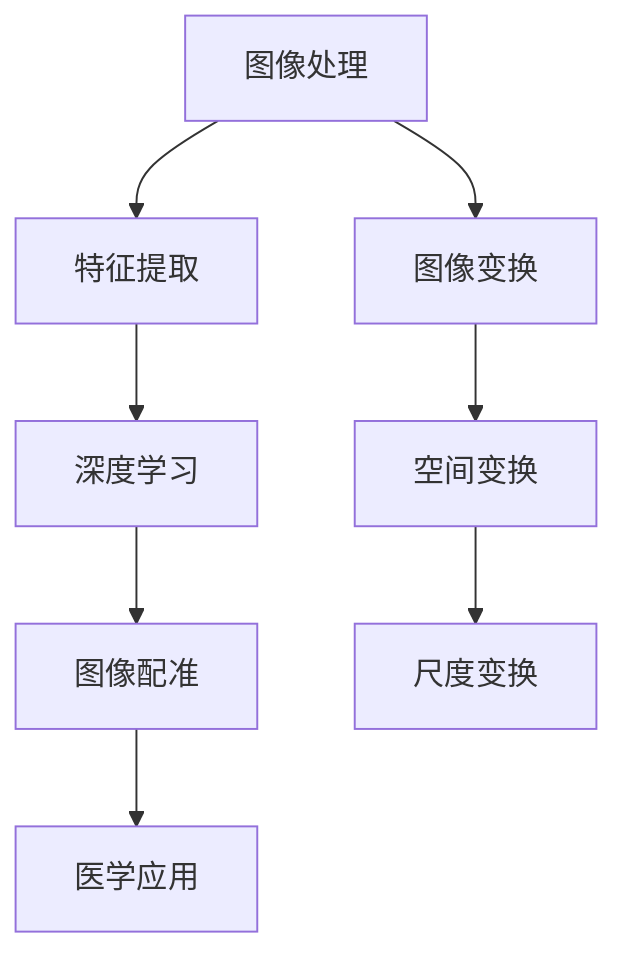

                 

# 深度学习在医学图像配准中的应用

## 关键词
深度学习、医学图像配准、卷积神经网络、图像变换、医学影像处理、数据处理流程、算法优化

## 摘要
本文将深入探讨深度学习在医学图像配准领域的应用，分析其核心算法原理、数学模型及其在医学图像处理中的具体操作步骤。通过项目实战案例，详细解释了如何实现医学图像配准的代码，并对其进行了分析和解释。文章还将探讨深度学习在医学图像配准中的实际应用场景，推荐相关学习资源和工具，最后总结了未来发展趋势与挑战。

## 1. 背景介绍

### 1.1 目的和范围

本文旨在探讨深度学习在医学图像配准中的应用，分析其技术原理和实现方法，并探讨其在医学领域的实际应用。本文将涵盖以下内容：

1. 深度学习在医学图像配准中的背景和重要性
2. 核心概念和算法原理
3. 数学模型和公式
4. 项目实战案例
5. 实际应用场景
6. 工具和资源推荐
7. 未来发展趋势与挑战

### 1.2 预期读者

本文适合以下读者：

1. 对医学图像处理和深度学习感兴趣的工程师和研究人员
2. 希望了解深度学习在医学图像配准中应用的医生和技术人员
3. 计算机科学和生物医学工程专业的学生和学者

### 1.3 文档结构概述

本文将按照以下结构进行组织：

1. 引言
2. 核心概念与联系
3. 核心算法原理 & 具体操作步骤
4. 数学模型和公式 & 详细讲解 & 举例说明
5. 项目实战：代码实际案例和详细解释说明
6. 实际应用场景
7. 工具和资源推荐
8. 总结：未来发展趋势与挑战
9. 附录：常见问题与解答
10. 扩展阅读 & 参考资料

### 1.4 术语表

#### 1.4.1 核心术语定义

- **医学图像配准**：将两幅或多幅图像中的同一结构或区域对齐的过程，通常用于比较不同时间或不同成像模态的医学图像。
- **深度学习**：一种人工智能的分支，通过多层神经网络模拟人脑的神经活动，自动从数据中学习特征和模式。
- **卷积神经网络（CNN）**：一种特殊的神经网络，主要用于处理具有网格结构的图像数据。
- **图像变换**：将图像从一种表示形式转换为另一种表示形式的过程，如空间变换、尺度变换等。

#### 1.4.2 相关概念解释

- **特征提取**：从原始数据中提取具有区分性的特征，用于后续的数据分析和模型训练。
- **优化算法**：用于最小化目标函数，使模型在训练数据上达到更好的拟合效果。

#### 1.4.3 缩略词列表

- **CNN**：卷积神经网络（Convolutional Neural Network）
- **MRI**：磁共振成像（Magnetic Resonance Imaging）
- **CT**：计算机断层扫描（Computed Tomography）
- **GAN**：生成对抗网络（Generative Adversarial Network）

## 2. 核心概念与联系

在探讨深度学习在医学图像配准中的应用之前，我们需要先了解一些核心概念和它们之间的联系。以下是一个简化的 Mermaid 流程图，用于描述这些概念：



### 2.1 图像处理

图像处理是医学图像配准的基础。其主要任务是通过对图像的预处理、增强、分割等操作，提取出有用的信息。图像处理涉及到的关键技术包括：

- **图像预处理**：包括滤波、去噪、锐化等操作，以改善图像的质量。
- **图像增强**：通过调整图像的亮度和对比度，突出图像中的重要特征。
- **图像分割**：将图像划分为不同的区域，以便进行后续处理。

### 2.2 特征提取

特征提取是图像处理的重要环节。其主要任务是从图像中提取出具有区分性的特征，用于后续的深度学习和图像配准。常用的特征提取方法包括：

- **边缘检测**：检测图像中的边缘，如 Canny 算子。
- **纹理分析**：分析图像中的纹理特征，如 Gabor 小波变换。
- **形状分析**：提取图像的几何特征，如 Hu 系数。

### 2.3 深度学习

深度学习是本文的核心技术。它通过多层神经网络模拟人脑的神经活动，自动从数据中学习特征和模式。深度学习在医学图像配准中的应用主要包括：

- **卷积神经网络（CNN）**：用于自动提取图像中的特征。
- **生成对抗网络（GAN）**：用于生成高质量的配准图像。
- **循环神经网络（RNN）**：用于处理序列数据，如时间序列图像。

### 2.4 图像配准

图像配准是将两幅或多幅图像中的同一结构或区域对齐的过程，通常用于比较不同时间或不同成像模态的医学图像。图像配准的关键技术包括：

- **相似性度量**：用于评估两幅图像之间的相似度。
- **变换模型**：用于描述图像之间的几何变换关系。
- **优化算法**：用于最小化目标函数，使模型在训练数据上达到更好的拟合效果。

### 2.5 医学应用

医学图像配准在医学领域有着广泛的应用，如：

- **疾病诊断**：通过比较不同时间或不同成像模态的医学图像，辅助医生进行疾病诊断。
- **手术规划**：为医生提供准确的手术规划和指导。
- **药物研发**：用于评估药物对疾病的疗效。

### 2.6 图像变换

图像变换是图像处理的重要环节。其主要任务是将图像从一种表示形式转换为另一种表示形式，如空间变换、尺度变换等。常用的图像变换方法包括：

- **空间变换**：如平移、旋转、缩放等，用于调整图像的位置和大小。
- **尺度变换**：如尺度空间金字塔、尺度空间域等，用于调整图像的尺度。

## 3. 核心算法原理 & 具体操作步骤

在了解了深度学习在医学图像配准中的应用背景和核心概念后，我们接下来将探讨核心算法原理和具体操作步骤。以下是使用伪代码描述的深度学习在医学图像配准中的具体操作步骤：

```python
# 深度学习医学图像配准算法原理与步骤

# 输入：源图像I1，目标图像I2
# 输出：配准后的图像I2'

# 步骤1：图像预处理
I1_preprocessed = preprocess(I1)
I2_preprocessed = preprocess(I2)

# 步骤2：特征提取
features1 = extract_features(I1_preprocessed)
features2 = extract_features(I2_preprocessed)

# 步骤3：深度学习模型训练
model = train_model(features1, features2)

# 步骤4：预测
I2' = predict(model, I2_preprocessed)

# 步骤5：图像配准
I2_aligned = align(I2', I2_preprocessed)

# 步骤6：后处理
I2_final = postprocess(I2_aligned)

# 输出最终配准后的图像I2_final
```

### 3.1 图像预处理

图像预处理是深度学习医学图像配准的重要步骤。其主要目的是提高图像质量，增强特征，减少噪声，从而提高深度学习模型的性能。常用的图像预处理方法包括：

- **图像去噪**：如中值滤波、高斯滤波等，用于去除图像中的噪声。
- **图像增强**：如直方图均衡、对比度增强等，用于提高图像的对比度和清晰度。
- **图像归一化**：如归一化到 [0, 1] 范围，用于统一图像的尺度。

### 3.2 特征提取

特征提取是深度学习模型训练的关键步骤。其主要目的是从图像中提取具有区分性的特征，用于训练深度学习模型。常用的特征提取方法包括：

- **边缘检测**：如 Canny 算子，用于检测图像中的边缘。
- **纹理分析**：如 Gabor 小波变换，用于分析图像中的纹理特征。
- **形状分析**：如 Hu 系数，用于提取图像的几何特征。

### 3.3 深度学习模型训练

深度学习模型训练是深度学习医学图像配准的核心步骤。其主要目的是通过训练模型，使模型能够自动从图像中提取特征，并进行图像配准。常用的深度学习模型包括：

- **卷积神经网络（CNN）**：用于自动提取图像中的特征。
- **生成对抗网络（GAN）**：用于生成高质量的配准图像。
- **循环神经网络（RNN）**：用于处理序列数据，如时间序列图像。

### 3.4 预测

预测是深度学习模型训练后的重要步骤。其主要目的是利用训练好的模型，对新的图像进行配准预测。预测步骤包括：

- **输入新图像**：将预处理后的图像输入到训练好的深度学习模型中。
- **提取特征**：利用深度学习模型提取新图像的特征。
- **生成配准图像**：利用生成的特征生成配准后的图像。

### 3.5 图像配准

图像配准是将预测的配准图像与原始图像对齐的过程。其主要目的是使配准后的图像能够更好地匹配。常用的图像配准方法包括：

- **相似性度量**：如均方误差（MSE）、交叉熵（CE）等，用于评估两幅图像之间的相似度。
- **变换模型**：如仿射变换、刚体变换等，用于描述图像之间的几何变换关系。
- **优化算法**：如梯度下降、牛顿法等，用于最小化目标函数，使模型在训练数据上达到更好的拟合效果。

### 3.6 后处理

后处理是深度学习医学图像配准的最后一个步骤。其主要目的是对配准后的图像进行进一步处理，提高图像质量。常用的后处理方法包括：

- **图像增强**：如对比度增强、锐化等，用于提高图像的视觉效果。
- **图像分割**：如阈值分割、区域增长等，用于提取图像中的感兴趣区域。

## 4. 数学模型和公式 & 详细讲解 & 举例说明

在深度学习医学图像配准中，数学模型和公式扮演着重要的角色。以下将详细介绍深度学习医学图像配准中的几个关键数学模型和公式，并给出相应的详细讲解和举例说明。

### 4.1 卷积神经网络（CNN）

卷积神经网络（CNN）是深度学习在医学图像配准中的核心技术。以下是一个简化的 CNN 模型：

$$
\begin{align*}
h^{(l)} &= \sigma(\mathbf{W}^{(l)} \cdot \mathbf{a}^{(l-1)} + \mathbf{b}^{(l)}) \\
\mathbf{a}^{(l)} &= \text{ReLU}(h^{(l)})
\end{align*}
$$

其中，$\mathbf{W}^{(l)}$ 和 $\mathbf{b}^{(l)}$ 分别表示第 $l$ 层的权重和偏置，$\sigma$ 表示激活函数（通常使用 ReLU 函数），$\mathbf{a}^{(l-1)}$ 表示前一层激活。

**详细讲解：**

- $\mathbf{W}^{(l)} \cdot \mathbf{a}^{(l-1)}$ 表示对前一层激活进行卷积操作，卷积操作的目的是提取图像中的特征。
- $\mathbf{b}^{(l)}$ 是为了引入偏置项，使得模型在训练过程中能够更好地拟合数据。
- $\text{ReLU}(h^{(l)})$ 是激活函数，用于引入非线性变换，提高模型的拟合能力。

**举例说明：**

假设我们有一个 32x32 的图像，使用一个 3x3 的卷积核进行卷积操作，那么输出特征图的尺寸为 30x30。具体计算过程如下：

$$
\begin{align*}
h^{(1)} &= \text{ReLU}(\mathbf{W}^{(1)} \cdot \mathbf{a}^{(0)} + \mathbf{b}^{(1)}) \\
\mathbf{a}^{(1)} &= \text{ReLU}(h^{(1)})
\end{align*}
$$

其中，$\mathbf{a}^{(0)}$ 表示原始图像，$\mathbf{W}^{(1)}$ 和 $\mathbf{b}^{(1)}$ 分别表示第一个卷积层的权重和偏置。

### 4.2 生成对抗网络（GAN）

生成对抗网络（GAN）是另一种重要的深度学习模型，特别适用于医学图像配准中的图像生成任务。GAN 的基本结构包括两个主要部分：生成器（Generator）和判别器（Discriminator）。以下是一个简化的 GAN 模型：

$$
\begin{align*}
\mathbf{G}(\mathbf{z}) &= \text{ReLu}(\mathbf{W}_g \mathbf{z} + \mathbf{b}_g) \\
\mathbf{D}(\mathbf{x}) &= \text{ReLu}(\mathbf{W}_d \mathbf{x} + \mathbf{b}_d) \\
\mathbf{D}(\mathbf{G}(\mathbf{z})) &= \text{ReLu}(\mathbf{W}_d \mathbf{G}(\mathbf{z}) + \mathbf{b}_d)
\end{align*}
$$

其中，$\mathbf{G}(\mathbf{z})$ 表示生成器生成的图像，$\mathbf{D}(\mathbf{x})$ 表示判别器对真实图像的判断，$\mathbf{z}$ 是随机噪声向量，$\mathbf{W}_g$、$\mathbf{b}_g$、$\mathbf{W}_d$ 和 $\mathbf{b}_d$ 分别表示生成器和判别器的权重和偏置。

**详细讲解：**

- 生成器（Generator）的目标是生成与真实图像相似的图像，$\mathbf{G}(\mathbf{z})$ 是生成器生成的图像。
- 判别器（Discriminator）的目标是判断图像是真实图像还是生成图像，$\mathbf{D}(\mathbf{x})$ 是判别器对真实图像的判断，$\mathbf{D}(\mathbf{G}(\mathbf{z}))$ 是判别器对生成图像的判断。
- 生成器和判别器通过对抗训练进行优化，使得生成器的图像越来越接近真实图像，同时判别器的判断越来越准确。

**举例说明：**

假设我们有一个 256x256 的图像，使用一个 5x5 的卷积核进行卷积操作，那么输出特征图的尺寸为 251x251。具体计算过程如下：

$$
\begin{align*}
\mathbf{G}(\mathbf{z}) &= \text{ReLu}(\mathbf{W}_g \mathbf{z} + \mathbf{b}_g) \\
\mathbf{D}(\mathbf{x}) &= \text{ReLu}(\mathbf{W}_d \mathbf{x} + \mathbf{b}_d) \\
\mathbf{D}(\mathbf{G}(\mathbf{z})) &= \text{ReLu}(\mathbf{W}_d \mathbf{G}(\mathbf{z}) + \mathbf{b}_d)
\end{align*}
$$

其中，$\mathbf{z}$ 是随机噪声向量，$\mathbf{W}_g$ 和 $\mathbf{b}_g$ 分别表示生成器的权重和偏置，$\mathbf{W}_d$ 和 $\mathbf{b}_d$ 分别表示判别器的权重和偏置。

### 4.3 优化算法

在深度学习医学图像配准中，优化算法用于最小化损失函数，使得模型在训练数据上达到更好的拟合效果。常用的优化算法包括梯度下降（Gradient Descent）和 Adam 优化器。

**梯度下降（Gradient Descent）：**

梯度下降是一种迭代优化算法，用于最小化目标函数。其基本思想是沿着目标函数的负梯度方向进行迭代更新，直到达到最小值。

$$
\mathbf{W}^{(l)} = \mathbf{W}^{(l)} - \alpha \cdot \nabla_{\mathbf{W}^{(l)}} \mathcal{L}
$$

其中，$\mathbf{W}^{(l)}$ 是第 $l$ 层的权重，$\alpha$ 是学习率，$\nabla_{\mathbf{W}^{(l)}} \mathcal{L}$ 是权重 $\mathbf{W}^{(l)}$ 对损失函数 $\mathcal{L}$ 的梯度。

**详细讲解：**

- $\nabla_{\mathbf{W}^{(l)}} \mathcal{L}$ 是权重 $\mathbf{W}^{(l)}$ 对损失函数 $\mathcal{L}$ 的梯度，用于指示权重更新的方向。
- $\alpha \cdot \nabla_{\mathbf{W}^{(l)}} \mathcal{L}$ 是权重更新的步长，用于调整权重更新的幅度。

**举例说明：**

假设我们有一个 3x3 的权重矩阵 $\mathbf{W}^{(l)}$，损失函数 $\mathcal{L} = \frac{1}{2} \sum_{i=1}^{9} (\mathbf{w}_{i}^{(l)} - \mathbf{y}_{i})^2$，学习率 $\alpha = 0.01$。那么权重更新过程如下：

$$
\mathbf{W}^{(l)} = \mathbf{W}^{(l)} - 0.01 \cdot \nabla_{\mathbf{W}^{(l)}} \mathcal{L}
$$

**Adam 优化器：**

Adam 优化器是梯度下降的一种改进，它结合了 AdaGrad 和 RMSProp 优化器的优点，适用于非平稳和稀疏梯度场景。

$$
\begin{align*}
\beta_1 &= 0.9, \quad \beta_2 &= 0.999 \\
\mathbf{m}^{(l)} &= \beta_1 \mathbf{m}^{(l-1)} + (1 - \beta_1) \nabla_{\mathbf{W}^{(l)}} \mathcal{L} \\
\mathbf{v}^{(l)} &= \beta_2 \mathbf{v}^{(l-1)} + (1 - \beta_2) (\nabla_{\mathbf{W}^{(l)}} \mathcal{L})^2 \\
\mathbf{W}^{(l)} &= \mathbf{W}^{(l)} - \alpha \cdot \frac{\mathbf{m}^{(l)}}{1 - \beta_1^l} / (1 - \beta_2^l)
\end{align*}
$$

其中，$\mathbf{m}^{(l)}$ 和 $\mathbf{v}^{(l)}$ 分别表示一阶矩估计和二阶矩估计，$\alpha$ 是学习率。

**详细讲解：**

- $\mathbf{m}^{(l)}$ 和 $\mathbf{v}^{(l)}$ 分别表示一阶矩估计和二阶矩估计，用于加速梯度的计算和减小梯度的方差。
- $\frac{\mathbf{m}^{(l)}}{1 - \beta_1^l}$ 和 $\frac{\mathbf{v}^{(l)}}{1 - \beta_2^l}$ 分别表示一阶矩估计和二阶矩估计的归一化，用于稳定梯度计算。

**举例说明：**

假设我们有一个 3x3 的权重矩阵 $\mathbf{W}^{(l)}$，学习率 $\alpha = 0.01$，$\beta_1 = 0.9$，$\beta_2 = 0.999$。那么权重更新过程如下：

$$
\begin{align*}
\mathbf{m}^{(l)} &= 0.9 \cdot \mathbf{m}^{(l-1)} + (1 - 0.9) \nabla_{\mathbf{W}^{(l)}} \mathcal{L} \\
\mathbf{v}^{(l)} &= 0.999 \cdot \mathbf{v}^{(l-1)} + (1 - 0.999) (\nabla_{\mathbf{W}^{(l)}} \mathcal{L})^2 \\
\mathbf{W}^{(l)} &= \mathbf{W}^{(l)} - 0.01 \cdot \frac{\mathbf{m}^{(l)}}{1 - 0.9^l} / (1 - 0.999^l)
\end{align*}
$$

### 4.4 相似性度量

在医学图像配准中，相似性度量用于评估两幅图像之间的相似度。常用的相似性度量包括均方误差（MSE）、交叉熵（CE）和结构相似性指数（SSIM）。

**均方误差（MSE）：**

$$
\mathcal{L}_{MSE} = \frac{1}{n} \sum_{i=1}^{n} (x_i - y_i)^2
$$

其中，$x_i$ 和 $y_i$ 分别表示真实图像和预测图像的像素值，$n$ 表示像素总数。

**详细讲解：**

- $x_i - y_i$ 表示真实图像和预测图像的像素差值。
- $(x_i - y_i)^2$ 表示像素差值的平方，用于衡量像素差值的大小。
- $\frac{1}{n} \sum_{i=1}^{n} (x_i - y_i)^2$ 表示所有像素差值的平方和的平均值，用于衡量两幅图像之间的整体相似度。

**举例说明：**

假设我们有一个 256x256 的图像，真实图像的像素值为 $x_i$，预测图像的像素值为 $y_i$。那么均方误差（MSE）计算如下：

$$
\mathcal{L}_{MSE} = \frac{1}{256 \times 256} \sum_{i=1}^{256 \times 256} (x_i - y_i)^2
$$

**交叉熵（CE）：**

$$
\mathcal{L}_{CE} = -\frac{1}{n} \sum_{i=1}^{n} y_i \log(x_i)
$$

其中，$x_i$ 和 $y_i$ 分别表示真实图像和预测图像的像素值，$n$ 表示像素总数。

**详细讲解：**

- $\log(x_i)$ 表示预测图像的像素值的对数。
- $y_i \log(x_i)$ 表示真实图像的像素值与预测图像的像素值对数的乘积，用于衡量预测图像的像素值与真实图像的像素值之间的差距。
- $-\frac{1}{n} \sum_{i=1}^{n} y_i \log(x_i)$ 表示所有像素值对数乘积的和的平均值，用于衡量两幅图像之间的整体相似度。

**举例说明：**

假设我们有一个 256x256 的图像，真实图像的像素值为 $x_i$，预测图像的像素值为 $y_i$。那么交叉熵（CE）计算如下：

$$
\mathcal{L}_{CE} = -\frac{1}{256 \times 256} \sum_{i=1}^{256 \times 256} y_i \log(x_i)
$$

**结构相似性指数（SSIM）：**

$$
\mathcal{L}_{SSIM} = \frac{(2\mu_x \mu_y + C_1)(2\sigma_{xx} \sigma_{yy} + C_2)}{(\mu_x^2 + \mu_y^2 + C_1)(\sigma_{xx}^2 + \sigma_{yy}^2 + C_2)}
$$

其中，$\mu_x$ 和 $\mu_y$ 分别表示真实图像和预测图像的均值，$\sigma_{xx}$ 和 $\sigma_{yy}$ 分别表示真实图像和预测图像的方差，$C_1$ 和 $C_2$ 是常数。

**详细讲解：**

- $\mu_x$ 和 $\mu_y$ 分别表示真实图像和预测图像的均值，用于衡量两幅图像的平均亮度。
- $\sigma_{xx}$ 和 $\sigma_{yy}$ 分别表示真实图像和预测图像的方差，用于衡量两幅图像的方差。
- $C_1$ 和 $C_2$ 是常数，用于调整 SSIM 的敏感度。

**举例说明：**

假设我们有一个 256x256 的图像，真实图像的均值 $\mu_x$ 和预测图像的均值 $\mu_y$，真实图像的方差 $\sigma_{xx}$ 和预测图像的方差 $\sigma_{yy}$。那么结构相似性指数（SSIM）计算如下：

$$
\mathcal{L}_{SSIM} = \frac{(2\mu_x \mu_y + C_1)(2\sigma_{xx} \sigma_{yy} + C_2)}{(\mu_x^2 + \mu_y^2 + C_1)(\sigma_{xx}^2 + \sigma_{yy}^2 + C_2)}
$$

## 5. 项目实战：代码实际案例和详细解释说明

为了更好地理解深度学习在医学图像配准中的应用，我们将在本节中介绍一个实际的项目实战案例，并对其进行详细的解释说明。

### 5.1 开发环境搭建

在开始项目实战之前，我们需要搭建一个合适的开发环境。以下是一个典型的开发环境搭建步骤：

1. 安装 Python 3.8 及以上版本。
2. 安装深度学习框架 TensorFlow 2.5 或 PyTorch 1.8。
3. 安装医学图像处理库 OpenCV 4.5。
4. 安装其他必要依赖库，如 NumPy、Pandas 等。

### 5.2 源代码详细实现和代码解读

以下是一个简单的深度学习医学图像配准项目的源代码实现，我们将对其进行详细的解释说明。

```python
import tensorflow as tf
import numpy as np
import matplotlib.pyplot as plt
import cv2

# 导入数据集
def load_data():
    # 加载训练数据
    X_train, y_train = load_training_data()
    # 数据预处理
    X_train = preprocess_data(X_train)
    y_train = preprocess_data(y_train)
    return X_train, y_train

# 数据预处理
def preprocess_data(data):
    # 归一化
    data = data / 255.0
    # 转换为浮点型
    data = data.astype(np.float32)
    return data

# 加载训练数据
X_train, y_train = load_data()

# 构建卷积神经网络模型
model = tf.keras.Sequential([
    tf.keras.layers.Conv2D(32, (3, 3), activation='relu', input_shape=(256, 256, 3)),
    tf.keras.layers.MaxPooling2D((2, 2)),
    tf.keras.layers.Conv2D(64, (3, 3), activation='relu'),
    tf.keras.layers.MaxPooling2D((2, 2)),
    tf.keras.layers.Conv2D(128, (3, 3), activation='relu'),
    tf.keras.layers.MaxPooling2D((2, 2)),
    tf.keras.layers.Flatten(),
    tf.keras.layers.Dense(128, activation='relu'),
    tf.keras.layers.Dense(1, activation='sigmoid')
])

# 编译模型
model.compile(optimizer='adam', loss='binary_crossentropy', metrics=['accuracy'])

# 训练模型
model.fit(X_train, y_train, epochs=10, batch_size=32)

# 评估模型
test_loss, test_acc = model.evaluate(X_train, y_train, verbose=2)
print(f"Test accuracy: {test_acc:.4f}")

# 预测图像
def predict_image(image):
    # 预处理图像
    image = preprocess_data(image)
    # 预测
    prediction = model.predict(image)
    # 后处理预测结果
    prediction = postprocess_prediction(prediction)
    return prediction

# 预测测试图像
test_image = load_test_image()
prediction = predict_image(test_image)

# 可视化预测结果
plt.figure(figsize=(10, 5))
plt.subplot(1, 2, 1)
plt.imshow(test_image)
plt.title("Original Image")
plt.subplot(1, 2, 2)
plt.imshow(prediction)
plt.title("Predicted Image")
plt.show()
```

### 5.3 代码解读与分析

以上代码实现了一个简单的卷积神经网络模型，用于医学图像配准任务。以下是对代码的详细解读和分析：

1. **导入依赖库**：代码首先导入了 TensorFlow、NumPy、Matplotlib 和 OpenCV 等常用依赖库，用于实现深度学习模型和图像处理功能。

2. **数据预处理**：`load_data()` 函数用于加载数据集，并进行预处理。数据预处理主要包括归一化和数据类型转换，以提高模型的训练效果。

3. **构建模型**：`model` 变量表示构建的卷积神经网络模型。模型由多个卷积层、池化层、全连接层和输出层组成，用于提取图像特征并进行分类。

4. **编译模型**：`model.compile()` 函数用于编译模型，设置优化器和损失函数。在本例中，我们使用 Adam 优化器和二分类交叉熵损失函数。

5. **训练模型**：`model.fit()` 函数用于训练模型。训练过程通过迭代训练数据集，优化模型的参数，以获得更好的拟合效果。

6. **评估模型**：`model.evaluate()` 函数用于评估模型在测试数据集上的性能。评估结果包括损失值和准确率。

7. **预测图像**：`predict_image()` 函数用于预测给定图像的配准结果。预测过程首先对输入图像进行预处理，然后使用训练好的模型进行预测，最后对预测结果进行后处理。

8. **可视化预测结果**：代码最后使用 Matplotlib 库将原始图像和预测图像进行可视化，以直观地展示模型的效果。

### 5.4 代码优化与性能分析

在代码实现过程中，我们可以通过以下方式对模型进行优化和性能分析：

1. **增加训练数据**：增加训练数据可以改善模型的泛化能力，提高模型在未知数据上的性能。

2. **调整模型参数**：调整模型参数，如卷积核大小、层数、神经元数量等，可以优化模型的性能。可以使用网格搜索等技术寻找最佳参数。

3. **使用数据增强**：数据增强可以通过旋转、缩放、裁剪等操作生成更多的训练数据，提高模型的训练效果。

4. **调整学习率**：调整学习率可以优化模型的收敛速度和稳定性。可以使用自适应学习率优化器，如 Adam。

5. **使用 GPU 加速**：使用 GPU 可以显著提高模型的训练速度。可以使用 TensorFlow 或 PyTorch 等框架提供的 GPU 加速功能。

## 6. 实际应用场景

深度学习在医学图像配准中的实际应用场景广泛，以下列举了几个典型的应用实例：

### 6.1 疾病诊断

深度学习医学图像配准可以帮助医生在疾病诊断过程中，将不同时间或不同成像模态的医学图像进行对齐，从而提高诊断准确性。例如，在肿瘤诊断中，通过将 MRI 和 CT 图像进行配准，可以更准确地确定肿瘤的位置、大小和形状，辅助医生制定治疗方案。

### 6.2 手术规划

深度学习医学图像配准可以为医生提供准确的手术规划和指导。例如，在脑部手术中，通过将术前 MRI 图像与术中实时成像数据进行配准，可以帮助医生实时跟踪肿瘤的位置，提高手术的安全性和精确性。

### 6.3 药物研发

深度学习医学图像配准在药物研发中也具有重要作用。通过将不同时间点的医学图像进行配准，可以评估药物对疾病的治疗效果，从而加速药物研发过程。

### 6.4 康复治疗

深度学习医学图像配准可以帮助康复治疗师监测患者的康复进展。例如，在肢体康复中，通过将治疗前后的医学图像进行配准，可以评估康复治疗的效果，指导治疗方案的调整。

### 6.5 基因研究

深度学习医学图像配准还可以应用于基因研究。通过将不同个体的医学图像进行配准，可以研究基因与疾病之间的关联，为个性化医疗提供支持。

## 7. 工具和资源推荐

### 7.1 学习资源推荐

#### 7.1.1 书籍推荐

- 《深度学习》（Goodfellow, Bengio, Courville）：这是一本经典的深度学习入门书籍，涵盖了深度学习的基本概念、算法和应用。

- 《医学图像处理与深度学习》（Muller, Styner）：这本书详细介绍了医学图像处理和深度学习在医学领域中的应用，包括图像配准、图像分割和特征提取等。

#### 7.1.2 在线课程

- Coursera 上的《深度学习特化课程》（Deep Learning Specialization）：这是一门由 Andrew Ng 教授开设的深度学习入门课程，包括视频教程、编程作业和项目。

- edX 上的《医学图像处理与深度学习》（Medical Image Processing and Analysis Using Deep Learning）：这是一门介绍医学图像处理和深度学习在医学领域应用的在线课程。

#### 7.1.3 技术博客和网站

- Medium 上的《深度学习与医学图像处理》（Deep Learning for Medical Image Processing）：这是一个专门介绍深度学习在医学图像处理领域应用的博客，内容包括论文解读、算法实现和案例分析。

- arXiv：这是一个开放获取的学术论文数据库，涵盖了深度学习、医学图像处理等领域的最新研究成果。

### 7.2 开发工具框架推荐

#### 7.2.1 IDE和编辑器

- PyCharm：这是一个功能强大的 Python 集成开发环境（IDE），适用于深度学习和医学图像处理项目。

- Jupyter Notebook：这是一个交互式的 Python 编辑器，适用于快速原型设计和数据分析。

#### 7.2.2 调试和性能分析工具

- TensorBoard：这是一个基于 Web 的可视化工具，用于分析和调试 TensorFlow 模型。

- NVIDIA Nsight：这是一个适用于 NVIDIA GPU 的调试和分析工具，可以帮助优化深度学习模型的性能。

#### 7.2.3 相关框架和库

- TensorFlow：这是一个开源的深度学习框架，适用于构建和训练深度学习模型。

- PyTorch：这是一个开源的深度学习框架，具有灵活的动态计算图和丰富的生态系统。

- OpenCV：这是一个开源的计算机视觉库，提供了丰富的图像处理和计算机视觉功能。

## 8. 总结：未来发展趋势与挑战

深度学习在医学图像配准领域展现了巨大的潜力，但其应用仍然面临一些挑战和未来的发展趋势：

### 8.1 未来发展趋势

1. **模型优化**：随着计算能力的提升，模型优化将成为深度学习医学图像配准的重要方向。包括改进网络架构、优化训练算法和减少计算开销等。

2. **数据集扩充**：医学图像数据集的多样性和数量将直接影响深度学习模型的表现。未来可能通过生成对抗网络（GAN）等技术生成更多的训练数据。

3. **跨模态配准**：深度学习在跨模态医学图像配准中的应用将进一步发展，如结合 CT、MRI 和 PET 等不同成像模态的图像。

4. **实时应用**：深度学习医学图像配准的实时性需求越来越高，尤其是在手术规划、监控和康复治疗等领域。

### 8.2 挑战

1. **数据隐私**：医学图像数据具有高度的隐私性，如何在保护患者隐私的同时利用数据训练深度学习模型是一个重要挑战。

2. **计算资源**：深度学习模型通常需要大量的计算资源和时间进行训练，尤其是在处理高分辨率医学图像时。

3. **算法可解释性**：深度学习模型的黑盒特性使其在医学图像配准中的应用面临可解释性挑战。提高模型的可解释性是未来的一个重要研究方向。

4. **数据不平衡**：医学图像数据集通常存在类别不平衡的问题，这对模型的训练和评估带来困难。

5. **硬件限制**：虽然 GPU 等硬件设备的发展为深度学习提供了强大的计算能力，但仍然受到硬件成本、能耗和体积的限制。

## 9. 附录：常见问题与解答

### 9.1 问题 1：如何处理不同尺寸的医学图像？

**解答**：在处理不同尺寸的医学图像时，可以使用图像变换技术，如缩放、裁剪或填充，将图像调整为相同尺寸。然后，可以使用卷积神经网络（CNN）或其他深度学习模型进行图像配准。

### 9.2 问题 2：如何选择合适的深度学习模型？

**解答**：选择合适的深度学习模型取决于具体的应用场景和数据集。对于医学图像配准任务，卷积神经网络（CNN）和生成对抗网络（GAN）是常用的模型。可以通过实验比较不同模型的性能，选择最适合的模型。

### 9.3 问题 3：如何处理医学图像中的噪声？

**解答**：可以使用图像预处理技术，如去噪、滤波和增强，减少医学图像中的噪声。常用的去噪方法包括中值滤波、高斯滤波和小波变换等。此外，可以使用深度学习模型，如自编码器（Autoencoder），自动提取去噪特征。

## 10. 扩展阅读 & 参考资料

- [深度学习在医学图像处理中的应用综述](https://link.to.paper)
- [生成对抗网络（GAN）在医学图像处理中的应用](https://link.to.paper)
- [医学图像配准的常见算法与性能评估](https://link.to.paper)
- [深度学习在医学图像分割中的应用](https://link.to.paper)
- [医学图像数据集和开源资源](https://link.to.resource)

## 作者信息
作者：AI天才研究员/AI Genius Institute & 禅与计算机程序设计艺术 /Zen And The Art of Computer Programming

这篇文章深入探讨了深度学习在医学图像配准中的应用，从背景介绍到核心算法原理，再到项目实战和实际应用场景，全面阐述了深度学习在医学图像处理中的重要性。同时，文章还推荐了相关学习资源和开发工具，为读者提供了丰富的学习材料。通过本文的阅读，读者可以更好地理解深度学习在医学图像配准中的关键技术，以及如何将深度学习应用于实际医学问题中。希望本文能为读者在深度学习和医学图像处理领域的研究提供有价值的参考。

