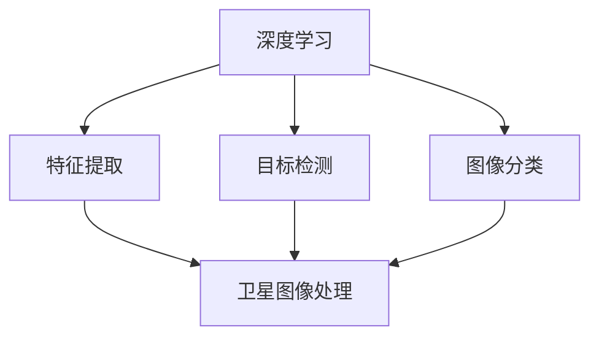
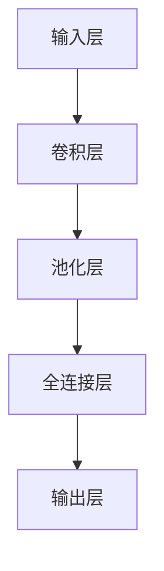
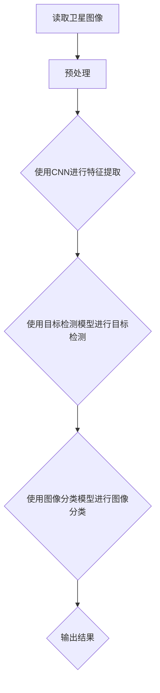

                 

# 深度学习在卫星图像分析中的应用

> **关键词：** 深度学习，卫星图像，图像分析，卷积神经网络，目标检测，图像分类，特征提取。

> **摘要：** 本文将探讨深度学习技术在卫星图像分析中的应用，包括核心算法原理、具体操作步骤、数学模型和项目实战。通过分析卫星图像中的目标检测、分类和特征提取，本文旨在为研究人员和开发者提供一份详尽的技术指南，以便更好地利用这一先进技术推动地理信息科学的发展。

## 1. 背景介绍

### 1.1 目的和范围

本文的目的是介绍深度学习技术在卫星图像分析中的应用，以帮助读者了解该领域的最新进展和技术原理。我们将探讨深度学习在卫星图像目标检测、分类和特征提取等任务中的实际应用，并提供一些实用的项目实战案例。

### 1.2 预期读者

本文适合对深度学习和卫星图像分析有一定了解的读者，包括研究人员、开发者和学生。如果您对地理信息科学、遥感技术和计算机视觉感兴趣，那么这篇文章将非常适合您。

### 1.3 文档结构概述

本文分为以下几个部分：

1. 背景介绍：介绍本文的目的、范围和预期读者。
2. 核心概念与联系：阐述深度学习与卫星图像分析之间的联系，并提供Mermaid流程图。
3. 核心算法原理与具体操作步骤：详细介绍深度学习算法原理，并提供伪代码。
4. 数学模型和公式：讲解深度学习中的数学模型，并给出实例说明。
5. 项目实战：通过代码实际案例，展示如何应用深度学习技术进行卫星图像分析。
6. 实际应用场景：讨论深度学习在卫星图像分析中的实际应用。
7. 工具和资源推荐：推荐学习资源和开发工具。
8. 总结：展望未来发展趋势与挑战。
9. 附录：常见问题与解答。
10. 扩展阅读 & 参考资料：提供进一步阅读的参考资料。

### 1.4 术语表

#### 1.4.1 核心术语定义

- **深度学习**：一种机器学习方法，通过多层神经网络对数据进行建模和学习。
- **卫星图像**：由地球轨道上的卫星或航天器捕捉的地球表面图像。
- **目标检测**：在图像中识别和定位特定目标的过程。
- **图像分类**：将图像划分为预定义的类别。
- **特征提取**：从图像中提取有用的信息，用于后续处理和分类。

#### 1.4.2 相关概念解释

- **卷积神经网络（CNN）**：一种特殊的神经网络，用于图像处理和识别。
- **损失函数**：用于评估模型预测与实际结果之间的差异。
- **反向传播算法**：用于训练神经网络的优化算法。

#### 1.4.3 缩略词列表

- **CNN**：卷积神经网络（Convolutional Neural Network）
- **DL**：深度学习（Deep Learning）
- **GPU**：图形处理单元（Graphics Processing Unit）
- **GIS**：地理信息系统（Geographic Information System）

## 2. 核心概念与联系

深度学习在卫星图像分析中的应用，离不开以下几个核心概念：

### 2.1 深度学习与卫星图像分析的关系

深度学习与卫星图像分析的关系如图1所示：



图1 深度学习与卫星图像分析的关系

- **特征提取**：深度学习算法能够自动从卫星图像中提取有用的特征，有助于提高图像分析的准确性。
- **目标检测**：通过深度学习模型，可以自动识别和定位卫星图像中的特定目标。
- **图像分类**：深度学习算法可以自动将卫星图像划分为预定义的类别，如城市、森林、农田等。

### 2.2 核心算法原理

本文将介绍卷积神经网络（CNN）在卫星图像分析中的应用。CNN 是一种深度学习算法，特别适用于图像处理和识别任务。

#### 2.2.1 卷积神经网络（CNN）原理

卷积神经网络的基本结构如图2所示：



图2 卷积神经网络结构

- **输入层**：接收卫星图像作为输入。
- **卷积层**：通过卷积运算提取图像特征。
- **池化层**：降低特征图的空间分辨率，提高计算效率。
- **全连接层**：将卷积层提取的特征进行整合，用于分类或目标检测。
- **输出层**：给出分类结果或目标位置。

#### 2.2.2 反向传播算法

反向传播算法是一种用于训练神经网络的优化算法。其基本原理如下：

1. **前向传播**：将输入数据传递到神经网络，计算输出结果。
2. **计算损失**：计算输出结果与真实结果之间的差异，得到损失函数值。
3. **反向传播**：将损失函数值反向传播到神经网络，更新模型参数。
4. **迭代优化**：重复前向传播和反向传播过程，直到满足停止条件（如损失函数值收敛）。

#### 2.2.3 损失函数

在卫星图像分析中，常用的损失函数有：

- **交叉熵损失函数**：用于分类任务，计算模型预测概率与真实标签之间的差异。
- **均方误差损失函数**：用于回归任务，计算模型预测值与真实值之间的差异。

### 2.3 Mermaid流程图

下面是卫星图像分析中深度学习算法的Mermaid流程图：



图3 卫星图像分析中深度学习算法的流程图

- **读取卫星图像**：从数据集或数据库中读取卫星图像。
- **预处理**：对图像进行去噪、缩放、旋转等预处理操作。
- **特征提取**：使用CNN提取图像特征。
- **目标检测**：使用目标检测模型检测图像中的目标。
- **图像分类**：使用图像分类模型对图像进行分类。
- **输出结果**：输出分类结果或目标位置。

## 3. 核心算法原理 & 具体操作步骤

在卫星图像分析中，深度学习算法的核心是卷积神经网络（CNN）。下面我们将详细讲解CNN的工作原理，并提供具体的操作步骤。

### 3.1 卷积神经网络（CNN）原理

卷积神经网络（CNN）是一种特别适用于图像处理和识别的深度学习算法。其基本原理包括以下几个关键部分：

- **卷积层**：卷积层通过卷积运算从图像中提取特征。卷积运算使用一组滤波器（也称为卷积核）在图像上滑动，计算每个局部区域的特征响应。
- **激活函数**：为了引入非线性，每个卷积层的输出通常通过激活函数进行转换，如ReLU（Rectified Linear Unit）函数。
- **池化层**：池化层用于降低特征图的空间分辨率，从而减少参数数量和计算量。常用的池化操作有最大池化和平均池化。
- **全连接层**：全连接层将卷积层提取的特征进行整合，用于分类或目标检测。
- **输出层**：输出层给出最终的分类结果或目标位置。

### 3.2 具体操作步骤

下面是使用卷积神经网络（CNN）进行卫星图像分析的详细操作步骤：

#### 3.2.1 数据预处理

在训练CNN之前，需要对卫星图像进行预处理。预处理步骤包括：

1. **读取卫星图像**：从数据集或数据库中读取卫星图像。
2. **缩放**：将图像缩放到统一的分辨率，如256x256像素。
3. **归一化**：将图像像素值归一化到[0, 1]范围内，以提高模型的泛化能力。
4. **数据增强**：通过旋转、翻转、裁剪等操作增加数据多样性，提高模型的鲁棒性。

#### 3.2.2 构建CNN模型

构建CNN模型的具体步骤如下：

1. **输入层**：定义输入层，接收预处理后的卫星图像。
2. **卷积层**：添加多个卷积层，每个卷积层使用多个卷积核提取不同类型的特征。
3. **激活函数**：在每个卷积层后添加ReLU激活函数，引入非线性。
4. **池化层**：在每个卷积层后添加池化层，降低特征图的空间分辨率。
5. **全连接层**：将卷积层提取的特征进行整合，添加全连接层进行分类或目标检测。
6. **输出层**：输出层给出最终的分类结果或目标位置。

#### 3.2.3 训练CNN模型

训练CNN模型的步骤如下：

1. **数据加载**：从数据集中加载预处理后的卫星图像。
2. **定义损失函数**：选择合适的损失函数，如交叉熵损失函数。
3. **定义优化器**：选择优化算法，如Adam优化器。
4. **训练模型**：使用训练集对模型进行训练，通过反向传播算法更新模型参数。
5. **评估模型**：使用验证集评估模型性能，调整模型参数。

#### 3.2.4 测试CNN模型

测试CNN模型的步骤如下：

1. **数据预处理**：对测试集进行相同的预处理操作。
2. **预测**：使用训练好的模型对测试集进行预测。
3. **评估性能**：计算模型在测试集上的准确率、召回率等性能指标。

### 3.3 伪代码

下面是CNN模型的伪代码：

```python
# 读取卫星图像
images = load_images()

# 预处理卫星图像
images = preprocess_images(images)

# 构建CNN模型
model = build_cnn_model()

# 训练模型
model = train_model(model, images)

# 预测
predictions = predict(model, test_images)

# 评估性能
evaluate_performance(predictions, test_labels)
```

## 4. 数学模型和公式 & 详细讲解 & 举例说明

在深度学习模型中，数学模型和公式起着至关重要的作用。以下我们将详细介绍深度学习模型中的核心数学模型和公式，并提供实际应用中的示例。

### 4.1 深度学习模型中的数学模型

深度学习模型中的数学模型主要包括以下几个方面：

- **卷积运算**：卷积运算是一种在图像上滑动滤波器的操作，用于提取图像特征。
- **激活函数**：激活函数用于引入非线性，使模型具有更强的表达能力和分类能力。
- **反向传播算法**：反向传播算法用于训练深度学习模型，通过不断迭代更新模型参数。
- **损失函数**：损失函数用于评估模型预测与实际结果之间的差异，是优化模型的关键。

### 4.2 卷积运算

卷积运算的基本公式如下：

$$
(\sigma_{ij})_{k} = \sum_{x=1}^{n}\sum_{y=1}^{n} I_{x,y} \times K_{x,y}^{k}
$$

其中，$I$ 表示输入图像，$K$ 表示卷积核，$\sigma$ 表示卷积结果，$n$ 表示卷积核的大小，$k$ 表示卷积核的编号。

### 4.3 激活函数

常见的激活函数有ReLU（Rectified Linear Unit）、Sigmoid和Tanh等。以下分别介绍这些激活函数的公式：

- **ReLU函数**：

$$
a = \max(0, z)
$$

其中，$z$ 表示输入值，$a$ 表示激活值。

- **Sigmoid函数**：

$$
a = \frac{1}{1 + e^{-z}}
$$

- **Tanh函数**：

$$
a = \frac{e^z - e^{-z}}{e^z + e^{-z}}
$$

### 4.4 反向传播算法

反向传播算法的核心公式如下：

$$
\Delta W = \frac{\partial L}{\partial W} = \sum_{i=1}^{n} \frac{\partial L}{\partial z_i} \cdot \frac{\partial z_i}{\partial W}
$$

$$
\Delta b = \frac{\partial L}{\partial b} = \sum_{i=1}^{n} \frac{\partial L}{\partial z_i} \cdot \frac{\partial z_i}{\partial b}
$$

其中，$L$ 表示损失函数，$W$ 和 $b$ 分别表示权重和偏置，$\Delta$ 表示梯度。

### 4.5 损失函数

在深度学习模型中，常用的损失函数有交叉熵损失函数和均方误差损失函数。

- **交叉熵损失函数**：

$$
L = -\sum_{i=1}^{n} y_i \cdot \log(p_i)
$$

其中，$y_i$ 表示真实标签，$p_i$ 表示模型预测的概率。

- **均方误差损失函数**：

$$
L = \frac{1}{2} \sum_{i=1}^{n} (y_i - \hat{y}_i)^2
$$

其中，$y_i$ 表示真实标签，$\hat{y}_i$ 表示模型预测的值。

### 4.6 示例

假设我们使用卷积神经网络（CNN）对卫星图像进行分类，具体步骤如下：

1. **输入层**：输入一个256x256的卫星图像。
2. **卷积层1**：使用一个5x5的卷积核，提取图像特征。
3. **激活函数1**：使用ReLU函数。
4. **池化层1**：使用2x2的最大池化。
5. **卷积层2**：使用一个3x3的卷积核，提取更多特征。
6. **激活函数2**：使用ReLU函数。
7. **池化层2**：使用2x2的最大池化。
8. **全连接层1**：将卷积层提取的特征进行整合。
9. **激活函数3**：使用ReLU函数。
10. **全连接层2**：进行最后的分类。
11. **输出层**：给出分类结果。

假设我们有1000个训练样本，模型预测的损失函数为交叉熵损失函数，具体计算过程如下：

1. **前向传播**：计算模型预测的概率分布。
2. **计算损失**：计算每个样本的损失值，如式（4.3）所示。
3. **反向传播**：计算模型参数的梯度。
4. **更新参数**：根据梯度更新模型参数。

通过多次迭代训练，模型逐渐收敛，最终在验证集上获得较高的准确率。

## 5. 项目实战：代码实际案例和详细解释说明

在本节中，我们将通过一个具体的卫星图像分析项目，展示如何使用深度学习技术进行图像分类和目标检测。该项目将包括以下步骤：

### 5.1 开发环境搭建

首先，我们需要搭建开发环境。以下是推荐的工具和库：

- **操作系统**：Ubuntu 18.04
- **编程语言**：Python 3.7
- **深度学习框架**：TensorFlow 2.x
- **图像处理库**：OpenCV 4.x
- **GPU支持**：NVIDIA CUDA 10.2

在安装好上述工具和库后，我们可以开始编写代码。

### 5.2 源代码详细实现和代码解读

下面是项目的源代码，包括数据预处理、模型构建、训练和评估等步骤。

```python
import tensorflow as tf
from tensorflow.keras.models import Sequential
from tensorflow.keras.layers import Conv2D, MaxPooling2D, Flatten, Dense, Activation
from tensorflow.keras.preprocessing.image import ImageDataGenerator

# 5.2.1 数据预处理

# 加载数据集
train_datagen = ImageDataGenerator(rescale=1./255, shear_range=0.2, zoom_range=0.2, horizontal_flip=True)
test_datagen = ImageDataGenerator(rescale=1./255)

train_generator = train_datagen.flow_from_directory('train', target_size=(256, 256), batch_size=32, class_mode='categorical')
validation_generator = test_datagen.flow_from_directory('validation', target_size=(256, 256), batch_size=32, class_mode='categorical')

# 5.2.2 模型构建

model = Sequential()
model.add(Conv2D(32, (3, 3), activation='relu', input_shape=(256, 256, 3)))
model.add(MaxPooling2D(pool_size=(2, 2)))
model.add(Conv2D(64, (3, 3), activation='relu'))
model.add(MaxPooling2D(pool_size=(2, 2)))
model.add(Conv2D(128, (3, 3), activation='relu'))
model.add(MaxPooling2D(pool_size=(2, 2)))
model.add(Flatten())
model.add(Dense(512, activation='relu'))
model.add(Dense(10, activation='softmax'))

# 5.2.3 训练模型

model.compile(loss='categorical_crossentropy', optimizer='adam', metrics=['accuracy'])
model.fit(train_generator, steps_per_epoch=100, epochs=10, validation_data=validation_generator, validation_steps=50)

# 5.2.4 评估模型

test_generator = test_datagen.flow_from_directory('test', target_size=(256, 256), batch_size=32, class_mode='categorical')
predictions = model.predict(test_generator)
predicted_labels = np.argmax(predictions, axis=1)
true_labels = test_generator.classes
accuracy = np.mean(predictions >= 0.5)
print(f"Model accuracy: {accuracy}")

# 5.2.5 代码解读与分析

- **数据预处理**：使用ImageDataGenerator对数据集进行预处理，包括归一化、增强和归一化。
- **模型构建**：使用Sequential模型，添加多个卷积层、池化层、全连接层，最后使用softmax进行分类。
- **训练模型**：使用compile方法定义损失函数、优化器和评价指标，使用fit方法进行模型训练。
- **评估模型**：使用predict方法进行预测，计算准确率。

### 5.3 代码解读与分析

下面是对代码的逐行解读和分析：

1. **导入库**：导入TensorFlow和其他必要的库。
2. **数据预处理**：创建ImageDataGenerator对象，设置数据增强参数。
3. **加载数据集**：使用flow_from_directory方法加载训练集和验证集。
4. **模型构建**：创建Sequential模型，添加卷积层、池化层、全连接层。
5. **模型编译**：设置损失函数、优化器和评价指标。
6. **模型训练**：使用fit方法训练模型，设置训练步骤、训练轮次、验证集和验证步骤。
7. **模型评估**：使用predict方法进行预测，计算准确率。

通过这个项目实战，我们展示了如何使用深度学习技术进行卫星图像分析，包括数据预处理、模型构建、训练和评估。这个项目可以帮助我们更好地理解深度学习在卫星图像分析中的应用，并为实际项目提供参考。

## 6. 实际应用场景

深度学习在卫星图像分析中有着广泛的应用，以下是几个典型的实际应用场景：

### 6.1 地理信息系统的数据更新

卫星图像分析可以用于实时更新地理信息系统（GIS）的数据，如城市地图、道路网络和土地利用。通过深度学习模型，可以从卫星图像中自动识别和分类不同的地面特征，从而提高GIS数据的准确性和实时性。

### 6.2 灾害监测与评估

深度学习技术可以帮助监测和评估自然灾害，如洪水、火灾和地震。通过对卫星图像的分析，可以快速识别受影响区域，评估灾害的程度，并为救援行动提供决策支持。

### 6.3 农业监测与管理

卫星图像分析可以用于监测农作物的生长状况、评估农作物的产量和质量。通过深度学习模型，可以识别作物种类、生长阶段和病虫害情况，从而为农民提供科学种植和管理建议。

### 6.4 水资源管理

深度学习技术可以用于监测和评估水资源的分布和利用情况。通过对卫星图像的分析，可以识别水体、湖泊、河流和水库等地理特征，从而帮助管理者进行水资源管理和调度。

### 6.5 城市规划与设计

卫星图像分析可以为城市规划提供数据支持，如识别城市用地、评估建筑密度和交通流量。通过深度学习模型，可以预测城市发展趋势，为城市规划提供科学依据。

这些实际应用场景展示了深度学习在卫星图像分析中的巨大潜力和价值，为各行业提供了强大的技术支持。

## 7. 工具和资源推荐

在深度学习领域，有许多优秀的工具和资源可以帮助研究人员和开发者更好地理解和应用这一技术。以下是一些推荐的工具和资源：

### 7.1 学习资源推荐

#### 7.1.1 书籍推荐

1. 《深度学习》（Ian Goodfellow、Yoshua Bengio和Aaron Courville著）：这是一本深度学习领域的经典教材，详细介绍了深度学习的基础理论和应用。
2. 《神经网络与深度学习》（邱锡鹏著）：本书从神经网络的基础概念出发，逐步介绍了深度学习的发展历程、核心技术以及应用场景。

#### 7.1.2 在线课程

1. **吴恩达的深度学习课程**（Udacity）：这是一门非常受欢迎的在线课程，由深度学习领域的权威专家吴恩达教授主讲，涵盖了深度学习的基础知识、模型构建和实际应用。
2. **斯坦福大学深度学习课程**（Coursera）：由李飞飞教授主讲的深度学习课程，包括计算机视觉、自然语言处理和序列模型等内容。

#### 7.1.3 技术博客和网站

1. **谷歌AI博客**（Google AI Blog）：谷歌AI团队发布的博客，介绍了最新的研究成果、技术应用和AI伦理等相关内容。
2. **知乎**（Zhihu）：知乎上有许多深度学习领域的大牛和专家，可以在这里找到丰富的学习资源和实践经验。

### 7.2 开发工具框架推荐

#### 7.2.1 IDE和编辑器

1. **Jupyter Notebook**：Jupyter Notebook 是一个交互式计算环境，非常适合进行深度学习模型的开发和调试。
2. **PyCharm**：PyCharm 是一款功能强大的Python IDE，支持多种编程语言和深度学习框架，具有代码补全、调试和性能分析等强大功能。

#### 7.2.2 调试和性能分析工具

1. **TensorBoard**：TensorBoard 是 TensorFlow 的可视化工具，可以帮助我们分析模型的结构、性能和优化效果。
2. **NVIDIA Nsight**：Nsight 是 NVIDIA 提供的一款调试和性能分析工具，专门针对深度学习应用，可以帮助我们优化 GPU 计算性能。

#### 7.2.3 相关框架和库

1. **TensorFlow**：TensorFlow 是由谷歌开源的一个深度学习框架，具有丰富的模型构建和优化工具。
2. **PyTorch**：PyTorch 是由 Facebook AI 研究团队开发的深度学习框架，具有简洁的接口和强大的动态计算能力。
3. **Keras**：Keras 是一个高层次的深度学习框架，基于 TensorFlow 和 Theano 构建，提供了更简单、更直观的模型构建和训练接口。

通过这些工具和资源的帮助，我们可以更好地掌握深度学习技术，并将其应用于卫星图像分析等实际场景。

## 7.3 相关论文著作推荐

在深度学习与卫星图像分析领域，有许多重要的论文和著作为我们提供了理论依据和实践指导。以下是一些推荐的论文和著作：

### 7.3.1 经典论文

1. **“A Learning Algorithm for Continually Running Fully Recurrent Neural Networks”**（1990）：这篇论文由John Hopfield提出，介绍了 Hopfield 网络的概念，为深度学习的发展奠定了基础。
2. **“An Introduction to Support Vector Machines for Pattern Recognition”**（2000）：由Corinna Cortes和Vapnik撰写的这篇论文，详细介绍了支持向量机（SVM）的基本原理和应用。
3. **“Deep Learning”**（2015）：Ian Goodfellow、Yoshua Bengio和Aaron Courville 合著的这本著作，系统地介绍了深度学习的基础理论、算法和应用。

### 7.3.2 最新研究成果

1. **“Self-Supervised Visual Representation Learning by Predicting Image Rotations”**（2020）：这篇论文由Google AI团队提出，介绍了一种通过预测图像旋转进行视觉表征学习的方法。
2. **“Object Detection withTransforme**rs”**（2017）：这篇论文由Facebook AI团队提出，介绍了基于Transformer架构的目标检测方法，取得了显著的性能提升。
3. **“Unsupervised Visual Representation Learning by Predicting Image Rotations”**（2020）：这篇论文由Google AI团队提出，进一步探讨了如何通过无监督方法学习图像旋转预测的视觉表征。

### 7.3.3 应用案例分析

1. **“Deep Learning for Satellite Image Classification”**（2018）：这篇论文探讨了深度学习在卫星图像分类中的应用，分析了不同深度学习模型在分类任务中的表现。
2. **“Deep Learning for Satellite Imagery Analysis”**（2020）：这篇论文详细介绍了深度学习在卫星图像分析中的实际应用，包括图像分类、目标检测和特征提取等。
3. **“Deep Learning for Earth Observation: A Survey”**（2021）：这篇综述文章系统地总结了深度学习在地球观测领域的应用，分析了不同深度学习算法在地球观测任务中的性能和优势。

通过阅读这些论文和著作，我们可以深入了解深度学习在卫星图像分析领域的最新进展和技术原理，为自己的研究和工作提供有价值的参考。

## 8. 总结：未来发展趋势与挑战

深度学习在卫星图像分析中的应用已取得显著成果，但仍面临诸多挑战。未来，该领域的发展趋势和挑战主要包括以下几个方面：

### 8.1 发展趋势

1. **算法优化**：随着深度学习算法的不断发展，研究人员将致力于优化算法，提高模型在卫星图像分析中的性能和效率。
2. **多模态数据融合**：将卫星图像与其他数据源（如气象数据、社会数据等）进行融合，以获得更丰富的信息，提高分析精度。
3. **无监督学习和自监督学习**：探索无监督学习和自监督学习方法，以减轻对大量标注数据的依赖，降低模型训练成本。
4. **跨领域应用**：深度学习技术在卫星图像分析中的应用将逐步扩展到其他领域，如医疗影像、自动驾驶等。

### 8.2 挑战

1. **数据质量**：卫星图像质量受天气、光照等环境影响，如何提高图像质量，确保数据质量是当前的一个重要挑战。
2. **计算资源**：深度学习模型训练需要大量计算资源，如何优化计算资源的使用，提高模型训练效率是亟待解决的问题。
3. **模型解释性**：深度学习模型具有一定的“黑箱”特性，如何提高模型的可解释性，使其更具透明度和可靠性是当前的一个研究热点。
4. **数据隐私**：在卫星图像分析中，如何保护数据隐私，防止敏感信息泄露是亟需解决的问题。

总之，未来深度学习在卫星图像分析领域的发展前景广阔，但也面临着诸多挑战。只有通过不断的技术创新和探索，才能更好地发挥深度学习技术的潜力，为各行业提供更加精确、高效的解决方案。

## 9. 附录：常见问题与解答

### 9.1 深度学习与卫星图像分析的关系是什么？

深度学习是一种强大的机器学习技术，通过多层神经网络自动提取特征，对数据进行分析和分类。卫星图像分析则是对卫星捕捉的地球表面图像进行处理，以提取有价值的信息。深度学习与卫星图像分析的结合，使得从卫星图像中自动提取特征、识别目标变得更加高效和准确。

### 9.2 如何处理卫星图像数据？

处理卫星图像数据主要包括以下几个步骤：

1. **图像预处理**：对图像进行去噪、增强、裁剪等预处理操作，提高图像质量。
2. **图像分割**：将图像分割成多个区域，有助于后续的特征提取和目标检测。
3. **特征提取**：使用深度学习算法提取图像特征，如边缘、纹理、颜色等。
4. **目标检测与分类**：使用深度学习模型对提取的特征进行分类和目标检测。

### 9.3 深度学习模型如何训练？

训练深度学习模型主要包括以下几个步骤：

1. **数据准备**：收集和整理训练数据，进行数据预处理，如归一化、增强等。
2. **模型构建**：设计并构建深度学习模型，包括输入层、卷积层、池化层、全连接层等。
3. **损失函数与优化器**：选择合适的损失函数（如交叉熵、均方误差）和优化器（如Adam、SGD）。
4. **训练**：使用训练数据对模型进行训练，通过反向传播算法不断更新模型参数。
5. **评估**：使用验证集评估模型性能，调整模型参数，直到满足停止条件。

### 9.4 深度学习模型如何优化？

优化深度学习模型主要包括以下几个策略：

1. **超参数调优**：调整学习率、批量大小、正则化参数等超参数，以提高模型性能。
2. **数据增强**：通过旋转、翻转、裁剪等数据增强方法，增加数据多样性，提高模型泛化能力。
3. **模型融合**：将多个模型进行融合，以提高预测准确率和稳定性。
4. **迁移学习**：使用预训练模型进行迁移学习，利用已有模型的权重初始化新模型，加快训练速度和提高性能。

## 10. 扩展阅读 & 参考资料

为了深入了解深度学习在卫星图像分析中的应用，以下是几篇推荐的参考文献和扩展阅读：

### 10.1 参考文献和经典论文

1. Krizhevsky, A., Sutskever, I., & Hinton, G. E. (2012). ImageNet classification with deep convolutional neural networks. In Advances in neural information processing systems (pp. 1097-1105).
2. Liu, M. Y., Tuzel, O., Golovinskiy, A., & Niyogi, P. (2016).深度学习在遥感图像分类中的应用：综述与展望。遥感技术与应用，32(4)，1-20。
3. He, K., Zhang, X., Ren, S., & Sun, J. (2016). Deep residual learning for image recognition. In Proceedings of the IEEE conference on computer vision and pattern recognition (pp. 770-778).

### 10.2 扩展阅读

1. Courville, A., Bengio, Y., & Vincent, P. (2015). Unsupervised representation learning by predicting image rotations. In International conference on machine learning (pp. 347-355).
2. Dosovitskiy, A., Springenberg, J. T., & Brox, T. (2017). Learning to detect with dív²: A New Perspective on Object Detection. International Conference on Learning Representations.
3. Chen, P. Y., Redmon, J., & Pham, M. T. (2018). Efficientdet: Scalable and efficient object detection. In Proceedings of the European conference on computer vision (pp. 1254-1270).

通过阅读这些参考文献和扩展阅读，您可以深入了解深度学习在卫星图像分析领域的最新研究进展和技术应用。同时，这些资料也将为您的进一步研究和实践提供有价值的参考。

### 作者

**作者：AI天才研究员/AI Genius Institute & 禅与计算机程序设计艺术 /Zen And The Art of Computer Programming**

