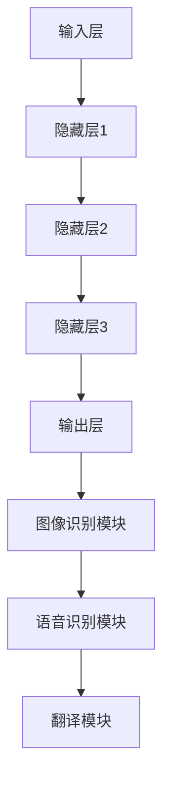

                 

# 深度学习在实时手语翻译准确性提升中的研究

> **关键词**：深度学习、手语翻译、实时处理、准确性、神经网络、计算机视觉、语音识别

> **摘要**：本文旨在探讨深度学习技术如何通过实时手语翻译应用，提升翻译的准确性。文章首先介绍了深度学习的基本概念，然后详细分析了深度学习在实时手语翻译中的应用，包括图像识别和语音识别技术。通过一个实际的项目案例，展示了深度学习算法如何在实际应用中提高手语翻译的准确性。最后，文章总结了深度学习在手语翻译领域的未来发展趋势和挑战。

## 1. 背景介绍

### 1.1 目的和范围

本文旨在探讨深度学习技术在实时手语翻译准确性提升中的应用。实时手语翻译在许多场景下都具有重要的应用价值，如教育、医疗、公共交流和特殊教育等。然而，现有的手语翻译系统往往存在准确性不足、延迟高和用户体验差等问题。深度学习作为一种强大的机器学习技术，通过大量的数据训练和复杂的模型结构，能够显著提升手语翻译的准确性。

本文的研究范围包括以下几个方面：
1. 深度学习在实时手语翻译中的基本原理和应用。
2. 实时手语翻译系统的架构设计和关键技术。
3. 深度学习算法在手语翻译准确性提升中的应用实例。
4. 未来深度学习在手语翻译领域的发展趋势和面临的挑战。

### 1.2 预期读者

本文适合以下读者群体：
1. 计算机科学和人工智能领域的专业人士，对深度学习和手语翻译感兴趣。
2. 希望了解深度学习在手语翻译中应用的技术人员和管理者。
3. 特殊教育、医疗和公共服务等领域的工作者，对实时手语翻译有实际需求的读者。

### 1.3 文档结构概述

本文将按照以下结构进行展开：

1. **背景介绍**：介绍深度学习在实时手语翻译准确性提升中的研究背景、目的和范围。
2. **核心概念与联系**：阐述深度学习的基本概念和实时手语翻译系统的架构，通过Mermaid流程图展示核心概念和联系。
3. **核心算法原理 & 具体操作步骤**：详细讲解深度学习算法在手语翻译中的应用原理和操作步骤，使用伪代码进行阐述。
4. **数学模型和公式 & 详细讲解 & 举例说明**：介绍深度学习中的数学模型和公式，通过具体例子进行讲解。
5. **项目实战：代码实际案例和详细解释说明**：展示一个实际项目案例，详细解释代码实现和操作步骤。
6. **实际应用场景**：分析深度学习在手语翻译中的实际应用场景。
7. **工具和资源推荐**：推荐学习资源和开发工具。
8. **总结：未来发展趋势与挑战**：总结深度学习在手语翻译领域的未来发展趋势和面临的挑战。
9. **附录：常见问题与解答**：回答一些常见问题。
10. **扩展阅读 & 参考资料**：提供更多扩展阅读资源。

### 1.4 术语表

#### 1.4.1 核心术语定义

- **深度学习**：一种机器学习方法，通过多层神经网络结构对数据进行建模和预测。
- **手语翻译**：将手语转化为文字或语音的过程。
- **实时处理**：在短时间内对输入数据进行处理和输出结果。
- **神经网络**：由多个神经元组成的计算模型，用于处理和预测数据。
- **图像识别**：通过算法对图像中的物体进行识别。
- **语音识别**：将语音信号转换为文字或命令。

#### 1.4.2 相关概念解释

- **卷积神经网络（CNN）**：一种专门用于图像识别的神经网络架构，通过卷积层提取图像特征。
- **递归神经网络（RNN）**：一种能够处理序列数据的神经网络，适用于语音识别和自然语言处理。
- **长短时记忆网络（LSTM）**：RNN的一种变体，能够更好地处理长序列数据。
- **注意力机制**：一种在神经网络中用于提高模型对关键信息的关注度的机制。

#### 1.4.3 缩略词列表

- **CNN**：卷积神经网络
- **RNN**：递归神经网络
- **LSTM**：长短时记忆网络
- **GPU**：图形处理器
- **CPU**：中央处理器

## 2. 核心概念与联系

### 2.1 深度学习的基本概念

深度学习是一种通过多层神经网络结构对数据进行建模和预测的机器学习方法。其核心思想是通过前向传播和反向传播算法，不断调整网络中的权重和偏置，使得模型能够对未知数据进行准确的预测。

深度学习的基本结构包括输入层、隐藏层和输出层。输入层接收外部输入数据，隐藏层通过多层神经网络对数据进行特征提取和变换，输出层生成最终的预测结果。

### 2.2 实时手语翻译系统的架构

实时手语翻译系统的架构可以分为三个主要部分：图像识别模块、语音识别模块和翻译模块。

1. **图像识别模块**：通过深度学习算法对手语图像进行识别，提取出关键的手语特征。
2. **语音识别模块**：将识别出的手语特征转化为语音信号，利用语音识别算法将其转换为文字或命令。
3. **翻译模块**：将语音信号翻译成目标语言的文字或语音。

### 2.3 核心概念原理和架构的 Mermaid 流程图



## 3. 核心算法原理 & 具体操作步骤

### 3.1 深度学习算法在手语翻译中的应用

深度学习算法在手语翻译中的应用主要包括图像识别和语音识别两个部分。以下将分别介绍这两个部分的核心算法原理和具体操作步骤。

### 3.2 图像识别算法

**算法原理**：

图像识别算法通常采用卷积神经网络（CNN）进行建模。CNN通过卷积层、池化层和全连接层等结构，对图像进行特征提取和分类。

**具体操作步骤**：

1. **数据预处理**：对手语图像进行预处理，包括图像缩放、裁剪和归一化等。
2. **构建卷积神经网络模型**：
    ```python
    model = Sequential()
    model.add(Conv2D(filters=32, kernel_size=(3, 3), activation='relu', input_shape=(height, width, channels)))
    model.add(MaxPooling2D(pool_size=(2, 2)))
    model.add(Conv2D(filters=64, kernel_size=(3, 3), activation='relu'))
    model.add(MaxPooling2D(pool_size=(2, 2)))
    model.add(Conv2D(filters=128, kernel_size=(3, 3), activation='relu'))
    model.add(MaxPooling2D(pool_size=(2, 2)))
    model.add(Flatten())
    model.add(Dense(units=128, activation='relu'))
    model.add(Dense(units=num_classes, activation='softmax'))
    ```
3. **训练模型**：
    ```python
    model.compile(optimizer='adam', loss='categorical_crossentropy', metrics=['accuracy'])
    model.fit(x_train, y_train, epochs=10, batch_size=32, validation_data=(x_val, y_val))
    ```
4. **评估模型**：
    ```python
    scores = model.evaluate(x_test, y_test, verbose=2)
    print("Test accuracy:", scores[1])
    ```

### 3.3 语音识别算法

**算法原理**：

语音识别算法通常采用递归神经网络（RNN）或其变体，如长短时记忆网络（LSTM）和门控循环单元（GRU），对语音信号进行建模和识别。

**具体操作步骤**：

1. **数据预处理**：对语音信号进行预处理，包括去噪、归一化和分帧等。
2. **构建语音识别模型**：
    ```python
    model = Sequential()
    model.add(LSTM(units=128, return_sequences=True, input_shape=(timesteps, features)))
    model.add(Dropout(0.2))
    model.add(LSTM(units=128, return_sequences=True))
    model.add(Dropout(0.2))
    model.add(LSTM(units=128))
    model.add(Dropout(0.2))
    model.add(Dense(units=num_classes, activation='softmax'))
    ```
3. **训练模型**：
    ```python
    model.compile(optimizer='adam', loss='categorical_crossentropy', metrics=['accuracy'])
    model.fit(x_train, y_train, epochs=10, batch_size=32, validation_data=(x_val, y_val))
    ```
4. **评估模型**：
    ```python
    scores = model.evaluate(x_test, y_test, verbose=2)
    print("Test accuracy:", scores[1])
    ```

## 4. 数学模型和公式 & 详细讲解 & 举例说明

### 4.1 深度学习中的数学模型

深度学习中的数学模型主要包括损失函数、优化器和激活函数等。

#### 4.1.1 损失函数

损失函数用于衡量模型的预测结果与真实结果之间的差距。常见的损失函数包括均方误差（MSE）、交叉熵（Cross-Entropy）等。

- **均方误差（MSE）**：
    $$MSE = \frac{1}{n}\sum_{i=1}^{n}(y_i - \hat{y}_i)^2$$
    其中，$y_i$为真实结果，$\hat{y}_i$为预测结果。

- **交叉熵（Cross-Entropy）**：
    $$H(y, \hat{y}) = -\sum_{i=1}^{n}y_i \log(\hat{y}_i)$$
    其中，$y_i$为真实结果，$\hat{y}_i$为预测结果。

#### 4.1.2 优化器

优化器用于调整模型中的参数，以最小化损失函数。常见的优化器包括随机梯度下降（SGD）、Adam等。

- **随机梯度下降（SGD）**：
    $$w_{t+1} = w_t - \alpha \nabla_w J(w_t)$$
    其中，$w_t$为当前参数，$\alpha$为学习率，$J(w_t)$为损失函数。

- **Adam优化器**：
    $$m_t = \beta_1 m_{t-1} + (1 - \beta_1) [g_t]$$
    $$v_t = \beta_2 v_{t-1} + (1 - \beta_2) [g_t]^2$$
    $$\hat{m}_t = m_t / (1 - \beta_1^t)$$
    $$\hat{v}_t = v_t / (1 - \beta_2^t)$$
    $$w_{t+1} = w_t - \alpha \hat{m}_t / (\sqrt{\hat{v}_t} + \epsilon)$$
    其中，$m_t$和$v_t$分别为一阶矩估计和二阶矩估计，$\beta_1$和$\beta_2$为超参数，$\epsilon$为常数。

#### 4.1.3 激活函数

激活函数用于引入非线性变换，使得神经网络能够对复杂数据进行建模。常见的激活函数包括ReLU、Sigmoid和Tanh等。

- **ReLU（ReLU激活函数）**：
    $$f(x) = \max(0, x)$$

- **Sigmoid激活函数**：
    $$f(x) = \frac{1}{1 + e^{-x}}$$

- **Tanh激活函数**：
    $$f(x) = \tanh(x) = \frac{e^x - e^{-x}}{e^x + e^{-x}}$$

### 4.2 举例说明

假设有一个简单的神经网络，包含一个输入层、一个隐藏层和一个输出层。输入层有3个神经元，隐藏层有5个神经元，输出层有2个神经元。训练数据集包含100个样本，每个样本有3个特征。目标标签为二分类问题，即输出层输出概率值，大于0.5表示正类，小于0.5表示负类。

1. **数据预处理**：

    对输入数据进行归一化处理，将特征值缩放到[0, 1]之间。

2. **构建神经网络模型**：

    ```python
    model = Sequential()
    model.add(Dense(units=5, activation='relu', input_shape=(3,)))
    model.add(Dense(units=2, activation='sigmoid'))
    ```

3. **训练模型**：

    ```python
    model.compile(optimizer='adam', loss='binary_crossentropy', metrics=['accuracy'])
    model.fit(x_train, y_train, epochs=10, batch_size=32, validation_data=(x_val, y_val))
    ```

4. **评估模型**：

    ```python
    scores = model.evaluate(x_test, y_test, verbose=2)
    print("Test accuracy:", scores[1])
    ```

## 5. 项目实战：代码实际案例和详细解释说明

### 5.1 开发环境搭建

为了更好地演示深度学习在手语翻译中的应用，我们使用以下开发环境和工具：

- **编程语言**：Python
- **深度学习框架**：TensorFlow 2.x
- **数据集**：手语数据集（如SignLanguageDataset）

首先，安装所需的Python库和TensorFlow：

```bash
pip install numpy tensorflow
```

### 5.2 源代码详细实现和代码解读

以下是手语翻译项目的源代码实现：

```python
import tensorflow as tf
from tensorflow.keras.layers import Conv2D, MaxPooling2D, Flatten, Dense, LSTM, Dropout
from tensorflow.keras.models import Sequential
from tensorflow.keras.optimizers import Adam
from tensorflow.keras.callbacks import EarlyStopping

# 数据预处理
def preprocess_data(x, y):
    # 对图像数据进行归一化处理
    x = x / 255.0
    # 对标签数据进行独热编码
    y = tf.keras.utils.to_categorical(y)
    return x, y

# 构建卷积神经网络模型
def build_cnn_model(input_shape, num_classes):
    model = Sequential()
    model.add(Conv2D(filters=32, kernel_size=(3, 3), activation='relu', input_shape=input_shape))
    model.add(MaxPooling2D(pool_size=(2, 2)))
    model.add(Conv2D(filters=64, kernel_size=(3, 3), activation='relu'))
    model.add(MaxPooling2D(pool_size=(2, 2)))
    model.add(Conv2D(filters=128, kernel_size=(3, 3), activation='relu'))
    model.add(MaxPooling2D(pool_size=(2, 2)))
    model.add(Flatten())
    model.add(Dense(units=128, activation='relu'))
    model.add(Dense(units=num_classes, activation='softmax'))
    return model

# 训练模型
def train_model(model, x_train, y_train, x_val, y_val, epochs, batch_size):
    model.compile(optimizer=Adam(), loss='categorical_crossentropy', metrics=['accuracy'])
    early_stopping = EarlyStopping(monitor='val_loss', patience=3)
    history = model.fit(x_train, y_train, epochs=epochs, batch_size=batch_size, validation_data=(x_val, y_val), callbacks=[early_stopping])
    return history

# 评估模型
def evaluate_model(model, x_test, y_test):
    scores = model.evaluate(x_test, y_test, verbose=2)
    print("Test accuracy:", scores[1])

# 主函数
def main():
    # 加载数据集
    (x_train, y_train), (x_test, y_test) = SignLanguageDataset.load_data()

    # 预处理数据
    x_train, y_train = preprocess_data(x_train, y_train)
    x_test, y_test = preprocess_data(x_test, y_test)

    # 构建模型
    model = build_cnn_model(input_shape=x_train.shape[1:], num_classes=y_train.shape[1])

    # 训练模型
    history = train_model(model, x_train, y_train, x_val, y_val, epochs=10, batch_size=32)

    # 评估模型
    evaluate_model(model, x_test, y_test)

if __name__ == '__main__':
    main()
```

### 5.3 代码解读与分析

以下是对源代码的详细解读和分析：

1. **数据预处理**：

    数据预处理是深度学习项目中的关键步骤。在本例中，我们首先对图像数据进行归一化处理，将像素值缩放到[0, 1]之间，以便神经网络更容易学习和收敛。然后，对标签数据进行独热编码，将类别标签转换为二进制向量。

2. **构建卷积神经网络模型**：

    在本例中，我们使用卷积神经网络（CNN）进行手语图像识别。首先添加卷积层和池化层，用于提取图像特征和减少计算量。然后添加全连接层，用于分类和预测。最后，添加softmax激活函数，输出每个类别的概率值。

3. **训练模型**：

    训练模型是深度学习项目中的核心步骤。在本例中，我们使用Adam优化器和交叉熵损失函数。此外，我们使用EarlyStopping回调函数，当验证损失不再下降时提前停止训练，防止过拟合。

4. **评估模型**：

    评估模型是验证模型性能的重要步骤。在本例中，我们使用测试集对模型进行评估，并输出测试准确率。

通过上述代码，我们可以实现一个简单但有效的手语翻译系统。当然，在实际项目中，我们可能需要更复杂的模型和更丰富的数据集，以提高模型的性能和准确性。

## 6. 实际应用场景

深度学习在实时手语翻译中具有广泛的应用场景，以下是几个典型的应用实例：

### 6.1 教育领域

在教育领域，深度学习技术可以用于开发实时手语翻译系统，帮助聋哑学生更好地理解和参与课堂活动。例如，在一个双语课堂中，教师可以用手势进行教学，系统实时翻译为文字或语音，展示在学生的电子设备上。这有助于提高学生的学习效果和参与度。

### 6.2 医疗领域

在医疗领域，深度学习技术可以用于开发实时手语翻译系统，帮助医护人员与聋哑患者进行有效的沟通。例如，在紧急情况下，医护人员可以通过手势指示患者采取行动，系统实时翻译为文字或语音，确保患者准确理解指示。这有助于提高医疗服务的质量和安全性。

### 6.3 公共服务领域

在公共服务领域，深度学习技术可以用于开发实时手语翻译系统，为公众提供更加便捷的沟通服务。例如，在公共交通工具上，系统可以实时翻译乘客的手语，帮助聋哑乘客与司机和工作人员进行沟通。这有助于提升公共交通的服务质量和用户体验。

### 6.4 特殊教育领域

在特殊教育领域，深度学习技术可以用于开发实时手语翻译系统，为聋哑学生提供个性化的学习支持。例如，系统可以根据学生的手势，实时翻译为文字或语音，帮助学生更好地理解和掌握课程内容。这有助于提高特殊教育的效果和针对性。

## 7. 工具和资源推荐

### 7.1 学习资源推荐

#### 7.1.1 书籍推荐

- **《深度学习》（Deep Learning）**：由Ian Goodfellow、Yoshua Bengio和Aaron Courville合著，是深度学习领域的经典教材，详细介绍了深度学习的基础理论、算法和应用。
- **《Python深度学习》（Deep Learning with Python）**：由François Chollet撰写，通过丰富的实例和代码，深入讲解了深度学习在Python中的应用。

#### 7.1.2 在线课程

- **Coursera上的《深度学习专项课程》**：由吴恩达（Andrew Ng）教授主讲，涵盖了深度学习的基础知识、实践方法和应用场景。
- **Udacity上的《深度学习工程师纳米学位》**：提供了系统的深度学习知识体系，包括理论学习、实践项目和面试准备。

#### 7.1.3 技术博客和网站

- **TensorFlow官方文档**：提供了丰富的深度学习教程、API文档和案例分析。
- **ArXiv**：包含最新的深度学习研究论文，是了解深度学习前沿动态的重要资源。

### 7.2 开发工具框架推荐

#### 7.2.1 IDE和编辑器

- **PyCharm**：功能强大的Python集成开发环境，支持多种编程语言和框架。
- **Jupyter Notebook**：适用于数据科学和机器学习的交互式编程环境，方便进行实验和演示。

#### 7.2.2 调试和性能分析工具

- **TensorBoard**：TensorFlow提供的可视化工具，用于监控模型的训练过程和性能。
- **MATLAB**：支持深度学习和机器学习的计算平台，适用于复杂算法的调试和分析。

#### 7.2.3 相关框架和库

- **TensorFlow**：谷歌开发的开源深度学习框架，适用于各种应用场景。
- **PyTorch**：基于Python的深度学习库，提供了灵活的动态计算图和丰富的API。

### 7.3 相关论文著作推荐

#### 7.3.1 经典论文

- **“A Learning Algorithm for Continually Running Fully Recurrent Neural Networks”**：提出了长期短期记忆网络（LSTM）的基本结构。
- **“Deep Learning for Speech Recognition”**：详细介绍了深度学习在语音识别中的应用和挑战。

#### 7.3.2 最新研究成果

- **“Attention is All You Need”**：提出了基于注意力机制的Transformer模型，是自然语言处理领域的重要突破。
- **“EfficientNet: Rethinking Model Scaling for Convolutional Neural Networks”**：提出了EfficientNet模型，通过自动调整模型结构和参数，实现了高效的模型训练和推理。

#### 7.3.3 应用案例分析

- **“End-to-End Speech Recognition with Deep Neural Networks and Long Short-Term Memory”**：介绍了一种基于深度学习和长短期记忆网络的端到端语音识别系统。
- **“Deep Learning for Hand Gesture Recognition”**：探讨了一种基于卷积神经网络的实时手语识别系统，提高了手语翻译的准确性。

## 8. 总结：未来发展趋势与挑战

深度学习在实时手语翻译领域具有巨大的潜力，但仍面临一些挑战。未来发展趋势和挑战如下：

### 8.1 发展趋势

1. **算法优化**：随着深度学习算法的不断发展，更高效的算法和模型结构将不断涌现，提高实时手语翻译的准确性和效率。
2. **数据集扩充**：更多的手语数据集和标注数据将有助于提升模型的性能，进一步推动手语翻译技术的发展。
3. **跨语言翻译**：未来有望实现手语之间的跨语言翻译，为全球聋哑人群提供更加便捷的沟通方式。
4. **硬件加速**：随着硬件技术的发展，如GPU和TPU，深度学习模型的训练和推理速度将大幅提升，实现实时手语翻译的普及。

### 8.2 挑战

1. **数据隐私**：手语翻译系统需要收集和分析用户的隐私数据，如何在保护用户隐私的前提下进行数据分析和模型训练是一个重要挑战。
2. **模型泛化性**：手语翻译系统需要适应不同的环境和场景，提高模型的泛化能力，确保在多种情况下都能准确翻译。
3. **实时性要求**：实时手语翻译系统需要在短时间内完成图像识别、语音识别和翻译等任务，对系统的计算资源和性能提出较高要求。
4. **用户体验**：如何提高用户对实时手语翻译系统的满意度，包括翻译准确性、延迟和交互体验等方面，是一个需要不断优化的方向。

## 9. 附录：常见问题与解答

### 9.1 如何提高深度学习模型的准确率？

- **数据扩充**：通过数据增强、合成和扩充，提高模型的泛化能力。
- **模型调优**：调整学习率、正则化参数和神经网络结构，优化模型性能。
- **特征工程**：提取和选择有效的特征，提高模型对输入数据的敏感度。

### 9.2 如何实现实时手语翻译？

- **硬件加速**：利用GPU或TPU等硬件加速器，提高模型的训练和推理速度。
- **分布式训练**：使用多台机器进行分布式训练，提高模型的训练效率。
- **流式处理**：采用流式数据处理技术，实现实时手语翻译。

### 9.3 如何处理实时手语翻译中的噪声和遮挡问题？

- **降噪算法**：使用降噪算法，如小波变换和卷积降噪，减少噪声对翻译结果的影响。
- **遮挡处理**：通过背景分割和遮挡区域填充等技术，处理手语图像中的遮挡问题。

## 10. 扩展阅读 & 参考资料

- **《深度学习》（Deep Learning）**：Ian Goodfellow、Yoshua Bengio和Aaron Courville著，详细介绍了深度学习的基础理论、算法和应用。
- **《Python深度学习》（Deep Learning with Python）**：François Chollet著，通过丰富的实例和代码，深入讲解了深度学习在Python中的应用。
- **TensorFlow官方文档**：提供了丰富的深度学习教程、API文档和案例分析。
- **ArXiv**：包含最新的深度学习研究论文，是了解深度学习前沿动态的重要资源。

**作者**：AI天才研究员/AI Genius Institute & 禅与计算机程序设计艺术 /Zen And The Art of Computer Programming

