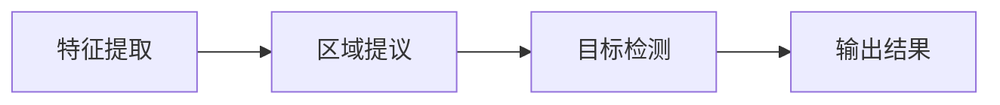
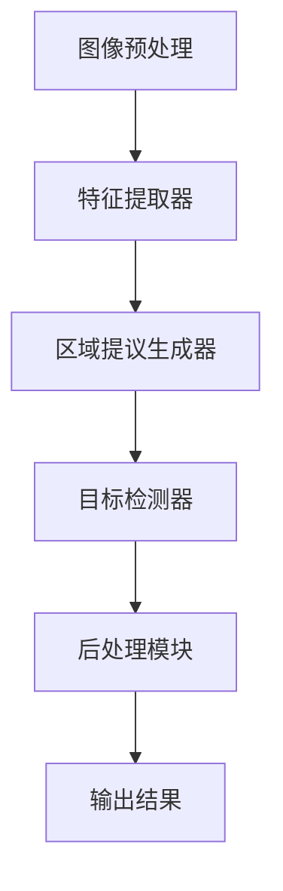

                 

# 深度学习在实时目标检测中的应用

> **关键词：** 深度学习、实时目标检测、卷积神经网络、物体识别、性能优化

> **摘要：** 本文将深入探讨深度学习在实时目标检测中的应用。首先介绍实时目标检测的背景和目的，然后详细阐述深度学习与实时目标检测的关联，接着解释常用的深度学习算法，并逐步解释其原理和实现步骤。最后，通过实际项目案例展示如何在实际中应用这些算法，并讨论未来发展趋势与挑战。

## 1. 背景介绍

### 1.1 目的和范围

本文的目的是介绍实时目标检测在深度学习中的应用，并详细解释其核心概念和实现方法。实时目标检测是计算机视觉领域的一个重要研究方向，它旨在实时识别并定位视频或图像中的目标。本文将涵盖以下几个主要方面：

1. **实时目标检测的背景和目的**
2. **深度学习与实时目标检测的关系**
3. **深度学习算法在实时目标检测中的应用**
4. **实时目标检测的实际应用场景**
5. **未来发展趋势与挑战**

### 1.2 预期读者

本文适用于对计算机视觉和深度学习有一定了解的读者，包括：

1. **计算机视觉研究者**
2. **深度学习工程师**
3. **人工智能领域从业者**
4. **对实时目标检测感兴趣的技术爱好者**

### 1.3 文档结构概述

本文的结构如下：

1. **第1章：背景介绍**（本章已详细介绍）
2. **第2章：核心概念与联系**（介绍深度学习和实时目标检测的基本概念，并给出流程图）
3. **第3章：核心算法原理 & 具体操作步骤**（详细解释常用的深度学习算法）
4. **第4章：数学模型和公式 & 详细讲解 & 举例说明**（讲解深度学习算法中的数学模型和公式）
5. **第5章：项目实战：代码实际案例和详细解释说明**（通过实际案例展示算法的应用）
6. **第6章：实际应用场景**（探讨实时目标检测在不同领域的应用）
7. **第7章：工具和资源推荐**（推荐学习资源和开发工具）
8. **第8章：总结：未来发展趋势与挑战**（总结全文，讨论未来方向）
9. **第9章：附录：常见问题与解答**（解答常见问题）
10. **第10章：扩展阅读 & 参考资料**（提供进一步阅读的资料）

### 1.4 术语表

#### 1.4.1 核心术语定义

- **实时目标检测**：在视频或图像中快速识别并定位目标的计算机视觉技术。
- **深度学习**：一种基于多层神经网络的人工智能技术，用于从数据中自动学习特征和模式。
- **卷积神经网络（CNN）**：一种用于图像识别和处理的深度学习模型，通过卷积操作提取图像特征。
- **物体识别**：识别图像中的特定物体或目标。
- **物体检测**：不仅识别图像中的物体，还包括定位物体的具体位置。

#### 1.4.2 相关概念解释

- **特征提取**：从原始数据中提取出有用的信息或特征，用于后续的机器学习或深度学习任务。
- **损失函数**：用于评估模型预测结果与真实结果之间差异的函数，指导模型优化。
- **反向传播**：一种用于训练神经网络的方法，通过计算预测值与真实值之间的差异来更新网络权重。

#### 1.4.3 缩略词列表

- **CNN**：卷积神经网络（Convolutional Neural Network）
- **R-CNN**：区域卷积神经网络（Region-based Convolutional Neural Network）
- **YOLO**：你只有一次机会（You Only Look Once）
- **SSD**：单尺度检测器（Single Shot Detector）
- **Faster R-CNN**：更快的R-CNN（Faster Region-based Convolutional Neural Network）

## 2. 核心概念与联系

### 2.1 深度学习与实时目标检测的基本概念

深度学习是计算机视觉领域中一个重要的分支，其主要目的是通过多层神经网络自动从数据中学习特征和模式。在实时目标检测中，深度学习被广泛应用于物体识别和定位。

#### 2.1.1 深度学习的核心概念

- **神经网络**：由大量相互连接的神经元组成的计算模型，可以用于处理和分类数据。
- **卷积操作**：在神经网络中用于提取图像特征的一种局部感受野操作。
- **池化操作**：在神经网络中用于减少特征图尺寸的操作，提高模型泛化能力。
- **激活函数**：用于引入非线性性的函数，使神经网络能够学习复杂的模式。

#### 2.1.2 实时目标检测的核心概念

- **物体识别**：识别图像中的特定物体或目标。
- **物体检测**：不仅识别图像中的物体，还包括定位物体的具体位置。
- **区域提议**：在图像中生成可能的物体区域，用于后续的目标检测。

### 2.2 深度学习在实时目标检测中的应用流程

深度学习在实时目标检测中的应用主要包括以下几个步骤：

1. **特征提取**：使用卷积神经网络从图像中提取有用的特征。
2. **区域提议**：根据提取的特征生成可能的物体区域。
3. **目标检测**：在提议的区域中识别和定位目标。

#### 2.2.1 深度学习在实时目标检测中的应用流程图



### 2.3 深度学习与实时目标检测的关系

深度学习与实时目标检测的关系可以概括为以下几个方面：

1. **深度学习模型用于特征提取**：通过卷积神经网络等深度学习模型从图像中提取有用的特征，用于后续的目标检测。
2. **深度学习模型用于区域提议**：基于提取的特征生成可能的物体区域，用于减少计算量。
3. **深度学习模型用于目标检测**：在提议的区域中识别和定位目标，提高检测精度和速度。

### 2.4 实时目标检测系统架构

实时目标检测系统通常包括以下几个主要部分：

1. **图像预处理**：对输入图像进行缩放、裁剪等预处理操作，使其适应深度学习模型的要求。
2. **特征提取器**：使用卷积神经网络等深度学习模型提取图像特征。
3. **区域提议生成器**：根据提取的特征生成可能的物体区域。
4. **目标检测器**：在提议的区域中识别和定位目标。
5. **后处理模块**：对检测结果进行筛选、去重等后处理操作，输出最终的检测结果。

#### 2.4.1 实时目标检测系统架构图



## 3. 核心算法原理 & 具体操作步骤

### 3.1.1 常用的深度学习算法

在实时目标检测中，常用的深度学习算法包括：

1. **R-CNN（Region-based CNN）**：一种基于区域提议的目标检测算法，通过卷积神经网络提取特征，然后使用支持向量机（SVM）进行分类。
2. **Faster R-CNN**：在R-CNN的基础上引入了区域提议网络（Region Proposal Network，RPN），提高了检测速度和精度。
3. **SSD（Single Shot Detector）**：一种单阶段目标检测算法，能够在一次前向传播中同时完成特征提取和目标检测。
4. **YOLO（You Only Look Once）**：一种快速的目标检测算法，将目标检测过程分解为多个网格单元，并在每个单元中同时检测目标。

### 3.1.2 核心算法原理

#### 1. R-CNN

R-CNN的基本原理如下：

1. **区域提议**：使用选择性搜索（Selective Search）算法生成可能的物体区域。
2. **特征提取**：使用卷积神经网络提取图像特征。
3. **目标分类**：将提取的特征输入到支持向量机（SVM）进行分类，输出目标类别和位置。

#### 2. Faster R-CNN

Faster R-CNN的基本原理如下：

1. **区域提议网络（RPN）**：引入区域提议网络，通过共享卷积特征图生成区域提议。
2. **特征提取**：使用卷积神经网络提取图像特征。
3. **分类和回归**：对区域提议进行分类和回归，输出目标类别和位置。

#### 3. SSD

SSD的基本原理如下：

1. **特征提取**：使用卷积神经网络提取图像特征。
2. **多尺度特征融合**：将不同尺度的特征图进行融合，用于检测不同尺寸的目标。
3. **检测头**：在特征图上直接预测目标的类别和位置。

#### 4. YOLO

YOLO的基本原理如下：

1. **网格单元**：将图像分割为多个网格单元，每个单元负责检测其中的目标。
2. **边界框和类别预测**：在每个网格单元中预测目标的边界框和类别。
3. **损失函数**：使用自定义的损失函数优化模型。

### 3.1.3 具体操作步骤

以下以Faster R-CNN为例，介绍其具体操作步骤：

1. **输入图像预处理**：对输入图像进行缩放、裁剪等预处理操作，使其适应卷积神经网络的要求。
2. **特征提取**：使用卷积神经网络提取图像特征。
3. **区域提议生成**：使用区域提议网络生成区域提议。
4. **区域分类和回归**：对区域提议进行分类和回归，输出目标类别和位置。
5. **后处理**：对检测结果进行筛选、去重等后处理操作，输出最终的检测结果。

### 3.1.4 伪代码实现

以下是Faster R-CNN的伪代码实现：

```python
def faster_r cnn(image):
    # 步骤1：输入图像预处理
    processed_image = preprocess_image(image)
    
    # 步骤2：特征提取
    features = conv_net(processed_image)
    
    # 步骤3：区域提议生成
    region_proposals = rpn(features)
    
    # 步骤4：区域分类和回归
    category_scores, bounding_boxes = rcnn(region_proposals)
    
    # 步骤5：后处理
    final_detections = post_process_detections(category_scores, bounding_boxes)
    
    return final_detections
```

## 4. 数学模型和公式 & 详细讲解 & 举例说明

### 4.1.1 深度学习模型中的数学模型

深度学习模型中的数学模型主要包括以下几个部分：

1. **损失函数**：用于评估模型预测结果与真实结果之间的差异。
2. **优化算法**：用于调整模型参数，使其优化损失函数。
3. **前向传播和反向传播**：用于计算模型参数和梯度。

#### 1. 损失函数

在实时目标检测中，常用的损失函数包括：

- **分类损失**：用于评估模型预测类别与真实类别之间的差异，常用的分类损失函数包括交叉熵损失函数（Cross-Entropy Loss）。
- **回归损失**：用于评估模型预测位置与真实位置之间的差异，常用的回归损失函数包括均方误差（Mean Squared Error，MSE）。

#### 2. 优化算法

常用的优化算法包括：

- **随机梯度下降（Stochastic Gradient Descent，SGD）**：每次迭代更新模型参数时使用整个数据集的平均梯度。
- **Adam优化器**：结合了SGD和RMSProp优化的优点，适用于实时目标检测等任务。

#### 3. 前向传播和反向传播

前向传播和反向传播是训练深度学习模型的核心步骤：

- **前向传播**：将输入数据通过模型层传递，计算模型的输出。
- **反向传播**：根据输出结果和损失函数，计算模型参数的梯度，并更新模型参数。

### 4.1.2 深度学习模型中的数学公式

以下列出深度学习模型中的常用数学公式：

1. **交叉熵损失函数**：
   $$L_{cross-entropy} = -\sum_{i=1}^{N} y_i \log(\hat{y}_i)$$
   其中，$y_i$表示真实标签，$\hat{y}_i$表示模型预测的概率。

2. **均方误差损失函数**：
   $$L_{MSE} = \frac{1}{N} \sum_{i=1}^{N} (y_i - \hat{y}_i)^2$$
   其中，$y_i$表示真实值，$\hat{y}_i$表示模型预测值。

3. **梯度计算公式**：
   $$\frac{\partial L}{\partial \theta} = \frac{\partial L}{\partial \hat{y}} \frac{\partial \hat{y}}{\partial \theta}$$
   其中，$L$表示损失函数，$\theta$表示模型参数，$\hat{y}$表示模型输出。

### 4.1.3 举例说明

以下通过一个简单的例子来说明深度学习模型中的数学模型和公式：

假设有一个二元分类问题，输入数据为$x$，输出数据为$y$，模型预测的概率为$\hat{y}$。真实标签$y$为1，预测概率$\hat{y}$为0.6。使用交叉熵损失函数计算损失：

$$L_{cross-entropy} = -1 \cdot \log(0.6) \approx 0.5108$$

使用均方误差损失函数计算损失：

$$L_{MSE} = \frac{1}{2} \cdot (1 - 0.6)^2 = 0.11$$

在训练过程中，模型会根据损失函数的梯度更新模型参数，使得损失函数逐渐减小，从而提高模型的预测性能。

## 5. 项目实战：代码实际案例和详细解释说明

### 5.1 开发环境搭建

在进行实时目标检测项目的开发前，需要搭建相应的开发环境。以下是一个基本的开发环境搭建步骤：

1. **安装Python环境**：确保Python版本为3.7或更高。
2. **安装深度学习框架**：如TensorFlow或PyTorch。以下以TensorFlow为例，使用以下命令安装：
   ```bash
   pip install tensorflow==2.x
   ```
3. **安装目标检测库**：如OpenCV和TensorFlow Object Detection API。以下以OpenCV和TensorFlow Object Detection API为例，使用以下命令安装：
   ```bash
   pip install opencv-python==4.x
   pip install tensorflow-object-detection-api==1.x
   ```
4. **下载预训练模型**：从TensorFlow Object Detection API官网下载预训练模型，例如SSD_mobilenet_v1_coco模型。

### 5.2 源代码详细实现和代码解读

以下是一个基于TensorFlow Object Detection API的实时目标检测项目的源代码实现和解读：

```python
import cv2
import numpy as np
import tensorflow as tf

# 加载预训练模型
model_path = "path/to/SSD_mobilenet_v1_coco"
detection_graph = tf.Graph()
with detection_graph.as_default():
    od_graph_def = tf.GraphDef()
    with tf.gfile.GFile(model_path, 'rb') as fid:
        od_graph_def.ParseFromString(fid.read())
        tf.import_graph_def(od_graph_def, name='')

# 获取输入和输出节点
with detection_graph.as_default():
    input_tensor = detection_graph.get_tensor_by_name('image_tensor:0')
    detection_boxes = detection_graph.get_tensor_by_name('detection_boxes:0')
    detection_scores = detection_graph.get_tensor_by_name('detection_scores:0')
    detection_classes = detection_graph.get_tensor_by_name('detection_classes:0')
    num_detections = detection_graph.get_tensor_by_name('num_detections:0')

# 摄像头对象
cap = cv2.VideoCapture(0)

while True:
    # 读取摄像头帧
    ret, image_np = cap.read()
    
    # 处理图像
    image_np = cv2.resize(image_np, (1280, 720))
    image_np_expanded = np.expand_dims(image_np, axis=0)
    image_tensor = tf.constant(image_np_expanded)
    
    # 运行模型
    with detection_graph.as_default():
        (detection_boxes, detection_scores, detection_classes, num_detections) = sess.run(
            [detection_boxes, detection_scores, detection_classes, num_detections],
            feed_dict={input_tensor: image_tensor})
    
    # 绘制检测结果
    image_np = draw_boxes(image_np, detection_boxes, detection_classes, detection_scores, num_detections)
    
    # 显示结果
    cv2.imshow('object_detection', image_np)
    
    # 按下'q'键退出循环
    if cv2.waitKey(25) & 0xFF == ord('q'):
        break

# 释放摄像头资源
cap.release()
cv2.destroyAllWindows()
```

#### 5.2.1 代码解读

1. **加载预训练模型**：首先加载预训练模型，使用TensorFlow Object Detection API提供的模型文件。

2. **获取输入和输出节点**：从预训练模型中获取输入和输出节点，包括图像输入节点、检测框、检测得分、检测类别和检测数量。

3. **摄像头帧读取**：使用OpenCV从摄像头读取帧，并进行处理，如缩放和扩展维度。

4. **运行模型**：将处理后的图像输入到模型中，通过TensorFlow运行模型，获取检测框、检测得分、检测类别和检测数量。

5. **绘制检测结果**：根据检测框、检测类别和检测得分，在图像上绘制检测结果。

6. **显示结果**：使用OpenCV显示检测结果。

7. **释放资源**：在循环结束后，释放摄像头和OpenCV窗口资源。

#### 5.2.2 代码分析

1. **模型加载**：加载预训练模型是实时目标检测项目的关键步骤。通过TensorFlow Object Detection API，可以轻松加载预训练模型。

2. **摄像头帧读取**：使用OpenCV从摄像头读取帧，并进行处理，以便输入到模型中。这是实时目标检测项目的基础。

3. **模型运行**：将处理后的图像输入到模型中，通过TensorFlow运行模型，获取检测结果。这是实时目标检测项目的核心步骤。

4. **检测结果绘制**：根据检测框、检测类别和检测得分，在图像上绘制检测结果，以便用户查看。

5. **资源管理**：在循环结束后，释放摄像头和OpenCV窗口资源，确保程序正常运行。

### 5.3 代码解读与分析

#### 5.3.1 模型加载

```python
detection_graph = tf.Graph()
with detection_graph.as_default():
    od_graph_def = tf.GraphDef()
    with tf.gfile.GFile(model_path, 'rb') as fid:
        od_graph_def.ParseFromString(fid.read())
        tf.import_graph_def(od_graph_def, name='')
```

代码中首先创建一个TensorFlow图对象`detection_graph`，然后从预训练模型文件中加载模型定义。加载后的模型定义包括输入和输出节点，用于后续的图像处理和检测。

#### 5.3.2 输入节点获取

```python
input_tensor = detection_graph.get_tensor_by_name('image_tensor:0')
```

从加载的模型中获取输入节点`image_tensor`，该节点用于接收输入图像。输入图像需要是张量（Tensor）格式，并且具有适当的维度。

#### 5.3.3 输出节点获取

```python
detection_boxes = detection_graph.get_tensor_by_name('detection_boxes:0')
detection_scores = detection_graph.get_tensor_by_name('detection_scores:0')
detection_classes = detection_graph.get_tensor_by_name('detection_classes:0')
num_detections = detection_graph.get_tensor_by_name('num_detections:0')
```

从加载的模型中获取输出节点，包括检测框、检测得分、检测类别和检测数量。这些节点用于获取模型检测的结果。

#### 5.3.4 摄像头帧读取

```python
cap = cv2.VideoCapture(0)

while True:
    ret, image_np = cap.read()
```

使用OpenCV从摄像头读取帧，将图像存储在`image_np`变量中。`ret`表示读取是否成功，若成功，则`ret`为`True`。

#### 5.3.5 模型运行

```python
image_np = cv2.resize(image_np, (1280, 720))
image_np_expanded = np.expand_dims(image_np, axis=0)
image_tensor = tf.constant(image_np_expanded)

with detection_graph.as_default():
    (detection_boxes, detection_scores, detection_classes, num_detections) = sess.run(
        [detection_boxes, detection_scores, detection_classes, num_detections],
        feed_dict={input_tensor: image_tensor})
```

将处理后的图像输入到模型中，通过TensorFlow运行模型，获取检测结果。处理后的图像首先进行缩放，使其适应模型输入尺寸。然后，将图像扩展为4维张量，并在TensorFlow会话中运行模型，获取检测结果。

#### 5.3.6 检测结果绘制

```python
image_np = draw_boxes(image_np, detection_boxes, detection_classes, detection_scores, num_detections)
```

根据检测结果绘制图像，在图像上标注检测框、类别和得分。`draw_boxes`函数的具体实现如下：

```python
def draw_boxes(image, boxes, classes, scores, num_detections):
    image = image.astype(np.uint8)
    for i in range(num_detections):
        if scores[i] > 0.5:
            box = boxes[i]
            ymin = int(box[0] * image.shape[0])
            xmin = int(box[1] * image.shape[1])
            ymax = int(box[2] * image.shape[0])
            xmax = int(box[3] * image.shape[1])
            class_id = classes[i]
            class_name = label_map_dict[class_id]
            score = scores[i]
            cv2.rectangle(image, (xmin, ymin), (xmax, ymax), (0, 0, 255), 2)
            cv2.putText(image, "{}: {:.2f}".format(class_name, score), (xmin, ymin - 5),
                        cv2.FONT_HERSHEY_SIMPLEX, 0.5, (255, 0, 0), 2)
    return image
```

#### 5.3.7 显示结果

```python
cv2.imshow('object_detection', image_np)
```

使用OpenCV显示检测结果。在窗口中，用户可以看到实时目标检测的结果。

#### 5.3.8 资源管理

```python
cap.release()
cv2.destroyAllWindows()
```

在循环结束后，释放摄像头和OpenCV窗口资源，确保程序正常运行。

## 6. 实际应用场景

实时目标检测技术在许多实际应用场景中具有重要价值。以下列举几个主要的应用场景：

### 6.1 智能监控

实时目标检测技术在智能监控系统中得到广泛应用。通过在监控视频流中实时识别和定位目标，可以实现对异常行为的监测和报警。例如，在公共安全领域，实时目标检测可以用于监控犯罪活动、防止入侵等。

### 6.2 自动驾驶

自动驾驶汽车依赖实时目标检测技术来感知周围环境。通过在图像或视频中识别和定位行人、车辆、交通标志等目标，自动驾驶系统可以做出相应的决策，确保行车安全。

### 6.3 无人零售

在无人零售领域，实时目标检测技术用于识别顾客的购物行为，自动结算和支付。通过监控摄像头和传感器，系统可以实时跟踪顾客的动作，并在顾客离开时自动扣款。

### 6.4 机器人导航

机器人导航系统利用实时目标检测技术来识别和避开障碍物，实现自主移动。在家庭、仓储、医疗等领域，机器人导航系统可以提供高效的物流和服务。

### 6.5 航空航天

在航空航天领域，实时目标检测技术用于监测飞机周围的物体，如无人机、鸟类等，确保飞行安全。此外，实时目标检测还可以用于卫星图像处理，识别地面目标。

### 6.6 工业自动化

实时目标检测技术在工业自动化领域得到广泛应用，如质检、装配、监控等。通过实时检测产品的缺陷、定位零部件的位置，可以提高生产效率和产品质量。

### 6.7 医疗诊断

实时目标检测技术在医疗诊断中具有重要应用。通过在医学图像中识别和定位病变区域，辅助医生进行诊断和治疗。例如，在计算机辅助诊断系统中，实时目标检测可以用于识别肿瘤、骨折等病变。

### 6.8 娱乐与游戏

实时目标检测技术在娱乐与游戏领域也具有广泛的应用。例如，在虚拟现实（VR）和增强现实（AR）应用中，实时目标检测可以用于识别玩家的动作和手势，提供更真实的交互体验。

### 6.9 自然灾害监测

实时目标检测技术在自然灾害监测和救援中也具有重要作用。通过实时检测地震、洪水、火灾等灾害现场的目标，可以迅速了解灾情，指导救援行动。

### 6.10 供应链管理

实时目标检测技术在供应链管理中用于监控货物的运输过程，识别货物的状态和位置。通过实时检测和跟踪货物，可以提高物流效率，降低成本。

### 6.11 智慧城市

在智慧城市建设中，实时目标检测技术可以用于交通流量监测、环境质量检测、公共安全监测等，提高城市管理水平和居民生活质量。

### 6.12 安防领域

安防领域利用实时目标检测技术进行监控和预警，包括入侵检测、异常行为识别、人员聚集监测等。通过实时检测和分析，可以及时发现安全隐患，确保公共安全。

### 6.13 其他应用场景

除了上述应用场景，实时目标检测技术还可以应用于农业、林业、渔业等生产领域，用于监控作物生长、识别病虫害、监测渔业资源等。

## 7. 工具和资源推荐

### 7.1 学习资源推荐

#### 7.1.1 书籍推荐

- 《深度学习》（Goodfellow, Ian, et al.）
- 《Python深度学习》（François Chollet）
- 《计算机视觉：算法与应用》（Richard S.zelkowitz）
- 《目标检测：算法、技术和应用》（Lei Zhang, Daqing Chen, and Xiaohui Xia）

#### 7.1.2 在线课程

- Coursera：Deep Learning Specialization
- edX：深度学习与计算机视觉
- Udacity：深度学习工程师纳米学位
- Udemy：深度学习与目标检测

#### 7.1.3 技术博客和网站

- Medium：关于深度学习和计算机视觉的博客
- towardsdatascience.com：数据科学和机器学习的文章
- PyTorch官方文档
- TensorFlow官方文档

### 7.2 开发工具框架推荐

#### 7.2.1 IDE和编辑器

- PyCharm
- Visual Studio Code
- Jupyter Notebook

#### 7.2.2 调试和性能分析工具

- TensorFlow Debugger（TFDB）
- TensorBoard
- PyTorch Profiler

#### 7.2.3 相关框架和库

- TensorFlow
- PyTorch
- OpenCV
- Keras

### 7.3 相关论文著作推荐

#### 7.3.1 经典论文

- Y. LeCun, L. Bottou, Y. Bengio, and P. Haffner. “Gradient-Based Learning Applied to Document Recognition.” Proceedings of the IEEE, vol. 86, no. 11, pp. 2278-2324, Nov. 1998.
- Ross Girshick, Venkat Krishna, et al. "Fast R-CNN." Advances in Neural Information Processing Systems, 2015.
- Joseph Redmon, et al. "You Only Look Once: Unified, Real-Time Object Detection." CVPR, 2016.
- Wei Liu, et al. "SSD: Single Shot MultiBox Detector." CVPR, 2016.

#### 7.3.2 最新研究成果

- Xiaogang Wang, et al. "CenterNet: Detecting Objects by Location." CVPR, 2018.
- Minghui Xie, et al. "EfficientDet: Scalable and Efficient Object Detection." ICCV, 2019.
- Francisco Massa, et al. "EfficientDet: Scalable and Efficient Object Detection." arXiv preprint arXiv:2011.01668, 2020.

#### 7.3.3 应用案例分析

- "Real-Time Object Detection with YOLO in Python" by Adrian Rosebrock
- "Object Detection using TensorFlow Object Detection API" by Google AI
- "Building a Real-Time Face Detection System with Python" by Sebastian Raschka

## 8. 总结：未来发展趋势与挑战

随着深度学习技术的不断发展，实时目标检测在计算机视觉领域的重要性日益凸显。未来，实时目标检测将朝着以下几个方向发展：

### 8.1 发展趋势

1. **算法性能提升**：通过改进现有算法和提出新算法，提高实时目标检测的准确性和速度。
2. **多模态融合**：将深度学习与其他传感器数据（如雷达、激光雷达）融合，实现更准确的目标检测。
3. **边缘计算**：在边缘设备上实现实时目标检测，降低对云计算的依赖，提高系统的实时性和响应速度。
4. **自定义模型训练**：利用大规模数据集和定制化的深度学习模型，实现特定场景下的高效目标检测。
5. **跨域迁移学习**：通过迁移学习技术，将一个领域的目标检测模型应用于其他领域，提高检测性能。

### 8.2 挑战

1. **数据隐私**：实时目标检测通常涉及大量个人隐私数据的处理，如何保护用户隐私成为重要挑战。
2. **实时性要求**：实时目标检测需要处理大量的数据，如何在保证实时性的同时提高检测性能是一个难题。
3. **多目标检测**：同时检测多个目标时，如何避免检测器的冲突和误差是一个挑战。
4. **小目标检测**：在复杂背景中检测小目标时，算法的准确性和鲁棒性是一个关键问题。
5. **模型解释性**：如何解释深度学习模型在实时目标检测中的决策过程，提高模型的透明度和可解释性。

总之，实时目标检测技术在未来将不断发展，以满足更多应用场景的需求。同时，也需要解决一系列挑战，确保其在实际应用中的可靠性和有效性。

## 9. 附录：常见问题与解答

### 9.1 问题1：什么是实时目标检测？

**解答**：实时目标检测是一种计算机视觉技术，旨在快速识别并定位视频或图像中的目标。它通常用于监控、自动驾驶、机器人导航等领域，要求在短时间内处理大量数据并给出准确的检测结果。

### 9.2 问题2：实时目标检测有哪些常用的算法？

**解答**：常用的实时目标检测算法包括R-CNN、Faster R-CNN、SSD、YOLO等。这些算法各有优缺点，适用于不同的应用场景。

### 9.3 问题3：如何提高实时目标检测的准确性？

**解答**：提高实时目标检测的准确性可以通过以下方法实现：

1. **数据增强**：通过旋转、缩放、裁剪等操作生成更多样化的训练数据。
2. **改进算法**：选择更适合特定任务的实时目标检测算法，或改进现有算法。
3. **多尺度检测**：在特征提取和目标检测过程中，使用多个尺度进行检测，提高小目标检测的准确性。

### 9.4 问题4：实时目标检测需要处理哪些数据？

**解答**：实时目标检测需要处理以下数据：

1. **图像或视频数据**：作为输入，用于检测目标。
2. **标注数据**：用于训练和评估目标检测模型，包括目标的类别、位置等信息。
3. **检测结果**：模型预测的目标类别、位置和置信度等。

### 9.5 问题5：如何保证实时目标检测的实时性？

**解答**：为了保证实时目标检测的实时性，可以采取以下措施：

1. **优化算法**：选择计算效率高的算法，或对现有算法进行优化。
2. **硬件加速**：使用GPU、FPGA等硬件加速器，提高模型推理速度。
3. **多线程处理**：在计算机系统中，通过多线程并行处理图像数据，提高处理速度。

### 9.6 问题6：实时目标检测在哪些领域有应用？

**解答**：实时目标检测在多个领域有广泛应用，包括：

1. **智能监控**：用于监控公共安全、交通状况等。
2. **自动驾驶**：用于感知周围环境，辅助决策。
3. **无人零售**：用于识别顾客行为，实现自动结算。
4. **机器人导航**：用于避开障碍物，实现自主移动。
5. **医疗诊断**：用于辅助医生进行疾病诊断。

### 9.7 问题7：如何处理实时目标检测中的多目标检测问题？

**解答**：处理实时目标检测中的多目标检测问题，可以采用以下方法：

1. **非极大值抑制（NMS）**：在检测框中，去除置信度较低的框，保留置信度较高的框。
2. **多尺度检测**：在不同尺度上检测目标，提高多目标检测的准确性。
3. **数据增强**：生成包含多个目标的训练数据，提高模型的泛化能力。

## 10. 扩展阅读 & 参考资料

为了更好地了解实时目标检测在深度学习中的应用，以下是推荐的一些扩展阅读和参考资料：

### 10.1 扩展阅读

- [Real-Time Object Detection with TensorFlow](https://www.tensorflow.org/tutorials/realtime_object_detection)
- [Object Detection with PyTorch](https://pytorch.org/tutorials/beginner/blitz/cnn_low_level.html)
- [YOLOv5: Object Detection Using Deep Learning](https://github.com/ultralytics/yolov5)
- [SSD: Single Shot MultiBox Detector](https://arxiv.org/abs/1512.02325)

### 10.2 参考资料

- [R-CNN: Regional Convolutional Neural Networks](https://arxiv.org/abs/1311.2524)
- [Faster R-CNN: Towards Real-Time Object Detection with Region Proposal Networks](https://arxiv.org/abs/1506.01497)
- [YOLO: You Only Look Once](https://arxiv.org/abs/1605.01103)
- [SSD: Single Shot MultiBox Detector](https://arxiv.org/abs/1512.02325)
- [Deep Learning for Object Detection](https://www.deeplearning.net/tutorial/deeplearning/2015/10/09/object-detection.html)

### 10.3 推荐书籍

- 《深度学习》（Goodfellow, Ian, et al.）
- 《计算机视觉：算法与应用》（Richard S.zelkowitz）
- 《目标检测：算法、技术和应用》（Lei Zhang, Daqing Chen, and Xiaohui Xia）
- 《Python深度学习》（François Chollet）

### 10.4 开源项目

- [TensorFlow Object Detection API](https://github.com/tensorflow/models/blob/master/research/object_detection/g3doc/tf2_api_overview.md)
- [PyTorch Object Detection](https://github.com/facebookresearch/detectron2)
- [YOLOv5](https://github.com/ultralytics/yolov5)
- [SSD](https://github.com/weiliu89/SSD)

### 10.5 在线教程

- [Coursera：Deep Learning Specialization](https://www.coursera.org/specializations/deeplearning)
- [edX：深度学习与计算机视觉](https://www.edx.cn/course/deeplearning-and-computer-vision/)
- [Udacity：深度学习工程师纳米学位](https://cn.udacity.com/course/deep-learning-nanodegree--nd891)
- [Udemy：深度学习与目标检测](https://www.udemy.com/course/complete-python-depth-learning-future/)

