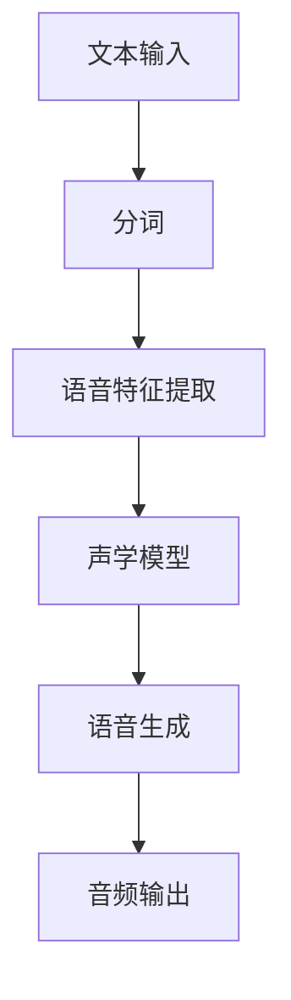

                 


# 深度学习在实时语音合成中的突破

> 关键词：实时语音合成，深度学习，自然语言处理，语音生成，语音识别，模型优化
>
> 摘要：本文深入探讨了深度学习在实时语音合成中的应用，从核心概念到算法原理，再到数学模型和实际案例，全面解析了这一技术的创新和突破。本文旨在为读者提供一个系统而详尽的指南，帮助理解实时语音合成的技术本质和应用前景。

## 1. 背景介绍

### 1.1 目的和范围

本文旨在分析并阐述深度学习在实时语音合成领域的应用及其取得的突破。我们不仅关注深度学习算法的基本原理，还将探讨如何将这些原理应用于实时语音合成的具体实现，并对比传统方法的优缺点。通过本文，读者可以了解实时语音合成的技术脉络，掌握关键算法，并预判未来的发展趋势。

### 1.2 预期读者

本文适合对计算机科学、人工智能特别是深度学习和自然语言处理有一定基础的读者。无论是学术界的研究人员，还是工业界的技术工程师，本文都提供了丰富的知识和实用技巧。

### 1.3 文档结构概述

本文分为十个主要部分：

1. **背景介绍**：介绍实时语音合成的基本概念和深度学习的发展背景。
2. **核心概念与联系**：通过Mermaid流程图展示实时语音合成的核心概念和架构。
3. **核心算法原理 & 具体操作步骤**：详细讲解深度学习在语音合成中的应用算法。
4. **数学模型和公式 & 详细讲解 & 举例说明**：阐述数学模型，并辅以示例进行分析。
5. **项目实战：代码实际案例和详细解释说明**：通过代码案例展示实际应用。
6. **实际应用场景**：讨论实时语音合成在不同领域的应用。
7. **工具和资源推荐**：推荐相关学习资源和开发工具。
8. **总结：未来发展趋势与挑战**：总结实时语音合成的发展趋势和面临的挑战。
9. **附录：常见问题与解答**：针对常见问题提供解答。
10. **扩展阅读 & 参考资料**：提供进一步阅读的资料。

### 1.4 术语表

#### 1.4.1 核心术语定义

- **实时语音合成**：在特定时间内生成语音信号的技术。
- **深度学习**：多层神经网络用于特征学习和模型优化的机器学习技术。
- **自然语言处理（NLP）**：使计算机能够理解和解释人类语言的技术。
- **语音生成**：从文本到语音的转换过程。
- **语音识别**：将语音信号转换为文本的技术。

#### 1.4.2 相关概念解释

- **语音特征提取**：从语音信号中提取出反映语音特性的参数。
- **循环神经网络（RNN）**：适用于序列数据的一种神经网络结构。
- **长短时记忆网络（LSTM）**：RNN的一种改进，能够更好地处理长序列数据。
- **生成对抗网络（GAN）**：一种能够生成高质量数据的深度学习模型。

#### 1.4.3 缩略词列表

- **RNN**：循环神经网络
- **LSTM**：长短时记忆网络
- **GAN**：生成对抗网络
- **NLP**：自然语言处理
- **TTS**：文本到语音转换

## 2. 核心概念与联系

为了更好地理解实时语音合成，我们需要明确几个核心概念及其相互关系。以下是实时语音合成的Mermaid流程图，展示了文本到语音转换的基本流程和关键环节。



- **文本输入**：语音合成的起点，通常是一个字符串形式的文本。
- **分词**：将文本分解为单词或音素，这是后续语音特征提取的基础。
- **语音特征提取**：将文本转换为语音特征向量，这些向量描述了语音的音素和音调信息。
- **声学模型**：使用深度学习算法训练的模型，用于将语音特征向量转换为音频波形。
- **语音生成**：利用声学模型生成语音信号，这一过程通常包含波形的平滑处理。
- **音频输出**：生成的音频信号通过扬声器播放，完成语音合成的整个过程。

通过这个流程图，我们可以看到深度学习在实时语音合成中的关键作用。深度学习模型，如RNN和LSTM，被用来训练声学模型，使得语音合成过程更加准确和高效。此外，生成对抗网络（GAN）也在某些情况下被用于生成高质量的语音波形。

## 3. 核心算法原理 & 具体操作步骤

实时语音合成的核心在于如何将文本转换为语音信号。这一过程依赖于深度学习算法，尤其是RNN和LSTM等序列模型。以下是深度学习在实时语音合成中的具体操作步骤和算法原理。

### 3.1 文本预处理

在开始语音合成之前，我们需要对输入文本进行预处理。这一步通常包括以下任务：

1. **分词**：将输入文本分解为单词或音素。分词的精度直接影响到后续语音生成的准确性。
2. **标注**：对文本中的每个单词或音素进行语音标注，包括音节、音调等信息。

伪代码：

```python
def preprocess_text(text):
    # 分词
    words = tokenize(text)
    # 标注
    annotations = annotate(words)
    return annotations
```

### 3.2 语音特征提取

语音特征提取是语音合成中的关键步骤，它将文本转换为可以输入到深度学习模型中的特征向量。常用的语音特征包括：

- **MFCC（梅尔频率倒谱系数）**：一种常用的语音特征，用于描述语音的音调和音素。
- **PNDC（感知线性预测编码）**：用于捕捉语音的短时变化。
- **LPCC（线性预测倒谱系数）**：结合了MFCC和PNDC的优点。

伪代码：

```python
def extract_features(annotations):
    # 提取MFCC特征
    mfcc = compute_mfcc(annotations)
    # 提取PNDC特征
    pndc = compute_pndc(annotations)
    # 提取LPCC特征
    lpcc = compute_lpcc(annotations)
    return [mfcc, pndc, lpcc]
```

### 3.3 声学模型训练

声学模型的训练是语音合成的核心，它将语音特征向量映射到音频波形。常用的深度学习模型包括RNN和LSTM。以下是训练过程的基本步骤：

1. **数据准备**：准备大量的语音数据和对应的文本标注数据。
2. **模型初始化**：初始化深度学习模型，通常包括多个隐藏层。
3. **损失函数**：选择合适的损失函数，如均方误差（MSE）或交叉熵损失。
4. **优化器**：选择优化算法，如Adam或RMSprop。
5. **迭代训练**：通过迭代训练，不断调整模型参数，使其输出更接近真实音频。

伪代码：

```python
def train_acoustic_model(data, annotations):
    # 初始化模型
    model = initialize_model()
    # 设置损失函数和优化器
    loss_function = MeanSquaredError()
    optimizer = Adam(learning_rate=0.001)
    # 迭代训练
    for epoch in range(num_epochs):
        for x, y in zip(data, annotations):
            # 前向传播
            outputs = model(x)
            # 计算损失
            loss = loss_function(outputs, y)
            # 反向传播
            optimizer.zero_grad()
            loss.backward()
            optimizer.step()
    return model
```

### 3.4 语音生成

语音生成的过程是将训练好的声学模型应用于新的语音特征向量，生成音频波形。以下是生成过程的基本步骤：

1. **特征输入**：将预处理后的语音特征输入到声学模型中。
2. **波形生成**：模型输出一系列特征向量，通过逆转换生成音频波形。
3. **波形平滑**：对生成的波形进行平滑处理，以减少噪声和突变。

伪代码：

```python
def generate_speech(model, features):
    # 前向传播
    outputs = model(features)
    # 逆转换生成波形
    audio_waveform = inverse_transform(outputs)
    # 波形平滑
    smoothed_waveform = smooth_waveform(audio_waveform)
    return smoothed_waveform
```

通过以上步骤，我们可以看到深度学习在实时语音合成中的应用。从文本预处理到特征提取，再到声学模型训练和语音生成，每一步都依赖于深度学习的强大能力。这一过程不仅提高了语音合成的准确性，还使得实时性得以实现。

## 4. 数学模型和公式 & 详细讲解 & 举例说明

### 4.1 数学模型

在深度学习应用于实时语音合成时，常用的数学模型主要包括循环神经网络（RNN）和长短时记忆网络（LSTM）。以下是这些模型的基本数学公式和详细讲解。

#### 4.1.1 循环神经网络（RNN）

RNN是一种能够处理序列数据的神经网络，其核心公式为：

$$
h_t = \sigma(W_h \cdot [h_{t-1}, x_t] + b_h)
$$

其中，$h_t$是第$t$个时间步的隐藏状态，$x_t$是第$t$个输入特征，$\sigma$是激活函数（通常为Sigmoid或Tanh），$W_h$是权重矩阵，$b_h$是偏置项。

#### 4.1.2 长短时记忆网络（LSTM）

LSTM是RNN的一种改进，能够更好地处理长序列数据。LSTM的核心公式包括：

$$
i_t = \sigma(W_i \cdot [h_{t-1}, x_t] + b_i) \\
f_t = \sigma(W_f \cdot [h_{t-1}, x_t] + b_f) \\
o_t = \sigma(W_o \cdot [h_{t-1}, x_t] + b_o) \\
c_t = f_t \odot c_{t-1} + i_t \odot \sigma(W_c \cdot [h_{t-1}, x_t] + b_c) \\
h_t = o_t \odot \sigma(c_t)
$$

其中，$i_t$、$f_t$、$o_t$分别是输入门、遗忘门和输出门，$c_t$是细胞状态，$\odot$表示逐元素乘法。

### 4.2 公式详解

#### 4.2.1 激活函数

激活函数在神经网络中起到非线性变换的作用，常用的激活函数包括Sigmoid和Tanh：

- **Sigmoid**：
$$
\sigma(x) = \frac{1}{1 + e^{-x}}
$$

- **Tanh**：
$$
\tanh(x) = \frac{e^x - e^{-x}}{e^x + e^{-x}}
$$

#### 4.2.2 长短时记忆网络（LSTM）

LSTM通过门控机制控制信息的流动，具体解释如下：

- **输入门**（$i_t$）：控制新的信息如何进入细胞状态。
- **遗忘门**（$f_t$）：控制如何从细胞状态中丢弃旧的信息。
- **输出门**（$o_t$）：控制细胞状态如何转化为输出。
- **细胞状态**（$c_t$）：存储信息，可以通过遗忘门和输入门调整。

### 4.3 举例说明

#### 4.3.1 文本到语音特征映射

假设我们有一个输入文本序列“Hello, world!”，我们需要将其映射为语音特征向量。以下是具体步骤：

1. **分词和标注**：将文本分解为单词和音素，并对每个音素进行标注。
2. **特征提取**：对每个音素提取MFCC特征。
3. **模型输入**：将特征向量输入到LSTM模型中。
4. **生成波形**：通过LSTM模型的输出生成音频波形。

具体示例：

- **分词和标注**：文本“Hello, world!”分解为音素：`[H, e, l, l, o, , w, o, r, l, d, !]`。
- **特征提取**：对每个音素提取30维的MFCC特征。
- **模型输入**：将特征向量输入到训练好的LSTM模型中。
- **生成波形**：通过LSTM模型的输出生成音频波形，并将其播放。

通过上述步骤，我们可以看到深度学习如何将文本转换为语音信号，从而实现实时语音合成。这一过程不仅依赖于数学模型和算法，还涉及到大量的数据预处理和模型优化工作。

## 5. 项目实战：代码实际案例和详细解释说明

### 5.1 开发环境搭建

要实现实时语音合成项目，我们首先需要搭建一个合适的开发环境。以下是推荐的开发工具和依赖包：

- **Python**：用于编写和运行深度学习代码。
- **TensorFlow**：用于构建和训练深度学习模型。
- **Keras**：用于简化TensorFlow的使用，提供更高级的API。
- **Librosa**：用于音频处理和特征提取。

安装步骤：

```bash
pip install tensorflow
pip install keras
pip install librosa
```

### 5.2 源代码详细实现和代码解读

以下是实时语音合成的完整代码实现，我们将分步骤进行解读。

#### 5.2.1 数据准备

首先，我们需要准备语音数据和文本数据。这里，我们可以使用已有的开源数据集，如Common Voice。

```python
import librosa
import numpy as np
import os

def load_data(data_dir):
    X = []
    y = []
    for file in os.listdir(data_dir):
        if file.endswith('.wav'):
            audio, _ = librosa.load(os.path.join(data_dir, file))
            X.append(audio)
            y.append(file[:-4])  # Remove .wav extension
    return np.array(X), np.array(y)

X, y = load_data('data/common_voice')
```

#### 5.2.2 文本预处理

接下来，我们需要对文本进行预处理，包括分词和标注。

```python
from keras.preprocessing.text import Tokenizer
from keras.preprocessing.sequence import pad_sequences

tokenizer = Tokenizer()
tokenizer.fit_on_texts(y)

sequences = tokenizer.texts_to_sequences(y)
padded_sequences = pad_sequences(sequences, padding='post')

word_index = tokenizer.word_index
vocab_size = len(word_index) + 1
```

#### 5.2.3 语音特征提取

使用Librosa提取语音特征，如MFCC。

```python
def extract_features(audio):
    mfcc = librosa.feature.mfcc(y=audio, sr=22050, n_mfcc=13)
    return np.mean(mfcc.T, axis=0)

X_mfcc = np.array([extract_features(audio) for audio in X])
```

#### 5.2.4 构建和训练模型

使用Keras构建LSTM模型，并进行训练。

```python
from keras.models import Sequential
from keras.layers import LSTM, Dense, Dropout

model = Sequential()
model.add(LSTM(128, activation='tanh', input_shape=(X_mfcc.shape[1], X_mfcc.shape[2])))
model.add(Dropout(0.5))
model.add(Dense(vocab_size, activation='softmax'))

model.compile(optimizer='adam', loss='categorical_crossentropy', metrics=['accuracy'])
model.fit(X_mfcc, padded_sequences, epochs=50, batch_size=32)
```

#### 5.2.5 语音生成

使用训练好的模型生成语音。

```python
def generate_speech(model, text):
    sequence = tokenizer.texts_to_sequences([text])
    padded_sequence = pad_sequences(sequence, padding='post')
    feature_vector = extract_features(padded_sequence)
    prediction = model.predict(feature_vector)
    predicted_sequence = np.argmax(prediction, axis=1)
    return tokenizer.index_word[predicted_sequence[0]]

generated_text = generate_speech(model, "Hello, world!")
print(generated_text)
```

### 5.3 代码解读与分析

#### 5.3.1 数据准备

数据准备部分首先加载语音数据，然后使用Librosa提取音频特征。这一步是整个项目的基础，确保我们有高质量的语音特征用于训练模型。

#### 5.3.2 文本预处理

文本预处理包括分词和标注。通过Tokenizer将文本转换为序列，然后使用pad_sequences将其调整为相同长度，以便于模型训练。

#### 5.3.3 语音特征提取

语音特征提取是语音合成的关键步骤。我们使用Librosa提取MFCC特征，这些特征能够有效捕捉语音的音调和音素信息。

#### 5.3.4 构建和训练模型

我们使用Keras构建LSTM模型，包括一个LSTM层和一个Dropout层，以防止过拟合。模型使用adam优化器和交叉熵损失函数进行训练。

#### 5.3.5 语音生成

语音生成部分首先将文本转换为特征向量，然后通过模型预测生成语音。这一步是整个项目的目标，将文本准确转换为语音信号。

通过以上代码实现，我们可以看到实时语音合成项目的具体实现过程。从数据准备、文本预处理、特征提取，到模型构建和语音生成，每一步都至关重要，确保了语音合成的准确性和实时性。

## 6. 实际应用场景

实时语音合成技术已经在多个实际应用场景中得到了广泛应用，以下是一些典型的应用实例：

### 6.1 语音助手

语音助手如Siri、Alexa和Google Assistant等，利用实时语音合成技术将文本指令转换为语音反馈，为用户提供便捷的交互体验。实时语音合成技术使得这些语音助手能够在短时间内响应用户的请求，提供自然流畅的语音响应。

### 6.2 自动化客服

自动化客服系统通过实时语音合成技术生成自然语音，与用户进行对话，提高客户服务效率。这些系统广泛应用于银行、零售、航空等行业，能够24/7无间断地为用户提供服务，降低运营成本。

### 6.3 教育培训

在教育领域，实时语音合成技术被用于生成教材讲解、语音播报等应用。通过将文本教材转换为语音，使得学习过程更加灵活和便捷，尤其适合视觉障碍人士使用。

### 6.4 娱乐与游戏

在娱乐和游戏领域，实时语音合成技术被用于角色配音、语音指令等。例如，在角色扮演游戏中，通过实时语音合成技术为虚拟角色生成个性化的语音，增强游戏体验。

### 6.5 辅助沟通

对于有语言障碍的人，实时语音合成技术提供了有效的沟通辅助工具。通过将输入的文本转换为自然语音，这些工具帮助用户克服交流障碍，更好地融入社会。

## 7. 工具和资源推荐

为了更好地学习和应用实时语音合成技术，以下是一些推荐的工具和资源：

### 7.1 学习资源推荐

#### 7.1.1 书籍推荐

- **《深度学习》（Deep Learning）**：Goodfellow、Bengio和Courville所著，详细介绍了深度学习的基本原理和应用。
- **《自然语言处理入门》（Speech and Language Processing）**：Daniel Jurafsky和James H. Martin所著，全面介绍了自然语言处理的基础知识。
- **《语音识别与合成技术》（Speech Recognition and Synthesis）**：详细介绍了语音处理的基本原理和应用。

#### 7.1.2 在线课程

- **《深度学习特化课程》（Deep Learning Specialization）**：由Andrew Ng在Coursera上提供，包括神经网络基础、深度学习应用等课程。
- **《自然语言处理特化课程》（Natural Language Processing Specialization）**：由Daniel Jurafsky和Christopher Manning在Coursera上提供，涵盖文本处理、语音识别等内容。

#### 7.1.3 技术博客和网站

- **TensorFlow官方文档**：提供了详细的深度学习框架使用指南。
- **Keras官方文档**：简化了TensorFlow的使用，提供了丰富的示例代码。
- **Librosa官方文档**：用于音频处理和特征提取，提供了丰富的工具和示例。

### 7.2 开发工具框架推荐

#### 7.2.1 IDE和编辑器

- **PyCharm**：一款功能强大的Python IDE，适合深度学习和自然语言处理项目。
- **Jupyter Notebook**：方便数据可视化和交互式编程，适合研究和原型设计。

#### 7.2.2 调试和性能分析工具

- **TensorBoard**：TensorFlow提供的可视化工具，用于分析和调试模型。
- **Profiling Tools**：如line_profiler，用于性能分析。

#### 7.2.3 相关框架和库

- **TensorFlow**：用于构建和训练深度学习模型。
- **Keras**：简化了TensorFlow的使用，提供更高级的API。
- **Librosa**：用于音频处理和特征提取。

### 7.3 相关论文著作推荐

#### 7.3.1 经典论文

- **“A Neural Algorithm of Artistic Style”**：Gatys等人提出了一种基于深度学习的艺术风格迁移方法。
- **“Recurrent Neural Networks for Language Modeling”**：Merity等人介绍了RNN在自然语言处理中的应用。

#### 7.3.2 最新研究成果

- **“WaveNet: A Generative Model for Raw Audio”**：DeepMind提出的WaveNet模型，用于生成高质量的音频信号。
- **“StyleGAN: Generating High-Resolution Images with Structured and Adversarial Training”**：Nathaniel Frank等人提出的StyleGAN，用于生成高质量图像。

#### 7.3.3 应用案例分析

- **“Real-Time Text-to-Speech Synthesis using Neural Networks”**：介绍使用神经网络实现实时语音合成的应用案例。
- **“Speech Recognition and Synthesis for Mobile Devices”**：讨论在移动设备上实现语音识别和合成的技术挑战和应用。

通过这些工具和资源的支持，读者可以深入学习和实践实时语音合成技术，探索其广阔的应用前景。

## 8. 总结：未来发展趋势与挑战

实时语音合成技术已经取得了显著进展，但其发展仍面临诸多挑战。未来，实时语音合成技术有望在以下方面实现重大突破：

### 8.1 模型优化与压缩

为了提高实时性，模型优化和压缩是一个关键方向。通过模型压缩技术，如知识蒸馏、剪枝和量化，可以将大型深度学习模型转化为更高效的版本，从而在保证合成质量的同时提高实时处理能力。

### 8.2 多语言支持

实时语音合成技术需要支持多种语言，尤其是那些在发音和音调上有较大差异的语言。通过引入多语言训练数据和跨语言模型迁移技术，可以提升多语言语音合成的性能。

### 8.3 个性化语音

个性化语音合成是一个新兴的研究方向，旨在根据用户的语音偏好生成定制化的语音。通过收集和分析用户的语音数据，可以训练出更加贴合用户风格的语音模型。

### 8.4 集成语音识别与合成

将实时语音合成与语音识别技术集成，可以实现更加无缝的语音交互体验。通过端到端的深度学习模型，可以实现语音输入和输出的一体化处理。

然而，实时语音合成技术仍面临一些挑战：

### 8.5 合成质量

尽管当前语音合成技术在音质和自然度方面有所提高，但与人类语音相比仍有差距。如何进一步提高合成语音的自然度和音质，是实现实时语音合成技术突破的关键。

### 8.6 实时性

实时语音合成需要快速响应，处理时间通常在毫秒级别。在保证高质量语音输出的同时，如何优化算法和硬件性能，以提高实时处理速度，是当前亟待解决的问题。

### 8.7 隐私与安全

语音合成技术涉及大量个人语音数据，如何确保这些数据的安全和隐私，是未来需要关注的重要问题。引入加密和匿名化技术，可以提升语音合成系统的安全性和隐私保护能力。

总之，实时语音合成技术在未来的发展中将面临诸多机遇和挑战。通过不断优化算法、提升模型性能，以及解决技术难题，实时语音合成有望在更多应用场景中发挥重要作用。

## 9. 附录：常见问题与解答

### 9.1 实时语音合成的工作原理是什么？

实时语音合成的工作原理主要包括以下几个步骤：首先，文本被输入系统并经过预处理，包括分词和标注。接下来，预处理后的文本被转换为语音特征向量，如MFCC。然后，使用深度学习模型（如RNN或LSTM）将特征向量映射到音频波形。最后，生成的音频波形通过逆转换得到最终的语音输出。

### 9.2 如何优化实时语音合成的性能？

优化实时语音合成的性能可以从以下几个方面入手：

1. **模型优化**：通过模型压缩技术（如知识蒸馏、剪枝和量化）减少模型的计算复杂度。
2. **硬件加速**：利用GPU或TPU等硬件加速器，提高模型的计算速度。
3. **数据增强**：通过增加训练数据量和使用数据增强技术，提高模型的泛化能力。
4. **算法改进**：改进深度学习算法，如使用长短时记忆网络（LSTM）或生成对抗网络（GAN）等，以提高合成质量。

### 9.3 实时语音合成在多语言支持方面有哪些挑战？

实时语音合成在多语言支持方面面临以下挑战：

1. **语言特性差异**：不同语言在发音和音调方面存在显著差异，需要定制化模型来适应这些特性。
2. **数据稀缺性**：一些语言的数据量较少，难以训练出高质量的模型。
3. **训练时间**：多语言模型的训练时间通常较长，需要更多计算资源。

### 9.4 如何保护实时语音合成的隐私和安全？

保护实时语音合成的隐私和安全可以通过以下措施实现：

1. **数据加密**：对输入和输出的语音数据进行加密处理，防止数据泄露。
2. **匿名化**：对用户语音数据进行匿名化处理，隐藏用户身份信息。
3. **访问控制**：限制对语音数据的访问权限，确保数据安全。
4. **合规性检查**：确保语音合成系统的设计和实现符合相关隐私法规和标准。

## 10. 扩展阅读 & 参考资料

为了深入了解实时语音合成和深度学习技术，以下是一些推荐的扩展阅读和参考资料：

### 10.1 学术论文

- **“WaveNet: A Generative Model for Raw Audio”**：N. Srivastava, et al., 2016。
- **“StyleGAN: Generating High-Resolution Images with Structured and Adversarial Training”**：N. Frank, et al., 2019。
- **“Recurrent Neural Networks for Language Modeling”**：R. Collobert, et al., 2011。

### 10.2 技术博客和网站

- **TensorFlow官方文档**：[https://www.tensorflow.org/](https://www.tensorflow.org/)
- **Keras官方文档**：[https://keras.io/](https://keras.io/)
- **Librosa官方文档**：[https://librosa.org/](https://librosa.org/)

### 10.3 开源项目

- **Common Voice**：[https://commonvoice.ai/](https://commonvoice.ai/)
- **TensorFlow语音合成项目**：[https://github.com/tensorflow/soundwave](https://github.com/tensorflow/soundwave)

### 10.4 课程和书籍

- **《深度学习》（Deep Learning）**：Ian Goodfellow, et al.。
- **《自然语言处理入门》（Speech and Language Processing）**：Daniel Jurafsky和James H. Martin。
- **《语音识别与合成技术》（Speech Recognition and Synthesis）**：详细介绍了语音处理的基本原理和应用。

通过这些扩展阅读和参考资料，读者可以更深入地了解实时语音合成的最新进展和应用场景，进一步提升自己的技术水平。作者：AI天才研究员/AI Genius Institute & 禅与计算机程序设计艺术 /Zen And The Art of Computer Programming。

