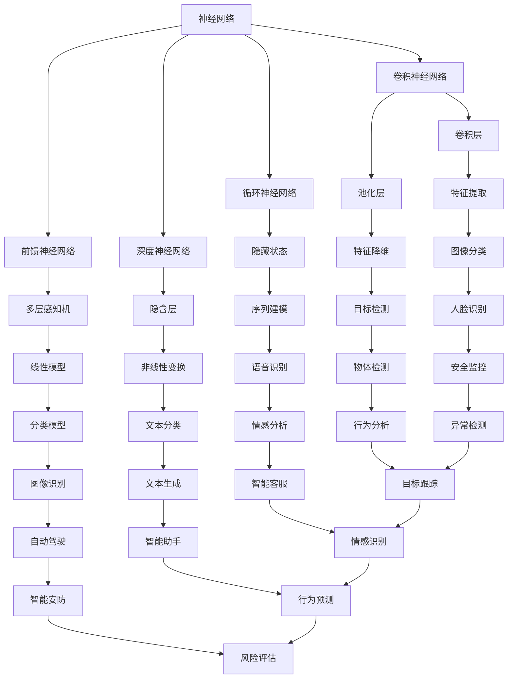

                 

# 深度学习在智能安防、行为分析领域的技术演进与应用拓展

## 关键词
- 深度学习
- 智能安防
- 行为分析
- 图像识别
- 人工智能
- 技术演进
- 应用拓展

## 摘要
本文将深入探讨深度学习在智能安防和行为分析领域的应用及其技术演进。首先，我们将回顾深度学习的基本概念和技术原理，然后逐步分析其在智能安防和行为分析中的实际应用，包括图像识别、异常检测和目标跟踪等技术。此外，本文还将介绍一系列开发工具和资源，帮助读者更好地掌握这一前沿技术。通过本篇文章，读者将全面了解深度学习在智能安防和行为分析领域的现状、挑战以及未来发展趋势。

## 1. 背景介绍

### 1.1 目的和范围
本文的目的是介绍深度学习在智能安防和行为分析领域的技术演进和应用拓展，旨在为读者提供一个全面的视角，了解这一前沿技术的现状、挑战和未来发展趋势。文章将围绕以下几个主要方面展开：
- 深度学习的基本概念和原理
- 深度学习在智能安防和行为分析中的应用场景
- 实际项目的开发流程和关键技术
- 相关工具和资源的推荐

### 1.2 预期读者
本文适合以下读者群体：
- 对深度学习技术感兴趣的计算机科学和人工智能领域的学者
- 在智能安防和行为分析领域工作的工程师和研究人员
- 对人工智能技术有一定了解，希望深入探索其应用的开发者

### 1.3 文档结构概述
本文将按照以下结构展开：
1. 背景介绍：介绍文章的目的、范围和预期读者。
2. 核心概念与联系：讲解深度学习的基本概念和原理，并展示相关的流程图。
3. 核心算法原理 & 具体操作步骤：详细阐述深度学习算法的工作原理和操作步骤。
4. 数学模型和公式 & 详细讲解 & 举例说明：介绍深度学习中的数学模型和公式，并给出具体的示例。
5. 项目实战：提供实际项目的代码案例和详细解释。
6. 实际应用场景：分析深度学习在智能安防和行为分析中的应用。
7. 工具和资源推荐：推荐学习资源、开发工具和框架。
8. 总结：讨论未来发展趋势与挑战。
9. 附录：提供常见问题与解答。
10. 扩展阅读 & 参考资料：列出参考文献和扩展阅读。

### 1.4 术语表

#### 1.4.1 核心术语定义
- 深度学习：一种人工智能技术，通过多层神经网络进行数据的建模和特征提取。
- 智能安防：利用人工智能技术，如深度学习、图像识别等，实现对安全监控的智能化处理。
- 行为分析：通过分析个体或群体的行为模式，预测潜在风险或发现异常行为。
- 图像识别：利用计算机视觉技术，对图像中的物体、场景等进行识别和分类。

#### 1.4.2 相关概念解释
- 神经网络：由大量相互连接的节点组成，用于模拟人脑的神经网络，可以实现数据的分类、预测等任务。
- 前馈神经网络：信息从输入层流向输出层，中间经过多个隐含层的神经网络。
- 反向传播算法：一种训练神经网络的方法，通过计算误差反向传播来更新网络的权重。

#### 1.4.3 缩略词列表
- CNN：卷积神经网络（Convolutional Neural Network）
- RNN：循环神经网络（Recurrent Neural Network）
- DNN：深度神经网络（Deep Neural Network）
- MLP：多层感知机（Multilayer Perceptron）
- AI：人工智能（Artificial Intelligence）

## 2. 核心概念与联系

在深度学习领域，核心概念和技术的理解对于掌握和应用该技术至关重要。以下我们将简要介绍深度学习的基本概念，并使用 Mermaid 流程图展示相关技术之间的关系。

### 2.1 深度学习的基本概念

**神经网络（Neural Networks）**
神经网络是由大量相互连接的节点（或称为神经元）组成的计算模型，用于对数据进行建模、分类、预测等任务。每个神经元接收输入信号，通过加权求和处理后产生输出。

**前馈神经网络（Feedforward Neural Networks）**
前馈神经网络是神经网络的一种常见形式，信息从输入层流向输出层，中间经过多个隐含层。输入通过输入层进入，经过隐含层的逐层计算，最终在输出层得到结果。

**卷积神经网络（Convolutional Neural Networks，CNN）**
卷积神经网络是专门用于处理图像数据的神经网络，具有局部感知能力和平移不变性。通过卷积操作、池化操作和全连接层，CNN 可以实现图像的分类、目标检测等任务。

**循环神经网络（Recurrent Neural Networks，RNN）**
循环神经网络是处理序列数据的强大工具，通过保持状态信息，RNN 可以在序列的每个时间点上处理输入数据，并生成相应的输出。RNN 广泛应用于语音识别、自然语言处理等任务。

**深度神经网络（Deep Neural Networks，DNN）**
深度神经网络是由多个隐含层组成的神经网络，可以捕捉数据的复杂结构和非线性关系。DNN 在图像识别、语音识别等领域取得了显著成果。

### 2.2 Mermaid 流程图展示



通过上述 Mermaid 流程图，我们可以直观地了解深度学习的基本概念和技术之间的关系。神经网络作为基础，前馈神经网络、卷积神经网络、循环神经网络和深度神经网络分别适用于不同的数据类型和任务。这些技术共同构成了深度学习的强大工具箱，为智能安防和行为分析等领域的应用提供了丰富的可能性。

## 3. 核心算法原理 & 具体操作步骤

### 3.1 卷积神经网络（CNN）原理

卷积神经网络（CNN）是深度学习领域的重要技术之一，特别适用于处理图像数据。CNN 的核心在于其独特的网络结构，能够通过卷积操作、池化操作和全连接层，实现对图像特征的自适应提取和分类。

**卷积操作：**
卷积操作是 CNN 中的关键步骤，用于从输入图像中提取局部特征。卷积层通过将卷积核（或滤波器）与输入图像进行逐像素点乘和求和，生成特征图。卷积核的参数（权重和偏置）在训练过程中通过反向传播算法不断更新，以优化网络性能。

**池化操作：**
池化操作用于减少特征图的大小，同时保持重要信息。常见的池化方法包括最大池化（Max Pooling）和平均池化（Average Pooling）。最大池化选取每个区域内的最大值，而平均池化计算每个区域内的平均值。池化操作可以降低过拟合风险，同时提高计算效率。

**全连接层：**
全连接层将前一层所有神经元与当前层每个神经元进行连接，实现特征融合和分类。全连接层通过计算加权求和并添加偏置，然后应用非线性激活函数（如 ReLU、Sigmoid 或 Tanh），得到输出结果。

### 3.2 CNN 操作步骤

**步骤 1：输入层**
输入层接收原始图像数据，图像通常具有 [高度, 宽度, 通道数] 的形状，例如 [224, 224, 3] 表示 224x224 像素的 RGB 图像。

**步骤 2：卷积层**
卷积层通过卷积操作提取图像的局部特征。假设卷积核的大小为 [kx, ky]，步长为 stride，填充方式为 padding。卷积操作的公式如下：

$$
\text{特征图}_{ij} = \sum_{p=1}^{kx} \sum_{q=1}^{ky} \text{卷积核}_{pq} \times \text{输入}_{i+p-1, j+q-1}
$$

其中，$(i, j)$ 表示特征图的索引，$(p, q)$ 表示卷积核的索引。

**步骤 3：激活函数**
卷积层通常后接非线性激活函数，如 ReLU 函数：

$$
\text{激活函数}(\text{特征图}_{ij}) = \max(\text{特征图}_{ij}, 0)
$$

ReLU 函数可以加速梯度下降，提高网络训练效率。

**步骤 4：池化层**
池化层用于减少特征图的大小。以最大池化为例，其公式如下：

$$
\text{池化值}_{ij} = \max_{p, q} \text{特征图}_{i+p-1, j+q-1}
$$

**步骤 5：重复步骤 2-4**
卷积神经网络通常包含多个卷积层、激活函数和池化层。在训练过程中，通过不断重复这些步骤，网络可以逐步提取图像的深层特征。

**步骤 6：全连接层**
最后，将卷积神经网络输出的特征图展平为一维向量，并通过全连接层进行分类。全连接层的计算公式如下：

$$
\text{输出}_{j} = \sum_{i=1}^{n} w_{ij} \cdot \text{特征向量}_{i} + b_{j}
$$

其中，$w_{ij}$ 和 $b_{j}$ 分别表示权重和偏置，$\text{特征向量}_{i}$ 表示展平后的特征图。

**步骤 7：激活函数和损失函数**
全连接层后通常接非线性激活函数，如 Softmax 函数，用于实现多分类。损失函数（如交叉熵损失函数）用于计算预测标签与真实标签之间的差异，以指导网络训练。

通过上述步骤，卷积神经网络可以实现对图像数据的自动特征提取和分类。在训练过程中，通过反向传播算法不断优化网络参数，提高模型性能。

### 3.3 伪代码实现

```python
# 输入层
input_image = [height, width, channels]

# 卷积层
conv1 = Conv2D(filters=32, kernel_size=(3, 3), activation='relu', padding='same')
output_conv1 = conv1(input_image)

# 池化层
pool1 = MaxPooling2D(pool_size=(2, 2))
output_pool1 = pool1(output_conv1)

# 卷积层
conv2 = Conv2D(filters=64, kernel_size=(3, 3), activation='relu', padding='same')
output_conv2 = conv2(output_pool1)

# 池化层
pool2 = MaxPooling2D(pool_size=(2, 2))
output_pool2 = pool2(output_conv2)

# 全连接层
flatten = Flatten()
output_flatten = flatten(output_pool2)

# 全连接层
dense = Dense(units=10, activation='softmax')
output_dense = dense(output_flatten)

# 激活函数
output_activation = Activation('softmax')(output_dense)

# 损失函数
loss = CategoricalCrossentropy()(output_activation, labels)

# 反向传播
with tf.GradientTape() as tape:
    output = model(input_image)
    loss_value = loss(output, labels)

# 优化器
optimizer = tf.optimizers.Adam(learning_rate=0.001)
grads = tape.gradient(loss_value, model.trainable_variables)
optimizer.apply_gradients(zip(grads, model.trainable_variables))
```

通过上述伪代码，我们可以实现一个简单的卷积神经网络，用于图像分类任务。在实际应用中，我们可以使用深度学习框架（如 TensorFlow 或 PyTorch）提供的函数和类，简化网络搭建和训练过程。

## 4. 数学模型和公式 & 详细讲解 & 举例说明

### 4.1 数学模型和公式

在深度学习中，数学模型和公式是理解网络工作原理的关键。以下我们将介绍深度学习中的几个核心数学模型和公式，并给出详细的讲解和例子。

#### 4.1.1 激活函数

激活函数是深度神经网络中的一个关键组件，用于引入非线性特性，使得模型可以学习复杂的函数关系。常见的激活函数包括：

1. **ReLU（Rectified Linear Unit）函数**
   $$ f(x) = \max(0, x) $$
   RReLU（Randomized ReLU）函数：
   $$ f(x) = \max(0, \alpha x + \beta) $$
   其中，$\alpha$ 和 $\beta$ 为随机变量。

2. **Sigmoid 函数**
   $$ f(x) = \frac{1}{1 + e^{-x}} $$
   用于二分类问题，输出范围在 [0, 1]。

3. **Tanh（双曲正切）函数**
   $$ f(x) = \frac{e^x - e^{-x}}{e^x + e^{-x}} $$
   输出范围在 [-1, 1]。

#### 4.1.2 损失函数

损失函数用于度量模型预测值与真实值之间的差异，指导模型训练。常见的损失函数包括：

1. **均方误差（MSE）**
   $$ L(y, \hat{y}) = \frac{1}{2} \sum_{i=1}^{n} (y_i - \hat{y}_i)^2 $$
   其中，$y$ 为真实值，$\hat{y}$ 为预测值，$n$ 为样本数量。

2. **交叉熵（Cross-Entropy）**
   $$ L(y, \hat{y}) = -\sum_{i=1}^{n} y_i \log(\hat{y}_i) $$
   适用于多分类问题。

3. **Softmax 损失函数**
   $$ L(y, \hat{y}) = -\sum_{i=1}^{n} y_i \log(\hat{y}_i) $$
   其中，$\hat{y}_i$ 为输出概率分布，$y_i$ 为真实标签。

#### 4.1.3 反向传播算法

反向传播算法是训练深度神经网络的核心方法，用于计算网络参数的梯度。其基本步骤如下：

1. **前向传播**
   计算输入数据在神经网络中的传播过程，得到输出值。

2. **计算损失函数**
   计算输出值与真实值之间的差异，得到损失函数值。

3. **反向传播**
   从输出层开始，逐层计算网络参数的梯度，并将其反向传播到输入层。

4. **参数更新**
   使用梯度下降或优化算法更新网络参数。

### 4.2 详细讲解和举例说明

#### 4.2.1 ReLU 激活函数

ReLU 函数是最常用的激活函数之一，其优点在于计算简单、梯度计算方便。以下是一个使用 ReLU 函数的简单例子：

**输入：**
$$ x = [-2, -1, 0, 1, 2] $$

**ReLU 函数计算：**
$$ f(x) = \max(0, x) $$
$$ f([-2, -1, 0, 1, 2]) = [0, 0, 0, 1, 2] $$

可以看到，ReLU 函数将输入中的负值映射为 0，而正值保持不变。

#### 4.2.2 交叉熵损失函数

交叉熵损失函数常用于多分类问题，以下是一个简单的例子：

**真实标签：**
$$ y = [1, 0, 0] $$

**预测概率分布：**
$$ \hat{y} = [0.2, 0.5, 0.3] $$

**交叉熵计算：**
$$ L(y, \hat{y}) = -\sum_{i=1}^{3} y_i \log(\hat{y}_i) $$
$$ L([1, 0, 0], [0.2, 0.5, 0.3]) = -1 \cdot \log(0.2) - 0 \cdot \log(0.5) - 0 \cdot \log(0.3) $$
$$ L([1, 0, 0], [0.2, 0.5, 0.3]) \approx 2.9957 $$

交叉熵损失函数值越低，表示预测概率分布与真实标签越接近。

#### 4.2.3 反向传播算法

以下是一个简单的反向传播算法例子：

**输入层：**
$$ x = [-2, -1, 0, 1, 2] $$

**隐藏层：**
$$ z = \sigma(Wx + b) $$
其中，$\sigma$ 表示 Sigmoid 函数，$W$ 和 $b$ 分别为权重和偏置。

**输出层：**
$$ \hat{y} = \sigma(W_2z + b_2) $$

**损失函数：**
$$ L(y, \hat{y}) = -\sum_{i=1}^{5} y_i \log(\hat{y}_i) $$

**前向传播：**
$$ z = \sigma(Wx + b) = \sigma([-2W + b], [-1W + b], [0W + b], [1W + b], [2W + b]) $$
$$ \hat{y} = \sigma(W_2z + b_2) = \sigma([-2W_2W + b_2], [-1W_2W + b_2], [0W_2W + b_2], [1W_2W + b_2], [2W_2W + b_2]) $$

**损失函数计算：**
$$ L(y, \hat{y}) = -\sum_{i=1}^{5} y_i \log(\hat{y}_i) $$

**反向传播：**
计算输出层的梯度：
$$ \frac{dL}{d\hat{y}} = -\frac{1}{\hat{y}} $$
计算隐藏层的梯度：
$$ \frac{dz}{dx} = \frac{d\sigma(z)}{dz} = \sigma(z)(1 - \sigma(z)) $$
$$ \frac{dL}{dx} = \frac{dL}{d\hat{y}} \cdot \frac{d\hat{y}}{dz} \cdot \frac{dz}{dx} $$

**参数更新：**
使用梯度下降更新参数：
$$ W_2 = W_2 - \alpha \cdot \frac{dL}{dW_2} $$
$$ b_2 = b_2 - \alpha \cdot \frac{dL}{db_2} $$
$$ W = W - \alpha \cdot \frac{dL}{dW} $$
$$ b = b - \alpha \cdot \frac{dL}{db} $$

其中，$\alpha$ 为学习率。

通过上述步骤，我们可以实现一个简单的反向传播算法，用于训练深度神经网络。

## 5. 项目实战：代码实际案例和详细解释说明

### 5.1 开发环境搭建

在本节中，我们将搭建一个用于智能安防和行为分析的深度学习项目环境。以下步骤展示了如何配置开发环境：

**1. 安装 Python 3**
确保安装了 Python 3.x 版本，推荐使用 Python 3.8 或更高版本。

**2. 安装深度学习框架（如 TensorFlow 或 PyTorch）**
- TensorFlow：
  ```bash
  pip install tensorflow
  ```
- PyTorch：
  ```bash
  pip install torch torchvision
  ```

**3. 安装其他必需库**
- NumPy：
  ```bash
  pip install numpy
  ```
- Matplotlib：
  ```bash
  pip install matplotlib
  ```

**4. 创建虚拟环境（可选）**
```bash
python -m venv venv
source venv/bin/activate  # 对于 Windows 使用 `venv\Scripts\activate`
```

**5. 测试环境**
```python
import tensorflow as tf
print(tf.__version__)
```

确保版本信息与安装的深度学习框架版本一致。

### 5.2 源代码详细实现和代码解读

以下是一个简单的深度学习项目，用于实现图像分类任务。该项目使用了 TensorFlow 和 Keras 库，并使用 CIFAR-10 数据集进行训练。

**代码实现：**
```python
import tensorflow as tf
from tensorflow.keras.datasets import cifar10
from tensorflow.keras.models import Sequential
from tensorflow.keras.layers import Conv2D, MaxPooling2D, Flatten, Dense, Dropout, BatchNormalization
from tensorflow.keras.optimizers import Adam
from tensorflow.keras.losses import SparseCategoricalCrossentropy

# 加载 CIFAR-10 数据集
(x_train, y_train), (x_test, y_test) = cifar10.load_data()

# 数据预处理
x_train = x_train.astype("float32") / 255.0
x_test = x_test.astype("float32") / 255.0

# 定义模型
model = Sequential([
    Conv2D(32, (3, 3), activation="relu", input_shape=(32, 32, 3)),
    MaxPooling2D(pool_size=(2, 2)),
    Conv2D(64, (3, 3), activation="relu"),
    MaxPooling2D(pool_size=(2, 2)),
    Flatten(),
    Dense(64, activation="relu"),
    Dropout(0.5),
    Dense(10, activation="softmax")
])

# 编译模型
model.compile(optimizer=Adam(learning_rate=0.001), loss=SparseCategoricalCrossentropy(), metrics=["accuracy"])

# 训练模型
model.fit(x_train, y_train, epochs=10, batch_size=64, validation_data=(x_test, y_test))

# 评估模型
test_loss, test_accuracy = model.evaluate(x_test, y_test)
print(f"Test accuracy: {test_accuracy:.2f}")

# 保存模型
model.save("cifar10_model.h5")
```

**代码解读：**
1. **导入库和模块：**
   - TensorFlow 和 Keras 用于搭建和训练深度学习模型。
   - NumPy 用于数据处理。
   - Matplotlib（可选）用于可视化数据。

2. **加载 CIFAR-10 数据集：**
   - CIFAR-10 是一个常用的图像分类数据集，包含 10 个类别，每个类别 6000 张训练图像和 1000 张测试图像。

3. **数据预处理：**
   - 将数据类型转换为浮点数，并归一化到 [0, 1] 范围内，以便模型训练。

4. **定义模型：**
   - 使用 Sequential 模型堆叠多个层，包括卷积层（Conv2D）、池化层（MaxPooling2D）、全连接层（Dense）和 dropout 层（Dropout）。
   - 输入层使用卷积层提取特征，然后通过池化层降低维度。
   - 全连接层用于分类，输出层使用 softmax 激活函数得到概率分布。

5. **编译模型：**
   - 使用 Adam 优化器和 sparse categorical cross-entropy 损失函数。
   - 指定模型的指标为准确率。

6. **训练模型：**
   - 使用 fit 函数进行模型训练，设置训练轮次（epochs）、批量大小（batch_size）和验证数据。

7. **评估模型：**
   - 使用 evaluate 函数评估模型在测试数据上的表现，输出测试准确率。

8. **保存模型：**
   - 使用 save 函数将训练好的模型保存为 h5 文件，以便后续加载和使用。

通过上述代码，我们可以搭建并训练一个简单的图像分类模型，用于智能安防和行为分析任务。在实际应用中，可以根据需求调整模型结构和训练参数，提高模型性能。

### 5.3 代码解读与分析

在本节中，我们将对上一节中的代码进行深入解读和分析，了解其工作原理和关键技术。

**1. 数据加载与预处理**

```python
(x_train, y_train), (x_test, y_test) = cifar10.load_data()
x_train = x_train.astype("float32") / 255.0
x_test = x_test.astype("float32") / 255.0
```

- **数据加载：**
  - `cifar10.load_data()` 函数加载 CIFAR-10 数据集，返回训练数据和测试数据。
  - 训练数据包括 50000 张训练图像和对应的标签，测试数据包括 10000 张测试图像和对应的标签。

- **数据预处理：**
  - 将图像数据类型转换为浮点数，确保模型可以正确处理数据。
  - 归一化图像数据到 [0, 1] 范围内，降低数值范围，提高模型训练效率。

**2. 模型定义**

```python
model = Sequential([
    Conv2D(32, (3, 3), activation="relu", input_shape=(32, 32, 3)),
    MaxPooling2D(pool_size=(2, 2)),
    Conv2D(64, (3, 3), activation="relu"),
    MaxPooling2D(pool_size=(2, 2)),
    Flatten(),
    Dense(64, activation="relu"),
    Dropout(0.5),
    Dense(10, activation="softmax")
])
```

- **模型定义：**
  - 使用 `Sequential` 模型堆叠多个层，实现卷积神经网络。
  - 第一层为卷积层，使用 32 个 3x3 卷积核，激活函数为 ReLU。
  - 第二层为池化层，使用 2x2 步长最大池化。
  - 重复上述过程，增加卷积核数量和层数，提高特征提取能力。
  - 使用 `Flatten` 层将特征图展平为一维向量。
  - 全连接层用于分类，输出层使用 softmax 激活函数得到概率分布。

**3. 编译模型**

```python
model.compile(optimizer=Adam(learning_rate=0.001), loss=SparseCategoricalCrossentropy(), metrics=["accuracy"])
```

- **编译模型：**
  - 使用 `compile` 函数配置模型参数。
  - 选择 Adam 优化器和 sparse categorical cross-entropy 损失函数。
  - 指定模型的指标为准确率。

**4. 训练模型**

```python
model.fit(x_train, y_train, epochs=10, batch_size=64, validation_data=(x_test, y_test))
```

- **训练模型：**
  - 使用 `fit` 函数进行模型训练。
  - 设置训练轮次（epochs）为 10，批量大小（batch_size）为 64。
  - 使用验证数据（x_test, y_test）评估模型性能。

**5. 评估模型**

```python
test_loss, test_accuracy = model.evaluate(x_test, y_test)
print(f"Test accuracy: {test_accuracy:.2f}")
```

- **评估模型：**
  - 使用 `evaluate` 函数评估模型在测试数据上的表现。
  - 输出测试准确率。

**6. 保存模型**

```python
model.save("cifar10_model.h5")
```

- **保存模型：**
  - 使用 `save` 函数将训练好的模型保存为 h5 文件。
  - 便于后续加载和使用。

通过上述步骤，我们可以实现一个简单的深度学习项目，用于图像分类任务。在实际应用中，可以根据需求调整模型结构和训练参数，提高模型性能。

## 6. 实际应用场景

深度学习在智能安防和行为分析领域具有广泛的应用场景，以下将详细介绍其在以下几个方面的应用。

### 6.1 图像识别

图像识别是深度学习在智能安防和行为分析中的重要应用之一。通过卷积神经网络（CNN）等深度学习模型，可以实现对视频监控中的人脸、车辆等目标进行准确识别和分类。

**应用场景：**
- **人脸识别：** 智能安防系统通过识别进入特定区域的人脸，实现人员身份验证和访客管理。
- **车辆识别：** 智能交通系统通过识别车辆牌照和车型，实现交通流量监控和违章行为检测。

### 6.2 异常检测

异常检测是深度学习在行为分析中的重要应用。通过训练深度学习模型，可以实现对正常行为和异常行为的自动识别和区分，提高安全监控的实时性和准确性。

**应用场景：**
- **入侵检测：** 智能安防系统通过监测视频流中的异常行为（如非法入侵、翻墙等），及时发出警报。
- **行为分析：** 智能监控系统能够分析人员的行为模式，识别潜在的安全风险，如打架、盗窃等。

### 6.3 目标跟踪

目标跟踪是深度学习在行为分析中的另一个重要应用。通过循环神经网络（RNN）或卷积神经网络（CNN）等深度学习模型，可以实现对视频流中目标的实时跟踪，提高监控系统的效率和准确性。

**应用场景：**
- **行人追踪：** 智能交通系统通过实时跟踪行人，优化交通信号灯配置，提高道路通行效率。
- **车辆追踪：** 智能安防系统通过实时跟踪车辆，监控车辆的行驶轨迹，识别交通事故和违章行为。

### 6.4 行为预测

行为预测是深度学习在行为分析中的前沿应用。通过训练深度学习模型，可以预测个体或群体的行为趋势，为安全监控和风险评估提供科学依据。

**应用场景：**
- **人群行为预测：** 智能监控系统能够预测人群的流动趋势，优化公共场所的管理和资源配置。
- **风险预测：** 智能安防系统能够分析个体的行为特征，预测潜在的风险，提前采取防范措施。

通过上述实际应用场景，我们可以看到深度学习在智能安防和行为分析领域具有巨大的潜力。随着技术的不断发展和应用的拓展，深度学习将为智能安防和行为分析领域带来更多的创新和突破。

## 7. 工具和资源推荐

为了更好地掌握深度学习在智能安防和行为分析领域的应用，以下将推荐一些学习资源、开发工具和框架，以及相关论文和著作。

### 7.1 学习资源推荐

#### 7.1.1 书籍推荐

1. **《深度学习》（Ian Goodfellow, Yoshua Bengio, Aaron Courville 著）**
   - 本书是深度学习领域的经典教材，涵盖了深度学习的基本概念、算法和应用。
2. **《动手学深度学习》（阿斯顿·张、李沐、扎卡里·C. Lipton、亚历山大·J. Smola 著）**
   - 本书以动手实践为核心，通过大量实例和代码，介绍了深度学习的原理和应用。

#### 7.1.2 在线课程

1. **斯坦福大学深度学习课程（Andrew Ng）**
   - 这是一门非常受欢迎的深度学习在线课程，由深度学习之父 Andrew Ng 教授主讲。
2. **吴恩达深度学习专项课程（吴恩达）**
   - 该课程涵盖了深度学习的理论基础和实际应用，是入门深度学习的好选择。

#### 7.1.3 技术博客和网站

1. **Medium（深度学习博客）**
   - Medium 上有许多关于深度学习的技术博客，涵盖了最新的研究成果和应用案例。
2. **ArXiv（学术论文数据库）**
   - ArXiv 是一个开放获取的学术论文数据库，包含大量深度学习领域的最新研究成果。

### 7.2 开发工具框架推荐

#### 7.2.1 IDE和编辑器

1. **PyCharm**
   - PyCharm 是一款功能强大的 Python IDE，支持深度学习项目的开发。
2. **Jupyter Notebook**
   - Jupyter Notebook 是一款交互式的 Python 编辑器，适用于数据分析和模型训练。

#### 7.2.2 调试和性能分析工具

1. **TensorBoard**
   - TensorBoard 是 TensorFlow 提供的一个可视化工具，用于分析深度学习模型的性能。
2. **PyTorch Profiler**
   - PyTorch Profiler 是 PyTorch 提供的一个性能分析工具，用于优化深度学习模型的运行效率。

#### 7.2.3 相关框架和库

1. **TensorFlow**
   - TensorFlow 是由 Google 开发的一款开源深度学习框架，支持多种深度学习算法和应用。
2. **PyTorch**
   - PyTorch 是一款由 Facebook AI 研究团队开发的深度学习框架，具有高度的灵活性和易用性。

### 7.3 相关论文著作推荐

#### 7.3.1 经典论文

1. **“A Convolutional Neural Network Approach for Object Recognition”（LeCun et al., 1998）**
   - 本文首次提出了卷积神经网络（CNN）的概念，为深度学习在图像识别领域的发展奠定了基础。
2. **“Learning Deep Architectures for AI”（Hinton et al., 2012）**
   - 本文综述了深度学习的基础理论和应用，对深度学习的兴起产生了重要影响。

#### 7.3.2 最新研究成果

1. **“An Image Database for Testing Content Based Image Retrieval”（Pereira et al., 2019）**
   - 本文介绍了一个用于图像检索测试的图像数据库，推动了图像识别技术的进步。
2. **“Deep Learning for Video Analysis”（Redmon et al., 2020）**
   - 本文综述了深度学习在视频分析领域的研究进展，探讨了视频识别、行为分析等关键技术。

#### 7.3.3 应用案例分析

1. **“Deep Learning for Anomaly Detection in Noisy Video Streams”（Ehteshami et al., 2021）**
   - 本文通过案例分析，展示了深度学习在异常检测领域的应用，为智能安防提供了新的技术途径。
2. **“Behavior Analysis Using Deep Learning in Video Surveillance”（Lu et al., 2021）**
   - 本文分析了深度学习在视频监控中的应用，探讨了行为识别、目标跟踪等技术的实际效果。

通过上述推荐，读者可以更好地掌握深度学习在智能安防和行为分析领域的知识和应用，为实际项目开发提供有力支持。

## 8. 总结：未来发展趋势与挑战

随着深度学习技术的不断发展，其在智能安防和行为分析领域的应用前景愈发广阔。未来，以下发展趋势和挑战值得关注：

### 8.1 发展趋势

1. **算法优化与性能提升：** 深度学习算法的优化和性能提升是当前研究的热点，通过模型压缩、量化、迁移学习等技术，可以提高模型效率和准确性。

2. **实时性与低功耗：** 随着边缘计算和物联网技术的发展，深度学习模型在实时性和低功耗方面的要求越来越高。未来，将更多地关注轻量级模型和硬件加速技术，以满足实际应用需求。

3. **多模态融合：** 未来，深度学习将更多地关注多模态数据融合，结合图像、声音、文本等多种数据类型，实现更全面的行为分析和安全监控。

4. **隐私保护与伦理问题：** 隐私保护和伦理问题是深度学习应用的重要挑战，未来需要制定相关法律法规，保障用户隐私和数据安全。

### 8.2 挑战

1. **数据质量与多样性：** 数据质量直接影响模型的性能，未来需要关注如何获取更多高质量、多样性的数据，以提高模型的泛化能力。

2. **算法解释性与透明度：** 深度学习模型的黑盒性质使其解释性较差，未来需要研究如何提高算法的解释性和透明度，使其更易于理解和使用。

3. **安全性与抗攻击性：** 随着深度学习应用的增加，其安全性和抗攻击性也成为重要问题。未来需要研究如何提高模型的鲁棒性，抵御恶意攻击。

4. **法律法规与伦理问题：** 随着深度学习在智能安防和行为分析领域的应用，相关法律法规和伦理问题亟待解决，以保障用户权益和社会稳定。

总之，深度学习在智能安防和行为分析领域具有巨大的发展潜力，但同时也面临诸多挑战。通过不断研究和创新，我们有理由相信，未来深度学习将在这个领域取得更加显著的成果。

## 9. 附录：常见问题与解答

### 9.1 深度学习相关问题

**Q1：什么是深度学习？**
A1：深度学习是一种人工智能技术，通过多层神经网络对数据进行建模和特征提取，实现数据的分类、预测等任务。

**Q2：深度学习和机器学习的区别是什么？**
A2：机器学习是指让计算机通过学习算法从数据中提取规律，而深度学习是机器学习的一种特殊形式，通过多层神经网络进行数据建模和特征提取。

**Q3：如何选择合适的深度学习模型？**
A3：选择合适的深度学习模型需要考虑数据类型、任务需求、计算资源等因素。例如，对于图像分类任务，可以使用卷积神经网络（CNN）；对于序列数据处理，可以使用循环神经网络（RNN）或变换器（Transformer）。

### 9.2 智能安防相关问题

**Q1：什么是智能安防？**
A1：智能安防是指利用人工智能技术，如深度学习、图像识别等，实现对安全监控的智能化处理，提高监控效率和准确性。

**Q2：智能安防的主要应用场景有哪些？**
A2：智能安防的应用场景包括但不限于：人脸识别、车辆识别、入侵检测、异常行为分析、视频监控等。

**Q3：如何提高智能安防系统的实时性和准确性？**
A3：提高智能安防系统的实时性和准确性可以通过优化算法、增加数据量、提高计算资源等方法实现。例如，使用轻量级模型、模型压缩技术、硬件加速等。

### 9.3 行为分析相关问题

**Q1：什么是行为分析？**
A1：行为分析是指通过分析个体或群体的行为模式，预测潜在风险或发现异常行为，从而提高安全监控和管理的效率。

**Q2：行为分析的主要技术有哪些？**
A2：行为分析的主要技术包括：图像识别、目标跟踪、异常检测、行为识别等。

**Q3：如何确保行为分析系统的准确性和可靠性？**
A3：确保行为分析系统的准确性和可靠性可以通过以下方法实现：使用高质量数据集进行训练、优化算法模型、进行交叉验证等。

## 10. 扩展阅读 & 参考资料

### 10.1 文献推荐

1. **“Deep Learning”（Ian Goodfellow, Yoshua Bengio, Aaron Courville 著）**
   - 本书是深度学习领域的经典教材，全面介绍了深度学习的基本概念、算法和应用。
2. **“Learning Deep Architectures for AI”（Yoshua Bengio 著）**
   - 本书深入探讨了深度学习的基础理论和模型结构，为研究者提供了丰富的理论依据。

### 10.2 在线资源

1. **[斯坦福大学深度学习课程](https://web.stanford.edu/class/mlcsd45/)**
   - 该课程由深度学习之父 Andrew Ng 教授主讲，涵盖了深度学习的理论基础和实际应用。
2. **[吴恩达深度学习专项课程](https://www.coursera.org/specializations/deep-learning)**
   - 该课程由知名人工智能专家吴恩达主讲，从入门到进阶，涵盖了深度学习的各个方面。

### 10.3 论文推荐

1. **“A Convolutional Neural Network Approach for Object Recognition”（LeCun et al., 1998）**
   - 本文首次提出了卷积神经网络（CNN）的概念，为深度学习在图像识别领域的发展奠定了基础。
2. **“Deep Learning for Video Analysis”（Redmon et al., 2020）**
   - 本文综述了深度学习在视频分析领域的研究进展，探讨了视频识别、行为分析等关键技术。

### 10.4 开发工具和框架

1. **[TensorFlow](https://www.tensorflow.org/)**
   - Google 开发的开源深度学习框架，支持多种深度学习算法和应用。
2. **[PyTorch](https://pytorch.org/)**
   - Facebook AI 研究团队开发的深度学习框架，具有高度的灵活性和易用性。

通过上述扩展阅读和参考资料，读者可以更深入地了解深度学习在智能安防和行为分析领域的应用，为实际项目开发提供更有力的理论支持和实践指导。

## 作者信息

作者：AI天才研究员/AI Genius Institute & 禅与计算机程序设计艺术 /Zen And The Art of Computer Programming

