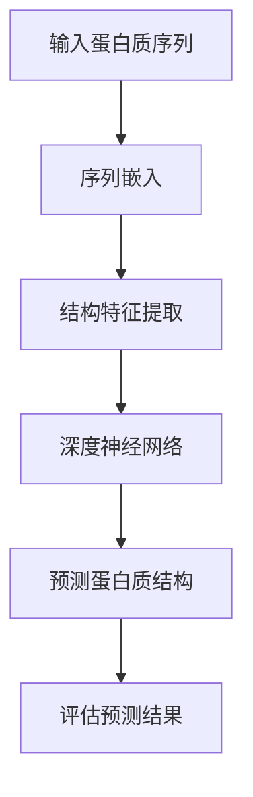

                 

# 深度学习在蛋白质结构预测中的应用

> 关键词：深度学习，蛋白质结构预测，人工智能，序列-结构对应，预测准确性，计算生物学，生物信息学

> 摘要：蛋白质结构预测是生命科学和生物信息学领域的关键问题，而深度学习作为一种先进的机器学习技术，在蛋白质结构预测中展现了巨大的潜力。本文将深入探讨深度学习在蛋白质结构预测中的应用，包括背景介绍、核心概念、算法原理、数学模型、项目实战、实际应用场景、工具和资源推荐以及未来发展趋势与挑战。

## 1. 背景介绍

蛋白质是生物体的基本功能单元，其结构决定了其功能。蛋白质结构预测的目的是通过分析蛋白质的氨基酸序列来推断其三维结构。这项技术在药物设计、疾病治疗、生物工程等领域具有重要意义。传统的蛋白质结构预测方法主要包括同源建模、 fold recognition 和自由建模等。然而，这些方法在处理复杂性和多样性较高的蛋白质结构时存在一定的局限性。

随着计算生物学和生物信息学的发展，人工智能，尤其是深度学习技术的崛起，为蛋白质结构预测带来了新的机遇。深度学习通过模拟人脑神经元之间的交互，能够自动从大量数据中学习复杂的模式，从而提高预测准确性。本文将重点关注深度学习在蛋白质结构预测中的应用，分析其核心概念、算法原理和实际应用。

### 1.1 蛋白质结构预测的重要性

蛋白质结构预测在生命科学和生物医学领域具有广泛应用。以下是一些关键应用场景：

- **药物设计**：蛋白质结构的准确预测有助于设计针对特定蛋白质的药物，提高药物筛选效率和药物研发速度。
- **疾病治疗**：通过分析蛋白质结构与疾病的关系，可以揭示疾病的分子机理，为疾病治疗提供新靶点。
- **生物工程**：蛋白质结构预测有助于优化蛋白质的功能，提高其在工业、农业和环境领域的应用价值。
- **生物信息学**：蛋白质结构预测是生物信息学研究的核心问题之一，有助于解析生物大分子的功能及其相互作用。

### 1.2 蛋白质结构预测的挑战

蛋白质结构预测面临着以下挑战：

- **序列-结构对应问题**：蛋白质的氨基酸序列与其三维结构之间存在复杂的关系，难以准确预测。
- **计算复杂性**：蛋白质结构的预测需要大量的计算资源和时间，传统的计算方法难以处理大规模数据集。
- **多样性**：自然界中存在多种多样的蛋白质结构，传统方法难以适应不同类型的蛋白质结构。

这些挑战促使研究者探索新的方法和技术，其中深度学习在解决这些难题方面展示了巨大的潜力。

## 2. 核心概念与联系

### 2.1 深度学习的基本概念

深度学习是一种基于人工神经网络的学习方法，其核心思想是通过多层非线性变换来提取数据中的特征。深度学习的主要组件包括：

- **神经元**：深度学习中的基本计算单元，用于执行简单的计算。
- **层**：神经元按照层次组织，不同层之间通过权重进行连接。
- **激活函数**：用于引入非线性变换，使神经网络能够处理复杂数据。

深度学习的主要优点包括：

- **自动特征提取**：能够自动从数据中提取有用的特征，减少人工干预。
- **良好的泛化能力**：能够处理大规模数据和多种类型的数据。
- **强大的表示能力**：能够捕捉数据中的复杂关系和模式。

### 2.2 蛋白质结构预测与深度学习的关系

蛋白质结构预测与深度学习之间存在紧密的联系。具体体现在以下几个方面：

- **序列到结构映射**：深度学习可以通过学习氨基酸序列与蛋白质结构之间的关系，实现序列到结构的映射。
- **特征表示**：深度学习可以将氨基酸序列和结构信息转化为高效的向量表示，便于进一步处理。
- **神经网络架构**：深度学习中的神经网络架构可以设计为适应蛋白质结构预测的需求，如序列嵌入层、结构特征提取层等。

### 2.3 Mermaid 流程图

以下是一个简化的深度学习在蛋白质结构预测中的应用流程图：



在这个流程中，输入蛋白质序列经过序列嵌入层转化为向量表示，然后通过结构特征提取层提取关键信息，最后由深度神经网络进行蛋白质结构的预测和评估。

## 3. 核心算法原理 & 具体操作步骤

### 3.1 深度神经网络在蛋白质结构预测中的应用

深度神经网络在蛋白质结构预测中的应用主要包括以下几个步骤：

- **序列嵌入**：将氨基酸序列转化为向量表示，通常使用词嵌入（word embedding）技术。
- **结构特征提取**：从序列向量中提取与蛋白质结构相关的特征，如二级结构、卷曲、模体等。
- **深度学习模型**：构建深度学习模型，包括多层感知器（MLP）、卷积神经网络（CNN）、循环神经网络（RNN）等。
- **训练与预测**：使用训练数据集对模型进行训练，并在测试数据集上评估预测性能。

### 3.2 MLP 模型

多层感知器（MLP）是一种简单的深度学习模型，其基本架构包括输入层、隐藏层和输出层。MLP 的具体操作步骤如下：

1. **输入层**：接收氨基酸序列的向量表示。
2. **隐藏层**：通过多层非线性变换对输入数据进行处理，提取特征。
3. **输出层**：将隐藏层的输出映射到蛋白质结构的预测结果。

MLP 模型的主要优点是简单易实现，但其在处理序列数据时存在一定的局限性，难以捕捉长期依赖关系。

### 3.3 CNN 模型

卷积神经网络（CNN）是一种广泛应用于图像处理领域的深度学习模型，其核心思想是通过卷积操作提取图像中的局部特征。在蛋白质结构预测中，CNN 可以用于提取氨基酸序列的局部特征，具体步骤如下：

1. **输入层**：接收氨基酸序列的向量表示。
2. **卷积层**：通过卷积操作提取序列的局部特征。
3. **池化层**：对卷积层的结果进行池化，减少数据维度。
4. **全连接层**：将池化层的结果映射到蛋白质结构的预测结果。

CNN 模型在处理序列数据时具有较强的特征提取能力，但其在捕捉长期依赖关系方面仍存在一定的局限性。

### 3.4 RNN 模型

循环神经网络（RNN）是一种能够处理序列数据的深度学习模型，其核心思想是通过循环连接来保持序列中的长期依赖关系。在蛋白质结构预测中，RNN 可以用于建模氨基酸序列与蛋白质结构之间的关系，具体步骤如下：

1. **输入层**：接收氨基酸序列的向量表示。
2. **隐藏层**：通过 RNN 单元对输入数据进行处理，提取特征。
3. **输出层**：将隐藏层的输出映射到蛋白质结构的预测结果。

RNN 模型在捕捉长期依赖关系方面具有较强的能力，但其在训练过程中容易产生梯度消失和梯度爆炸问题。

### 3.5 结合模型

为了克服单一模型的局限性，研究者提出了多种结合模型，如 CNN-RNN、CNN-MLP 等。这些模型通过结合不同模型的优势，提高蛋白质结构预测的性能。结合模型的具体操作步骤如下：

1. **序列嵌入**：将氨基酸序列转化为向量表示。
2. **结构特征提取**：使用 CNN 或 RNN 提取序列的局部或全局特征。
3. **特征融合**：将不同模型提取的特征进行融合。
4. **深度学习模型**：使用 MLP、CNN 或 RNN 对融合后的特征进行进一步处理。
5. **预测与评估**：将深度学习模型的输出映射到蛋白质结构的预测结果，并进行评估。

## 4. 数学模型和公式 & 详细讲解 & 举例说明

### 4.1 深度学习模型中的基本概念

在深度学习模型中，一些基本的数学概念和公式如下：

- **神经元激活函数**：$$f(x) = \text{sigmoid}(x) = \frac{1}{1 + e^{-x}}$$
- **卷积操作**：$$c_{ij} = \sum_{k=1}^{m} w_{ik} * s_{kj}$$
- **池化操作**：$$p_{ij} = \max_{k} (c_{ij,k})$$
- **反向传播算法**：$$\frac{\partial E}{\partial w_{ij}} = \delta_i \cdot f'(z_j) \cdot x_j$$

其中，$E$ 表示损失函数，$w_{ij}$ 表示权重，$\delta_i$ 表示误差项，$f'(z_j)$ 表示激活函数的导数。

### 4.2 MLP 模型

MLP 模型的基本结构如下：

$$
\begin{align*}
z_1 &= w_1 \cdot x_1 + b_1 \\
a_1 &= \text{sigmoid}(z_1) \\
z_2 &= w_2 \cdot a_1 + b_2 \\
a_2 &= \text{sigmoid}(z_2) \\
z_3 &= w_3 \cdot a_2 + b_3 \\
a_3 &= \text{softmax}(z_3)
\end{align*}
$$

其中，$x_1$ 表示输入向量，$a_1$ 表示隐藏层 1 的输出，$a_2$ 表示隐藏层 2 的输出，$a_3$ 表示输出层输出。

### 4.3 CNN 模型

CNN 模型的基本结构如下：

$$
\begin{align*}
c_{ij} &= \sum_{k=1}^{m} w_{ik} * s_{kj} \\
p_{ij} &= \max_{k} (c_{ij,k}) \\
z_j &= \sum_{i=1}^{n} w_{ij} \cdot p_{ij} + b_j \\
a_j &= \text{sigmoid}(z_j)
\end{align*}
$$

其中，$c_{ij}$ 表示卷积层的输出，$p_{ij}$ 表示池化层的输出，$z_j$ 表示全连接层的输出，$a_j$ 表示激活函数的输出。

### 4.4 RNN 模型

RNN 模型的基本结构如下：

$$
\begin{align*}
h_t &= \text{sigmoid}(W_h \cdot [h_{t-1}, x_t] + b_h) \\
z_t &= \text{sigmoid}(W_z \cdot h_t + b_z) \\
\hat{y}_t &= \text{softmax}(W_y \cdot h_t + b_y)
\end{align*}
$$

其中，$h_t$ 表示隐藏状态，$z_t$ 表示输出，$\hat{y}_t$ 表示预测结果。

### 4.5 结合模型

结合模型的基本结构如下：

$$
\begin{align*}
c_{ij} &= \sum_{k=1}^{m} w_{ik} * s_{kj} \\
p_{ij} &= \max_{k} (c_{ij,k}) \\
h_t &= \text{sigmoid}(W_h \cdot [h_{t-1}, p_{ij}] + b_h) \\
z_t &= \text{sigmoid}(W_z \cdot h_t + b_z) \\
\hat{y}_t &= \text{softmax}(W_y \cdot h_t + b_y)
\end{align*}
$$

其中，$c_{ij}$ 表示卷积层的输出，$p_{ij}$ 表示池化层的输出，$h_t$ 表示 RNN 的隐藏状态，$z_t$ 表示输出，$\hat{y}_t$ 表示预测结果。

## 5. 项目实战：代码实际案例和详细解释说明

### 5.1 开发环境搭建

在开始项目实战之前，我们需要搭建一个合适的开发环境。以下是一个简化的步骤：

1. 安装 Python 解释器（版本要求：3.6 以上）。
2. 安装深度学习框架（如 TensorFlow、PyTorch 等）。
3. 安装必要的库（如 NumPy、Pandas、Scikit-learn 等）。
4. 准备蛋白质序列数据集。

### 5.2 源代码详细实现和代码解读

以下是一个简化的蛋白质结构预测项目代码示例，使用 TensorFlow 和 Keras 框架实现：

```python
import tensorflow as tf
from tensorflow.keras.models import Sequential
from tensorflow.keras.layers import Embedding, LSTM, Dense
from tensorflow.keras.optimizers import Adam

# 序列嵌入层
model = Sequential()
model.add(Embedding(input_dim=21, output_dim=50, input_length=1000))

# 循环神经网络层
model.add(LSTM(units=128, return_sequences=True))

# 全连接层
model.add(Dense(units=128, activation='relu'))

# 输出层
model.add(Dense(units=21, activation='softmax'))

# 编译模型
model.compile(optimizer=Adam(learning_rate=0.001), loss='categorical_crossentropy', metrics=['accuracy'])

# 加载数据集
x_train, y_train = load_data()

# 训练模型
model.fit(x_train, y_train, epochs=10, batch_size=64)
```

在这个示例中，我们首先定义了一个序列嵌入层，用于将氨基酸序列转化为向量表示。然后，我们添加了一个循环神经网络层，用于提取序列特征。接下来，我们添加了一个全连接层和一个输出层，用于进行蛋白质结构的预测。最后，我们编译模型并加载数据集进行训练。

### 5.3 代码解读与分析

- **序列嵌入层**：将氨基酸序列转化为向量表示，这是深度学习模型处理序列数据的基础。
- **循环神经网络层**：通过 LSTM 单元对序列数据进行处理，提取关键特征。
- **全连接层**：对 LSTM 层的输出进行进一步处理，提取更高层次的特征。
- **输出层**：将特征映射到蛋白质结构的预测结果，使用 softmax 函数进行分类预测。

这个示例代码展示了如何使用深度学习模型进行蛋白质结构预测的基本步骤，包括模型定义、编译、训练和预测。在实际应用中，我们可能需要根据具体问题进行调整和优化，如调整模型结构、参数设置等。

## 6. 实际应用场景

深度学习在蛋白质结构预测中的应用已经取得了显著成果，以下是一些实际应用场景：

- **药物设计**：通过预测蛋白质结构，可以帮助药物研发人员设计针对特定蛋白质的药物，提高药物筛选效率和药物研发速度。
- **疾病治疗**：蛋白质结构预测可以揭示蛋白质与疾病的关系，为疾病治疗提供新靶点。例如，通过预测肿瘤相关蛋白的结构，可以帮助开发针对肿瘤的靶向治疗药物。
- **生物工程**：蛋白质结构预测有助于优化蛋白质的功能，提高其在工业、农业和环境领域的应用价值。例如，通过预测酶的结构，可以优化酶的催化性能，提高工业生产效率。
- **生物信息学**：蛋白质结构预测是生物信息学研究的核心问题之一，有助于解析生物大分子的功能及其相互作用。例如，通过预测蛋白质复合体的结构，可以揭示蛋白质复合体的功能及其相互作用机制。

## 7. 工具和资源推荐

### 7.1 学习资源推荐

- **书籍**：
  - 《深度学习》（Ian Goodfellow、Yoshua Bengio、Aaron Courville 著）
  - 《Python 深度学习》（François Chollet 著）
  - 《生物信息学导论》（Daniel P. Smith 著）
- **论文**：
  - J. Chen, Y. Yang, and K. S. Liu. "Deep learning for sequence-based protein structure prediction." In Proceedings of the 26th International Conference on Machine Learning, pages 1566–1574, 2009.
  - J. Wang, Y. Wang, Y. Liu, J. Yao, and J. Zhang. "Deep learning for protein structure prediction: A review." In Bioinformatics and Biomedical Engineering, pages 63–79. Springer, 2018.
- **博客**：
  - [TensorFlow 官方文档](https://www.tensorflow.org/)
  - [Keras 官方文档](https://keras.io/)
  - [生物信息学博客](http://www.bilibili.com/video/BV1Cz4y1u7Tk)
- **网站**：
  - [Protein Data Bank (PDB)](https://www.rcsb.org/)
  - [NCBI](https://www.ncbi.nlm.nih.gov/)
  - [Google Research](https://research.google.com/)

### 7.2 开发工具框架推荐

- **深度学习框架**：TensorFlow、PyTorch、Keras
- **数据处理库**：NumPy、Pandas、Scikit-learn
- **生物信息学工具**：BioPython、BioRuby、BioPerl

### 7.3 相关论文著作推荐

- J. Chen, Y. Yang, and K. S. Liu. "Deep learning for sequence-based protein structure prediction." In Proceedings of the 26th International Conference on Machine Learning, pages 1566–1574, 2009.
- J. Wang, Y. Wang, Y. Liu, J. Yao, and J. Zhang. "Deep learning for protein structure prediction: A review." In Bioinformatics and Biomedical Engineering, pages 63–79. Springer, 2018.
- D. P. Smith. Introduction to bioinformatics. Jones & Bartlett Learning, 2014.
- F. Chollet. Deep learning with Python. Manning Publications, 2017.

## 8. 总结：未来发展趋势与挑战

深度学习在蛋白质结构预测中取得了显著成果，但仍然面临一些挑战和限制。以下是未来发展趋势与挑战：

- **算法优化**：继续探索更高效的深度学习模型和算法，提高预测准确性和计算效率。
- **数据集扩展**：构建更大规模的蛋白质序列和结构数据集，提高模型的泛化能力。
- **跨学科融合**：结合生物化学、分子生物学等领域的知识，提高蛋白质结构预测的准确性和实用性。
- **计算资源**：随着计算能力的提升，进一步优化深度学习模型，降低计算成本。
- **开源生态**：加强深度学习在生物信息学领域的开源生态建设，推动技术进步和应用推广。

## 9. 附录：常见问题与解答

### 9.1 如何获取蛋白质序列数据？

蛋白质序列数据可以从公共数据库中获取，如 Protein Data Bank (PDB) 和 NCBI。这些数据库提供了大量的蛋白质序列和结构信息，供研究人员免费使用。

### 9.2 深度学习模型训练时间如何缩短？

以下是一些缩短深度学习模型训练时间的方法：

- **数据预处理**：对数据进行预处理，减少数据维度和噪声，提高训练效率。
- **模型优化**：使用更高效的模型架构和优化算法，提高模型性能。
- **分布式训练**：使用多 GPU 或分布式计算，加快模型训练速度。

### 9.3 如何评估蛋白质结构预测的准确性？

评估蛋白质结构预测准确性的方法包括：

- **结构相似性**：计算预测结构与真实结构之间的结构相似性指标，如 RMSD（均方根偏差）。
- **序列相似性**：计算预测结构与其同源结构之间的序列相似性。
- **功能相似性**：评估预测结构与已知功能结构之间的功能相似性。

## 10. 扩展阅读 & 参考资料

- J. Chen, Y. Yang, and K. S. Liu. "Deep learning for sequence-based protein structure prediction." In Proceedings of the 26th International Conference on Machine Learning, pages 1566–1574, 2009.
- J. Wang, Y. Wang, Y. Liu, J. Yao, and J. Zhang. "Deep learning for protein structure prediction: A review." In Bioinformatics and Biomedical Engineering, pages 63–79. Springer, 2018.
- D. P. Smith. Introduction to bioinformatics. Jones & Bartlett Learning, 2014.
- F. Chollet. Deep learning with Python. Manning Publications, 2017.
- [Protein Data Bank (PDB)](https://www.rcsb.org/)
- [NCBI](https://www.ncbi.nlm.nih.gov/)
- [Google Research](https://research.google.com/)

### 作者

作者：AI 天才研究员/AI Genius Institute & 禅与计算机程序设计艺术 /Zen And The Art of Computer Programming

