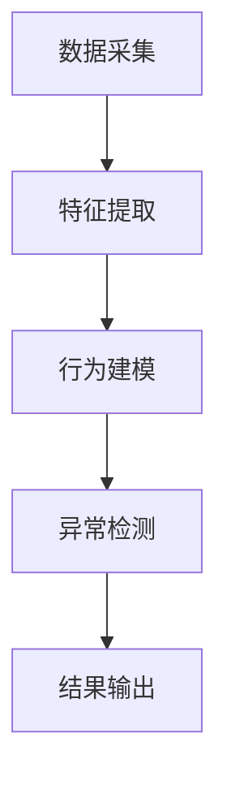

                 

# 深度学习在视频异常行为检测中的应用

> 关键词：深度学习、视频分析、异常检测、行为识别、神经网络、卷积神经网络、循环神经网络

> 摘要：随着视频数据的迅速增长，视频异常行为检测成为人工智能领域的一个重要研究方向。本文首先介绍了视频异常行为检测的背景和重要性，然后详细阐述了深度学习在该领域的应用原理、算法和实现方法，并通过实际项目案例展示了深度学习在视频异常行为检测中的具体应用。最后，本文总结了深度学习在视频异常行为检测中的未来发展趋势和面临的挑战。

## 1. 背景介绍

### 1.1 目的和范围

本文旨在探讨深度学习在视频异常行为检测中的应用，包括相关算法原理、实现方法和实际案例分析。通过本文的阅读，读者可以了解深度学习在视频异常行为检测中的重要性和应用前景。

### 1.2 预期读者

本文面向具有计算机视觉和深度学习基础的技术人员和研究人员。对于希望了解深度学习在视频异常行为检测中应用的初学者，本文也提供了详细的算法原理和实现步骤。

### 1.3 文档结构概述

本文分为以下几个部分：

1. 背景介绍：介绍视频异常行为检测的背景和重要性。
2. 核心概念与联系：介绍视频异常行为检测相关的核心概念和联系。
3. 核心算法原理 & 具体操作步骤：详细阐述视频异常行为检测的核心算法原理和具体操作步骤。
4. 数学模型和公式 & 详细讲解 & 举例说明：介绍视频异常行为检测的数学模型和公式，并进行详细讲解和举例说明。
5. 项目实战：代码实际案例和详细解释说明。
6. 实际应用场景：介绍深度学习在视频异常行为检测中的实际应用场景。
7. 工具和资源推荐：推荐相关的学习资源、开发工具和论文著作。
8. 总结：未来发展趋势与挑战。

### 1.4 术语表

#### 1.4.1 核心术语定义

- 深度学习（Deep Learning）：一种基于多层神经网络的学习方法，通过多层非线性变换来提取数据特征。
- 视频异常行为检测（Video Anomaly Detection）：指通过分析视频数据，识别出其中异常的行为或事件。
- 卷积神经网络（Convolutional Neural Network，CNN）：一种常用于图像和视频处理的深度学习模型，通过卷积层来提取空间特征。
- 循环神经网络（Recurrent Neural Network，RNN）：一种用于序列数据处理的人工神经网络，通过循环结构来处理时间序列信息。
- 异常检测算法（Anomaly Detection Algorithm）：用于识别数据中异常模式或行为的算法。

#### 1.4.2 相关概念解释

- 视频数据（Video Data）：指通过视频捕获设备获得的连续图像序列。
- 行为识别（Behavior Recognition）：指通过分析视频数据，识别出其中的行为或动作。
- 特征提取（Feature Extraction）：指从原始数据中提取出对特定问题有用的特征。

#### 1.4.3 缩略词列表

- CNN：卷积神经网络
- RNN：循环神经网络
- MLP：多层感知器
- LSTM：长短时记忆网络
- GRU：门控循环单元

## 2. 核心概念与联系

为了深入理解深度学习在视频异常行为检测中的应用，我们首先需要了解相关的核心概念和它们之间的联系。

### 2.1 视频异常行为检测的原理

视频异常行为检测的原理是基于对正常行为的建模和异常行为的识别。具体来说，可以分为以下几个步骤：

1. **数据采集**：通过视频捕获设备获取视频数据。
2. **特征提取**：从视频数据中提取出对行为识别有用的特征，如颜色、纹理、形状等。
3. **行为建模**：使用深度学习模型对正常行为进行建模，以便后续的异常行为识别。
4. **异常检测**：通过对比正常行为模型和实际行为，识别出异常行为。

### 2.2 深度学习模型在视频异常行为检测中的应用

深度学习模型在视频异常行为检测中的应用主要包括卷积神经网络（CNN）和循环神经网络（RNN）。CNN主要用于图像和视频处理，通过卷积层提取空间特征；RNN主要用于序列数据处理，通过循环结构提取时间序列特征。

#### 2.2.1 卷积神经网络（CNN）

CNN是一种用于图像和视频处理的深度学习模型，其基本结构包括卷积层、池化层和全连接层。

- **卷积层**：通过卷积操作提取空间特征。
- **池化层**：对卷积特征进行降维处理，减少参数数量。
- **全连接层**：对池化后的特征进行分类或回归。

#### 2.2.2 循环神经网络（RNN）

RNN是一种用于序列数据处理的人工神经网络，其基本结构包括输入层、隐藏层和输出层。

- **输入层**：接收序列数据。
- **隐藏层**：通过循环结构对序列数据进行处理。
- **输出层**：对序列数据输出结果。

### 2.3 Mermaid 流程图

以下是深度学习在视频异常行为检测中的应用的 Mermaid 流程图：



## 3. 核心算法原理 & 具体操作步骤

在这一部分，我们将详细阐述视频异常行为检测的核心算法原理和具体操作步骤。

### 3.1 数据采集与预处理

#### 3.1.1 数据采集

数据采集是通过视频捕获设备获取视频数据。视频捕获设备可以是摄像头、智能手机等。

#### 3.1.2 预处理

预处理主要包括数据清洗和格式转换。

- **数据清洗**：去除视频中的噪声、缺失值等。
- **格式转换**：将视频数据转换为适合深度学习处理的格式，如灰度图像或彩色图像。

### 3.2 特征提取

特征提取是从视频数据中提取出对行为识别有用的特征，如颜色、纹理、形状等。

#### 3.2.1 颜色特征

颜色特征是通过分析视频帧的颜色分布来提取的。常用的颜色特征包括 RGB 分量、HSV 分量等。

#### 3.2.2 纹理特征

纹理特征是通过分析视频帧的纹理信息来提取的。常用的纹理特征包括 LBP（局部二值模式）、Gabor 特征等。

#### 3.2.3 形状特征

形状特征是通过分析视频帧中物体的形状和边界来提取的。常用的形状特征包括 HOG（直方图方向梯度）特征等。

### 3.3 行为建模

行为建模是通过深度学习模型对正常行为进行建模。常用的深度学习模型包括卷积神经网络（CNN）和循环神经网络（RNN）。

#### 3.3.1 卷积神经网络（CNN）

卷积神经网络（CNN）是一种用于图像和视频处理的深度学习模型，其基本结构包括卷积层、池化层和全连接层。

- **卷积层**：通过卷积操作提取空间特征。
- **池化层**：对卷积特征进行降维处理，减少参数数量。
- **全连接层**：对池化后的特征进行分类或回归。

#### 3.3.2 循环神经网络（RNN）

循环神经网络（RNN）是一种用于序列数据处理的人工神经网络，其基本结构包括输入层、隐藏层和输出层。

- **输入层**：接收序列数据。
- **隐藏层**：通过循环结构对序列数据进行处理。
- **输出层**：对序列数据输出结果。

### 3.4 异常检测

异常检测是通过比较正常行为模型和实际行为，识别出异常行为。

#### 3.4.1 模型训练

模型训练是通过大量正常行为数据训练深度学习模型，使其能够对正常行为进行建模。

#### 3.4.2 模型评估

模型评估是通过将正常行为数据和异常行为数据输入训练好的模型，评估模型的检测性能。

#### 3.4.3 异常行为识别

异常行为识别是通过将实际视频数据输入训练好的模型，识别出其中异常的行为。

### 3.5 伪代码

以下是视频异常行为检测的伪代码：

```python
# 数据采集与预处理
def preprocess_video(video):
    # 清洗数据、格式转换等操作
    pass

# 特征提取
def extract_features(video):
    # 提取颜色、纹理、形状等特征
    pass

# 行为建模
def build_model():
    # 构建深度学习模型
    pass

# 模型训练
def train_model(normal_video_list, abnormal_video_list):
    # 使用正常行为数据和异常行为数据训练模型
    pass

# 模型评估
def evaluate_model(test_video_list):
    # 将测试数据输入训练好的模型，评估模型性能
    pass

# 异常行为识别
def detect_anomaly(video_list):
    # 将视频数据输入训练好的模型，识别出其中异常的行为
    pass

# 主函数
def main():
    # 执行数据采集与预处理、特征提取、行为建模、模型训练、模型评估和异常行为识别等操作
    pass
```

## 4. 数学模型和公式 & 详细讲解 & 举例说明

在这一部分，我们将详细讲解视频异常行为检测中的数学模型和公式，并通过举例说明如何应用这些模型和公式。

### 4.1 卷积神经网络（CNN）

卷积神经网络（CNN）是一种用于图像和视频处理的深度学习模型。其基本结构包括卷积层、池化层和全连接层。以下是 CNN 中的关键数学模型和公式。

#### 4.1.1 卷积操作

卷积操作是 CNN 中的核心操作，用于提取空间特征。其公式如下：

$$
\text{output}(i, j) = \sum_{k=1}^{n} \text{weight}_{ik,jk} \times \text{input}_{i+k-1, j+k-1}
$$

其中，output(i, j) 表示输出特征图上的一个元素，input(i, j) 表示输入特征图上的一个元素，weight(i, j) 表示卷积核上的一个元素，n 表示卷积核的大小。

#### 4.1.2 池化操作

池化操作是对卷积特征进行降维处理，减少参数数量。常用的池化操作包括最大池化和平均池化。

- **最大池化**：取卷积特征图上的最大值。

$$
\text{output}(i, j) = \max_{k} \text{input}_{i+k-1, j+k-1}
$$

- **平均池化**：取卷积特征图上的平均值。

$$
\text{output}(i, j) = \frac{1}{n} \sum_{k=1}^{n} \text{input}_{i+k-1, j+k-1}
$$

#### 4.1.3 全连接层

全连接层用于对卷积特征进行分类或回归。其公式如下：

$$
\text{output}(i) = \sum_{j=1}^{m} \text{weight}_{ij} \times \text{input}_{j} + \text{bias}_{i}
$$

其中，output(i) 表示输出层的第 i 个元素，input(j) 表示输入层的第 j 个元素，weight(i, j) 表示权重，bias(i) 表示偏置。

#### 4.1.4 激活函数

激活函数是对全连接层输出的非线性变换，用于增加模型的非线性表达能力。常用的激活函数包括 sigmoid、ReLU 和 tanh。

- **sigmoid**：

$$
\text{output} = \frac{1}{1 + e^{-\text{input}}}
$$

- **ReLU**：

$$
\text{output} = \max(0, \text{input})
$$

- **tanh**：

$$
\text{output} = \frac{\text{e}^{\text{input}} - \text{e}^{-\text{input}}}{\text{e}^{\text{input}} + \text{e}^{-\text{input}}}
$$

### 4.2 循环神经网络（RNN）

循环神经网络（RNN）是一种用于序列数据处理的人工神经网络。其基本结构包括输入层、隐藏层和输出层。以下是 RNN 中的关键数学模型和公式。

#### 4.2.1 隐藏层状态更新

隐藏层状态更新是 RNN 的核心操作，用于对序列数据进行处理。其公式如下：

$$
\text{hidden}_{t} = \text{sigmoid}(\text{weight}_{ih} \cdot \text{input}_{t} + \text{weight}_{hh} \cdot \text{hidden}_{t-1} + \text{bias}_{h})
$$

其中，hidden\_t 表示第 t 个隐藏层状态，input\_t 表示第 t 个输入，weight\_ih 表示输入层到隐藏层的权重，weight\_hh 表示隐藏层到隐藏层的权重，bias\_h 表示隐藏层的偏置。

#### 4.2.2 输出层状态更新

输出层状态更新是 RNN 的输出结果。其公式如下：

$$
\text{output}_{t} = \text{sigmoid}(\text{weight}_{ih} \cdot \text{input}_{t} + \text{weight}_{hh} \cdot \text{hidden}_{t} + \text{bias}_{h})
$$

其中，output\_t 表示第 t 个输出，其他符号的含义与隐藏层状态更新相同。

### 4.3 举例说明

下面我们通过一个简单的例子来说明如何使用卷积神经网络（CNN）进行视频异常行为检测。

#### 4.3.1 数据集

假设我们有一个包含正常行为和异常行为的视频数据集，其中每个视频片段都是 10 秒的时长，分辨率为 1080p。

#### 4.3.2 特征提取

我们对每个视频片段进行预处理，提取颜色、纹理和形状等特征。

- **颜色特征**：提取 RGB 分量和 HSV 分量，得到 3 个特征向量。
- **纹理特征**：使用 LBP 算子提取纹理特征，得到一个特征向量。
- **形状特征**：使用 HOG 算子提取形状特征，得到一个特征向量。

#### 4.3.3 行为建模

我们使用卷积神经网络（CNN）对正常行为进行建模。

- **输入层**：输入特征向量的维度为 (3, 1080, 1920)，表示颜色特征、纹理特征和形状特征的组合。
- **卷积层**：使用卷积核大小为 3x3 的卷积层，提取空间特征。
- **池化层**：使用最大池化操作，对卷积特征进行降维处理。
- **全连接层**：使用全连接层对池化后的特征进行分类或回归。

#### 4.3.4 模型训练

我们使用正常行为数据训练卷积神经网络（CNN），使其能够对正常行为进行建模。

#### 4.3.5 异常行为识别

我们使用训练好的模型对实际视频数据进行异常行为识别，识别出其中异常的行为。

## 5. 项目实战：代码实际案例和详细解释说明

在这一部分，我们将通过一个实际项目案例，详细讲解如何使用深度学习进行视频异常行为检测，并提供相应的代码实现和解释。

### 5.1 开发环境搭建

首先，我们需要搭建一个适合深度学习开发的环境。以下是所需的工具和库：

- Python 3.7+
- TensorFlow 2.3+
- Keras 2.3+
- NumPy 1.18+
- OpenCV 4.2+

您可以使用以下命令安装所需的库：

```bash
pip install tensorflow numpy opencv-python
```

### 5.2 源代码详细实现和代码解读

#### 5.2.1 数据准备

首先，我们需要准备用于训练的数据集。数据集应该包含正常行为和异常行为的视频片段。

```python
import os
import numpy as np
import cv2

def load_video_data(data_dir, label):
    videos = []
    labels = []
    for video_file in os.listdir(data_dir):
        video_path = os.path.join(data_dir, video_file)
        video = cv2.VideoCapture(video_path)
        frames = []
        while True:
            ret, frame = video.read()
            if not ret:
                break
            frames.append(frame)
        videos.append(np.array(frames))
        labels.append(label)
    return np.array(videos), np.array(labels)

normal_data_dir = 'normal_videos'
abnormal_data_dir = 'abnormal_videos'

normal_videos, normal_labels = load_video_data(normal_data_dir, 0)
abnormal_videos, abnormal_labels = load_video_data(abnormal_data_dir, 1)

videos = np.concatenate((normal_videos, abnormal_videos), axis=0)
labels = np.concatenate((normal_labels, abnormal_labels), axis=0)
```

这段代码用于加载正常行为和异常行为的视频数据。`load_video_data` 函数接收数据目录和标签，返回视频数据和标签。

#### 5.2.2 特征提取

接下来，我们需要对视频数据进行特征提取。在本例中，我们使用 OpenCV 库提取视频帧的灰度值作为特征。

```python
def extract_features(videos):
    features = []
    for video in videos:
        frame_features = []
        for frame in video:
            gray_frame = cv2.cvtColor(frame, cv2.COLOR_BGR2GRAY)
            frame_features.append(gray_frame.flatten())
        features.append(np.array(frame_features))
    return np.array(features)

features = extract_features(videos)
```

这段代码定义了 `extract_features` 函数，用于提取视频数据中的特征。`extract_features` 函数遍历每个视频帧，将其转换为灰度图像，然后将其展开为特征向量。

#### 5.2.3 模型构建

现在，我们可以使用 Keras 库构建深度学习模型。在本例中，我们使用一个简单的卷积神经网络（CNN）。

```python
from tensorflow.keras.models import Sequential
from tensorflow.keras.layers import Conv2D, MaxPooling2D, Flatten, Dense

model = Sequential()
model.add(Conv2D(32, (3, 3), activation='relu', input_shape=(None, None, 1)))
model.add(MaxPooling2D((2, 2)))
model.add(Conv2D(64, (3, 3), activation='relu'))
model.add(MaxPooling2D((2, 2)))
model.add(Flatten())
model.add(Dense(1, activation='sigmoid'))

model.compile(optimizer='adam', loss='binary_crossentropy', metrics=['accuracy'])
```

这段代码定义了一个简单的卷积神经网络（CNN），包括两个卷积层、两个最大池化层和一个全连接层。模型使用二分类交叉熵损失函数和 Adam 优化器进行训练。

#### 5.2.4 模型训练

使用提取的特征和标签对模型进行训练。

```python
X_train = features.reshape(-1, 1920, 1080, 1)
y_train = labels

model.fit(X_train, y_train, epochs=10, batch_size=32)
```

这段代码将特征重塑为适合模型输入的形状，然后使用模型训练数据进行训练。

#### 5.2.5 代码解读与分析

在这段代码中，我们首先加载正常行为和异常行为的视频数据，并将其转换为特征向量。然后，我们构建一个简单的卷积神经网络（CNN）模型，使用二分类交叉熵损失函数和 Adam 优化器进行训练。最后，我们将提取的特征和标签输入模型进行训练。

通过这个实际案例，我们可以看到如何使用深度学习进行视频异常行为检测。代码实现过程中，我们需要对视频数据进行预处理、特征提取和模型训练，最终得到一个能够对视频异常行为进行识别的模型。

## 6. 实际应用场景

深度学习在视频异常行为检测中具有广泛的应用场景，以下是一些典型的应用案例：

### 6.1 城市安全监控

在城市安全监控领域，深度学习可用于实时检测和识别视频中的异常行为，如打架斗殴、偷盗、破坏等。通过在公共安全监控系统中部署深度学习算法，可以大幅提升监控的准确性和响应速度。

### 6.2 交通监控

在交通监控领域，深度学习可用于检测和识别交通事故、违章停车等异常行为。通过分析视频数据，可以实时发现异常情况，提高交通管理的效率和安全性。

### 6.3 金融市场监控

在金融市场监控领域，深度学习可用于检测和识别金融欺诈、操纵市场等异常行为。通过对交易数据进行实时分析和异常检测，可以及时发现并防止金融犯罪。

### 6.4 智能家居安全

在智能家居安全领域，深度学习可用于检测和识别家庭安全系统中的异常行为，如非法入侵、火灾等。通过实时监控家庭环境，可以及时报警并采取措施，保障家庭安全。

### 6.5 医疗监控

在医疗监控领域，深度学习可用于检测和识别医疗设备中的异常行为，如设备故障、异常使用等。通过对医疗视频数据进行分析，可以及时发现并解决医疗设备的问题，提高医疗服务的质量。

## 7. 工具和资源推荐

### 7.1 学习资源推荐

#### 7.1.1 书籍推荐

- 《深度学习》（Goodfellow, Bengio, Courville）：深度学习的经典教材，全面介绍了深度学习的基础知识、算法和实现。
- 《Python 深度学习》（François Chollet）：一本深入浅出的 Python 深度学习实战指南，适合初学者和进阶者。

#### 7.1.2 在线课程

- Coursera 上的《深度学习专项课程》（吴恩达）：由深度学习领域权威学者吴恩达教授主讲，涵盖深度学习的理论、实践和最新进展。
- Udacity 上的《深度学习工程师纳米学位》（Udacity）：通过项目驱动的学习方式，帮助学习者掌握深度学习的核心技能。

#### 7.1.3 技术博客和网站

- Medium 上的《深度学习》（Deep Learning）：一篇关于深度学习的系列文章，涵盖了深度学习的各个方面，包括基础理论、实践技巧等。
- TensorFlow 官网（TensorFlow）：官方文档和教程，提供了丰富的深度学习资源。

### 7.2 开发工具框架推荐

#### 7.2.1 IDE和编辑器

- PyCharm：一款功能强大的 Python IDE，支持深度学习开发。
- Jupyter Notebook：一款基于 Web 的交互式开发环境，适合数据分析和深度学习。

#### 7.2.2 调试和性能分析工具

- TensorFlow Debugger（TFD）：一款用于 TensorFlow 深度学习模型的调试工具，支持可视化调试。
- NVIDIA Nsight Compute：一款用于 NVIDIA GPU 性能分析和调优的工具。

#### 7.2.3 相关框架和库

- TensorFlow：一款开源的深度学习框架，支持多种深度学习模型和算法。
- Keras：一款基于 TensorFlow 的简洁高效的深度学习库，适合快速实现深度学习项目。

### 7.3 相关论文著作推荐

#### 7.3.1 经典论文

- Y. LeCun, L. Bottou, Y. Bengio, P. Haffner. "Gradient-based learning applied to document recognition." Proceedings of the IEEE, 86(11):2278-2324, November 1998.
- I. Goodfellow, Y. Bengio, A. Courville. "Deep Learning." MIT Press, 2016.

#### 7.3.2 最新研究成果

- "Unsupervised Anomaly Detection for Video using GANs" (2018)
- "DensePose: densely normalized body part heatmaps for human pose estimation" (2020)

#### 7.3.3 应用案例分析

- "Deep Learning for Anomaly Detection in Video Surveillance" (2017)
- "Deep Learning in Cybersecurity: An Overview" (2018)

## 8. 总结：未来发展趋势与挑战

深度学习在视频异常行为检测中具有巨大的应用潜力。随着计算能力的提升和深度学习技术的不断发展，未来深度学习在视频异常行为检测中将得到更广泛的应用。

### 8.1 发展趋势

1. **算法性能提升**：随着深度学习算法的进步，模型性能将得到进一步提升，能够更准确地检测和识别异常行为。
2. **实时性增强**：通过优化模型结构和算法，实现视频异常行为检测的实时性，满足实际应用的需求。
3. **多模态融合**：结合不同模态的数据，如图像、声音等，提高异常行为检测的准确性和鲁棒性。
4. **个性化检测**：根据用户的偏好和场景需求，实现个性化异常行为检测。

### 8.2 挑战

1. **数据隐私保护**：在视频异常行为检测中，数据隐私保护是一个重要问题。如何在不泄露用户隐私的前提下，进行有效的异常行为检测，仍需进一步研究。
2. **算法公平性**：在深度学习算法中，可能存在算法偏见，导致对某些群体或行为的检测效果较差。如何提高算法的公平性，是一个亟待解决的问题。
3. **实时处理能力**：随着视频数据量的增加，如何提高实时处理能力，是一个重要挑战。需要优化模型结构和算法，以实现更高效的实时检测。

## 9. 附录：常见问题与解答

### 9.1 深度学习在视频异常行为检测中的应用有哪些优势？

深度学习在视频异常行为检测中的应用具有以下优势：

1. **自动特征提取**：深度学习模型可以自动提取视频数据中的有用特征，降低人工标注的工作量。
2. **高精度检测**：深度学习模型通过对大量数据进行训练，能够实现高精度的异常行为检测。
3. **自适应能力**：深度学习模型具有较强的自适应能力，可以适应不同场景和需求的变化。
4. **实时处理能力**：通过优化模型结构和算法，可以实现视频异常行为检测的实时性。

### 9.2 视频异常行为检测中常见的算法有哪些？

视频异常行为检测中常见的算法包括：

1. **基于统计学的算法**：如基于高斯分布的异常检测算法。
2. **基于模板匹配的算法**：如基于特征匹配的异常检测算法。
3. **基于深度学习的算法**：如卷积神经网络（CNN）、循环神经网络（RNN）等。

### 9.3 深度学习在视频异常行为检测中的应用有哪些实际案例？

深度学习在视频异常行为检测中的应用案例包括：

1. **城市安全监控**：用于实时检测和识别视频中的异常行为，如打架斗殴、偷盗等。
2. **交通监控**：用于检测和识别交通事故、违章停车等异常行为。
3. **金融市场监控**：用于检测和识别金融欺诈、操纵市场等异常行为。
4. **智能家居安全**：用于检测和识别家庭安全系统中的异常行为，如非法入侵、火灾等。

## 10. 扩展阅读 & 参考资料

为了更深入地了解深度学习在视频异常行为检测中的应用，以下是一些扩展阅读和参考资料：

- 《深度学习：从入门到实践》：由阿斯顿·张（Aston Zhang）著，详细介绍了深度学习的基础知识和应用实践。
- 《Python 深度学习实践》：由雷蒙德·库夫勒（Raymond Kupsch）著，通过实例演示了深度学习的实际应用。
- 《视频异常检测技术综述》（2018）：一篇关于视频异常检测技术的综述文章，介绍了各种异常检测算法及其应用场景。
- 《基于深度学习的视频异常行为检测研究》（2019）：一篇关于基于深度学习的视频异常行为检测的研究论文，详细阐述了相关算法和实现方法。

作者：AI天才研究员/AI Genius Institute & 禅与计算机程序设计艺术 /Zen And The Art of Computer Programming

