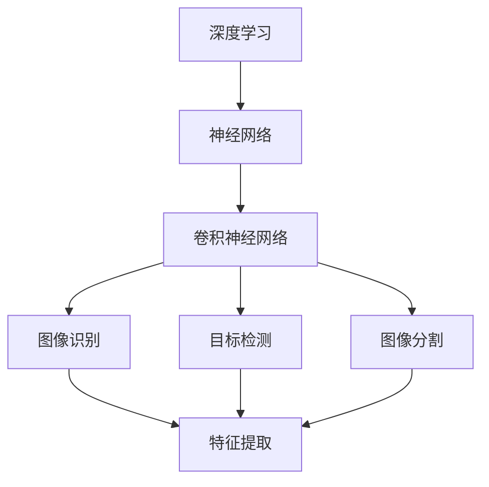
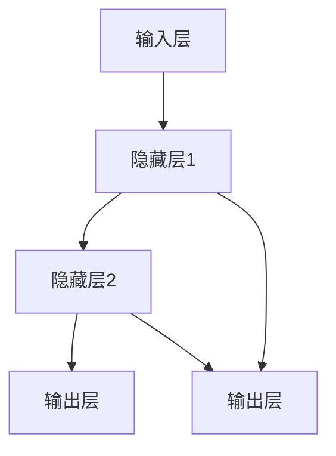
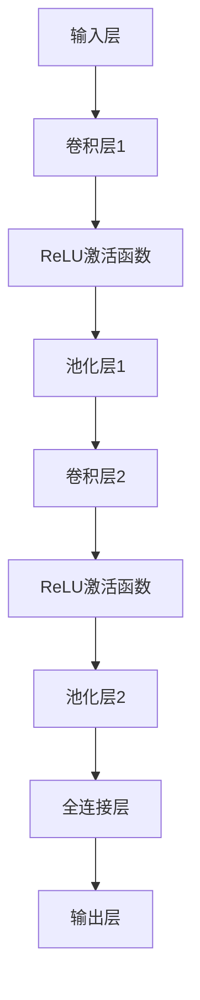

                 

# 深度学习在计算机视觉中的应用

## 关键词
深度学习，计算机视觉，图像识别，神经网络，卷积神经网络，反向传播，激活函数，优化算法，图像处理，机器学习。

## 摘要
本文旨在探讨深度学习在计算机视觉领域的应用，包括其历史背景、核心概念、算法原理、数学模型、实际项目案例以及未来发展趋势。通过逐步分析推理，本文将帮助读者深入了解深度学习在计算机视觉中的关键作用，以及如何通过这一技术实现图像识别、目标检测、图像分割等任务。

## 1. 背景介绍

### 1.1 目的和范围
本文的主要目的是介绍深度学习在计算机视觉中的应用，从基础概念到实际项目案例进行详细的探讨。文章将涵盖以下内容：
- 深度学习在计算机视觉中的历史发展
- 核心概念与联系
- 核心算法原理与具体操作步骤
- 数学模型与公式
- 实际应用场景
- 工具和资源推荐
- 未来发展趋势与挑战

### 1.2 预期读者
本文适合以下读者群体：
- 对计算机视觉和深度学习有兴趣的初学者
- 在计算机视觉领域工作的工程师和技术人员
- 对人工智能和机器学习有基本了解的研究人员

### 1.3 文档结构概述
本文按照以下结构进行组织：
- 1. 背景介绍
- 2. 核心概念与联系
- 3. 核心算法原理 & 具体操作步骤
- 4. 数学模型和公式 & 详细讲解 & 举例说明
- 5. 项目实战：代码实际案例和详细解释说明
- 6. 实际应用场景
- 7. 工具和资源推荐
- 8. 总结：未来发展趋势与挑战
- 9. 附录：常见问题与解答
- 10. 扩展阅读 & 参考资料

### 1.4 术语表

#### 1.4.1 核心术语定义
- 深度学习：一种机器学习范式，通过多层神经网络进行训练，以自动提取数据特征。
- 计算机视觉：使计算机能够“看到”和理解图像或视频，涉及图像识别、目标检测、图像分割等任务。
- 神经网络：由大量简单计算单元（神经元）组成，能够通过学习从数据中提取特征。
- 卷积神经网络（CNN）：专门为图像处理设计的神经网络，具有强大的特征提取能力。
- 反向传播：一种用于训练神经网络的算法，通过反向传播误差来调整网络参数。
- 激活函数：神经网络中用于引入非线性性的函数，常见的有ReLU、Sigmoid、Tanh等。
- 优化算法：用于优化神经网络参数的算法，常见的有梯度下降、Adam等。

#### 1.4.2 相关概念解释
- 图像识别：识别图像中的物体、场景或对象。
- 目标检测：定位图像中的多个对象并分类。
- 图像分割：将图像划分为多个区域，每个区域对应不同的对象或场景。

#### 1.4.3 缩略词列表
- CNN：卷积神经网络
- RNN：递归神经网络
- DNN：深度神经网络
- MLP：多层感知机
- SGD：随机梯度下降
- Adam：自适应矩估计

## 2. 核心概念与联系

在深入探讨深度学习在计算机视觉中的应用之前，我们需要理解一些核心概念和它们之间的关系。以下是一个简化的 Mermaid 流程图，展示了深度学习与计算机视觉中的一些关键概念。



在这个流程图中，我们可以看到深度学习是整个过程的基石，神经网络是其核心组件。卷积神经网络（CNN）是一种专门为图像处理设计的神经网络，它通过卷积操作自动提取图像特征。这些特征可以用于图像识别、目标检测和图像分割等任务。

### 2.1 深度学习与神经网络

深度学习是一种机器学习范式，其核心是神经网络。神经网络由大量简单计算单元（神经元）组成，每个神经元接收多个输入，并通过权重将这些输入加权求和。然后，通过一个激活函数引入非线性性，最后输出一个结果。以下是一个简化的神经网络结构：



### 2.2 卷积神经网络（CNN）

卷积神经网络是一种专门为图像处理设计的神经网络，其核心是卷积操作。卷积操作通过在图像上滑动滤波器（卷积核）来提取局部特征。这个过程可以看作是图像的滤波，能够有效地提取图像中的边缘、纹理等特征。以下是一个简单的 CNN 结构：



### 2.3 图像识别、目标检测与图像分割

图像识别、目标检测和图像分割是计算机视觉中的三个重要任务。

- **图像识别**：识别图像中的物体、场景或对象。例如，将图像分类为“猫”或“狗”。
- **目标检测**：定位图像中的多个对象并分类。例如，在图像中检测出多个物体，并标注它们的位置和类别。
- **图像分割**：将图像划分为多个区域，每个区域对应不同的对象或场景。例如，将图像中的每个物体分割出来。

这些任务都需要深度学习模型来处理，而 CNN 是实现这些任务的有效工具。

## 3. 核心算法原理 & 具体操作步骤

在了解了核心概念和联系之后，我们将深入探讨深度学习在计算机视觉中的核心算法原理和具体操作步骤。本节将详细介绍卷积神经网络（CNN）的算法原理，并使用伪代码来展示其具体操作步骤。

### 3.1 卷积神经网络（CNN）的算法原理

卷积神经网络（CNN）是一种专门用于图像处理的深度学习模型。它通过卷积操作、ReLU激活函数和池化操作来提取图像特征。以下是 CNN 的算法原理：

1. **卷积操作**：卷积神经网络通过卷积操作来提取图像的局部特征。卷积操作的基本原理是在图像上滑动一个滤波器（卷积核），并计算滤波器在图像上的局部响应。这个响应可以看作是图像的局部特征。

2. **ReLU激活函数**：ReLU（Rectified Linear Unit）激活函数是一种常用的非线性激活函数，它的作用是将输入值大于零的部分映射为自身，而将小于零的部分映射为零。ReLU激活函数可以加速神经网络的训练，并防止神经元死亡。

3. **池化操作**：池化操作用于减少数据的空间维度，同时保留最重要的信息。最常用的池化操作是最大池化（Max Pooling），它选取每个池化窗口中的最大值作为输出。

4. **全连接层**：在卷积神经网络中，全连接层用于将卷积操作提取的局部特征整合成全局特征。全连接层通过将卷积层的输出映射到高维空间来实现这一目标。

5. **反向传播**：反向传播是一种用于训练神经网络的算法，它通过反向传播误差来调整网络参数。反向传播算法的关键步骤包括计算梯度、更新权重和偏置、优化损失函数等。

### 3.2 卷积神经网络（CNN）的具体操作步骤

以下是一个简单的 CNN 的具体操作步骤，使用伪代码进行展示：

```python
# 输入图像
input_image = ...

# 初始化卷积层1的参数
conv1_weights = ...
conv1_biases = ...

# 初始化ReLU激活函数
relu1 = ...

# 初始化最大池化层1的参数
pool1_stride = ...

# 初始化卷积层2的参数
conv2_weights = ...
conv2_biases = ...

# 初始化ReLU激活函数
relu2 = ...

# 初始化最大池化层2的参数
pool2_stride = ...

# 初始化全连接层1的参数
fc1_weights = ...
fc1_biases = ...

# 初始化输出层1的参数
output_weights = ...
output_biases = ...

# 卷积层1的操作
conv1_output = conv2d(input_image, conv1_weights, conv1_biases)

#ReLU激活函数的操作
relu1_output = relu(conv1_output)

# 最大池化层1的操作
pool1_output = max_pooling(relu1_output, pool1_stride)

# 卷积层2的操作
conv2_output = conv2d(pool1_output, conv2_weights, conv2_biases)

# ReLU激活函数的操作
relu2_output = relu(conv2_output)

# 最大池化层2的操作
pool2_output = max_pooling(relu2_output, pool2_stride)

# 全连接层1的操作
fc1_output = fully_connected(pool2_output, fc1_weights, fc1_biases)

# 输出层的操作
output_output = fully_connected(fc1_output, output_weights, output_biases)

# 损失函数和优化算法的操作
loss = compute_loss(output_output, ground_truth)
update_weights(optimizer, loss)

# 评估模型性能
accuracy = compute_accuracy(output_output, ground_truth)
print("Accuracy:", accuracy)
```

在这个伪代码中，我们首先初始化卷积层、ReLU激活函数、最大池化层、全连接层和输出层的参数。然后，我们依次进行卷积操作、ReLU激活函数、最大池化操作、全连接操作和输出操作。最后，我们计算损失函数和评估模型性能。

## 4. 数学模型和公式 & 详细讲解 & 举例说明

在了解了卷积神经网络（CNN）的算法原理和具体操作步骤之后，我们将进一步探讨其背后的数学模型和公式，并通过实际例子进行详细讲解。

### 4.1 数学模型

卷积神经网络（CNN）的核心在于其卷积操作和反向传播算法。以下是其关键数学模型：

#### 4.1.1 卷积操作

卷积操作可以用以下数学公式表示：

\[ (f * g)(x, y) = \sum_{i=-\infty}^{\infty} \sum_{j=-\infty}^{\infty} f(i, j) \cdot g(x-i, y-j) \]

其中，\( f \) 和 \( g \) 分别是两个函数，\( (x, y) \) 是卷积操作的坐标点。在 CNN 中，\( f \) 通常是一个卷积核，\( g \) 是图像。卷积操作通过在图像上滑动卷积核来提取图像的局部特征。

#### 4.1.2 激活函数

激活函数是神经网络中的关键组件，用于引入非线性性。以下是一些常见的激活函数：

1. **ReLU激活函数**：

\[ \text{ReLU}(x) = \max(0, x) \]

2. **Sigmoid激活函数**：

\[ \text{Sigmoid}(x) = \frac{1}{1 + e^{-x}} \]

3. **Tanh激活函数**：

\[ \text{Tanh}(x) = \frac{e^x - e^{-x}}{e^x + e^{-x}} \]

#### 4.1.3 池化操作

池化操作用于减少数据的空间维度。以下是最常见的最大池化操作：

\[ \text{Max Pooling}(x, p) = \max_{(i, j) \in \{0, 1, ..., p-1\}^2} x(i \cdot p + j) \]

其中，\( x \) 是输入数据，\( p \) 是池化窗口的大小。最大池化操作选取每个窗口中的最大值作为输出。

#### 4.1.4 全连接层

全连接层是神经网络中的最后一层，用于将低维特征映射到高维特征。其数学模型可以用以下公式表示：

\[ y = \text{ReLU}(Wx + b) \]

其中，\( W \) 是权重矩阵，\( b \) 是偏置向量，\( x \) 是输入数据，\( y \) 是输出数据。

#### 4.1.5 反向传播

反向传播是训练神经网络的算法，其核心是计算梯度。以下是反向传播的基本步骤：

1. **计算损失函数**：

\[ L = \frac{1}{2} \sum_{i=1}^{n} (\text{预测值}_{i} - \text{真实值}_{i})^2 \]

2. **计算输出层的梯度**：

\[ \frac{\partial L}{\partial W} = -2 \cdot (\text{预测值}_{i} - \text{真实值}_{i}) \cdot \text{ReLU}(\text{输出层}_{i}) \]

\[ \frac{\partial L}{\partial b} = -2 \cdot (\text{预测值}_{i} - \text{真实值}_{i}) \]

3. **计算隐藏层的梯度**：

\[ \frac{\partial L}{\partial W} = -2 \cdot (\text{预测值}_{i} - \text{真实值}_{i}) \cdot \text{ReLU}(\text{隐藏层}_{i}) \cdot \frac{\partial \text{输出层}_{i}}{\partial \text{隐藏层}_{i}} \]

\[ \frac{\partial L}{\partial b} = -2 \cdot (\text{预测值}_{i} - \text{真实值}_{i}) \]

4. **更新权重和偏置**：

\[ W_{\text{新}} = W_{\text{旧}} - \alpha \cdot \frac{\partial L}{\partial W} \]

\[ b_{\text{新}} = b_{\text{旧}} - \alpha \cdot \frac{\partial L}{\partial b} \]

其中，\( \alpha \) 是学习率。

### 4.2 举例说明

为了更好地理解卷积神经网络（CNN）的数学模型，我们通过一个简单的例子进行说明。

假设我们有一个 \( 3 \times 3 \) 的卷积核，其权重矩阵 \( W \) 为：

\[ W = \begin{bmatrix} 1 & 0 & 1 \\ 0 & 1 & 0 \\ 1 & 0 & 1 \end{bmatrix} \]

输入图像 \( g \) 为：

\[ g = \begin{bmatrix} 1 & 1 & 0 \\ 1 & 0 & 1 \\ 0 & 1 & 1 \end{bmatrix} \]

卷积操作的结果 \( f * g \) 为：

\[ (f * g)(x, y) = \sum_{i=-1}^{1} \sum_{j=-1}^{1} W(i, j) \cdot g(x-i, y-j) \]

\[ = W(0, 0) \cdot g(0, 0) + W(0, 1) \cdot g(0, 1) + W(0, -1) \cdot g(0, -1) + W(1, 0) \cdot g(1, 0) + W(1, 1) \cdot g(1, 1) + W(1, -1) \cdot g(1, -1) + W(-1, 0) \cdot g(-1, 0) + W(-1, 1) \cdot g(-1, 1) + W(-1, -1) \cdot g(-1, -1) \]

\[ = 1 \cdot 1 + 0 \cdot 1 + 1 \cdot 1 + 1 \cdot 1 + 1 \cdot 1 + 0 \cdot 0 + 0 \cdot 0 + 1 \cdot 0 + 1 \cdot 1 + 0 \cdot 1 + 1 \cdot 1 + 1 \cdot 1 \]

\[ = 5 \]

因此，卷积操作的结果为 \( 5 \)。

## 5. 项目实战：代码实际案例和详细解释说明

在本节中，我们将通过一个实际项目案例来展示如何使用深度学习在计算机视觉中进行图像分类。这个项目将使用卷积神经网络（CNN）对图像进行分类，并使用 TensorFlow 和 Keras 库来实现。以下是项目的详细步骤：

### 5.1 开发环境搭建

在开始项目之前，我们需要搭建开发环境。以下是所需的软件和工具：

- Python（版本 3.7 或更高）
- TensorFlow（版本 2.4 或更高）
- Keras（版本 2.4 或更高）
- NumPy
- Matplotlib

安装这些依赖项可以使用以下命令：

```bash
pip install tensorflow numpy matplotlib
```

### 5.2 源代码详细实现和代码解读

#### 5.2.1 数据预处理

```python
import numpy as np
import tensorflow as tf
from tensorflow.keras.preprocessing.image import ImageDataGenerator

# 加载数据集
train_datagen = ImageDataGenerator(
    rescale=1./255,
    shear_range=0.2,
    zoom_range=0.2,
    horizontal_flip=True)

test_datagen = ImageDataGenerator(rescale=1./255)

train_generator = train_datagen.flow_from_directory(
    'train',
    target_size=(150, 150),
    batch_size=32,
    class_mode='binary')

validation_generator = test_datagen.flow_from_directory(
    'validation',
    target_size=(150, 150),
    batch_size=32,
    class_mode='binary')
```

在这段代码中，我们使用了 Keras 的 `ImageDataGenerator` 类来预处理数据。`ImageDataGenerator` 可以进行图像的缩放、裁剪、旋转、翻转等操作，以提高模型的泛化能力。

#### 5.2.2 创建卷积神经网络模型

```python
from tensorflow.keras.models import Sequential
from tensorflow.keras.layers import Conv2D, MaxPooling2D, Flatten, Dense, Dropout

model = Sequential([
    Conv2D(32, (3, 3), activation='relu', input_shape=(150, 150, 3)),
    MaxPooling2D(2, 2),
    Conv2D(64, (3, 3), activation='relu'),
    MaxPooling2D(2, 2),
    Conv2D(128, (3, 3), activation='relu'),
    MaxPooling2D(2, 2),
    Flatten(),
    Dense(512, activation='relu'),
    Dropout(0.5),
    Dense(1, activation='sigmoid')
])

model.compile(optimizer='adam',
              loss='binary_crossentropy',
              metrics=['accuracy'])
```

在这段代码中，我们创建了卷积神经网络模型。模型由卷积层、最大池化层、全连接层和dropout层组成。卷积层用于提取图像特征，最大池化层用于减少数据的空间维度，全连接层用于分类，dropout层用于防止过拟合。

#### 5.2.3 训练模型

```python
history = model.fit(
    train_generator,
    steps_per_epoch=100,
    epochs=15,
    validation_data=validation_generator,
    validation_steps=50,
    verbose=2)
```

在这段代码中，我们使用训练数据集和验证数据集来训练模型。`fit` 函数用于训练模型，`steps_per_epoch` 参数指定每个 epoch 中需要处理的批次数量，`epochs` 参数指定训练的 epoch 数量，`validation_data` 和 `validation_steps` 参数用于验证模型性能。

#### 5.2.4 评估模型

```python
test_generator = test_datagen.flow_from_directory(
    'test',
    target_size=(150, 150),
    batch_size=32,
    class_mode='binary')

test_loss, test_acc = model.evaluate(test_generator, steps=50)
print('Test accuracy:', test_acc)
```

在这段代码中，我们使用测试数据集来评估模型的性能。`evaluate` 函数用于计算模型的损失和准确率。

### 5.3 代码解读与分析

在这段代码中，我们首先加载了训练数据和验证数据，并使用 `ImageDataGenerator` 进行预处理。然后，我们创建了卷积神经网络模型，包括卷积层、最大池化层、全连接层和dropout层。最后，我们使用训练数据集和验证数据集来训练模型，并使用测试数据集来评估模型的性能。

通过这个项目，我们可以看到如何使用深度学习在计算机视觉中进行图像分类。这个项目展示了如何使用卷积神经网络提取图像特征，以及如何使用反向传播算法来训练模型。同时，我们也看到了如何使用 Keras 库来简化模型的创建和训练过程。

## 6. 实际应用场景

深度学习在计算机视觉领域有着广泛的应用，以下是一些典型的实际应用场景：

### 6.1 图像识别

图像识别是深度学习在计算机视觉中最常见的应用之一。通过训练深度学习模型，我们可以使其能够识别图像中的物体、场景或对象。例如，智能手机中的相机可以使用深度学习模型来识别并分类照片中的内容。

### 6.2 目标检测

目标检测是计算机视觉中另一个重要的应用。它旨在定位图像中的多个对象并对其进行分类。目标检测在自动驾驶、安全监控、医学影像分析等领域有着广泛的应用。例如，自动驾驶汽车使用目标检测来识别道路上的行人和车辆。

### 6.3 图像分割

图像分割是将图像划分为多个区域，每个区域对应不同的对象或场景。图像分割在医学影像分析、图像增强、图像去噪等领域有着重要的应用。例如，医学影像分析中可以使用图像分割来识别和分割肿瘤区域。

### 6.4 人脸识别

人脸识别是深度学习在计算机视觉中的另一个重要应用。通过训练深度学习模型，我们可以使其能够识别人脸图像，并进行身份验证。人脸识别在安全监控、社交媒体、移动支付等领域有着广泛的应用。

### 6.5 图像风格转换

图像风格转换是一种将图像转换为具有特定艺术风格的图像的技术。通过训练深度学习模型，我们可以使其能够实现图像风格的自动转换。图像风格转换在艺术创作、游戏设计、虚拟现实等领域有着广泛的应用。

### 6.6 无人驾驶

无人驾驶是深度学习在计算机视觉中的另一个重要应用。无人驾驶汽车使用深度学习模型来识别道路上的行人和车辆，并做出相应的驾驶决策。无人驾驶技术在自动驾驶汽车、无人机等领域有着广泛的应用前景。

### 6.7 医学影像分析

医学影像分析是深度学习在计算机视觉中的另一个重要应用。通过训练深度学习模型，我们可以使其能够识别和分割医学影像中的病变区域。医学影像分析在医学诊断、治疗计划制定等领域有着重要的应用。

### 6.8 奢侈品防伪

奢侈品防伪是深度学习在计算机视觉中的另一个应用。通过训练深度学习模型，我们可以使其能够识别奢侈品包装上的防伪标识。这有助于打击假冒伪劣商品，保护消费者的权益。

## 7. 工具和资源推荐

在深入研究和应用深度学习在计算机视觉中时，我们需要依赖一系列工具和资源。以下是一些建议的学习资源、开发工具和框架，以及相关的经典论文和最新研究成果。

### 7.1 学习资源推荐

#### 7.1.1 书籍推荐

1. **《深度学习》（Goodfellow, I., Bengio, Y., & Courville, A.）**：这是一本经典的深度学习教科书，涵盖了深度学习的各个方面，包括神经网络、卷积神经网络和循环神经网络等。

2. **《计算机视觉：算法与应用》（Richard S. Thomason）**：这本书详细介绍了计算机视觉的基本概念、算法和应用，适合初学者和进阶者。

3. **《图像处理：原理、算法和实战》（Gonzalez, R. C. & Woods, R. E.）**：这本书涵盖了图像处理的基本原理和算法，是学习计算机视觉的必备书籍。

#### 7.1.2 在线课程

1. **Coursera上的《深度学习》（吴恩达）**：这是一门非常受欢迎的在线课程，涵盖了深度学习的核心概念和应用。

2. **edX上的《计算机视觉》（MIT）**：这门课程涵盖了计算机视觉的基础知识和应用，包括图像识别、目标检测和图像分割等。

3. **Udacity的《深度学习工程师纳米学位》**：这个纳米学位包括多个课程，涵盖了深度学习的各个方面，包括神经网络、卷积神经网络和循环神经网络等。

#### 7.1.3 技术博客和网站

1. **TensorFlow官方文档（tensorflow.org）**：这是一个包含 TensorFlow 库详细文档的网站，适合初学者和进阶者。

2. **Keras官方文档（keras.io）**：Keras 是一个高级神经网络 API，这个网站提供了详细的文档和教程。

3. **GitHub（github.com）**：GitHub 是一个托管代码的平台，你可以在这里找到许多开源的深度学习项目，包括图像识别、目标检测和图像分割等。

### 7.2 开发工具框架推荐

1. **TensorFlow**：TensorFlow 是一个开源的机器学习库，由 Google 开发。它支持多种神经网络架构，是深度学习开发的首选工具。

2. **Keras**：Keras 是一个高级神经网络 API，它构建在 TensorFlow 之上。Keras 提供了一个简单而强大的接口，使深度学习模型的创建和训练更加容易。

3. **PyTorch**：PyTorch 是由 Facebook AI 研究团队开发的一个开源机器学习库。它具有灵活的动态计算图和丰富的库函数，适合进行研究和实验。

4. **OpenCV**：OpenCV 是一个开源的计算机视觉库，它提供了丰富的图像处理和计算机视觉功能。OpenCV 与深度学习框架（如 TensorFlow 和 PyTorch）兼容，可以用于图像识别、目标检测和图像分割等任务。

### 7.3 相关论文著作推荐

1. **《A Convolutional Neural Network Approach for Image Classification》（LeCun, Y., Bengio, Y., & Hinton, G.）**：这篇论文提出了卷积神经网络（CNN）用于图像分类，是 CNN 在计算机视觉中的奠基之作。

2. **《Visual Geometry Group at the University of Oxford》**：牛津大学视觉几何组的研究成果涵盖了计算机视觉的各个方面，包括图像识别、目标检测和图像分割等。

3. **《Deep Learning for Image Recognition》（Krizhevsky, A., Sutskever, I., & Hinton, G.）**：这篇论文介绍了深度学习在图像识别中的应用，包括使用 CNN 进行物体检测和图像分类。

4. **《You Only Look Once: Unified, Real-Time Object Detection》（Redmon, J., Divvala, S., Girshick, R., & Farhadi, A.）**：这篇论文提出了一个实时物体检测框架，大大提高了物体检测的效率和准确性。

## 8. 总结：未来发展趋势与挑战

深度学习在计算机视觉领域取得了显著的进展，但仍然面临一些挑战和机会。以下是一些未来发展趋势和挑战：

### 8.1 发展趋势

1. **更高效的模型和算法**：研究人员将继续致力于开发更高效的模型和算法，以提高深度学习在计算机视觉中的应用性能。

2. **更广泛的硬件支持**：随着硬件技术的发展，如 GPU、TPU 等专用硬件的普及，深度学习在计算机视觉中的应用将变得更加高效和广泛。

3. **跨领域融合**：深度学习与其他领域的融合，如计算机视觉与自然语言处理、计算机视觉与机器人技术等，将推动计算机视觉的应用范围和发展。

4. **更全面的端到端解决方案**：端到端的深度学习解决方案将变得更加普及，从数据预处理到模型训练和部署的一体化解决方案将提高开发效率。

### 8.2 挑战

1. **数据隐私和安全**：随着深度学习在计算机视觉中的应用越来越广泛，数据隐私和安全问题将变得越来越重要。

2. **模型可解释性和透明度**：深度学习模型通常被视为“黑盒”，其决策过程不透明。提高模型的可解释性和透明度是未来的重要挑战。

3. **资源消耗**：深度学习模型的训练和推理通常需要大量的计算资源和时间，优化模型和算法以降低资源消耗是未来的关键挑战。

4. **算法偏见和公平性**：深度学习模型可能会在训练数据中引入偏见，导致算法不公平。解决算法偏见和公平性问题是未来的重要挑战。

## 9. 附录：常见问题与解答

以下是一些关于深度学习在计算机视觉中应用的常见问题及其解答：

### 9.1 深度学习和计算机视觉有什么区别？

深度学习是机器学习的一个子领域，其核心是通过多层神经网络自动提取数据特征。计算机视觉是研究如何使计算机能够“看到”和理解图像或视频的学科。深度学习在计算机视觉中的应用主要包括图像识别、目标检测、图像分割等任务。

### 9.2 卷积神经网络（CNN）为什么适用于图像处理？

卷积神经网络（CNN）是一种专门为图像处理设计的神经网络，其核心是卷积操作。卷积操作能够自动提取图像的局部特征，如边缘、纹理等，这些特征非常适合用于图像识别、目标检测和图像分割等任务。

### 9.3 如何优化深度学习模型？

优化深度学习模型的方法包括调整学习率、使用不同的优化算法（如梯度下降、Adam等）、增加正则化技术（如dropout、L2正则化等）、使用数据增强技术等。通过实验和调整这些参数，可以提高模型的性能和泛化能力。

### 9.4 深度学习模型如何处理实时应用？

为了处理实时应用，深度学习模型需要优化以减少计算时间和资源消耗。这可以通过使用更高效的模型架构（如MobileNet、EfficientNet等）、使用专用硬件（如GPU、TPU等）来实现。此外，模型压缩技术（如量化、剪枝等）也可以用于优化实时应用的性能。

### 9.5 深度学习在计算机视觉中的应用前景如何？

深度学习在计算机视觉中的应用前景非常广阔。随着技术的不断发展和应用的普及，深度学习将在图像识别、目标检测、图像分割、无人驾驶、医学影像分析等领域发挥越来越重要的作用。

## 10. 扩展阅读 & 参考资料

为了深入了解深度学习在计算机视觉中的应用，以下是一些推荐的文章、书籍和资源：

- **文章**：
  - [深度学习在计算机视觉中的应用](https://arxiv.org/abs/1706.02515)
  - [深度学习入门教程](https://www.deeplearning.net/tutorial.html)
  - [卷积神经网络（CNN）入门教程](https://www.pyimagesearch.com/2015/09/07/understanding-cnn-for-nlp/)

- **书籍**：
  - 《深度学习》（Goodfellow, I., Bengio, Y., & Courville, A.）
  - 《计算机视觉：算法与应用》（Richard S. Thomason）
  - 《图像处理：原理、算法和实战》（Gonzalez, R. C. & Woods, R. E.）

- **在线课程**：
  - Coursera上的《深度学习》（吴恩达）
  - edX上的《计算机视觉》（MIT）
  - Udacity的《深度学习工程师纳米学位》

- **网站**：
  - TensorFlow官方文档（tensorflow.org）
  - Keras官方文档（keras.io）
  - GitHub（github.com）

- **经典论文**：
  - [A Convolutional Neural Network Approach for Image Classification](https://www.cv-foundation.org/openaccess/content_cvpr_2012/papers/LeCun_A_CNN_Approach_for_2012_CVPR_Main_Events_paper.pdf)
  - [Deep Learning for Image Recognition](https://www.cv-foundation.org/openaccess/content_cvpr_2012/papers/Krizhevsky_Deep_Learning_for_2012_CVPR_Main_Events_paper.pdf)
  - [You Only Look Once: Unified, Real-Time Object Detection](https://www.cv-foundation.org/openaccess/content_cvpr_2016/papers/Redmon_You_Only_Look_Once_a_2016_CVPR_Main_Events_paper.pdf)

- **最新研究成果**：
  - [EfficientNet: Scalable and Efficient Architecture for Classification, Detection, and Segmentation](https://arxiv.org/abs/2104.00298)
  - [Transformer for Deep Learning](https://arxiv.org/abs/2010.11929)

### 作者

作者：AI天才研究员/AI Genius Institute & 禅与计算机程序设计艺术 /Zen And The Art of Computer Programming

---

本文通过逐步分析推理，详细介绍了深度学习在计算机视觉中的应用，包括核心概念、算法原理、数学模型、实际项目案例以及未来发展趋势。希望本文能帮助读者深入了解深度学习在计算机视觉中的关键作用，以及如何通过这一技术实现图像识别、目标检测、图像分割等任务。随着技术的不断进步，深度学习在计算机视觉领域的应用前景将更加广阔。让我们共同期待并探索这一领域的更多可能性。

