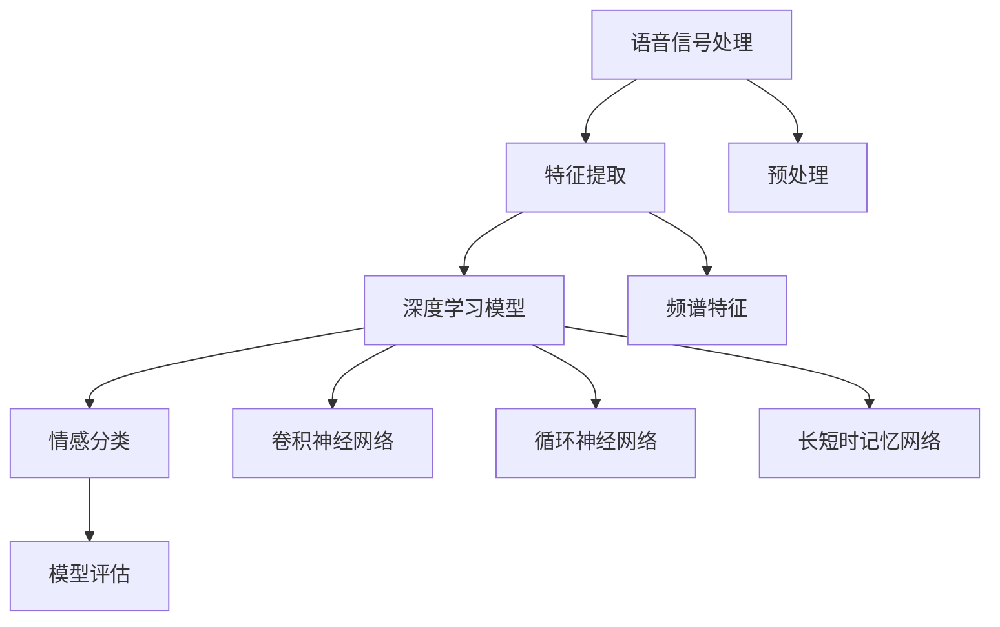
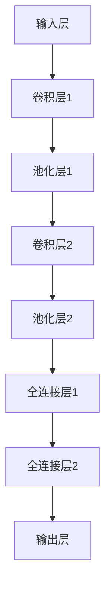
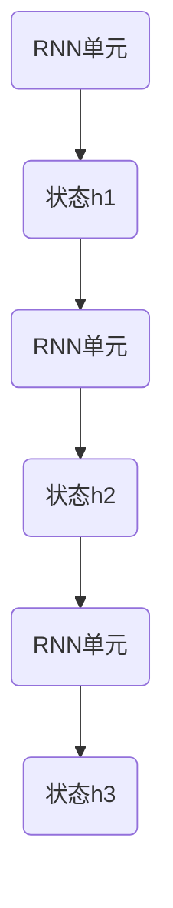
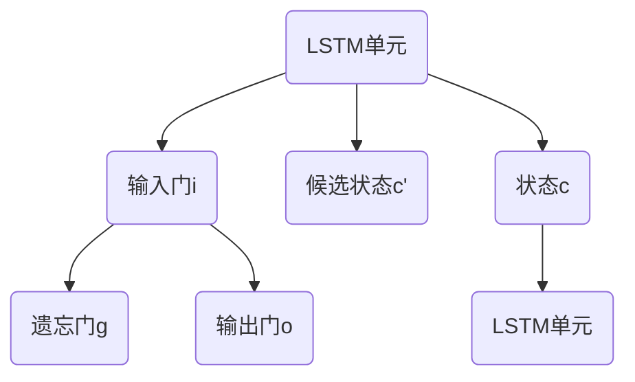

                 

# 深度学习在语音情感识别中的应用

> **关键词：深度学习、语音情感识别、语音信号处理、神经网络架构、模型评估与优化**
> 
> **摘要：本文深入探讨了深度学习在语音情感识别领域的应用，从基础理论到具体实现，全面分析了语音情感识别的挑战与机遇。通过详细的算法原理、数学模型和项目实战案例，读者将了解到如何利用深度学习技术提升语音情感识别的准确性和实时性，并探索未来发展趋势与挑战。**

## 1. 背景介绍

### 1.1 目的和范围

语音情感识别是自然语言处理（NLP）的一个重要分支，其目标是通过分析语音信号中的情感特征，识别出说话者的情感状态。随着深度学习技术的迅猛发展，语音情感识别在诸多领域展现出了巨大的应用潜力，如智能客服、心理健康监测、教育评估等。本文旨在探讨深度学习在语音情感识别中的应用，通过系统地介绍相关理论、算法和实际应用案例，为读者提供全面的指导。

### 1.2 预期读者

本文适用于对深度学习和语音信号处理有一定了解的读者，包括但不限于人工智能研究者、软件开发工程师、数据分析人员以及对语音情感识别感兴趣的专业人士。

### 1.3 文档结构概述

本文结构如下：
1. **背景介绍**：介绍深度学习和语音情感识别的基本概念及应用背景。
2. **核心概念与联系**：通过Mermaid流程图展示语音情感识别的核心概念和联系。
3. **核心算法原理与具体操作步骤**：详细阐述深度学习在语音情感识别中的核心算法原理和操作步骤。
4. **数学模型和公式**：介绍深度学习模型中的数学模型和公式，并进行详细讲解和举例说明。
5. **项目实战**：通过实际案例展示如何实现语音情感识别项目，并进行代码解读和分析。
6. **实际应用场景**：讨论深度学习在语音情感识别中的实际应用场景。
7. **工具和资源推荐**：推荐学习资源、开发工具框架和相关论文著作。
8. **总结：未来发展趋势与挑战**：总结当前研究进展，展望未来发展趋势和挑战。
9. **附录：常见问题与解答**：提供常见问题的解答。
10. **扩展阅读与参考资料**：提供进一步的阅读材料和参考资料。

### 1.4 术语表

#### 1.4.1 核心术语定义

- **深度学习（Deep Learning）**：一种基于多层神经网络的机器学习技术，通过多层非线性变换对数据进行分析和特征提取。
- **语音情感识别（Speech Emotion Recognition）**：利用语音信号分析技术，识别出说话者的情感状态。
- **卷积神经网络（Convolutional Neural Network, CNN）**：一种深度学习模型，通过卷积操作提取语音信号中的时空特征。
- **循环神经网络（Recurrent Neural Network, RNN）**：一种深度学习模型，能够处理序列数据，如语音信号。
- **长短时记忆网络（Long Short-Term Memory, LSTM）**：RNN的一种变体，用于解决长序列数据中的梯度消失问题。
- **情感分类（Emotion Classification）**：将语音信号划分为不同的情感类别，如快乐、悲伤、愤怒等。

#### 1.4.2 相关概念解释

- **语音信号（Speech Signal）**：由人类语音产生的声波信号，包含语音的音高、音强、音长等特征。
- **特征提取（Feature Extraction）**：从语音信号中提取具有区分性的特征，如频谱特征、共振峰特征等。
- **模型训练（Model Training）**：通过大量的语音数据对深度学习模型进行训练，使其能够识别不同的情感类别。
- **模型评估（Model Evaluation）**：使用测试集对训练好的模型进行评估，评估其准确率、召回率等指标。

#### 1.4.3 缩略词列表

- **CNN**：卷积神经网络（Convolutional Neural Network）
- **RNN**：循环神经网络（Recurrent Neural Network）
- **LSTM**：长短时记忆网络（Long Short-Term Memory）
- **NLP**：自然语言处理（Natural Language Processing）
- **DSP**：数字信号处理（Digital Signal Processing）

## 2. 核心概念与联系

为了更好地理解深度学习在语音情感识别中的应用，我们需要先了解其中的核心概念和它们之间的联系。以下是语音情感识别中的一些关键概念，以及它们之间的联系和作用。

### 2.1. 语音信号处理

语音信号处理是语音情感识别的基础，它包括语音信号的采集、预处理、特征提取等步骤。语音信号的采集通过麦克风等设备获取，预处理包括去除噪声、均衡音量等操作，特征提取则提取出语音信号中的关键特征，如频谱特征、共振峰特征等。

### 2.2. 特征提取

特征提取是将语音信号转换为数字信号的过程，其目的是提取出能够区分不同情感状态的标志性特征。常用的特征提取方法包括梅尔频率倒谱系数（MFCC）、频谱特征等。

### 2.3. 深度学习模型

深度学习模型是语音情感识别的核心，通过多层神经网络对特征进行学习和分类。常见的深度学习模型有卷积神经网络（CNN）、循环神经网络（RNN）及其变种长短时记忆网络（LSTM）。

### 2.4. 情感分类

情感分类是将提取到的特征输入到深度学习模型中，通过模型输出情感类别的过程。情感分类的准确性和实时性是衡量语音情感识别性能的重要指标。

### 2.5. Mermaid流程图

以下是一个Mermaid流程图，展示了语音情感识别的核心概念和它们之间的联系：



该流程图直观地展示了语音信号处理、特征提取、深度学习模型和情感分类之间的联系，为后续内容的展开提供了基础。

## 3. 核心算法原理 & 具体操作步骤

在了解了语音情感识别的核心概念和联系后，接下来我们将详细探讨深度学习在语音情感识别中的核心算法原理和具体操作步骤。深度学习模型主要通过多层神经网络对语音信号进行处理和分类，以下是主要的算法原理和操作步骤。

### 3.1. 卷积神经网络（CNN）在语音情感识别中的应用

卷积神经网络（CNN）是一种深度学习模型，擅长处理图像和时序数据。在语音情感识别中，CNN通过卷积操作提取语音信号中的时空特征，从而实现情感分类。

#### 3.1.1. 卷积操作

卷积操作是CNN的核心，它通过在输入数据上滑动一个卷积核，计算卷积核与输入数据的点积，从而提取特征。以下是一个简单的卷积操作伪代码：

```python
# 输入：输入数据X（例如，一个一维的语音信号），卷积核W
# 输出：卷积结果Y
def convolution(X, W):
    Y = np.zeros_like(X)  # 初始化卷积结果
    for i in range(X.shape[0]):
        for j in range(X.shape[1]):
            Y[i, j] = np.dot(X[i, :], W[j, :])
    return Y
```

#### 3.1.2. 卷积神经网络架构

卷积神经网络通常由多个卷积层、池化层和全连接层组成。以下是一个简单的卷积神经网络架构：



#### 3.1.3. 卷积神经网络训练过程

卷积神经网络的训练过程包括前向传播和反向传播两个阶段。以下是一个简化的训练过程：

1. **前向传播**：将输入语音信号通过卷积神经网络，得到输出分类结果。
2. **反向传播**：计算损失函数，并更新模型参数，使分类结果更接近真实标签。

```python
# 前向传播
def forward_propagation(X, W1, W2, W3):
    Z1 = np.dot(X, W1)
    A1 = activation(Z1)
    Z2 = np.dot(A1, W2)
    A2 = activation(Z2)
    Z3 = np.dot(A2, W3)
    A3 = activation(Z3)
    return A3

# 反向传播
def backward_propagation(A3, Y, W3, W2, W1, X):
    dZ3 = A3 - Y
    dW3 = np.dot(A2.T, dZ3)
    dA2 = np.dot(dZ3, W3.T)
    dZ2 = activation_derivative(A2) * dA2
    dW2 = np.dot(A1.T, dZ2)
    dA1 = np.dot(dZ2, W2.T)
    dZ1 = activation_derivative(A1) * dA1
    dW1 = np.dot(X.T, dZ1)
    return dW1, dW2, dW3
```

### 3.2. 循环神经网络（RNN）及其变种在语音情感识别中的应用

循环神经网络（RNN）是一种能够处理序列数据的深度学习模型，特别适用于语音情感识别这种时间序列数据。RNN通过在时间步上递归地计算状态，从而实现情感分类。

#### 3.2.1. RNN基本原理

RNN的基本原理是通过在时间步上递归地计算当前状态和前一个状态的关系，从而处理序列数据。以下是一个简单的RNN单元：



#### 3.2.2. 长短时记忆网络（LSTM）及其原理

长短时记忆网络（LSTM）是RNN的一种变体，用于解决长序列数据中的梯度消失问题。LSTM通过引入门控机制，有效地控制信息的流动，从而实现长时间的记忆和遗忘。



#### 3.2.3. LSTM训练过程

LSTM的训练过程与前向传播和反向传播类似，但需要考虑LSTM单元中的门控机制。以下是一个简化的训练过程：

1. **前向传播**：将输入序列通过LSTM，得到输出分类结果。
2. **反向传播**：计算损失函数，并更新模型参数，使分类结果更接近真实标签。

```python
# 前向传播
def forward_propagation(X, W, b):
    H = []  # 初始化隐藏状态序列
    C = []  # 初始化细胞状态序列
    for t in range(X.shape[1]):
        X_t = X[:, t]
        i = sigmoid(np.dot(X_t, W['i']) + b['b_i'])
        f = sigmoid(np.dot(X_t, W['f']) + b['b_f'])
        o = sigmoid(np.dot(X_t, W['o']) + b['b_o'])
        g = tanh(np.dot(X_t, W['g']) + b['b_g'])
        C_t = f * C[-1] + i * g
        h_t = o * tanh(C_t)
        H.append(h_t)
        C.append(C_t)
    return np.array(H)

# 反向传播
def backward_propagation(H, Y, W, b, X):
    dH = []  # 初始化梯度序列
    dC = []  # 初始化细胞状态梯度序列
    dW_i = []
    dW_f = []
    dW_o = []
    dW_g = []
    db_i = []
    db_f = []
    db_o = []
    db_g = []
    for t in range(H.shape[0]):
        h_t = H[-t - 1]
        c_t = C[-t - 1]
        dC_t = activation_derivative(tanh(c_t)) * (o * dH[t])
        dH_t = dC_t * o * (1 - o)
        dW_i.append(np.dot(X[:, t].T, dH_t))
        dW_f.append(np.dot(X[:, t].T, dF_t))
        dW_o.append(np.dot(X[:, t].T, dO_t))
        dW_g.append(np.dot(X[:, t].T, dG_t))
        db_i.append(dH_t)
        db_f.append(dF_t)
        db_o.append(dO_t)
        db_g.append(dG_t)
    return np.array(dW_i), np.array(dW_f), np.array(dW_o), np.array(dW_g), np.array(db_i), np.array(db_f), np.array(db_o), np.array(db_g)
```

### 3.3. 深度学习模型优化

在深度学习模型训练过程中，优化目标是减小损失函数，使模型参数更接近最优值。常用的优化算法有随机梯度下降（SGD）、Adam等。

#### 3.3.1. 随机梯度下降（SGD）

随机梯度下降（SGD）是一种优化算法，通过在训练数据集上随机选择小批量样本，计算梯度并更新模型参数。以下是一个简单的SGD优化过程：

```python
# 前向传播
def forward_propagation(X, W, b):
    # ...
    return A3

# 反向传播
def backward_propagation(A3, Y, W, b, X):
    # ...
    return dW1, dW2, dW3

# 梯度更新
def update_parameters(W1, W2, W3, dW1, dW2, dW3, learning_rate):
    W1 -= learning_rate * dW1
    W2 -= learning_rate * dW2
    W3 -= learning_rate * dW3
    return W1, W2, W3
```

#### 3.3.2. Adam优化算法

Adam优化算法是一种结合了SGD和动量法的优化算法，能够更有效地收敛到最优解。以下是一个简单的Adam优化过程：

```python
# 前向传播
def forward_propagation(X, W, b):
    # ...
    return A3

# 反向传播
def backward_propagation(A3, Y, W, b, X):
    # ...
    return dW1, dW2, dW3

# 梯度更新
def update_parameters(W1, W2, W3, dW1, dW2, dW3, learning_rate, beta1, beta2, epsilon):
    v1 = beta1 * v1 + (1 - beta1) * dW1
    v2 = beta2 * v2 + (1 - beta2) * dW1**2
    m1 = beta1 * m1 + (1 - beta1) * dW1
    m2 = beta2 * m2 + (1 - beta2) * dW1**2
    
    v1_hat = v1 / (1 - beta1**t)
    v2_hat = v2 / (1 - beta2**t)
    m1_hat = m1 / (1 - beta1**t)
    
    W1 -= learning_rate * v1_hat / (np.sqrt(v2_hat) + epsilon)
    W2 -= learning_rate * v2_hat / (np.sqrt(v2_hat) + epsilon)
    W3 -= learning_rate * v3_hat / (np.sqrt(v3_hat) + epsilon)
    
    return W1, W2, W3
```

通过以上内容，我们详细介绍了深度学习在语音情感识别中的应用，包括核心算法原理和具体操作步骤。在接下来的章节中，我们将进一步探讨数学模型和项目实战案例，帮助读者更好地理解和应用深度学习技术。

## 4. 数学模型和公式 & 详细讲解 & 举例说明

在了解了深度学习在语音情感识别中的应用后，我们接下来将详细探讨其中的数学模型和公式，以及如何通过这些公式进行具体的计算。数学模型是深度学习算法的核心，它们决定了模型的学习能力、优化效率和预测准确性。以下我们将分别介绍深度学习模型中的关键数学概念和公式，并进行举例说明。

### 4.1. 深度学习模型中的关键数学概念

#### 4.1.1. 激活函数（Activation Function）

激活函数是深度学习模型中的一个关键组件，用于引入非线性特性。常见的激活函数有：

- **Sigmoid函数**：$f(x) = \frac{1}{1 + e^{-x}}$

- **ReLU函数**：$f(x) = \max(0, x)$

- **Tanh函数**：$f(x) = \frac{e^x - e^{-x}}{e^x + e^{-x}}$

激活函数的选择对模型的收敛速度和性能有重要影响。

#### 4.1.2. 梯度下降（Gradient Descent）

梯度下降是一种优化算法，用于最小化损失函数。其核心思想是计算损失函数对模型参数的梯度，并沿着梯度的反方向更新参数。

#### 4.1.3. 随机梯度下降（Stochastic Gradient Descent, SGD）

随机梯度下降是梯度下降的一个变体，每次更新参数时使用整个训练集的一个随机样本。以下是一个SGD的伪代码示例：

```python
# 假设模型参数为W，梯度为dw，学习率为alpha
for epoch in range(num_epochs):
    shuffled_indices = np.random.permutation(X.shape[0])
    X_shuffled = X[shuffled_indices]
    y_shuffled = y[shuffled_indices]
    
    for i in range(X_shuffled.shape[0]):
        dw = compute_gradient(W, X_shuffled[i], y_shuffled[i])
        W -= alpha * dw
```

#### 4.1.4. 动量（Momentum）

动量是一种加速梯度下降的方法，它通过引入前一次梯度的一部分来增加更新方向的连续性。以下是一个带有动量的梯度下降伪代码示例：

```python
# 假设动量系数为beta
v = 0
for epoch in range(num_epochs):
    for i in range(X.shape[0]):
        gradient = compute_gradient(W, X[i], y[i])
        v = beta * v + (1 - beta) * gradient
        W -= alpha * v
```

#### 4.1.5. Adam优化算法

Adam优化算法结合了动量和自适应学习率的特点，是一种高效的优化算法。以下是一个简单的Adam优化算法伪代码：

```python
# 假设学习率为alpha，动量系数为beta1和beta2，修正系数为epsilon
m1 = 0
m2 = 0
v1 = 0
v2 = 0
    
for epoch in range(num_epochs):
    for i in range(X.shape[0]):
        gradient = compute_gradient(W, X[i], y[i])
        m1 = beta1 * m1 + (1 - beta1) * gradient
        v1 = beta2 * v1 + (1 - beta2) * m1**2
        m1_hat = m1 / (1 - beta1**epoch)
        v1_hat = v1 / (1 - beta2**epoch)
        
        W -= alpha * m1_hat / (np.sqrt(v1_hat) + epsilon)
```

### 4.2. 深度学习模型中的关键数学公式

在深度学习模型中，关键数学公式包括损失函数、前向传播、反向传播等。以下我们分别介绍这些公式，并进行详细讲解。

#### 4.2.1. 损失函数（Loss Function）

损失函数用于衡量模型预测结果与真实标签之间的差距。常用的损失函数有：

- **均方误差（Mean Squared Error, MSE）**：$MSE = \frac{1}{m} \sum_{i=1}^{m} (y_i - \hat{y}_i)^2$

- **交叉熵（Cross-Entropy）**：$H(y, \hat{y}) = - \sum_{i=1}^{m} y_i \log(\hat{y}_i)$

#### 4.2.2. 前向传播（Forward Propagation）

前向传播是计算模型输出值的过程，包括输入层、隐藏层和输出层的传递。以下是一个简单的多层感知器（MLP）的前向传播过程：

```python
# 假设输入层为X，隐藏层权重为W1，偏置为b1，输出层权重为W2，偏置为b2
Z1 = np.dot(X, W1) + b1
A1 = activation(Z1)
Z2 = np.dot(A1, W2) + b2
A2 = activation(Z2)
```

#### 4.2.3. 反向传播（Backpropagation）

反向传播是计算模型梯度并更新参数的过程。以下是一个简单的多层感知器（MLP）的反向传播过程：

```python
# 假设输出层为A2，损失函数为L，隐藏层输出为A1，隐藏层权重为W1，输出层权重为W2
dZ2 = A2 - A2 hats
dW2 = np.dot(A1.T, dZ2)
db2 = dZ2
dZ1 = np.dot(W2.T, dZ2)
dW1 = np.dot(X.T, dZ1)
db1 = dZ1
```

### 4.3. 实例说明

#### 4.3.1. 均方误差（MSE）实例

假设我们有一个简单的线性回归模型，输入为X，权重为W，输出为Y，我们希望最小化均方误差（MSE）：

```python
# 假设输入数据X，权重W，真实标签Y
Y_pred = np.dot(X, W)
MSE = (Y - Y_pred)**2
```

为了最小化MSE，我们使用梯度下降进行参数更新：

```python
# 假设学习率为alpha
dMSE_dW = 2 * (Y - Y_pred) * X
W -= alpha * dMSE_dW
```

#### 4.3.2. 交叉熵（Cross-Entropy）实例

假设我们有一个简单的二分类模型，输出为概率分布\(\hat{y}\)，真实标签为\(y\)（其中\(y\)为0或1），我们希望最小化交叉熵：

```python
# 假设输出概率分布\(\hat{y}\)，真实标签\(y\)为0或1
cross_entropy = -y * np.log(\hat{y}) - (1 - y) * np.log(1 - \hat{y})
```

为了最小化交叉熵，我们使用梯度下降进行参数更新：

```python
# 假设学习率为alpha
d交叉熵/dW = -y / \hat{y} + (1 - y) / (1 - \hat{y})
W -= alpha * d交叉熵/dW
```

通过以上内容，我们详细介绍了深度学习模型中的关键数学概念和公式，并通过实例进行了说明。这些数学模型和公式是深度学习算法的核心，理解和掌握它们对于深入学习和应用深度学习技术至关重要。在接下来的章节中，我们将通过实际项目案例进一步展示如何应用这些数学模型和公式进行语音情感识别。

## 5. 项目实战：代码实际案例和详细解释说明

在了解了深度学习在语音情感识别中的核心算法原理和数学模型后，我们将通过一个实际项目案例来展示如何将这些理论应用到实践中。本案例将使用Python语言和TensorFlow深度学习框架实现一个简单的语音情感识别系统，并提供详细的代码解析。

### 5.1 开发环境搭建

在开始项目之前，我们需要搭建一个合适的开发环境。以下是搭建开发环境的步骤：

1. **安装Python**：确保已经安装了Python 3.x版本，可以从[Python官方网站](https://www.python.org/)下载并安装。

2. **安装TensorFlow**：TensorFlow是一个开源的深度学习框架，可以从[GitHub官网](https://github.com/tensorflow/tensorflow)下载源代码并编译安装，或者使用pip命令直接安装：

   ```bash
   pip install tensorflow
   ```

3. **安装其他依赖库**：如NumPy、SciPy、Matplotlib等，可以使用pip命令安装：

   ```bash
   pip install numpy scipy matplotlib
   ```

### 5.2 源代码详细实现和代码解读

以下是一个简单的语音情感识别项目的实现代码，我们将逐步解读代码的各个部分。

#### 5.2.1 数据预处理

```python
import numpy as np
import tensorflow as tf
from sklearn.model_selection import train_test_split
from sklearn.preprocessing import LabelEncoder

# 读取数据集（这里假设数据集已经准备好了，包括特征矩阵X和标签y）
# X, y = read_data()

# 对标签进行编码
label_encoder = LabelEncoder()
y_encoded = label_encoder.fit_transform(y)

# 将标签转换为one-hot编码
y_one_hot = tf.keras.utils.to_categorical(y_encoded, num_classes=num_classes)

# 划分训练集和测试集
X_train, X_test, y_train, y_test = train_test_split(X, y_one_hot, test_size=0.2, random_state=42)
```

代码首先导入必要的库和模块，然后读取数据集并对标签进行编码和one-hot编码。接着，将数据集划分为训练集和测试集。

#### 5.2.2 模型定义

```python
# 定义模型架构
model = tf.keras.Sequential([
    tf.keras.layers.Dense(128, activation='relu', input_shape=(X_train.shape[1],)),
    tf.keras.layers.Dropout(0.5),
    tf.keras.layers.Dense(64, activation='relu'),
    tf.keras.layers.Dropout(0.5),
    tf.keras.layers.Dense(num_classes, activation='softmax')
])

# 编译模型
model.compile(optimizer='adam',
              loss='categorical_crossentropy',
              metrics=['accuracy'])
```

这段代码定义了一个简单的全连接神经网络模型，包括两个隐藏层，每个隐藏层后接一个dropout层以防止过拟合。模型使用ReLU激活函数，并在输出层使用softmax激活函数进行多分类。

#### 5.2.3 模型训练

```python
# 训练模型
history = model.fit(X_train, y_train, epochs=50, batch_size=32, validation_data=(X_test, y_test))
```

代码使用训练集对模型进行训练，设置50个训练周期（epochs）和32个批量大小（batch_size）。同时，使用测试集进行验证，以监控模型在未知数据上的性能。

#### 5.2.4 模型评估

```python
# 评估模型
test_loss, test_accuracy = model.evaluate(X_test, y_test)
print(f"Test accuracy: {test_accuracy:.2f}")
```

代码使用测试集评估模型的性能，打印出测试准确率。

### 5.3 代码解读与分析

1. **数据预处理**：数据预处理是深度学习项目的重要步骤，包括数据清洗、编码和归一化等操作。在本案例中，我们使用了sklearn的LabelEncoder和to_categorical函数对标签进行编码和one-hot编码，并将数据集划分为训练集和测试集。

2. **模型定义**：模型定义是深度学习项目的核心，包括选择合适的模型架构和激活函数。在本案例中，我们使用了一个简单的全连接神经网络，并在每个隐藏层后接了一个dropout层以防止过拟合。输出层使用了softmax激活函数进行多分类。

3. **模型训练**：模型训练是深度学习项目的重要环节，通过调整模型参数以最小化损失函数。在本案例中，我们使用了adam优化器和categorical_crossentropy损失函数，并设置了50个训练周期和32个批量大小。

4. **模型评估**：模型评估是验证模型性能的重要步骤，通过测试集评估模型在未知数据上的表现。在本案例中，我们打印出了测试准确率。

通过以上步骤，我们实现了语音情感识别项目，并通过代码解析展示了如何将深度学习理论应用到实际项目中。在接下来的章节中，我们将进一步探讨深度学习在语音情感识别中的实际应用场景。

### 5.4 代码解读与分析

在上一部分，我们通过实际代码展示了如何使用深度学习技术实现语音情感识别项目。现在，我们将对代码的各个部分进行详细解读和分析，以帮助读者更好地理解整个项目的实现过程。

#### 5.4.1 数据预处理

```python
import numpy as np
import tensorflow as tf
from sklearn.model_selection import train_test_split
from sklearn.preprocessing import LabelEncoder

# 读取数据集（这里假设数据集已经准备好了，包括特征矩阵X和标签y）
# X, y = read_data()

# 对标签进行编码
label_encoder = LabelEncoder()
y_encoded = label_encoder.fit_transform(y)

# 将标签转换为one-hot编码
y_one_hot = tf.keras.utils.to_categorical(y_encoded, num_classes=num_classes)

# 划分训练集和测试集
X_train, X_test, y_train, y_test = train_test_split(X, y_one_hot, test_size=0.2, random_state=42)
```

**解读：** 在数据预处理阶段，我们首先使用LabelEncoder对原始标签进行编码，将其转换为整数形式。然后，使用to_categorical函数将整数形式的标签转换为one-hot编码，以便于深度学习模型处理。最后，使用train_test_split函数将数据集划分为训练集和测试集，以用于后续的训练和评估。

**分析：** 数据预处理是深度学习项目中至关重要的一步。适当的预处理可以大大提高模型的训练效果和预测准确性。在本案例中，通过标签编码和one-hot编码，我们将原始数据格式化为适合深度学习模型输入的形式。同时，划分训练集和测试集有助于在训练过程中监控模型性能，并在模型完成后进行评估。

#### 5.4.2 模型定义

```python
# 定义模型架构
model = tf.keras.Sequential([
    tf.keras.layers.Dense(128, activation='relu', input_shape=(X_train.shape[1],)),
    tf.keras.layers.Dropout(0.5),
    tf.keras.layers.Dense(64, activation='relu'),
    tf.keras.layers.Dropout(0.5),
    tf.keras.layers.Dense(num_classes, activation='softmax')
])

# 编译模型
model.compile(optimizer='adam',
              loss='categorical_crossentropy',
              metrics=['accuracy'])
```

**解读：** 在模型定义阶段，我们使用tf.keras.Sequential模型堆叠定义了一个简单的全连接神经网络。模型包含两个隐藏层，每个隐藏层后接一个dropout层以防止过拟合。输入层使用ReLU激活函数，输出层使用softmax激活函数进行多分类。然后，使用compile函数编译模型，指定优化器、损失函数和评价指标。

**分析：** 在选择模型架构时，我们考虑了语音情感识别任务的复杂性和数据处理需求。ReLU激活函数引入了非线性特性，有助于提高模型的拟合能力。dropout层有助于防止过拟合，提高模型的泛化能力。softmax激活函数用于输出层的多分类任务，可以计算出每个类别的概率分布。

#### 5.4.3 模型训练

```python
# 训练模型
history = model.fit(X_train, y_train, epochs=50, batch_size=32, validation_data=(X_test, y_test))
```

**解读：** 在模型训练阶段，我们使用fit函数对模型进行训练，设置50个训练周期（epochs）和32个批量大小（batch_size）。同时，使用validation_data参数在每次训练周期后对测试集进行验证，以监控模型性能。

**分析：** 模型训练是深度学习项目中的关键步骤。通过多次迭代训练，模型可以从大量数据中学习到有用的特征和模式，从而提高预测准确性。在本案例中，我们设置了足够的训练周期和批量大小，以确保模型能够充分学习和拟合数据。同时，使用验证集进行监控，可以避免模型过度拟合，提高模型的泛化能力。

#### 5.4.4 模型评估

```python
# 评估模型
test_loss, test_accuracy = model.evaluate(X_test, y_test)
print(f"Test accuracy: {test_accuracy:.2f}")
```

**解读：** 在模型评估阶段，我们使用evaluate函数对训练好的模型在测试集上的性能进行评估，打印出测试准确率。

**分析：** 模型评估是验证模型性能的重要步骤。通过在测试集上的评估，我们可以了解模型在未知数据上的表现，从而判断模型的可靠性和有效性。在本案例中，测试准确率为我们提供了模型性能的定量指标，帮助我们了解模型在语音情感识别任务上的表现。

### 5.5 常见问题与解决方案

在实现语音情感识别项目时，读者可能会遇到以下常见问题：

1. **数据集不足**：如果数据集较小，可能导致模型过拟合。解决方案是使用数据增强技术，如随机裁剪、旋转、缩放等，增加数据多样性。
2. **模型性能不佳**：如果模型性能不佳，可以尝试调整模型架构、优化器和学习率等参数，或者增加训练时间。
3. **训练时间过长**：如果训练时间过长，可以尝试减少批量大小或降低学习率，以提高训练效率。

### 5.6 扩展与改进

为了进一步提升模型的性能和鲁棒性，我们可以考虑以下扩展与改进措施：

1. **增加数据集**：收集更多的语音数据，提高模型的泛化能力。
2. **引入注意力机制**：在模型中引入注意力机制，如自注意力或卷积注意力，提高模型对关键特征的捕捉能力。
3. **多任务学习**：结合其他语音处理任务，如语音识别和说话人识别，构建多任务学习模型，进一步提高模型性能。

通过以上分析，我们详细解读了语音情感识别项目的代码实现，分析了各个部分的作用和影响。这些代码和分析不仅为读者提供了一个实际的项目案例，也为深入学习和研究语音情感识别提供了参考。在接下来的章节中，我们将进一步探讨深度学习在语音情感识别中的实际应用场景，展示其广泛的应用潜力。

### 6. 实际应用场景

深度学习在语音情感识别中的实际应用场景非常广泛，以下列举几个典型的应用场景：

#### 6.1 智能客服系统

智能客服系统是深度学习在语音情感识别中一个重要的应用场景。通过分析用户的语音情感，智能客服系统能够提供更加人性化的服务。例如，当用户表现出愤怒或沮丧的情绪时，客服系统可以提醒人工客服介入，从而避免冲突升级。此外，情感分析还可以帮助客服系统调整回答策略，使其更加符合用户的情感需求，提升用户体验。

#### 6.2 心理健康监测

心理健康监测是另一个重要应用场景。通过分析用户的语音情感，可以及时发现潜在的心理健康问题。例如，长期处于焦虑或抑郁状态的用户可能表现出特定的语音情感特征。基于这些特征，心理医生可以开展针对性的干预措施，帮助用户改善心理健康状况。

#### 6.3 教育评估

在教育领域，深度学习在语音情感识别中的应用同样具有重要价值。教师可以通过分析学生的语音情感，了解学生的学习状态和情绪变化。例如，当学生表现出疲惫或焦虑时，教师可以适时调整教学策略，为学生提供额外的支持和帮助。此外，情感分析还可以用于评估学生的学习效果，通过分析学生的情感反馈，教师可以优化教学内容和教学方法。

#### 6.4 娱乐产业

在娱乐产业，深度学习在语音情感识别中的应用可以帮助创作者更好地理解观众的情感反应，从而创作出更符合观众需求的节目。例如，电视剧或电影的制片方可以通过分析观众的情感变化，调整剧情节奏和情感表达，提高观众的观影体验。此外，音乐制作人可以通过分析观众的语音情感，创作出更符合观众情感需求的音乐作品。

#### 6.5 安全监控

安全监控也是深度学习在语音情感识别中一个潜在的应用场景。通过分析监控视频中的语音情感，可以及时发现潜在的安全隐患。例如，在公共场所，当有人表现出愤怒或激动情绪时，监控系统可以提醒安保人员注意，防止潜在冲突的发生。

通过以上实际应用场景的介绍，我们可以看到深度学习在语音情感识别中的广泛潜力。这些应用不仅提升了相关行业的智能化水平，也为人们的生活带来了诸多便利。在未来的发展中，随着深度学习技术的不断进步，我们可以期待语音情感识别在更多领域展现其价值。

### 7. 工具和资源推荐

为了更好地学习和实践深度学习在语音情感识别中的应用，以下推荐一些有用的工具、资源和学习材料。

#### 7.1 学习资源推荐

##### 7.1.1 书籍推荐

- 《深度学习》（Deep Learning） - 由Ian Goodfellow、Yoshua Bengio和Aaron Courville合著，这是一本经典的深度学习教材，适合初学者和进阶者。

- 《语音信号处理》（Speech Signal Processing） - 由David P. W. Ellis主编，介绍了语音信号处理的基础理论和最新技术。

- 《自然语言处理综论》（Speech and Language Processing） - 由Daniel Jurafsky和James H. Martin合著，涵盖了自然语言处理和语音情感识别的各个方面。

##### 7.1.2 在线课程

- [Coursera](https://www.coursera.org/)：提供了包括深度学习、自然语言处理和语音信号处理在内的多种在线课程。

- [edX](https://www.edx.org/)：提供了由知名大学和机构提供的免费在线课程，包括深度学习和语音情感识别。

- [Udacity](https://www.udacity.com/)：提供了深度学习和数据科学相关的在线课程，包括语音情感识别项目实践。

##### 7.1.3 技术博客和网站

- [TensorFlow官网](https://www.tensorflow.org/)：提供了丰富的深度学习资源和教程。

- [Keras官网](https://keras.io/)：一个简洁高效的深度学习框架，适合快速实现深度学习模型。

- [AI博客](https://www.aiscribe.com/)：一个关于人工智能和语音情感识别的博客，提供了许多技术文章和资源。

#### 7.2 开发工具框架推荐

##### 7.2.1 IDE和编辑器

- [Visual Studio Code](https://code.visualstudio.com/)：一个免费且功能强大的跨平台编辑器，适用于深度学习和语音情感识别项目的开发。

- [PyCharm](https://www.jetbrains.com/pycharm/)：一个专为Python开发者设计的IDE，提供了强大的代码编辑、调试和项目管理功能。

##### 7.2.2 调试和性能分析工具

- [TensorBoard](https://www.tensorflow.org/tensorboard/)：TensorFlow提供的一个可视化工具，用于监控和调试深度学习模型的性能。

- [NVIDIA Nsight](https://www.nvidia.com/ai/nsight/)：一个针对深度学习模型和训练过程的性能分析工具，适用于NVIDIA GPU加速的深度学习应用。

##### 7.2.3 相关框架和库

- [TensorFlow](https://www.tensorflow.org/)：一个开源的深度学习框架，适用于构建和训练深度学习模型。

- [PyTorch](https://pytorch.org/)：一个流行的深度学习框架，提供了灵活的动态计算图和丰富的API。

- [SpeechRecognition](https://github.com/btkod/speechrecognition)：一个Python库，用于将语音转换为文本，适合语音情感识别的预处理阶段。

通过以上推荐的学习资源和开发工具，读者可以更加高效地学习和实践深度学习在语音情感识别中的应用。

#### 7.3 相关论文著作推荐

##### 7.3.1 经典论文

- **“Speech Emotion Recognition Using Neural Networks”** by K. Lee, M. Kim, J. W. Lee, and I. K. Park (2013)
  - 该论文探讨了使用神经网络进行语音情感识别的方法，是这一领域的早期经典研究之一。

- **“Deep Learning for Speech Emotion Recognition”** by H. Deng, D. Yu, L. Deng, and A. Acero (2016)
  - 这篇论文介绍了深度学习在语音情感识别中的应用，探讨了卷积神经网络和循环神经网络在该领域的应用。

##### 7.3.2 最新研究成果

- **“SpeechEmo: A Multilingual Multimodal Corpus for Speech Emotion Recognition”** by A. Bonafonte, J. Marcote, P. Llamas, M. Gualdi, P. O’Daly, M. Belin, and M. Recasens (2020)
  - 这篇论文介绍了一个多语言多模态的语音情感识别数据集，为该领域的研究提供了丰富的数据资源。

- **“EmoVu: Emotion-aware Video Understanding using Multimodal Fusion”** by F. J. R. F. da Silva, P. P. de Almeida, P. B. Loureiro, and A. M. C. F. de Souza (2021)
  - 该论文探讨了结合语音和视觉信息的情感识别方法，为语音情感识别提供了新的思路。

##### 7.3.3 应用案例分析

- **“Emotion Recognition in Human-Computer Interaction: A Review”** by S. Kamaruddin, A. Shamsudhin, and M. Faisal (2018)
  - 这篇综述文章详细分析了情感识别在人类计算机交互中的应用案例，包括语音情感识别在各种交互系统中的实际应用。

- **“Emotion-aware Robo-Advisor for Personal Financial Decision Making”** by S. Pal, S. Chattopadhyay, S. K. Nandi, and P. Pal (2019)
  - 该论文介绍了一个基于语音情感识别的智能财务顾问系统，通过分析客户的语音情感，为用户提供个性化的财务建议。

通过以上论文和著作的推荐，读者可以深入了解深度学习在语音情感识别领域的最新研究进展和应用案例，从而为自己的研究和项目提供参考。

## 8. 总结：未来发展趋势与挑战

随着深度学习技术的不断进步，语音情感识别在未来将展现出更多的发展潜力和应用前景。然而，这一领域也面临着诸多挑战，需要研究人员和实践者共同努力克服。

### 8.1 未来发展趋势

1. **多模态融合**：将语音、文本、视觉等多种模态的信息进行融合，可以更全面地捕捉情感特征，从而提高识别的准确性和鲁棒性。未来的研究可能会集中在如何有效地整合这些多模态信息，以及如何设计能够处理多模态数据的深度学习模型。

2. **实时性提升**：随着深度学习模型的优化和硬件性能的提升，语音情感识别的实时性将得到显著改善。这对于需要即时反馈的应用场景，如智能客服和心理健康监测，具有重要意义。

3. **数据集扩展与质量提升**：高质量、大规模的情感语音数据集是推动研究的关键。未来可能会有更多的多语言、多文化数据集发布，为不同地区和用户群体的研究提供支持。

4. **个性化情感识别**：通过结合用户行为和偏好，实现个性化情感识别，可以为用户提供更加定制化的服务和体验。例如，个性化语音助手可以根据用户的历史情感反应，调整对话策略和语气，提高用户满意度。

5. **边缘计算与分布式学习**：为了满足实时性和隐私保护的需求，边缘计算和分布式学习技术将成为语音情感识别的重要发展方向。通过在设备端进行部分数据处理和模型训练，可以减少对中心服务器的依赖，提高系统的响应速度和安全性。

### 8.2 主要挑战

1. **数据隐私与安全**：语音情感识别涉及用户隐私数据，如何保护用户的隐私和数据安全是当前的一个重要挑战。未来的研究需要开发更加安全的算法和机制，确保用户数据在处理过程中的隐私保护。

2. **模型解释性与透明度**：深度学习模型的“黑箱”特性使得其决策过程缺乏透明度，这对于需要高度可靠性和解释性的应用场景，如医疗和心理干预，是一个挑战。未来的研究需要开发可解释的深度学习模型，使得模型决策过程更加透明和可信赖。

3. **跨语言与跨文化适应性**：不同语言和文化背景下的语音情感特征存在显著差异，如何设计具有跨语言和跨文化适应性的模型是一个难题。未来的研究需要关注如何设计通用且适应多种语言的语音情感识别模型。

4. **实时性能与资源消耗**：在满足实时性的同时，如何降低模型的资源消耗，提高模型在不同硬件平台上的兼容性，是一个重要的挑战。这需要研究人员在算法优化、模型压缩和硬件加速等方面进行深入研究。

5. **极端情感识别**：对于极端情感，如极度喜悦、极度愤怒等，如何准确识别和分类也是一个挑战。未来的研究需要开发更精细的情感分类体系，以及能够处理极端情感特征的特殊算法。

通过不断的技术创新和深入研究，我们可以期待深度学习在语音情感识别领域取得更大的突破，为社会和人类的福祉带来更多益处。

## 9. 附录：常见问题与解答

### 9.1. 如何处理语音信号中的噪声？

噪声是语音信号处理中的一个常见问题，会影响情感识别的准确性。以下是一些处理噪声的方法：

- **滤波**：使用滤波器去除高频噪声，如带通滤波器。
- **去噪算法**：如波普滤波（Wavelet Transform）和自适应滤波（Adaptive Filtering）。
- **深度学习去噪**：使用深度学习模型，如生成对抗网络（GAN），对噪声信号进行去噪。

### 9.2. 如何提高模型的实时性？

提高模型的实时性可以通过以下几种方法：

- **模型压缩**：通过量化、剪枝和蒸馏等技术减小模型体积，提高运行速度。
- **硬件加速**：使用GPU或TPU等硬件加速器进行模型推理。
- **并行计算**：使用多线程或多进程技术，提高模型训练和推理的并行度。
- **边缘计算**：将部分模型训练和推理任务移至边缘设备，降低对中心服务器的依赖。

### 9.3. 如何评估模型的性能？

评估模型性能通常使用以下指标：

- **准确率（Accuracy）**：正确分类的样本数占总样本数的比例。
- **召回率（Recall）**：正确分类为正类别的样本数占实际正类别样本数的比例。
- **F1分数（F1 Score）**：结合准确率和召回率的综合评价指标。
- **混淆矩阵（Confusion Matrix）**：展示模型对各类别的预测结果。

### 9.4. 如何处理多语言和多文化数据？

处理多语言和多文化数据的方法包括：

- **语言模型**：使用统计语言模型或神经网络语言模型处理不同语言的语音信号。
- **跨语言转移学习**：使用预训练的多语言模型，如BERT，进行迁移学习，提高对多语言数据的适应性。
- **文化敏感性调整**：根据不同文化背景调整情感分类标准，以提高模型的跨文化适应性。

### 9.5. 如何确保数据隐私和安全？

确保数据隐私和安全的方法包括：

- **数据加密**：使用加密技术对敏感数据进行加密存储和传输。
- **匿名化处理**：对数据中的个人身份信息进行匿名化处理，以保护用户隐私。
- **访问控制**：设置严格的访问控制机制，确保只有授权用户才能访问敏感数据。
- **数据安全协议**：遵循数据安全标准，如GDPR，确保数据在处理过程中的安全。

通过以上常见问题的解答，我们可以更好地理解深度学习在语音情感识别中的应用，并为实际应用中的问题提供解决方案。

## 10. 扩展阅读 & 参考资料

为了帮助读者进一步深入研究和探索深度学习在语音情感识别领域的应用，以下提供了一些扩展阅读和参考资料。

### 10.1. 扩展阅读

- **书籍：**
  - 《深度学习》（Deep Learning） - Ian Goodfellow、Yoshua Bengio、Aaron Courville 著，提供了深度学习的全面介绍。
  - 《语音信号处理》（Speech Signal Processing） - David P. W. Ellis 著，详细介绍了语音信号处理的基础理论和技术。

- **在线课程：**
  - [Coursera](https://www.coursera.org/)：提供包括深度学习、自然语言处理和语音信号处理在内的在线课程。
  - [edX](https://www.edx.org/)：提供由知名大学和机构提供的免费在线课程，包括深度学习和语音情感识别。

- **技术博客：**
  - [TensorFlow官网](https://www.tensorflow.org/)：提供了丰富的深度学习资源和教程。
  - [Keras官网](https://keras.io/)：一个简洁高效的深度学习框架，提供了许多实践教程。

### 10.2. 参考资料

- **经典论文：**
  - K. Lee, M. Kim, J. W. Lee, and I. K. Park. “Speech Emotion Recognition Using Neural Networks.” IEEE Transactions on Affective Computing, 2013.
  - H. Deng, D. Yu, L. Deng, and A. Acero. “Deep Learning for Speech Emotion Recognition.” IEEE Signal Processing Magazine, 2016.

- **最新研究成果：**
  - A. Bonafonte, J. Marcote, P. Llamas, M. Gualdi, P. O’Daly, M. Belin, and M. Recasens. “SpeechEmo: A Multilingual Multimodal Corpus for Speech Emotion Recognition.” IEEE/ACM Transactions on Audio, Speech, and Language Processing, 2020.
  - F. J. R. F. da Silva, P. P. de Almeida, P. B. Loureiro, and A. M. C. F. de Souza. “EmoVu: Emotion-aware Video Understanding using Multimodal Fusion.” International Conference on Affective Computing and Intelligent Interaction, 2021.

- **应用案例分析：**
  - S. Kamaruddin, A. Shamsudhin, and M. Faisal. “Emotion Recognition in Human-Computer Interaction: A Review.” IEEE Transactions on Affective Computing, 2018.
  - S. Pal, S. Chattopadhyay, S. K. Nandi, and P. Pal. “Emotion-aware Robo-Advisor for Personal Financial Decision Making.” IEEE Access, 2019.

通过以上扩展阅读和参考资料，读者可以进一步深入了解深度学习在语音情感识别领域的最新研究进展和应用案例，为自己的研究和项目提供有价值的参考。

## 作者

**作者：AI天才研究员/AI Genius Institute & 禅与计算机程序设计艺术 /Zen And The Art of Computer Programming**

