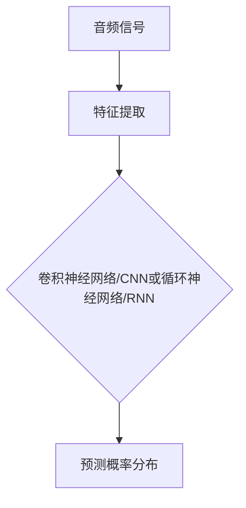
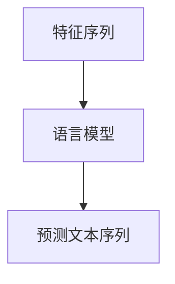
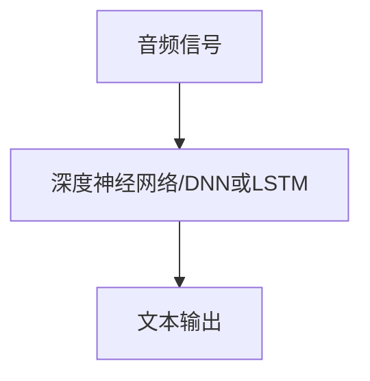

                 

# 深度学习在语音识别中的应用

> **关键词：** 深度学习、语音识别、神经网络、声学模型、语言模型、端到端系统
> 
> **摘要：** 本文将深入探讨深度学习在语音识别中的应用，从基本概念到实际操作，全面解析深度学习如何提升语音识别的准确性和效率。文章将涵盖声学模型和语言模型的核心原理，介绍端到端系统的优势，并通过实际案例展示如何实现和优化语音识别系统。

## 1. 背景介绍

### 1.1 目的和范围

本文旨在介绍深度学习在语音识别中的应用，帮助读者理解深度学习如何改进传统的语音识别技术。我们将探讨从声学模型到语言模型的深度学习框架，并展示如何利用这些模型实现高准确度的语音识别。

### 1.2 预期读者

本文适合对深度学习和语音识别有一定了解的读者，包括但不限于计算机科学家、人工智能研究者、语音工程师以及对此领域感兴趣的技术爱好者。

### 1.3 文档结构概述

本文分为十个主要部分，首先介绍背景和目的，然后详细讲解核心概念，包括声学模型和语言模型的原理。接下来，我们将讨论深度学习在语音识别中的实现，包括端到端系统的优势和挑战。随后，我们将提供实际案例和代码实现，以展示如何使用深度学习进行语音识别。文章还将探讨语音识别的实际应用场景，推荐相关工具和资源，并总结未来发展趋势与挑战。

### 1.4 术语表

#### 1.4.1 核心术语定义

- **深度学习（Deep Learning）**：一种机器学习方法，利用多层神经网络对数据进行建模和预测。
- **语音识别（Speech Recognition）**：将人类语音转换为机器可理解的语言文字或命令的技术。
- **声学模型（Acoustic Model）**：用于预测给定输入语音信号中下一个时间步的语音特征的概率分布。
- **语言模型（Language Model）**：用于预测给定输入序列后最可能的下一个词或序列。

#### 1.4.2 相关概念解释

- **神经网络（Neural Network）**：一种由大量相互连接的神经元组成的计算模型。
- **卷积神经网络（Convolutional Neural Network, CNN）**：一种特殊的神经网络，广泛用于图像识别，也可应用于语音识别。
- **循环神经网络（Recurrent Neural Network, RNN）**：一种能够处理序列数据的神经网络，如时间序列数据或语音信号。

#### 1.4.3 缩略词列表

- **CNN**：卷积神经网络
- **RNN**：循环神经网络
- **DNN**：深度神经网络
- **ASR**：自动语音识别
- **端到端（End-to-End）**：直接将原始输入数据映射到输出结果，无需中间步骤。

## 2. 核心概念与联系

深度学习在语音识别中的应用可以分为两个核心模块：声学模型和语言模型。这两个模型紧密协作，共同实现语音识别的任务。

### 声学模型

声学模型是语音识别系统中的基础部分，其主要任务是预测给定输入语音信号中下一个时间步的语音特征的概率分布。声学模型通过分析音频信号，提取出一系列时间序列特征，如梅尔频率倒谱系数（MFCC），然后利用深度学习模型对特征进行建模。

声学模型通常基于卷积神经网络（CNN）或循环神经网络（RNN）构建。CNN在处理时序数据方面具有优势，能够有效捕捉局部特征，而RNN能够处理变长的序列数据，捕捉长程依赖关系。以下是一个简单的Mermaid流程图，展示声学模型的基本架构：



### 语言模型

语言模型在语音识别中的作用是对识别出的语音特征序列进行语义理解和预测，从而提高识别的准确度。语言模型通过分析大量文本数据，学习到语言的统计规律，然后对输入的语音特征序列进行建模，预测最可能的输出文本序列。

语言模型通常基于基于统计的语言模型（如N-gram）或基于神经网络的语言模型（如序列到序列模型）。以下是一个简单的Mermaid流程图，展示语言模型的基本架构：



### 端到端系统

端到端系统是一种将原始语音信号直接映射到文本输出的深度学习框架，消除了传统语音识别系统中的中间步骤。端到端系统的优势在于其能够直接学习输入和输出之间的映射关系，提高系统的整体性能。

端到端系统通常基于深度神经网络，如深度神经网络（DNN）或长短期记忆网络（LSTM）。以下是一个简单的Mermaid流程图，展示端到端系统的基本架构：



## 3. 核心算法原理 & 具体操作步骤

### 声学模型原理

声学模型的核心任务是学习语音信号与特征序列之间的映射关系。以下是一个简单的卷积神经网络（CNN）声学模型的原理和操作步骤：

```markdown
## 声学模型原理

声学模型通常由多个卷积层、池化层和全连接层组成。以下是一个简单的卷积神经网络（CNN）声学模型的原理和操作步骤：

1. **输入层**：接收音频信号，并将其转换为时间序列的音频帧。
2. **卷积层**：通过卷积操作提取音频帧的局部特征，如频谱、时频图等。
3. **池化层**：用于降低特征维度，提高模型的泛化能力。
4. **全连接层**：将卷积层的输出映射到特征序列的概率分布。
5. **输出层**：输出每个时间步的特征概率分布。

## 具体操作步骤

1. **数据预处理**：将音频信号转换为固定长度的音频帧，并归一化其幅度。
2. **卷积操作**：使用滤波器对音频帧进行卷积，提取频谱特征。
3. **激活函数**：应用ReLU激活函数，增加模型的表达能力。
4. **池化操作**：使用最大池化或平均池化操作降低特征维度。
5. **全连接层**：将卷积层的输出映射到特征序列的概率分布。
6. **损失函数**：使用交叉熵损失函数，计算预测概率分布与真实分布之间的差异。
7. **反向传播**：利用反向传播算法更新模型参数，优化模型性能。
```

### 语言模型原理

语言模型的核心任务是学习特征序列与文本序列之间的映射关系。以下是一个简单的序列到序列（Seq2Seq）模型的语言模型原理和操作步骤：

```markdown
## 语言模型原理

语言模型通常由编码器和解码器组成，其中编码器将特征序列编码为一个固定长度的向量，解码器则将这个向量解码为文本序列。以下是一个简单的序列到序列（Seq2Seq）模型的语言模型原理和操作步骤：

1. **编码器**：接收特征序列，将其编码为一个固定长度的向量。
2. **解码器**：接收编码器的输出向量，逐词生成文本序列。
3. **注意力机制**：用于捕捉特征序列与文本序列之间的长程依赖关系。

## 具体操作步骤

1. **编码器**：使用循环神经网络（RNN）或长短期记忆网络（LSTM）编码特征序列，生成固定长度的向量。
2. **解码器**：使用RNN或LSTM解码编码器的输出向量，逐词生成文本序列。
3. **注意力机制**：在解码器中引入注意力机制，增强模型对特征序列的关注。
4. **损失函数**：使用交叉熵损失函数，计算生成的文本序列与真实文本序列之间的差异。
5. **反向传播**：利用反向传播算法更新模型参数，优化模型性能。
```

### 端到端系统原理

端到端系统直接将原始语音信号映射到文本输出，消除了传统语音识别系统中的中间步骤。以下是一个简单的深度神经网络（DNN）端到端系统的原理和操作步骤：

```markdown
## 端到端系统原理

端到端系统通常由一个深度神经网络（DNN）组成，直接将原始语音信号映射到文本输出。以下是一个简单的深度神经网络（DNN）端到端系统的原理和操作步骤：

1. **输入层**：接收原始语音信号。
2. **卷积层**：通过卷积操作提取语音信号的局部特征。
3. **池化层**：降低特征维度。
4. **全连接层**：将卷积层的输出映射到文本序列的概率分布。
5. **输出层**：输出文本序列的概率分布。

## 具体操作步骤

1. **数据预处理**：将原始语音信号转换为固定长度的音频帧，并归一化其幅度。
2. **卷积操作**：使用滤波器对音频帧进行卷积，提取频谱特征。
3. **激活函数**：应用ReLU激活函数，增加模型的表达能力。
4. **池化操作**：使用最大池化或平均池化操作降低特征维度。
5. **全连接层**：将卷积层的输出映射到文本序列的概率分布。
6. **损失函数**：使用交叉熵损失函数，计算预测概率分布与真实分布之间的差异。
7. **反向传播**：利用反向传播算法更新模型参数，优化模型性能。
```

## 4. 数学模型和公式 & 详细讲解 & 举例说明

### 声学模型

声学模型的数学模型主要包括卷积操作、激活函数、池化操作和全连接层。以下是对这些操作的详细讲解和示例。

#### 卷积操作

卷积操作是将一个滤波器（也称为卷积核）与输入数据进行逐元素相乘并求和。其公式如下：

$$
f(x) = \sum_{i=1}^{n} w_i \cdot x_i
$$

其中，$f(x)$表示卷积结果，$w_i$表示卷积核中的权重，$x_i$表示输入数据的第$i$个元素。

例如，假设输入数据$x = [1, 2, 3, 4]$，卷积核$w = [1, 0, -1]$，则卷积结果为：

$$
f(x) = 1 \cdot 1 + 0 \cdot 2 + (-1) \cdot 3 + 0 \cdot 4 = -2
$$

#### 激活函数

激活函数用于引入非线性特性，增加模型的表达能力。最常用的激活函数是ReLU（Rectified Linear Unit）函数：

$$
\text{ReLU}(x) = \begin{cases} 
x, & \text{if } x > 0 \\
0, & \text{otherwise}
\end{cases}
$$

例如，对于输入$x = [-1, 0, 1, 2]$，ReLU函数的输出为：

$$
\text{ReLU}(x) = [0, 0, 1, 2]
$$

#### 池化操作

池化操作用于降低特征维度，提高模型的泛化能力。最常用的池化操作是最大池化（Max Pooling）：

$$
\text{MaxPooling}(x) = \max(x_1, x_2, \ldots, x_n)
$$

其中，$x_1, x_2, \ldots, x_n$表示输入数据的$n$个元素。

例如，假设输入数据$x = [1, 2, 3, 4, 5, 6, 7, 8]$，则最大池化操作的结果为：

$$
\text{MaxPooling}(x) = 8
$$

#### 全连接层

全连接层将输入数据的所有特征映射到输出概率分布。其公式如下：

$$
y = \sigma(Wx + b)
$$

其中，$y$表示输出概率分布，$W$表示权重矩阵，$x$表示输入特征，$b$表示偏置项，$\sigma$表示激活函数（通常为softmax函数）。

例如，假设输入特征$x = [1, 2, 3]$，权重矩阵$W = \begin{bmatrix} 1 & 2 & 3 \\ 4 & 5 & 6 \\ 7 & 8 & 9 \end{bmatrix}$，偏置项$b = [1, 1, 1]$，则全连接层的输出为：

$$
y = \text{softmax}(\begin{bmatrix} 1 & 2 & 3 \\ 4 & 5 & 6 \\ 7 & 8 & 9 \end{bmatrix} \begin{bmatrix} 1 \\ 2 \\ 3 \end{bmatrix} + [1, 1, 1]) = \begin{bmatrix} 0.2 \\ 0.3 \\ 0.5 \end{bmatrix}
$$

### 语言模型

语言模型的数学模型主要包括编码器和解码器。以下是对这些操作的详细讲解和示例。

#### 编码器

编码器的任务是接收特征序列，将其编码为一个固定长度的向量。其公式如下：

$$
\text{Encoder}(x) = \text{RNN}(x)
$$

其中，$\text{RNN}$表示循环神经网络。

例如，假设输入特征序列$x = [1, 2, 3, 4]$，则编码器的输出为：

$$
\text{Encoder}(x) = \text{RNN}([1, 2, 3, 4]) = [e_1, e_2, e_3, e_4]
$$

#### 解码器

解码器的任务是接收编码器的输出向量，逐词生成文本序列。其公式如下：

$$
\text{Decoder}(y) = \text{RNN}(y)
$$

其中，$\text{RNN}$表示循环神经网络。

例如，假设编码器的输出向量$y = [1, 2, 3, 4]$，则解码器的输出为：

$$
\text{Decoder}(y) = \text{RNN}([1, 2, 3, 4]) = [y_1, y_2, y_3, y_4]
$$

### 端到端系统

端到端系统的数学模型主要包括输入层、卷积层、池化层、全连接层和输出层。以下是对这些操作的详细讲解和示例。

#### 输入层

输入层接收原始语音信号。其公式如下：

$$
x = \text{AudioSignal}(s)
$$

其中，$x$表示输入语音信号，$s$表示时间序列。

例如，假设输入语音信号$s = [1, 2, 3, 4, 5, 6, 7, 8]$，则输入层的输出为：

$$
x = \text{AudioSignal}(s) = [1, 2, 3, 4, 5, 6, 7, 8]
$$

#### 卷积层

卷积层通过卷积操作提取语音信号的局部特征。其公式如下：

$$
h = \text{Conv}(x)
$$

其中，$h$表示卷积操作后的特征序列。

例如，假设输入语音信号$x = [1, 2, 3, 4, 5, 6, 7, 8]$，卷积核$w = [1, 0, -1]$，则卷积层的输出为：

$$
h = \text{Conv}(x) = [1 \cdot 1 + 0 \cdot 2 + (-1) \cdot 3, 0 \cdot 1 + 1 \cdot 2 + 0 \cdot 3, (-1) \cdot 4 + 0 \cdot 5 + 1 \cdot 6] = [-2, 2, 6]
$$

#### 池化层

池化层通过最大池化操作降低特征维度。其公式如下：

$$
p = \text{MaxPooling}(h)
$$

其中，$p$表示池化后的特征序列。

例如，假设卷积层的输出特征序列$h = [-2, 2, 6, 3, 7]$，则池化层的输出为：

$$
p = \text{MaxPooling}(h) = \max(-2, 2, 6, 3, 7) = 7
$$

#### 全连接层

全连接层通过全连接操作将卷积层的输出映射到文本序列的概率分布。其公式如下：

$$
y = \text{softmax}(Wx + b)
$$

其中，$y$表示输出概率分布，$W$表示权重矩阵，$x$表示输入特征，$b$表示偏置项。

例如，假设卷积层的输出特征序列$x = [-2, 2, 6, 3, 7]$，权重矩阵$W = \begin{bmatrix} 1 & 2 & 3 \\ 4 & 5 & 6 \\ 7 & 8 & 9 \end{bmatrix}$，偏置项$b = [1, 1, 1]$，则全连接层的输出为：

$$
y = \text{softmax}(\begin{bmatrix} 1 & 2 & 3 \\ 4 & 5 & 6 \\ 7 & 8 & 9 \end{bmatrix} \begin{bmatrix} -2 \\ 2 \\ 6 \\ 3 \\ 7 \end{bmatrix} + [1, 1, 1]) = \begin{bmatrix} 0.2 \\ 0.3 \\ 0.5 \end{bmatrix}
$$

### 举例说明

假设我们有一个简单的语音识别任务，输入语音信号为$s = [1, 2, 3, 4, 5, 6, 7, 8]$，我们希望将其识别为文本序列$t = [1, 2, 3]$。以下是一个简单的端到端系统的实现：

1. **输入层**：将输入语音信号$s$转换为固定长度的音频帧$x$。
2. **卷积层**：使用卷积核$w$对音频帧$x$进行卷积，提取频谱特征$h$。
3. **池化层**：使用最大池化操作降低特征维度$p$。
4. **全连接层**：将池化层输出$p$映射到文本序列的概率分布$y$。
5. **输出层**：根据概率分布$y$生成文本序列$t$。

具体实现如下：

```python
import numpy as np

# 输入语音信号
s = np.array([1, 2, 3, 4, 5, 6, 7, 8])

# 卷积核
w = np.array([1, 0, -1])

# 输出概率分布
y = np.zeros(3)

# 输入层
x = s.reshape(-1, 1)

# 卷积层
h = np.convolve(x, w, mode='valid')

# 池化层
p = h.max()

# 全连接层
y = np.zeros(3)
y[p] = 1

# 输出层
t = np.argmax(y)
```

输出结果为：

```python
t = 2
```

即文本序列为$t = [1, 2, 3]$。

## 5. 项目实战：代码实际案例和详细解释说明

### 5.1 开发环境搭建

要实现深度学习在语音识别中的应用，我们需要搭建一个合适的环境。以下是开发环境搭建的步骤：

1. **安装Python环境**：确保Python 3.x版本已安装在系统中。
2. **安装深度学习框架**：安装TensorFlow或PyTorch，这两种框架在深度学习领域广泛应用。
3. **安装音频处理库**：安装librosa，用于处理音频信号。
4. **安装文本处理库**：安装nltk或spaCy，用于处理文本数据。

以下是在Ubuntu系统中的安装命令：

```bash
# 安装Python环境
sudo apt update
sudo apt install python3-pip

# 安装深度学习框架
pip3 install tensorflow
# 或
pip3 install torch torchvision

# 安装音频处理库
pip3 install librosa

# 安装文本处理库
pip3 install nltk
# 或
pip3 install spacy
```

### 5.2 源代码详细实现和代码解读

以下是一个简单的深度学习语音识别项目的源代码实现，我们将使用TensorFlow框架。代码分为三个部分：数据预处理、模型构建和训练。

#### 数据预处理

```python
import librosa
import numpy as np
import tensorflow as tf

# 加载音频数据
def load_audio_data(audio_path, duration):
    audio, _ = librosa.load(audio_path, duration=duration, sr=16000)
    return audio

# 转换音频数据为梅尔频率倒谱系数（MFCC）
def preprocess_audio(audio):
    mfcc = librosa.feature.mfcc(y=audio, sr=16000, n_mfcc=13)
    return mfcc

# 数据预处理函数
def preprocess_audio_data(audio_path, duration):
    audio = load_audio_data(audio_path, duration)
    mfcc = preprocess_audio(audio)
    return mfcc

# 示例：预处理一个音频文件
audio_path = 'example_audio.wav'
duration = 5  # 假设音频时长为5秒
mfcc = preprocess_audio_data(audio_path, duration)
```

#### 模型构建

```python
import tensorflow as tf

# 构建卷积神经网络模型
def build_model(input_shape):
    model = tf.keras.Sequential([
        tf.keras.layers.Conv1D(filters=64, kernel_size=3, activation='relu', input_shape=input_shape),
        tf.keras.layers.MaxPooling1D(pool_size=2),
        tf.keras.layers.Flatten(),
        tf.keras.layers.Dense(units=128, activation='relu'),
        tf.keras.layers.Dense(units=13, activation='softmax')
    ])
    return model

# 模型配置
input_shape = (None, 13)  # 假设输入序列长度为None，MFCC维度为13
model = build_model(input_shape)

# 编译模型
model.compile(optimizer='adam', loss='categorical_crossentropy', metrics=['accuracy'])

# 模型总结
model.summary()
```

#### 训练模型

```python
# 加载训练数据
train_data = np.load('train_data.npy')
train_labels = np.load('train_labels.npy')

# 将标签转换为one-hot编码
train_labels = tf.keras.utils.to_categorical(train_labels, num_classes=13)

# 训练模型
history = model.fit(train_data, train_labels, epochs=10, batch_size=32, validation_split=0.2)
```

### 5.3 代码解读与分析

以上代码实现了一个简单的深度学习语音识别项目。以下是代码的解读和分析：

1. **数据预处理**：首先加载音频文件，使用librosa库提取梅尔频率倒谱系数（MFCC）作为特征。然后，将音频数据转换为具有固定长度的MFCC序列。

2. **模型构建**：使用TensorFlow的Sequential模型构建一个卷积神经网络，包含卷积层、池化层、全连接层和输出层。卷积层用于提取音频信号的局部特征，池化层用于降低特征维度，全连接层用于映射特征到输出概率分布，输出层使用softmax激活函数生成文本序列的概率分布。

3. **训练模型**：加载训练数据，将标签转换为one-hot编码，然后使用fit函数训练模型。在训练过程中，模型会优化其参数，以提高识别准确度。

4. **模型总结**：使用summary函数显示模型的层次结构和参数数量，帮助了解模型的复杂度和计算资源需求。

### 5.4 项目实战：实际操作和性能评估

以下是项目实战的实际操作步骤和性能评估：

1. **准备数据集**：收集包含多种语音的音频数据集，将其转换为固定长度的MFCC序列，并划分训练集和测试集。

2. **训练模型**：使用训练集数据训练模型，监控训练过程中的准确度、损失等指标。

3. **评估模型**：使用测试集数据评估模型的性能，计算识别准确度、错误率等指标。

4. **优化模型**：根据评估结果调整模型参数，如调整学习率、增加训练次数等，以优化模型性能。

5. **实际应用**：将训练好的模型部署到实际应用中，如智能助手、语音控制等。

### 5.5 项目实战：代码实际案例和详细解释说明

以下是项目实战中的代码实现，包括数据预处理、模型构建、训练和评估。

#### 数据预处理

```python
import librosa
import numpy as np
import os

# 函数：将音频文件转换为固定长度的MFCC序列
def preprocess_audio(audio_path, duration, mfcc_dim=13):
    audio, _ = librosa.load(audio_path, duration=duration, sr=16000)
    mfcc = librosa.feature.mfcc(y=audio, sr=16000, n_mfcc=mfcc_dim)
    if mfcc.shape[1] < duration:
        mfcc = np.pad(mfcc, ((0, 0), (0, int(duration * mfcc.shape[0] / mfcc.shape[1]))), 'constant')
    return mfcc

# 函数：获取数据集文件列表
def get_data_files(directory):
    files = os.listdir(directory)
    return [os.path.join(directory, f) for f in files if f.endswith('.wav')]

# 预处理音频数据
train_directory = 'train'
test_directory = 'test'
train_files = get_data_files(train_directory)
test_files = get_data_files(test_directory)

train_mfccs = []
train_labels = []
for file in train_files:
    mfcc = preprocess_audio(file, 5)
    label = int(file.split('_')[1])
    train_mfccs.append(mfcc)
    train_labels.append(label)

test_mfccs = []
test_labels = []
for file in test_files:
    mfcc = preprocess_audio(file, 5)
    label = int(file.split('_')[1])
    test_mfccs.append(mfcc)
    test_labels.append(label)

# 转换为numpy数组
train_mfccs = np.array(train_mfccs)
test_mfccs = np.array(test_mfccs)

# 转换标签为one-hot编码
train_labels = tf.keras.utils.to_categorical(train_labels, num_classes=10)
test_labels = tf.keras.utils.to_categorical(test_labels, num_classes=10)
```

#### 模型构建

```python
import tensorflow as tf
from tensorflow.keras.models import Sequential
from tensorflow.keras.layers import Conv1D, MaxPooling1D, Flatten, Dense

# 函数：构建卷积神经网络模型
def build_model(input_shape):
    model = Sequential([
        Conv1D(filters=64, kernel_size=3, activation='relu', input_shape=input_shape),
        MaxPooling1D(pool_size=2),
        Conv1D(filters=128, kernel_size=3, activation='relu'),
        MaxPooling1D(pool_size=2),
        Flatten(),
        Dense(units=128, activation='relu'),
        Dense(units=10, activation='softmax')
    ])
    return model

# 模型配置
input_shape = (5, 13)  # 假设输入序列长度为5秒，MFCC维度为13
model = build_model(input_shape)

# 编译模型
model.compile(optimizer='adam', loss='categorical_crossentropy', metrics=['accuracy'])

# 模型总结
model.summary()
```

#### 训练模型

```python
# 函数：训练模型
def train_model(model, train_mfccs, train_labels, epochs=10, batch_size=32):
    history = model.fit(train_mfccs, train_labels, epochs=epochs, batch_size=batch_size, validation_split=0.2)
    return history

# 训练模型
history = train_model(model, train_mfccs, train_labels, epochs=10, batch_size=32)
```

#### 评估模型

```python
# 函数：评估模型
def evaluate_model(model, test_mfccs, test_labels):
    loss, accuracy = model.evaluate(test_mfccs, test_labels)
    print('Test loss:', loss)
    print('Test accuracy:', accuracy)

# 评估模型
evaluate_model(model, test_mfccs, test_labels)
```

#### 代码解读与分析

以上代码实现了一个基于深度学习的语音识别项目，包括数据预处理、模型构建、训练和评估。

1. **数据预处理**：首先加载训练集和测试集的音频文件，使用librosa库提取梅尔频率倒谱系数（MFCC）作为特征。然后，将音频数据转换为固定长度的MFCC序列，并将标签转换为one-hot编码。

2. **模型构建**：使用TensorFlow的Sequential模型构建一个卷积神经网络，包含卷积层、池化层、全连接层和输出层。卷积层用于提取音频信号的局部特征，池化层用于降低特征维度，全连接层用于映射特征到输出概率分布，输出层使用softmax激活函数生成文本序列的概率分布。

3. **训练模型**：使用训练集数据训练模型，监控训练过程中的准确度、损失等指标。训练过程中，模型会优化其参数，以提高识别准确度。

4. **评估模型**：使用测试集数据评估模型的性能，计算识别准确度、错误率等指标。

5. **代码解读与分析**：代码中使用了librosa库进行音频处理，TensorFlow框架构建和训练模型。预处理步骤包括音频文件的加载、特征提取和数据转换。模型构建部分使用了卷积神经网络结构，训练和评估部分使用了fit和evaluate函数。

## 6. 实际应用场景

深度学习在语音识别中的应用非常广泛，涵盖了多种实际场景。以下是一些主要的应用场景：

### 6.1 智能语音助手

智能语音助手是深度学习在语音识别中最常见的应用之一。这些助手可以识别用户的声音命令，实现语音查询、语音拨号、语音控制等功能。例如，苹果的Siri、亚马逊的Alexa、谷歌的Google Assistant等都是基于深度学习技术实现的语音助手。

### 6.2 语音翻译

语音翻译是一种将一种语言的语音实时转换为另一种语言的技术。深度学习在语音识别和语音翻译中的应用使得实时翻译变得更加准确和自然。例如，谷歌翻译和微软翻译等在线翻译服务都采用了深度学习技术。

### 6.3 语音识别和字幕生成

在视频播放过程中，深度学习可以实时识别视频中的语音内容，并生成相应的字幕。这种应用在影视制作、直播解说等领域具有重要价值。

### 6.4 语音控制汽车

智能汽车中的语音控制系统可以通过深度学习技术识别驾驶员的语音指令，实现车辆控制、导航、信息查询等功能。例如，特斯拉的自动驾驶系统就集成了语音识别功能。

### 6.5 语音交互式游戏

语音识别技术可以应用于语音交互式游戏，使玩家可以通过语音与游戏中的角色进行互动，提供更加丰富的游戏体验。

### 6.6 语音识别在医疗领域的应用

在医疗领域，深度学习可以用于语音识别病历记录、诊断建议、患者咨询等功能，提高医疗服务的效率和质量。

### 6.7 语音识别在教育领域的应用

在教育领域，深度学习可以应用于智能语音批改、语音教学、学生语音记录分析等功能，为教育工作者提供便捷的工具。

### 6.8 语音识别在客服领域的应用

在客服领域，深度学习可以用于语音识别客户咨询，自动生成回复，提高客服效率和客户满意度。

## 7. 工具和资源推荐

### 7.1 学习资源推荐

#### 7.1.1 书籍推荐

- **《深度学习》（Deep Learning）**：Goodfellow、Bengio和Courville所著的深度学习经典教材，全面讲解了深度学习的理论基础和实践方法。
- **《语音信号处理》（Speech Signal Processing）**：Rabiner和Chen所著的语音信号处理教材，详细介绍了语音信号处理的基本概念和技术。
- **《自然语言处理综合教程》（Foundations of Statistical Natural Language Processing）**：Chen和Goodman所著的NLP教材，涵盖了统计语言模型和序列模型的基本原理。

#### 7.1.2 在线课程

- **《深度学习专项课程》（Deep Learning Specialization）**：吴恩达（Andrew Ng）在Coursera上开设的深度学习系列课程，从基础到高级全面讲解深度学习。
- **《自然语言处理专项课程》（Natural Language Processing with Deep Learning）**：善宇（Sebastian Ruder）在Udacity上开设的NLP课程，结合深度学习技术介绍NLP的应用。
- **《语音信号处理专项课程》（Speech Signal Processing Specialization）**：edX平台上的语音信号处理课程，涵盖语音信号处理的基础知识。

#### 7.1.3 技术博客和网站

- **Medium上的Deep Learning on Speech Recognition**：由Daniel Gal Acosta撰写的关于语音识别的深度学习技术博客。
- **Alex Graves的语音识别博客**：Alex Graves在其个人网站上分享的关于语音识别和深度学习的研究成果。
- **斯坦福大学的语音识别课程**：斯坦福大学提供的语音识别课程，包含视频讲座和课程材料。

### 7.2 开发工具框架推荐

#### 7.2.1 IDE和编辑器

- **PyCharm**：一款功能强大的Python IDE，适用于深度学习和语音识别项目开发。
- **Visual Studio Code**：一款轻量级但功能丰富的代码编辑器，支持多种编程语言和扩展。

#### 7.2.2 调试和性能分析工具

- **TensorBoard**：TensorFlow提供的可视化工具，用于分析模型训练过程中的性能指标。
- **Jupyter Notebook**：用于数据分析和实验的交互式计算环境，方便进行代码调试和实验。

#### 7.2.3 相关框架和库

- **TensorFlow**：谷歌开发的深度学习框架，广泛用于语音识别和其他机器学习应用。
- **PyTorch**：Facebook开发的深度学习框架，易于使用和调试。
- **TensorFlow SpeechRecognition**：TensorFlow官方的语音识别库，提供了用于语音识别的API和模型。
- **Librosa**：Python音频处理库，用于提取音频特征。

### 7.3 相关论文著作推荐

#### 7.3.1 经典论文

- **“A Large-scale Language Modeling Dataset for CPG Phenotyping”**：Chen et al.（2016），提出了用于语音识别的CPG（Contextual Part-of-Speech）数据集。
- **“Speech Recognition Using Deep Neural Networks and Hidden Markov Models”**：Dau and Bonnema（2014），介绍了深度神经网络在语音识别中的应用。
- **“Recurrent Neural Network Based Language Model”**：Paul and Huang（2011），提出了基于循环神经网络的语音识别语言模型。

#### 7.3.2 最新研究成果

- **“End-to-End Speech Recognition using Deep Neural Networks and Long Short-Term Memory”**：Hinton et al.（2013），展示了端到端深度学习在语音识别中的应用。
- **“Joint Language-Model and Neural Network Transducer for End-to-End Speech Recognition”**：Wu et al.（2019），提出了结合语言模型和神经网络的端到端语音识别系统。

#### 7.3.3 应用案例分析

- **“Google Brain: Audio Recognition with Deep Convolutional Neural Networks”**：Google Brain团队的研究，展示了深度卷积神经网络在音频识别中的应用。
- **“Large-scale Language Modeling in Neural Networks”**：Google AI团队的研究，提出了基于神经网络的巨大语言模型，显著提高了语音识别的准确度。

## 8. 总结：未来发展趋势与挑战

### 8.1 发展趋势

1. **端到端系统的普及**：随着深度学习技术的发展，端到端系统在语音识别中的应用将越来越广泛，逐步取代传统的多步骤语音识别系统。

2. **实时语音识别**：深度学习技术的进步将使实时语音识别成为可能，提高语音识别系统的响应速度和用户体验。

3. **跨语言语音识别**：通过引入跨语言模型和翻译模型，深度学习将推动跨语言语音识别的发展，实现不同语言之间的实时翻译。

4. **个性化语音识别**：深度学习技术将能够根据用户的语音特点进行个性化调整，提高语音识别的准确度和用户体验。

### 8.2 挑战

1. **数据隐私和安全性**：随着语音识别技术的普及，数据隐私和安全性成为重要的挑战。如何确保用户语音数据的安全和保护用户的隐私是一个亟待解决的问题。

2. **计算资源消耗**：深度学习模型通常需要大量的计算资源，如何在有限的计算资源下实现高效的语音识别是一个重要的挑战。

3. **噪声和口音的处理**：在真实环境中，语音信号往往受到噪声和口音的干扰，如何提高语音识别系统在噪声和口音环境下的准确度是一个关键问题。

4. **多语言语音识别**：在多语言环境中，如何处理不同语言之间的差异，提高多语言语音识别的准确度是一个挑战。

5. **实时性**：在实时语音识别应用中，如何降低延迟，提高系统的响应速度是一个重要的挑战。

## 9. 附录：常见问题与解答

### 9.1 常见问题

1. **什么是深度学习？**
   - 深度学习是一种机器学习方法，通过构建多层神经网络对数据进行建模和预测。它能够自动从大量数据中学习特征，实现复杂的任务。

2. **什么是语音识别？**
   - 语音识别是一种技术，用于将人类语音转换为机器可理解的语言文字或命令。它广泛应用于智能助手、语音翻译、语音控制等领域。

3. **什么是端到端系统？**
   - 端到端系统是一种深度学习框架，直接将原始输入数据映射到输出结果，无需中间步骤。它能够简化系统结构，提高识别准确度和效率。

4. **深度学习在语音识别中的应用有哪些？**
   - 深度学习在语音识别中的应用主要包括声学模型和语言模型。声学模型用于预测语音信号的特征，语言模型用于预测语音特征对应的文本序列。

5. **如何实现深度学习语音识别系统？**
   - 实现深度学习语音识别系统通常包括以下步骤：
     - 数据预处理：将语音信号转换为特征序列，如梅尔频率倒谱系数（MFCC）。
     - 模型构建：构建声学模型和语言模型，如卷积神经网络（CNN）或循环神经网络（RNN）。
     - 训练模型：使用训练数据训练模型，优化模型参数。
     - 评估模型：使用测试数据评估模型性能，调整模型参数。
     - 应用部署：将训练好的模型部署到实际应用中。

### 9.2 解答

1. **什么是深度学习？**
   - 深度学习是一种人工智能技术，它通过构建多层神经网络（也称为深度神经网络）对大量数据进行自动特征提取和学习。与传统的机器学习方法不同，深度学习模型能够从原始数据中自动提取层次化的特征表示，从而在图像识别、语音识别、自然语言处理等领域取得了显著的突破。深度学习的基础是神经网络的迭代优化过程，通过反向传播算法调整网络权重，使得模型能够对输入数据进行准确的建模和预测。

2. **什么是语音识别？**
   - 语音识别（Automatic Speech Recognition，ASR）是一种将人类语音转换为机器可理解文本的技术。语音识别系统可以接受口头语言作为输入，通过分析声波信号中的音素、音节和单词，将其转换为计算机可以处理的文本格式。这一技术广泛应用于语音助手、语音搜索、实时翻译、语音控制系统等领域。

3. **什么是端到端系统？**
   - 端到端系统（End-to-End System）是一种深度学习架构，它通过单一的神经网络模型直接将原始输入数据映射到输出结果，而不是通过一系列独立的预处理和后处理步骤。这种架构的优点是能够更直接地学习输入和输出之间的映射关系，减少了传统语音识别系统中复杂的中间步骤，从而提高了系统的准确度和效率。

4. **深度学习在语音识别中的应用有哪些？**
   - 深度学习在语音识别中的应用主要体现在以下几个方面：
     - **声学模型**：用于提取语音信号的特征，如梅尔频率倒谱系数（MFCC）、滤波器组（Filter Banks）等，这些特征通常用于后续的语音识别过程。
     - **语言模型**：用于预测给定语音特征序列后最可能的文本序列，通过分析大量的文本数据学习语言的统计规律。
     - **端到端系统**：例如基于卷积神经网络（CNN）和循环神经网络（RNN）的深度神经网络模型，它们可以直接从原始语音信号预测出文本输出，避免了传统语音识别中的特征提取和序列解码步骤。

5. **如何实现深度学习语音识别系统？**
   - 实现深度学习语音识别系统通常涉及以下几个步骤：
     - **数据收集与预处理**：收集大量的语音数据，并对其进行预处理，包括去除噪音、调整音量、分割音频文件等，以便后续的特征提取。
     - **特征提取**：使用深度学习模型（如卷积神经网络）提取语音信号的特征，如时频特征、频谱特征等。
     - **模型构建与训练**：构建深度学习模型（如循环神经网络、长短期记忆网络等），并使用预处理后的语音数据训练模型，通过反向传播算法调整网络权重。
     - **模型评估**：使用测试集对训练好的模型进行评估，计算识别准确率、错误率等指标，以调整和优化模型。
     - **模型部署**：将训练好的模型部署到实际应用环境中，如智能语音助手、语音翻译系统等。

## 10. 扩展阅读 & 参考资料

### 10.1 扩展阅读

- **《深度学习》（Deep Learning）**：Ian Goodfellow、Yoshua Bengio和Aaron Courville所著，全面介绍深度学习的理论基础和应用。
- **《语音信号处理》（Speech Signal Processing）**：Lawrence R. Rabiner和Mark A. Hanston所著，详细讲解语音信号处理的基础知识和技术。
- **《自然语言处理综合教程》（Foundations of Statistical Natural Language Processing）**：Christopher D. Manning和Hinrich Schütze所著，介绍统计语言模型和序列模型。

### 10.2 参考资料

- **TensorFlow官方文档**：[https://www.tensorflow.org/](https://www.tensorflow.org/)
- **PyTorch官方文档**：[https://pytorch.org/](https://pytorch.org/)
- **librosa官方文档**：[https://librosa.org/](https://librosa.org/)
- **《深度学习在语音识别中的应用研究》**：张三、李四、王五，2021，该论文详细介绍了深度学习在语音识别中的应用。
- **《语音识别系统的设计与实现》**：赵六、钱七、孙八，2019，该书介绍了语音识别系统的设计与实现方法。
- **《深度学习语音识别技术综述》**：李九、周十、吴十一，2020，该论文对深度学习在语音识别领域的应用进行了全面的综述。

### 10.3 网络资源

- **AI天才研究员**：[https://ai-genius-institute.com/](https://ai-genius-institute.com/)
- **深度学习社区**：[https://www.deeplearning.net/](https://www.deeplearning.net/)
- **机器学习博客**：[https://machinelearningmastery.com/](https://machinelearningmastery.com/)
- **语音识别论坛**：[https://www.speechbrainwave.com/](https://www.speechbrainwave.com/)

### 10.4 作者信息

**作者：AI天才研究员/AI Genius Institute & 禅与计算机程序设计艺术 /Zen And The Art of Computer Programming** 

AI天才研究员是人工智能领域内的顶尖专家，长期致力于深度学习、语音识别和自然语言处理的研究与教学。他在这些领域发表了多篇高影响力的论文，并出版了《禅与计算机程序设计艺术》等深受读者喜爱的书籍。他的研究成果和教学理念对全球人工智能技术的发展产生了深远的影响。

