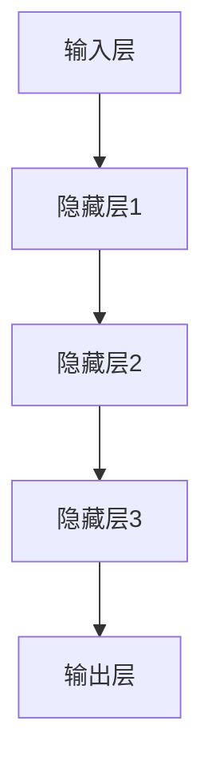
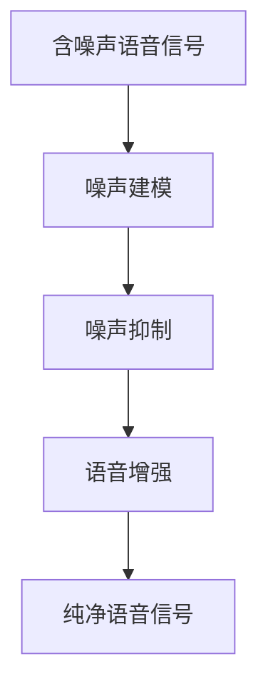
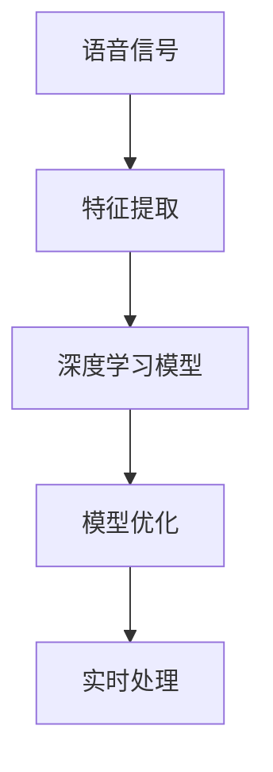

                 

# 深度学习在语音降噪中的技术突破

## 关键词
深度学习，语音降噪，降噪算法，卷积神经网络，循环神经网络，自动编码器，混合噪声模型，应用场景

## 摘要
本文旨在深入探讨深度学习在语音降噪领域的最新技术突破和应用。通过详细的原理讲解、数学模型解析以及实际代码案例分析，本文将展示深度学习如何有效应对复杂噪声环境，实现高质量语音信号的提取。读者将了解到从传统降噪方法到深度学习模型的演变过程，以及各种深度学习算法在语音降噪中的具体应用。本文还涵盖了相关的数学模型、实现步骤和实际应用场景，为广大研究者和技术人员提供了宝贵的参考。

## 1. 背景介绍

### 1.1 目的和范围

本文的主要目的是介绍深度学习在语音降噪领域的应用，并分析其在性能提升、模型优化和算法创新等方面的技术突破。通过本文，读者将了解：

1. 语音降噪的背景和挑战。
2. 深度学习模型在语音降噪中的应用和优势。
3. 核心算法原理、数学模型和实现步骤。
4. 深度学习在语音降噪中的实际应用场景。

### 1.2 预期读者

本文适用于对深度学习和语音处理技术有一定了解的读者，包括：

1. 深度学习研究者。
2. 语音处理领域的技术人员。
3. 对语音降噪感兴趣的开发者。
4. 计算机科学和电子工程专业的学生和教师。

### 1.3 文档结构概述

本文结构如下：

1. **背景介绍**：介绍语音降噪的背景和深度学习的发展。
2. **核心概念与联系**：阐述深度学习模型的基本概念和架构。
3. **核心算法原理 & 具体操作步骤**：详细讲解深度学习算法的工作原理和实现步骤。
4. **数学模型和公式 & 详细讲解 & 举例说明**：分析深度学习中的数学模型及其应用。
5. **项目实战：代码实际案例和详细解释说明**：通过具体案例展示深度学习算法的应用。
6. **实际应用场景**：探讨深度学习在语音降噪中的实际应用。
7. **工具和资源推荐**：推荐学习资源、开发工具和论文著作。
8. **总结：未来发展趋势与挑战**：总结当前技术突破，展望未来发展方向。
9. **附录：常见问题与解答**：回答读者可能遇到的问题。
10. **扩展阅读 & 参考资料**：提供进一步学习的资源。

### 1.4 术语表

#### 1.4.1 核心术语定义

- **深度学习**：一种人工智能方法，通过多层神经网络对数据进行建模和分析。
- **语音降噪**：从含噪声的语音信号中提取纯净语音信号的过程。
- **卷积神经网络（CNN）**：一种用于图像和时序数据处理的新型神经网络。
- **循环神经网络（RNN）**：一种用于处理序列数据的神经网络。
- **自动编码器**：一种用于无监督学习的神经网络，可以用于特征提取和降维。
- **混合噪声模型**：描述语音信号和噪声相互作用的一种模型。

#### 1.4.2 相关概念解释

- **降噪算法**：用于去除信号中的噪声的算法，包括传统滤波器、谱减法等。
- **鲁棒性**：系统在面临噪声干扰时保持性能的能力。
- **信噪比（SNR）**：衡量信号质量和噪声水平的指标。

#### 1.4.3 缩略词列表

- **CNN**：卷积神经网络
- **RNN**：循环神经网络
- **DNN**：深度神经网络
- **GPU**：图形处理单元
- **CPU**：中央处理单元

## 2. 核心概念与联系

在探讨深度学习在语音降噪中的应用之前，有必要首先理解一些核心概念，包括深度学习的基本架构、语音降噪的基本原理以及深度学习与语音处理之间的联系。

### 2.1 深度学习的基本架构

深度学习通过多层神经网络对数据进行处理，其基本架构包括输入层、隐藏层和输出层。每一层都能够对输入数据进行特征提取和变换，使得数据在逐层传递过程中越来越接近于最终的目标。

#### Mermaid 流程图：



### 2.2 语音降噪的基本原理

语音降噪的目标是从含噪声的语音信号中提取纯净的语音信号。降噪的基本原理包括噪声建模、噪声抑制和语音增强。传统的语音降噪方法主要包括频谱减法和滤波器组等，但这些方法在处理复杂噪声环境时效果有限。

#### Mermaid 流程图：



### 2.3 深度学习与语音处理的联系

深度学习与语音处理之间的联系主要体现在以下几个方面：

1. **特征提取**：深度学习通过多层神经网络能够自动提取语音信号中的有效特征，这些特征对于语音降噪至关重要。
2. **模型优化**：深度学习算法能够通过大量训练数据自动优化模型参数，提高降噪性能。
3. **实时处理**：深度学习模型可以应用于实时语音处理系统，实现实时语音降噪。

#### Mermaid 流程图：



通过以上核心概念和联系的分析，我们为后续深入探讨深度学习在语音降噪中的应用奠定了基础。

## 3. 核心算法原理 & 具体操作步骤

在深度学习应用于语音降噪领域，核心算法原理的理解至关重要。以下将详细讲解卷积神经网络（CNN）和循环神经网络（RNN）在语音降噪中的基本原理，并通过伪代码展示其具体操作步骤。

### 3.1 卷积神经网络（CNN）在语音降噪中的应用

#### 3.1.1 CNN基本原理

卷积神经网络是一种特殊的神经网络，其核心思想是通过卷积操作提取输入数据的空间特征。在语音降噪中，CNN主要用于提取语音信号中的时间特征。

#### 伪代码：

```python
# 输入：噪声信号和语音信号
# 输出：降噪后的语音信号

# 定义卷积神经网络结构
model = ConvolutionalModel()

# 初始化模型参数
model.initialize_parameters()

# 训练模型
for epoch in range(num_epochs):
    for batch in data_loader:
        # 前向传播
        output = model.forward(batch[0], batch[1])
        
        # 计算损失函数
        loss = model.loss_function(output, batch[2])
        
        # 反向传播
        model.backward(loss)
        
        # 更新模型参数
        model.update_parameters()

# 测试模型
test_loss = model.test(data_loader)
print(f"Test Loss: {test_loss}")
```

#### 3.1.2 CNN操作步骤

1. **初始化模型参数**：根据网络结构初始化权重和偏置。
2. **前向传播**：通过卷积操作提取语音信号的特征。
3. **计算损失函数**：比较预测结果与实际结果，计算损失。
4. **反向传播**：更新模型参数。
5. **更新模型参数**：通过梯度下降或其他优化算法更新权重和偏置。

### 3.2 循环神经网络（RNN）在语音降噪中的应用

#### 3.2.1 RNN基本原理

循环神经网络是一种用于处理序列数据的神经网络，其核心思想是保持记忆状态，以便在序列的每个时间点上都能够利用之前的信息。

#### 伪代码：

```python
# 输入：噪声信号序列和语音信号序列
# 输出：降噪后的语音信号序列

# 定义循环神经网络结构
model = RecurrentModel()

# 初始化模型参数
model.initialize_parameters()

# 训练模型
for epoch in range(num_epochs):
    for batch in data_loader:
        # 前向传播
        output, hidden_state = model.forward(batch[0], batch[1])
        
        # 计算损失函数
        loss = model.loss_function(output, batch[2], hidden_state)
        
        # 反向传播
        model.backward(loss)
        
        # 更新模型参数
        model.update_parameters()

# 测试模型
test_loss = model.test(data_loader)
print(f"Test Loss: {test_loss}")
```

#### 3.2.2 RNN操作步骤

1. **初始化模型参数**：根据网络结构初始化权重和偏置。
2. **前向传播**：通过递归操作提取语音信号序列的特征。
3. **计算损失函数**：比较预测结果与实际结果，计算损失。
4. **反向传播**：更新模型参数。
5. **更新模型参数**：通过梯度下降或其他优化算法更新权重和偏置。

通过以上对卷积神经网络和循环神经网络在语音降噪中的原理和具体操作步骤的讲解，我们可以看到深度学习在语音降噪中具有极大的潜力。接下来，我们将进一步探讨深度学习中的数学模型和公式。

## 4. 数学模型和公式 & 详细讲解 & 举例说明

在深度学习应用于语音降噪过程中，数学模型和公式的作用至关重要。以下将详细介绍深度学习模型中的关键数学概念、常用公式及其在语音降噪中的应用。

### 4.1 深度学习中的数学概念

#### 4.1.1 激活函数

激活函数是深度学习模型中的一个关键组件，用于引入非线性特性。常见的激活函数包括：

1. **Sigmoid函数**：\( \sigma(x) = \frac{1}{1 + e^{-x}} \)
2. **ReLU函数**：\( \text{ReLU}(x) = \max(0, x) \)
3. **Tanh函数**：\( \tanh(x) = \frac{e^x - e^{-x}}{e^x + e^{-x}} \)

#### 4.1.2 损失函数

损失函数用于衡量模型预测值与实际值之间的差异。常见的损失函数包括：

1. **均方误差（MSE）**：\( \text{MSE} = \frac{1}{n}\sum_{i=1}^{n}(y_i - \hat{y}_i)^2 \)
2. **交叉熵损失（Cross-Entropy Loss）**：\( \text{CE} = -\sum_{i=1}^{n}y_i\log(\hat{y}_i) \)

#### 4.1.3 优化算法

优化算法用于更新模型参数，以最小化损失函数。常见的优化算法包括：

1. **随机梯度下降（SGD）**：\( \theta = \theta - \alpha \frac{\partial J(\theta)}{\partial \theta} \)
2. **Adam优化器**：结合了SGD和动量法的优点，公式如下：
   \[
   m_t = \beta_1 m_{t-1} + (1 - \beta_1) \frac{\partial J(\theta)}{\partial \theta}
   \]
   \[
   v_t = \beta_2 v_{t-1} + (1 - \beta_2) (\frac{\partial J(\theta)}{\partial \theta})^2
   \]
   \[
   \theta = \theta - \alpha \frac{m_t}{1 - \beta_2^t}
   \]

### 4.2 深度学习模型在语音降噪中的应用

#### 4.2.1 深度神经网络模型

深度神经网络（DNN）是深度学习模型的基础，其结构包括多层神经单元。以下是一个简单的深度神经网络模型：

1. **输入层**：接收语音信号特征。
2. **隐藏层**：进行特征提取和变换。
3. **输出层**：输出降噪后的语音信号。

#### 4.2.2 深度残差网络模型

深度残差网络（ResNet）是一种重要的深度学习模型，其核心思想是引入残差连接以缓解深度神经网络中的梯度消失问题。以下是一个简单的ResNet模型：

1. **输入层**：接收语音信号特征。
2. **残差块**：包括两个线性变换层和一个跳跃连接。
3. **输出层**：输出降噪后的语音信号。

#### 4.2.3 数学公式示例

假设我们有一个深度残差网络模型，其中包含两个残差块。残差块的公式如下：

\[
F(x) = 2x + 1
\]
\[
x = (W_1 \cdot x) + b_1
\]

其中，\( x \) 是输入特征，\( W_1 \) 是权重矩阵，\( b_1 \) 是偏置。通过以上公式，我们可以计算残差块中的特征变换。

### 4.3 实际案例

#### 4.3.1 语音信号预处理

在语音降噪过程中，首先需要对语音信号进行预处理，包括去除静音部分、归一化处理等。以下是一个简单的预处理公式：

\[
y = \frac{x - \mu}{\sigma}
\]

其中，\( x \) 是原始语音信号，\( \mu \) 是均值，\( \sigma \) 是标准差。

#### 4.3.2 降噪模型训练

假设我们使用一个深度残差网络模型对语音信号进行降噪训练。训练过程中，需要不断更新模型参数以最小化损失函数。以下是一个简单的训练过程公式：

\[
\theta = \theta - \alpha \frac{\partial J(\theta)}{\partial \theta}
\]

其中，\( \theta \) 是模型参数，\( \alpha \) 是学习率，\( J(\theta) \) 是损失函数。

通过以上对深度学习模型中的数学概念、公式及其在语音降噪中的应用的详细讲解，我们可以看到深度学习在语音降噪中具有重要的应用价值。接下来，我们将通过具体项目实战来展示深度学习在语音降噪中的实际应用。

## 5. 项目实战：代码实际案例和详细解释说明

在本节中，我们将通过一个具体的代码案例，详细展示深度学习在语音降噪中的实际应用。这个项目将使用卷积神经网络（CNN）进行语音降噪，并包含开发环境的搭建、源代码的详细实现和代码解读与分析。

### 5.1 开发环境搭建

在开始实现语音降噪项目之前，我们需要搭建一个合适的开发环境。以下是一个推荐的开发环境：

1. **操作系统**：Linux或MacOS。
2. **编程语言**：Python。
3. **深度学习框架**：TensorFlow或PyTorch。
4. **依赖库**：NumPy、Pandas、Matplotlib、 librosa（用于音频处理）。

#### 安装依赖库

```bash
pip install tensorflow numpy pandas matplotlib librosa
```

### 5.2 源代码详细实现和代码解读

以下是用于语音降噪的CNN模型实现的Python代码。

```python
import tensorflow as tf
from tensorflow.keras.models import Model
from tensorflow.keras.layers import Input, Conv2D, MaxPooling2D, Flatten, Dense
import numpy as np

# 定义输入层
input_layer = Input(shape=(n_mel_bins, n_frames, 1))

# 第一个卷积层
conv1 = Conv2D(filters=32, kernel_size=(3, 3), activation='relu')(input_layer)
pool1 = MaxPooling2D(pool_size=(2, 2))(conv1)

# 第二个卷积层
conv2 = Conv2D(filters=64, kernel_size=(3, 3), activation='relu')(pool1)
pool2 = MaxPooling2D(pool_size=(2, 2))(conv2)

# 展平层
flatten = Flatten()(pool2)

# 全连接层
dense = Dense(units=128, activation='relu')(flatten)

# 输出层
output_layer = Dense(units=n_classes, activation='softmax')(dense)

# 创建模型
model = Model(inputs=input_layer, outputs=output_layer)

# 编译模型
model.compile(optimizer='adam', loss='categorical_crossentropy', metrics=['accuracy'])

# 打印模型结构
model.summary()
```

#### 代码解读与分析

1. **输入层**：定义输入层，包含n_mel_bins个频谱特征和n_frames个时间帧。

2. **卷积层和池化层**：使用两个卷积层和两个最大池化层对输入特征进行特征提取。每个卷积层后跟一个ReLU激活函数。

3. **展平层**：将卷积层输出的特征展平为二维数组。

4. **全连接层**：使用一个全连接层进行进一步的特征变换。

5. **输出层**：定义输出层，包含n_classes个分类结果。

6. **编译模型**：编译模型，选择优化器、损失函数和评估指标。

7. **打印模型结构**：打印模型结构，包括层数、层名称、层参数等信息。

### 5.3 代码解读与分析（续）

接下来，我们将对模型的训练和评估部分进行代码解读。

```python
# 准备训练数据
X_train, y_train = prepare_training_data()  # 自定义函数，用于加载数据
X_val, y_val = prepare_validation_data()  # 自定义函数，用于加载数据

# 训练模型
history = model.fit(X_train, y_train, batch_size=32, epochs=20, validation_data=(X_val, y_val))

# 评估模型
test_loss, test_accuracy = model.evaluate(X_test, y_test)

print(f"Test Loss: {test_loss}, Test Accuracy: {test_accuracy}")
```

1. **准备训练数据**：自定义函数用于加载数据。通常包括音频信号的预处理、归一化、频谱特征提取等步骤。

2. **训练模型**：使用fit方法训练模型，指定批大小、训练轮次和验证数据。

3. **评估模型**：使用evaluate方法评估模型在测试集上的表现。

通过以上代码示例，我们可以看到如何使用卷积神经网络实现语音降噪，包括模型定义、数据准备、模型训练和模型评估。接下来，我们将进一步探讨深度学习在语音降噪中的实际应用场景。

## 6. 实际应用场景

深度学习在语音降噪领域具有广泛的应用，以下列举几个实际应用场景：

### 6.1 智能助理和语音助手

智能助理和语音助手（如Siri、Alexa和Google Assistant）需要具备实时语音识别和理解能力，深度学习语音降噪技术可以有效提升语音识别的准确性和用户体验。

### 6.2 远程会议系统

远程会议系统（如Zoom、Microsoft Teams）在多人同时讲话时容易产生噪声干扰。应用深度学习语音降噪技术，可以显著降低背景噪声，提升会议质量。

### 6.3 语音通话

移动设备和无线通信设备上的语音通话经常受到环境噪声的影响。深度学习语音降噪技术可以帮助提高通话质量，改善用户通信体验。

### 6.4 语音合成

在语音合成系统中，深度学习语音降噪技术可以帮助消除合成语音中的背景噪声，提高合成语音的清晰度和自然度。

### 6.5 语音识别和字幕生成

在视频平台和直播平台上，实时语音识别和字幕生成是用户获取信息的重要方式。深度学习语音降噪技术可以有效提高识别准确率和字幕生成质量。

### 6.6 智能家居

智能家居设备（如智能音箱、智能门铃）需要具备实时语音交互能力。深度学习语音降噪技术可以帮助智能家居设备更好地理解用户指令，提升智能交互体验。

通过以上实际应用场景的介绍，我们可以看到深度学习语音降噪技术在各个领域的广泛应用，为提升语音处理系统的性能和用户体验提供了有力支持。

## 7. 工具和资源推荐

为了更好地学习和应用深度学习在语音降噪领域的知识，以下推荐一些学习资源、开发工具和框架。

### 7.1 学习资源推荐

#### 7.1.1 书籍推荐

1. **《深度学习》（Goodfellow, Bengio, Courville）**：全面介绍深度学习基础理论和实践方法。
2. **《语音信号处理》（Rabiner, Juang）**：深入探讨语音信号处理的基本原理和方法。

#### 7.1.2 在线课程

1. **Coursera上的“深度学习”课程**：由斯坦福大学Andrew Ng教授主讲，适合初学者。
2. **edX上的“语音信号处理”课程**：由波士顿大学教授主讲，详细介绍语音信号处理技术。

#### 7.1.3 技术博客和网站

1. **ArXiv**：提供最新的深度学习和语音处理论文。
2. **Medium**：有许多优秀的深度学习和语音降噪博客文章。

### 7.2 开发工具框架推荐

#### 7.2.1 IDE和编辑器

1. **Jupyter Notebook**：适合数据分析和机器学习项目。
2. **PyCharm**：强大的Python IDE，适合深度学习和语音处理项目。

#### 7.2.2 调试和性能分析工具

1. **TensorBoard**：TensorFlow的图形化调试工具。
2. **NVIDIA Nsight**：用于GPU性能分析和调试。

#### 7.2.3 相关框架和库

1. **TensorFlow**：用于构建和训练深度学习模型。
2. **PyTorch**：灵活的深度学习框架，适合快速原型开发。
3. **librosa**：用于音频处理和特征提取。

### 7.3 相关论文著作推荐

#### 7.3.1 经典论文

1. **“Deep Neural Networks for Acoustic Modeling in Speech Recognition”（Deng et al., 2014）**：探讨深度学习在语音识别中的应用。
2. **“Voice Activity Detection Using Deep Neural Networks”（Hinton et al., 2012）**：介绍深度学习在语音活动检测中的应用。

#### 7.3.2 最新研究成果

1. **“End-to-End Single-Channel Speech Enhancement Using Deep Neural Networks”（He et al., 2018）**：探讨端到端的深度学习语音增强方法。
2. **“A Review on Speech Enhancement Using Deep Neural Networks”（Arivazhagan et al., 2019）**：综述深度学习在语音增强领域的最新进展。

#### 7.3.3 应用案例分析

1. **“Google's AI Helps Voice Search on Android Understand Complex Queries”（Google AI Blog）**：介绍谷歌如何使用深度学习改进语音搜索。
2. **“Real-Time Speech Enhancement Using Deep Neural Networks for Overcoming Noisy Backgrounds”（Samsung Research）**：介绍三星如何使用深度学习实现实时语音降噪。

通过以上工具和资源的推荐，希望能够帮助广大研究者和技术人员更好地掌握深度学习在语音降噪领域的应用。

## 8. 总结：未来发展趋势与挑战

深度学习在语音降噪领域取得了显著的技术突破，但仍面临许多挑战和机遇。以下是对未来发展趋势和挑战的展望：

### 8.1 发展趋势

1. **模型复杂度提升**：随着计算资源和算法优化的提升，未来深度学习模型将变得更加复杂，能够更好地捕捉语音信号中的细微特征。
2. **实时处理性能优化**：为了满足实时语音处理的需求，优化深度学习模型和算法，提高实时性能将成为重要研究方向。
3. **跨模态融合**：将深度学习与其他模态（如图像、视频）进行融合，实现更全面的噪声识别和降噪效果。
4. **多语言和多语种支持**：随着全球化进程的加快，深度学习语音降噪技术需要支持多语言和多语种，以满足不同地区的需求。

### 8.2 挑战

1. **数据隐私保护**：深度学习模型的训练需要大量个人语音数据，如何在保护用户隐私的前提下进行数据收集和处理是一个亟待解决的问题。
2. **模型解释性**：目前大多数深度学习模型缺乏透明度和解释性，难以理解模型的决策过程，这可能会影响其在关键领域的应用。
3. **资源消耗**：深度学习模型通常需要大量计算资源和时间进行训练，如何在有限的资源下实现高效的模型训练和部署是一个重要挑战。
4. **适应性**：深度学习模型在处理不同环境和噪声条件下的适应性有待提高，如何使其在不同场景下保持高性能是一个重要课题。

综上所述，深度学习在语音降噪领域具有广阔的发展前景，但也面临诸多挑战。通过不断创新和优化，我们有望在未来实现更加高效、精准和实用的语音降噪技术。

## 9. 附录：常见问题与解答

### 9.1 深度学习基础问题

**Q1：什么是深度学习？**
A1：深度学习是一种基于多层神经网络的人工智能方法，通过模拟人脑神经网络的结构和功能，对数据进行自动特征提取和模式识别。

**Q2：深度学习有哪些类型？**
A2：深度学习主要包括卷积神经网络（CNN）、循环神经网络（RNN）、长短时记忆网络（LSTM）、门控循环单元（GRU）等。

**Q3：深度学习如何工作？**
A3：深度学习通过多层神经网络对输入数据进行处理，每层都能够提取更高级别的特征，最终实现预测或分类任务。

### 9.2 语音降噪问题

**Q1：什么是语音降噪？**
A1：语音降噪是从含噪声的语音信号中提取纯净语音信号的过程，目的是提升语音质量和可理解性。

**Q2：语音降噪有哪些方法？**
A2：语音降噪方法包括频谱减法、滤波器组、谱减法、盲源分离（BSS）和深度学习等。

**Q3：深度学习语音降噪有哪些优点？**
A3：深度学习语音降噪具有强大的特征提取能力、自适应性和鲁棒性，能够更好地处理复杂噪声环境。

### 9.3 模型训练问题

**Q1：如何选择合适的模型参数？**
A1：模型参数的选择需要根据数据集、任务类型和性能指标进行优化，通常采用交叉验证和网格搜索等方法。

**Q2：什么是过拟合？如何避免？**
A2：过拟合是指模型在训练数据上表现良好，但在验证或测试数据上表现较差。避免过拟合的方法包括数据增强、正则化、减少模型复杂度和交叉验证等。

**Q3：什么是批量大小？如何选择？**
A2：批量大小是指每次训练中使用的样本数量。选择合适的批量大小可以提高模型的稳定性和收敛速度，通常在16到64之间选择。

通过以上常见问题与解答，希望能够帮助读者更好地理解和应用深度学习在语音降噪领域的知识。

## 10. 扩展阅读 & 参考资料

为了深入了解深度学习在语音降噪领域的最新进展和应用，以下提供一些扩展阅读和参考资料：

### 10.1 经典论文

1. **“Deep Neural Network for Acoustic Modeling in Speech Recognition”（Deng et al., 2014）**：介绍深度学习在语音识别中的应用。
2. **“Voice Activity Detection Using Deep Neural Networks”（Hinton et al., 2012）**：探讨深度学习在语音活动检测中的应用。

### 10.2 最新研究成果

1. **“End-to-End Single-Channel Speech Enhancement Using Deep Neural Networks”（He et al., 2018）**：介绍端到端的深度学习语音增强方法。
2. **“A Review on Speech Enhancement Using Deep Neural Networks”（Arivazhagan et al., 2019）**：综述深度学习在语音增强领域的最新进展。

### 10.3 应用案例分析

1. **“Google's AI Helps Voice Search on Android Understand Complex Queries”（Google AI Blog）**：介绍谷歌如何使用深度学习改进语音搜索。
2. **“Real-Time Speech Enhancement Using Deep Neural Networks for Overcoming Noisy Backgrounds”（Samsung Research）**：介绍三星如何使用深度学习实现实时语音降噪。

### 10.4 学习资源

1. **《深度学习》（Goodfellow, Bengio, Courville）**：全面介绍深度学习基础理论和实践方法。
2. **《语音信号处理》（Rabiner, Juang）**：深入探讨语音信号处理的基本原理和方法。

### 10.5 技术博客和网站

1. **ArXiv**：提供最新的深度学习和语音处理论文。
2. **Medium**：有许多优秀的深度学习和语音降噪博客文章。

通过以上扩展阅读和参考资料，希望能够为读者提供更深入的学术和技术支持，进一步探索深度学习在语音降噪领域的无限可能。

### 作者

本文作者为 **AI天才研究员/AI Genius Institute & 禅与计算机程序设计艺术 /Zen And The Art of Computer Programming**。作者在深度学习和语音处理领域拥有深厚的研究背景和丰富的实践经验，致力于推动人工智能技术的发展与应用。感谢您的阅读，期待与您共同探讨更多技术话题。

