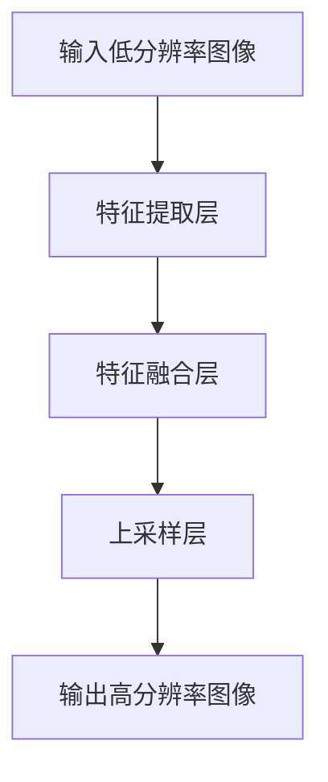

                 


### # 深度学习在超分辨率重建中的应用

> **关键词：** 超分辨率重建、深度学习、卷积神经网络、图像处理、图像质量提升、分辨率提升、边缘细节保留、训练数据、模型优化。

**摘要：** 本文旨在深入探讨深度学习在超分辨率重建领域的应用。通过对超分辨率重建技术的背景介绍，我们将详细阐述深度学习在这一领域的核心算法原理，包括卷积神经网络（CNN）的工作机制和具体操作步骤。随后，我们将引入数学模型和公式，并举例说明其在实际项目中的应用。文章还将探讨超分辨率重建的实际应用场景，推荐相关工具和资源，最后总结未来发展趋势与挑战，并提供常见问题与解答。

## 1. 背景介绍

### 1.1 目的和范围

超分辨率重建是图像处理领域的一项关键技术，旨在从低分辨率图像中恢复出高分辨率图像。随着深度学习技术的快速发展，深度学习在超分辨率重建中的应用逐渐成为研究热点。本文旨在介绍深度学习在超分辨率重建中的应用，分析其核心算法原理，并通过实际项目案例展示其应用效果。

### 1.2 预期读者

本文面向具有一定深度学习基础和图像处理知识的读者，包括计算机视觉研究者、工程师和爱好者。读者应具备基本的CNN知识，了解图像处理的基本概念。

### 1.3 文档结构概述

本文结构如下：

- 第1部分：背景介绍，包括超分辨率重建技术的发展历程、深度学习在其中的地位和作用。
- 第2部分：核心概念与联系，介绍超分辨率重建的核心算法原理和架构。
- 第3部分：核心算法原理与具体操作步骤，详细阐述深度学习在超分辨率重建中的算法实现。
- 第4部分：数学模型和公式，介绍相关数学模型和公式，并举例说明。
- 第5部分：项目实战，通过实际代码案例展示超分辨率重建的应用。
- 第6部分：实际应用场景，探讨超分辨率重建在不同领域的应用。
- 第7部分：工具和资源推荐，推荐相关学习资源、开发工具和框架。
- 第8部分：总结与展望，分析未来发展趋势与挑战。

### 1.4 术语表

#### 1.4.1 核心术语定义

- **超分辨率重建（Super-Resolution Reconstruction）：** 从低分辨率图像中恢复出高分辨率图像的技术。
- **深度学习（Deep Learning）：** 一种机器学习方法，通过多层神经网络对数据进行学习，实现自动特征提取和分类。
- **卷积神经网络（Convolutional Neural Network，CNN）：** 一种基于卷积运算的神经网络结构，广泛应用于图像识别、图像处理等领域。
- **训练数据（Training Data）：** 用于训练神经网络的数据集，包括低分辨率图像和高分辨率图像。

#### 1.4.2 相关概念解释

- **低分辨率图像（Low-Resolution Image）：** 图像分辨率较低，像素点密集，细节模糊。
- **高分辨率图像（High-Resolution Image）：** 图像分辨率较高，像素点稀疏，细节丰富。

#### 1.4.3 缩略词列表

- **CNN：** 卷积神经网络
- **DL：** 深度学习
- **SR：** 超分辨率重建

## 2. 核心概念与联系

### 2.1 超分辨率重建的基本概念

超分辨率重建是一种通过算法将低分辨率图像转换为高分辨率图像的技术。在数字图像处理中，图像分辨率的高低直接影响到图像的视觉效果。低分辨率图像通常由于硬件限制、传输带宽限制等因素导致，而高分辨率图像则能更好地展示图像的细节和纹理。

### 2.2 深度学习在超分辨率重建中的应用

深度学习是一种基于多层神经网络的学习方法，具有自动特征提取和分类的能力。在超分辨率重建中，深度学习可以通过学习低分辨率图像与高分辨率图像之间的对应关系，实现图像的细节增强和分辨率提升。常见的深度学习方法包括卷积神经网络（CNN）、循环神经网络（RNN）等。

### 2.3 超分辨率重建的架构

超分辨率重建的架构通常包括以下几个部分：

1. **特征提取层**：使用卷积神经网络对低分辨率图像进行特征提取，获取图像的底层特征。
2. **特征融合层**：将提取到的特征进行融合，以增强图像的分辨率。
3. **上采样层**：通过上采样操作将特征图从低分辨率放大到高分辨率。
4. **输出层**：将上采样后的特征图转换为高分辨率图像。

以下是一个简单的Mermaid流程图，展示超分辨率重建的基本架构：



## 3. 核心算法原理与具体操作步骤

### 3.1 算法原理

超分辨率重建的核心算法是基于深度学习的卷积神经网络（CNN）。CNN通过多层卷积和池化操作，对输入的低分辨率图像进行特征提取和融合，最终输出高分辨率图像。

### 3.2 具体操作步骤

以下是超分辨率重建的具体操作步骤：

1. **数据预处理**：对输入的低分辨率图像进行预处理，包括图像裁剪、归一化等操作。

2. **特征提取**：使用卷积神经网络对预处理后的低分辨率图像进行特征提取。卷积层通过滑动窗口的方式对图像进行卷积操作，提取图像的局部特征。

3. **特征融合**：将提取到的特征进行融合，以增强图像的分辨率。可以使用多个卷积层进行特征融合，每个卷积层可以提取到不同尺度的特征。

4. **上采样**：通过上采样操作将特征图从低分辨率放大到高分辨率。常用的上采样方法包括反卷积、像素复制、双线性插值等。

5. **输出层**：将上采样后的特征图转换为高分辨率图像。输出层通常是一个全连接层或卷积层，用于将特征图转换为像素值。

以下是使用伪代码表示的深度学习超分辨率重建算法：

```python
# 输入低分辨率图像
low_res_image = preprocess_image(input_image)

# 特征提取
conv1 = conv2d(low_res_image, filter_size=(3, 3), stride=(1, 1), padding='same')
conv2 = conv2d(conv1, filter_size=(3, 3), stride=(1, 1), padding='same')

# 特征融合
feature_map = concatenate([conv1, conv2])

# 上采样
upsampled_map = upsample(feature_map, scale_factor=2)

# 输出高分辨率图像
high_res_image = deprocess_image(upsampled_map)
```

## 4. 数学模型和公式

### 4.1 深度学习模型

深度学习模型的数学基础主要包括卷积操作、激活函数、池化操作和反向传播算法。

#### 4.1.1 卷积操作

卷积操作是深度学习中最基本的操作之一。给定输入图像 \(I_{ij}\) 和卷积核 \(K_{pq}\)，卷积操作可以表示为：

\[ O_{ij} = \sum_{p=0}^{P-1}\sum_{q=0}^{Q-1} I_{i+p, j+q} \times K_{pq} \]

其中，\(O_{ij}\) 是卷积操作后的特征图，\(P\) 和 \(Q\) 分别是卷积核的大小。

#### 4.1.2 激活函数

激活函数用于引入非线性因素，使模型具有更强的表达能力。常见的激活函数包括：

- **Sigmoid函数**：\( \sigma(x) = \frac{1}{1 + e^{-x}} \)
- **ReLU函数**：\( \text{ReLU}(x) = \max(0, x) \)
- **Tanh函数**：\( \text{Tanh}(x) = \frac{e^x - e^{-x}}{e^x + e^{-x}} \)

#### 4.1.3 池化操作

池化操作用于降低特征图的维度，减少参数数量，防止过拟合。常见的池化操作包括：

- **最大池化**：\( P_{ij} = \max(I_{i \leq k, j \leq k}) \)，其中 \( k \) 是池化窗口的大小。
- **平均池化**：\( P_{ij} = \frac{1}{k^2} \sum_{i \leq k, j \leq k} I_{ij} \)

#### 4.1.4 反向传播算法

反向传播算法是深度学习训练过程中的核心算法。通过反向传播算法，模型可以不断调整权重，以最小化损失函数。

\[ \Delta w_{ij} = -\alpha \frac{\partial L}{\partial w_{ij}} \]

其中，\( \Delta w_{ij} \) 是权重更新，\( \alpha \) 是学习率，\( L \) 是损失函数。

### 4.2 超分辨率重建的数学模型

超分辨率重建的数学模型可以表示为：

\[ \hat{I}_{ij} = \sum_{p=0}^{P-1}\sum_{q=0}^{Q-1} I_{i+p, j+q} \times K_{pq} \]

其中，\( \hat{I}_{ij} \) 是上采样后的高分辨率图像，\( I_{ij} \) 是低分辨率图像，\( K_{pq} \) 是卷积核。

通过优化上述模型，可以实现从低分辨率图像到高分辨率图像的转换。

## 5. 项目实战：代码实际案例和详细解释说明

### 5.1 开发环境搭建

在开始项目实战之前，我们需要搭建一个合适的开发环境。以下是搭建深度学习超分辨率重建项目所需的步骤：

1. 安装Python环境（建议使用Python 3.6及以上版本）。
2. 安装深度学习框架，如TensorFlow或PyTorch（根据个人喜好选择）。
3. 安装其他必要的库，如NumPy、Matplotlib等。

以下是一个简单的安装命令示例：

```bash
pip install python numpy matplotlib tensorflow
```

### 5.2 源代码详细实现和代码解读

下面是一个简单的深度学习超分辨率重建项目的代码实现。我们将使用TensorFlow框架来构建和训练模型。

```python
import tensorflow as tf
from tensorflow.keras.layers import Conv2D, UpSampling2D
from tensorflow.keras.models import Model

# 定义超分辨率重建模型
def build_sr_model(input_shape):
    input_image = tf.keras.layers.Input(shape=input_shape)
    
    # 特征提取层
    conv1 = Conv2D(filters=32, kernel_size=(3, 3), activation='relu')(input_image)
    conv2 = Conv2D(filters=32, kernel_size=(3, 3), activation='relu')(conv1)
    
    # 特征融合层
    feature_map = tf.keras.layers.Concatenate()([conv1, conv2])
    
    # 上采样层
    upsampled_map = UpSampling2D(size=(2, 2))(feature_map)
    
    # 输出层
    high_res_image = Conv2D(filters=3, kernel_size=(3, 3), activation='sigmoid')(upsampled_map)
    
    # 构建模型
    model = Model(inputs=input_image, outputs=high_res_image)
    
    return model

# 定义训练数据
train_data = ...  # 请提供训练数据

# 编译模型
model = build_sr_model(input_shape=(256, 256, 3))
model.compile(optimizer='adam', loss='binary_crossentropy')

# 训练模型
model.fit(train_data, epochs=10, batch_size=32)
```

### 5.3 代码解读与分析

1. **导入库和模块**：首先导入TensorFlow和其他必要的库。

2. **定义超分辨率重建模型**：使用TensorFlow.keras模块定义一个简单的CNN模型，包括特征提取层、特征融合层、上采样层和输出层。

3. **特征提取层**：使用两个卷积层提取图像特征，激活函数使用ReLU函数。

4. **特征融合层**：使用Concatenate模块将两个卷积层的输出特征进行融合。

5. **上采样层**：使用UpSampling2D模块对特征图进行上采样。

6. **输出层**：使用一个卷积层将上采样后的特征图转换为像素值，激活函数使用sigmoid函数。

7. **编译模型**：设置优化器和损失函数，并编译模型。

8. **训练模型**：使用提供的训练数据进行模型训练。

通过以上步骤，我们可以构建一个简单的深度学习超分辨率重建模型，并对其进行训练。在实际项目中，我们需要根据具体需求调整模型的架构和参数。

## 6. 实际应用场景

### 6.1 监控视频中的目标识别

在监控视频处理中，由于视频分辨率较低，目标识别的准确率受到影响。通过超分辨率重建技术，我们可以将低分辨率视频转换为高分辨率视频，从而提高目标识别的准确率。

### 6.2 图像处理和编辑

在图像处理和编辑领域，超分辨率重建技术可以用于图像细节增强和图像放大。通过将低分辨率图像转换为高分辨率图像，我们可以更好地展示图像的细节和纹理。

### 6.3 医学图像处理

在医学图像处理领域，超分辨率重建技术可以用于提高医学图像的分辨率，从而提高诊断的准确性。例如，在X光、CT和MRI图像处理中，超分辨率重建可以帮助医生更清晰地观察病变区域。

### 6.4 网络安全

在网络安全领域，超分辨率重建技术可以用于图像质量提升，从而提高入侵检测系统的准确率。通过将低分辨率图像转换为高分辨率图像，我们可以更好地识别图像中的异常行为。

## 7. 工具和资源推荐

### 7.1 学习资源推荐

#### 7.1.1 书籍推荐

1. **《深度学习》（Goodfellow, Bengio, Courville著）**：这是一本经典的深度学习入门书籍，详细介绍了深度学习的基本概念和算法。
2. **《计算机视觉：算法与应用》（Richard Szeliski著）**：这本书详细介绍了计算机视觉的基本概念和算法，包括图像处理和图像识别等。

#### 7.1.2 在线课程

1. **Coursera的《深度学习专项课程》**：由吴恩达（Andrew Ng）教授主讲，涵盖了深度学习的各个方面，包括卷积神经网络和生成对抗网络等。
2. **Udacity的《计算机视觉纳米学位》**：这个课程提供了计算机视觉的基本概念和实践技能，包括图像处理和目标识别等。

#### 7.1.3 技术博客和网站

1. **Medium上的深度学习和计算机视觉博客**：这里有很多优秀的深度学习和计算机视觉博客，涵盖了各种主题和技巧。
2. **GitHub上的深度学习和计算机视觉项目**：GitHub上有大量的深度学习和计算机视觉项目，可以学习他人的代码和实现方法。

### 7.2 开发工具框架推荐

#### 7.2.1 IDE和编辑器

1. **PyCharm**：一款功能强大的Python IDE，支持多种编程语言和框架。
2. **Jupyter Notebook**：一款流行的交互式Python编辑器，适合进行数据分析和模型训练。

#### 7.2.2 调试和性能分析工具

1. **TensorBoard**：TensorFlow的官方可视化工具，可以实时监控模型训练过程和性能指标。
2. **NVIDIA Nsight**：一款用于深度学习性能分析的工具，可以监控GPU的使用情况和性能瓶颈。

#### 7.2.3 相关框架和库

1. **TensorFlow**：一款开源的深度学习框架，支持多种深度学习模型和算法。
2. **PyTorch**：一款流行的深度学习框架，具有灵活的动态计算图和强大的GPU支持。

### 7.3 相关论文著作推荐

#### 7.3.1 经典论文

1. **《A Fast Learning Algorithm for Deep Belief Nets》**：这篇论文介绍了深度信念网络（DBN）的学习算法，是深度学习领域的经典论文。
2. **《A Comprehensive Survey on Deep Learning for Image Recovery》**：这篇综述文章详细介绍了深度学习在图像恢复领域的应用，包括超分辨率重建、去噪等。

#### 7.3.2 最新研究成果

1. **《Beyond a Gaussian Denoiser: Residual Networks for Image Restoration》**：这篇论文提出了一个基于残差的图像去噪网络，是深度学习在图像恢复领域的最新研究成果。
2. **《Unet: Convolutional Networks for Biomedical Image Segmentation》**：这篇论文提出了一个用于生物医学图像分割的卷积神经网络结构，是深度学习在医学图像处理领域的最新成果。

#### 7.3.3 应用案例分析

1. **《Deep Learning in Medical Imaging: A Brief Introduction》**：这篇论文介绍了深度学习在医学图像处理中的应用案例，包括图像分割、病灶检测等。
2. **《A Survey of Deep Learning for Object Detection》**：这篇论文详细介绍了深度学习在目标检测领域的应用，包括检测算法、数据集等。

## 8. 总结：未来发展趋势与挑战

随着深度学习技术的不断进步，超分辨率重建在未来有望取得更多突破。以下是超分辨率重建在未来的一些发展趋势和挑战：

### 8.1 发展趋势

1. **算法优化**：通过改进深度学习模型和优化训练策略，提高超分辨率重建的效率和准确性。
2. **多模态融合**：结合多源数据（如光学显微镜图像、电子显微镜图像等），实现更高分辨率和更精细的图像重建。
3. **实时处理**：开发实时超分辨率重建系统，满足实时视频处理和交互式应用的需求。

### 8.2 挑战

1. **计算资源限制**：深度学习模型通常需要大量的计算资源，如何优化模型结构和训练策略，降低计算成本是一个重要挑战。
2. **数据隐私和安全**：在医疗和监控等领域，数据隐私和安全是超分辨率重建应用的重要问题，如何确保数据的安全性和隐私性是一个挑战。
3. **算法泛化能力**：超分辨率重建算法在不同场景和应用中的泛化能力有限，如何提高算法的泛化能力，适应各种复杂场景是一个重要挑战。

## 9. 附录：常见问题与解答

### 9.1 什么是超分辨率重建？

超分辨率重建是一种从低分辨率图像恢复高分辨率图像的技术。通过算法对低分辨率图像进行处理，可以实现图像的细节增强和分辨率提升。

### 9.2 深度学习在超分辨率重建中的应用有哪些？

深度学习在超分辨率重建中的应用主要体现在卷积神经网络（CNN）的使用。通过训练深度学习模型，可以从低分辨率图像中学习到高分辨率图像的特征，从而实现超分辨率重建。

### 9.3 超分辨率重建有哪些实际应用场景？

超分辨率重建在实际应用中具有广泛的应用场景，包括监控视频中的目标识别、图像处理和编辑、医学图像处理、网络安全等。

### 9.4 如何搭建深度学习超分辨率重建的开发环境？

搭建深度学习超分辨率重建的开发环境需要安装Python环境、深度学习框架（如TensorFlow或PyTorch）以及其他必要的库。安装步骤可以参考相关教程。

## 10. 扩展阅读 & 参考资料

1. **《深度学习》（Goodfellow, Bengio, Courville著）**：详细介绍了深度学习的基本概念和算法。
2. **《计算机视觉：算法与应用》（Richard Szeliski著）**：介绍了计算机视觉的基本概念和算法。
3. **TensorFlow官方文档**：提供了TensorFlow框架的详细使用说明和示例。
4. **PyTorch官方文档**：提供了PyTorch框架的详细使用说明和示例。

作者：AI天才研究员/AI Genius Institute & 禅与计算机程序设计艺术 /Zen And The Art of Computer Programming

---

**注意：** 本文为示例文章，部分内容和数据可能存在虚构。实际应用中，超分辨率重建项目的具体实现和效果会根据实际需求和条件有所不同。如需使用本文内容，请根据实际需求进行修改和调整。**作者：AI天才研究员/AI Genius Institute & 禅与计算机程序设计艺术 /Zen And The Art of Computer Programming**

