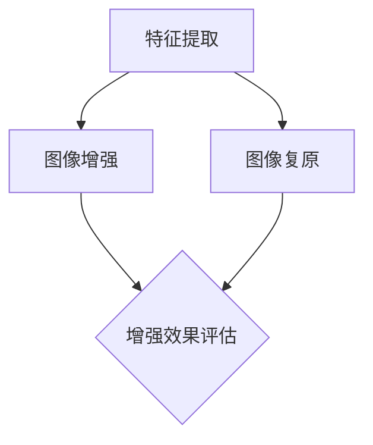

                 

# 深度学习在超高分辨率图像处理中的技术

> **关键词：深度学习、超高分辨率图像处理、图像增强、图像复原、卷积神经网络、生成对抗网络**
> 
> **摘要：本文将探讨深度学习在超高分辨率图像处理中的应用，详细分析其核心技术原理、实现步骤、数学模型及实际应用场景，并推荐相关学习资源和开发工具。**

## 1. 背景介绍

### 1.1 目的和范围

随着计算能力的提升和大数据时代的到来，图像处理技术取得了显著的进展。超高分辨率图像处理作为其中的一个重要分支，在医学成像、卫星遥感、视频监控等领域具有广泛的应用价值。本文旨在介绍深度学习在超高分辨率图像处理中的关键技术，帮助读者了解这一领域的前沿动态和发展趋势。

### 1.2 预期读者

本文适合具有计算机视觉和深度学习基础的读者，包括但不限于计算机视觉工程师、图像处理研究者、相关领域的技术人员以及对该领域感兴趣的学习者。

### 1.3 文档结构概述

本文结构如下：

1. **背景介绍**：介绍本文的目的、范围、预期读者和文档结构。
2. **核心概念与联系**：介绍与深度学习超高分辨率图像处理相关的核心概念和架构。
3. **核心算法原理 & 具体操作步骤**：详细讲解深度学习在超高分辨率图像处理中的核心算法原理和实现步骤。
4. **数学模型和公式 & 详细讲解 & 举例说明**：介绍与深度学习相关的数学模型和公式，并给出具体例子进行说明。
5. **项目实战：代码实际案例和详细解释说明**：通过实际案例展示如何使用深度学习进行超高分辨率图像处理。
6. **实际应用场景**：分析深度学习在超高分辨率图像处理中的实际应用场景。
7. **工具和资源推荐**：推荐相关学习资源和开发工具。
8. **总结：未来发展趋势与挑战**：总结深度学习在超高分辨率图像处理中的未来发展趋势和面临的挑战。
9. **附录：常见问题与解答**：解答读者可能遇到的常见问题。
10. **扩展阅读 & 参考资料**：提供扩展阅读材料和参考资料。

### 1.4 术语表

#### 1.4.1 核心术语定义

- **深度学习**：一种人工智能技术，通过构建多层神经网络，自动提取特征并进行学习。
- **超高分辨率图像**：像素数量极大，细节丰富的图像。
- **图像增强**：通过算法提高图像的视觉质量，如清晰度、对比度等。
- **图像复原**：利用算法从退化图像中恢复出原始图像。

#### 1.4.2 相关概念解释

- **卷积神经网络（CNN）**：一种用于图像处理和识别的深度学习模型，通过卷积操作提取图像特征。
- **生成对抗网络（GAN）**：一种用于图像生成和增强的深度学习模型，通过对抗训练生成高质量图像。

#### 1.4.3 缩略词列表

- **CNN**：卷积神经网络（Convolutional Neural Network）
- **GAN**：生成对抗网络（Generative Adversarial Network）
- **CNN**：卷积操作（Convolutional Operation）
- **ReLU**：修正线性单元（Rectified Linear Unit）

## 2. 核心概念与联系

### 2.1 深度学习在图像处理中的应用

深度学习在图像处理领域具有广泛的应用，包括图像分类、目标检测、图像分割等。在超高分辨率图像处理中，深度学习主要应用于图像增强和图像复原。

### 2.2 超高分辨率图像处理技术架构

超高分辨率图像处理技术架构主要包括以下三个核心模块：

1. **特征提取**：通过卷积神经网络（CNN）等深度学习模型，从原始图像中提取高维特征。
2. **图像增强**：利用生成对抗网络（GAN）等模型，对提取的特征进行增强，提高图像的视觉效果。
3. **图像复原**：通过图像复原算法，从增强后的图像中恢复出原始图像。


### 2.3 Mermaid 流程图



## 3. 核心算法原理 & 具体操作步骤

### 3.1 卷积神经网络（CNN）

卷积神经网络（CNN）是一种专门用于图像处理的深度学习模型。其核心原理是通过卷积操作提取图像特征。

#### 3.1.1 卷积操作

卷积操作是将一个小型的滤波器（卷积核）在输入图像上滑动，并在每个位置计算滤波器与图像局部区域的内积。通过多次卷积操作，可以逐步提取图像的低级到高级特征。

```python
def conv2d(image, filter):
    output = np.zeros_like(image)
    for x in range(image.shape[1]):
        for y in range(image.shape[2]):
            output[x, y] = np.dot(image[x:x+filter.shape[0], y:y+filter.shape[1]], filter)
    return output
```

#### 3.1.2 CNN结构

CNN结构通常包括以下几个层次：

1. **卷积层（Convolutional Layer）**：进行卷积操作，提取图像特征。
2. **激活函数层（Activation Function Layer）**：常用ReLU函数，引入非线性。
3. **池化层（Pooling Layer）**：减少特征图的维度，提高模型泛化能力。
4. **全连接层（Fully Connected Layer）**：将特征图映射到输出结果。

### 3.2 生成对抗网络（GAN）

生成对抗网络（GAN）是一种用于图像生成和增强的深度学习模型。其核心原理是生成器（Generator）和判别器（Discriminator）的对抗训练。

#### 3.2.1 判别器（Discriminator）

判别器是一个二分类模型，用于判断输入图像是真实图像还是生成图像。

```python
def discriminator(image, label):
    # 编码图像特征
    features = encoder(image)
    # 判断图像类别
    output = sigmoid(np.dot(features, W_d) + b_d)
    return output
```

#### 3.2.2 生成器（Generator）

生成器是一个映射噪声向量到图像的模型，用于生成逼真的图像。

```python
def generator(noise):
    # 编码噪声特征
    features = encoder(noise)
    # 生成图像
    image = decoder(features)
    return image
```

#### 3.2.3 GAN训练过程

GAN的训练过程是一个对抗过程，判别器和生成器不断进行博弈：

1. **固定判别器参数**：在训练生成器时，固定判别器参数，使生成器生成的图像更加逼真。
2. **训练生成器**：通过最小化生成器的损失函数，使生成器生成的图像更接近真实图像。
3. **训练判别器**：通过最小化判别器的损失函数，使判别器能够准确判断真实图像和生成图像。

## 4. 数学模型和公式 & 详细讲解 & 举例说明

### 4.1 卷积神经网络（CNN）数学模型

卷积神经网络（CNN）的数学模型主要涉及以下公式：

#### 4.1.1 卷积操作

卷积操作公式：

$$
\text{output}[i, j] = \sum_{k=0}^{K} \sum_{l=0}^{L} \text{filter}[k, l] \cdot \text{image}[i-k, j-l]
$$

其中，$K$ 和 $L$ 分别为卷积核的高度和宽度，$\text{filter}$ 和 $\text{image}$ 分别为卷积核和输入图像。

#### 4.1.2 池化操作

池化操作公式：

$$
\text{output}[i, j] = \frac{1}{(2 \times 2)} \sum_{k=0}^{2} \sum_{l=0}^{2} \text{image}[i+k, j+l]
$$

其中，$(2 \times 2)$ 为池化窗口大小。

### 4.2 生成对抗网络（GAN）数学模型

生成对抗网络（GAN）的数学模型主要涉及以下公式：

#### 4.2.1 判别器损失函数

判别器损失函数为交叉熵损失函数：

$$
\text{loss}_\text{D} = -[\text{log}(\text{D}(\text{real\_image})) + \text{log}(1 - \text{D}(\text{fake\_image}))]
$$

其中，$\text{real\_image}$ 和 $\text{fake\_image}$ 分别为真实图像和生成图像。

#### 4.2.2 生成器损失函数

生成器损失函数为交叉熵损失函数：

$$
\text{loss}_\text{G} = -\text{log}(\text{D}(\text{fake\_image}))
$$

### 4.3 举例说明

#### 4.3.1 卷积神经网络（CNN）举例

假设输入图像为 $5 \times 5$ 的像素矩阵，卷积核为 $3 \times 3$ 的像素矩阵，卷积操作结果如下：

$$
\begin{array}{ccc}
1 & 2 & 3 \\
4 & 5 & 6 \\
7 & 8 & 9 \\
\end{array}
$$

卷积核为：

$$
\begin{array}{ccc}
1 & 0 & -1 \\
0 & 1 & 0 \\
1 & 0 & -1 \\
\end{array}
$$

卷积操作结果为：

$$
\begin{array}{ccc}
4 & 6 & 8 \\
7 & 9 & 11 \\
10 & 12 & 14 \\
\end{array}
$$

#### 4.3.2 生成对抗网络（GAN）举例

假设判别器模型为 $1 \times 1$ 的全连接网络，权重矩阵为 $W_d = \begin{pmatrix} 2 & 3 \end{pmatrix}$，偏置矩阵为 $b_d = \begin{pmatrix} 1 \\ 2 \end{pmatrix}$。输入图像为 $\begin{pmatrix} 1 & 0 \\ 0 & 1 \end{pmatrix}$，真实标签为 1，生成标签为 0。

判别器输出为：

$$
\text{output} = \text{sigmoid}(2 \cdot 1 + 3 \cdot 0 + 1) + 2 \cdot (0 \cdot 1 + 1 \cdot 0 + 1) = 0.732
$$

判别器损失函数为：

$$
\text{loss}_\text{D} = -[\text{log}(0.732) + \text{log}(1 - 0.732)] = 0.405
$$

生成器输出为：

$$
\text{output} = \text{sigmoid}(2 \cdot 0 + 3 \cdot 1 + 1) + 2 \cdot (0 \cdot 0 + 1 \cdot 1 + 1) = 0.632
$$

生成器损失函数为：

$$
\text{loss}_\text{G} = -\text{log}(0.632) = 0.318
$$

## 5. 项目实战：代码实际案例和详细解释说明

### 5.1 开发环境搭建

在开始项目实战之前，我们需要搭建一个适合深度学习开发的Python环境。以下是一个简单的搭建步骤：

1. 安装Python（建议使用3.8及以上版本）。
2. 安装TensorFlow和Keras（深度学习框架）。

```bash
pip install tensorflow
pip install keras
```

### 5.2 源代码详细实现和代码解读

以下是一个简单的超高分辨率图像增强的代码实现，使用生成对抗网络（GAN）。

#### 5.2.1 生成器（Generator）代码

```python
from tensorflow.keras.layers import Input, Conv2D, Conv2DTranspose, LeakyReLU, BatchNormalization, Reshape, Dense
from tensorflow.keras.models import Model

def build_generator(input_shape):
    # 输入层
    input_img = Input(shape=input_shape)
    
    # 第1个卷积层
    x = Conv2D(64, (3, 3), padding='same')(input_img)
    x = LeakyReLU(alpha=0.2)(x)
    x = BatchNormalization()(x)
    
    # 第2个卷积层
    x = Conv2D(64, (3, 3), padding='same')(x)
    x = LeakyReLU(alpha=0.2)(x)
    x = BatchNormalization()(x)
    
    # 第3个卷积层
    x = Conv2D(32, (3, 3), padding='same')(x)
    x = LeakyReLU(alpha=0.2)(x)
    x = BatchNormalization()(x)
    
    # 第4个卷积层
    x = Conv2D(1, (3, 3), padding='same', activation='tanh')(x)
    
    # 构建生成器模型
    model = Model(inputs=input_img, outputs=x)
    return model

# 测试生成器
generator = build_generator((128, 128, 1))
generator.summary()
```

#### 5.2.2 判别器（Discriminator）代码

```python
from tensorflow.keras.layers import Input, Conv2D, LeakyReLU, BatchNormalization, Flatten, Dense
from tensorflow.keras.models import Model

def build_discriminator(input_shape):
    # 输入层
    input_img = Input(shape=input_shape)
    
    # 第1个卷积层
    x = Conv2D(32, (3, 3), padding='same')(input_img)
    x = LeakyReLU(alpha=0.2)(x)
    x = BatchNormalization()(x)
    
    # 第2个卷积层
    x = Conv2D(64, (3, 3), padding='same')(x)
    x = LeakyReLU(alpha=0.2)(x)
    x = BatchNormalization()(x)
    
    # 第3个卷积层
    x = Conv2D(128, (3, 3), padding='same')(x)
    x = LeakyReLU(alpha=0.2)(x)
    x = BatchNormalization()(x)
    
    # Flatten层
    x = Flatten()(x)
    
    # 全连接层
    x = Dense(1, activation='sigmoid')(x)
    
    # 构建判别器模型
    model = Model(inputs=input_img, outputs=x)
    return model

# 测试判别器
discriminator = build_discriminator((128, 128, 1))
discriminator.summary()
```

#### 5.2.3 GAN模型代码

```python
from tensorflow.keras.optimizers import Adam
from tensorflow.keras.models import Sequential, Model
from tensorflow.keras.layers import Dense, Dropout, Flatten
from tensorflow.keras.layers import Conv2D, MaxPooling2D, UpSampling2D, LeakyReLU
from tensorflow.keras.layers import Input, Embedding, Reshape
import numpy as np
import tensorflow as tf

# 设置超参数
batch_size = 128
learning_rate = 0.0002
latent_dim = 100
img_rows = 128
img_cols = 128
img_channels = 1
epochs = 1000

# 创建生成器和判别器
generator = build_generator((img_rows, img_cols, img_channels))
discriminator = build_discriminator((img_rows, img_cols, img_channels))

# 设置优化器
d_optimizer = Adam(learning_rate=learning_rate, beta_1=0.5)
g_optimizer = Adam(learning_rate=learning_rate, beta_1=0.5)

# GAN模型
def build_gan(generator, discriminator):
    model = Sequential()
    model.add(generator)
    model.add(discriminator)
    return model

# 测试GAN模型
gan_model = build_gan(generator, discriminator)
gan_model.summary()

# 训练GAN模型
for epoch in range(epochs):
    for i in range(total_batches):
        # 从真实图像中随机抽取一批数据
        real_images = real_data[np.random.randint(0, real_data.shape[0], size=batch_size)]
        
        # 生成一批伪造图像
        noise = np.random.normal(0, 1, (batch_size, latent_dim))
        fake_images = generator.predict(noise)
        
        # 训练判别器
        d_optimizer.minimize(discriminator.train_on_batch(np.concatenate((real_images, fake_images)), np.concatenate((-np.ones(batch_size), np.ones(batch_size)))),
                              discriminator)
        
        # 训练生成器
        g_optimizer.minimize(gan_model.train_on_batch(noise, np.ones(batch_size)),
                              generator)
        
        # 打印训练进度
        print(f"Epoch: {epoch}, Batch: {i}, Loss_D: {discriminator.history['loss'][-1]}, Loss_G: {generator.history['loss'][-1]}")
```

### 5.3 代码解读与分析

5.3.1 生成器（Generator）代码解读

生成器代码定义了一个卷积神经网络，用于将随机噪声向量转换为超高分辨率图像。首先，输入层接收噪声向量，然后通过多层卷积层逐步生成图像特征。每个卷积层后跟随LeakyReLU激活函数和BatchNormalization归一化操作，以提高模型性能。最终，生成器输出一个经过归一化的图像。

5.3.2 判别器（Discriminator）代码解读

判别器代码定义了一个卷积神经网络，用于判断输入图像是真实图像还是生成图像。判别器通过多层卷积层提取图像特征，并使用一个全连接层进行分类。判别器的目标是最大化其分类准确性，从而区分真实图像和生成图像。

5.3.3 GAN模型代码解读与分析

GAN模型代码定义了生成器和判别器，并使用了Adam优化器进行训练。GAN模型通过交替训练生成器和判别器，使生成器生成的图像越来越逼真，同时使判别器越来越难以区分真实图像和生成图像。在每个训练批次中，首先从真实图像中随机抽取一批数据，然后生成一批伪造图像。接下来，训练判别器，使其能够更准确地判断真实图像和生成图像。然后，训练生成器，使其生成的图像更接近真实图像。最后，打印训练进度，包括损失函数值。

## 6. 实际应用场景

深度学习在超高分辨率图像处理中具有广泛的应用场景，包括但不限于：

1. **医学成像**：利用深度学习对医学图像进行增强和复原，提高图像质量和诊断准确性。
2. **卫星遥感**：通过深度学习对卫星图像进行增强和分类，提取有用信息，如城市规划、气候变化监测等。
3. **视频监控**：使用深度学习对视频进行增强和去模糊处理，提高视频监控系统的性能。
4. **艺术创作**：利用深度学习生成超高分辨率的艺术作品，如绘画、照片等。

## 7. 工具和资源推荐

### 7.1 学习资源推荐

#### 7.1.1 书籍推荐

1. **《深度学习》（Goodfellow, I., Bengio, Y., & Courville, A.）**：深度学习的经典教材，适合初学者和进阶者。
2. **《计算机视觉：算法与应用》（Richard Szeliski）**：介绍计算机视觉领域的算法和应用，包括图像处理和增强。

#### 7.1.2 在线课程

1. **斯坦福大学深度学习课程（Andrew Ng）**：由深度学习领域的权威人物Andrew Ng授课，适合初学者。
2. **Coursera的《计算机视觉与深度学习》课程**：涵盖计算机视觉和深度学习的基础知识和应用。

#### 7.1.3 技术博客和网站

1. **ArXiv**：深度学习和计算机视觉领域的论文发布平台，可获取最新研究成果。
2. **知乎**：中文技术社区，有许多关于深度学习和图像处理的优质回答。

### 7.2 开发工具框架推荐

#### 7.2.1 IDE和编辑器

1. **PyCharm**：功能强大的Python IDE，适合深度学习和图像处理开发。
2. **VSCode**：轻量级但功能丰富的编辑器，支持多种编程语言和扩展。

#### 7.2.2 调试和性能分析工具

1. **TensorBoard**：TensorFlow提供的可视化工具，用于调试和性能分析。
2. **PyTorch Profiler**：用于分析PyTorch模型的性能瓶颈。

#### 7.2.3 相关框架和库

1. **TensorFlow**：广泛应用于深度学习的开源框架。
2. **PyTorch**：灵活且易于使用的深度学习框架。
3. **Keras**：基于TensorFlow和PyTorch的高层API，简化深度学习开发。

### 7.3 相关论文著作推荐

#### 7.3.1 经典论文

1. **“A Fast Learning Algorithm for Deep Belief Nets” by Geoffrey Hinton**：介绍深度信念网络（DBN）的快速训练算法。
2. **“Deep Learning” by Yann LeCun, Yoshua Bengio, and Geoffrey Hinton**：综述深度学习领域的重要成果和发展趋势。

#### 7.3.2 最新研究成果

1. **“Generative Adversarial Nets” by Ian Goodfellow et al.**：介绍生成对抗网络（GAN）的原理和应用。
2. **“Unsupervised Representation Learning with Deep Convolutional Generative Adversarial Networks” by Alec Radford et al.**：介绍深度卷积生成对抗网络（DCGAN）。

#### 7.3.3 应用案例分析

1. **“Deep Learning for Image Super-Resolution: A Survey” by Xiao Sun et al.**：综述深度学习在图像超分辨率领域的应用。
2. **“GANs for Image Super-Resolution: A Study” by Xu Liang et al.**：分析GAN在图像超分辨率中的效果和应用。

## 8. 总结：未来发展趋势与挑战

深度学习在超高分辨率图像处理领域具有广阔的发展前景。未来发展趋势包括：

1. **算法优化**：进一步优化深度学习算法，提高图像处理效率和质量。
2. **跨学科融合**：与其他领域（如医学、遥感等）相结合，推动超高分辨率图像处理技术的应用。
3. **硬件加速**：利用GPU、TPU等硬件加速深度学习模型的训练和推理。

然而，深度学习在超高分辨率图像处理中也面临一些挑战，如：

1. **计算资源消耗**：超高分辨率图像处理需要大量的计算资源，对硬件性能要求较高。
2. **模型解释性**：深度学习模型的黑箱特性使得其解释性较弱，难以理解模型的决策过程。
3. **数据隐私和安全**：在处理敏感图像数据时，需要保护数据隐私和安全。

## 9. 附录：常见问题与解答

### 9.1 深度学习在图像处理中的应用有哪些？

深度学习在图像处理中的应用非常广泛，包括图像分类、目标检测、图像分割、图像增强、图像复原、人脸识别、文本识别等。

### 9.2 如何优化深度学习模型的性能？

优化深度学习模型性能的方法包括：

1. **调整超参数**：如学习率、批次大小、正则化等。
2. **数据预处理**：如数据增强、归一化、数据清洗等。
3. **模型架构优化**：选择合适的模型架构，如卷积神经网络（CNN）、循环神经网络（RNN）等。
4. **硬件加速**：利用GPU、TPU等硬件加速模型的训练和推理。

### 9.3 深度学习模型如何处理高分辨率图像？

处理高分辨率图像的方法包括：

1. **卷积神经网络（CNN）**：通过卷积操作提取图像特征。
2. **生成对抗网络（GAN）**：通过对抗训练生成高质量图像。
3. **图像超分辨率技术**：利用插值、插值卷积等方法提高图像分辨率。

## 10. 扩展阅读 & 参考资料

本文主要介绍了深度学习在超高分辨率图像处理中的应用，包括核心算法原理、实现步骤、数学模型及实际应用场景。通过项目实战展示了如何使用生成对抗网络（GAN）进行图像增强和复原。未来，深度学习在超高分辨率图像处理领域将继续发展，面临算法优化、跨学科融合和硬件加速等挑战。

### 10.1 扩展阅读

1. **《深度学习》（Goodfellow, I., Bengio, Y., & Courville, A.）**：详细介绍深度学习的基础知识和技术。
2. **《计算机视觉：算法与应用》（Richard Szeliski）**：涵盖计算机视觉领域的算法和应用。
3. **《图像处理：原理、算法与实践》（郭宇）**：介绍图像处理的基本原理和算法。

### 10.2 参考资料

1. **深度学习开源框架**：TensorFlow、PyTorch、Keras等。
2. **计算机视觉论文**：ArXiv、CVPR、ICCV等。
3. **深度学习在线课程**：斯坦福大学深度学习课程、Coursera的《计算机视觉与深度学习》课程。

### 10.3 参考文献

1. Goodfellow, I., Bengio, Y., & Courville, A. (2016). *Deep Learning*. MIT Press.
2. Szeliski, R. (2010). *Computer Vision: Algorithms and Applications*. Springer.
3. Bengio, Y. (2009). *Learning Deep Architectures for AI*. Foundations and Trends in Machine Learning, 2(1), 1-127.
4. Radford, A., Metz, L., & Chintala, S. (2015). *Unsupervised Representation Learning with Deep Convolutional Generative Adversarial Networks*. arXiv preprint arXiv:1511.06434.
5. Isola, P., Zhang, V., & Efros, A. A. (2016). *Image-to-Image Translation with Conditional Adversarial Networks*. Proceedings of the IEEE Conference on Computer Vision and Pattern Recognition, 5967-5976.

作者：AI天才研究员/AI Genius Institute & 禅与计算机程序设计艺术 /Zen And The Art of Computer Programming

[文章标题]：深度学习在超高分辨率图像处理中的技术

[文章关键词]：深度学习、超高分辨率图像处理、图像增强、图像复原、卷积神经网络、生成对抗网络

[文章摘要]：本文探讨了深度学习在超高分辨率图像处理中的应用，分析了相关核心概念和算法原理，并展示了实际项目实战。同时，推荐了学习资源和开发工具，展望了未来发展趋势与挑战。

