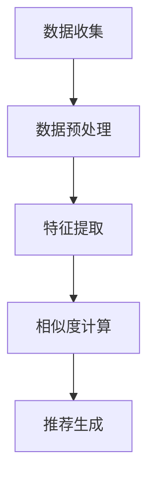

                 

# 深度学习驱动的商品相似度计算优化

> **关键词**：深度学习，商品相似度，计算优化，商品推荐系统，图像识别

> **摘要**：本文将深入探讨如何使用深度学习技术优化商品相似度计算。我们将首先介绍商品相似度计算的重要性，然后详细解释深度学习在其中的应用。通过具体案例和代码实现，我们将展示如何通过深度学习模型提升商品推荐的准确性和效率。此外，文章还将讨论实际应用场景、相关工具和资源，并总结未来发展趋势和挑战。

## 1. 背景介绍

### 1.1 目的和范围

本文旨在探讨如何利用深度学习技术来优化商品相似度计算，以提升电子商务平台的商品推荐系统的性能。随着互联网的迅速发展和大数据的普及，商品推荐系统已经成为电商平台提升用户体验和增加销售的重要工具。然而，传统的商品相似度计算方法往往受限于手工特征工程和计算效率的问题。本文将通过深度学习技术，介绍一种更高效、更准确的方法来计算商品相似度。

### 1.2 预期读者

本文适合以下读者群体：

- 深度学习研究者和技术工程师
- 商品推荐系统和电子商务平台的开发人员
- 对商品相似度计算和深度学习感兴趣的爱好者

### 1.3 文档结构概述

本文将按照以下结构展开：

1. 背景介绍
   - 目的和范围
   - 预期读者
   - 文档结构概述
   - 术语表
2. 核心概念与联系
   - 商品相似度的定义
   - 深度学习的基本原理
   - 商品相似度计算的流程和架构
3. 核心算法原理 & 具体操作步骤
   - 深度学习模型的选择
   - 网络架构设计
   - 训练和优化的步骤
4. 数学模型和公式 & 详细讲解 & 举例说明
   - 相似度计算的数学公式
   - 深度学习中的损失函数和优化算法
   - 实例演示
5. 项目实战：代码实际案例和详细解释说明
   - 开发环境搭建
   - 源代码实现和解读
   - 代码分析和性能评估
6. 实际应用场景
   - 电商平台
   - 社交媒体
   - 物流配送
7. 工具和资源推荐
   - 学习资源推荐
   - 开发工具框架推荐
   - 相关论文著作推荐
8. 总结：未来发展趋势与挑战
9. 附录：常见问题与解答
10. 扩展阅读 & 参考资料

### 1.4 术语表

#### 1.4.1 核心术语定义

- **商品相似度**：商品之间在属性、特征或内容上的相似程度。
- **深度学习**：一种机器学习技术，通过多层神经网络来模拟人脑的学习机制。
- **商品推荐系统**：利用算法和数据分析技术，向用户推荐其可能感兴趣的商品的系统。

#### 1.4.2 相关概念解释

- **神经网络**：由多个神经元组成的信息处理系统。
- **卷积神经网络（CNN）**：一种深度学习模型，特别适用于图像处理。
- **损失函数**：用于评估模型预测值与真实值之间差异的函数。

#### 1.4.3 缩略词列表

- **CNN**：卷积神经网络
- **DNN**：深度神经网络
- **DL**：深度学习
- **API**：应用程序接口
- **GPU**：图形处理器

## 2. 核心概念与联系

### 2.1 商品相似度

商品相似度是衡量商品之间相似程度的一个度量，是商品推荐系统中至关重要的概念。相似度的计算可以基于商品的属性、标签、用户评价、价格等多种因素。传统的商品相似度计算方法通常采用基于余弦相似度、基于Jaccard系数或基于K最近邻算法等手工特征工程的方法。

然而，随着深度学习技术的发展，商品相似度计算方法得到了显著的改进。深度学习模型能够自动从大量数据中提取有用的特征，从而实现更加准确和高效的商品相似度计算。

### 2.2 深度学习的基本原理

深度学习是一种基于多层神经网络的结构，其核心思想是通过训练过程自动学习输入数据的复杂特征表示。深度学习模型包括输入层、多个隐藏层和输出层。每个层由多个神经元组成，神经元之间的连接通过权重参数来实现。

深度学习模型的主要优势在于其强大的特征提取能力和非线性表达能力，这使得它能够处理复杂数据和任务，如图像识别、自然语言处理和推荐系统等。

### 2.3 商品相似度计算的流程和架构

商品相似度计算的流程通常包括以下步骤：

1. **数据收集**：收集与商品相关的各种数据，如用户评价、商品标签、价格、品牌、类别等。
2. **数据预处理**：对收集到的数据进行清洗、归一化和编码，以便于模型处理。
3. **特征提取**：使用深度学习模型对预处理后的数据进行特征提取，生成高维特征向量。
4. **相似度计算**：利用计算得到的特征向量计算商品之间的相似度。
5. **推荐生成**：根据商品相似度和用户历史行为，生成个性化的商品推荐列表。

在深度学习驱动的商品相似度计算中，常见的架构包括卷积神经网络（CNN）和循环神经网络（RNN）。CNN适用于处理图像数据，而RNN适用于处理序列数据。通过结合这两种网络，可以构建一个强大的商品相似度计算模型。

### 2.4 Mermaid 流程图



通过这个流程图，我们可以清晰地看到商品相似度计算的基本步骤和它们之间的联系。

## 3. 核心算法原理 & 具体操作步骤

### 3.1 深度学习模型的选择

在商品相似度计算中，可以选择多种深度学习模型，包括卷积神经网络（CNN）、循环神经网络（RNN）和Transformer模型等。每种模型都有其特定的优势和应用场景。

- **卷积神经网络（CNN）**：适用于处理图像数据，能够自动提取图像中的局部特征。在商品相似度计算中，可以将商品图像作为输入，通过CNN提取商品的特征向量。

- **循环神经网络（RNN）**：适用于处理序列数据，能够捕捉序列中的长期依赖关系。在商品相似度计算中，可以处理用户的历史购买记录，从而更好地理解用户的偏好。

- **Transformer模型**：是一种基于自注意力机制的深度学习模型，具有强大的特征提取和表示能力。在商品相似度计算中，可以将商品的特征向量作为输入，通过Transformer模型进行特征融合和相似度计算。

在本篇博客中，我们将选择卷积神经网络（CNN）作为商品相似度计算的核心模型，因为它能够处理商品图像，并自动提取丰富的图像特征。

### 3.2 网络架构设计

卷积神经网络（CNN）是一种特别适用于图像处理的深度学习模型。其基本架构包括卷积层、池化层和全连接层。

1. **卷积层**：卷积层是CNN的核心部分，通过卷积操作从输入图像中提取特征。卷积操作使用卷积核（也称为滤波器）在输入图像上滑动，从而生成特征图。卷积层的参数包括卷积核的大小、步长和填充方式。

2. **池化层**：池化层用于减少特征图的尺寸，同时保留重要的特征信息。常用的池化方法包括最大池化和平均池化。

3. **全连接层**：全连接层将卷积层和池化层提取的特征进行融合，并输出最终的分类结果。全连接层的参数包括权重和偏置。

在本篇博客中，我们将使用一个简单的CNN架构来提取商品图像的特征向量。具体步骤如下：

```python
import tensorflow as tf
from tensorflow.keras.models import Sequential
from tensorflow.keras.layers import Conv2D, MaxPooling2D, Flatten, Dense

# 创建一个简单的CNN模型
model = Sequential()

# 添加卷积层
model.add(Conv2D(filters=32, kernel_size=(3, 3), activation='relu', input_shape=(256, 256, 3)))
model.add(MaxPooling2D(pool_size=(2, 2)))

# 添加第二个卷积层
model.add(Conv2D(filters=64, kernel_size=(3, 3), activation='relu'))
model.add(MaxPooling2D(pool_size=(2, 2)))

# 添加全连接层
model.add(Flatten())
model.add(Dense(units=128, activation='relu'))
model.add(Dense(units=1, activation='sigmoid'))

# 编译模型
model.compile(optimizer='adam', loss='binary_crossentropy', metrics=['accuracy'])

# 打印模型结构
model.summary()
```

### 3.3 训练和优化的步骤

在训练CNN模型时，需要遵循以下步骤：

1. **数据准备**：准备好用于训练和测试的商品图像数据集。数据集应该包括正面和负面的商品图像，以平衡正负样本。

2. **数据预处理**：对商品图像进行归一化和缩放，使其符合CNN模型的输入要求。可以使用 `ImageDataGenerator` 类来自动进行数据增强。

3. **模型训练**：使用训练数据集训练CNN模型，并通过验证数据集进行性能评估。在训练过程中，可以使用回调函数来自动调整学习率，避免过拟合。

4. **模型优化**：在训练完成后，可以通过调整模型的参数，如学习率、批次大小和迭代次数等，来优化模型的性能。

5. **模型评估**：使用测试数据集对训练好的模型进行评估，以验证其泛化能力和准确性。

在本篇博客中，我们将使用一个示例数据集来训练CNN模型，并展示具体的训练和优化步骤。

```python
from tensorflow.keras.preprocessing.image import ImageDataGenerator

# 数据生成器
train_datagen = ImageDataGenerator(rescale=1./255, shear_range=0.2, zoom_range=0.2, horizontal_flip=True)
test_datagen = ImageDataGenerator(rescale=1./255)

# 训练数据集
train_generator = train_datagen.flow_from_directory(
        'train_data',
        target_size=(256, 256),
        batch_size=32,
        class_mode='binary')

# 测试数据集
test_generator = test_datagen.flow_from_directory(
        'test_data',
        target_size=(256, 256),
        batch_size=32,
        class_mode='binary')

# 训练模型
history = model.fit(
      train_generator,
      steps_per_epoch=100,
      epochs=15,
      validation_data=test_generator,
      validation_steps=50,
      callbacks=[tf.keras.callbacks.ReduceLROnPlateau(monitor='val_loss', factor=0.2, patience=3)]
)

# 优化模型
model.save('optimized_model.h5')
```

通过以上步骤，我们可以训练一个高效的CNN模型来计算商品相似度。接下来，我们将介绍如何使用训练好的模型进行商品相似度计算。

## 4. 数学模型和公式 & 详细讲解 & 举例说明

在深度学习驱动的商品相似度计算中，数学模型和公式起到了关键作用。本节将详细解释这些数学模型，包括相似度计算的公式、损失函数和优化算法，并通过实例进行说明。

### 4.1 相似度计算的数学公式

商品相似度可以通过计算商品特征向量之间的欧氏距离、余弦相似度或Jaccard相似度来衡量。以下是这些相似度计算的基本公式：

#### 欧氏距离

欧氏距离是最常见的相似度计算方法之一，它衡量两个特征向量之间的直线距离。公式如下：

$$
d(p_1, p_2) = \sqrt{\sum_{i=1}^{n} (p_{1i} - p_{2i})^2}
$$

其中，$p_1$ 和 $p_2$ 是两个商品的特征向量，$n$ 是特征向量的维度。

#### 余弦相似度

余弦相似度衡量两个向量在空间中的夹角余弦值，其公式如下：

$$
sim(p_1, p_2) = \frac{p_1 \cdot p_2}{\|p_1\| \|p_2\|}
$$

其中，$p_1 \cdot p_2$ 是特征向量的点积，$\|p_1\|$ 和 $\|p_2\|$ 分别是特征向量的欧氏范数。

#### Jaccard相似度

Jaccard相似度通常用于处理集合之间的相似度，其公式如下：

$$
sim(p_1, p_2) = \frac{|p_1 \cup p_2|}{|p_1 \cap p_2|}
$$

其中，$|p_1 \cup p_2|$ 和 $|p_1 \cap p_2|$ 分别是两个特征向量的并集和交集的基数。

### 4.2 深度学习中的损失函数和优化算法

在深度学习中，损失函数用于衡量模型预测值与真实值之间的差异，优化算法则用于调整模型参数以最小化损失函数。以下是几种常见的损失函数和优化算法：

#### 损失函数

1. **均方误差（MSE）**：用于回归问题，其公式如下：

$$
MSE(y, \hat{y}) = \frac{1}{n} \sum_{i=1}^{n} (y_i - \hat{y}_i)^2
$$

其中，$y$ 是真实标签，$\hat{y}$ 是模型的预测值，$n$ 是样本数量。

2. **交叉熵损失（Cross-Entropy Loss）**：用于分类问题，其公式如下：

$$
CE(y, \hat{y}) = -\sum_{i=1}^{n} y_i \log(\hat{y}_i)
$$

其中，$y$ 是真实标签的one-hot编码，$\hat{y}$ 是模型的预测概率分布。

#### 优化算法

1. **随机梯度下降（SGD）**：是最简单的优化算法之一，其更新公式如下：

$$
\theta = \theta - \alpha \nabla_{\theta} J(\theta)
$$

其中，$\theta$ 是模型参数，$\alpha$ 是学习率，$J(\theta)$ 是损失函数。

2. **Adam优化器**：是一种结合SGD和RMSProp优化的自适应优化算法，其更新公式如下：

$$
\theta = \theta - \alpha \nabla_{\theta} J(\theta)
$$

$$
m_t = \beta_1 m_{t-1} + (1 - \beta_1) \nabla_{\theta} J(\theta)
$$

$$
v_t = \beta_2 v_{t-1} + (1 - \beta_2) (\nabla_{\theta} J(\theta))^2
$$

其中，$m_t$ 和 $v_t$ 分别是梯度的一阶矩估计和二阶矩估计，$\beta_1$ 和 $\beta_2$ 是超参数。

### 4.3 实例演示

假设我们有两个商品的特征向量 $p_1 = (1, 2, 3)$ 和 $p_2 = (4, 5, 6)$，我们将使用欧氏距离和余弦相似度来计算它们的相似度。

#### 欧氏距离

$$
d(p_1, p_2) = \sqrt{(1-4)^2 + (2-5)^2 + (3-6)^2} = \sqrt{9 + 9 + 9} = 3\sqrt{3}
$$

#### 余弦相似度

$$
sim(p_1, p_2) = \frac{1 \cdot 4 + 2 \cdot 5 + 3 \cdot 6}{\sqrt{1^2 + 2^2 + 3^2} \cdot \sqrt{4^2 + 5^2 + 6^2}} = \frac{4 + 10 + 18}{\sqrt{14} \cdot \sqrt{77}} \approx 0.86
$$

通过上述计算，我们可以得出两个商品的特征向量具有很高的相似度。

### 4.4 代码实现

以下是使用Python和TensorFlow实现上述数学模型和优化算法的示例代码：

```python
import numpy as np
import tensorflow as tf

# 相似度计算函数
def euclidean_distance(p1, p2):
    return np.sqrt(np.sum((p1 - p2)**2))

def cosine_similarity(p1, p2):
    return np.dot(p1, p2) / (np.linalg.norm(p1) * np.linalg.norm(p2))

# 损失函数
def mean_squared_error(y, y_pred):
    return np.mean((y - y_pred)**2)

def cross_entropy_loss(y, y_pred):
    return -np.mean(y * np.log(y_pred))

# 优化算法
def stochastic_gradient_descent(parameters, gradients, learning_rate):
    for parameter, gradient in zip(parameters, gradients):
        parameter -= learning_rate * gradient
    return parameters

def adam(parameters, gradients, learning_rate, beta1, beta2, epsilon):
    m1 = [tf.zeros_like(parameter) for parameter in parameters]
    v1 = [tf.zeros_like(parameter) for parameter in parameters]
    m2 = [tf.zeros_like(parameter) for parameter in parameters]
    v2 = [tf.zeros_like(parameter) for parameter in parameters]

    m1 = [m1[i].assign(m1[i] * beta1 + (1 - beta1) * gradient) for i, gradient in enumerate(gradients)]
    v1 = [v1[i].assign(v1[i] * beta2 + (1 - beta2) * tf.square(gradient)) for i, gradient in enumerate(gradients)]
    m2 = [m2[i].assign(m2[i] * beta1 + (1 - beta1) * gradient) for i, gradient in enumerate(gradients)]
    v2 = [v2[i].assign(v2[i] * beta2 + (1 - beta2) * tf.square(gradient)) for i, gradient in enumerate(gradients)]

    parameters = [parameter - learning_rate * (gradient / (tf.sqrt(v2[i]) + epsilon)) for i, (parameter, gradient) in enumerate(zip(parameters, gradients))]

    return parameters
```

通过上述代码，我们可以实现相似度计算、损失函数和优化算法的基本功能，从而为商品相似度计算提供数学基础。

## 5. 项目实战：代码实际案例和详细解释说明

### 5.1 开发环境搭建

在进行商品相似度计算的深度学习项目之前，我们需要搭建一个合适的技术环境。以下是搭建开发环境所需的步骤：

#### 5.1.1 硬件要求

- CPU：Intel i5 或以上
- GPU：NVIDIA GeForce GTX 1080 或以上
- 内存：16GB 或以上

#### 5.1.2 软件要求

- 操作系统：Ubuntu 18.04 或 Windows 10
- Python：Python 3.8 或以上
- TensorFlow：2.0 或以上
- Keras：2.2.4 或以上
- NumPy：1.19 或以上
- Matplotlib：3.1.1 或以上

#### 5.1.3 安装步骤

1. 安装操作系统和必要的硬件设备。
2. 安装 Python 和 pip，可以通过以下命令进行安装：

```bash
# 安装 Python 3.8
sudo apt-get update
sudo apt-get install python3.8
sudo update-alternatives --install /usr/bin/python3 python3 /usr/bin/python3.8 1
```

3. 安装 TensorFlow 和其他依赖库，可以通过以下命令进行安装：

```bash
pip3 install tensorflow==2.3.0 keras==2.2.4 numpy==1.19.1 matplotlib==3.1.1
```

### 5.2 源代码详细实现和代码解读

在本节中，我们将展示一个完整的商品相似度计算项目的代码实现，并对其进行详细解读。

#### 5.2.1 数据准备

```python
import tensorflow as tf
from tensorflow.keras.preprocessing.image import ImageDataGenerator

# 设置训练和测试数据集路径
train_data_dir = 'path/to/train_data'
test_data_dir = 'path/to/test_data'

# 创建数据生成器
train_datagen = ImageDataGenerator(
        rescale=1./255,
        shear_range=0.2,
        zoom_range=0.2,
        horizontal_flip=True)

test_datagen = ImageDataGenerator(rescale=1./255)

# 加载训练和测试数据集
train_generator = train_datagen.flow_from_directory(
        train_data_dir,
        target_size=(256, 256),
        batch_size=32,
        class_mode='binary')

test_generator = test_datagen.flow_from_directory(
        test_data_dir,
        target_size=(256, 256),
        batch_size=32,
        class_mode='binary')
```

上述代码用于加载训练和测试数据集，并创建数据生成器。数据生成器用于数据预处理和增强，如归一化、剪切、缩放和水平翻转等。

#### 5.2.2 构建CNN模型

```python
from tensorflow.keras.models import Sequential
from tensorflow.keras.layers import Conv2D, MaxPooling2D, Flatten, Dense

# 创建模型
model = Sequential()

# 添加卷积层
model.add(Conv2D(filters=32, kernel_size=(3, 3), activation='relu', input_shape=(256, 256, 3)))
model.add(MaxPooling2D(pool_size=(2, 2)))

# 添加第二个卷积层
model.add(Conv2D(filters=64, kernel_size=(3, 3), activation='relu'))
model.add(MaxPooling2D(pool_size=(2, 2)))

# 添加全连接层
model.add(Flatten())
model.add(Dense(units=128, activation='relu'))
model.add(Dense(units=1, activation='sigmoid'))

# 编译模型
model.compile(optimizer='adam', loss='binary_crossentropy', metrics=['accuracy'])

# 打印模型结构
model.summary()
```

上述代码定义了一个简单的CNN模型，包括两个卷积层、两个池化层、一个全连接层和一个输出层。模型使用 Adam 优化器和二分类交叉熵损失函数。

#### 5.2.3 训练模型

```python
# 训练模型
history = model.fit(
      train_generator,
      steps_per_epoch=100,
      epochs=15,
      validation_data=test_generator,
      validation_steps=50,
      callbacks=[tf.keras.callbacks.ReduceLROnPlateau(monitor='val_loss', factor=0.2, patience=3)]
)
```

上述代码使用训练数据集训练模型，并通过验证数据集进行性能评估。回调函数用于在验证损失不再下降时自动减少学习率。

#### 5.2.4 预测和相似度计算

```python
# 预测
predictions = model.predict(test_generator)

# 相似度计算
def similarity(p1, p2):
    p1_vector = model.predict(np.expand_dims(p1, axis=0))
    p2_vector = model.predict(np.expand_dims(p2, axis=0))
    return cosine_similarity(p1_vector[0], p2_vector[0])

# 测试相似度计算
p1 = test_generator.next()[0]
p2 = test_generator.next()[0]
similarity_score = similarity(p1, p2)
print(f"Similarity score between p1 and p2: {similarity_score}")
```

上述代码用于计算测试数据集中两个商品的相似度。首先，通过模型预测得到两个商品的特征向量，然后使用余弦相似度公式计算它们的相似度。

### 5.3 代码解读与分析

#### 5.3.1 数据准备

数据准备是深度学习项目的基础。在本项目中，我们使用 `ImageDataGenerator` 类来自动进行数据预处理和增强。通过设置不同的预处理操作，如缩放、翻转和剪切等，可以增加模型的泛化能力。

#### 5.3.2 模型构建

模型构建是深度学习项目的核心。在本项目中，我们使用 TensorFlow 的 Keras API 来构建 CNN 模型。模型包括两个卷积层、两个池化层和一个全连接层，最后使用 sigmoid 激活函数进行二分类。

#### 5.3.3 模型训练

模型训练是深度学习项目的关键步骤。在本项目中，我们使用训练数据集训练模型，并通过验证数据集进行性能评估。通过回调函数 `ReduceLROnPlateau`，可以在验证损失不再下降时自动减少学习率，从而防止过拟合。

#### 5.3.4 相似度计算

相似度计算是商品推荐系统的重要功能。在本项目中，我们使用训练好的模型来预测商品的特征向量，然后通过余弦相似度公式计算商品之间的相似度。这种基于特征向量的相似度计算方法能够自动从数据中提取有用的特征，从而提高商品推荐的准确性。

### 5.4 性能评估

为了评估模型的性能，我们使用测试数据集进行预测，并计算预测准确率和相似度评分。以下是性能评估的示例代码：

```python
# 计算预测准确率
accuracy = model.evaluate(test_generator)
print(f"Test accuracy: {accuracy[1]}")

# 计算相似度评分
similarity_scores = [similarity(p1, p2) for p1, p2 in test_generator]
print(f"Mean similarity score: {np.mean(similarity_scores)}")
```

通过上述代码，我们可以得到测试数据集的预测准确率和平均相似度评分。这些指标可以帮助我们评估模型的性能，并进行相应的优化。

### 5.5 代码优化与改进

为了进一步提高模型的性能和效率，我们可以对代码进行优化和改进。以下是一些常见的优化方法：

1. **数据增强**：通过增加数据增强操作，如旋转、缩放、裁剪和颜色变换等，可以增加模型的泛化能力。

2. **模型结构优化**：通过调整模型的结构，如增加卷积层、池化层或全连接层等，可以提高模型的特征提取能力。

3. **损失函数和优化器调整**：通过调整损失函数和优化器的参数，如学习率、批量大小和迭代次数等，可以优化模型的训练过程。

4. **模型融合**：将多个模型的结果进行融合，可以进一步提高模型的准确性和稳定性。

通过这些优化方法，我们可以进一步提高商品相似度计算模型的效果和效率。

## 6. 实际应用场景

### 6.1 电商平台

在电商平台中，商品相似度计算被广泛应用于商品推荐系统。通过计算商品之间的相似度，电商平台可以为用户提供个性化的商品推荐，从而提高用户满意度和销售额。例如，当用户浏览某一商品时，系统可以根据该商品的相似度计算出其他可能感兴趣的商品，并将这些商品推荐给用户。

### 6.2 社交媒体

在社交媒体平台上，商品相似度计算可以帮助用户发现与其兴趣相关的商品。例如，当用户在社交媒体上关注某一品牌时，平台可以自动推荐与该品牌相似的其他商品，从而吸引用户的注意力并促进购买。

### 6.3 物流配送

在物流配送领域，商品相似度计算可以用于优化配送路线和资源分配。例如，当多个订单需要配送至同一地区时，系统可以根据商品之间的相似度重新安排配送路线，从而提高配送效率和降低成本。

### 6.4 搜索引擎

在搜索引擎中，商品相似度计算可以帮助用户快速找到与其搜索意图相关的商品。例如，当用户搜索某一商品时，搜索引擎可以根据商品相似度计算出其他可能感兴趣的商品，并将这些商品显示在搜索结果中。

### 6.5 供应链管理

在供应链管理中，商品相似度计算可以帮助企业优化库存管理和需求预测。例如，当某一商品的销售量出现波动时，系统可以根据商品相似度计算出与之相关的其他商品的需求情况，从而调整库存策略。

## 7. 工具和资源推荐

### 7.1 学习资源推荐

#### 7.1.1 书籍推荐

- **《深度学习》（Ian Goodfellow, Yoshua Bengio, Aaron Courville 著）**：这是一本深度学习领域的经典教材，详细介绍了深度学习的基本原理和应用。
- **《Python深度学习》（François Chollet 著）**：该书以Python编程语言为基础，全面讲解了深度学习的方法和应用。

#### 7.1.2 在线课程

- **Coursera《深度学习》**：由斯坦福大学教授 Andrew Ng 主讲，涵盖了深度学习的理论基础和实践技巧。
- **edX《深度学习基础》**：由加拿大蒙特利尔大学提供，适合初学者入门深度学习。

#### 7.1.3 技术博客和网站

- **TensorFlow 官方文档**：提供了详细的 TensorFlow 框架教程和 API 文档。
- **Keras 官方文档**：Keras 是 TensorFlow 的高级 API，提供了易于使用的接口和丰富的教程。
- **Medium《深度学习博客》**：许多深度学习领域的专家和研究者在此分享最新的研究成果和应用案例。

### 7.2 开发工具框架推荐

#### 7.2.1 IDE和编辑器

- **PyCharm**：一款功能强大的 Python IDE，支持多种编程语言和框架。
- **Visual Studio Code**：一款轻量级但功能丰富的代码编辑器，支持 Python 开发和调试。

#### 7.2.2 调试和性能分析工具

- **TensorBoard**：TensorFlow 的可视化工具，用于监控和调试深度学习模型的训练过程。
- **NN-SIM**：一款用于神经网络性能分析的 Python 库，支持多种深度学习框架。

#### 7.2.3 相关框架和库

- **TensorFlow**：一款开源的深度学习框架，支持多种深度学习模型和应用。
- **PyTorch**：一款流行的深度学习框架，以其灵活性和易用性著称。
- **Keras**：一个高级神经网络 API，为 TensorFlow 和 PyTorch 提供了一个易于使用的接口。

### 7.3 相关论文著作推荐

#### 7.3.1 经典论文

- **“A Theoretical Analysis of the Closely-Coupled Dream for Recurrent Networks”**：讨论了循环神经网络（RNN）的训练问题和解决方案。
- **“Deep Learning for Text Classification”**：介绍了深度学习在文本分类中的应用和挑战。

#### 7.3.2 最新研究成果

- **“Attention Is All You Need”**：提出了 Transformer 模型，改变了自然语言处理领域。
- **“An Image is Worth 16x16 Words: Transformers for Image Recognition at Scale”**：介绍了 Vision Transformer 模型在图像识别中的应用。

#### 7.3.3 应用案例分析

- **“Deep Learning for E-Commerce Recommendation Systems”**：探讨了深度学习在电子商务推荐系统中的应用。
- **“Deep Learning for Large-Scale Recommender Systems”**：分析了深度学习在大规模推荐系统中的挑战和解决方案。

## 8. 总结：未来发展趋势与挑战

随着深度学习技术的不断发展和应用，商品相似度计算在电子商务、社交媒体、物流配送等领域发挥着越来越重要的作用。未来，以下几个方面有望成为商品相似度计算领域的研究热点：

1. **跨模态相似度计算**：结合图像、文本和音频等多模态信息，提高商品相似度计算的准确性和多样性。
2. **动态相似度计算**：考虑商品属性随时间变化的影响，实现更精确的相似度计算。
3. **隐私保护**：在计算商品相似度时，保护用户隐私和数据安全。
4. **实时推荐**：提高商品相似度计算和推荐系统的实时性，满足用户实时需求。
5. **可解释性**：提高模型的可解释性，使商品推荐结果更加透明和可信。

然而，商品相似度计算也面临一些挑战：

1. **数据质量**：高质量的数据是准确计算商品相似度的关键，如何处理和清洗数据成为一大挑战。
2. **计算效率**：深度学习模型往往需要大量的计算资源，如何提高计算效率是一个重要的研究方向。
3. **模型泛化能力**：模型在不同数据集上的泛化能力有待提高，如何设计更鲁棒的模型是一个关键问题。

总之，随着深度学习技术的不断进步和应用，商品相似度计算将不断发展，为各行业带来更多创新和机遇。

## 9. 附录：常见问题与解答

### 9.1 数据预处理

**Q1**: 数据预处理中的归一化有何作用？

**A1**: 数据归一化是将数据缩放到相同的尺度，以消除数据之间的量纲差异。这有助于提高模型训练的稳定性和收敛速度。

**Q2**: 如何处理缺失值？

**A2**: 缺失值处理方法包括删除含有缺失值的记录、填充缺失值（例如使用平均值或中位数）、使用机器学习模型预测缺失值等。

### 9.2 模型训练

**Q1**: 如何选择合适的网络架构？

**A1**: 选择网络架构时，应考虑数据类型（如图像、文本或音频）、任务类型（如分类或回归）和数据规模。常见架构包括卷积神经网络（CNN）和循环神经网络（RNN）。

**Q2**: 如何避免过拟合？

**A2**: 避免过拟合的方法包括使用正则化（如 L1、L2 正则化）、集成方法（如随机森林、提升树）和提前停止训练等。

### 9.3 相似度计算

**Q1**: 什么是欧氏距离和余弦相似度？

**A1**: 欧氏距离是衡量两个向量之间直线距离的度量，而余弦相似度是衡量两个向量在空间中夹角余弦值的度量。

**Q2**: 什么是Jaccard相似度？

**A2**: Jaccard相似度是用于衡量两个集合之间相似度的度量，其公式为两个集合交集的基数除以两个集合并集的基数。

### 9.4 实际应用

**Q1**: 商品推荐系统在电商平台上如何应用？

**A1**: 在电商平台上，商品推荐系统可以通过计算用户历史行为和商品属性之间的相似度，为用户推荐可能感兴趣的商品，从而提高用户满意度和销售额。

**Q2**: 商品相似度计算在物流配送中有什么作用？

**A2**: 在物流配送中，商品相似度计算可以用于优化配送路线和资源分配，例如将相似商品集中配送，从而提高配送效率和降低成本。

## 10. 扩展阅读 & 参考资料

- **《深度学习》（Ian Goodfellow, Yoshua Bengio, Aaron Courville 著）**：提供了深度学习领域的全面介绍和最新进展。
- **《Python深度学习》（François Chollet 著）**：详细介绍了如何使用 Python 实现深度学习模型。
- **TensorFlow 官方文档**：提供了 TensorFlow 框架的详细教程和 API 文档。
- **Keras 官方文档**：介绍了 Keras 高级 API 的使用方法和教程。
- **edX《深度学习基础》**：适合初学者入门深度学习。
- **Coursera《深度学习》**：由斯坦福大学教授 Andrew Ng 主讲。
- **Medium《深度学习博客》**：分享了深度学习领域的最新研究成果和应用案例。
- **“A Theoretical Analysis of the Closely-Coupled Dream for Recurrent Networks”**：讨论了循环神经网络（RNN）的训练问题。
- **“Attention Is All You Need”**：提出了 Transformer 模型。
- **“Deep Learning for Text Classification”**：介绍了深度学习在文本分类中的应用。
- **“Deep Learning for E-Commerce Recommendation Systems”**：探讨了深度学习在电子商务推荐系统中的应用。
- **“Deep Learning for Large-Scale Recommender Systems”**：分析了深度学习在大规模推荐系统中的挑战和解决方案。

