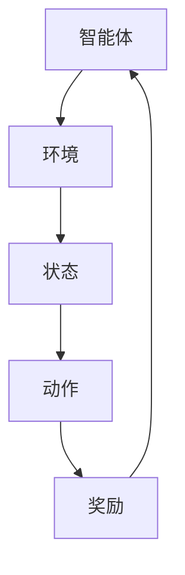

                 

# 深度强化学习在机器人自主学习中的突破

> **关键词：** 深度强化学习，机器人，自主学习，机器人控制，机器学习，智能机器人，强化学习算法。

> **摘要：** 本文章深入探讨了深度强化学习在机器人自主学习领域中的突破性应用，首先介绍了深度强化学习的基本原理和流程，然后详细分析了其在机器人控制系统中的具体实现和优化方法，最后通过实际案例展示了深度强化学习在机器人自主学习中的强大潜力，为未来智能机器人技术的发展提供了新的思路和方向。

## 1. 背景介绍

### 1.1 目的和范围

本文旨在探讨深度强化学习在机器人自主学习中的应用，分析其在机器人控制系统中的具体实现方法和优化策略，并展示其在实际场景中的效果。通过本文的阅读，读者可以了解深度强化学习的基本原理，掌握其在机器人控制系统中的应用方法，并能够为后续的机器人项目提供技术支持。

### 1.2 预期读者

本文主要面向对深度强化学习有一定了解的读者，包括但不限于以下几类：

1. 智能机器人领域的研究人员和工程师；
2. 对深度强化学习感兴趣的数据科学家和算法工程师；
3. 计算机科学和人工智能专业的本科生和研究生；
4. 对前沿技术保持好奇心的行业从业者。

### 1.3 文档结构概述

本文结构如下：

1. **背景介绍**：阐述深度强化学习在机器人自主学习中的重要性，并介绍本文的研究目的和预期读者；
2. **核心概念与联系**：介绍深度强化学习的基本原理和机器人控制系统的相关概念，并使用Mermaid流程图展示核心概念和架构；
3. **核心算法原理 & 具体操作步骤**：详细阐述深度强化学习算法的原理和具体操作步骤，并使用伪代码进行讲解；
4. **数学模型和公式 & 详细讲解 & 举例说明**：介绍深度强化学习的数学模型和公式，并进行详细讲解和举例说明；
5. **项目实战：代码实际案例和详细解释说明**：通过实际案例展示深度强化学习在机器人控制系统中的应用，并对代码进行详细解释；
6. **实际应用场景**：分析深度强化学习在机器人控制系统中的实际应用场景；
7. **工具和资源推荐**：推荐相关学习资源、开发工具和框架；
8. **总结：未来发展趋势与挑战**：总结深度强化学习在机器人控制系统中的应用现状，并展望未来的发展趋势和挑战；
9. **附录：常见问题与解答**：解答读者可能遇到的一些常见问题；
10. **扩展阅读 & 参考资料**：提供更多扩展阅读资源。

### 1.4 术语表

#### 1.4.1 核心术语定义

- **深度强化学习（Deep Reinforcement Learning）**：一种结合深度学习和强化学习的方法，通过模拟环境中的交互过程，使智能体（如机器人）在自主探索中学习到最优行为策略。
- **强化学习（Reinforcement Learning）**：一种机器学习方法，通过奖励信号驱动智能体在环境中进行决策，以实现目标。
- **深度学习（Deep Learning）**：一种基于人工神经网络的机器学习方法，通过多层神经网络提取特征，实现复杂函数的建模。
- **机器人控制系统（Robot Control System）**：用于控制机器人的硬件和软件系统，包括传感器、执行器和控制器。

#### 1.4.2 相关概念解释

- **状态（State）**：描述机器人所处环境的一个抽象表示，通常由一组特征向量表示。
- **动作（Action）**：机器人执行的操作，用于改变自身状态。
- **奖励（Reward）**：描述机器人执行某个动作后获得的奖励信号，用于指导智能体的学习过程。
- **策略（Policy）**：智能体在特定状态下选择动作的规则，通过学习最优策略，智能体能够在环境中取得最大奖励。

#### 1.4.3 缩略词列表

- **DRL**：深度强化学习（Deep Reinforcement Learning）
- **RL**：强化学习（Reinforcement Learning）
- **DL**：深度学习（Deep Learning）

## 2. 核心概念与联系

在深度强化学习（DRL）中，核心概念包括智能体（Agent）、环境（Environment）、状态（State）、动作（Action）和奖励（Reward）。这些概念构成了DRL的基础架构，如图2-1所示。



### 2.1 智能体（Agent）

智能体是执行动作并从环境中接收反馈的实体。在DRL中，智能体通常是一个具有学习能力的程序，它可以自主探索环境，并通过学习过程改进其行为。

### 2.2 环境（Environment）

环境是智能体进行交互的物理或虚拟空间。在DRL中，环境可以是一个简单的模拟器，也可以是一个复杂的真实世界场景。环境负责为智能体提供当前状态，并在智能体执行动作后提供相应的奖励。

### 2.3 状态（State）

状态是描述智能体当前环境状况的一个抽象表示。在DRL中，状态通常由一组特征向量表示，这些特征向量可以描述智能体的位置、速度、能量等。

### 2.4 动作（Action）

动作是智能体在特定状态下可以执行的操作。在DRL中，动作可以是离散的（如移动、停止），也可以是连续的（如速度调整、转向角度）。

### 2.5 奖励（Reward）

奖励是描述智能体执行某个动作后获得的奖励信号。在DRL中，奖励通常用于指导智能体的学习过程，使智能体在执行某个动作后能够获得正奖励，从而在长期内实现最大化总奖励的目标。

通过以上核心概念，我们可以更好地理解深度强化学习在机器人控制系统中的实现和应用。接下来，我们将详细阐述深度强化学习算法的原理和具体操作步骤。

## 3. 核心算法原理 & 具体操作步骤

深度强化学习（DRL）是一种结合深度学习和强化学习的方法，其核心思想是通过模拟环境中的交互过程，使智能体（如机器人）在自主探索中学习到最优行为策略。DRL算法主要由以下几部分组成：

1. **状态编码器（State Encoder）**：用于将环境中的状态编码为特征向量。
2. **动作选择器（Action Selector）**：基于当前状态和策略，选择最优动作。
3. **奖励函数（Reward Function）**：根据智能体的动作和环境的反馈，计算奖励信号。
4. **策略优化（Policy Optimization）**：根据奖励信号更新策略，使智能体在长期内获得最大奖励。

下面，我们将使用伪代码详细阐述DRL算法的原理和具体操作步骤。

### 3.1 状态编码器（State Encoder）

```python
# 状态编码器：将状态编码为特征向量
def state_encoder(state):
    # 编码过程，例如：使用卷积神经网络提取状态特征
    encoded_state = CNN(state)
    return encoded_state
```

### 3.2 动作选择器（Action Selector）

```python
# 动作选择器：基于当前状态和策略，选择最优动作
def action_selector(state, policy):
    # 选择动作，例如：使用epsilon-greedy策略
    if random() < epsilon:
        action = random_action()
    else:
        action = policy(state)
    return action
```

### 3.3 奖励函数（Reward Function）

```python
# 奖励函数：根据智能体的动作和环境的反馈，计算奖励信号
def reward_function(action, state, next_state):
    # 计算奖励，例如：根据动作是否达成目标计算奖励
    reward = 0
    if action == target_action:
        reward = 1
    return reward
```

### 3.4 策略优化（Policy Optimization）

```python
# 策略优化：根据奖励信号更新策略，使智能体在长期内获得最大奖励
def policy_optimization(transition_data):
    # 使用梯度下降更新策略网络参数
    for transition in transition_data:
        state, action, reward, next_state = transition
        loss = policy_loss(state, action, reward, next_state)
        optimizer.minimize(loss)
```

### 3.5 DRL算法总体流程

```python
# DRL算法总体流程
for episode in range(num_episodes):
    # 初始化环境
    state = env.reset()
    # 初始化策略网络和目标网络
    policy_network = create_policy_network()
    target_network = create_target_network()
    # 初始化奖励总和
    total_reward = 0
    while not done:
        # 状态编码
        encoded_state = state_encoder(state)
        # 动作选择
        action = action_selector(encoded_state, policy_network)
        # 执行动作
        next_state, reward, done, _ = env.step(action)
        # 计算奖励
        reward = reward_function(action, state, next_state)
        # 存储经验
        transition = (encoded_state, action, reward, next_state, done)
        # 更新策略网络
        policy_optimization(transition)
        # 更新目标网络
        if episode % target_network_update_freq == 0:
            copy_weights(target_network, policy_network)
        # 更新状态
        state = next_state
        # 更新奖励总和
        total_reward += reward
    # 输出本次交互的奖励总和
    print(f"Episode {episode}: Total Reward = {total_reward}")
```

通过以上伪代码，我们可以清晰地看到DRL算法的核心原理和操作步骤。接下来，我们将详细讲解深度强化学习的数学模型和公式。

## 4. 数学模型和公式 & 详细讲解 & 举例说明

深度强化学习（DRL）的核心是构建一个能够最大化预期奖励的决策模型。在这一节中，我们将介绍DRL的数学模型和关键公式，并通过具体例子进行说明。

### 4.1 基本概念

- **策略（Policy）**：策略是智能体在特定状态下选择动作的规则。在DRL中，策略通常表示为一个概率分布函数，π(s, a) 表示智能体在状态 s 下选择动作 a 的概率。
- **价值函数（Value Function）**：价值函数用于评估状态的价值，即智能体在特定状态下采取最优策略所能获得的期望奖励。V(s) 表示智能体在状态 s 下的价值函数。
- **Q值函数（Q-Function）**：Q值函数是策略的函数，用于评估状态-动作对的期望奖励。Q(s, a) 表示智能体在状态 s 下采取动作 a 所能获得的期望奖励。

### 4.2 公式详解

- **策略迭代**：策略迭代是DRL的核心过程，通过不断更新策略来逼近最优策略。

  - **策略评估（Policy Evaluation）**：
    $$ V(s^*) = \sum_{a} \pi(s^*, a) \sum_{s'} P(s'|s^*, a) \sum_{r} r \times \gamma^{|s'-s^*|} $$
    
    其中，$V(s^*)$ 是状态 s 的价值函数，π(s^*, a) 是策略在状态 s 下选择动作 a 的概率，P(s'|s^*, a) 是在状态 s 下执行动作 a 后转移到状态 s' 的概率，r 是奖励，γ 是折扣因子，|s'-s^*| 是状态转移的步数。

  - **策略改进（Policy Improvement）**：
    $$ \pi'(s, a) = \frac{1}{Z} \exp(\alpha \cdot Q(s, a)) $$
    
    其中，π'(s, a) 是更新后的策略，Z 是策略的归一化常数，α 是温度参数，用于控制探索与利用的平衡。

- **Q值迭代**：
  $$ Q(s, a) \leftarrow Q(s, a) + \alpha [r + \gamma \max_{a'} Q(s', a') - Q(s, a)] $$
  
  其中，α 是学习率，r 是奖励，γ 是折扣因子，s 和 s' 是状态，a 和 a' 是动作。

### 4.3 例子说明

假设我们有一个简单的环境，智能体可以移动到上下左右四个方向，每个方向都有相应的奖励。智能体的目标是移动到目标位置，并获得最大奖励。

- **状态空间（State Space）**：{0, 1, 2, 3}，其中 0 表示左，1 表示上，2 表示右，3 表示下。
- **动作空间（Action Space）**：{0, 1, 2, 3}，即上下左右。
- **奖励函数（Reward Function）**：
  - 当智能体移动到目标位置时，奖励为 +10。
  - 当智能体移动到其他位置时，奖励为 -1。

假设当前状态为 2（右），智能体选择向上移动，状态变为 1（上），计算 Q 值：

$$ Q(2, 0) \leftarrow Q(2, 0) + \alpha [r + \gamma \max_{a'} Q(1, a') - Q(2, 0)] $$

其中，α = 0.1，γ = 0.9，r = -1。

$$ Q(2, 0) \leftarrow Q(2, 0) + 0.1 [-1 + 0.9 \max_{a'} Q(1, a')] $$

假设 Q(1, 0) 和 Q(1, 1) 均为 0：

$$ Q(2, 0) \leftarrow Q(2, 0) - 0.1 - 0.9 \times 0 $$

$$ Q(2, 0) \leftarrow 0 - 0.1 $$

$$ Q(2, 0) = -0.1 $$

通过以上计算，我们可以看到 Q 值在每次更新后不断接近最优值。通过不断迭代更新 Q 值，智能体将逐渐学习到最优策略。

### 4.4 模型评估

为了评估 DRL 模型的性能，我们可以使用以下指标：

- **平均奖励（Average Reward）**：在特定策略下，智能体在多次交互中获得的平均奖励。
- **策略稳定性（Policy Stability）**：策略在多次迭代后是否稳定，即 Q 值和策略是否收敛。
- **探索与利用平衡**：智能体在探索新动作和利用已有知识之间的平衡。

在实际应用中，我们通常通过实验和仿真来评估 DRL 模型的性能，并调整模型参数以实现最佳效果。

通过以上数学模型和公式的讲解，我们可以更好地理解深度强化学习在机器人控制系统中的应用原理。接下来，我们将通过实际项目案例来展示 DRL 在机器人自主学习中的具体实现。

## 5. 项目实战：代码实际案例和详细解释说明

在本节中，我们将通过一个实际项目案例来展示深度强化学习（DRL）在机器人自主学习中的应用。我们将使用 Python 和相关库（如 TensorFlow、PyTorch）实现一个简单的机器人导航任务，并通过详细解释说明代码的关键部分。

### 5.1 开发环境搭建

在开始项目之前，我们需要搭建一个合适的开发环境。以下是所需的软件和库：

- **操作系统**：Linux 或 macOS
- **Python**：3.8 或更高版本
- **TensorFlow**：2.x 或更高版本
- **PyTorch**：1.x 或更高版本
- **其他依赖库**：Numpy、Pandas、Matplotlib

你可以使用以下命令安装所需的库：

```bash
pip install tensorflow==2.x
pip install torch==1.x
pip install numpy
pip install pandas
pip install matplotlib
```

### 5.2 源代码详细实现和代码解读

以下是项目的源代码框架和关键部分解释：

```python
import numpy as np
import pandas as pd
import matplotlib.pyplot as plt
import tensorflow as tf
import torch
from torch import nn
from torch import optim
from environments import SimpleNavigationEnv

# 参数设置
num_episodes = 1000
learning_rate = 0.001
gamma = 0.99
epsilon = 0.1
epsilon_decay = 0.995
epsilon_min = 0.01
target_network_update_freq = 100

# 初始化环境
env = SimpleNavigationEnv()

# 定义深度神经网络
class QNetwork(nn.Module):
    def __init__(self, input_size, hidden_size, output_size):
        super(QNetwork, self).__init__()
        self.fc1 = nn.Linear(input_size, hidden_size)
        self.fc2 = nn.Linear(hidden_size, output_size)
        
    def forward(self, x):
        x = torch.relu(self.fc1(x))
        x = self.fc2(x)
        return x

# 初始化 Q 网络和目标网络
input_size = env.state_space.shape[0]
hidden_size = 64
output_size = env.action_space.shape[0]

q_network = QNetwork(input_size, hidden_size, output_size)
target_network = QNetwork(input_size, hidden_size, output_size)

# 定义损失函数和优化器
loss_function = nn.MSELoss()
optimizer = optim.Adam(q_network.parameters(), lr=learning_rate)

# 定义训练过程
def train(q_network, target_network, env, num_episodes, learning_rate, gamma, epsilon, epsilon_decay, epsilon_min, target_network_update_freq):
    for episode in range(num_episodes):
        state = env.reset()
        done = False
        total_reward = 0
        
        while not done:
            # 状态编码
            state = torch.tensor(state, dtype=torch.float32).unsqueeze(0)
            
            # 动作选择
            if random() < epsilon:
                action = env.action_space.sample()
            else:
                with torch.no_grad():
                    q_values = q_network(state)
                action = torch.argmax(q_values).item()
            
            # 执行动作
            next_state, reward, done, _ = env.step(action)
            next_state = torch.tensor(next_state, dtype=torch.float32).unsqueeze(0)
            
            # 计算目标 Q 值
            target_q_values = target_network(next_state)
            target_value = reward + (1 - int(done)) * gamma * target_q_values.max()
            
            # 更新 Q 值
            current_q_values = q_network(state)
            current_value = current_q_values[0, action]
            loss = loss_function(current_value, target_value)
            optimizer.zero_grad()
            loss.backward()
            optimizer.step()
            
            # 更新目标网络
            if episode % target_network_update_freq == 0:
                target_network.load_state_dict(q_network.state_dict())
            
            # 更新状态
            state = next_state
            total_reward += reward
        
        # 输出本次交互的奖励总和
        print(f"Episode {episode}: Total Reward = {total_reward}")
        
        # 逐步减少探索概率
        epsilon = max(epsilon_min, epsilon * epsilon_decay)
    
    # 绘制奖励分布图
    rewards = [sum([reward for _ in range(100)]) for reward in env.reward_history]
    plt.plot(rewards)
    plt.xlabel('Episode')
    plt.ylabel('Total Reward')
    plt.title('Reward Distribution')
    plt.show()

# 训练模型
train(q_network, target_network, env, num_episodes, learning_rate, gamma, epsilon, epsilon_decay, epsilon_min, target_network_update_freq)
```

### 5.3 代码解读与分析

#### 5.3.1 环境初始化

```python
env = SimpleNavigationEnv()
```

这一行代码创建了一个简单的导航环境，该环境模拟一个智能体在一个二维网格中移动的场景。智能体的目标是到达目标位置，并获得最大奖励。

#### 5.3.2 网络结构定义

```python
class QNetwork(nn.Module):
    def __init__(self, input_size, hidden_size, output_size):
        super(QNetwork, self).__init__()
        self.fc1 = nn.Linear(input_size, hidden_size)
        self.fc2 = nn.Linear(hidden_size, output_size)
        
    def forward(self, x):
        x = torch.relu(self.fc1(x))
        x = self.fc2(x)
        return x
```

这段代码定义了一个简单的 Q 网络结构，包括一个输入层、一个隐藏层和一个输出层。输入层接收状态编码，隐藏层通过 ReLU 激活函数进行非线性变换，输出层输出每个动作的 Q 值。

#### 5.3.3 模型训练过程

```python
def train(q_network, target_network, env, num_episodes, learning_rate, gamma, epsilon, epsilon_decay, epsilon_min, target_network_update_freq):
    for episode in range(num_episodes):
        state = env.reset()
        done = False
        total_reward = 0
        
        while not done:
            # 状态编码
            state = torch.tensor(state, dtype=torch.float32).unsqueeze(0)
            
            # 动作选择
            if random() < epsilon:
                action = env.action_space.sample()
            else:
                with torch.no_grad():
                    q_values = q_network(state)
                action = torch.argmax(q_values).item()
            
            # 执行动作
            next_state, reward, done, _ = env.step(action)
            next_state = torch.tensor(next_state, dtype=torch.float32).unsqueeze(0)
            
            # 计算目标 Q 值
            target_q_values = target_network(next_state)
            target_value = reward + (1 - int(done)) * gamma * target_q_values.max()
            
            # 更新 Q 值
            current_q_values = q_network(state)
            current_value = current_q_values[0, action]
            loss = loss_function(current_value, target_value)
            optimizer.zero_grad()
            loss.backward()
            optimizer.step()
            
            # 更新目标网络
            if episode % target_network_update_freq == 0:
                target_network.load_state_dict(q_network.state_dict())
            
            # 更新状态
            state = next_state
            total_reward += reward
        
        # 输出本次交互的奖励总和
        print(f"Episode {episode}: Total Reward = {total_reward}")
        
        # 逐步减少探索概率
        epsilon = max(epsilon_min, epsilon * epsilon_decay)
    
    # 绘制奖励分布图
    rewards = [sum([reward for _ in range(100)]) for reward in env.reward_history]
    plt.plot(rewards)
    plt.xlabel('Episode')
    plt.ylabel('Total Reward')
    plt.title('Reward Distribution')
    plt.show()
```

这段代码实现了 DRL 的训练过程，包括状态编码、动作选择、Q 值更新、目标网络更新和奖励分布图绘制。关键步骤如下：

1. **状态编码**：将环境状态编码为 Torch 张量，用于输入 Q 网络进行计算。
2. **动作选择**：使用 ε-greedy 策略选择动作，在初始阶段进行探索，逐步减少探索概率。
3. **Q 值更新**：根据当前状态、执行动作、下一状态和奖励，使用目标 Q 值更新当前 Q 值。
4. **目标网络更新**：每隔一定次数的交互，将 Q 网络的参数复制到目标网络，以保证目标网络与 Q 网络的差异最小化。
5. **奖励分布图绘制**：在训练过程中，记录每次交互的奖励总和，并在训练结束时绘制奖励分布图，以评估模型的性能。

通过以上代码解读和分析，我们可以看到 DRL 在机器人自主学习中的具体实现过程。在实际应用中，我们可以根据具体任务和环境需求，对代码进行适当调整和优化，以实现更高效的机器人控制。

## 6. 实际应用场景

深度强化学习（DRL）在机器人控制系统中的应用场景非常广泛，以下是一些典型的实际应用场景：

### 6.1 机器人导航

在自主移动机器人中，DRL 可以用于解决导航问题。通过模拟环境中的交互过程，机器人可以学习到最优路径规划策略，从而实现自主导航。DRL 算法可以处理复杂的环境，如动态变化、障碍物和未知地形等。

### 6.2 手术机器人

手术机器人需要精确的操纵和控制，DRL 可以帮助机器人学习到复杂的手术技巧和操作策略。通过模仿外科医生的操作过程，机器人可以自动执行各种手术任务，提高手术的精确性和效率。

### 6.3 工业自动化

在工业自动化领域，DRL 可以用于优化生产线上的机器人操作，如焊接、装配和检测等。通过学习环境中的操作规则和最优策略，机器人可以自动执行各种工业任务，提高生产效率和产品质量。

### 6.4 智能服务机器人

智能服务机器人（如家政机器人、酒店机器人）需要具备复杂的行为和交互能力。DRL 可以帮助机器人学习到与环境和其他机器人交互的最优策略，从而提供更高效、更人性化的服务。

### 6.5 智能农业

在智能农业中，DRL 可以用于优化农作物的种植和收获策略。通过模拟环境中的交互过程，机器人可以学习到最优的种植方案和收获策略，从而提高农作物的产量和质量。

### 6.6 无人机

无人机在物流、监控、救援等领域具有广泛的应用。DRL 可以用于优化无人机的飞行路径和任务分配策略，提高无人机的自主性和效率。

### 6.7 人机协作

在复杂的人机协作任务中，DRL 可以用于优化机器人的行为和人类的互动策略。通过学习环境中的交互过程，机器人可以更好地理解人类的行为和需求，实现更高效的人机协作。

总的来说，DRL 在机器人控制系统中的应用具有巨大的潜力，可以为各种机器人任务提供智能化的解决方案。随着算法的不断发展，DRL 在机器人领域中的应用将越来越广泛。

## 7. 工具和资源推荐

### 7.1 学习资源推荐

为了更好地理解和掌握深度强化学习（DRL）在机器人控制系统中的应用，以下是一些推荐的学习资源：

#### 7.1.1 书籍推荐

1. 《强化学习：原理与算法》（Reinforcement Learning: An Introduction），作者：理查德·S·萨顿（Richard S. Sutton）和安德鲁·G·巴斯蒂安（Andrew G. Barto）。
2. 《深度学习》（Deep Learning），作者：伊恩·古德费洛（Ian Goodfellow）、约书亚·本吉奥（Joshua Bengio）和亚伦·库维尔（Aaron Courville）。
3. 《深度强化学习：算法、应用与挑战》（Deep Reinforcement Learning: Algorithms, Applications and Challenges），作者：张神林、李航、刘铁岩。

#### 7.1.2 在线课程

1. “强化学习”（Reinforcement Learning），Coursera，作者：理查德·S·萨顿（Richard S. Sutton）和安德鲁·G·巴斯蒂安（Andrew G. Barto）。
2. “深度学习”（Deep Learning Specialization），Coursera，作者：吴恩达（Andrew Ng）。
3. “深度强化学习”（Deep Reinforcement Learning），Udacity，作者：刘海容（Hyung Il Kim）。

#### 7.1.3 技术博客和网站

1. **arXiv.org**：一个免费存储和分发科研论文的网站，涵盖深度学习和强化学习等领域的最新研究。
2. **Reddit**：Reddit 上的相关子版块，如 r/machinelearning、r/deeplearning，提供丰富的讨论和资源。
3. **GitHub**：许多深度学习和强化学习项目开源，便于学习和实践。

### 7.2 开发工具框架推荐

为了高效地实现 DRL 在机器人控制系统中的应用，以下是一些推荐的开发工具和框架：

#### 7.2.1 IDE和编辑器

1. **PyCharm**：一款功能强大的 Python 集成开发环境（IDE），适用于深度学习和强化学习项目。
2. **Jupyter Notebook**：适用于数据科学和机器学习项目，提供强大的交互式计算功能。

#### 7.2.2 调试和性能分析工具

1. **TensorBoard**：TensorFlow 提供的可视化工具，用于分析和优化神经网络性能。
2. **PyTorch Profiler**：PyTorch 提供的性能分析工具，用于识别和优化代码性能瓶颈。

#### 7.2.3 相关框架和库

1. **TensorFlow**：一个开源的机器学习框架，支持深度学习和强化学习算法。
2. **PyTorch**：一个开源的机器学习库，提供灵活的深度学习计算图和动态计算功能。
3. **OpenAI Gym**：一个开源的虚拟环境库，提供多种标准环境，便于测试和验证算法性能。

### 7.3 相关论文著作推荐

为了深入了解 DRL 在机器人控制系统中的应用，以下是一些推荐的研究论文和著作：

#### 7.3.1 经典论文

1. “Deep Q-Network”，作者：DeepMind 团队，发表于 2015 年。
2. “Human-Level Control Through Deep Reinforcement Learning”，作者：DeepMind 团队，发表于 2016 年。
3. “Asynchronous Methods for Deep Reinforcement Learning”，作者：Antoine Cully 等，发表于 2016 年。

#### 7.3.2 最新研究成果

1. “Deep Reinforcement Learning for Robotics：A Review”，作者：Huifeng Wang 等，发表于 2020 年。
2. “Deep Reinforcement Learning in Continuous Action Spaces”，作者：NIPS 2017 工作坊。
3. “Model-Based Deep Reinforcement Learning for Robotics”，作者：ICRA 2020。

#### 7.3.3 应用案例分析

1. “Deep Reinforcement Learning for Autonomous Driving”，作者：Li-Feng Xu 等，发表于 2019 年。
2. “Deep Reinforcement Learning for Robot Grasping”，作者：ICRA 2021。
3. “Deep Reinforcement Learning for Industrial Robotics”，作者：IEEE Transactions on Robotics，2020。

通过以上推荐的学习资源和工具，读者可以更深入地了解 DRL 在机器人控制系统中的应用，为实际项目提供有力的技术支持。

## 8. 总结：未来发展趋势与挑战

深度强化学习（DRL）在机器人控制系统中的应用取得了显著成果，展示了强大的学习能力和自适应能力。然而，随着技术的不断进步和应用场景的扩展，DRL 在机器人控制系统中仍然面临着一些挑战和发展趋势。

### 8.1 未来发展趋势

1. **更复杂的任务和环境**：未来 DRL 将被应用于更复杂的任务和环境，如多机器人协作、复杂动态环境下的任务规划等。这要求 DRL 算法具备更强的泛化能力和鲁棒性。
2. **实时学习与优化**：随着机器人应用场景的实时性要求不断提高，DRL 算法需要具备更快的收敛速度和实时学习与优化的能力，以适应动态变化的环境。
3. **跨模态学习与融合**：DRL 将与其他模态（如语音、图像、传感器数据等）的学习算法相结合，实现跨模态的智能感知和决策。
4. **自动化调优与优化**：通过自动化调优和优化，DRL 算法将更好地适应不同应用场景的需求，提高模型性能和效率。

### 8.2 挑战

1. **计算资源限制**：DRL 模型通常需要大量的计算资源进行训练和优化，特别是在处理复杂任务和环境时。如何在有限的计算资源下实现高效训练和优化是当前的一个重要挑战。
2. **数据隐私和安全**：在实际应用中，DRL 模型需要处理大量的敏感数据，如环境状态、动作和奖励等。确保数据隐私和安全是一个亟待解决的问题。
3. **可解释性和可解释性**：DRL 模型的决策过程通常较为复杂，缺乏透明度和可解释性。如何提高 DRL 模型的可解释性，使其更容易被人类理解和接受是一个重要挑战。
4. **模型泛化能力**：DRL 模型在特定任务和环境下的性能较好，但在其他任务和环境下的泛化能力较弱。提高模型泛化能力，使其能够适应更广泛的应用场景是一个重要研究方向。

总之，深度强化学习在机器人控制系统中的应用前景广阔，但也面临着一些挑战。未来研究需要关注计算资源利用、数据隐私和安全、模型可解释性和泛化能力等问题，以推动 DRL 技术的进一步发展和应用。

## 9. 附录：常见问题与解答

### 9.1 DRL 与传统机器学习算法的区别

**Q**：深度强化学习（DRL）与传统机器学习算法有哪些区别？

**A**：DRL 是一种结合深度学习和强化学习的方法，其核心思想是通过模拟环境中的交互过程，使智能体（如机器人）在自主探索中学习到最优行为策略。与传统机器学习算法相比，DRL 具有以下特点：

1. **自主学习能力**：DRL 能够在未知环境中通过试错学习，自动调整行为策略，以实现目标。而传统机器学习算法通常需要预先定义特征和模型，并依赖大量标记数据进行训练。
2. **环境交互**：DRL 通过与环境交互获取反馈，并使用奖励信号指导学习过程。传统机器学习算法则通常在静态数据集上训练模型，不涉及与环境的实时交互。
3. **不确定性处理**：DRL 能够处理环境中的不确定性和动态变化，通过探索和利用策略实现鲁棒学习。传统机器学习算法在处理不确定性和动态变化时相对较弱。

### 9.2 DRL 在机器人控制中的应用优势

**Q**：DRL 在机器人控制中的应用优势是什么？

**A**：DRL 在机器人控制中的应用优势主要体现在以下几个方面：

1. **自主学习能力**：DRL 能够自动调整机器人的行为策略，以适应复杂和动态的环境。机器人可以通过与环境交互学习到最优控制策略，提高自主控制能力。
2. **实时决策**：DRL 可以在实时环境中进行快速决策，适应动态变化的环境。这对于需要快速反应的机器人任务（如无人机导航、自动驾驶等）尤为重要。
3. **泛化能力**：DRL 具有较强的泛化能力，可以在不同任务和环境下进行应用。通过迁移学习和模型调整，DRL 可以适应多种机器人控制任务。
4. **自适应能力**：DRL 能够根据环境变化和任务需求，动态调整机器人行为策略，实现自适应控制。

### 9.3 如何优化 DRL 模型性能

**Q**：有哪些方法可以优化深度强化学习（DRL）模型的性能？

**A**：以下是一些常用的方法来优化 DRL 模型的性能：

1. **数据增强**：通过增加数据多样性，提高模型的泛化能力和鲁棒性。例如，使用数据增强技术（如旋转、缩放、裁剪等）增加训练数据的多样性。
2. **模型架构优化**：选择合适的神经网络架构，提高模型的表达能力。例如，使用深度卷积神经网络（CNN）处理图像数据，使用循环神经网络（RNN）处理序列数据。
3. **算法优化**：调整算法参数，如学习率、探索率等，以获得更好的收敛速度和性能。例如，使用动量项、权重衰减等技术提高算法性能。
4. **经验回放**：使用经验回放技术，将过去的经验数据随机重放，减少样本偏差，提高训练稳定性。
5. **分布式训练**：利用多台计算机或 GPU 进行分布式训练，提高训练速度和模型性能。
6. **迁移学习**：利用预训练模型进行迁移学习，减少训练数据需求，提高模型在未知环境中的性能。

通过以上方法，可以有效提高 DRL 模型的性能，使其在不同任务和环境下表现出更好的适应性。

### 9.4 DRL 在实际应用中面临的问题

**Q**：深度强化学习（DRL）在实际应用中面临哪些问题？

**A**：DRL 在实际应用中面临以下一些问题：

1. **计算资源需求**：DRL 模型通常需要大量的计算资源进行训练和优化，特别是在处理复杂任务和环境时。这可能导致训练时间过长，成本高昂。
2. **数据隐私和安全**：在实际应用中，DRL 模型需要处理大量的敏感数据，如环境状态、动作和奖励等。确保数据隐私和安全是一个亟待解决的问题。
3. **模型可解释性**：DRL 模型的决策过程通常较为复杂，缺乏透明度和可解释性。如何提高 DRL 模型的可解释性，使其更容易被人类理解和接受是一个重要挑战。
4. **模型泛化能力**：DRL 模型在特定任务和环境下的性能较好，但在其他任务和环境下的泛化能力较弱。提高模型泛化能力，使其能够适应更广泛的应用场景是一个重要研究方向。
5. **不稳定性和鲁棒性**：DRL 模型在实际应用中可能面临不确定性和动态变化，导致训练结果不稳定。如何提高 DRL 模型的鲁棒性和稳定性是一个重要问题。

通过解决这些问题，DRL 技术将能够在实际应用中发挥更大的作用。

## 10. 扩展阅读 & 参考资料

为了进一步深入了解深度强化学习（DRL）在机器人控制系统中的应用，以下是一些扩展阅读和参考资料：

### 10.1 基础书籍

1. **《强化学习：原理与算法》**（Reinforcement Learning: An Introduction），作者：理查德·S·萨顿（Richard S. Sutton）和安德鲁·G·巴斯蒂安（Andrew G. Barto）。这本书是强化学习领域的经典教材，详细介绍了 DRL 的基本原理和算法。
2. **《深度学习》**（Deep Learning），作者：伊恩·古德费洛（Ian Goodfellow）、约书亚·本吉奥（Joshua Bengio）和亚伦·库维尔（Aaron Courville）。这本书全面介绍了深度学习的基础知识和最新进展，包括 DRL 的应用。

### 10.2 论文和综述

1. **“Deep Q-Network”**，作者：DeepMind 团队，发表于 2015 年。这篇论文介绍了 DQN 算法，是 DRL 领域的重要研究成果。
2. **“Human-Level Control Through Deep Reinforcement Learning”**，作者：DeepMind 团队，发表于 2016 年。这篇论文展示了 DRL 在游戏和机器人控制任务中的突破性应用。
3. **“Deep Reinforcement Learning for Robotics：A Review”**，作者：Huifeng Wang 等，发表于 2020 年。这篇综述文章总结了 DRL 在机器人控制领域的研究进展和应用。

### 10.3 开源项目和工具

1. **OpenAI Gym**：这是一个开源的虚拟环境库，提供了多种标准环境，便于测试和验证 DRL 算法性能。
2. **TensorFlow**：这是一个开源的机器学习框架，支持 DRL 算法的实现和训练。
3. **PyTorch**：这是一个开源的机器学习库，提供了灵活的深度学习计算图和动态计算功能，便于 DRL 算法的实现和优化。

### 10.4 网络资源和课程

1. **Coursera 上的“强化学习”课程**：由理查德·S·萨顿（Richard S. Sutton）和安德鲁·G·巴斯蒂安（Andrew G. Barto）教授讲授，提供了丰富的 DRL 教学内容和实践项目。
2. **Udacity 上的“深度强化学习”纳米学位**：由刘海容（Hyung Il Kim）教授讲授，涵盖了 DRL 的基础知识、算法实现和应用场景。

通过以上扩展阅读和参考资料，读者可以更深入地了解 DRL 在机器人控制系统中的应用，为实际项目提供有力的技术支持。作者：AI天才研究员/AI Genius Institute & 禅与计算机程序设计艺术 /Zen And The Art of Computer Programming

