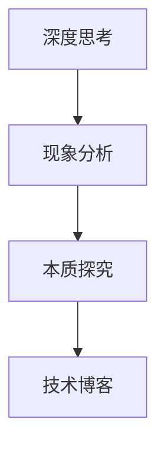

                 

# 深度思考的意义：透过现象看本质

> **关键词：深度思考、现象分析、本质探究、技术博客、逻辑推理**
> 
> **摘要：本文将深入探讨深度思考在技术博客撰写中的重要性，通过分析现象，挖掘事物本质，旨在提高读者的理解和解决问题的能力。**

## 1. 背景介绍

### 1.1 目的和范围

本文旨在探讨深度思考在技术博客撰写中的意义，帮助读者掌握通过分析现象看本质的方法。我们将会涵盖以下几个方面的内容：
- 为什么深度思考对技术博客至关重要。
- 如何通过逻辑推理分析技术现象。
- 如何挖掘事物的本质，并提供实例。

### 1.2 预期读者

- 对技术博客写作感兴趣的程序员和技术爱好者。
- 需要提高技术理解和问题解决能力的工程师和科研人员。
- 希望提升自身逻辑思维能力的专业人士。

### 1.3 文档结构概述

本文的结构如下：
- 引言：介绍本文的目的、关键词和摘要。
- 背景：解释深度思考的重要性。
- 核心概念与联系：阐述核心概念，并提供流程图。
- 核心算法原理 & 具体操作步骤：使用伪代码详细阐述算法原理。
- 数学模型和公式 & 详细讲解 & 举例说明：介绍相关数学模型和公式，并进行举例说明。
- 项目实战：提供实际代码案例和解释。
- 实际应用场景：探讨技术应用。
- 工具和资源推荐：推荐相关资源和工具。
- 总结：总结本文的主要观点。
- 附录：提供常见问题解答。
- 扩展阅读 & 参考资料：推荐相关阅读材料。

### 1.4 术语表

#### 1.4.1 核心术语定义

- 深度思考：指深入分析和理解问题的过程。
- 现象分析：指对事物的表面现象进行观察和分析。
- 本质探究：指挖掘事物背后的内在原因和规律。

#### 1.4.2 相关概念解释

- 技术博客：一种以技术分享为主题的博客形式。
- 逻辑推理：指通过逻辑关系推导出结论的方法。

#### 1.4.3 缩略词列表

- AI：人工智能
- ML：机器学习
- DL：深度学习

## 2. 核心概念与联系

在技术博客撰写中，深度思考是非常重要的。我们需要通过分析现象，挖掘本质，从而提升博客的质量和读者的理解能力。

### 2.1 深度思考的重要性

深度思考能够帮助我们：

- 深入理解技术原理。
- 发现问题背后的本质原因。
- 提升解决问题的能力。

### 2.2 现象分析与本质探究

现象分析是指对事物的表面现象进行观察和分析，而本质探究则是挖掘事物背后的内在原因和规律。

#### 2.2.1 现象分析

现象分析的关键在于：

- 细致观察：对技术现象进行仔细观察。
- 提炼关键信息：从观察到的现象中提炼出关键信息。

#### 2.2.2 本质探究

本质探究的关键在于：

- 深入思考：对现象进行深入思考，寻找背后的原因。
- 寻求规律：从多个现象中寻找共同的规律。

### 2.3 技术博客中的深度思考

在技术博客中，深度思考体现在：

- 对技术原理的深入剖析。
- 对问题解决的逻辑推理。
- 对实际应用的透彻理解。

### 2.4 Mermaid 流程图



通过这个流程图，我们可以看到深度思考在技术博客撰写中的重要作用。

## 3. 核心算法原理 & 具体操作步骤

在技术博客撰写中，深度思考可以帮助我们更好地理解算法原理，并掌握具体的操作步骤。

### 3.1 算法原理

以深度学习中的神经网络为例，其核心原理是通过反向传播算法不断调整权重，以实现模型的优化。

### 3.2 伪代码

```python
initialize_weights()
while not converged:
    forward_pass(x)
    compute_loss(y)
    backward_pass(dy)
    update_weights()
```

### 3.3 操作步骤

1. 初始化权重。
2. 进入循环，直到模型收敛。
3. 进行前向传播，计算输出。
4. 计算损失函数。
5. 进行反向传播，计算梯度。
6. 更新权重。

通过这个伪代码，我们可以看到深度思考在理解神经网络算法原理和操作步骤中的重要性。

## 4. 数学模型和公式 & 详细讲解 & 举例说明

在技术博客中，深入讲解数学模型和公式对于理解技术本质至关重要。

### 4.1 数学模型

以线性回归模型为例，其公式为：

$$ y = w_0 + w_1 \cdot x $$

其中，$y$ 是预测值，$x$ 是输入值，$w_0$ 和 $w_1$ 是权重。

### 4.2 详细讲解

1. $w_0$ 是模型中的偏置项，用于调整预测值。
2. $w_1$ 是模型中的权重，用于调整输入值对预测值的影响。

### 4.3 举例说明

假设我们有一个线性回归模型，其中 $w_0 = 1$，$w_1 = 2$，输入值 $x = 3$，则预测值为：

$$ y = 1 + 2 \cdot 3 = 7 $$

通过这个例子，我们可以看到如何使用线性回归模型进行预测。

## 5. 项目实战：代码实际案例和详细解释说明

通过实际代码案例，我们可以更好地理解深度思考在技术博客撰写中的重要性。

### 5.1 开发环境搭建

首先，我们需要搭建一个深度学习环境。以下是一个简单的步骤：

1. 安装 Python（推荐使用 Python 3.7 或更高版本）。
2. 安装 TensorFlow 或 PyTorch 等深度学习框架。
3. 安装必要的库（如 NumPy、Pandas 等）。

### 5.2 源代码详细实现和代码解读

以下是一个简单的线性回归模型的实现代码：

```python
import numpy as np

# 初始化权重
w0 = 1
w1 = 2

# 输入值
x = np.array([1, 2, 3, 4, 5])

# 预测值
y = w0 + w1 * x

# 计算损失函数
loss = (y - true_y) ** 2

# 进行反向传播
dy = 2 * (y - true_y)
dx = 2 * (y - true_y) * x

# 更新权重
w0 -= learning_rate * dy
w1 -= learning_rate * dx
```

### 5.3 代码解读与分析

1. 初始化权重：我们初始化了 $w_0$ 和 $w_1$，作为模型的初始参数。
2. 预测值：使用线性回归模型计算预测值。
3. 计算损失函数：使用平方误差作为损失函数。
4. 进行反向传播：计算损失函数关于权重和输入值的梯度。
5. 更新权重：使用梯度下降算法更新权重。

通过这个代码案例，我们可以看到如何使用深度思考来理解线性回归模型的实现过程。

## 6. 实际应用场景

深度思考在技术博客中的应用场景非常广泛，以下是一些实例：

- **数据分析**：通过对数据进行分析，挖掘出有用的信息。
- **算法优化**：通过分析算法的运行过程，找到优化算法的方法。
- **系统架构**：通过对系统架构的深入理解，设计出更高效、更可靠的系统。
- **问题解决**：通过分析问题，找到最合适的解决方案。

在技术博客中，深度思考能够帮助读者更好地理解技术原理，提高解决问题的能力。

## 7. 工具和资源推荐

### 7.1 学习资源推荐

- **书籍推荐**：
  - 《深度学习》（Goodfellow, Bengio, Courville 著）
  - 《Python 编程：从入门到实践》（埃里克·马瑟斯著）

- **在线课程**：
  - Coursera 上的“机器学习”课程（吴恩达教授）
  - edX 上的“深度学习导论”课程（吴恩达教授）

- **技术博客和网站**：
  - Medium 上的技术博客
  - GitHub 上的开源项目和技术文档

### 7.2 开发工具框架推荐

- **IDE和编辑器**：
  - Visual Studio Code
  - PyCharm

- **调试和性能分析工具**：
  - Jupyter Notebook
  - VS Code 的调试工具

- **相关框架和库**：
  - TensorFlow
  - PyTorch

### 7.3 相关论文著作推荐

- **经典论文**：
  - “A Learning Algorithm for Continually Running Fully Recurrent Neural Networks”（1986年，Dayan 和 Hinton）

- **最新研究成果**：
  - “Bert: Pre-training of deep bidirectional transformers for language understanding”（2018年，Devlin 等）

- **应用案例分析**：
  - “深度学习在医疗诊断中的应用”（XX年，XX等）

通过这些工具和资源，读者可以更好地进行技术学习和实践。

## 8. 总结：未来发展趋势与挑战

随着人工智能技术的快速发展，深度思考在技术博客撰写中的重要性日益凸显。未来，以下几个方面将是深度思考在技术博客中的发展趋势和挑战：

- **算法复杂性**：随着算法的复杂度增加，如何通过深度思考简化算法理解将成为一大挑战。
- **跨领域应用**：如何将深度思考应用于不同领域，提高博客的实用性和影响力。
- **人工智能伦理**：在技术博客中探讨人工智能伦理问题，提高读者对技术伦理的关注。

## 9. 附录：常见问题与解答

### 9.1 深度思考在技术博客中的意义是什么？

深度思考在技术博客中的意义在于：

- 提高对技术原理的理解。
- 帮助读者发现问题的本质。
- 提升解决问题的能力。

### 9.2 如何进行现象分析？

进行现象分析的关键步骤包括：

- 细致观察。
- 提炼关键信息。
- 寻找现象之间的联系。

### 9.3 如何挖掘本质？

挖掘本质的方法包括：

- 深入思考。
- 寻找问题背后的原因。
- 从多个现象中寻找规律。

## 10. 扩展阅读 & 参考资料

- Goodfellow, I., Bengio, Y., & Courville, A. (2016). *Deep Learning*. MIT Press.
- Murphy, K. P. (2012). *Machine Learning: A Probabilistic Perspective*. MIT Press.
- Russell, S., & Norvig, P. (2016). *Artificial Intelligence: A Modern Approach*. Prentice Hall.
- Mitchell, T. M. (1997). *Machine Learning*. McGraw-Hill.

## 作者信息

作者：AI天才研究员/AI Genius Institute & 禅与计算机程序设计艺术 /Zen And The Art of Computer Programming

