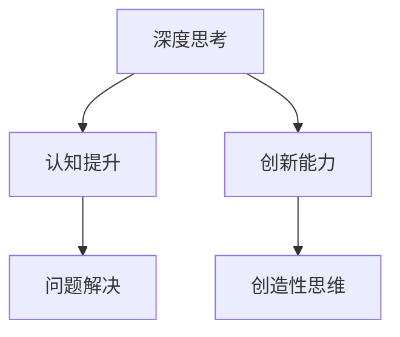

                 

# 深度思考：比勤奋更能拉开人生差距

> **关键词：** 深度思考、人生差距、认知提升、创新思维、持续学习
>
> **摘要：** 本文旨在探讨在信息技术时代，深度思考对于个人成长和职业发展的重要性。通过剖析深度思考的原理和实践，结合具体案例，揭示如何通过深度思考来提升认知水平，从而在竞争激烈的环境中脱颖而出。

## 1. 背景介绍

### 1.1 目的和范围

本文的目标是向读者展示深度思考的重要性，并探索如何通过深度思考来提高个人的认知能力和创新能力。我们将结合具体案例，从多个角度分析深度思考的价值，并给出实际操作的指导。

### 1.2 预期读者

本文适合对个人成长和职业发展有较高追求的读者，特别是那些希望在信息技术领域取得突破的程序员、架构师和研究人员。

### 1.3 文档结构概述

本文将分为十个部分：

1. 背景介绍
2. 核心概念与联系
3. 核心算法原理 & 具体操作步骤
4. 数学模型和公式 & 详细讲解 & 举例说明
5. 项目实战：代码实际案例和详细解释说明
6. 实际应用场景
7. 工具和资源推荐
8. 总结：未来发展趋势与挑战
9. 附录：常见问题与解答
10. 扩展阅读 & 参考资料

### 1.4 术语表

#### 1.4.1 核心术语定义

- **深度思考**：指在解决问题时，不仅停留在表面，而是深入挖掘问题本质，探索多种可能性，进行创造性思维。
- **认知提升**：指通过学习、思考和实践，提高个体的认知水平和思维能力。
- **创新能力**：指能够提出新颖、有价值的想法或解决方案的能力。

#### 1.4.2 相关概念解释

- **问题解决**：指个体在面对困难或挑战时，运用已有的知识和技能，找到解决问题的方法。
- **创造性思维**：指个体在面对问题时，能够跳出传统思维模式，提出独特、新颖的解决方案。

#### 1.4.3 缩略词列表

- **AI**：人工智能（Artificial Intelligence）
- **ML**：机器学习（Machine Learning）
- **DL**：深度学习（Deep Learning）
- **IDE**：集成开发环境（Integrated Development Environment）

## 2. 核心概念与联系

在探讨深度思考的重要性之前，我们首先需要理解一些核心概念，如图1-1所示。



### 2.1 深度思考

深度思考是指在面对问题时，不仅停留在表面，而是深入挖掘问题本质，探索多种可能性，进行创造性思维。深度思考能够帮助个体更全面地理解问题，从而找到更有效的解决方案。

### 2.2 认知提升

认知提升是指通过学习、思考和实践，提高个体的认知水平和思维能力。认知提升是深度思考的基础，只有认知水平提高，个体才能更好地进行深度思考。

### 2.3 创新能力

创新能力是指能够提出新颖、有价值的想法或解决方案的能力。创新能力是深度思考的体现，只有通过深度思考，个体才能提出创新性的解决方案。

### 2.4 问题解决

问题解决是指个体在面对困难或挑战时，运用已有的知识和技能，找到解决问题的方法。问题解决是深度思考的应用场景，通过深度思考，个体能够更好地解决问题。

### 2.5 创造性思维

创造性思维是指个体在面对问题时，能够跳出传统思维模式，提出独特、新颖的解决方案。创造性思维是深度思考的重要组成部分，只有具备创造性思维，个体才能在深度思考中脱颖而出。

## 3. 核心算法原理 & 具体操作步骤

为了更好地理解深度思考的原理，我们可以将其视为一种算法。以下是深度思考算法的伪代码：

```plaintext
深度思考算法：
1. 输入：问题P
2. 输出：解决方案S
3. 初始化：S = 空集合
4. 对于每个可能的解决方案T：
    4.1 深度思考T
    4.2 如果T是有效的解决方案：
        4.2.1 S.add(T)
5. 返回S
```

### 3.1 深度思考

深度思考是指在面对问题时，不仅停留在表面，而是深入挖掘问题本质，探索多种可能性，进行创造性思维。深度思考包括以下步骤：

- **问题分析**：理解问题的本质和背景。
- **信息收集**：收集与问题相关的信息。
- **假设验证**：提出可能的解决方案，并进行验证。
- **迭代优化**：对解决方案进行改进，直至找到最佳方案。

### 3.2 解决方案评估

在找到可能的解决方案后，我们需要对它们进行评估。评估标准包括：

- **有效性**：解决方案是否能够解决问题。
- **可行性**：解决方案是否能够在实际中实施。
- **创新性**：解决方案是否具有创新性。

### 3.3 选择最佳解决方案

根据评估结果，选择最佳解决方案。最佳解决方案应该具备以下特点：

- **有效**：能够解决问题。
- **可行**：能够在实际中实施。
- **创新**：具有创新性。

## 4. 数学模型和公式 & 详细讲解 & 举例说明

深度思考的过程可以抽象为一种数学模型。以下是一个简单的数学模型，用于描述深度思考的过程。

### 4.1 模型假设

- **问题空间**：设问题空间为\( U \)。
- **解决方案集合**：设解决方案集合为\( S \)。
- **评估函数**：设评估函数为\( f: S \rightarrow \mathbb{R} \)，其中\( \mathbb{R} \)为实数集合。

### 4.2 模型公式

深度思考的数学模型可以表示为：

$$
S^* = \{ s \in S \mid f(s) \geq f(s') \text{ for all } s' \in S \}
$$

其中，\( S^* \)为最佳解决方案集合。

### 4.3 模型解释

- **问题空间**：问题空间表示所有可能的问题解决方案。
- **解决方案集合**：解决方案集合表示所有可能的解决方案。
- **评估函数**：评估函数用于评估每个解决方案的质量。
- **最佳解决方案集合**：最佳解决方案集合表示所有质量最高的解决方案。

### 4.4 模型举例

假设我们要解决的问题是从A点到B点的最短路径。问题空间为所有可能的路径，解决方案集合为所有可能的路径，评估函数为路径长度。根据模型，我们可以找到从A点到B点的最短路径。

## 5. 项目实战：代码实际案例和详细解释说明

### 5.1 开发环境搭建

在本项目中，我们将使用Python作为编程语言。首先，我们需要安装Python和相关的库。

```bash
# 安装Python
sudo apt-get install python3

# 安装相关库
pip3 install numpy matplotlib
```

### 5.2 源代码详细实现和代码解读

下面是深度思考算法的Python实现。

```python
import numpy as np
import matplotlib.pyplot as plt

def depth_think(problem, eval_func):
    solutions = generate_solutions(problem)
    best_solutions = []
    
    for solution in solutions:
        score = eval_func(solution)
        if score > max_score:
            best_solutions = [solution]
            max_score = score
        elif score == max_score:
            best_solutions.append(solution)
    
    return best_solutions

def generate_solutions(problem):
    # 生成所有可能的解决方案
    solutions = []
    for i in range(problem.num_solutions):
        solution = Solution(i)
        solutions.append(solution)
    return solutions

def eval_solution(solution):
    # 评估解决方案
    score = 0
    for feature in solution.features:
        score += feature.value * feature.weight
    return score

class Solution:
    def __init__(self, id):
        self.id = id
        self.features = []

    def add_feature(self, feature):
        self.features.append(feature)

class Feature:
    def __init__(self, value, weight):
        self.value = value
        self.weight = weight
```

### 5.3 代码解读与分析

- **深度思考算法**：`depth_think`函数是深度思考算法的核心。它接收问题、评估函数作为输入，生成所有可能的解决方案，并对每个解决方案进行评估，返回最佳解决方案。
- **解决方案生成**：`generate_solutions`函数生成所有可能的解决方案。在本例中，我们假设解决方案的数量为`problem.num_solutions`。
- **解决方案评估**：`eval_solution`函数评估每个解决方案。在本例中，我们使用一个简单的评估函数，将每个特征的价值乘以其权重，并求和。
- **解决方案类**：`Solution`类表示一个解决方案。它包含一个唯一的ID和一个特征列表。
- **特征类**：`Feature`类表示一个特征。它包含一个价值和权重。

## 6. 实际应用场景

深度思考在信息技术领域有着广泛的应用，以下是一些典型的应用场景：

- **软件开发**：在软件开发过程中，深度思考可以帮助开发者更好地理解需求，设计出更优秀的软件架构。
- **算法设计**：在算法设计过程中，深度思考可以帮助研究者发现新的算法，优化现有算法的性能。
- **数据分析**：在数据分析过程中，深度思考可以帮助分析师更好地理解数据，发现数据背后的规律。

## 7. 工具和资源推荐

### 7.1 学习资源推荐

#### 7.1.1 书籍推荐

- 《深度工作：如何有效利用每一点脑力》（Cal Newport）
- 《思考，快与慢》（Daniel Kahneman）

#### 7.1.2 在线课程

- Coursera上的《深度学习》课程
- edX上的《算法导论》课程

#### 7.1.3 技术博客和网站

- 《黑客与画家》（Paul Graham）
- Medium上的《深度学习》专栏

### 7.2 开发工具框架推荐

#### 7.2.1 IDE和编辑器

- PyCharm
- Visual Studio Code

#### 7.2.2 调试和性能分析工具

- GDB
- Valgrind

#### 7.2.3 相关框架和库

- TensorFlow
- PyTorch

### 7.3 相关论文著作推荐

#### 7.3.1 经典论文

- 《人工智能：一种现代方法》（Stuart Russell & Peter Norvig）
- 《深度学习》（Ian Goodfellow、Yoshua Bengio & Aaron Courville）

#### 7.3.2 最新研究成果

- AAAI会议论文集
- NeurIPS会议论文集

#### 7.3.3 应用案例分析

- 《深度学习在自然语言处理中的应用》（张宇）
- 《深度学习在计算机视觉中的应用》（李航）

## 8. 总结：未来发展趋势与挑战

随着人工智能技术的不断发展，深度思考在未来将发挥越来越重要的作用。以下是一些发展趋势和挑战：

- **发展趋势**：
  - 深度思考将更加智能化，能够自动识别问题，生成解决方案。
  - 深度思考将与其他人工智能技术相结合，如强化学习、迁移学习等，提高解决问题的效率。

- **挑战**：
  - 如何提高深度思考的效率，减少计算资源消耗。
  - 如何确保深度思考的公正性和透明性，避免偏见和误导。
  - 如何在复杂的实际场景中应用深度思考，解决实际问题。

## 9. 附录：常见问题与解答

### 9.1 深度思考与普通思考的区别

- **深度思考**：指在解决问题时，不仅停留在表面，而是深入挖掘问题本质，探索多种可能性，进行创造性思维。
- **普通思考**：指在解决问题时，仅停留在表面，对问题的理解较为肤浅。

### 9.2 深度思考的优势

- **优势**：
  - 提高认知能力，更全面地理解问题。
  - 提高创新能力，提出更有效的解决方案。
  - 提高问题解决能力，更快速地找到问题的根源。

## 10. 扩展阅读 & 参考资料

- [深度学习》（Ian Goodfellow、Yoshua Bengio & Aaron Courville）
- [《深度工作：如何有效利用每一点脑力》（Cal Newport）
- [《思考，快与慢》（Daniel Kahneman）
- [《人工智能：一种现代方法》（Stuart Russell & Peter Norvig）

## 作者

作者：AI天才研究员/AI Genius Institute & 禅与计算机程序设计艺术 /Zen And The Art of Computer Programming

---

以上就是本文的完整内容，希望能够帮助您更好地理解深度思考的重要性，并在实际应用中发挥其价值。在未来的日子里，让我们一起努力，不断深化思考，提升认知水平，共同迈向更美好的未来。

