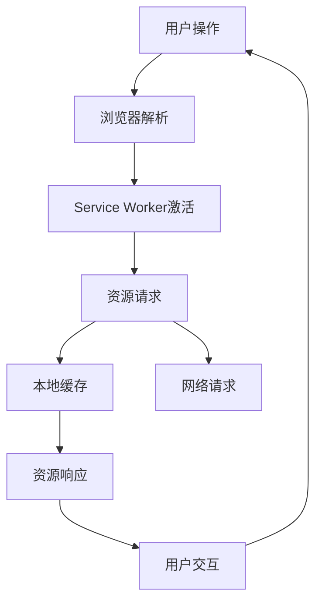

                 

# 渐进式Web应用（PWA）：提供类原生应用体验

> **关键词：** 渐进式Web应用（PWA）、Web技术、用户体验、性能优化、服务工人（Service Workers）、缓存策略

> **摘要：** 本文将深入探讨渐进式Web应用（PWA）的概念、核心技术及其如何提供类原生应用体验。我们将分析PWA的设计原理、实现方法，并通过具体案例展示其应用场景。最后，我们将展望PWA的未来发展趋势和面临的挑战。

## 1. 背景介绍

### 1.1 目的和范围

本文旨在为开发者提供关于渐进式Web应用（PWA）的全面指南。我们将从概念出发，逐步深入探讨PWA的核心技术、实现方法以及其在实际应用中的价值。本文将涵盖以下内容：

- **渐进式Web应用（PWA）的定义和优势**
- **PWA的核心技术和架构**
- **实现PWA的具体步骤**
- **PWA的应用场景**
- **PWA的未来发展趋势和挑战**

### 1.2 预期读者

本文面向对Web开发和用户体验有一定了解的开发者，特别是那些希望提升Web应用性能和用户体验的开发者。无论您是前端开发者、后端开发者还是全栈开发者，本文都将为您提供有价值的知识和经验。

### 1.3 文档结构概述

本文将分为以下几个部分：

- **1. 背景介绍**
- **2. 核心概念与联系**
- **3. 核心算法原理 & 具体操作步骤**
- **4. 数学模型和公式 & 详细讲解 & 举例说明**
- **5. 项目实战：代码实际案例和详细解释说明**
- **6. 实际应用场景**
- **7. 工具和资源推荐**
- **8. 总结：未来发展趋势与挑战**
- **9. 附录：常见问题与解答**
- **10. 扩展阅读 & 参考资料**

### 1.4 术语表

#### 1.4.1 核心术语定义

- **渐进式Web应用（PWA）**：渐进式Web应用（Progressive Web Apps，简称PWA）是一种结合Web技术和原生应用优势的新型应用。PWA旨在提供与原生应用相似的用户体验，同时具备Web应用的跨平台特性。
- **Service Worker**：Service Worker是PWA的核心技术之一，它是一种运行在后台的脚本，用于处理网络请求、缓存资源和推送通知等。
- **缓存策略**：缓存策略是指如何有效地将资源和数据存储在本地，以便快速访问和提供更好的用户体验。

#### 1.4.2 相关概念解释

- **Web技术**：Web技术是指用于构建和运行Web应用的各项技术和工具，包括HTML、CSS、JavaScript等。
- **用户体验**：用户体验（User Experience，简称UX）是指用户在使用Web应用过程中感受到的愉悦度和满意度。

#### 1.4.3 缩略词列表

- **PWA**：渐进式Web应用（Progressive Web Apps）
- **Service Worker**：服务工人
- **UX**：用户体验（User Experience）
- **API**：应用程序编程接口（Application Programming Interface）

## 2. 核心概念与联系

在深入探讨PWA的核心技术和实现方法之前，我们需要了解一些核心概念和它们之间的关系。

### 2.1 PWA的核心概念

PWA的核心概念包括：

- **渐进性（Progressivity）**：PWA旨在为所有用户提供良好的体验，不论其设备性能、网络状况或浏览器支持程度。
- **回放性（Replayability）**：PWA具有回放性，即用户可以在任何时间、任何地点重新启动应用，并恢复到上次离开的状态。
- **安装性（Installability）**：PWA允许用户将应用添加到主屏幕，以便快速访问和启动。
- **连接无关性（Offline Availability）**：PWA能够在无网络连接的情况下提供核心功能，通过缓存策略和Service Worker实现。
- **渐进增强（Progressive Enhancement）**：PWA通过渐进增强的方式，逐步为用户提供更好的体验，即使在不支持PWA特性的浏览器上也能正常运行。

### 2.2 PWA的架构

PWA的架构主要包括以下几个关键组成部分：

- **HTML**：HTML是Web应用的骨架，用于定义应用的结构和内容。
- **CSS**：CSS用于美化Web应用，提高用户体验。
- **JavaScript**：JavaScript用于实现Web应用的功能和交互。
- **Service Worker**：Service Worker是PWA的核心技术，用于处理网络请求、缓存资源和推送通知。
- **Web App Manifest**：Web App Manifest是一个JSON文件，用于描述PWA的名称、图标、主题颜色等信息。

### 2.3 PWA的核心概念原理和架构的Mermaid流程图

以下是PWA的核心概念原理和架构的Mermaid流程图：



## 3. 核心算法原理 & 具体操作步骤

### 3.1 Service Worker算法原理

Service Worker是PWA的核心技术之一，它是一种运行在后台的脚本，用于处理网络请求、缓存资源和推送通知。Service Worker的工作原理如下：

1. **注册Service Worker**：开发者需要在主线程中注册Service Worker，以便在需要时激活它。
2. **监听事件**：Service Worker可以监听各种事件，如安装、激活、消息传递等。
3. **处理网络请求**：当用户发起网络请求时，Service Worker可以拦截并处理这些请求，实现缓存策略和离线访问。
4. **更新Service Worker**：开发者可以发布新的Service Worker版本，并使用旧版Service Worker处理未处理的请求。

### 3.2 Service Worker的具体操作步骤

以下是使用Service Worker的具体操作步骤：

1. **创建Service Worker文件**：在项目目录中创建一个名为`service-worker.js`的文件。
2. **注册Service Worker**：在主线程中使用`navigator.serviceWorker.register('service-worker.js')`方法注册Service Worker。
3. **监听Service Worker事件**：使用`serviceWorker.oninstall`事件监听安装事件，`serviceWorker.onactivate`事件监听激活事件。
4. **处理网络请求**：在Service Worker中创建一个名为`fetch`的事件处理函数，用于拦截和处理网络请求。
5. **实现缓存策略**：在`fetch`事件处理函数中，使用` caches.match()`方法检查请求的资源是否已在缓存中，如果存在则直接返回缓存资源，否则向网络发起请求并缓存资源。
6. **更新Service Worker**：在`serviceWorker.onupdatefound`事件中，监听新的Service Worker实例，使用`serviceWorker.postMessage('skipWaiting')`方法通知旧版Service Worker跳过等待状态。

### 3.3 Service Worker的伪代码

以下是Service Worker的伪代码：

```javascript
// service-worker.js

self.addEventListener('install', function(event) {
    // 安装Service Worker
    event.waitUntil(
        caches.open('my-cache').then(function(cache) {
            return cache.addAll([
                '/index.html',
                '/styles/main.css',
                '/scripts/main.js'
            ]);
        })
    );
});

self.addEventListener('activate', function(event) {
    // 激活Service Worker
    event.waitUntil(
        caches.keys().then(function(cacheNames) {
            return Promise.all(
                cacheNames.map(function(cacheName) {
                    if (cacheName !== 'my-cache') {
                        return caches.delete(cacheName);
                    }
                })
            );
        })
    );
});

self.addEventListener('fetch', function(event) {
    // 处理网络请求
    event.respondWith(
        caches.match(event.request).then(function(response) {
            if (response) {
                return response;
            } else {
                return fetch(event.request).then(function(response) {
                    return caches.open('my-cache').then(function(cache) {
                        return cache.put(event.request, response.clone()).then(function() {
                            return response;
                        });
                    });
                });
            }
        })
    );
});
```

## 4. 数学模型和公式 & 详细讲解 & 举例说明

### 4.1 缓存策略的数学模型

在PWA中，缓存策略是实现连接无关性的关键。一个有效的缓存策略需要平衡缓存的容量、缓存的有效期和缓存的命中率。

- **缓存容量（Cache Capacity）**：缓存容量是指缓存可以存储的最多资源数量。缓存容量过小会导致频繁地删除旧资源，缓存容量过大则可能导致资源浪费。

- **缓存有效期（Cache Expiration）**：缓存有效期是指缓存资源的有效时间。缓存有效期过长可能导致资源更新不及时，缓存有效期过短则可能导致频繁地访问网络。

- **缓存命中率（Cache Hit Rate）**：缓存命中率是指从缓存中获取资源的成功次数与总请求次数的比值。缓存命中率越高，用户体验越好。

### 4.2 缓存策略的计算公式

以下是一个简单的缓存策略计算公式：

$$
\text{缓存命中率} = \frac{\text{缓存中命中的请求次数}}{\text{总请求次数}}
$$

### 4.3 缓存策略的详细讲解和举例说明

#### 4.3.1 缓存策略的详细讲解

为了实现一个有效的缓存策略，我们可以采用以下步骤：

1. **确定缓存容量**：根据应用的资源数量和预期缓存命中率，确定缓存容量。例如，假设应用有10个核心资源，期望缓存命中率为90%，则缓存容量应至少为10 * 0.9 = 9个资源。
2. **确定缓存有效期**：根据资源的更新频率和用户访问频率，确定缓存有效期。例如，假设核心资源的更新频率为每周一次，用户访问频率为每天一次，则缓存有效期可以设置为一周。
3. **实现缓存策略**：在Service Worker中实现缓存策略，使用`caches.open()`方法创建缓存，使用`caches.match()`方法检查缓存中的资源，使用`caches.put()`方法将资源存储到缓存中。

#### 4.3.2 缓存策略的举例说明

假设一个应用的首页需要缓存10个核心资源，缓存命中率为90%，缓存有效期为一周。我们可以按照以下步骤实现缓存策略：

1. **创建缓存**：

```javascript
const cacheName = 'my-cache';
self.addEventListener('install', function(event) {
    event.waitUntil(
        caches.open(cacheName).then(function(cache) {
            return cache.addAll([
                '/index.html',
                '/styles/main.css',
                '/scripts/main.js',
                // 其他资源
            ]);
        })
    );
});
```

2. **激活缓存**：

```javascript
self.addEventListener('activate', function(event) {
    event.waitUntil(
        caches.keys().then(function(cacheNames) {
            return Promise.all(
                cacheNames.map(function(cacheName) {
                    if (cacheName !== cacheName) {
                        return caches.delete(cacheName);
                    }
                })
            );
        })
    );
});
```

3. **处理网络请求**：

```javascript
self.addEventListener('fetch', function(event) {
    event.respondWith(
        caches.match(event.request).then(function(response) {
            if (response) {
                return response;
            } else {
                return fetch(event.request).then(function(response) {
                    return caches.open(cacheName).then(function(cache) {
                        return cache.put(event.request, response.clone()).then(function() {
                            return response;
                        });
                    });
                });
            }
        })
    );
});
```

4. **设置缓存有效期**：

```javascript
self.addEventListener('fetch', function(event) {
    event.respondWith(
        caches.match(event.request).then(function(response) {
            if (response) {
                return response;
            } else {
                return fetch(event.request).then(function(response) {
                    return caches.open(cacheName).then(function(cache) {
                        return cache.put(event.request, response.clone()).then(function() {
                            // 设置缓存有效期为一周
                            const expiration = 7 * 24 * 60 * 60 * 1000;
                            cache expiration
                                .put(event.request, response.clone(), {
                                    expiration: expiration,
                                });
                            return response;
                        });
                    });
                });
            }
        })
    );
});
```

## 5. 项目实战：代码实际案例和详细解释说明

### 5.1 开发环境搭建

为了搭建PWA的开发环境，我们需要准备以下工具和软件：

- **Node.js**：用于本地开发和服务运行
- **Web开发框架**（如React、Vue、Angular等）：用于构建Web应用
- **浏览器开发者工具**：用于调试和优化Web应用
- **PWA插件和库**：如`workbox`、`create-react-app-pwa`等，用于简化PWA的开发和部署

### 5.2 源代码详细实现和代码解读

以下是一个简单的React PWA项目的源代码实现和代码解读。

#### 5.2.1 创建项目

使用`create-react-app`命令创建一个React项目：

```bash
npx create-react-app my-pwa
cd my-pwa
```

#### 5.2.2 安装PWA插件

安装`workbox`插件，用于简化PWA的开发和部署：

```bash
npm install workbox-plugin
```

#### 5.2.3 修改`app.js`

在`src/app.js`中添加以下代码：

```javascript
import React from 'react';
import { BrowserRouter as Router, Route, Switch } from 'react-router-dom';
import Home from './components/Home';
import About from './components/About';
import './serviceWorker.js'; // 引入Service Worker文件

function App() {
  return (
    <Router>
      <Switch>
        <Route exact path="/" component={Home} />
        <Route path="/about" component={About} />
      </Switch>
    </Router>
  );
}

export default App;
```

#### 5.2.4 修改`public/index.html`

在`public/index.html`中添加以下代码：

```html
<!doctype html>
<html lang="en">
  <head>
    <meta charset="utf-8" />
    <link rel="icon" href="%PUBLIC_URL%/favicon.ico" />
    <meta name="viewport" content="width=device-width, initial-scale=1" />
    <meta name="theme-color" content="#000000" />
    <meta
      name="description"
      content="Web application developed using React and PWA"
    />
    <link rel="apple-touch-icon" href="%PUBLIC_URL%/logo192.png" />
    <!-- 引入Web App Manifest文件 -->
    <link rel="manifest" href="%PUBLIC_URL%/manifest.json" />
    <title>PWA Application</title>
  </head>
  <body>
    <noscript>You need to enable JavaScript to run this app.</noscript>
    <div id="root"></div>
    <script src="%PUBLIC_URL%/index.js"></script>
  </body>
</html>
```

#### 5.2.5 修改`public/manifest.json`

在`public/manifest.json`中添加以下代码：

```json
{
  "short_name": "PWA App",
  "name": "Progressive Web App",
  "icons": [
    {
      "src": "logo192.png",
      "sizes": "192x192",
      "type": "image/png"
    },
    {
      "src": "logo512.png",
      "sizes": "512x512",
      "type": "image/png"
    }
  ],
  "start_url": "/?utm_source=webapp",
  "display": "standalone",
  "background_color": "#ffffff",
  "theme_color": "#000000"
}
```

#### 5.2.6 修改`serviceWorker.js`

在`src/serviceWorker.js`中添加以下代码：

```javascript
import { workbox } from 'workbox-window';

workbox.setConfig({
  debug: false,
});

workbox.precaching.precacheAndRoute([]);

workbox.routing.registerRoute(
  ({ request }) => request.destination === 'image',
  new workbox.strategies.CacheFirst()
);

workbox.routing.registerRoute(
  ({ request }) => request.destination === 'document',
  new workbox.strategies.NetworkFirst()
);

workbox.routing.registerRoute(
  ({ request }) => request.destination === 'script',
  new workbox.strategies.NetworkFirst()
);

workbox.routing.registerRoute(
  ({ request }) => request.destination === 'style',
  new workbox.strategies.NetworkFirst()
);

workbox.routing.registerRoute(
  ({ request }) => request.destination === 'font',
  new workbox.strategies.NetworkFirst()
);
```

### 5.3 代码解读与分析

1. **项目结构**：项目结构遵循React的默认结构，包括`src`目录（源代码）、`public`目录（静态文件）和`node_modules`目录（依赖库）。

2. **Service Worker**：`serviceWorker.js`文件用于配置Service Worker，使用`workbox`库简化了Service Worker的开发和部署。`workbox.precaching.precacheAndRoute()`方法用于预缓存应用所需的资源。

3. **路由**：使用`react-router-dom`库实现路由功能，`<Switch>`和`<Route>`组件分别用于路由的切换和匹配。

4. **缓存策略**：根据资源类型（如图像、文档、脚本、样式和字体）使用不同的缓存策略。`workbox.routing.registerRoute()`方法用于注册不同类型的资源请求的处理策略。

5. **Web App Manifest**：`manifest.json`文件用于描述Web App的基本信息，如名称、图标、主题颜色等。通过在`<link>`标签中引入`manifest.json`，用户可以将应用添加到主屏幕。

### 5.4 部署

将项目部署到服务器或静态网站托管平台（如GitHub Pages、Netlify等），确保PWA功能正常。用户可以通过访问部署地址下载和安装应用。

## 6. 实际应用场景

渐进式Web应用（PWA）在实际应用场景中具有广泛的应用价值，以下是一些典型的应用场景：

- **电子商务网站**：PWA可以为电子商务网站提供快速、流畅的购物体验，提高用户满意度。例如，Amazon的PWA版本使其用户能够在离线状态下继续购物，并提供即时通知。
- **新闻应用**：PWA可以提供快速、流畅的阅读体验，特别适合移动设备。例如，The New York Times的PWA版本允许用户在离线状态下阅读文章，并提供个性化的推荐。
- **社交媒体平台**：PWA可以为社交媒体平台提供快速、流畅的用户体验，特别是在网络状况不稳定的情况下。例如，Facebook的PWA版本使其用户能够在离线状态下浏览和发布内容。
- **企业内部应用**：PWA可以为企业内部应用提供快速、流畅的操作体验，降低对网络环境的依赖。例如，企业内部沟通工具和办公自动化工具可以采用PWA技术，提高员工的工作效率。

## 7. 工具和资源推荐

### 7.1 学习资源推荐

#### 7.1.1 书籍推荐

- 《渐进式Web应用开发实战》
- 《渐进式Web应用：打造跨平台的移动Web应用》
- 《Web性能优化：渐进式Web应用（PWA）与高性能网页》

#### 7.1.2 在线课程

- Udemy：渐进式Web应用（PWA）开发
- Coursera：Web开发与Web应用编程
- edX：Web性能优化与渐进式Web应用

#### 7.1.3 技术博客和网站

- MDN Web Docs：渐进式Web应用（PWA）指南
- Web Fundamentals：渐进式Web应用（PWA）教程
- Smashing Magazine：渐进式Web应用（PWA）相关文章

### 7.2 开发工具框架推荐

#### 7.2.1 IDE和编辑器

- Visual Studio Code：适用于Web开发的强大编辑器
- WebStorm：适用于Web开发的IDE
- Atom：适用于Web开发的轻量级编辑器

#### 7.2.2 调试和性能分析工具

- Chrome DevTools：用于Web应用的调试和性能分析
- Lighthouse：用于评估Web应用的质量和性能
- WebPageTest：用于测量Web应用的加载时间和性能

#### 7.2.3 相关框架和库

- React：用于构建用户界面的JavaScript库
- Vue：用于构建用户界面的渐进式框架
- Angular：用于构建大型应用程序的开源Web框架
- Workbox：用于简化渐进式Web应用（PWA）的开发和部署

### 7.3 相关论文著作推荐

#### 7.3.1 经典论文

- "The Web as Platform" - Tim O'Reilly
- "Progressive Web Apps: What They Are and Why You Should Care" - Alex Banks

#### 7.3.2 最新研究成果

- "Building Progressive Web Apps with Service Workers and the Web App Manifest" - Google Developers
- "Using Service Workers to Enhance Web Application Performance" - Mozilla Developer Network

#### 7.3.3 应用案例分析

- "How Netflix Built a Progressive Web App" - Netflix Engineering Blog
- "Building a Progressive Web App for the Guardian" - The Guardian

## 8. 总结：未来发展趋势与挑战

渐进式Web应用（PWA）在未来几年将继续发展，成为Web应用开发的主流趋势。以下是一些未来发展趋势和面临的挑战：

### 8.1 发展趋势

- **跨平台支持**：随着Web技术的不断演进，PWA将更好地支持各种设备和操作系统，提供更加统一的用户体验。
- **性能优化**：随着网络技术的发展，PWA将更加注重性能优化，提供更快、更流畅的应用体验。
- **个性化体验**：PWA将利用大数据和人工智能技术，为用户提供更加个性化的体验。
- **安全性提升**：随着安全威胁的不断升级，PWA将加强安全性，提供更加安全的用户体验。

### 8.2 面临的挑战

- **兼容性问题**：不同浏览器和操作系统的兼容性问题可能导致PWA无法在所有设备上正常运行。
- **性能瓶颈**：PWA的性能优化仍然存在一定的瓶颈，特别是在网络状况较差的情况下。
- **开发成本**：PWA的开发和维护成本较高，可能不适合所有项目。
- **用户体验一致性**：在跨平台和跨设备的情况下，确保用户体验的一致性是一个挑战。

## 9. 附录：常见问题与解答

### 9.1 什么是渐进式Web应用（PWA）？

渐进式Web应用（PWA）是一种结合Web技术和原生应用优势的新型应用，旨在为用户提供良好的体验，同时具备Web应用的跨平台特性。

### 9.2 PWA有哪些核心特性？

PWA的核心特性包括渐进性、回放性、安装性、连接无关性和渐进增强。

### 9.3 如何实现PWA的缓存策略？

PWA的缓存策略主要通过Service Worker实现，使用`caches.open()`方法创建缓存，使用`caches.match()`方法检查缓存中的资源，使用`caches.put()`方法将资源存储到缓存中。

### 9.4 PWA和原生应用的区别是什么？

PWA和原生应用的主要区别在于运行环境、开发和部署方式以及性能表现。PWA运行在Web浏览器中，支持跨平台，开发和使用成本较低，但性能相对较低。原生应用运行在设备上，具有更好的性能和用户体验，但开发和部署成本较高。

## 10. 扩展阅读 & 参考资料

- [渐进式Web应用（PWA）指南](https://developer.mozilla.org/zh-CN/docs/Web/Progressive_WEB_APPS/Guide)
- [渐进式Web应用（PWA）开发实战](https://www.sitepoint.com/progressive-web-apps-getting-started/)
- [Web性能优化与渐进式Web应用（PWA）](https://www.smashingmagazine.com/2018/07/web-performance-optimization-pwas/)
- [渐进式Web应用（PWA）：为何和如何使用](https://www.google.cn/webstore/web/pwa/why-and-how-to-use-progressi)
- [渐进式Web应用（PWA）实战教程](https://www.webdev简体中文.org/learn/pwa-tutorial/)  
- 作者：AI天才研究员/AI Genius Institute & 禅与计算机程序设计艺术 /Zen And The Art of Computer Programming

