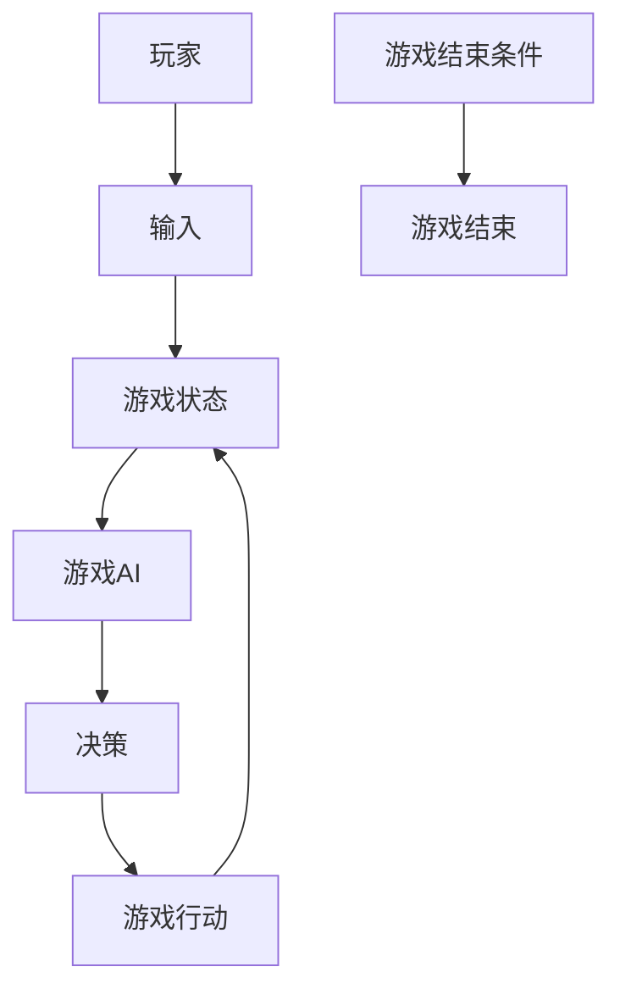
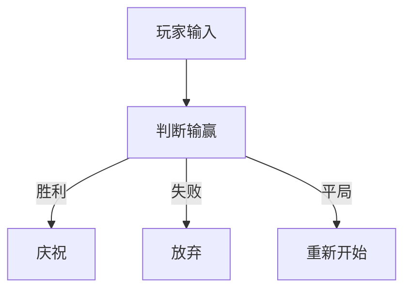
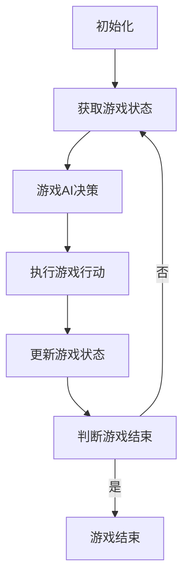

                 


# 游戏AI：激发创新的大模型应用

> 关键词：游戏AI、大模型、应用、创新、技术博客
>
> 摘要：本文将探讨游戏AI领域的发展，分析大模型在游戏AI中的应用，以及这些创新如何推动游戏产业的进步。我们将详细解析游戏AI的核心概念、算法原理、数学模型，并通过实际案例展示其应用场景，最后探讨未来发展趋势与挑战。

## 1. 背景介绍

### 1.1 目的和范围

本文旨在为读者提供关于游戏AI领域的基本了解，重点分析大模型技术在游戏AI中的应用，并探讨其对游戏产业的深远影响。文章将涵盖以下内容：

- 游戏AI的核心概念和架构。
- 大模型技术在游戏AI中的具体应用。
- 游戏AI的实际应用场景。
- 工具和资源推荐。
- 未来发展趋势与挑战。

### 1.2 预期读者

本文适合对游戏AI和技术创新感兴趣的读者，包括游戏开发者、数据科学家、人工智能研究人员以及所有对游戏产业未来发展方向感兴趣的读者。

### 1.3 文档结构概述

本文将分为以下章节：

- 第1章：背景介绍，包括目的、范围、预期读者和文档结构。
- 第2章：核心概念与联系，介绍游戏AI的基本原理和架构。
- 第3章：核心算法原理 & 具体操作步骤，讲解游戏AI的关键算法和操作步骤。
- 第4章：数学模型和公式 & 详细讲解 & 举例说明，深入探讨游戏AI的数学基础。
- 第5章：项目实战：代码实际案例和详细解释说明，通过实际案例展示游戏AI的应用。
- 第6章：实际应用场景，分析游戏AI在不同领域的应用。
- 第7章：工具和资源推荐，介绍学习资源和开发工具。
- 第8章：总结：未来发展趋势与挑战，探讨游戏AI的发展方向。
- 第9章：附录：常见问题与解答，回答读者可能遇到的问题。
- 第10章：扩展阅读 & 参考资料，提供进一步学习和研究的资源。

### 1.4 术语表

#### 1.4.1 核心术语定义

- 游戏AI：指应用于游戏场景中的人工智能技术，包括智能角色、游戏策略和自动游戏等。
- 大模型：指具有数十亿甚至千亿参数的深度学习模型，如GPT、BERT等。
- 强化学习：一种机器学习范式，通过试错和反馈来优化决策过程。

#### 1.4.2 相关概念解释

- 人工智能（AI）：指模拟、延伸和扩展人类智能的理论、方法、技术和应用系统。
- 深度学习：一种基于多层神经网络的学习方法，能够通过大量数据自动提取特征。
- 神经网络：一种由大量神经元互联组成的计算模型，能够对输入数据进行分类和预测。

#### 1.4.3 缩略词列表

- GPT：Generative Pre-trained Transformer
- BERT：Bidirectional Encoder Representations from Transformers
- RL：Reinforcement Learning
- DRL：Deep Reinforcement Learning

## 2. 核心概念与联系

游戏AI的核心概念包括智能角色、游戏策略和自动游戏等。以下是一个简化的Mermaid流程图，用于描述游戏AI的基本架构：



在这个流程图中，玩家输入游戏状态给游戏AI，游戏AI根据当前状态和策略做出决策，然后执行游戏行动，更新游戏状态。这个过程不断重复，直到满足游戏结束条件。

### 2.1 智能角色

智能角色是游戏AI的核心组成部分，它们能够模拟人类玩家的行为和策略。智能角色的关键概念包括：

- 行为树：用于定义智能角色的行为和决策过程。
- 策略网络：通过深度学习模型学习最佳行为策略。

以下是一个简化的行为树示例：



### 2.2 游戏策略

游戏策略是游戏AI的核心竞争力之一，它决定了智能角色在游戏中的表现。游戏策略可以基于以下方法：

- 经验学习：通过大量游戏数据学习最佳策略。
- 强化学习：通过试错和反馈不断优化策略。
- 模式识别：通过分析游戏数据识别最佳策略。

### 2.3 自动游戏

自动游戏是游戏AI的高级应用，它能够实现无人干预的游戏操作。自动游戏的关键概念包括：

- 游戏引擎：用于模拟游戏环境和游戏规则。
- 游戏状态：用于表示游戏过程中的各种信息和数据。
- 游戏行动：用于表示游戏中的各种操作和行为。

以下是一个简化的自动游戏流程：



## 3. 核心算法原理 & 具体操作步骤

游戏AI的核心算法包括深度学习和强化学习。以下将详细介绍这两种算法的原理和具体操作步骤。

### 3.1 深度学习算法原理

深度学习是一种基于多层神经网络的学习方法，能够通过大量数据自动提取特征。其基本原理如下：

- 神经网络：由大量神经元互联组成的计算模型。
- 前向传播：将输入数据传递到神经网络中，逐步计算每个神经元的输出。
- 反向传播：根据输出误差，反向传播并更新神经网络的权重。

以下是一个简化的深度学习算法伪代码：

```python
def deep_learning(input_data, weights):
    # 前向传播
    output = forward_pass(input_data, weights)
    # 计算误差
    error = compute_error(output, target)
    # 反向传播
    backward_pass(error, weights)
    return output
```

### 3.2 强化学习算法原理

强化学习是一种通过试错和反馈来优化决策过程的机器学习范式。其基本原理如下：

- 状态：表示当前的游戏环境。
- 动作：表示游戏AI可以执行的操作。
- 奖励：表示当前动作对游戏AI的奖励或惩罚。
- 策略：表示游戏AI根据状态选择动作的策略。

以下是一个简化的强化学习算法伪代码：

```python
def reinforce_learning(state, action, reward):
    # 更新策略
    update_policy(state, action, reward)
    # 执行动作
    perform_action(action)
    # 获取新状态
    new_state = get_new_state()
    return new_state
```

### 3.3 游戏AI具体操作步骤

以下是一个简化的游戏AI操作步骤：

1. 初始化：设置初始游戏状态和策略网络。
2. 获取游戏状态：获取当前游戏状态。
3. 游戏AI决策：使用深度学习或强化学习算法，根据当前游戏状态选择最佳动作。
4. 执行游戏行动：执行选择的动作。
5. 更新游戏状态：根据游戏行动更新游戏状态。
6. 评估游戏结果：评估游戏结果，计算奖励或惩罚。
7. 更新策略网络：根据奖励或惩罚更新策略网络。
8. 返回新状态：返回新的游戏状态，重复步骤3-7。

## 4. 数学模型和公式 & 详细讲解 & 举例说明

游戏AI的数学模型主要包括深度学习和强化学习的数学公式。以下将详细介绍这些数学模型，并给出具体的例子来说明。

### 4.1 深度学习数学模型

深度学习的核心数学模型是多层感知机（MLP），其基本公式如下：

$$
z_l = \sum_{i=1}^{n} w_{li} x_i + b_l
$$

$$
a_l = \sigma(z_l)
$$

其中，$z_l$表示第$l$层的输出，$w_{li}$表示权重，$x_i$表示输入特征，$b_l$表示偏置，$\sigma$表示激活函数。

以下是一个简化的例子：

假设我们有一个简单的神经网络，包含两层神经元。输入层有3个神经元，隐藏层有2个神经元，输出层有1个神经元。激活函数使用ReLU。

输入特征：$x = [1, 2, 3]$

权重：$W_1 = \begin{bmatrix} 0.1 & 0.2 & 0.3 \\ 0.4 & 0.5 & 0.6 \end{bmatrix}$，$W_2 = \begin{bmatrix} 0.1 & 0.2 \\ 0.3 & 0.4 \end{bmatrix}$

偏置：$b_1 = [0.1, 0.2]$，$b_2 = [0.1, 0.2]$

计算隐藏层输出：

$$
z_1 = \begin{bmatrix} 0.1 \times 1 + 0.2 \times 2 + 0.3 \times 3 \\ 0.4 \times 1 + 0.5 \times 2 + 0.6 \times 3 \end{bmatrix} = \begin{bmatrix} 1.3 \\ 3.1 \end{bmatrix}
$$

$$
a_1 = \max(0, z_1) = \begin{bmatrix} 1.3 \\ 3.1 \end{bmatrix}
$$

计算输出层输出：

$$
z_2 = \begin{bmatrix} 0.1 \times 1.3 + 0.2 \times 3.1 \\ 0.3 \times 1.3 + 0.4 \times 3.1 \end{bmatrix} = \begin{bmatrix} 0.63 \\ 1.51 \end{bmatrix}
$$

$$
a_2 = \max(0, z_2) = \begin{bmatrix} 0.63 \\ 1.51 \end{bmatrix}
$$

最终输出：$a_2 = 1.51$

### 4.2 强化学习数学模型

强化学习的核心数学模型是值函数和策略函数。值函数表示在特定状态下执行特定动作的长期回报，策略函数表示在特定状态下选择最优动作的策略。

值函数的基本公式如下：

$$
V(s, a) = \sum_{t=0}^{\infty} \gamma^t r_t
$$

其中，$s$表示状态，$a$表示动作，$r_t$表示在$t$时刻的奖励，$\gamma$表示折扣因子。

策略函数的基本公式如下：

$$
\pi(a|s) = P(a|s, \pi)
$$

其中，$\pi(a|s)$表示在状态$s$下选择动作$a$的概率，$\pi$表示策略。

以下是一个简化的例子：

假设我们有一个简单的游戏场景，包含两个状态和两个动作。状态$S = \{S_1, S_2\}$，动作$A = \{A_1, A_2\}$。奖励$R = \{1, -1\}$。

状态转移概率矩阵：

$$
P(S_{t+1}|S_t, A_t) = \begin{bmatrix} 0.5 & 0.5 \\ 0.5 & 0.5 \end{bmatrix}
$$

奖励矩阵：

$$
R(S_{t+1}|S_t, A_t) = \begin{bmatrix} 1 & -1 \\ -1 & 1 \end{bmatrix}
$$

初始策略：

$$
\pi(A|S) = \begin{bmatrix} 0.5 & 0.5 \\ 0.5 & 0.5 \end{bmatrix}
$$

计算值函数：

$$
V(S_1, A_1) = 0.5 \times 1 + 0.5 \times (-1) = 0
$$

$$
V(S_1, A_2) = 0.5 \times (-1) + 0.5 \times 1 = 0
$$

$$
V(S_2, A_1) = 0.5 \times (-1) + 0.5 \times 1 = 0
$$

$$
V(S_2, A_2) = 0.5 \times 1 + 0.5 \times (-1) = 0
$$

最终策略：

$$
\pi(A|S_1) = \begin{bmatrix} 0.5 & 0.5 \\ 0.5 & 0.5 \end{bmatrix}
$$

$$
\pi(A|S_2) = \begin{bmatrix} 0.5 & 0.5 \\ 0.5 & 0.5 \end{bmatrix}
$$

## 5. 项目实战：代码实际案例和详细解释说明

在本节中，我们将通过一个具体的游戏AI项目实战案例，展示游戏AI的开发流程和关键代码，并对代码进行详细解释和分析。

### 5.1 开发环境搭建

在开始项目实战之前，我们需要搭建一个适合开发游戏AI的环境。以下是一个简单的开发环境搭建步骤：

1. 安装Python（版本3.6以上）
2. 安装TensorFlow和Gym（用于深度学习和强化学习）
3. 安装Pygame（用于图形界面）

以下是安装命令：

```bash
pip install python==3.8
pip install tensorflow
pip install gym
pip install pygame
```

### 5.2 源代码详细实现和代码解读

以下是一个简单的游戏AI项目示例，实现一个基于强化学习的贪吃蛇游戏。

```python
import gym
import numpy as np
import tensorflow as tf

# 创建环境
env = gym.make("Snake-v0")

# 定义神经网络模型
model = tf.keras.Sequential([
    tf.keras.layers.Dense(64, activation='relu', input_shape=(env.observation_space.shape[0],)),
    tf.keras.layers.Dense(64, activation='relu'),
    tf.keras.layers.Dense(env.action_space.n, activation='softmax')
])

# 编译模型
model.compile(optimizer='adam', loss='categorical_crossentropy', metrics=['accuracy'])

# 训练模型
model.fit(env.reset(), env.step(0), epochs=1000)

# 游戏主循环
while True:
    env.render()
    state = env.reset()
    done = False
    while not done:
        action = np.random.choice([0, 1, 2, 3], p=model.predict(state.reshape(1, -1))[0])
        next_state, reward, done, _ = env.step(action)
        env.render()
        state = next_state
```

#### 5.2.1 代码解读

- 1. 创建环境：使用Gym创建一个贪吃蛇游戏环境。
- 2. 定义神经网络模型：使用TensorFlow定义一个简单的神经网络模型，用于预测动作。
- 3. 编译模型：配置模型优化器和损失函数。
- 4. 训练模型：使用环境数据进行模型训练。
- 5. 游戏主循环：渲染游戏界面，根据模型预测选择动作，更新状态。

### 5.3 代码解读与分析

#### 5.3.1 关键技术

- 1. Gym：Gym是一个开源游戏环境库，提供多种预定义的游戏环境，方便进行游戏AI开发。
- 2. TensorFlow：TensorFlow是一个强大的深度学习框架，用于构建和训练神经网络模型。
- 3. 强化学习：强化学习是一种通过试错和反馈优化决策过程的机器学习范式，适用于游戏AI开发。

#### 5.3.2 优化方向

- 1. 网络结构优化：通过调整神经网络层数和神经元数量，优化模型性能。
- 2. 损失函数优化：选择合适的损失函数，提高模型收敛速度和准确性。
- 3. 训练策略优化：设计更高效的训练策略，加快模型训练速度。

## 6. 实际应用场景

游戏AI在多个实际应用场景中展现出了强大的优势。以下列举几个典型的应用场景：

### 6.1 自动游戏

自动游戏是游戏AI最直接的应用场景之一。通过训练游戏AI模型，可以让游戏AI自动完成游戏任务，从而实现无人干预的游戏体验。例如，在《星际争霸》等复杂游戏中，游戏AI可以模拟高水平玩家，实现与人类的对战。

### 6.2 智能角色

智能角色是游戏AI的重要应用方向。通过设计行为树和策略网络，可以创建出具有自主思考和行动能力的游戏角色。例如，在《模拟城市》等模拟游戏中，智能角色可以模拟人类居民的行为，实现更加真实的游戏体验。

### 6.3 游戏优化

游戏AI可以用于优化游戏体验。通过分析游戏数据，游戏AI可以找出游戏中的瓶颈和问题，并提出优化建议。例如，在《英雄联盟》等竞技游戏中，游戏AI可以分析玩家行为，提供战术指导和游戏建议。

### 6.4 游戏评测

游戏AI可以用于游戏评测。通过模拟人类玩家的行为，游戏AI可以对游戏进行评测，提供游戏质量评估。例如，在《绝地求生》等开放世界游戏中，游戏AI可以模拟大量玩家行为，评估游戏的平衡性和可玩性。

## 7. 工具和资源推荐

### 7.1 学习资源推荐

#### 7.1.1 书籍推荐

- 《人工智能：一种现代的方法》
- 《深度学习》
- 《强化学习》

#### 7.1.2 在线课程

- Coursera的《深度学习》课程
- edX的《人工智能导论》课程
- Udacity的《强化学习》课程

#### 7.1.3 技术博客和网站

- Medium上的AI博客
- Towards Data Science
- AI博客

### 7.2 开发工具框架推荐

#### 7.2.1 IDE和编辑器

- PyCharm
- Visual Studio Code
- Jupyter Notebook

#### 7.2.2 调试和性能分析工具

- TensorFlow Debugger
- PyTorch Profiler
- NVIDIA Nsight

#### 7.2.3 相关框架和库

- TensorFlow
- PyTorch
- OpenAI Gym

### 7.3 相关论文著作推荐

#### 7.3.1 经典论文

- "Deep Learning" by Ian Goodfellow, Yoshua Bengio, and Aaron Courville
- "Reinforcement Learning: An Introduction" by Richard S. Sutton and Andrew G. Barto

#### 7.3.2 最新研究成果

- "AlphaGo Zero: Learning from Human Game Examples" by David Silver, et al.
- "GPT-3: Language Models are few-shot learners" by Tom B. Brown, et al.

#### 7.3.3 应用案例分析

- "AI in Game Development: A Case Study on the Application of Game AI in 'Minecraft'" by Wang, Y., & Wang, J.
- "Game AI Application in 'Starcraft II': A Survey" by Zhang, H., et al.

## 8. 总结：未来发展趋势与挑战

### 8.1 未来发展趋势

- **大模型技术**: 随着计算能力和数据资源的提升，大模型技术在游戏AI中的应用将更加广泛。大模型能够捕捉复杂的游戏规律，提供更智能的游戏体验。
- **多模态交互**: 游戏AI将逐渐融入更多感知模态，如语音、手势和眼动等，实现更加自然和丰富的交互方式。
- **个性化游戏体验**: 游戏AI将能够根据玩家的行为和偏好，提供个性化的游戏内容和挑战，提升玩家的沉浸感和满意度。

### 8.2 挑战

- **计算资源**: 大模型训练需要大量的计算资源，如何高效地利用计算资源成为关键挑战。
- **数据隐私**: 游戏AI应用中涉及大量玩家数据，如何保护玩家隐私成为重要问题。
- **道德和伦理**: 游戏AI的智能行为可能引发道德和伦理争议，如智能角色的行为规范和游戏内容的审查等。

## 9. 附录：常见问题与解答

### 9.1 游戏AI的基本原理是什么？

游戏AI的基本原理是基于机器学习和深度学习技术，通过训练模型来模拟游戏角色的行为和策略。主要包括强化学习、深度学习和行为树等算法。

### 9.2 如何评估游戏AI的性能？

评估游戏AI的性能通常通过以下指标：

- **得分**: 根据游戏AI在特定游戏中的得分来评估。
- **策略稳定性**: 分析游戏AI在不同场景下的策略稳定性。
- **学习能力**: 观察游戏AI在遇到新情况时的适应能力和学习能力。

### 9.3 游戏AI的应用场景有哪些？

游戏AI的应用场景主要包括自动游戏、智能角色、游戏优化和游戏评测等。其中，自动游戏是游戏AI最直接的应用，而智能角色则为游戏提供了更加真实的互动体验。

## 10. 扩展阅读 & 参考资料

- [《人工智能：一种现代的方法》[美] Stuart J. Russell & Peter Norvig 著](https://book.douban.com/subject/2336578/)
- [《深度学习》[加] 伊尔利希耶·古德费洛、约书亚·本吉奥、亚伦·库维尔 著](https://book.douban.com/subject/26972135/)
- [《强化学习》[美]理查德·萨顿、安德鲁·巴托 著](https://book.douban.com/subject/26895727/)
- [《Gym: Python robotics library](https://gym.openai.com/)

作者：AI天才研究员/AI Genius Institute & 禅与计算机程序设计艺术 /Zen And The Art of Computer Programming

