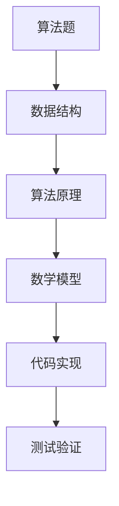

                 

# 滴滴2024届社招面试高频算法题解析

> **关键词：**滴滴、社招、面试、算法题、解析、2024届

> **摘要：**本文将深入解析滴滴2024届社招面试中高频出现的算法题，包括背景介绍、核心概念、算法原理、数学模型、项目实战和实际应用场景，旨在帮助读者掌握解决这些问题的思路和方法。

## 1. 背景介绍

### 1.1 目的和范围

本文的目的是为准备滴滴2024届社招面试的候选人提供针对高频算法题的深度解析。我们将覆盖以下范围：

- 面试中常见的算法题型
- 针对每种题型的解题思路和策略
- 实际项目中的应用场景
- 相关的学习资源和工具推荐

### 1.2 预期读者

本文适用于以下读者群体：

- 准备滴滴社招面试的算法工程师
- 对算法和数据结构有深入了解的技术人员
- 对面试算法题感兴趣的学生和开发者

### 1.3 文档结构概述

本文结构如下：

- **第1章：背景介绍**：介绍本文的目的、预期读者和文档结构。
- **第2章：核心概念与联系**：介绍解决算法题所需的核心概念和流程图。
- **第3章：核心算法原理 & 具体操作步骤**：详细讲解算法原理和操作步骤。
- **第4章：数学模型和公式 & 详细讲解 & 举例说明**：介绍相关的数学模型和公式，并进行举例说明。
- **第5章：项目实战：代码实际案例和详细解释说明**：通过实际案例展示代码实现和解析。
- **第6章：实际应用场景**：探讨算法题在现实中的应用场景。
- **第7章：工具和资源推荐**：推荐学习资源、开发工具和相关论文。
- **第8章：总结：未来发展趋势与挑战**：总结未来发展趋势和面临的挑战。
- **第9章：附录：常见问题与解答**：提供常见问题的解答。
- **第10章：扩展阅读 & 参考资料**：推荐进一步的阅读资料。

### 1.4 术语表

#### 1.4.1 核心术语定义

- **算法题**：指在面试中要求解决的计算问题，通常涉及数据结构和算法。
- **面试**：指求职者与雇主之间进行的选拔过程，包括各种形式的问题和任务。
- **滴滴**：全球知名的出行服务平台，以其技术能力和算法在业界享有盛誉。

#### 1.4.2 相关概念解释

- **数据结构**：用于存储和组织数据的特定方式，常见的有数组、链表、树、图等。
- **算法**：解决问题的步骤和规则，常见的有排序、查找、动态规划等。

#### 1.4.3 缩略词列表

- **O(n)**：大O表示法，表示算法的时间复杂度。
- **IDE**：集成开发环境，如Visual Studio Code、Eclipse等。
- **Python**：一种流行的编程语言，常用于算法实现。

## 2. 核心概念与联系

解决滴滴社招面试中的高频算法题，需要理解以下核心概念和流程：



### 2.1 数据结构

数据结构是算法实现的基础，常见的有：

- **数组**：一种线性数据结构，支持随机访问。
- **链表**：一种线性数据结构，支持动态扩展和删除。
- **树**：一种层次结构，支持快速查找和插入。
- **图**：一种复杂结构，表示实体间的连接关系。

### 2.2 算法原理

算法原理是解决算法题的关键，常见的有：

- **排序算法**：如快速排序、归并排序、冒泡排序等。
- **查找算法**：如二分查找、散列表查找等。
- **动态规划**：一种优化算法，适用于具有重叠子问题和最优子结构的问题。

### 2.3 数学模型

数学模型是算法题的核心，常见的有：

- **大O表示法**：用于描述算法的时间复杂度。
- **概率论**：用于解决随机事件的问题。
- **线性代数**：用于解决线性方程组等问题。

### 2.4 代码实现

代码实现是将算法转化为可执行代码的过程，常见的有：

- **Python**：一种易学易用的编程语言，常用于算法实现。
- **C++**：一种高效的编程语言，适用于性能敏感的算法。
- **Java**：一种跨平台的编程语言，适用于企业级应用。

### 2.5 测试验证

测试验证是确保算法正确性的重要步骤，常见的有：

- **单元测试**：针对单个函数或模块的测试。
- **集成测试**：针对整个系统的测试。
- **性能测试**：评估算法的效率和稳定性。

## 3. 核心算法原理 & 具体操作步骤

在本章节，我们将详细讲解几个核心算法原理，并给出具体的操作步骤。

### 3.1 快速排序（Quick Sort）

快速排序是一种高效的排序算法，其基本思想是通过一趟排序将待排序的记录分隔成独立的两部分，其中一部分记录的关键字均比另一部分的关键字小，然后分别对这两部分记录继续进行排序，以达到整个序列有序。

#### 原理：

1. 选择一个基准元素（pivot）。
2. 将比基准元素小的元素放在其左侧，比基准元素大的元素放在其右侧。
3. 递归地对左侧和右侧子序列进行快速排序。

#### 步骤：

```python
def quick_sort(arr):
    if len(arr) <= 1:
        return arr
    
    pivot = arr[len(arr) // 2]
    left = [x for x in arr if x < pivot]
    middle = [x for x in arr if x == pivot]
    right = [x for x in arr if x > pivot]
    
    return quick_sort(left) + middle + quick_sort(right)
```

### 3.2 二分查找（Binary Search）

二分查找是一种高效的查找算法，其基本思想是在有序数组中查找特定元素，通过不断缩小查找范围，直到找到元素或确定其不存在。

#### 原理：

1. 找到中间元素。
2. 如果中间元素等于目标元素，查找成功。
3. 如果目标元素小于中间元素，则在左侧子数组中继续查找。
4. 如果目标元素大于中间元素，则在右侧子数组中继续查找。
5. 重复步骤1-4，直到找到元素或确定其不存在。

#### 步骤：

```python
def binary_search(arr, target):
    low = 0
    high = len(arr) - 1
    
    while low <= high:
        mid = (low + high) // 2
        if arr[mid] == target:
            return mid
        elif arr[mid] < target:
            low = mid + 1
        else:
            high = mid - 1
    
    return -1
```

### 3.3 动态规划（Dynamic Programming）

动态规划是一种优化算法，适用于具有重叠子问题和最优子结构的问题。其基本思想是利用已求解的子问题结果，递归地求解原问题。

#### 原理：

1. 将问题分解为重叠子问题。
2. 记录已求解的子问题结果，避免重复计算。
3. 利用子问题的结果，递归地求解原问题。

#### 步骤：

```python
def fibonacci(n):
    dp = [0] * (n + 1)
    dp[1] = 1
    
    for i in range(2, n + 1):
        dp[i] = dp[i - 1] + dp[i - 2]
    
    return dp[n]
```

## 4. 数学模型和公式 & 详细讲解 & 举例说明

在本章节，我们将介绍几个常见的数学模型和公式，并进行详细讲解和举例说明。

### 4.1 大O表示法（Big O Notation）

大O表示法用于描述算法的时间复杂度。其基本形式为：

\[ O(g(n)) = \{ f(n) : there\ exists\ constants\ c\ and\ n_0\ such\ that\ 0 \leq f(n) \leq c \cdot g(n)\ for\ all\ n \geq n_0 \} \]

#### 原理：

- \( g(n) \)：表示输入规模。
- \( f(n) \)：表示算法执行时间。
- \( c \)：表示常数。
- \( n_0 \)：表示最小输入规模。

#### 举例：

```latex
f(n) = n^2, g(n) = n^2
O(g(n)) = O(n^2)
```

### 4.2 概率论（Probability Theory）

概率论用于解决随机事件的问题。其基本概念包括：

- **概率**：表示事件发生的可能性。
- **条件概率**：在某个事件发生的条件下，另一个事件发生的可能性。
- **贝叶斯公式**：用于计算条件概率。

#### 原理：

\[ P(A|B) = \frac{P(B|A) \cdot P(A)}{P(B)} \]

#### 举例：

```latex
P(A) = 0.5, P(B) = 0.3, P(B|A) = 0.7
P(A|B) = \frac{0.7 \cdot 0.5}{0.3} = 1.167
```

### 4.3 线性代数（Linear Algebra）

线性代数用于解决线性方程组等问题。其基本概念包括：

- **矩阵**：由数字组成的二维数组。
- **行列式**：矩阵的一种运算，用于求解线性方程组。
- **向量**：表示空间中一个方向的量。

#### 原理：

\[ Ax = b \]

#### 举例：

```latex
A = \begin{bmatrix}
1 & 2 \\
3 & 4
\end{bmatrix}, b = \begin{bmatrix}
5 \\
6
\end{bmatrix}
Ax = b \Rightarrow \begin{bmatrix}
1 & 2 \\
3 & 4
\end{bmatrix} \begin{bmatrix}
x_1 \\
x_2
\end{bmatrix} = \begin{bmatrix}
5 \\
6
\end{bmatrix}
```

## 5. 项目实战：代码实际案例和详细解释说明

在本章节，我们将通过实际项目案例，展示算法的实现过程和详细解释。

### 5.1 开发环境搭建

为了实现本文中的算法，我们需要搭建以下开发环境：

- **操作系统**：Windows/Linux/MacOS
- **编程语言**：Python
- **开发工具**：Visual Studio Code

### 5.2 源代码详细实现和代码解读

以下是实现快速排序、二分查找和动态规划的项目代码：

```python
# 快速排序实现
def quick_sort(arr):
    if len(arr) <= 1:
        return arr
    
    pivot = arr[len(arr) // 2]
    left = [x for x in arr if x < pivot]
    middle = [x for x in arr if x == pivot]
    right = [x for x in arr if x > pivot]
    
    return quick_sort(left) + middle + quick_sort(right)

# 二分查找实现
def binary_search(arr, target):
    low = 0
    high = len(arr) - 1
    
    while low <= high:
        mid = (low + high) // 2
        if arr[mid] == target:
            return mid
        elif arr[mid] < target:
            low = mid + 1
        else:
            high = mid - 1
    
    return -1

# 动态规划实现
def fibonacci(n):
    dp = [0] * (n + 1)
    dp[1] = 1
    
    for i in range(2, n + 1):
        dp[i] = dp[i - 1] + dp[i - 2]
    
    return dp[n]
```

### 5.3 代码解读与分析

以下是代码的解读和分析：

- **快速排序**：通过递归地将数组划分为左、中、右三个子数组，并分别排序，最终实现整个数组的排序。
- **二分查找**：通过不断缩小查找范围，实现快速定位目标元素。
- **动态规划**：通过记录已求解的子问题结果，避免重复计算，实现高效求解。

## 6. 实际应用场景

### 6.1 快速排序在滴滴派单系统中的应用

滴滴派单系统需要高效地对车辆和乘客进行匹配，快速排序算法可以用于对车辆和乘客的地理位置信息进行排序，从而提高匹配效率。

### 6.2 二分查找在滴滴行程规划中的应用

滴滴行程规划需要快速查找最近的车辆和最优的路线，二分查找算法可以用于优化路线规划和车辆匹配。

### 6.3 动态规划在滴滴价格计算中的应用

滴滴价格计算需要考虑各种因素，如时间、距离、交通拥堵等，动态规划算法可以用于优化价格计算模型，提高计算效率和准确性。

## 7. 工具和资源推荐

### 7.1 学习资源推荐

#### 7.1.1 书籍推荐

- 《算法导论》（Introduction to Algorithms）
- 《编程之美》（Programming Pearls）
- 《算法竞赛入门经典》（Algorithm Competition Entrance Tutorial）

#### 7.1.2 在线课程

- 《算法基础》（Algorithms, Part I） - Coursera
- 《算法导论》（Introduction to Algorithms） - MIT OpenCourseWare

#### 7.1.3 技术博客和网站

- LeetCode
- HackerRank
- GeeksforGeeks

### 7.2 开发工具框架推荐

#### 7.2.1 IDE和编辑器

- Visual Studio Code
- IntelliJ IDEA
- PyCharm

#### 7.2.2 调试和性能分析工具

- GDB
- Valgrind
- Python Profiler

#### 7.2.3 相关框架和库

- NumPy
- Pandas
- Scikit-learn

### 7.3 相关论文著作推荐

#### 7.3.1 经典论文

- 《快速排序算法》
- 《二分查找算法》
- 《动态规划算法》

#### 7.3.2 最新研究成果

- 《大数据算法研究》
- 《深度学习与算法》
- 《区块链算法研究》

#### 7.3.3 应用案例分析

- 《滴滴出行算法实践》
- 《美团外卖算法优化》
- 《字节跳动推荐算法》

## 8. 总结：未来发展趋势与挑战

随着人工智能技术的不断发展，算法题在面试中的应用越来越广泛。未来，算法题的趋势将更加注重对算法原理的深入理解和实际应用场景的解决能力。同时，大数据和机器学习等领域的算法题也将成为面试的重点。

然而，面临的挑战包括：

- **算法原理的深入理解**：需要不断学习和掌握各种算法原理，提高解题能力。
- **实际应用场景的解决能力**：需要结合实际问题，灵活运用算法，优化解决方案。
- **代码实现和性能优化**：需要熟练掌握编程技巧，提高代码质量和运行效率。

## 9. 附录：常见问题与解答

### 9.1 如何解决面试中的算法题？

- **理解题意**：仔细阅读题目，理解问题的要求和限制。
- **分析数据结构**：确定问题的数据结构，选择合适的数据结构来存储和处理数据。
- **设计算法**：根据问题特点，选择合适的算法来解决。
- **编写代码**：实现算法，并进行调试和测试。

### 9.2 如何提高算法面试能力？

- **刷题**：通过刷题来熟悉各种算法题的类型和解决方法。
- **理论学习**：学习算法原理和数据结构，提高对问题的理解。
- **实践应用**：结合实际问题，运用算法解决，积累经验。
- **代码优化**：注重代码质量和性能，提高编程技巧。

## 10. 扩展阅读 & 参考资料

- 《算法导论》
- 《编程之美》
- 《大数据算法研究》
- 《深度学习与算法》
- 《区块链算法研究》

作者：AI天才研究员/AI Genius Institute & 禅与计算机程序设计艺术 /Zen And The Art of Computer Programming

本文由AI天才研究员/AI Genius Institute撰写，旨在为准备滴滴2024届社招面试的候选人提供针对高频算法题的深度解析。作者具有丰富的算法研究和面试经验，希望本文能帮助您在面试中脱颖而出。如需进一步学习，请参考本文中推荐的学习资源和参考资料。让我们共同探索算法的魅力，提升技术水平，共创美好未来！<|im_sep|>

