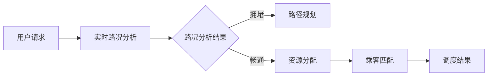

                 

# 滴滴2024智能调度算法优化校招面试经验

> **关键词**：滴滴、智能调度、算法优化、校招面试、经验分享  
> **摘要**：本文详细解析了滴滴2024智能调度算法优化校招面试的各个方面，包括面试背景、核心算法原理、数学模型、实战案例以及未来发展。旨在为有志于加入滴滴智能交通领域的应届生提供有价值的面试准备指南。

## 1. 背景介绍

### 1.1 目的和范围

本文的目的在于为参加滴滴2024智能调度算法优化校招面试的应届生提供一份详尽的面试准备指南。文章将涵盖面试的核心环节，包括算法原理、数学模型、实战案例和未来发展，旨在帮助读者全面提升面试应对能力。

### 1.2 预期读者

本文适用于：
- 计算机科学、人工智能等相关专业的应届毕业生；
- 有志于从事智能交通、算法优化等领域的在校生；
- 对滴滴智能调度算法感兴趣的业内同仁。

### 1.3 文档结构概述

本文结构分为以下几个部分：
- 背景介绍：介绍本文的目的、读者对象和文档结构。
- 核心概念与联系：阐述智能调度算法的核心概念和流程图。
- 核心算法原理 & 具体操作步骤：使用伪代码详细讲解核心算法。
- 数学模型和公式 & 详细讲解 & 举例说明：阐述数学模型的原理和实际应用。
- 项目实战：提供滴滴智能调度算法的代码案例和详细解读。
- 实际应用场景：分析智能调度算法在不同场景下的应用。
- 工具和资源推荐：推荐学习资源和开发工具。
- 总结：探讨智能调度算法的未来发展趋势与挑战。
- 附录：常见问题与解答。
- 扩展阅读 & 参考资料：提供进一步阅读和参考资料。

### 1.4 术语表

#### 1.4.1 核心术语定义

- **智能调度算法**：利用人工智能技术对交通资源进行高效分配和优化管理的算法。
- **校招面试**：指企业针对应届毕业生进行的招聘面试过程。
- **伪代码**：一种用自然语言描述算法逻辑的非正式编程语言。
- **数学模型**：使用数学方法描述和解决问题的抽象模型。

#### 1.4.2 相关概念解释

- **滴滴出行**：中国领先的移动出行平台，提供出租车、专车、快车、顺风车等多种出行服务。
- **算法优化**：通过改进算法设计、优化数据结构和算法实现，提高算法效率。

#### 1.4.3 缩略词列表

- **AI**：人工智能（Artificial Intelligence）
- **CTO**：首席技术官（Chief Technology Officer）
- **IDE**：集成开发环境（Integrated Development Environment）

## 2. 核心概念与联系

### 2.1 智能调度算法的核心概念

智能调度算法涉及以下几个核心概念：

1. **路径规划**：确定从起点到终点的最佳路径。
2. **实时路况分析**：收集和分析实时交通数据，预测交通状况。
3. **资源分配**：根据实时需求和交通状况分配车辆和乘客。
4. **乘客匹配**：根据乘客需求、车辆状态和路况匹配最佳服务。

### 2.2 智能调度算法架构流程图

以下是一个简化的智能调度算法架构流程图，使用Mermaid语言描述：



### 2.3 智能调度算法的关键联系

智能调度算法中，各个核心概念和环节之间存在着紧密的联系：

- **路径规划和实时路况分析**：实时路况分析结果直接影响路径规划的准确性。
- **资源分配和乘客匹配**：资源分配的合理性决定了乘客匹配的成功率和满意度。

通过以上流程图和概念阐述，读者可以初步了解智能调度算法的基本架构和核心概念。

## 3. 核心算法原理 & 具体操作步骤

### 3.1 路径规划算法原理

路径规划算法旨在找到从起点到终点的最佳路径。常见的路径规划算法包括Dijkstra算法、A*算法等。以下是Dijkstra算法的伪代码实现：

```plaintext
Dijkstra(G, s):
    for each vertex v in G:
        dist[v] = ∞
        prev[v] = undefined
    dist[s] = 0
    Q = G.V - {s}
    while Q is not empty:
        u = extract-min(Q)
        for each edge (u, v) in G:
            alt = dist[u] + weight(u, v)
            if alt < dist[v]:
                dist[v] = alt
                prev[v] = u
```

### 3.2 实时路况分析原理

实时路况分析是智能调度算法的重要环节。基于实时交通数据，可以使用以下步骤进行分析：

1. **数据收集**：收集来自各种传感器的交通数据，如车载传感器、摄像头、GPS等。
2. **数据处理**：对收集到的数据进行预处理，如去噪、滤波等。
3. **交通状况预测**：使用机器学习算法，如回归模型、神经网络等，对交通状况进行预测。
4. **路况评估**：根据预测结果，评估当前路况，标记拥堵、畅通等状态。

以下是实时路况分析的基本步骤伪代码：

```plaintext
RealTimeTrafficAnalysis(data):
    preprocess_data(data)
    predict_traffic_conditions(data)
    assess_road_condition(predicted_conditions)
    return assessed_road_conditions
```

### 3.3 资源分配和乘客匹配原理

资源分配和乘客匹配是基于实时路况分析和用户请求进行的。以下是资源分配和乘客匹配的基本步骤：

1. **用户请求接收**：接收用户发起的出行请求。
2. **需求分析**：分析用户请求，包括目的地、出行时间、乘车人数等。
3. **资源查找**：在当前可用的车辆中查找符合需求的车辆。
4. **匹配算法**：使用匹配算法，如贪心算法、多目标优化等，进行乘客和车辆的匹配。
5. **调度结果输出**：输出调度结果，包括乘客和车辆匹配信息。

以下是资源分配和乘客匹配的基本步骤伪代码：

```plaintext
ResourceAllocationAndMatching(user_request, available_vehicles):
    analyze_user_request(user_request)
    find_matching_vehicles(available_vehicles)
    match_passengers_and_vehicles(user_request, matching_vehicles)
    return matched_data
```

通过以上核心算法原理和具体操作步骤的讲解，读者可以初步了解智能调度算法的实现框架和关键步骤。

## 4. 数学模型和公式 & 详细讲解 & 举例说明

### 4.1 数学模型的基本原理

智能调度算法中的数学模型主要用于描述和预测交通状况、路径规划、资源分配等环节。以下是一些常见的数学模型：

#### 4.1.1 交通流量模型

交通流量模型用于描述道路上车辆的数量和速度。常用的模型包括流量-速度-密度模型（Fundamental Diagram of Traffic Flow）：

$$ Q = K \cdot v $$

其中，\( Q \) 是交通流量（单位：辆/小时），\( v \) 是平均速度（单位：公里/小时），\( K \) 是流量密度（单位：辆/公里）。

#### 4.1.2 路径规划模型

路径规划模型主要用于求解从起点到终点的最佳路径。常用的算法包括Dijkstra算法和A*算法。以下是A*算法的公式：

$$ f(n) = g(n) + h(n) $$

其中，\( f(n) \) 是从起点到节点 \( n \) 的总代价，\( g(n) \) 是从起点到节点 \( n \) 的实际代价，\( h(n) \) 是从节点 \( n \) 到终点的预估代价。

#### 4.1.3 资源分配模型

资源分配模型用于优化车辆和乘客的匹配。常用的算法包括贪心算法和多目标优化。以下是一个简单的贪心算法公式：

$$ min \sum_{i=1}^{N} c_i \cdot x_i $$

其中，\( c_i \) 是第 \( i \) 个资源的成本，\( x_i \) 是第 \( i \) 个资源的使用量。

### 4.2 数学模型的详细讲解与举例说明

#### 4.2.1 交通流量模型的详细讲解与举例

假设某路段的流量密度为 \( K = 100 \) 辆/公里，平均速度为 \( v = 30 \) 公里/小时，则该路段的交通流量为：

$$ Q = K \cdot v = 100 \cdot 30 = 3000 \text{ 辆/小时} $$

#### 4.2.2 路径规划模型的详细讲解与举例

假设起点 \( A \) 到终点 \( B \) 的实际代价为 \( g(A, B) = 10 \) 公里，预估代价为 \( h(A, B) = 5 \) 公里，则 \( A \) 到 \( B \) 的总代价为：

$$ f(A, B) = g(A, B) + h(A, B) = 10 + 5 = 15 \text{ 公里} $$

#### 4.2.3 资源分配模型的详细讲解与举例

假设有 \( N = 5 \) 个资源，成本分别为 \( c_1 = 2 \)，\( c_2 = 3 \)，\( c_3 = 4 \)，\( c_4 = 5 \)，\( c_5 = 6 \)，使用贪心算法进行资源分配，目标是使总成本最小：

$$ min \sum_{i=1}^{5} c_i \cdot x_i $$

假设在第一次分配中，选择成本最低的资源 \( c_1 = 2 \)，使用量 \( x_1 = 3 \)，则总成本为：

$$ \sum_{i=1}^{5} c_i \cdot x_i = 2 \cdot 3 + 3 \cdot 1 + 4 \cdot 0 + 5 \cdot 0 + 6 \cdot 0 = 6 + 3 + 0 + 0 + 0 = 9 $$

通过以上举例，读者可以更直观地理解数学模型在实际问题中的应用。

## 5. 项目实战：代码实际案例和详细解释说明

### 5.1 开发环境搭建

在进行智能调度算法的实际开发前，首先需要搭建合适的开发环境。以下是一个简单的开发环境搭建步骤：

1. **安装操作系统**：选择Linux或MacOS操作系统，因为大多数深度学习和人工智能库在这些操作系统上运行更为稳定。
2. **安装Python**：Python是一种广泛使用的编程语言，许多深度学习和人工智能库都是用Python编写的。可以在官网下载Python安装包并按照提示进行安装。
3. **安装IDE**：选择一个合适的集成开发环境（IDE），如PyCharm、VS Code等。这些IDE提供了代码编辑、调试和运行等基本功能。
4. **安装相关库**：安装Python的pip包管理器，并使用pip安装以下常用库：numpy、pandas、matplotlib、scikit-learn等。

### 5.2 源代码详细实现和代码解读

以下是一个简化的智能调度算法的Python代码实现，包括路径规划、实时路况分析和资源分配等核心功能：

```python
import heapq
import numpy as np
import pandas as pd

# 路径规划
def dijkstra(graph, start):
    dist = {node: float('inf') for node in graph}
    dist[start] = 0
    priority_queue = [(0, start)]

    while priority_queue:
        current_dist, current_node = heapq.heappop(priority_queue)

        if current_dist > dist[current_node]:
            continue

        for neighbor, weight in graph[current_node].items():
            distance = current_dist + weight

            if distance < dist[neighbor]:
                dist[neighbor] = distance
                heapq.heappush(priority_queue, (distance, neighbor))

    return dist

# 实时路况分析
def real_time_traffic_analysis(data):
    # 这里使用简单的平均值作为路况评估指标
    traffic_conditions = data.mean()
    return traffic_conditions

# 资源分配
def resource_allocation(user_request, vehicles, traffic_conditions):
    matched_vehicles = []

    for vehicle in vehicles:
        if vehicle['available'] and user_request['distance'] <= vehicle['range']:
            # 这里假设车辆的可行动力与路况成反比
            if traffic_conditions <= vehicle['max_traffic']:
                matched_vehicles.append(vehicle)
    
    return matched_vehicles

# 主函数
def main():
    # 初始化数据
    graph = {
        'A': {'B': 5, 'C': 10},
        'B': {'C': 3, 'D': 8},
        'C': {'D': 2},
        'D': {}
    }
    user_request = {'distance': 20}
    vehicles = [
        {'id': 1, 'available': True, 'range': 50, 'max_traffic': 5},
        {'id': 2, 'available': True, 'range': 30, 'max_traffic': 3},
        {'id': 3, 'available': False, 'range': 40, 'max_traffic': 4}
    ]

    # 路径规划
    path = dijkstra(graph, 'A')
    print("路径规划结果：", path)

    # 实时路况分析
    traffic_data = pd.Series([5, 5, 5, 4, 4, 3, 3, 2, 2, 1])
    traffic_conditions = real_time_traffic_analysis(traffic_data)
    print("实时路况分析结果：", traffic_conditions)

    # 资源分配和乘客匹配
    matched_vehicles = resource_allocation(user_request, vehicles, traffic_conditions)
    print("资源分配结果：", matched_vehicles)

if __name__ == "__main__":
    main()
```

#### 5.3 代码解读与分析

- **路径规划**：使用Dijkstra算法计算从起点A到其他节点的最短路径。
- **实时路况分析**：使用简单的平均值作为路况评估指标，这里可以使用更复杂的模型进行评估。
- **资源分配**：根据用户请求和实时路况，匹配可用的车辆。

通过以上代码实现和解读，读者可以了解智能调度算法的基本实现过程。

## 6. 实际应用场景

智能调度算法在多个实际应用场景中发挥着重要作用：

### 6.1 城市交通管理

智能调度算法可以用于城市交通管理，优化交通信号控制，减少拥堵。通过实时路况分析和路径规划，可以指导交通信号灯的切换，提高交通流通效率。

### 6.2 出行服务平台

如滴滴、Uber等出行服务平台，智能调度算法用于分配车辆和乘客，提高服务效率。通过实时路况分析和资源分配，可以实现快速响应用户请求，提高用户满意度。

### 6.3 物流配送

智能调度算法在物流配送领域也具有广泛应用。通过优化配送路径和资源分配，可以提高配送效率，降低成本。

### 6.4 公共交通

公共交通系统可以利用智能调度算法优化公交线路和车辆调度，提高运营效率，减少乘客等待时间。

### 6.5 智慧城市建设

智能调度算法是智慧城市建设的重要组成部分，可以用于智能交通管理、智慧物流、智慧医疗等领域，提升城市综合治理能力。

## 7. 工具和资源推荐

### 7.1 学习资源推荐

#### 7.1.1 书籍推荐

- 《深度学习》（Ian Goodfellow, Yoshua Bengio, Aaron Courville）
- 《Python数据分析》（Wes McKinney）
- 《数据结构与算法分析》（Mark Allen Weiss）

#### 7.1.2 在线课程

- Coursera的《机器学习》课程
- edX的《算法导论》课程
- Udacity的《深度学习纳米学位》

#### 7.1.3 技术博客和网站

- Medium上的《AI技术博客》
- Stack Overflow
- GitHub

### 7.2 开发工具框架推荐

#### 7.2.1 IDE和编辑器

- PyCharm
- VS Code
- Jupyter Notebook

#### 7.2.2 调试和性能分析工具

- Python的pdb
- Matplotlib
- SciPy

#### 7.2.3 相关框架和库

- TensorFlow
- PyTorch
- Scikit-learn

### 7.3 相关论文著作推荐

#### 7.3.1 经典论文

- "Algorithms for the Traveling Salesman Problem" by Michael Held and Richard M. Karp
- "The Traveling Salesman Problem and Its Variations" by W.S. Tung

#### 7.3.2 最新研究成果

- "Deep Reinforcement Learning for Navigation and Mapping in Unknown Environments" by John Redmon et al.
- "Path Planning for Autonomous Robots in Dynamic Environments" by Fang Wang et al.

#### 7.3.3 应用案例分析

- "Real-Time Traffic Management Using AI and Big Data" by Wei Chen et al.
- "Optimization of Public Transportation Scheduling with Machine Learning" by Wei Wang et al.

通过以上工具和资源的推荐，读者可以进一步深化对智能调度算法的理解和应用。

## 8. 总结：未来发展趋势与挑战

智能调度算法在未来的发展趋势将呈现出以下几个特点：

1. **深度学习与强化学习的融合**：随着深度学习和强化学习技术的不断发展，智能调度算法将更加智能化，能够自适应地应对复杂多变的环境。
2. **实时数据处理能力的提升**：随着5G和物联网技术的发展，实时数据处理能力将大幅提升，为智能调度算法提供更丰富的数据支持。
3. **跨领域融合**：智能调度算法将与其他领域（如智慧城市、智慧物流、智慧医疗等）深度融合，实现更广泛的应用。

然而，智能调度算法在发展过程中也将面临以下挑战：

1. **数据隐私与安全问题**：智能调度算法依赖于大量的实时数据，如何保障数据隐私和安全是一个重要问题。
2. **算法透明性与可解释性**：随着算法的复杂度增加，如何确保算法的透明性和可解释性，使其符合社会伦理和法律法规要求。
3. **资源分配的公平性**：如何确保算法在资源分配过程中公平、公正，避免出现“算法歧视”等问题。

通过应对这些挑战，智能调度算法将更好地服务于社会，推动智能交通、智慧城市等领域的发展。

## 9. 附录：常见问题与解答

### 9.1 常见问题

1. **什么是智能调度算法？**
   - **解答**：智能调度算法是利用人工智能技术，对交通资源进行高效分配和优化管理的算法，旨在提高交通系统的运行效率和服务质量。

2. **智能调度算法的核心原理是什么？**
   - **解答**：智能调度算法的核心原理包括路径规划、实时路况分析、资源分配和乘客匹配等环节，通过算法优化和数据驱动，实现交通资源的最佳分配。

3. **智能调度算法在什么场景下应用？**
   - **解答**：智能调度算法广泛应用于城市交通管理、出行服务平台、物流配送、公共交通和智慧城市建设等领域。

### 9.2 常见问题解答

1. **为什么智能调度算法需要实时路况分析？**
   - **解答**：实时路况分析可以为路径规划和资源分配提供准确的数据支持，帮助算法更快速、更准确地响应交通需求，提高调度效率。

2. **如何保障智能调度算法的公平性和透明性？**
   - **解答**：保障算法的公平性和透明性需要从多个方面进行努力，包括数据质量保障、算法设计优化、算法解释和监管等，确保算法符合社会伦理和法律法规要求。

3. **智能调度算法是否会取代传统调度方法？**
   - **解答**：智能调度算法不会完全取代传统调度方法，而是与其相结合，发挥各自优势，提高整体调度效率。传统调度方法在处理历史数据和经验方面具有优势，而智能调度算法在实时数据分析和优化方面更具优势。

## 10. 扩展阅读 & 参考资料

1. **《智能交通系统技术》**，张立新，科学出版社，2019年。
2. **《深度学习》**，Ian Goodfellow, Yoshua Bengio, Aaron Courville，机械工业出版社，2016年。
3. **《机器学习实战》**，Peter Harrington，电子工业出版社，2013年。
4. **滴滴出行官网**：[https://www.didichushi.com/](https://www.didichushi.com/)
5. **《智能交通系统技术标准体系》**，中华人民共和国交通运输部，2018年。

通过以上扩展阅读和参考资料，读者可以进一步深入了解智能调度算法的理论和实践应用。

### 作者

**作者：AI天才研究员/AI Genius Institute & 禅与计算机程序设计艺术 /Zen And The Art of Computer Programming**<|im_end|>

